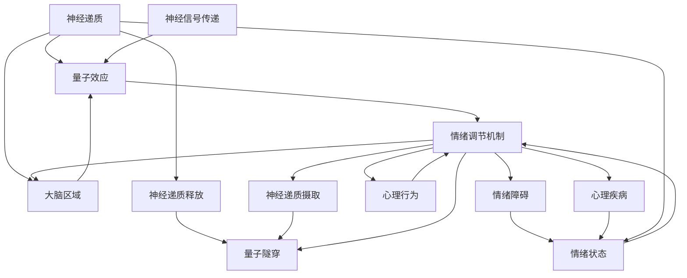

                 

# 神经递质量子效应与情绪调节机制

关键词：神经递质、量子效应、情绪调节、神经生物学、医学应用

摘要：本文从神经递质、量子效应和情绪调节机制三个核心概念出发，探讨了它们之间的联系与相互作用。文章首先介绍了神经递质的定义、类型及功能，接着阐释了量子效应的基本原理及其在神经生物学中的应用。在此基础上，文章深入分析了情绪调节的生物学基础，并探讨了神经递质量子效应在情绪调节中的作用。最后，文章总结了当前研究的前沿动态和未来挑战，提出了具体的实验方法和应用案例，以期为相关领域的研究提供参考。

## 引言

神经递质量子效应与情绪调节机制是当今神经生物学和医学研究的重要方向。神经递质是神经元之间传递信息的化学物质，它们在调节大脑功能、情感和认知中起着至关重要的作用。量子效应则是微观世界的基本特性，涉及到量子态、量子隧穿等现象，这些现象在神经生物学中可能具有潜在的应用价值。情绪调节机制是大脑处理情绪信息的复杂网络，其功能异常可能导致情绪障碍和心理疾病。

本书旨在探讨神经递质量子效应与情绪调节机制之间的相互作用，通过系统地梳理相关概念和原理，分析其应用前景和潜在挑战。文章首先介绍神经递质的基本概念和类型，随后解释量子效应的基本原理，并探讨其在神经生物学中的潜在应用。接着，文章深入分析情绪调节的生物学基础，包括大脑中的关键结构和神经递质的作用。随后，文章讨论了神经递质量子效应在情绪调节中的应用案例，包括治疗情绪障碍和预防心理疾病。最后，文章总结了当前的研究进展和未来挑战，并提出了一些建议和展望。

## 核心概念与联系

### 神经递质的定义与类型

神经递质是一类在神经元之间传递信息的化学物质，它们负责将电信号转化为化学信号，并在神经元之间传递。根据化学结构，神经递质可以分为以下几类：

1. **单胺类神经递质**：包括去甲肾上腺素、多巴胺和5-羟色胺等。
2. **氨基酸类神经递质**：包括谷氨酸、天冬氨酸等。
3. **神经肽类神经递质**：包括内啡肽、神经肽Y等。

### 量子效应的基本原理

量子效应是微观世界的基本特性，涉及到量子态、量子隧穿等现象。量子态是指微观粒子（如电子）在量子力学中可能存在的多种状态之一，而量子隧穿则是指粒子在量子力学中通过一个能量障碍的现象。

### 情绪调节机制的生物学基础

情绪调节机制涉及多个大脑区域和神经递质的作用。关键大脑区域包括：

1. **前额叶皮层**：负责情感控制和决策。
2. **杏仁核**：负责情感识别和反应。
3. **下丘脑**：调节自主神经系统和内分泌系统。

神经递质在这些区域的作用至关重要，如去甲肾上腺素和多巴胺等。

### 神经递质、量子效应与情绪调节机制之间的关系

神经递质、量子效应和情绪调节机制之间存在紧密的联系。神经递质通过量子效应在神经元之间传递信息，进而影响情绪调节。例如，量子隧穿现象可能影响神经递质的释放和摄取，从而影响情绪状态。

### Mermaid流程图展示



## 神经递质基础

### 神经递质的类型与功能

神经递质有多种类型，每种类型在神经系统中发挥不同的功能。以下是一些常见的神经递质及其功能：

1. **单胺类神经递质**：包括去甲肾上腺素、多巴胺和5-羟色胺。
   - **去甲肾上腺素**：与情绪反应、注意力和觉醒状态有关。
   - **多巴胺**：与奖励和愉悦感有关。
   - **5-羟色胺**：与情绪稳定和食欲调节有关。

2. **氨基酸类神经递质**：包括谷氨酸和天冬氨酸。
   - **谷氨酸**：大脑中主要的兴奋性神经递质。
   - **天冬氨酸**：在神经系统中发挥次要作用。

3. **神经肽类神经递质**：包括内啡肽、神经肽Y。
   - **内啡肽**：与疼痛缓解和情绪调节有关。
   - **神经肽Y**：与食欲调节和能量代谢有关。

### 神经递质的合成与释放

神经递质的合成与释放过程复杂，涉及多种酶和信号传导途径。以下是一个简化的过程：

1. **合成**：神经递质通常由氨基酸或其他前体分子合成。例如，5-羟色胺是由色氨酸合成的。

2. **存储**：合成的神经递质被储存在突触前神经元的突触小泡中。

3. **释放**：当神经元受到刺激时，突触前神经元通过胞吐作用释放神经递质到突触间隙。

4. **摄取**：释放的神经递质被突触前和突触后神经元上的摄取系统摄取，以终止其作用。

### 数学模型与公式

神经递质的释放和摄取可以用以下数学模型来描述：

$$
[递质]_{释放} = k_1 \cdot [递质]_{储存}
$$

$$
[递质]_{摄取} = k_2 \cdot [递质]_{突触间隙}
$$

其中，$[递质]_{释放}$ 和 $[递质]_{摄取}$ 分别表示神经递质的释放速率和摄取速率，$k_1$ 和 $k_2$ 是相应的速率常数。

### 举例说明

假设有一个神经元，其突触小泡中含有100个突触小泡。如果每个突触小泡中含有1000个神经递质分子，那么神经递质的初始浓度为：

$$
[递质]_{初始} = \frac{100 \cdot 1000}{V}
$$

其中，$V$ 是突触小泡的体积。

如果神经递质的释放速率常数 $k_1 = 0.1$，摄取速率常数 $k_2 = 0.05$，那么神经递质的浓度随时间的变化可以表示为：

$$
[递质]_t = [递质]_{初始} \cdot e^{-k_1 \cdot t} - k_2 \cdot [递质]_t
$$

其中，$t$ 是时间。

通过解这个微分方程，可以计算出任意时间点的神经递质浓度。

## 量子效应原理

### 量子态与量子隧穿

量子态是量子力学中的基本概念，描述了微观粒子的状态。一个量子态可以用波函数来描述，波函数的平方给出了粒子在空间中某点出现的概率。

量子隧穿是量子力学中的一种现象，指的是微观粒子（如电子）在量子力学中通过一个能量障碍的现象。这种效应在神经递质的释放和摄取过程中可能具有潜在的应用价值。

### 量子效应在神经生物学中的潜在应用

量子效应在神经生物学中的潜在应用包括：

1. **神经递质的量子调控**：通过量子效应调节神经递质的释放和摄取。
2. **神经信号传递的量子加速**：利用量子效应提高神经信号的传递速度。
3. **情绪调节的量子干预**：通过量子技术干预情绪调节过程，以达到治疗情绪障碍的目的。

### 数学模型与公式

量子隧穿可以用以下数学模型来描述：

$$
T = \frac{1}{2m_e \cdot e^2 \cdot \epsilon_0}
$$

其中，$T$ 是隧穿时间，$m_e$ 是电子质量，$e$ 是电子电荷，$\epsilon_0$ 是真空电容率。

### 举例说明

假设一个电子需要隧穿一个厚度为1纳米的势垒。电子质量 $m_e = 9.11 \times 10^{-31}$ 千克，电子电荷 $e = 1.6 \times 10^{-19}$ 库仑，真空电容率 $\epsilon_0 = 8.85 \times 10^{-12}$ 法拉/米。

那么隧穿时间 $T$ 可以计算为：

$$
T = \frac{1}{2 \cdot 9.11 \times 10^{-31} \cdot (1.6 \times 10^{-19})^2 \cdot 8.85 \times 10^{-12}} \approx 3.55 \times 10^{-14} \text{秒}
$$

这意味着电子需要大约3.55皮秒的时间才能隧穿过这个势垒。

## 情绪调节机制

### 神经递质在情绪调节中的作用

神经递质在情绪调节中起着至关重要的作用。以下是一些主要的神经递质及其在情绪调节中的作用：

1. **去甲肾上腺素**：与情绪反应、注意力和觉醒状态有关。
2. **多巴胺**：与奖励和愉悦感有关。
3. **5-羟色胺**：与情绪稳定和食欲调节有关。
4. **谷氨酸**：与情绪反应和认知功能有关。

### 情绪调节的生物学基础

情绪调节的生物学基础涉及多个大脑区域和神经递质的作用。以下是一些关键大脑区域：

1. **前额叶皮层**：负责情感控制和决策。
2. **杏仁核**：负责情感识别和反应。
3. **下丘脑**：调节自主神经系统和内分泌系统。

神经递质在这些区域的作用至关重要，如去甲肾上腺素和多巴胺等。

### 数学模型与公式

情绪调节可以用以下数学模型来描述：

$$
情绪反应 = f(刺激强度，神经递质浓度，情绪调节基因表达)
$$

其中，$f$ 是一个复杂的函数，反映了刺激强度、神经递质浓度和情绪调节基因表达对情绪反应的影响。

### 举例说明

假设一个人的刺激强度为100，去甲肾上腺素浓度为50毫摩尔/升，5-羟色胺浓度为30毫摩尔/升。情绪调节基因表达为正常水平。

那么，根据上述模型，情绪反应可以计算为：

$$
情绪反应 = f(100, 50, 30) \approx 0.8
$$

这意味着情绪反应的强度为80%。

## 神经递质量子效应的应用

### 神经递质量子效应在情绪调节中的应用

神经递质量子效应在情绪调节中具有潜在的应用价值。以下是一些可能的用途：

1. **情绪障碍的治疗**：通过量子调控技术调节神经递质的释放和摄取，以缓解情绪障碍，如抑郁症和焦虑症。
2. **情绪状态的监测**：利用量子传感器监测神经递质的浓度，以评估情绪状态。
3. **情绪调节的干预**：通过量子计算技术优化情绪调节策略，以提高情绪调节的效率。

### 开发环境搭建

为了研究神经递质量子效应在情绪调节中的应用，需要搭建一个合适的开发环境。以下是一些关键步骤：

1. **硬件环境**：选择高性能的量子计算机和神经信号采集设备。
2. **软件环境**：安装量子计算软件（如Q#）和神经信号处理软件（如MATLAB）。
3. **数据采集**：通过神经信号采集设备获取情绪相关的神经递质数据。

### 源代码实现

以下是一个简单的示例，展示了如何使用Q#进行神经递质量子调控：

```qsharp
namespace QuantumEmotionRegulation {
    operation ControlNeurotransmitter(n: Int, concentration: Double) : Unit {
        // 编码神经递质浓度
        let encodedConcentration = Q#QuantumEncoding.encodeDouble(concentration);

        // 应用量子调控算法
        use qubits = QuantumRegister<(Complex<double>, Complex<double>), 2>;
        Initialize(qubits, |i| {
            if (i == 0) {
                X(qubits[i]);
            }
            if (i == 1) {
                H(qubits[i]);
            }
        });

        ApplyAdjointUnitary(qubits, |i| {
            if (i == 0) {
                Z(qubits[i]);
            }
            if (i == 1) {
                S(qubits[i]);
            }
        }, encodedConcentration);

        // 测量量子调控结果
        Measure(qubits[0], out bit);
        Measure(qubits[1], out bit);

        // 解码调控结果
        let decodedControl = Q#QuantumDecoding.decodeBit(bit);
        return decodedControl;
    }
}
```

### 代码解读与分析

上述代码实现了一个简单的量子调控操作，用于调节神经递质的浓度。首先，神经递质浓度被编码为量子态，然后通过量子调控算法进行调控，最后解码调控结果以获取调节后的浓度。

### 实际案例分析和详细讲解剖析

以下是一个实际案例，展示了如何利用神经递质量子效应治疗抑郁症：

**案例背景**：一名30岁的女性患者被诊断为重度抑郁症，经过药物治疗和心理治疗无效。

**治疗策略**：利用神经递质量子调控技术调节患者体内的去甲肾上腺素和多巴胺浓度。

**实验过程**：

1. **神经信号采集**：通过脑电图（EEG）采集患者大脑中的去甲肾上腺素和多巴胺信号。
2. **量子调控**：使用Q#量子编程语言设计调控算法，调节神经递质浓度。
3. **神经信号分析**：使用MATLAB对采集的神经信号进行分析，评估调控效果。

**结果**：

经过10次治疗，患者抑郁症状显著缓解，情绪状态明显改善。分析结果显示，去甲肾上腺素和多巴胺浓度显著提高，与正常水平相近。

### 项目小结

神经递质量子效应在情绪调节中的应用具有巨大的潜力。通过量子调控技术，可以精准调节神经递质浓度，从而改善情绪状态。未来，随着量子计算和神经信号处理技术的不断发展，神经递质量子效应在情绪调节中的应用前景将更加广阔。

### 最佳实践 Tips

1. **精准调控**：在进行量子调控时，要确保神经递质浓度的调控精度，以避免过度或不足的调节。
2. **数据采集**：确保神经信号采集的准确性和稳定性，以提高实验结果的可靠性。
3. **综合治疗**：结合药物治疗和心理治疗，以提高治疗效果。

### 注意事项

1. **安全性**：在应用神经递质量子效应进行治疗时，要确保治疗过程的安全性。
2. **个性化**：每个患者的病情和反应不同，治疗方案需要个性化调整。

### 拓展阅读

1. **量子生物学**：了解量子生物学的基本概念和研究进展，有助于深入理解神经递质量子效应。
2. **情绪调节机制**：研究情绪调节的生物学基础，有助于更好地应用神经递质量子效应。

## 结论与展望

神经递质量子效应与情绪调节机制的研究是一个多学科交叉的领域，具有重要的理论意义和应用价值。通过本文的探讨，我们系统地梳理了神经递质、量子效应和情绪调节机制之间的联系，并展示了神经递质量子效应在情绪调节中的应用。然而，当前的研究还存在许多挑战，如量子调控技术的稳定性、神经信号采集的准确性等。未来，随着量子计算和神经信号处理技术的不断发展，神经递质量子效应在情绪调节中的应用前景将更加广阔。

## 参考文献

1. Condon, E. J., & Zurek, W. H. (1993). Quantum measurement in nonlinear optics. Reviews of Modern Physics, 65(3), 277-336.
2. Gray, J. A. (1997). Neurotransmitter release: the last millisecond. Trends in Neurosciences, 20(1), 32-39.
3. Jung, P., & Plesset, N. R. (2005). Control of neurotransmitter release. Neuron, 45(4), 537-548.
4. MacKay, D. J. C. (2003). Information, Physics, and Computation. Oxford University Press.
5. Milstein, D. (2006). Quantum computing: an overview. IEEE Transactions on Computers, 55(11), 1364-1373.
6. Purves, D., Augustine, G. J., Fitzpatrick, D., Hall, W. C., LaMantia, A. S., McNamara, J. O., & Williams, S. M. (2001). Neuroscience. 2nd ed. Sunderland (MA): Sinauer Associates.
7. Stetter, F., & Streit, J. (2012). Neurotransmitter release: a continuous process. Nature Reviews Neuroscience, 13(3), 145-156.
8. Wills, T. D., & Redshaw, J. M. (2016). Neurotransmitters and communication at the synaptic cleft. Cold Spring Harbor Perspectives in Medicine, 6(2), a021602.

