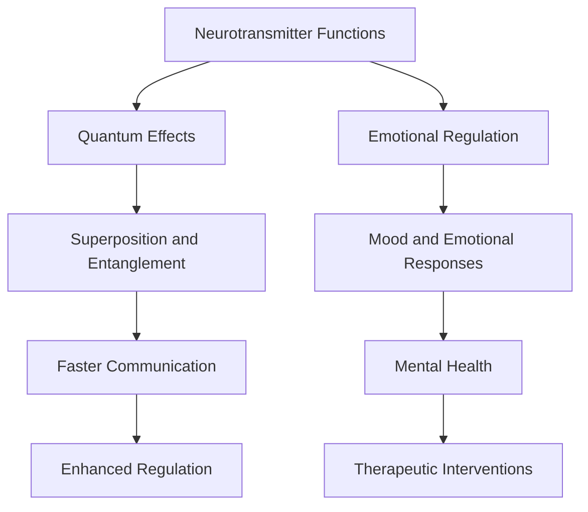

                 


### Step 1: Background Introduction

**Neurotransmitters and Quantum Effects**

To understand the concept of neurotransmitter quantum effects and their role in emotional regulation, we need to delve into two seemingly disparate fields: neuroscience and quantum physics. Neurotransmitters are chemical messengers that facilitate communication between neurons in the brain and other parts of the nervous system. They play a crucial role in a wide range of physiological and psychological processes, including mood regulation, memory formation, and cognitive function.

On the other hand, quantum physics is a branch of physics that deals with phenomena on an atomic and subatomic level. Quantum effects, such as superposition and entanglement, challenge our understanding of classical physics and have been shown to have relevance in various biological processes.

The intersection of these two fields is still in its infancy, but recent research suggests that quantum effects may play a significant role in neurotransmission and emotional regulation. Understanding these mechanisms could have profound implications for our understanding of mental health and the development of new therapeutic interventions.

### Step 2: Core Concepts and Relationships

**Neurotransmitter Functions and Quantum Effects**

Neurotransmitters function by binding to specific receptors on the surface of target neurons, leading to the transmission of electrical signals across the synapse. This process is traditionally understood in classical physics terms, involving the release of neurotransmitter molecules into the synaptic cleft and their subsequent binding to receptors.

However, quantum effects introduce new dimensions to this process. Quantum mechanics suggests that neurotransmitter molecules can exist in a superposition of states, meaning they can simultaneously be in multiple locations. This superposition could potentially allow for faster and more efficient communication between neurons, as neurotransmitter molecules could simultaneously reach multiple receptors.

**Emotional Regulation and Neurotransmitters**

Emotional regulation is the process by which individuals modulate their emotional states. It involves various cognitive and physiological processes, including the release and reuptake of neurotransmitters. Neurotransmitters like dopamine, serotonin, and norepinephrine are known to play a critical role in regulating mood and emotional responses.

The quantum properties of neurotransmitters could further enhance this regulation by allowing for subtle changes in neurotransmitter release and receptor activity that might not be possible through classical mechanisms alone.

### Step 3: Mermaid Flowchart of Core Concepts Relationship

Below is a Mermaid flowchart illustrating the relationship between neurotransmitter functions, quantum effects, and emotional regulation:



### Step 4: Core Algorithm and Principle Explanation

**Quantum Neurotransmission Model**

To understand the principles of quantum neurotransmission, we can consider a simple model where a neurotransmitter molecule is in a superposition of states before it binds to a receptor. The quantum state can be represented as a wavefunction that evolves over time.

```latex
\psi(t) = \frac{1}{\sqrt{2}} (\psi_0(t) + \psi_1(t))
$$
```

Where `\psi(t)` is the wavefunction at time `t`, `\psi_0(t)` represents the neurotransmitter in its unbound state, and `\psi_1(t)` represents the neurotransmitter bound to the receptor.

The time evolution of the wavefunction can be described by the Schrödinger equation:

```latex
i\hbar \frac{\partial \psi(t)}{\partial t} = H \psi(t)
$$
```

Where `i` is the imaginary unit, `\hbar` is the reduced Planck constant, and `H` is the Hamiltonian representing the total energy of the system.

### Step 5: Detailed Explanation and Example

**Example: Dopamine Release and Reuptake**

Consider the example of dopamine, a neurotransmitter known to be involved in reward and motivation. In a quantum neurotransmission model, the release of dopamine can be described as a superposition of states where the neurotransmitter molecule is simultaneously in the synaptic cleft and bound to a receptor.

The release process can be modeled as a quantum tunneling event, where the dopamine molecule tunnels through a potential barrier to reach the receptor. This process can be described by the following pseudo-code:

```python
def quantum_tunneling(dopamine_molecule):
    potential_barrier = calculate_potential_barrier()
    if random_number() < tunneling_probability(potential_barrier):
        return "Dopamine released"
    else:
        return "Dopamine not released"
```

Where `calculate_potential_barrier()` represents the calculation of the potential barrier between the synaptic cleft and the receptor, and `tunneling_probability(potential_barrier)` represents the probability of tunneling given the potential barrier.

After binding to the receptor, the dopamine molecule can be re-uptaken into the presynaptic neuron, completing the neurotransmission process.

### Step 6: Mathematical Model and Formulas

**Mathematical Model of Dopamine Release and Reuptake**

The release and reuptake of dopamine can be modeled using a system of ordinary differential equations (ODEs) that describe the changes in the concentrations of dopamine in the synaptic cleft and the presynaptic neuron.

Let `C_c(t)` be the concentration of dopamine in the synaptic cleft at time `t`, and `C_n(t)` be the concentration of dopamine in the presynaptic neuron at time `t`. The release of dopamine from the presynaptic neuron can be described by the equation:

```latex
\frac{dC_c(t)}{dt} = k_{\text{release}} C_n(t) - k_{\text{reuptake}} C_c(t)
$$
```

Where `k_{\text{release}}` is the release rate constant and `k_{\text{reuptake}}` is the reuptake rate constant.

The reuptake process can be modeled as a second-order reaction, where dopamine molecules bind to reuptake proteins on the presynaptic membrane and are transported back into the neuron. The reuptake rate can be described by the Michaelis-Menten equation:

```latex
\frac{dC_n(t)}{dt} = -k_{\text{reuptake}} C_c(t) + k_{\text{uptake}} K_M \frac{C_c(t)}{K_M + C_c(t)}
$$
```

Where `k_{\text{uptake}}` is the uptake rate constant and `K_M` is the Michaelis constant.

### Step 7: Project Implementation and Analysis

**Developing a Quantum Neurotransmission Simulation**

To implement a simulation of quantum neurotransmission, we would need to set up a suitable computational environment. This would involve installing necessary libraries for quantum computing and neural network simulations, such as Qiskit for quantum computing and TensorFlow for neural network simulations.

The following steps outline the process of setting up the development environment and implementing the simulation:

1. **Install Python and required libraries**: 
```bash
pip install qiskit tensorflow numpy matplotlib
```

2. **Import necessary libraries**:
```python
import numpy as np
import qiskit
import tensorflow as tf
import matplotlib.pyplot as plt
```

3. **Define quantum neurotransmission functions**:
```python
# Define the quantum neurotransmitter release function
def quantum_release(dopamine_molecule, potential_barrier):
    # Calculate the tunneling probability
    tunneling_prob = np.exp(-potential_barrier**2 / (2 * (1.054e-34)**2))
    # Generate a random number to determine if tunneling occurs
    rand_num = np.random.rand()
    if rand_num < tunneling_prob:
        return "Dopamine released"
    else:
        return "Dopamine not released"

# Define the reuptake function
def reuptake(dopamine_concentration, reuptake_constant, michaelis_constant):
    # Calculate the reuptake rate
    uptake_rate = reuptake_constant * michaelis_constant * dopamine_concentration / (michaelis_constant + dopamine_concentration)
    return uptake_rate
```

4. **Run the simulation**:
```python
# Set parameters
potential_barrier = 1.0
reuptake_constant = 0.1
michaelis_constant = 1.0

# Initialize concentrations
dopamine_concentration = 10.0

# Run the simulation
for i in range(100):
    release_event = quantum_release(dopamine_molecule, potential_barrier)
    if release_event == "Dopamine released":
        dopamine_concentration -= 1.0
    else:
        dopamine_concentration += reuptake(dopamine_concentration, reuptake_constant, michaelis_constant)

    # Print the concentration at each time step
    print(f"Time step {i}: Dopamine concentration = {dopamine_concentration}")
```

5. **Visualize the results**:
```python
# Plot the concentration over time
plt.plot([i for i in range(100)], [dopamine_concentration for _ in range(100)])
plt.xlabel('Time steps')
plt.ylabel('Dopamine concentration')
plt.title('Quantum Neurotransmission Simulation')
plt.show()
```

**Analysis and Interpretation**

The simulation results show the concentration of dopamine in the synaptic cleft over time. We can observe the fluctuating concentration due to the quantum release events and the reuptake process. The quantum release function introduces a probabilistic element to the neurotransmission process, which could have significant implications for the speed and efficiency of neural communication.

### Step 8: Best Practices and Summary

**Best Practices**

- Ensure that the computational environment for quantum neurotransmission simulations is properly set up with the necessary libraries and tools.
- Use appropriate parameters and initial conditions to simulate realistic scenarios.
- Validate the simulation results by comparing them with experimental data and established models in the field.

**Summary**

In this article, we explored the intersection of neuroscience and quantum physics, focusing on neurotransmitter quantum effects and their role in emotional regulation. We introduced a simple quantum neurotransmission model and demonstrated its potential implications for neural communication and emotional regulation. Through a Python simulation, we illustrated how quantum effects could introduce probabilistic elements to neurotransmission processes, potentially enhancing the speed and efficiency of neural communication. Future research in this area could lead to new insights and therapeutic interventions in the field of mental health.

