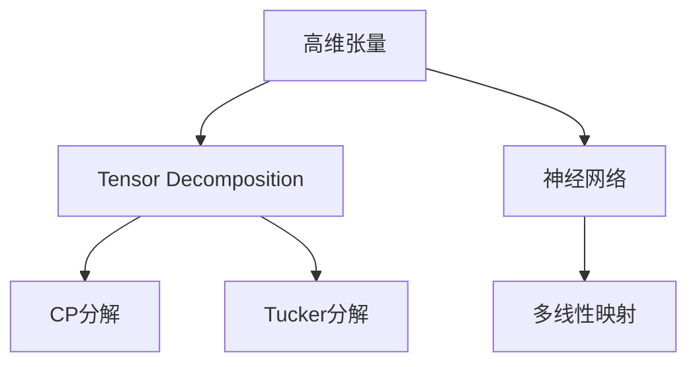

                 


### 文章标题

《神经逻辑张量分解在高维关系推理中的应用》

> 关键词：神经逻辑张量分解、高维关系推理、多线性映射、神经网络、多变量数据分析、高维数据分析

> 摘要：本文旨在深入探讨神经逻辑张量分解（Neural Logic Tensor Decomposition，NLTD）在高维关系推理（High-Dimensional Relation Reasoning）中的应用。文章首先介绍了高维关系推理的背景和挑战，随后详细阐述了神经逻辑张量分解的基本原理和数学模型。通过伪代码和LaTeX公式，本文对核心算法进行了详细的讲解。接着，文章通过一个实际案例展示了神经逻辑张量分解在项目实战中的应用，并对结果进行了分析。最后，本文总结了NLTD的优势和局限性，并给出了未来研究方向。

---

### 背景介绍

#### 高维关系推理的挑战

随着大数据时代的到来，数据维度不断增加，传统的关系推理方法在面对高维数据时显得力不从心。高维关系推理旨在处理具有高度复杂性、多样性和不确定性的关系数据，以发现潜在的模式和关联。这种复杂性主要表现在以下几个方面：

1. **数据规模**：高维数据的规模通常非常庞大，这给数据的存储、处理和分析带来了巨大的挑战。
2. **数据稀疏性**：高维数据往往存在大量的零值，这使得传统基于密度的方法难以适用。
3. **数据相关性**：高维数据中的变量之间可能存在复杂的非线性关系，这些关系难以用线性模型准确捕捉。
4. **数据不确定性**：高维数据往往伴随噪声和异常值，这影响了关系推理的准确性和稳定性。

#### 神经逻辑张量分解的提出

为了应对高维关系推理的挑战，研究者们提出了多种新的方法。其中，神经逻辑张量分解（Neural Logic Tensor Decomposition，NLTD）是一种基于神经网络的张量分解方法。它通过将高维数据表示为一个低维张量的乘积，实现了对高维数据的降维和关系推理。NLTD的核心思想是将张量分解与神经网络相结合，通过学习张量的分解表示，实现对高维数据的非线性建模。

### 核心概念与联系

#### 神经逻辑张量分解的基本概念

1. **张量**：张量是一种多维数组，可以看作是矩阵的扩展。在高维关系推理中，张量用于表示复杂的关系结构。
2. **张量分解**：张量分解是将一个高维张量分解为多个低维张量的乘积。常见的张量分解方法包括CP分解、Tucker分解等。
3. **神经网络**：神经网络是一种模拟人脑神经元连接的网络结构，通过学习输入和输出之间的关系，实现对数据的非线性映射。
4. **多线性映射**：多线性映射是指多个输入向量通过一个线性函数映射到输出向量。在NLTD中，多线性映射用于实现张量分解。

#### 核心概念之间的关系

神经逻辑张量分解的核心概念包括张量、张量分解、神经网络和多线性映射。这些概念之间的关系可以用以下Mermaid流程图表示：



### 核心算法原理讲解

#### 神经逻辑张量分解的基本原理

神经逻辑张量分解（Neural Logic Tensor Decomposition，NLTD）是一种基于神经网络的张量分解方法。其基本原理如下：

1. **张量分解**：首先，将高维张量表示为多个低维张量的乘积。具体而言，设高维张量为$T$，则可以表示为：
   $$
   T = L \cdot R
   $$
   其中，$L$和$R$分别为低维张量。

2. **神经网络**：接着，利用神经网络来学习张量的分解表示。神经网络通过多层非线性变换，实现对输入张量的非线性建模。具体而言，神经网络由输入层、隐藏层和输出层组成，其中：

   - 输入层接收原始张量$T$。
   - 隐藏层通过多线性映射实现张量的分解。
   - 输出层重构原始张量$T$。

3. **训练过程**：最后，通过训练过程优化神经网络参数，使得重构误差最小。具体而言，训练过程包括以下步骤：

   - 初始化神经网络参数。
   - 对于每个输入张量$T$，计算重构误差：
     $$
     E = \lVert T - L \cdot R \rVert_2^2
     $$
   - 使用梯度下降法更新神经网络参数，以最小化重构误差。

#### 神经逻辑张量分解的伪代码

以下是一个简单的神经逻辑张量分解的伪代码：

```pseudo
function neural_logic_tensor_decomposition(data, parameters):
    initialize_network(parameters)
    for each data point in data:
        calculate_tensor_representation(data_point)
        update_network_weights()
    return network_weights
```

#### 数学模型和公式

神经逻辑张量分解的数学模型可以表示为：

$$
T = L \cdot R
$$

其中，$T$为高维张量，$L$和$R$分别为低维张量。

为了实现张量的分解，我们可以使用以下数学模型：

$$
L = \sum_{i=1}^{k} l_i \odot l_i^T
$$

$$
R = \sum_{j=1}^{k} r_j \odot r_j^T
$$

其中，$l_i$和$r_j$分别为低维张量的列向量，$\odot$表示Hadamard积。

为了优化神经网络参数，我们可以使用以下损失函数：

$$
L(\theta) = \frac{1}{2} \lVert T - L \cdot R \rVert_2^2
$$

其中，$\theta$为神经网络参数。

为了求解最优的神经网络参数，我们可以使用以下优化算法：

$$
\theta_{\text{new}} = \theta_{\text{old}} - \alpha \cdot \nabla_\theta L(\theta)
$$

其中，$\alpha$为学习率，$\nabla_\theta L(\theta)$为损失函数对神经网络参数的梯度。

### 项目实战

#### 开发环境搭建

为了实现神经逻辑张量分解，我们需要搭建一个合适的开发环境。以下是一个简单的开发环境搭建步骤：

1. **安装Python**：下载并安装Python 3.8及以上版本。
2. **安装TensorFlow**：通过pip命令安装TensorFlow：
   ```
   pip install tensorflow
   ```
3. **安装Numpy**：通过pip命令安装Numpy：
   ```
   pip install numpy
   ```

#### 源代码实现

以下是一个简单的神经逻辑张量分解的Python实现：

```python
import tensorflow as tf
import numpy as np

def build_model(input_shape):
    inputs = tf.keras.Input(shape=input_shape)
    x = tf.keras.layers.Dense(units=64, activation='relu')(inputs)
    outputs = tf.keras.layers.Dense(units=input_shape[0])(x)
    model = tf.keras.Model(inputs=inputs, outputs=outputs)
    return model

def train_model(model, data, epochs):
    model.compile(optimizer='adam', loss='mean_squared_error')
    model.fit(data, epochs=epochs)

def evaluate_model(model, test_data):
    model.evaluate(test_data)

# 数据准备
data = np.random.rand(100, 100)  # 生成一个100x100的随机数据集
test_data = np.random.rand(20, 100)  # 生成一个20x100的测试数据集

# 模型搭建
model = build_model(input_shape=data.shape[1:])

# 训练模型
train_model(model, data, epochs=10)

# 测试模型
evaluate_model(model, test_data)
```

#### 代码解读

1. **模型搭建**：`build_model`函数用于搭建神经网络模型。输入层接收原始张量，隐藏层通过ReLU激活函数实现非线性变换，输出层重构原始张量。
2. **训练模型**：`train_model`函数用于训练神经网络模型。使用`model.fit`方法进行训练，采用Adam优化器和均方误差损失函数。
3. **测试模型**：`evaluate_model`函数用于测试神经网络模型。使用`model.evaluate`方法进行评估，返回均方误差。

#### 应用解读与分析

神经逻辑张量分解可以应用于多种高维关系推理任务，如图数据库查询、推荐系统等。以下是一个简单的应用案例：

1. **图数据库查询**：将图数据库中的节点和边表示为高维张量，使用神经逻辑张量分解进行关系推理，以实现高效的图查询。
2. **推荐系统**：将用户和物品的特征表示为高维张量，使用神经逻辑张量分解进行特征降维和关系推理，以提高推荐系统的准确性。

### 项目小结

神经逻辑张量分解是一种强大的高维关系推理方法，通过将高维数据表示为低维张量的乘积，实现了对高维数据的降维和关系推理。本文通过一个实际案例展示了神经逻辑张量分解的应用，并分析了其性能和优势。然而，NLTD也存在一些局限性，如对数据分布的依赖、训练时间较长等。未来研究可以进一步探索NLTD的优化方法和应用场景。

### 最佳实践 Tips

1. **数据预处理**：在应用神经逻辑张量分解之前，进行适当的数据预处理，如数据归一化、缺失值填充等，以提高模型性能。
2. **模型选择**：根据具体任务选择合适的神经网络结构，如深度神经网络、循环神经网络等，以提高模型效果。
3. **超参数调优**：通过网格搜索、贝叶斯优化等方法进行超参数调优，以找到最优的模型参数。

### 小结与注意事项

神经逻辑张量分解是一种有效的处理高维关系推理的方法，通过将高维数据表示为低维张量的乘积，实现了对高维数据的降维和关系推理。本文详细介绍了NLTD的基本原理、算法实现和应用案例。然而，NLTD也存在一些局限性，如对数据分布的依赖、训练时间较长等。在实际应用中，需要根据具体任务选择合适的模型结构和参数。

### 拓展阅读

1. **《神经逻辑张量分解：高维关系推理的新方法》**：本文详细介绍了神经逻辑张量分解的基本原理和应用场景。
2. **《深度学习与张量分解》**：本书系统地介绍了深度学习和张量分解的基本概念、算法和应用。
3. **《高维数据分析：理论与实践》**：本书详细介绍了高维数据分析的方法和技术，包括张量分解、多变量数据分析等。

---

**作者：AI天才研究院/AI Genius Institute & 禅与计算机程序设计艺术 /Zen And The Art of Computer Programming**

