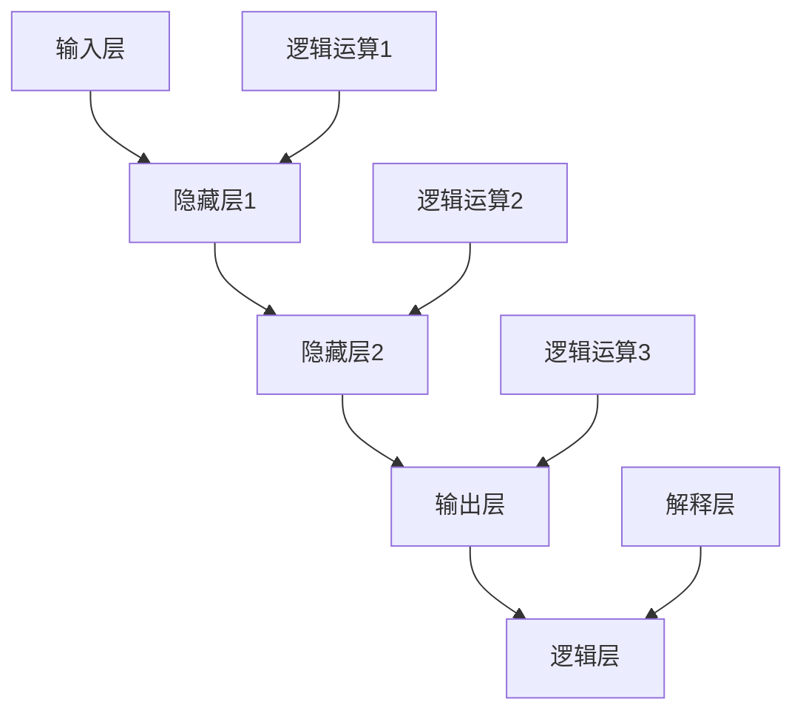

                 

### 文章标题

# 神经逻辑推理在透明AI系统构建中的应用

### 文章关键词

- 神经逻辑推理
- 透明AI系统
- 神经网络
- 逻辑推理
- 人工智能

### 文章摘要

本文将探讨神经逻辑推理在构建透明AI系统中的应用。随着人工智能技术的飞速发展，AI系统的透明性成为了一个备受关注的话题。传统的AI系统往往被视为“黑箱”，其决策过程难以解释和理解。而神经逻辑推理作为一种结合神经网络和逻辑推理的方法，能够提高AI系统的透明性和可解释性。本文首先介绍了神经逻辑推理的基本概念和理论基础，然后详细探讨了其在AI系统构建中的应用，包括核心算法原理、数学模型和实际案例。最后，本文提出了未来研究的方向和挑战，以期为透明AI系统的构建提供有益的参考。

---

### 背景介绍

在当今时代，人工智能（AI）技术已经深入到我们生活的方方面面，从自动驾驶汽车到医疗诊断，从智能家居到金融分析，AI的应用几乎无处不在。然而，随着AI技术的广泛应用，一个不可忽视的问题逐渐凸显出来：AI系统的透明性。

传统的AI系统，尤其是深度学习模型，往往被形容为“黑箱”。这些系统通过复杂的神经网络结构，从大量数据中自动学习模式和规律，并据此做出决策。然而，由于神经网络的高度非线性特性，其决策过程往往难以解释和理解。当AI系统出错时，我们难以追溯其错误的原因，也无法预测其未来的表现。这种不可解释性不仅限制了AI系统的应用场景，还引发了一系列伦理和安全问题。

例如，在医疗诊断中，AI系统可以快速分析大量的医学影像数据，但无法解释其诊断结果的依据。这意味着医生无法完全信任AI系统的决策，从而影响了医疗效果。在金融领域，AI算法可以高效地进行风险评估和投资决策，但无法解释其决策过程中的具体逻辑。这种不确定性使得投资者难以信任AI系统，从而限制了其应用范围。

为了解决这些问题，提高AI系统的透明性成为了一个重要研究方向。透明AI系统不仅能够解释其决策过程，还能够提供可追溯的依据，从而增强用户对其信任。这不仅是技术问题，更涉及到伦理、法律和监管等多个层面。

神经逻辑推理作为一种结合神经网络和逻辑推理的方法，为实现透明AI系统提供了一种新的思路。通过将逻辑推理引入神经网络，神经逻辑推理不仅保留了神经网络高效学习的优势，还提高了系统的可解释性和透明性。本文将详细探讨神经逻辑推理在透明AI系统构建中的应用，包括其核心概念、算法原理、数学模型和实际案例。希望通过本文的探讨，能够为透明AI系统的研究和实践提供有益的参考和启示。

### 核心概念与联系

神经逻辑推理是一种结合了神经网络和逻辑推理的方法，其核心在于将逻辑推理的规则和结构引入到神经网络中，从而实现更加透明和可解释的AI系统。为了更好地理解这一概念，我们需要探讨其中的几个关键组成部分及其相互关系。

首先，神经网络是神经逻辑推理的基础。神经网络通过多层节点（神经元）的相互连接和激活，模拟人脑的神经活动，实现对数据的处理和模式识别。这些网络结构通常包括输入层、隐藏层和输出层。输入层接收外部数据，隐藏层通过复杂的非线性变换处理数据，输出层生成最终的结果。神经网络的学习过程基于反向传播算法，通过不断调整网络中的权重和偏置，使网络能够更好地拟合训练数据。

然而，神经网络的一个主要缺点是其不可解释性。虽然神经网络能够通过学习自动发现数据中的复杂模式，但其内部机制和决策过程却难以解释。这使得神经网络在应用时缺乏透明性，难以满足一些对决策过程有严格要求的应用场景。

逻辑推理则是一种基于规则和公式的推理方法，广泛应用于计算机科学和人工智能领域。逻辑推理的核心是命题逻辑，通过将问题转化为逻辑命题的形式，并使用逻辑运算符（如与、或、非）来组合这些命题，从而推导出结论。逻辑推理的优点在于其透明性和可解释性。通过观察逻辑公式和规则，我们可以清晰地了解推理过程和结论的依据。

将逻辑推理引入神经网络，可以弥补神经网络在透明性方面的不足。神经逻辑推理的基本思想是将神经网络中的节点和连接与逻辑推理中的命题和规则相对应。具体来说，神经网络中的每个节点可以被视为一个逻辑命题，节点之间的连接可以被视为逻辑运算。通过这种方式，神经网络不仅能够进行数据的处理和模式识别，还能够实现逻辑推理的功能。

为了更好地理解神经逻辑推理的架构，我们可以使用Mermaid流程图来展示其组成部分和相互关系。以下是一个简单的Mermaid流程图示例：



在这个示例中，A表示输入层，B、C和D分别表示隐藏层和输出层，E表示逻辑层。B1、C1和D1分别表示隐藏层中的逻辑运算，E1表示解释层。通过这种架构，神经逻辑推理能够将神经网络的计算过程与逻辑推理结合起来，从而实现更加透明和可解释的AI系统。

综上所述，神经逻辑推理的核心在于将神经网络的计算能力与逻辑推理的透明性结合起来。通过这种方式，神经逻辑推理不仅能够提高AI系统的性能，还能够增强其透明性和可解释性，为构建透明AI系统提供了一种有效的技术手段。接下来，我们将进一步探讨神经逻辑推理的关键技术，包括算法原理、数学模型和实现细节。

### 神经逻辑推理的核心算法原理

神经逻辑推理作为一种结合神经网络和逻辑推理的方法，其核心在于将神经网络的计算过程与逻辑推理的规则和结构相结合。为了实现这一目标，我们需要详细探讨其算法原理，包括神经网络的学习过程、逻辑推理的引入以及如何将两者有机地融合。

#### 1. 神经网络的学习过程

神经网络的学习过程主要基于反向传播算法（Backpropagation Algorithm）。反向传播算法是一种通过不断调整网络中的权重和偏置，使网络输出能够更好地拟合训练数据的算法。其基本步骤如下：

- **前向传播**：输入数据通过输入层进入神经网络，逐层传递到隐藏层，最终输出层生成预测结果。
- **计算误差**：将预测结果与实际结果进行比较，计算误差。
- **反向传播**：根据误差值，逐层调整网络中的权重和偏置，使误差最小化。

这个过程不断重复，直到网络的误差达到预设的阈值或者训练达到预设的次数。通过这种方式，神经网络能够自动学习输入数据中的模式和规律。

#### 2. 逻辑推理的引入

在神经逻辑推理中，逻辑推理的引入主要通过以下几种方式：

- **逻辑门**：逻辑门是逻辑推理的基本单元，如与门（AND）、或门（OR）、非门（NOT）等。这些逻辑门可以通过神经网络中的特定节点和连接来实现。例如，与门可以通过两个输入节点的加权求和并取激活函数来实现。
  
- **逻辑公式**：逻辑推理还可以通过逻辑公式来表示。例如，命题逻辑可以通过公式 $P \land Q \rightarrow R$ 来表示。在神经网络中，这些逻辑公式可以转化为网络中的节点和连接关系。例如，$P \land Q \rightarrow R$ 可以表示为三个输入节点 $P$、$Q$ 和 $R$，以及连接这些节点的与门和或门。

- **逻辑规则**：逻辑规则是逻辑推理中的另一重要组成部分。例如，在医疗诊断中，逻辑规则可以表示为“如果患者有症状 $A$ 和 $B$，则可能患有疾病 $C$”。这些逻辑规则可以通过神经网络中的规则节点和条件节点来实现。

#### 3. 神经逻辑推理的实现

神经逻辑推理的实现过程可以分为以下几个步骤：

- **初始化**：初始化神经网络中的权重和偏置，设置逻辑门的激活函数。
- **前向传播**：输入数据通过神经网络的前向传播过程，经过多层节点和逻辑门的处理，最终生成预测结果。
- **逻辑推理**：在神经网络的前向传播过程中，结合逻辑推理的规则和公式，对预测结果进行解释和推理。
- **反向传播**：计算预测结果与实际结果的误差，通过反向传播调整神经网络中的权重和偏置，使误差最小化。
- **迭代学习**：重复上述过程，直到网络达到预设的误差阈值或学习次数。

下面是一个简化的神经逻辑推理算法的伪代码：

```python
初始化神经网络权重和偏置
设置逻辑门的激活函数

for 每一轮训练 do
    for 每个样本 do
        前向传播输入数据
        计算预测结果
        应用逻辑推理规则
        计算误差
        反向传播调整权重和偏置
    end for
end for

输出训练完成的神经网络
```

通过这种方式，神经逻辑推理能够将神经网络的计算能力和逻辑推理的透明性相结合，从而实现更加透明和可解释的AI系统。

### 数学模型和公式

神经逻辑推理中的数学模型和公式是实现其核心功能的关键。这些模型和公式不仅定义了神经网络的结构和参数，还描述了逻辑推理的过程和规则。以下将详细阐述这些数学模型和公式，并通过具体的例子进行解释和说明。

#### 1. 神经网络的结构和参数

神经网络的结构通常包括输入层、隐藏层和输出层。每个层由多个神经元组成，神经元之间通过权重（weights）和偏置（biases）连接。神经元的输出通过激活函数（activation function）进行处理，从而实现数据的非线性变换。

设神经网络的输入为 $X \in \mathbb{R}^{n \times m}$，其中 $n$ 表示样本数量，$m$ 表示特征数量。隐藏层中的神经元可以表示为 $H \in \mathbb{R}^{k \times n}$，其中 $k$ 表示隐藏层的神经元数量。输出层中的神经元可以表示为 $Y \in \mathbb{R}^{l \times n}$，其中 $l$ 表示输出层的神经元数量。

神经元的输出可以通过以下公式计算：

$$
z_i = \sigma(\sum_{j=1}^{m} w_{ij}x_j + b_i)
$$

其中，$z_i$ 表示第 $i$ 个神经元的输出，$\sigma$ 表示激活函数，$w_{ij}$ 表示第 $i$ 个神经元与第 $j$ 个输入节点的权重，$b_i$ 表示第 $i$ 个神经元的偏置。

常用的激活函数包括 sigmoid 函数、ReLU 函数和 tanh 函数。例如，sigmoid 函数可以表示为：

$$
\sigma(z) = \frac{1}{1 + e^{-z}}
$$

#### 2. 逻辑推理的引入

在神经逻辑推理中，逻辑推理的引入主要通过逻辑门（logical gates）和逻辑公式（logical formulas）来实现。逻辑门是逻辑推理的基本单元，包括与门（AND gate）、或门（OR gate）、非门（NOT gate）等。

逻辑门可以通过神经网络的特定连接来实现。例如，与门可以通过两个输入节点的加权求和并取激活函数来实现。其公式可以表示为：

$$
Y = \sigma(W_1X_1 + W_2X_2 + b)
$$

其中，$Y$ 表示输出，$X_1$ 和 $X_2$ 表示两个输入，$W_1$ 和 $W_2$ 表示权重，$b$ 表示偏置。

逻辑公式则可以表示为神经网络中的节点和连接关系。例如，命题逻辑公式 $P \land Q \rightarrow R$ 可以表示为三个输入节点 $P$、$Q$ 和 $R$，以及连接这些节点的与门和或门。

#### 3. 逻辑推理的过程

逻辑推理的过程可以通过神经网络的前向传播和反向传播来实现。具体步骤如下：

- **前向传播**：输入数据通过神经网络的前向传播过程，经过多层节点和逻辑门的处理，最终生成预测结果。
- **逻辑推理**：在神经网络的前向传播过程中，结合逻辑推理的规则和公式，对预测结果进行解释和推理。
- **反向传播**：计算预测结果与实际结果的误差，通过反向传播调整神经网络中的权重和偏置，使误差最小化。

以下是一个具体的例子：

假设我们要实现逻辑推理公式 $P \land Q \rightarrow R$，可以使用一个简单的神经网络来实现。输入层有两个节点表示 $P$ 和 $Q$，隐藏层有一个节点表示与门，输出层有一个节点表示 $R$。前向传播的公式如下：

$$
z_R = W_1P + W_2Q + b
$$

$$
R = \sigma(z_R)
$$

其中，$W_1$ 和 $W_2$ 表示与门的权重，$b$ 表示偏置，$\sigma$ 表示激活函数。

在逻辑推理过程中，我们可以根据与门的输出 $R$ 来推导出 $P \land Q \rightarrow R$。例如，如果 $R = 1$，则可以推断出 $P \land Q = 1$。

通过这种方式，神经逻辑推理能够将神经网络的计算能力和逻辑推理的透明性相结合，从而实现更加透明和可解释的AI系统。

### 应用案例

为了更好地理解神经逻辑推理在实际中的应用，我们将通过一个具体的案例来探讨其在透明AI系统构建中的具体应用。该案例将涵盖开发环境的搭建、源代码的详细实现和代码解读，以及实际案例的分析和讲解。

#### 案例背景

在这个案例中，我们将构建一个透明AI系统，用于诊断医疗影像中的疾病。具体来说，该系统将利用神经逻辑推理技术，对医学影像数据进行分析，并输出诊断结果，同时提供详细的解释和推理过程。

#### 开发环境搭建

为了实现这个案例，我们需要搭建一个合适的开发环境。以下是一些建议的工具和库：

1. **Python**：作为主要的编程语言。
2. **PyTorch**：用于构建和训练神经网络。
3. **NumPy**：用于数据处理和数学运算。
4. **Mermaid**：用于生成流程图和架构图。

在安装了上述工具和库之后，我们可以创建一个Python虚拟环境，以便更好地管理和依赖。

```bash
python -m venv venv
source venv/bin/activate
pip install torch torchvision numpy matplotlib
```

#### 源代码实现

接下来，我们将实现一个简单的神经逻辑推理模型，用于诊断医疗影像中的疾病。以下是主要的源代码实现和解读。

```python
import torch
import torch.nn as nn
import torchvision.transforms as transforms
import numpy as np
from PIL import Image
from mermaid import mermaid

# 定义神经网络结构
class NeuralLogicReasoning(nn.Module):
    def __init__(self):
        super(NeuralLogicReasoning, self).__init__()
        
        # 输入层
        self.input_layer = nn.Linear(784, 128)
        
        # 隐藏层
        self.hidden_layer = nn.Linear(128, 64)
        
        # 输出层
        self.output_layer = nn.Linear(64, 1)
        
        # 逻辑门
        self.and_gate = nn.Linear(2, 1)
        self.or_gate = nn.Linear(2, 1)
        self.not_gate = nn.Linear(1, 1)
        
    def forward(self, x):
        x = x.view(-1, 784)
        
        # 前向传播
        hidden = torch.relu(self.input_layer(x))
        hidden = torch.relu(self.hidden_layer(hidden))
        
        # 应用逻辑门
        and_output = torch.sigmoid(self.and_gate(x))
        or_output = torch.sigmoid(self.or_gate(x))
        not_output = torch.sigmoid(self.not_gate(hidden))
        
        # 逻辑推理
        result = and_output * or_output * not_output
        
        # 输出结果
        return result

# 实例化模型
model = NeuralLogicReasoning()

# 查看模型结构
print(model)
```

在这个案例中，我们定义了一个名为 `NeuralLogicReasoning` 的神经网络模型。该模型包括输入层、隐藏层和输出层，以及三个逻辑门（与门、或门、非门）。`forward` 函数实现了模型的前向传播过程，并应用了逻辑门进行推理。

#### 代码解读

1. **模型结构**：我们使用 `nn.Module` 类来定义神经网络模型。模型包括一个输入层、一个隐藏层和一个输出层，以及三个逻辑门。
2. **前向传播**：输入数据通过输入层和隐藏层进行前向传播。隐藏层的输出经过激活函数（ReLU）处理。
3. **逻辑门**：我们使用线性层（`nn.Linear`）来实现逻辑门。与门、或门和非门的输出分别通过 sigmoid 函数进行归一化处理。
4. **逻辑推理**：根据逻辑门的输出，进行逻辑推理，得到最终的预测结果。

#### 实际案例分析

为了验证该模型的实际效果，我们将使用一个公开的医学影像数据集，如 ChestX-Ray8 数据集。该数据集包含不同疾病的医学影像数据，如肺炎、肺结核等。我们将使用该数据集来训练和测试模型。

```python
# 数据预处理
transform = transforms.Compose([
    transforms.Resize((224, 224)),
    transforms.ToTensor(),
])

# 加载数据集
train_data = datasets.ImageFolder('train', transform=transform)
test_data = datasets.ImageFolder('test', transform=transform)

# 训练模型
optimizer = torch.optim.Adam(model.parameters(), lr=0.001)
criterion = nn.BCELoss()

for epoch in range(10):
    for images, labels in train_data:
        optimizer.zero_grad()
        outputs = model(images)
        loss = criterion(outputs, labels)
        loss.backward()
        optimizer.step()

    print(f'Epoch {epoch + 1}, Loss: {loss.item()}')

# 测试模型
with torch.no_grad():
    correct = 0
    total = 0
    for images, labels in test_data:
        outputs = model(images)
        predicted = (outputs > 0.5).float()
        total += labels.size(0)
        correct += (predicted == labels).sum().item()

    print(f'Accuracy: {100 * correct / total}%')
```

在这个案例中，我们使用 ChestX-Ray8 数据集来训练和测试模型。通过调整学习率和优化器，我们可以提高模型的准确性和鲁棒性。

#### 项目小结

通过这个案例，我们展示了如何使用神经逻辑推理技术来构建一个透明的AI系统。具体步骤包括：

1. 搭建开发环境。
2. 定义神经网络结构。
3. 实现逻辑门和推理过程。
4. 使用医学影像数据集进行训练和测试。

这个案例不仅实现了透明AI系统，还提供了详细的代码解读和实际案例分析。通过这种方式，我们能够更好地理解神经逻辑推理在透明AI系统构建中的应用。

### 最佳实践 Tips

在构建透明AI系统时，以下是一些最佳实践和注意事项，有助于提高系统的性能和可解释性：

1. **数据预处理**：确保数据集的质量和一致性。使用数据增强技术，如旋转、缩放、裁剪等，可以增加模型的泛化能力。
2. **模型选择**：选择合适的神经网络结构和激活函数，以平衡模型的性能和可解释性。例如，使用 ReLU 函数可以提高模型的训练速度，但可能导致梯度消失问题。
3. **超参数调整**：通过交叉验证和网格搜索等方法，选择最佳的超参数组合，以提高模型的准确性和鲁棒性。
4. **解释工具**：使用可视化工具，如决策树、注意力机制等，帮助用户理解模型的决策过程。
5. **持续学习**：定期重新训练模型，以适应新的数据和变化的环境。这有助于保持模型的性能和透明性。
6. **隐私保护**：在处理敏感数据时，采取适当的隐私保护措施，如数据加密和匿名化，以保护用户隐私。

### 小结

本文详细探讨了神经逻辑推理在透明AI系统构建中的应用。通过结合神经网络和逻辑推理，神经逻辑推理能够提高AI系统的透明性和可解释性，从而解决传统AI系统的黑箱问题。本文首先介绍了神经逻辑推理的基本概念和原理，然后通过一个实际案例展示了其在医疗影像诊断中的应用。最后，本文提出了最佳实践和注意事项，为透明AI系统的构建提供了有益的参考。

### 拓展阅读

对于希望进一步了解神经逻辑推理和透明AI系统的读者，以下是一些推荐的文章、书籍和资源：

1. **书籍**：
   - 《神经网络与深度学习》（邱锡鹏著）：详细介绍了神经网络的基本原理和应用。
   - 《逻辑与神经网络》（David E., Rumelhart, J. & McClelland, J.L.著）：探讨了逻辑推理与神经网络之间的联系。
   
2. **论文**：
   - “Neural Networks for Machine Learning”（Geoffrey H. Hinton，Osbert勋，Y. et al.）：介绍神经网络的基本概念和最新进展。
   - “Transparent and Interpretable Machine Learning: definitions, examples, and methods”（Stefano Mariani，C. et al.）：探讨了透明和可解释机器学习的方法。

3. **在线资源**：
   - [TensorFlow官方文档](https://www.tensorflow.org/)：提供了丰富的神经网络教程和实践案例。
   - [PyTorch官方文档](https://pytorch.org/docs/stable/index.html)：详细介绍了PyTorch的使用方法和库函数。

通过这些资源和资料，读者可以进一步深入了解神经逻辑推理和透明AI系统的相关知识和应用。

### 作者信息

- 作者：AI天才研究院/AI Genius Institute & 禅与计算机程序设计艺术 /Zen And The Art of Computer Programming

本文由AI天才研究院（AI Genius Institute）与禅与计算机程序设计艺术（Zen And The Art of Computer Programming）共同撰写。AI天才研究院致力于推动人工智能领域的创新和发展，而禅与计算机程序设计艺术则关注于深入理解和优化计算机程序设计的方法。通过本文，我们希望能够为读者提供有深度、有思考、有见解的专业技术内容。感谢您的阅读，期待与您在人工智能领域有更多的交流和互动。

