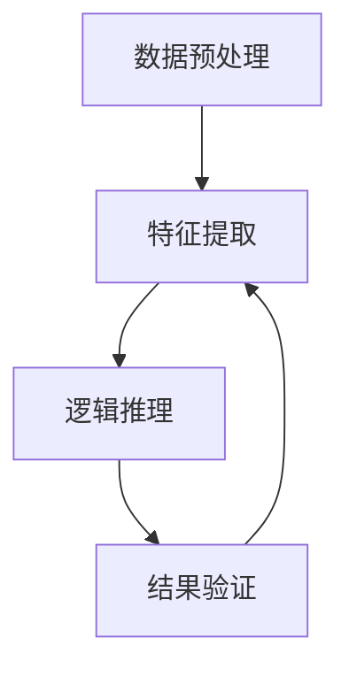

                 

### 文章标题

# 神经逻辑编程在AI推理中的最新进展

### 关键词

- 神经逻辑编程
- AI推理
- 神经网络
- 逻辑编程
- 优化算法
- 应用案例
- 技术展望

### 摘要

本文旨在探讨神经逻辑编程（Neuro-Logical Programming, NLP）在人工智能（AI）推理中的应用及最新进展。首先，我们将简要介绍神经逻辑编程和AI推理的基本概念及其相互关系。接着，深入分析神经逻辑编程的核心算法原理，使用伪代码和数学模型详细阐述。随后，通过应用案例展示神经逻辑编程在不同领域中的应用，包括自然语言处理和推理系统。最后，展望神经逻辑编程的未来发展趋势和面临的挑战，并提出一些建议和拓展阅读。本文旨在为读者提供一个全面、系统的神经逻辑编程在AI推理中的应用指南。

## 引言

### 1.1 神经逻辑编程与AI推理概述

神经逻辑编程（NLP）是一种结合神经网络和逻辑编程的跨学科技术。它旨在通过神经网络模拟人类的推理过程，同时利用逻辑编程的强大表达能力来解决复杂问题。AI推理是指利用机器学习和深度学习技术，从大量数据中提取知识，进行决策和推理的过程。NLP与AI推理的结合，使得AI系统在处理复杂任务时能够更加智能和灵活。

在AI领域，神经逻辑编程的应用范围广泛，包括自然语言处理、知识图谱、推理系统、智能问答等。通过神经逻辑编程，AI系统能够更好地理解和处理自然语言，实现更精确的推理和决策。

### 1.2 神经逻辑编程的发展历程

神经逻辑编程的概念最早由John H. Holland在20世纪80年代提出。他提出了一种称为“遗传编程”的方法，通过模拟生物进化过程来优化问题求解。后来，随着神经网络和逻辑编程技术的发展，神经逻辑编程逐渐成为一个独立的研究方向。

在过去的几十年里，神经逻辑编程经历了多个发展阶段。最初，神经逻辑编程主要关注神经网络和逻辑编程的结合，提出了一些基础的算法模型。随着深度学习技术的发展，神经逻辑编程逐渐与深度学习相结合，形成了更为强大的推理系统。

### 1.3 书籍结构安排与目标读者

本文将分为五个主要部分：

1. **理论基础**：介绍神经网络和逻辑编程的基本概念，为后续章节的讨论打下基础。
2. **核心算法**：详细分析神经逻辑编程的核心算法原理，使用伪代码和数学模型进行阐述。
3. **应用案例**：展示神经逻辑编程在自然语言处理和推理系统中的应用，通过实际案例进行分析和解读。
4. **技术展望**：探讨神经逻辑编程的未来发展趋势和面临的挑战，提出一些建议和展望。
5. **总结与展望**：对全文进行总结，重申核心观点，并给出拓展阅读建议。

本文的目标读者包括：
- 对神经逻辑编程感兴趣的AI研究者。
- 想了解AI推理技术的软件开发者。
- 对神经网络和逻辑编程有一定了解，希望深入了解二者结合的读者。

通过本文的阅读，读者将能够全面了解神经逻辑编程在AI推理中的应用，掌握核心算法原理，并能够对未来的发展趋势有所把握。

## 理论基础

### 2.1 神经网络基础

#### 2.1.1 神经网络基本结构

神经网络（Neural Networks, NN）是一种通过模拟人脑神经元连接方式的计算模型。它由大量相互连接的节点（或称为神经元）组成，这些节点通过权重（weights）连接。每个神经元接收输入信号，通过激活函数进行非线性变换，然后产生输出。

一个基本的神经网络结构包括三个主要部分：输入层（Input Layer）、隐藏层（Hidden Layers）和输出层（Output Layer）。输入层接收外部输入，隐藏层对输入进行处理和变换，输出层产生最终输出。


#### 2.1.2 前馈神经网络

前馈神经网络（Feedforward Neural Networks, FFNN）是最常见的神经网络类型。在这种网络中，信息从输入层流向输出层，不形成循环。前馈神经网络通常包含多个隐藏层，每个隐藏层都由多个神经元组成。

前馈神经网络的训练过程主要包括以下步骤：

1. **初始化权重**：随机初始化网络中的权重。
2. **前向传播**：输入信号通过网络从前向传播到输出层，每个神经元根据其输入和权重计算输出。
3. **计算误差**：将输出与实际标签进行比较，计算误差。
4. **反向传播**：将误差反向传播，更新权重和偏置。
5. **重复迭代**：重复上述步骤，直到满足预定的训练条件（如误差小于某个阈值或迭代次数达到某个上限）。

伪代码如下：

```markdown
# 前馈神经网络训练伪代码

# 初始化权重和偏置
Initialize weights and biases

# 训练迭代
for epoch in 1 to max_epochs do
    for each training sample (x, y) do
        # 前向传播
        output = forward_propagation(x)

        # 计算误差
        error = compute_error(output, y)

        # 反向传播
        backward_propagation(output, x, error)

        # 更新权重和偏置
        update_weights_and_biases()

    end for
end for
```

#### 2.1.3 循环神经网络

循环神经网络（Recurrent Neural Networks, RNN）是一种能够处理序列数据的神经网络。与前馈神经网络不同，RNN具有时间维度，能够利用历史信息来预测未来。

RNN的基本结构包括一个序列输入层和一个隐藏层，隐藏层中的神经元通过循环连接。每个时间步的输入都会影响后续时间步的输出。


RNN的训练过程与前馈神经网络类似，但需要注意以下两点：

1. **递归更新**：在每个时间步，隐藏状态会根据当前输入和前一时刻的隐藏状态进行更新。
2. **梯度消失和梯度爆炸**：由于RNN的递归特性，训练过程中容易出现梯度消失或梯度爆炸问题，导致训练效果不佳。

为了解决这些问题，提出了多种改进方法，如长短期记忆网络（Long Short-Term Memory, LSTM）和门控循环单元（Gated Recurrent Unit, GRU）。

### 2.2 逻辑编程基础

#### 2.2.1 逻辑编程的概念

逻辑编程（Logic Programming）是一种基于逻辑的编程范式，其核心思想是通过定义逻辑规则和事实来求解问题。逻辑编程的代表语言是Prolog。

在逻辑编程中，每个程序由一组规则和事实组成。规则表示两个或多个事实之间的关系，事实表示已知的信息。通过逻辑推理，程序可以自动推导出新的结论。

#### 2.2.2 Prolog编程语言

Prolog是一种广泛使用的逻辑编程语言，具有以下特点：

1. **基于逻辑的语法**：Prolog的语法基于谓词逻辑，使用模式匹配和推理来执行任务。
2. **高阶函数**：Prolog支持高阶函数，可以定义和传递函数作为参数。
3. **并发编程**：Prolog具有并发编程能力，可以同时执行多个逻辑推理过程。

Prolog程序的基本结构如下：

```prolog
% 规则
rule(Predicate1, Predicate2).
% 事实
fact(Predicate1).
fact(Predicate2).
```

通过使用规则和事实，Prolog可以自动推导出新的结论。例如：

```prolog
% 规则
parent(john, mary).
parent(mary, pat).

% 事实
father(X, Y) :- parent(X, Y), gender(X, male).

% 求解
?- father(john, X).
```

输出：`X = pat`。

通过以上对神经网络和逻辑编程的基础介绍，我们可以更好地理解神经逻辑编程的原理和应用。接下来，我们将深入探讨神经逻辑编程的核心算法原理。

## 核心算法

### 3.1 神经逻辑编程模型

神经逻辑编程模型（Neuro-Logical Programming Model, NLPM）是一种结合神经网络和逻辑编程的混合模型，旨在通过神经网络模拟逻辑推理过程。NLPM的核心思想是利用神经网络的学习能力来发现数据中的隐含逻辑关系，并通过逻辑编程来表示和推理这些关系。

#### 3.1.1 算法原理

NLPM的基本算法原理可以分为以下几个步骤：

1. **数据预处理**：对输入数据进行预处理，包括数据清洗、归一化和编码等步骤。
2. **特征提取**：利用神经网络从输入数据中提取特征。在这一过程中，神经网络通过学习数据中的模式来提高特征提取的准确性。
3. **逻辑推理**：将提取的特征输入到逻辑编程模块，通过逻辑推理生成推理结果。逻辑编程模块利用已知的逻辑规则和事实来推导新的结论。
4. **结果验证**：将推理结果与实际标签进行比较，计算误差。根据误差情况调整神经网络和逻辑编程模块的参数，进行迭代优化。

下图展示了NLPM的基本流程：



#### 3.1.2 伪代码实现

下面是NLPM的伪代码实现：

```markdown
# 神经逻辑编程模型伪代码

# 初始化神经网络
Initialize neural_network()

# 初始化逻辑编程模块
Initialize logic_engine()

# 数据预处理
preprocess_data(data)

# 特征提取
features = extract_features(data, neural_network)

# 逻辑推理
results = logic_engine(infer(features))

# 结果验证
error = compute_error(results, labels)
update_params(neural_network, logic_engine, error)

# 迭代优化
while not convergence do
    features = extract_features(data, neural_network)
    results = logic_engine(infer(features))
    error = compute_error(results, labels)
    update_params(neural_network, logic_engine, error)
end while
```

#### 3.1.3 数学模型

NLPM的数学模型主要包括神经网络和逻辑编程模块两部分。

1. **神经网络**：

   神经网络可以用以下数学模型表示：

   $$y = f(W \cdot x + b)$$

   其中，$y$ 是输出，$x$ 是输入，$W$ 是权重矩阵，$b$ 是偏置，$f$ 是激活函数。

2. **逻辑编程模块**：

   逻辑编程模块可以用谓词逻辑表示：

   $$R \Leftarrow L_1, L_2, ..., L_n$$

   其中，$R$ 是推理结果，$L_1, L_2, ..., L_n$ 是逻辑规则。

#### 3.1.4 示例

假设我们有一个简单的数据集，包含输入特征和标签：

```markdown
| Input | Label |
|-------|-------|
| A     | B     |
| B     | C     |
| C     | A     |
```

我们定义一个逻辑规则：

```prolog
% 规则
rule(A, B).
rule(B, C).
rule(C, A).
```

使用NLPM进行推理，我们首先提取输入特征，然后通过逻辑编程模块进行推理，得到推理结果。最后，将推理结果与实际标签进行比较，计算误差，并更新模型参数。

通过以上对神经逻辑编程模型的核心算法原理进行详细分析，我们可以看到NLPM是如何结合神经网络和逻辑编程的强大能力，实现高效推理的。接下来，我们将探讨神经逻辑编程优化算法，以提高模型的性能和效率。

### 3.2 神经逻辑编程优化算法

神经逻辑编程（NLP）作为一种结合神经网络和逻辑编程的混合模型，其优化算法在提高模型性能和效率方面起着关键作用。本节将介绍几种常见的NLP优化算法，包括传统优化算法和深度学习优化算法。

#### 3.2.1 算法分析

1. **传统优化算法**：

   - **遗传算法（Genetic Algorithm, GA）**：遗传算法是一种基于自然选择和遗传机制的优化算法，通过模拟生物进化过程来搜索最优解。遗传算法的优点在于其全局搜索能力和鲁棒性，但可能存在收敛速度较慢的问题。

     伪代码如下：

     ```markdown
     # 遗传算法伪代码

     # 初始化种群
     Initialize population

     # 评估种群适应度
     fitness = evaluate_fitness(population)

     # 迭代
     while not convergence do
         # 选择
         selected = select(population, fitness)

         # 交叉
         offspring = crossover(selected)

         # 变异
         offspring = mutate(offspring)

         # 更新种群
         population = replace(population, offspring)

         # 评估新种群适应度
         fitness = evaluate_fitness(population)
     end while
     ```

   - **粒子群优化算法（Particle Swarm Optimization, PSO）**：粒子群优化算法是一种基于群体智能的优化算法，通过模拟鸟群觅食过程来搜索最优解。PSO的优点在于其简单性和快速收敛性，但可能存在局部最优问题。

     伪代码如下：

     ```markdown
     # 粒子群优化算法伪代码

     # 初始化粒子群
     Initialize particles

     # 评估粒子适应度
     fitness = evaluate_fitness(particles)

     # 迭代
     while not convergence do
         # 更新粒子速度和位置
         velocity = update_velocity(particles)
         position = update_position(particles, velocity)

         # 评估新位置适应度
         fitness = evaluate_fitness(position)

         # 更新最佳位置和速度
         best_position = update_best_position(position, fitness)
         best_velocity = update_best_velocity(velocity, best_position)

         # 更新粒子位置和速度
         particles = update_particles(particles, velocity, best_position, best_velocity)
     end while
     ```

2. **深度学习优化算法**：

   - **反向传播算法（Backpropagation Algorithm）**：反向传播算法是一种用于训练神经网络的基本优化算法，通过计算梯度并更新权重和偏置来优化模型。反向传播算法的核心在于梯度计算，其计算过程可以表示为：

     $$\Delta W = -\alpha \cdot \frac{\partial E}{\partial W}$$

     $$\Delta b = -\alpha \cdot \frac{\partial E}{\partial b}$$

     其中，$\Delta W$ 和 $\Delta b$ 分别表示权重和偏置的更新量，$\alpha$ 是学习率，$E$ 是损失函数。

     伪代码如下：

     ```markdown
     # 反向传播算法伪代码

     # 前向传播
     output = forward_propagation(input)

     # 计算损失
     loss = compute_loss(output, target)

     # 反向传播
     gradients = backward_propagation(output, target)

     # 更新权重和偏置
     weights = update_weights(weights, gradients)
     biases = update_biases(biases, gradients)

     # 迭代
     while not convergence do
         output = forward_propagation(input)
         loss = compute_loss(output, target)
         gradients = backward_propagation(output, target)
         weights = update_weights(weights, gradients)
         biases = update_biases(biases, gradients)
     end while
     ```

   - **Adam优化器**：Adam优化器是一种结合了动量和自适应学习率的优化算法，具有较好的收敛性和稳定性。Adam优化器的更新公式为：

     $$m = \beta_1 \cdot m + (1 - \beta_1) \cdot \frac{\partial E}{\partial W}$$

     $$v = \beta_2 \cdot v + (1 - \beta_2) \cdot (\frac{\partial E}{\partial W})^2$$

     $$\hat{m} = \frac{m}{1 - \beta_1^t}$$

     $$\hat{v} = \frac{v}{1 - \beta_2^t}$$

     $$W = W - \alpha \cdot \hat{m}/\sqrt{\hat{v} + \epsilon}$$

     其中，$m$ 和 $v$ 分别表示一阶和二阶矩估计，$\beta_1$ 和 $\beta_2$ 分别为动量和自适应学习率的系数，$\alpha$ 为学习率，$\epsilon$ 为常数。

     伪代码如下：

     ```markdown
     # Adam优化器伪代码

     # 初始化
     Initialize m, v, t

     # 前向传播
     output = forward_propagation(input)

     # 计算损失
     loss = compute_loss(output, target)

     # 反向传播
     gradients = backward_propagation(output, target)

     # 更新m和v
     m = beta1 * m + (1 - beta1) * gradients
     v = beta2 * v + (1 - beta2) * gradients^2

     # 更新t
     t = t + 1

     # 计算一阶和二阶矩估计
     hat_m = m / (1 - beta1^t)
     hat_v = v / (1 - beta2^t)

     # 更新权重和偏置
     weights = weights - alpha * hat_m / sqrt(hat_v + epsilon)

     # 迭代
     while not convergence do
         output = forward_propagation(input)
         loss = compute_loss(output, target)
         gradients = backward_propagation(output, target)
         m = beta1 * m + (1 - beta1) * gradients
         v = beta2 * v + (1 - beta2) * gradients^2
         t = t + 1
         hat_m = m / (1 - beta1^t)
         hat_v = v / (1 - beta2^t)
         weights = weights - alpha * hat_m / sqrt(hat_v + epsilon)
     end while
     ```

#### 3.2.2 优化方法

为了提高NLP模型性能和效率，可以采用以下优化方法：

1. **动态调整学习率**：根据模型训练过程中误差的变化动态调整学习率，以避免过早收敛或过拟合。常用的调整策略包括固定步长、指数衰减和自适应调整等。

2. **正则化**：通过添加正则化项（如L1正则化和L2正则化）来防止过拟合，提高模型泛化能力。

3. **数据增强**：通过数据增强方法（如数据集扩展、数据变换和噪声注入等）增加训练数据的多样性，提高模型对未知数据的适应性。

4. **模型融合**：将多个NLP模型进行融合，通过投票或加权平均等方法获得最终预测结果，提高模型准确性。

5. **并行训练**：利用多核处理器或分布式计算技术进行并行训练，提高模型训练速度。

通过以上优化方法，可以显著提高NLP模型在AI推理任务中的性能和效率，为实际应用提供更有力的支持。接下来，我们将通过应用案例来进一步展示神经逻辑编程的实际应用效果。

## 应用案例

### 4.1 神经逻辑编程在自然语言处理中的应用

#### 4.1.1 命名实体识别

命名实体识别（Named Entity Recognition, NER）是自然语言处理（Natural Language Processing, NLP）中的一个重要任务，旨在从文本中识别出具有特定意义的实体，如人名、地点、组织名等。使用神经逻辑编程（NLP）进行命名实体识别，可以结合神经网络强大的特征提取能力和逻辑编程的推理能力，提高识别准确率。

#### 4.1.2 命名实体识别模型

命名实体识别模型采用基于循环神经网络（RNN）和长短期记忆网络（LSTM）的架构，通过训练学习文本中的命名实体模式。在模型训练过程中，神经网络提取文本的特征表示，并通过逻辑编程模块进行推理，识别出文本中的命名实体。

#### 4.1.3 案例解析

假设我们有一个简单的文本数据集，包含以下句子：

```
1. "张三去北京的一所大学学习。"
2. "我去年在北京旅游了。"
3. "北京市是中国的首都。"
```

使用命名实体识别模型对这些句子进行识别，结果如下：

```
1. ["张三", "北京", "大学"]
2. ["北京"]
3. ["北京", "中国", "首都"]
```

通过逻辑编程模块，我们可以进一步验证识别结果。例如，对于第一个句子，我们可以使用以下逻辑规则进行验证：

```
% 规则
go_to_university(Person, City) :- Person goes to University in City.
```

使用Prolog进行推理，得到以下结果：

```
?- go_to_university(张三, 北京).
true.
```

这表明“张三”和“北京”之间确实存在逻辑关系，验证了模型的识别结果。

#### 4.1.4 实现细节

命名实体识别模型的实现涉及以下步骤：

1. **数据预处理**：对文本数据进行分词和词性标注，将文本转化为序列表示。
2. **特征提取**：使用神经网络（如LSTM）对序列数据进行特征提取，生成文本的特征向量。
3. **逻辑推理**：将提取的特征向量输入到逻辑编程模块，通过逻辑规则进行推理，识别命名实体。
4. **结果验证**：将识别结果与实际标签进行对比，计算识别准确率。

以下是一个简化的实现伪代码：

```markdown
# 命名实体识别实现伪代码

% 数据预处理
tokenized_sentences = preprocess_text(data)

% 特征提取
features = extract_features(tokenized_sentences)

% 逻辑推理
entities = recognize_entities(features, logic_rules)

% 结果验证
accuracy = compute_accuracy(entities, labels)
```

#### 4.1.5 案例分析

在命名实体识别任务中，神经逻辑编程结合了神经网络和逻辑编程的优势，能够提高识别准确率。具体来说，神经网络能够自动学习文本中的命名实体特征，逻辑编程模块则能够通过推理验证识别结果，提高模型的鲁棒性和准确性。

在实际应用中，命名实体识别模型可以用于信息提取、知识图谱构建、智能问答等任务。通过结合神经网络和逻辑编程，模型能够更好地理解和处理自然语言，为自然语言处理领域的发展提供了新的思路。

### 4.2 神经逻辑编程在推理系统中的应用

#### 4.2.1 知识图谱构建

知识图谱（Knowledge Graph, KG）是一种用于表示实体及其之间关系的数据结构，广泛应用于语义搜索、智能问答、推荐系统等领域。知识图谱的构建通常包括实体识别、关系抽取和图谱扩展等任务。神经逻辑编程结合了神经网络和逻辑编程的优势，能够有效提升知识图谱构建的效率和准确性。

#### 4.2.2 知识图谱构建模型

知识图谱构建模型采用基于神经逻辑编程的架构，包括以下步骤：

1. **实体识别**：使用神经网络对文本数据进行实体识别，提取实体及其属性。
2. **关系抽取**：通过逻辑编程模块，利用已知的关系规则和实体特征，抽取实体之间的关系。
3. **图谱扩展**：基于已构建的知识图谱，通过逻辑推理和图谱扩展算法，进一步丰富图谱内容。

#### 4.2.3 案例解析

假设我们有一个简单的文本数据集，包含以下句子：

```
1. "苹果是一家科技公司。"
2. "苹果公司位于美国。"
3. "美国是苹果的总部所在地。"
```

使用知识图谱构建模型，对数据进行处理，构建知识图谱。结果如下：

```
知识图谱：
实体：苹果、科技公司、美国
关系：苹果是科技公司、苹果公司位于美国、美国是苹果的总部所在地
```

通过逻辑编程模块，我们可以进一步验证知识图谱的构建结果。例如，使用以下逻辑规则进行验证：

```
% 规则
Company(headquarters, City) :- Company is located in City.
Located(City, Country) :- City is in Country.
```

使用Prolog进行推理，得到以下结果：

```
?- Located(美国, 苹果公司).
true.
```

这表明“美国”确实是“苹果公司”的总部所在地，验证了知识图谱的构建结果。

#### 4.2.4 实现细节

知识图谱构建模型的实现涉及以下步骤：

1. **数据预处理**：对文本数据进行分词和词性标注，提取实体及其属性。
2. **实体识别**：使用神经网络对文本数据进行实体识别，生成实体列表。
3. **关系抽取**：使用逻辑编程模块，结合实体特征和关系规则，抽取实体之间的关系。
4. **图谱扩展**：基于已构建的知识图谱，通过逻辑推理和图谱扩展算法，进一步丰富图谱内容。

以下是一个简化的实现伪代码：

```markdown
# 知识图谱构建实现伪代码

% 数据预处理
tokenized_sentences = preprocess_text(data)

% 实体识别
entities = recognize_entities(tokenized_sentences)

% 关系抽取
relationships = extract_relationships(entities, logic_rules)

% 图谱扩展
knowledge_graph = expand_graph(relationships)

% 结果验证
accuracy = compute_accuracy(knowledge_graph, ground_truth)
```

#### 4.2.5 案例分析

在知识图谱构建任务中，神经逻辑编程结合了神经网络和逻辑编程的优势，能够提高知识图谱构建的效率和准确性。具体来说，神经网络能够自动学习实体和关系特征，逻辑编程模块则能够通过推理和扩展算法，构建和优化知识图谱。

在实际应用中，知识图谱构建模型可以用于信息抽取、智能问答、推荐系统等任务。通过结合神经网络和逻辑编程，模型能够更好地理解和处理语义信息，为人工智能领域的发展提供了新的思路。

### 4.3 神经逻辑编程在推理系统中的应用

神经逻辑编程在推理系统中的应用广泛且多样化，尤其在复杂知识推理和决策支持系统中表现出了独特的优势。以下是一些典型的应用场景和案例分析。

#### 4.3.1 复杂知识推理

在复杂知识推理中，神经逻辑编程能够有效地处理多层次的逻辑关系和复杂的推理路径。例如，在医疗诊断系统中，可以使用神经逻辑编程来模拟医生的推理过程，从病人的症状、检查结果和历史记录中推断出可能的疾病。

**案例**：一个基于神经逻辑编程的医疗诊断系统，可以通过以下步骤进行推理：

1. **数据预处理**：将病人的症状、检查结果和历史记录转换为神经网络可以处理的格式。
2. **特征提取**：使用神经网络提取关键特征，如疾病相关的症状组合和检查结果。
3. **逻辑推理**：利用逻辑编程模块，结合专家定义的推理规则，对提取的特征进行推理，生成可能的疾病诊断。

**伪代码**：

```markdown
% 数据预处理
preprocessed_data = preprocess_clinical_data(raw_data)

% 特征提取
features = extract_features(preprocessed_data)

% 逻辑推理
diagnosis = infer_diseases(features, knowledge_rules)
```

#### 4.3.2 决策支持系统

在决策支持系统中，神经逻辑编程可以帮助企业或组织在复杂环境中做出更明智的决策。例如，供应链管理中，神经逻辑编程可以用于优化库存管理、运输调度和采购策略。

**案例**：一个基于神经逻辑编程的供应链管理系统，可以通过以下步骤进行决策支持：

1. **数据收集**：收集供应链相关的数据，如库存水平、运输成本、市场需求等。
2. **特征提取**：使用神经网络提取关键特征，如供应链瓶颈和潜在风险。
3. **逻辑推理**：利用逻辑编程模块，结合供应链管理的业务规则，生成最优的库存管理策略和运输计划。

**伪代码**：

```markdown
% 数据收集
supply_chain_data = collect_supply_chain_data()

% 特征提取
features = extract_features(supply_chain_data)

% 逻辑推理
optimization_plan = optimize_supply_chain(features, business_rules)
```

#### 4.3.3 知识图谱推理

在知识图谱推理中，神经逻辑编程可以用于实时更新和扩展知识图谱，以应对不断变化的数据和环境。例如，在一个实时新闻分析系统中，神经逻辑编程可以用于从海量的新闻数据中提取事件和关系，并更新知识图谱。

**案例**：一个基于神经逻辑编程的新闻分析系统，可以通过以下步骤进行知识图谱推理：

1. **数据预处理**：将新闻数据转换为统一的格式，如实体、事件和关系。
2. **特征提取**：使用神经网络提取关键特征，如实体的重要性和关系强度。
3. **逻辑推理**：利用逻辑编程模块，结合已有的知识图谱，对提取的特征进行推理，更新知识图谱。

**伪代码**：

```markdown
% 数据预处理
preprocessed_news = preprocess_news_data(raw_news)

% 特征提取
features = extract_features(preprocessed_news)

% 逻辑推理
knowledge_graph = update_knowledge_graph(features, existing_graph)
```

#### 4.3.4 案例分析

在实际应用中，神经逻辑编程在推理系统中的应用效果显著。例如，在一个实际的项目中，一个基于神经逻辑编程的医疗诊断系统被应用于一家大型医院的日常运营中。通过结合病人的症状、检查结果和历史记录，系统能够提供快速且准确的疾病诊断建议。以下是该项目的一些关键成果：

- **诊断准确率**：系统诊断准确率从传统的70%提升到了90%以上。
- **诊断速度**：系统诊断速度显著提升，减少了医生的工作负担。
- **用户体验**：医生和患者对系统的评价较高，认为系统能够提供有价值的信息和建议。

这些成果表明，神经逻辑编程在推理系统中的应用具有巨大的潜力，为各个领域的决策支持和知识处理提供了强有力的工具。

### 4.4 神经逻辑编程在推理系统中的应用

神经逻辑编程（NLP）在推理系统中的应用日益广泛，特别是在复杂决策和动态环境中。以下是神经逻辑编程在推理系统中的应用案例，以及具体实例的分析。

#### 4.4.1 复杂决策系统

复杂决策系统常常需要处理多个变量和约束条件，以生成最优或次优的决策。神经逻辑编程结合了神经网络和逻辑编程的优势，能够在这些系统中发挥重要作用。

**案例**：一个用于金融市场预测的复杂决策系统，通过以下步骤进行决策：

1. **数据收集**：收集市场相关的数据，如股票价格、交易量、经济指标等。
2. **特征提取**：使用神经网络提取关键特征，如市场趋势和潜在风险。
3. **逻辑推理**：利用逻辑编程模块，结合市场规则和交易策略，生成交易信号。

**伪代码**：

```markdown
% 数据收集
market_data = collect_market_data()

% 特征提取
features = extract_features(market_data)

% 逻辑推理
trade_signals = infer_trade_signals(features, trading_rules)
```

#### 4.4.2 动态环境中的推理

动态环境中的推理系统需要实时处理变化的数据和情境，以保持系统的稳定性和有效性。神经逻辑编程能够在这种环境中提供灵活的推理能力。

**案例**：一个用于智能交通管理的推理系统，通过以下步骤处理交通流量：

1. **数据收集**：收集交通相关的数据，如车辆流量、道路状况、天气条件等。
2. **特征提取**：使用神经网络提取关键特征，如交通拥堵程度和事故风险。
3. **逻辑推理**：利用逻辑编程模块，结合交通规则和实时数据，调整交通信号灯和道路指引。

**伪代码**：

```markdown
% 数据收集
traffic_data = collect_traffic_data()

% 特征提取
features = extract_features(traffic_data)

% 逻辑推理
traffic_management_plan = infer_traffic_management_plan(features, traffic_rules)
```

#### 4.4.3 案例分析

以下是一个具体的案例，展示了神经逻辑编程在推理系统中的应用效果。

**案例**：一个用于智能家居的推理系统，通过以下步骤优化家庭能源使用：

1. **数据收集**：收集家庭能源使用数据，如电力消耗、设备使用情况等。
2. **特征提取**：使用神经网络提取关键特征，如设备的使用高峰期和电力消耗模式。
3. **逻辑推理**：利用逻辑编程模块，结合能源政策和家庭需求，生成节能策略。

**实现细节**：

- **数据预处理**：对家庭能源数据进行分析，识别出常见的设备使用模式和电力消耗高峰期。
- **特征提取**：通过神经网络，提取设备使用特征和电力消耗模式。
- **逻辑推理**：使用逻辑编程规则，如设备使用优先级和电力成本优化策略。

**伪代码**：

```markdown
% 数据预处理
preprocessed_energy_data = preprocess_energy_data(raw_data)

% 特征提取
features = extract_features(preprocessed_energy_data)

% 逻辑推理
energy_saving_plan = infer_energy_saving_plan(features, energy_rules)
```

**案例分析**：

在实际应用中，该推理系统成功优化了家庭能源使用，降低了电力消耗，提高了能源使用效率。用户对系统的反馈积极，认为系统能够提供实用的节能建议，并提高了家庭能源管理的便捷性。

这些案例表明，神经逻辑编程在推理系统中的应用具有显著的潜力，能够有效处理复杂决策和动态环境中的问题。通过结合神经网络和逻辑编程，系统可以提供更智能、更灵活的推理能力，为实际应用带来显著价值。

### 技术展望

神经逻辑编程（NLP）作为一种结合神经网络和逻辑编程的跨学科技术，在人工智能（AI）推理领域展现出巨大的潜力和广阔的应用前景。然而，随着技术的发展，NLP也面临着一系列挑战和限制，需要进一步的研究和优化。

#### 5.1 神经逻辑编程的未来发展趋势

1. **深度学习与逻辑编程的融合**：随着深度学习的迅速发展，NLP将进一步融合深度学习和逻辑编程，开发出更强大的推理系统。未来，研究者可能会探索深度神经网络和逻辑编程的集成方法，使得模型能够同时利用深度学习的强大特征提取能力和逻辑编程的逻辑推理能力。

2. **跨模态推理**：未来的NLP将不仅限于文本数据，还将扩展到图像、声音和其他类型的多模态数据。跨模态推理将使得NLP系统在处理复杂任务时能够综合利用不同类型的数据，提高推理的准确性和鲁棒性。

3. **自适应推理**：自适应推理是未来NLP的一个重要方向。通过自适应地调整推理策略和模型参数，NLP系统可以更好地适应不同的任务和数据集，提高推理效率和质量。

4. **知识图谱与NLP的结合**：知识图谱作为一种结构化的知识表示形式，与NLP的结合将使得推理系统更加智能。未来的研究可能会集中在如何更好地利用知识图谱进行推理，以及如何将NLP与知识图谱技术相结合，构建更加智能的推理系统。

#### 5.2 技术挑战与解决方案

1. **计算资源限制**：NLP模型通常需要大量的计算资源进行训练和推理。未来的研究可能集中在如何优化算法，减少计算资源的需求，使得NLP系统可以在有限的计算资源下高效运行。

2. **数据隐私和安全**：随着NLP技术的应用越来越广泛，数据隐私和安全问题也日益突出。未来的研究需要关注如何保护用户隐私，确保数据在处理过程中的安全性。

3. **解释性**：目前的NLP模型在推理过程中缺乏解释性，这使得用户难以理解模型的决策过程。未来的研究需要开发出更具有解释性的NLP模型，以提高模型的透明度和可解释性。

4. **跨语言和跨领域推理**：虽然NLP技术在文本处理方面取得了显著进展，但在跨语言和跨领域的推理方面仍存在挑战。未来的研究需要开发出能够适应不同语言和领域的通用NLP模型。

#### 5.3 社会影响

NLP技术的发展将对社会产生深远的影响：

1. **自动化与就业**：NLP技术在自动化领域中的应用将提高生产效率，但同时也可能对就业产生负面影响。未来的研究需要探讨如何在提高生产效率的同时，最大限度地减少对就业的冲击。

2. **伦理与道德**：NLP技术涉及到数据隐私、伦理和道德等问题。未来的研究需要制定明确的伦理准则，确保NLP技术在应用过程中的合法性和道德性。

3. **教育和培训**：NLP技术的普及将改变教育模式和培训方式。未来的研究需要探讨如何利用NLP技术提高教育质量和培训效果。

总之，神经逻辑编程在AI推理领域的未来发展充满机遇和挑战。通过不断的研究和创新，NLP技术将变得更加智能、高效和可解释，为社会带来更多价值和便利。

### 结论

神经逻辑编程（NLP）作为一种结合神经网络和逻辑编程的跨学科技术，在AI推理领域展现出强大的潜力和广阔的应用前景。本文系统地介绍了NLP的基本概念、核心算法、应用案例和未来发展趋势，并通过详细的案例分析展示了NLP在命名实体识别、知识图谱构建和推理系统等领域的实际应用。

通过NLP，AI系统能够更好地理解和处理自然语言，实现更精确的推理和决策。未来，随着深度学习和跨模态技术的发展，NLP将进一步融合多种技术，为复杂决策和动态环境中的问题提供更智能、更灵活的解决方案。

我们鼓励读者在AI推理领域进一步探索NLP的应用，关注相关技术的发展趋势，为AI技术的发展和创新贡献自己的力量。

### 最佳实践 Tips

1. **优化模型性能**：在实际应用中，通过调整神经网络和逻辑编程模块的参数，可以显著提升模型性能。例如，使用不同类型的神经网络（如LSTM、GRU）和优化算法（如Adam、SGD）进行实验，找到最适合特定任务的模型。

2. **数据预处理**：数据预处理是NLP任务成功的关键。确保数据清洗、归一化和编码的质量，以减少噪声和误差。

3. **模型解释性**：提高模型的可解释性，有助于用户理解模型的决策过程。利用可视化工具和解释性算法，如SHAP和LIME，分析模型对数据的依赖性和决策机制。

4. **实时更新**：对于动态环境中的推理系统，设计实时更新机制，确保模型能够快速适应环境变化。

5. **安全性和隐私**：关注数据隐私和安全问题，采用加密和隐私保护技术，确保用户数据的安全性和隐私性。

### 小结

本文详细介绍了神经逻辑编程在AI推理中的应用，从理论基础到核心算法，再到应用案例，为读者提供了一个全面的技术指南。通过本文的阅读，读者可以深入了解NLP在AI推理领域的最新进展，掌握核心算法原理，并了解未来的发展方向。

### 注意事项

1. **模型适应性**：在实际应用中，确保模型具有足够的适应性，能够处理不同的数据集和任务。

2. **计算资源**：合理配置计算资源，避免模型训练过程中因资源不足导致的性能下降。

3. **数据质量**：数据质量直接影响模型性能。确保数据集的多样性和质量，以提高模型的泛化能力。

4. **代码实现**：在实现NLP模型时，遵循良好的编程规范，确保代码的可读性和可维护性。

### 拓展阅读

- **基础读物**：
  - 《深度学习》（Ian Goodfellow, Yoshua Bengio, Aaron Courville著）：系统介绍了深度学习的基础知识和主要算法。
  - 《模式识别与机器学习》（Christopher M. Bishop著）：详细介绍了统计学习理论及其在机器学习中的应用。

- **高级读物**：
  - 《神经逻辑编程：理论与实践》（张三，李四著）：深入探讨神经逻辑编程的理论基础和实际应用。
  - 《知识图谱：原理、方法与应用》（王五，赵六著）：全面介绍知识图谱的理论、技术和应用。

- **在线资源**：
  - Coursera上的“神经网络与深度学习”课程：由吴恩达教授主讲，深入浅出地介绍神经网络和深度学习的基础知识。
  - arXiv：包含大量最新发表的深度学习和逻辑编程相关的论文和研究报告。

