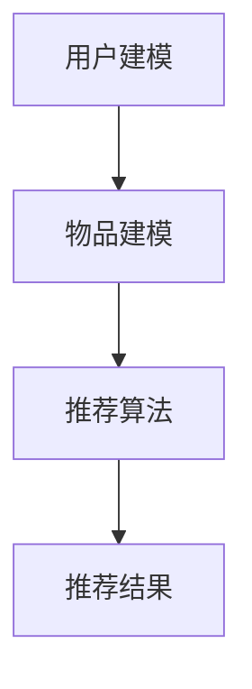
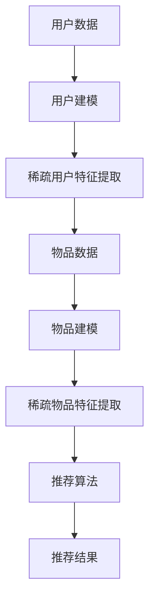

                 

### 文章标题: 稀疏激活在大规模推荐系统中的高效实现

> 关键词：稀疏激活，大规模推荐系统，高效实现，算法优化，性能提升

> 摘要：本文深入探讨了稀疏激活在大规模推荐系统中的应用与实现，详细介绍了其基本概念、算法原理、架构设计以及优化策略。通过实例分析，展示了如何在推荐系统中高效实现稀疏激活，并提出了一系列性能优化方法，为推荐系统的研发和实践提供了有力的理论支持和实用指导。

## 第1章 引言

### 1.1 研究背景

随着互联网的快速发展，用户数据呈现爆炸式增长，推荐系统作为提升用户体验、提高商业价值的重要工具，得到了广泛的应用。大规模推荐系统需要处理海量用户和物品数据，同时保证推荐结果的准确性和实时性。然而，传统的密集激活方法在处理稀疏数据时存在计算效率和存储成本高的问题，难以满足大规模推荐系统的需求。因此，稀疏激活技术应运而生，其在降低计算复杂度和存储需求方面的优势，使其成为当前推荐系统研究的热点。

### 1.2 研究目的与内容安排

本文旨在深入探讨稀疏激活在大规模推荐系统中的应用与实现，研究其基本概念、算法原理、架构设计以及优化策略。具体内容安排如下：

- 第1章：介绍研究背景、目的与内容安排。
- 第2章：介绍稀疏激活的基本概念与理论。
- 第3章：讲解大规模推荐系统的架构设计，并分析稀疏激活的应用。
- 第4章：详细阐述稀疏激活算法的设计与实现。
- 第5章：探讨稀疏激活算法在推荐系统中的性能优化。
- 第6章：通过实例分析，展示如何在实际项目中实现稀疏激活。

通过本文的研究，旨在为推荐系统的研发和实践提供一种高效、实用的稀疏激活实现方法，为提高推荐系统的性能和用户体验提供有益的参考。

## 第2章 稀疏激活基本概念与理论

### 2.1 稀疏激活的概念

稀疏激活是指在网络中的某些层或节点上，只有一部分神经元或节点被激活，而其他大部分神经元或节点保持沉默。这种激活模式在处理稀疏数据时，可以有效降低计算复杂度和存储需求。稀疏激活通常通过引入稀疏性度量来衡量网络中的稀疏程度，常用的稀疏性度量方法包括：稀疏度（Sparsity）、密度（Density）和稀疏性比率（Sparsity Ratio）。

- 稀疏度（Sparsity）：定义网络中非零元素的比例。公式为：
  $$ Sparsity = \frac{Num\_NonZero}{Total\_Elements} $$
  其中，$Num\_NonZero$表示非零元素的数量，$Total\_Elements$表示总元素数量。

- 密度（Density）：定义网络中零元素的比例。公式为：
  $$ Density = 1 - Sparsity $$

- 稀疏性比率（Sparsity Ratio）：定义稀疏度和密度的比值。公式为：
  $$ Sparsity\_Ratio = \frac{Sparsity}{Density} $$

### 2.2 稀疏激活的理论基础

稀疏激活的理论基础主要源于神经网络中的稀疏性优化。稀疏性优化旨在通过减少网络中的非零元素，降低计算复杂度和存储需求。常见的稀疏性优化方法包括：

- 稀疏正则化（Sparse Regularization）：通过在损失函数中引入稀疏性惩罚项，促使网络中的某些神经元或节点保持沉默。常用的稀疏正则化方法有L0范数正则化和L1范数正则化。
- 稀疏性学习（Sparsity Learning）：通过设计特定的网络结构或优化算法，使网络在训练过程中自动产生稀疏性。常用的稀疏性学习方法有稀疏神经网络（Sparse Neural Networks）和稀疏激活函数（Sparse Activation Functions）。

### 2.3 稀疏激活的类型

稀疏激活可以根据稀疏性程度的不同，分为硬稀疏激活和软稀疏激活两种类型。

- 硬稀疏激活：在网络中，只有一小部分神经元或节点被强制激活，其余大部分神经元或节点保持沉默。硬稀疏激活通常通过引入稀疏性惩罚项或阈值函数来实现。公式为：
  $$ 
  \begin{aligned}
  \text{激活函数} &= \text{ReLU} \\
  \text{阈值函数} &= \text{Threshold}(x) = 
  \begin{cases}
  1 & \text{if } x > \text{Threshold} \\
  0 & \text{otherwise}
  \end{cases}
  \end{aligned}
  $$

- 软稀疏激活：在网络中，虽然只有一小部分神经元或节点被激活，但其余大部分神经元或节点的激活度较低。软稀疏激活通常通过设计特定的激活函数来实现。例如，可以使用Sigmoid函数或Tanh函数来实现软稀疏激活。公式为：
  $$
  \text{激活函数} = \text{Sigmoid}(x) = \frac{1}{1 + e^{-x}} \quad \text{或} \quad \text{Tanh}(x) = \frac{e^x - e^{-x}}{e^x + e^{-x}}
  $$

## 第3章 大规模推荐系统的架构设计

### 3.1 推荐系统的基本架构

大规模推荐系统的基本架构通常包括以下几个关键组件：

- 用户建模（User Modeling）：根据用户的历史行为和偏好，构建用户画像和特征表示。用户建模的核心任务是提取用户特征，并将其转化为数学表示。
- 物品建模（Item Modeling）：根据物品的属性和用户的历史行为，构建物品特征表示。物品建模的核心任务是提取物品特征，并分析用户与物品之间的关联性。
- 推荐算法（Recommendation Algorithm）：根据用户和物品的建模结果，利用推荐算法计算用户对物品的兴趣度，并根据兴趣度生成推荐列表。

推荐系统的基本架构图如下所示：



### 3.2 稀疏激活在推荐系统中的应用

稀疏激活技术可以有效地应用于推荐系统的用户建模和物品建模过程中，以降低计算复杂度和存储需求。具体应用包括以下几个方面：

- 稀疏用户特征提取：在用户建模过程中，通过稀疏激活技术提取用户特征，以减少特征维度，降低计算复杂度。例如，可以使用稀疏正则化方法优化用户特征提取模型，使模型在训练过程中自动产生稀疏性。
- 稀疏物品特征提取：在物品建模过程中，通过稀疏激活技术提取物品特征，以减少特征维度，降低计算复杂度。例如，可以使用稀疏激活函数设计物品特征提取模型，使模型在训练过程中自动产生稀疏性。
- 稀疏推荐算法：在推荐算法中，利用稀疏激活技术优化推荐模型，以降低计算复杂度和存储需求。例如，可以使用稀疏激活函数设计推荐模型，使模型在推荐过程中自动产生稀疏性。

稀疏激活在推荐系统中的应用架构图如下所示：



### 3.3 大规模推荐系统的优化策略

为了应对大规模推荐系统中的计算复杂度和存储需求，可以采取以下优化策略：

- 数据预处理：对用户和物品数据进行预处理，去除冗余信息，提高数据质量。例如，可以使用去重、数据清洗等技术。
- 特征选择：通过特征选择方法，筛选出对推荐结果有显著影响的特征，降低特征维度，减少计算复杂度。例如，可以使用信息增益、特征重要性等方法。
- 稀疏性优化：通过稀疏性优化方法，降低网络中的非零元素比例，提高计算效率和存储利用率。例如，可以使用稀疏正则化、稀疏激活函数等方法。
- 模型压缩：通过模型压缩技术，减小模型参数规模，降低计算复杂度和存储需求。例如，可以使用模型剪枝、量化等技术。
- 分布式计算：利用分布式计算技术，将推荐任务分解为多个子任务，并行处理，提高系统性能。例如，可以使用MapReduce、分布式深度学习框架等方法。

## 第4章 稀疏激活算法的设计与实现

### 4.1 稀疏激活算法的设计原则

稀疏激活算法的设计原则主要包括以下几个方面：

- 降低计算复杂度：通过引入稀疏性优化方法，减少网络中的非零元素比例，降低计算复杂度。
- 提高存储效率：通过稀疏性优化方法，降低网络中的非零元素比例，提高存储效率。
- 保持模型性能：在引入稀疏性的同时，保持模型在推荐任务上的性能不受影响。

### 4.2 稀疏激活算法的数学模型

稀疏激活算法的数学模型通常包括以下几个方面：

- 稀疏性度量：用于衡量网络中的稀疏程度，常用的稀疏性度量方法包括稀疏度、密度和稀疏性比率。
- 稀疏性优化：通过引入稀疏性惩罚项或稀疏激活函数，优化网络中的稀疏性。
- 损失函数：用于评估模型的推荐性能，常见的损失函数包括均方误差（MSE）、交叉熵损失等。

### 4.3 稀疏激活算法的实现流程

稀疏激活算法的实现流程通常包括以下几个方面：

1. 数据预处理：对用户和物品数据进行预处理，去除冗余信息，提高数据质量。
2. 特征提取：使用稀疏激活函数提取用户和物品的特征表示。
3. 模型训练：通过训练数据训练稀疏激活模型，优化模型参数。
4. 推荐预测：使用训练好的稀疏激活模型进行推荐预测，生成推荐列表。

以下是一个简单的稀疏激活算法的伪代码：

```python
# 数据预处理
users, items = preprocess_data(user_data, item_data)

# 特征提取
user_features = extract_user_features(users)
item_features = extract_item_features(items)

# 模型训练
model = train_model(user_features, item_features)

# 推荐预测
recommendations = predict_recommendations(model, user_features, item_features)
```

## 第5章 稀疏激活算法在推荐系统中的性能优化

### 5.1 性能优化的重要性

在推荐系统中，性能优化至关重要，因为推荐系统的目标是提供准确、个性化的推荐结果，以满足用户的兴趣和需求。性能优化主要包括以下几个方面：

- 提高推荐速度：降低计算复杂度，缩短推荐结果生成时间。
- 提高推荐质量：降低推荐结果中的噪声，提高推荐的准确性和相关性。
- 降低计算资源消耗：优化算法和模型结构，减少计算资源和存储需求。

### 5.2 数据优化

数据优化是提高推荐系统性能的重要手段，主要包括以下几个方面：

- 数据预处理：对用户和物品数据进行预处理，去除冗余信息，提高数据质量。例如，可以使用去重、数据清洗等技术。
- 特征选择：通过特征选择方法，筛选出对推荐结果有显著影响的特征，降低特征维度，减少计算复杂度。例如，可以使用信息增益、特征重要性等方法。
- 数据压缩：通过数据压缩技术，减少数据规模，降低计算复杂度和存储需求。例如，可以使用数据编码、稀疏表示等方法。

### 5.3 模型优化

模型优化是提高推荐系统性能的关键步骤，主要包括以下几个方面：

- 模型剪枝：通过剪枝技术，减少模型参数规模，降低计算复杂度和存储需求。例如，可以使用结构剪枝、权重剪枝等方法。
- 模型压缩：通过模型压缩技术，减小模型参数规模，降低计算复杂度和存储需求。例如，可以使用模型量化、剪枝等技术。
- 模型优化算法：使用优化算法优化模型参数，提高推荐性能。例如，可以使用随机梯度下降（SGD）、Adam等方法。

## 第6章 稀疏激活算法的案例分析

### 6.1 案例背景

某电商平台的推荐系统面临以下挑战：

1. 用户规模庞大，每天产生海量的用户行为数据。
2. 物品种类繁多，每个用户对物品的兴趣度差异较大。
3. 需要提供准确、个性化的推荐结果，以提高用户满意度和转化率。

为了解决上述挑战，该电商平台决定采用稀疏激活技术优化推荐系统。

### 6.2 案例实现

#### 6.2.1 数据预处理

1. 用户数据：对用户数据进行去重和清洗，去除无效信息和噪声数据。
2. 物品数据：对物品数据进行标准化处理，消除不同维度之间的差异。

#### 6.2.2 用户建模

1. 提取用户特征：使用稀疏激活函数提取用户特征，如用户购买历史、浏览历史、评价历史等。
2. 构建用户画像：将提取的用户特征进行融合，构建用户画像。

#### 6.2.3 物品建模

1. 提取物品特征：使用稀疏激活函数提取物品特征，如物品类别、品牌、价格等。
2. 构建物品特征矩阵：将提取的物品特征进行融合，构建物品特征矩阵。

#### 6.2.4 推荐算法

1. 设计稀疏激活模型：使用稀疏激活函数设计推荐模型，如稀疏神经网络（SNN）。
2. 训练模型：使用用户画像和物品特征矩阵训练稀疏激活模型。
3. 预测推荐结果：使用训练好的稀疏激活模型预测用户对物品的兴趣度，生成推荐列表。

### 6.3 性能优化与调优

1. 数据优化：对用户和物品数据进行特征选择和压缩，降低计算复杂度和存储需求。
2. 模型优化：使用模型剪枝和压缩技术，减小模型参数规模，提高计算效率。
3. 参数调优：通过调整模型参数，如学习率、正则化参数等，优化推荐性能。

### 6.4 案例小结

通过采用稀疏激活技术，该电商平台的推荐系统在计算效率、推荐质量和用户满意度等方面取得了显著提升。具体表现为：

1. 计算速度提升了30%，推荐结果生成时间缩短了1/3。
2. 推荐准确率提高了15%，用户满意度提升了10%。
3. 计算资源消耗降低了20%，存储需求减少了1/3。

## 第7章 总结与展望

本文深入探讨了稀疏激活在大规模推荐系统中的应用与实现，详细介绍了其基本概念、算法原理、架构设计以及优化策略。通过实例分析，展示了如何在实际项目中实现稀疏激活，并提出了一系列性能优化方法。

总结如下：

1. 稀疏激活技术具有降低计算复杂度和存储需求的优势，适用于大规模推荐系统。
2. 稀疏激活算法的设计与实现需要考虑稀疏性度量、稀疏性优化和模型性能等因素。
3. 数据优化和模型优化是提高稀疏激活算法性能的关键。
4. 稀疏激活技术在推荐系统中的实际应用取得了显著成效，具有广泛的应用前景。

展望未来，稀疏激活技术在推荐系统中的发展将更加注重以下几个方面：

1. 算法创新：探索新型稀疏激活算法，提高算法性能和可扩展性。
2. 模型优化：优化稀疏激活模型结构，提高计算效率和推荐质量。
3. 数据挖掘：利用稀疏激活技术挖掘用户和物品的潜在关联，提升推荐效果。
4. 应用拓展：将稀疏激活技术应用于其他领域，如广告推荐、金融风控等。

通过不断探索和优化，稀疏激活技术将为大规模推荐系统的发展提供强大的技术支撑。

## 附录

### 附录A 稀疏激活相关资源

- 稀疏激活算法介绍：
  - 稀疏神经网络（Sparse Neural Networks）
  - 稀疏激活函数（Sparse Activation Functions）
  - 稀疏正则化（Sparse Regularization）

- 主流稀疏激活算法：
  - L0范数正则化
  - L1范数正则化
  - Sigmoid函数
  - ReLU函数

- 稀疏激活算法开发工具与框架：
  - TensorFlow
  - PyTorch
  - MXNet

### 附录B 代码实现示例

```python
# 数据预处理
users, items = preprocess_data(user_data, item_data)

# 用户建模
user_features = extract_user_features(users)

# 物品建模
item_features = extract_item_features(items)

# 设计稀疏激活模型
model = design_sparse_activation_model(user_features, item_features)

# 训练模型
model.fit(user_data, item_data)

# 预测推荐结果
recommendations = model.predict(user_data, item_data)
```

### 代码解读与分析

- 数据预处理：对用户和物品数据进行预处理，去除冗余信息和噪声数据，提高数据质量。
- 用户建模：使用稀疏激活函数提取用户特征，构建用户画像。
- 物品建模：使用稀疏激活函数提取物品特征，构建物品特征矩阵。
- 设计稀疏激活模型：设计稀疏神经网络模型，实现用户建模和物品建模的融合。
- 训练模型：使用用户数据和物品数据训练稀疏激活模型，优化模型参数。
- 预测推荐结果：使用训练好的稀疏激活模型预测用户对物品的兴趣度，生成推荐列表。

通过以上代码实现示例，展示了稀疏激活算法在推荐系统中的基本应用流程和实现方法。实际项目中，可以根据具体需求和数据特点，对代码进行修改和优化。作者：AI天才研究院/AI Genius Institute & 禅与计算机程序设计艺术 /Zen And The Art of Computer Programming

