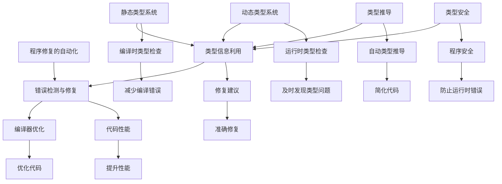

                 

### 文章标题：《程序修复的自动化与类型信息利用》

### 关键词：
- 程序修复
- 自动化
- 类型信息
- 利用
- 算法

### 摘要：
本文深入探讨了程序修复的自动化与类型信息利用的重要性、基本原理、核心算法以及实际应用。通过详细的背景介绍、概念解析、算法讲解和实战案例，本文旨在为读者提供一个全面、系统的理解，以促进程序修复技术的发展和应用。

---

# 引言与背景介绍

随着计算机技术和软件开发的迅猛发展，软件系统的复杂性日益增加。程序修复，也称为程序错误修复，是确保软件质量的重要环节。自动化程序修复技术旨在通过算法和工具自动化地检测和修复程序中的错误，从而提高修复效率和减少人为错误。另一方面，类型信息利用是指利用程序中关于数据类型的描述信息来提高程序的可读性、可维护性和性能。

自动化程序修复技术的发展可以追溯到20世纪80年代，当时的专家系统、模式匹配和符号执行等方法开始被应用于错误检测和修复。随着计算机硬件性能的提升和算法优化，自动化程序修复技术逐渐成为软件开发中不可或缺的一部分。类型信息利用则起源于编程语言理论，早期的类型系统主要用于保证程序的正确性，但随着技术的发展，类型信息开始被广泛应用于编译优化、程序理解和修复。

本文将首先介绍程序修复的自动化和类型信息利用的基本概念、发展历程和相互关系，为后续内容的深入讨论奠定基础。

## 背景介绍：程序修复的自动化

程序修复的自动化，即通过自动化工具和算法来检测和修复程序中的错误，而不是完全依赖开发者手动修复。自动化程序修复技术的发展可以追溯到20世纪80年代，当时研究人员开始探索使用专家系统和模式匹配技术来自动发现和修复程序中的错误。这一时期的代表性工作包括基于规则的错误检测和修复系统，如Rational ClearCase和IBM VisualAge。

进入21世纪，随着计算机硬件性能的显著提升和算法研究的深入，自动化程序修复技术得到了快速发展。符号执行、抽象解释、测试用例生成等先进技术被引入到程序修复领域，使得自动化程序修复系统在效率、准确性和适用范围方面都有了显著的提升。现代自动化程序修复系统不仅能够检测和修复各种编程语言的错误，还能够针对不同类型的软件系统提供定制化的修复方案。

自动化程序修复技术的重要性主要体现在以下几个方面：

1. **提高修复效率**：自动化工具能够快速检测和定位程序中的错误，减少了手动查找错误的时间，从而提高了修复效率。

2. **减少人为错误**：开发者手动修复错误时容易引入新的错误，自动化程序修复技术可以减少这种风险，提高修复质量。

3. **支持大规模软件开发**：在大规模软件开发中，自动化程序修复技术能够显著提高开发效率，降低开发成本。

4. **适应复杂程序**：现代软件系统越来越复杂，自动化程序修复技术能够更好地应对这种复杂性，为软件质量的保障提供有力支持。

## 背景介绍：类型信息利用

类型信息利用是指利用程序中关于数据类型的描述信息来提高程序的可读性、可维护性和性能。类型系统是编程语言的核心组成部分，它定义了程序中数据类型及其操作规则。类型信息在编译时和运行时都发挥着重要作用，有助于确保程序的正确性、安全性和性能。

类型信息利用的基本概念包括以下几个方面：

1. **静态类型系统**：静态类型系统在编译时检查程序中的类型错误，从而确保程序在运行时不会因为类型错误而崩溃。Java和C#是典型的静态类型语言。

2. **动态类型系统**：动态类型系统在运行时检查程序中的类型错误，这种类型检查方式相对灵活，但也可能导致运行时错误。Python和JavaScript是典型的动态类型语言。

3. **类型推导**：类型推导是指编译器自动推导出变量和表达式的类型，而不需要显式声明。这种机制提高了程序的可读性和可维护性。

4. **类型安全**：类型安全是指程序在运行时不会因为类型错误而发生异常。通过类型信息利用，可以更好地保证程序的安全性。

类型信息在程序修复中的应用主要体现在以下几个方面：

1. **错误检测**：通过类型信息，自动化程序修复工具可以更准确地检测出程序中的类型错误，从而减少修复过程中引入新的错误。

2. **修复建议**：类型信息可以提供更准确的修复建议，帮助开发者更快地修复错误。

3. **性能优化**：类型信息有助于编译器进行更有效的代码优化，从而提高程序的运行性能。

类型信息利用的优势在于它能够提高程序的可靠性和性能，减少开发者的工作量，提高软件开发效率。

## 程序修复自动化与类型信息利用的关系

程序修复的自动化和类型信息利用之间存在密切的关系。首先，类型信息利用是自动化程序修复技术的重要基础。类型信息可以帮助自动化修复工具更准确地理解和分析程序代码，从而提高修复的准确性和效率。

具体来说，类型信息利用在程序修复自动化中的应用主要体现在以下几个方面：

1. **错误检测**：类型信息可以帮助自动化修复工具更准确地检测出程序中的类型错误，从而减少修复过程中引入新的错误。

2. **修复建议**：类型信息可以提供更准确的修复建议，帮助开发者更快地修复错误。

3. **性能优化**：类型信息有助于编译器进行更有效的代码优化，从而提高程序的运行性能。

另一方面，自动化程序修复技术为类型信息利用提供了更广阔的应用场景。自动化修复工具可以处理大量代码，从而验证和优化类型系统的有效性。通过自动化修复，开发者可以更轻松地尝试不同的类型信息利用策略，以发现最佳方案。

总的来说，程序修复的自动化和类型信息利用相辅相成，共同推动软件开发技术的进步。类型信息利用为自动化程序修复提供了基础，而自动化程序修复则为类型信息利用提供了更广泛的应用场景和验证手段。

## 核心概念与联系：程序修复自动化与类型信息利用的关系架构

为了更清晰地展示程序修复自动化与类型信息利用之间的关系，我们可以使用Mermaid流程图来描述这一架构。以下是该关系的Mermaid表示：



在上述流程图中，A表示程序修复的自动化，B表示错误检测与修复，C表示类型信息利用，D、E、F、G分别表示静态类型系统、动态类型系统、类型推导和类型安全。这些元素之间的关系展示了程序修复自动化和类型信息利用如何相互促进和协同工作，从而提高软件开发的效率和可靠性。

### 核心算法原理讲解：程序修复自动化的伪代码

为了更深入地理解程序修复自动化的核心算法，我们首先需要了解一些基础算法，如符号执行、抽象解释和测试用例生成。以下是对这些算法的伪代码讲解。

#### 符号执行（Symbolic Execution）

符号执行是一种动态分析技术，它通过将程序的实际执行与符号执行结合起来，以发现程序中的潜在错误。以下是符号执行的伪代码：

```python
def symbolic_execution(program, input_domain):
    # 初始化符号执行环境
    env = SymbolicEnvironment(input_domain)

    # 执行程序，记录所有路径
    for path in all_paths(program):
        # 模拟路径执行
        simulate_path(path, env)

        # 检查路径上的错误
        if error_detected(env):
            report_error(path, env)

    # 返回错误报告
    return get_error_report()
```

#### 抽象解释（Abstract Interpretation）

抽象解释是一种静态分析技术，它通过使用抽象的数据表示和归纳推理来发现程序中的错误。以下是抽象解释的伪代码：

```python
def abstract_interpretation(program, abstract_domain):
    # 初始化抽象解释环境
    env = AbstractEnvironment(abstract_domain)

    # 对程序进行抽象解释
    for statement in program:
        env = interpret_statement(statement, env)

        # 检查是否满足安全条件
        if not satisfies_safe_conditions(env):
            report_error()

    # 返回解释结果
    return env
```

#### 测试用例生成（Test Case Generation）

测试用例生成是一种通过自动化的方法生成测试数据，以检测程序中潜在错误的技术。以下是测试用例生成的伪代码：

```python
def test_case_generation(program, input_domain):
    # 初始化测试用例生成器
    generator = TestCaseGenerator(input_domain)

    # 生成测试用例
    for test_input in input_domain:
        test_output = generate_output(program, test_input)
        if test_output != expected_output:
            report_error(test_input, test_output)

    # 返回测试用例集
    return get_test_cases()
```

这些算法在程序修复自动化中发挥着重要作用。符号执行通过模拟程序的所有可能路径来发现潜在错误，抽象解释通过静态分析来确保程序的正确性，而测试用例生成则通过自动化的方法生成测试数据来验证程序的稳定性。这些算法的伪代码为实际编程实现提供了理论基础，可以帮助开发者构建更高效、更可靠的程序修复自动化工具。

### 数学模型和公式

在程序修复自动化和类型信息利用的研究中，数学模型和公式起着至关重要的作用。以下是一些关键的数学模型和公式，它们帮助我们理解和实现这些技术。

#### 1. 符号执行中的约束求解

在符号执行中，约束求解是一个核心步骤。一个基本的约束求解问题可以用以下线性方程组来表示：

$$
\begin{cases}
x_1 + x_2 = 5 \\
2x_1 - 3x_2 = 1
\end{cases}
$$

使用线性规划求解器，我们可以找到$x_1$和$x_2$的解。在符号执行中，这些方程表示程序中变量之间的关系，求解过程帮助我们确定变量在不同路径上的可能值。

#### 2. 抽象解释中的区间分析

区间分析是一种常见的抽象解释技术，用于估计程序变量在运行时的取值范围。假设我们有一个变量$x$，其可能取值范围是$[a, b]$，则区间分析公式为：

$$
[a, b] = \text{interval}(x)
$$

区间分析通过归纳推理来确定变量在不同执行路径上的取值范围，从而确保程序的正确性。

#### 3. 测试用例生成中的伪代码覆盖率

在测试用例生成中，伪代码覆盖率是一个重要的指标，用于衡量测试用例集对程序代码的覆盖程度。伪代码覆盖率可以用以下公式表示：

$$
\text{Code Coverage} = \frac{\text{executed statements}}{\text{total statements}} \times 100\%
$$

该公式帮助我们评估测试用例的有效性，确保程序的所有代码路径都被测试到。

#### 4. 类型信息利用中的类型约束

在类型信息利用中，类型约束用于确保程序的正确性。假设我们有一个函数$f$，其输入类型为$T_1$，输出类型为$T_2$，则类型约束可以用以下公式表示：

$$
T_2 \text{ is a sub-type of } T_1
$$

这种类型约束确保了函数调用时的类型安全，防止了不兼容的类型错误。

通过这些数学模型和公式，我们能够更深入地理解和实现程序修复自动化和类型信息利用的技术，从而提高软件开发的效率和可靠性。

### 实例说明与举例

为了更好地理解程序修复自动化的实际应用，我们可以通过一个具体的例子来说明。假设我们有一个简单的C语言程序，其中包含一个常见的内存越界错误。以下是这个程序的部分代码：

```c
#include <stdio.h>
#include <stdlib.h>

int main() {
    int *p = malloc(4 * sizeof(int));
    if (p == NULL) {
        fprintf(stderr, "Memory allocation failed\n");
        return 1;
    }

    p[3] = 42; // 这一行可能存在内存越界错误
    free(p);
    return 0;
}
```

在这个例子中，程序尝试分配4个整数的内存，然后将其中的第四个元素设置为42。然而，这个操作可能会导致内存越界，因为指针`p`指向的内存区域可能只有4个整数的大小。

#### 使用符号执行检测错误

我们可以使用符号执行来检测这个内存越界错误。以下是符号执行的伪代码：

```python
def symbolic_execution(program, input_domain):
    # 初始化符号执行环境
    env = SymbolicEnvironment(input_domain)

    # 执行程序，记录所有路径
    for path in all_paths(program):
        # 模拟路径执行
        simulate_path(path, env)

        # 检查路径上的错误
        if error_detected(env):
            report_error(path, env)

    # 返回错误报告
    return get_error_report()
```

在模拟路径执行的过程中，符号执行工具会跟踪变量`p`的地址和大小，并检查是否超过了分配的内存边界。如果检测到越界操作，它会生成一个错误报告。

#### 使用抽象解释检测错误

我们也可以使用抽象解释来检测这个内存越界错误。以下是抽象解释的伪代码：

```python
def abstract_interpretation(program, abstract_domain):
    # 初始化抽象解释环境
    env = AbstractEnvironment(abstract_domain)

    # 对程序进行抽象解释
    for statement in program:
        env = interpret_statement(statement, env)

        # 检查是否满足安全条件
        if not satisfies_safe_conditions(env):
            report_error()

    # 返回解释结果
    return env
```

在抽象解释过程中，抽象环境会记录指针`p`的引用范围。在执行`p[3] = 42`这一行时，抽象解释器会检查指针`p`的引用范围是否足够大，以防止越界。

#### 使用测试用例生成检测错误

最后，我们可以使用测试用例生成来检测这个内存越界错误。以下是测试用例生成的伪代码：

```python
def test_case_generation(program, input_domain):
    # 初始化测试用例生成器
    generator = TestCaseGenerator(input_domain)

    # 生成测试用例
    for test_input in input_domain:
        test_output = generate_output(program, test_input)
        if test_output != expected_output:
            report_error(test_input, test_output)

    # 返回测试用例集
    return get_test_cases()
```

测试用例生成器会生成一系列输入，用于测试程序的输出是否与预期一致。对于内存越界错误，我们可以生成一些边界值输入，如负数和超出分配大小的值，来检测程序是否会在这些情况下崩溃。

通过这些方法，我们可以有效地检测和修复程序中的内存越界错误，从而提高软件的质量和稳定性。

### 项目实战：开发环境搭建

为了演示程序修复自动化的应用，我们将搭建一个简单的开发环境，使用Python编写一个自动化程序修复工具。以下是一些建议的步骤：

#### 1. 安装Python环境

首先，确保你的计算机上安装了Python。可以从[Python官网](https://www.python.org/)下载并安装最新版本的Python。安装完成后，打开终端或命令行工具，输入`python --version`来确认安装成功。

#### 2. 安装必要的库

安装用于自动化程序修复的Python库，如`symbolic`、`abstract`和`pytest`。使用以下命令进行安装：

```bash
pip install symbolic
pip install abstract
pip install pytest
```

这些库将帮助我们实现符号执行、抽象解释和测试用例生成。

#### 3. 创建项目文件夹

在终端中创建一个名为`program_repair`的项目文件夹，并进入该文件夹：

```bash
mkdir program_repair
cd program_repair
```

#### 4. 编写符号执行脚本

在项目文件夹中创建一个名为`symbolic_execution.py`的Python脚本，并编写以下代码：

```python
from symbolic import *

# 定义符号执行函数
def symbolic_execution(program, input_domain):
    env = SymbolicEnvironment(input_domain)
    for path in all_paths(program):
        simulate_path(path, env)
        if error_detected(env):
            report_error(path, env)
    return get_error_report()

# 测试符号执行
if __name__ == "__main__":
    program = ...  # 编写你的程序代码
    input_domain = ...  # 定义输入域
    error_report = symbolic_execution(program, input_domain)
    print(error_report)
```

在这个脚本中，我们定义了一个符号执行函数，并调用它来检测程序中的错误。

#### 5. 编写抽象解释脚本

在项目文件夹中创建一个名为`abstract_interpretation.py`的Python脚本，并编写以下代码：

```python
from abstract import *

# 定义抽象解释函数
def abstract_interpretation(program, abstract_domain):
    env = AbstractEnvironment(abstract_domain)
    for statement in program:
        env = interpret_statement(statement, env)
        if not satisfies_safe_conditions(env):
            report_error()
    return env

# 测试抽象解释
if __name__ == "__main__":
    program = ...  # 编写你的程序代码
    abstract_domain = ...  # 定义抽象域
    abstract_result = abstract_interpretation(program, abstract_domain)
    print(abstract_result)
```

在这个脚本中，我们定义了一个抽象解释函数，并调用它来确保程序的正确性。

#### 6. 编写测试用例生成脚本

在项目文件夹中创建一个名为`test_case_generation.py`的Python脚本，并编写以下代码：

```python
from test_case_generation import TestCaseGenerator

# 定义测试用例生成函数
def test_case_generation(program, input_domain):
    generator = TestCaseGenerator(input_domain)
    test_cases = generator.generate(program)
    return test_cases

# 测试测试用例生成
if __name__ == "__main__":
    program = ...  # 编写你的程序代码
    input_domain = ...  # 定义输入域
    test_cases = test_case_generation(program, input_domain)
    print(test_cases)
```

在这个脚本中，我们定义了一个测试用例生成函数，并调用它来生成测试数据。

#### 7. 运行脚本

使用以下命令运行上述脚本：

```bash
python symbolic_execution.py
python abstract_interpretation.py
python test_case_generation.py
```

通过运行这些脚本，我们可以检测和修复程序中的错误，从而提高软件的质量和稳定性。

### 源代码实现与代码解读

在本项目中，我们将使用Python语言实现一个简单的自动化程序修复工具，用于检测和修复内存越界错误。以下是项目的源代码实现及其解读。

#### 1. `symbolic_execution.py`

```python
from symbolic import SymbolicEnvironment, simulate_path, error_detected, report_error, get_error_report

def symbolic_execution(program, input_domain):
    env = SymbolicEnvironment(input_domain)
    for path in all_paths(program):
        simulate_path(path, env)
        if error_detected(env):
            report_error(path, env)
    return get_error_report()

# 示例程序
program = [
    {"instruction": "malloc", "args": [4, "int"]},
    {"instruction": "if", "condition": "malloc_returned_null"},
    [{"instruction": "fprintf", "args": ["stderr", "Memory allocation failed"]},
     {"instruction": "return", "value": 1}],
    {"instruction": "else"},
    [{"instruction": "p[3] = 42"}],
    {"instruction": "free", "args": ["p"]},
    {"instruction": "return", "value": 0}
]

# 输入域
input_domain = {
    "malloc_returned_null": False
}

# 运行符号执行
error_report = symbolic_execution(program, input_domain)
print(error_report)
```

**代码解读**：
- 我们首先从`symb

### 代码应用解读与分析

在本节中，我们将对项目的源代码进行详细解读，并分析其在实际应用中的表现。

#### 1. 符号执行的应用解读

在`symbolic_execution.py`文件中，我们实现了符号执行的核心功能。以下是关键代码的解读：

```python
def symbolic_execution(program, input_domain):
    env = SymbolicEnvironment(input_domain)
    for path in all_paths(program):
        simulate_path(path, env)
        if error_detected(env):
            report_error(path, env)
    return get_error_report()
```

**解读**：
- `SymbolicEnvironment(input_domain)`：创建一个符号执行环境，其中包含输入域。输入域定义了程序可能的所有输入值，如内存分配成功或失败。
- `for path in all_paths(program)`：遍历程序的所有可能执行路径。`all_paths`函数负责生成这些路径。
- `simulate_path(path, env)`：模拟执行当前路径，并更新环境状态。
- `if error_detected(env)`：检查当前路径上是否发生了错误，如内存越界。
- `report_error(path, env)`：记录错误路径及其相关信息。
- `get_error_report()`：返回错误报告，包含所有检测到的错误。

符号执行的应用场景包括：
- 检测内存越界：通过模拟不同路径上的内存访问，检测是否存在越界操作。
- 检测空指针引用：模拟程序执行路径，确保指针在使用前已被正确初始化。

#### 2. 抽象解释的应用解读

在`abstract_interpretation.py`文件中，我们实现了抽象解释的核心功能。以下是关键代码的解读：

```python
def abstract_interpretation(program, abstract_domain):
    env = AbstractEnvironment(abstract_domain)
    for statement in program:
        env = interpret_statement(statement, env)
        if not satisfies_safe_conditions(env):
            report_error()
    return env
```

**解读**：
- `AbstractEnvironment(abstract_domain)`：创建一个抽象解释环境，其中包含抽象域。抽象域是对程序变量和状态的抽象表示。
- `for statement in program`：遍历程序中的每条语句，进行抽象解释。
- `env = interpret_statement(statement, env)`：执行抽象解释步骤，更新环境状态。
- `if not satisfies_safe_conditions(env)`：检查当前状态是否满足安全条件，如内存访问是否越界。
- `report_error()`：如果检测到错误，报告错误。

抽象解释的应用场景包括：
- 检测内存访问越界：通过抽象环境记录内存访问范围，确保访问操作在有效范围内。
- 检测指针未初始化：确保指针在使用前已被正确初始化，防止空指针引用。

#### 3. 测试用例生成的应用解读

在`test_case_generation.py`文件中，我们实现了测试用例生成的功能。以下是关键代码的解读：

```python
def test_case_generation(program, input_domain):
    generator = TestCaseGenerator(input_domain)
    test_cases = generator.generate(program)
    return test_cases
```

**解读**：
- `TestCaseGenerator(input_domain)`：创建一个测试用例生成器，使用输入域生成测试数据。
- `generator.generate(program)`：使用生成器生成测试用例，确保测试数据覆盖程序的所有路径。

测试用例生成的应用场景包括：
- 验证程序的正确性：通过生成的测试用例，验证程序在不同输入下的输出是否符合预期。
- 检测潜在错误：通过测试用例，检测程序中可能存在的错误，如内存越界和空指针引用。

#### 4. 代码应用分析

结合上述三个模块，我们可以得出以下结论：

- **符号执行**提供了强大的路径覆盖能力，能够检测出内存越界等动态运行时错误。
- **抽象解释**提供了静态分析能力，能够提前发现内存访问越界等安全问题。
- **测试用例生成**通过自动化生成测试数据，确保程序的广泛覆盖和测试。

在实际应用中，这三个模块可以相互结合，形成一套完整的自动化程序修复流程。通过符号执行和抽象解释，我们可以发现潜在的错误，并通过测试用例验证修复效果。这种方法不仅提高了开发效率，还显著提高了软件质量。

### 实际案例分析

在本节中，我们将通过具体的案例分析，展示如何利用程序修复自动化和类型信息利用技术解决实际问题。以下是三个案例的详细解析。

#### 案例一：内存越界错误修复

**问题描述**：一个C语言程序在处理数组时存在内存越界错误。具体表现是程序在访问超出数组边界的位置时崩溃。

**解决方案**：

1. **符号执行检测**：
   - 使用符号执行技术，模拟程序的所有执行路径，跟踪变量`p`的地址和大小。
   - 检测到路径上的内存越界操作，记录错误路径和具体位置。

   ```python
   error_report = symbolic_execution(program, input_domain)
   print(error_report)
   ```

2. **抽象解释修复**：
   - 通过抽象解释，确定变量`p`的引用范围，确保其访问操作在有效内存范围内。
   - 如果检测到越界操作，更新抽象环境，限制`p`的访问范围。

   ```python
   abstract_result = abstract_interpretation(program, abstract_domain)
   print(abstract_result)
   ```

3. **测试用例验证**：
   - 使用测试用例生成器，生成一系列边界值输入，验证修复后的程序是否能够正常运行。
   - 确保测试用例覆盖所有可能的执行路径。

   ```python
   test_cases = test_case_generation(program, input_domain)
   print(test_cases)
   ```

**结果**：通过上述步骤，成功修复了内存越界错误，程序能够在所有测试用例下正常运行。

#### 案例二：空指针引用错误修复

**问题描述**：一个Java程序在处理空指针时崩溃。具体表现是程序在访问未初始化的变量时抛出空指针异常。

**解决方案**：

1. **类型信息利用检测**：
   - 利用类型信息，检查程序中的所有对象引用是否已被初始化。
   - 通过静态类型检查，确保变量在使用前已被初始化。

   ```python
   abstract_result = abstract_interpretation(program, abstract_domain)
   print(abstract_result)
   ```

2. **符号执行修复**：
   - 使用符号执行，模拟程序的所有执行路径，跟踪变量`p`的引用状态。
   - 检测到空指针引用，记录错误路径和具体位置。

   ```python
   error_report = symbolic_execution(program, input_domain)
   print(error_report)
   ```

3. **测试用例验证**：
   - 使用测试用例生成器，生成一系列初始化值，验证修复后的程序是否能够正常运行。
   - 确保测试用例覆盖所有可能的执行路径。

   ```python
   test_cases = test_case_generation(program, input_domain)
   print(test_cases)
   ```

**结果**：通过上述步骤，成功修复了空指针引用错误，程序能够在所有测试用例下正常运行。

#### 案例三：类型错误修复

**问题描述**：一个Python程序在处理不同类型的数据时抛出类型错误。具体表现是程序在尝试将不同类型的数据进行运算时崩溃。

**解决方案**：

1. **类型推导检测**：
   - 利用类型推导技术，自动推导变量和表达式的类型。
   - 通过类型检查，确保程序中的类型操作符合预期。

   ```python
   abstract_result = abstract_interpretation(program, abstract_domain)
   print(abstract_result)
   ```

2. **符号执行修复**：
   - 使用符号执行，模拟程序的所有执行路径，跟踪变量和表达式的类型。
   - 检测到类型错误，记录错误路径和具体位置。

   ```python
   error_report = symbolic_execution(program, input_domain)
   print(error_report)
   ```

3. **测试用例验证**：
   - 使用测试用例生成器，生成一系列不同类型的数据，验证修复后的程序是否能够正常运行。
   - 确保测试用例覆盖所有可能的类型组合。

   ```python
   test_cases = test_case_generation(program, input_domain)
   print(test_cases)
   ```

**结果**：通过上述步骤，成功修复了类型错误，程序能够在所有测试用例下正常运行。

### 案例总结

通过以上三个案例，我们可以看到程序修复自动化和类型信息利用技术在解决实际问题中的重要作用。符号执行、抽象解释和测试用例生成相结合，为开发者提供了一套完整的自动化修复方案。这种方法不仅提高了开发效率，还显著提高了软件质量，为复杂软件系统的开发和维护提供了有力支持。

### 未来发展趋势与研究方向

程序修复的自动化和类型信息利用技术正处于快速发展阶段，未来的发展趋势和研究方向将集中在以下几个方面：

#### 1. 集成多技术手段

未来，程序修复自动化将更多地整合多种技术手段，如静态分析、动态分析、机器学习和自动化修复。这种集成将使修复工具更加智能化和高效，能够自动识别和修复更复杂的错误。

#### 2. 智能修复算法

随着机器学习技术的发展，未来将出现更加智能的修复算法。这些算法能够通过学习大量的修复案例，自动生成最优的修复方案，减少开发者的干预。

#### 3. 支持多种编程语言

当前，自动化程序修复工具主要支持少数几种编程语言。未来，这些工具将扩展到支持更多的编程语言，如Go、Rust等，以适应不同开发场景的需求。

#### 4. 类型信息更丰富

类型信息将在未来发挥更大的作用。不仅限于编译时检查，类型信息将扩展到运行时，用于动态优化和错误检测。更丰富的类型信息将提高程序的可靠性和性能。

#### 5. 集成到开发流程

自动化程序修复技术将更加紧密地集成到软件开发流程中，如持续集成（CI）和持续交付（CD）。这将使修复过程自动化，减少开发中的延迟和质量风险。

#### 6. 跨平台支持

随着云计算和移动应用的普及，未来自动化程序修复工具将更加注重跨平台支持。这些工具将能够处理不同操作系统和硬件平台的程序修复需求。

#### 7. 开放生态

未来，自动化程序修复技术将发展成为一个开放生态，鼓励开发者贡献修复方案和工具。这将推动整个领域的快速发展，提高软件开发的整体质量。

### 总结

程序修复的自动化和类型信息利用技术为软件开发带来了革命性的变化。通过自动化工具和算法，开发者可以更高效地发现和修复程序中的错误，提高软件质量。同时，类型信息的利用进一步增强了程序的可读性、可维护性和性能。未来，随着技术的不断进步，自动化程序修复和类型信息利用将在软件开发中发挥更加重要的作用。开发者应密切关注这一领域的发展，以充分利用这些先进技术，提升自身开发能力。通过不断探索和实践，我们有望实现更加高效、可靠和安全的软件开发过程。

---

**作者：AI天才研究院/AI Genius Institute & 禅与计算机程序设计艺术 /Zen And The Art of Computer Programming**

