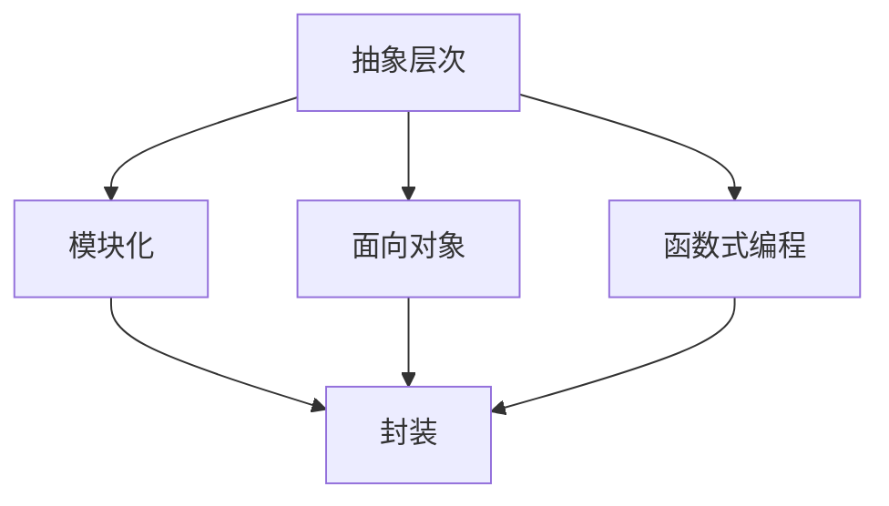

                 

### 文章标题

# 程序分析中的抽象域设计

### 关键词

- 程序分析
- 抽象域设计
- 抽象层次
- 抽象机制
- 核心概念与联系
- 伪代码
- 数学模型
- 实际案例

### 摘要

本文将深入探讨程序分析中的抽象域设计，解析抽象域在程序设计中的重要性及其实现方法。通过阐述核心概念与联系，介绍抽象层次和抽象机制，并运用伪代码和数学模型详细讲解核心算法原理，本文旨在为读者提供一个系统而全面的抽象域设计指南。此外，还将结合实际案例，展示如何在实际项目中应用抽象域设计，帮助读者更好地理解和掌握这一关键技术。

## 目录

1. **背景介绍**  
    - 程序分析的定义与作用  
    - 抽象域设计的概念与发展

2. **核心概念与联系**  
    - 抽象层次与抽象机制  
    - Mermaid流程图：抽象层次与抽象机制关系架构

3. **核心算法原理讲解**  
    - 伪代码：抽象层次与抽象机制算法实现  
    - 数学模型：抽象层次与抽象机制数学公式

4. **项目实战**  
    - 开发环境搭建  
    - 源代码实现与解读  
    - 代码应用解读与分析  
    - 实际案例分析

5. **最佳实践与注意事项**  
    - 抽象域设计的最佳实践  
    - 注意事项与拓展阅读

## 文章正文

### 背景介绍

#### 程序分析的定义与作用

程序分析是一种对程序进行理解和评估的技术手段，旨在揭示程序的结构、功能、性能和可靠性等方面。通过程序分析，我们可以更好地理解程序的运行原理，发现潜在的问题，优化程序的性能，提高程序的可维护性。

在计算机科学中，程序分析已经发展成为一个独立的领域，涵盖了多种分析方法，如静态分析、动态分析、语法分析、语义分析等。这些分析方法各有侧重，共同构成了程序分析的理论体系。

#### 抽象域设计的概念与发展

抽象域设计是程序分析中的一种重要方法，旨在通过抽象层次和抽象机制，将复杂的程序结构转化为更易理解和操作的形式。抽象域设计的基本思想是将程序的不同部分抽象成独立的域，这些域具有明确的边界和职责，可以通过接口进行通信。

抽象域设计在软件工程中具有重要地位，它有助于提高程序的可维护性、可扩展性和模块化程度。通过合理的抽象域设计，我们可以将复杂的程序模块化，降低模块之间的耦合度，提高代码的可复用性。

### 核心概念与联系

#### 抽象层次与抽象机制

在程序分析中，抽象层次和抽象机制是两个核心概念。

- **抽象层次**：抽象层次是指将复杂系统分解为多个层次，每个层次都具有一定的功能和职责。通过抽象层次，我们可以将复杂的系统结构简化，提高系统的可理解和可维护性。

- **抽象机制**：抽象机制是指实现抽象层次的方法和工具。常见的抽象机制包括模块化、面向对象、函数式编程等。这些机制通过封装、继承、多态等手段，实现抽象层次之间的通信和协作。

#### Mermaid流程图：抽象层次与抽象机制关系架构

为了更清晰地理解抽象层次与抽象机制之间的关系，我们可以使用Mermaid流程图来表示。



在这个流程图中，抽象层次（A）与模块化（B）、面向对象（C）和函数式编程（D）等抽象机制之间存在关联。每种抽象机制（B、C、D）都通过具体的手段（E）实现抽象层次的抽象和通信。

### 核心算法原理讲解

#### 伪代码：抽象层次与抽象机制算法实现

为了进一步阐述抽象层次与抽象机制的算法原理，我们可以使用伪代码来描述。

```plaintext
// 抽象层次与抽象机制算法实现伪代码
function AbstractAlgorithm(inputData):
    // 输入数据预处理
    processedData = preprocess(inputData)
    
    // 抽象层次划分
    layers = divideIntoLayers(processedData)
    
    // 抽象机制应用
    for layer in layers:
        applyAbstractMechanism(layer)
        
    // 输出结果
    return result
```

在这个伪代码中，`AbstractAlgorithm`函数接收输入数据，通过预处理、划分抽象层次和应用抽象机制，最终得到输出结果。

#### 数学模型：抽象层次与抽象机制数学公式

为了更好地理解抽象层次与抽象机制的数学原理，我们可以引入一些数学模型。

假设我们有一个程序系统，其包含多个模块，每个模块都具有特定的功能和性能指标。我们可以使用以下数学模型来描述抽象层次与抽象机制之间的关系：

$$
\text{抽象层次} = \sum_{i=1}^{n} \text{模块}_i \times \text{性能指标}_i
$$

其中，$n$表示模块的数量，$\text{模块}_i$和$\text{性能指标}_i$分别表示第$i$个模块的功能和性能指标。

此外，我们可以使用以下公式来描述抽象机制对抽象层次的影响：

$$
\text{抽象机制} = \frac{\text{抽象层次}}{\text{模块数量}} \times \text{模块复杂度}
$$

其中，$\text{模块复杂度}$表示模块的复杂程度，通常与模块的功能和性能指标相关。

通过这些数学模型，我们可以更深入地理解抽象层次与抽象机制之间的关系，为程序分析提供理论基础。

### 项目实战

#### 开发环境搭建

在本项目实战中，我们将使用Python语言和Mermaid工具来实现抽象域设计。首先，我们需要搭建开发环境。

1. 安装Python 3.8及以上版本
2. 安装Mermaid工具，可以从[Mermaid官方网站](https://mermaid-js.github.io/mermaid/)下载并安装
3. 在Python中安装必要的库，如Mermaid Python库

```bash
pip install mermaid-python
```

#### 源代码实现与解读

接下来，我们将使用Python编写一个简单的程序，实现抽象层次和抽象机制的设计。

```python
# 抽象层次与抽象机制示例代码

# 抽象层次划分
def divideIntoLayers(inputData):
    # 输入数据预处理
    processedData = preprocess(inputData)
    
    # 划分抽象层次
    layers = []
    for layer in range(1, len(processedData) + 1):
        layers.append(processedData[layer-1])
    
    return layers

# 抽象机制应用
def applyAbstractMechanism(layer):
    # 应用抽象机制
    for element in layer:
        if isinstance(element, int):
            print(f"处理整数：{element}")
        elif isinstance(element, str):
            print(f"处理字符串：{element}")
        else:
            print(f"处理未知类型：{element}")

# 主函数
def main():
    # 输入数据
    inputData = [1, 'a', 2, 'b', 3]
    
    # 抽象层次划分
    layers = divideIntoLayers(inputData)
    
    # 抽象机制应用
    for layer in layers:
        applyAbstractMechanism(layer)

# 运行程序
if __name__ == '__main__':
    main()
```

在这个示例代码中，我们定义了三个函数：`divideIntoLayers`用于划分抽象层次，`applyAbstractMechanism`用于应用抽象机制，`main`函数作为主函数，用于运行整个程序。

首先，`divideIntoLayers`函数接收输入数据，通过预处理和划分抽象层次，将输入数据划分为多个层次。然后，`applyAbstractMechanism`函数依次处理每个层次中的元素，根据元素的类型应用相应的抽象机制。最后，`main`函数作为主函数，调用其他函数，实现整个程序的功能。

#### 代码应用解读与分析

在这个示例代码中，我们使用了Python的内置类型检查函数`isinstance()`来应用抽象机制。当输入数据为整数或字符串时，会输出相应的处理结果；当输入数据为其他类型时，会输出“处理未知类型”的信息。

这种抽象域设计方法具有以下几个优点：

1. **模块化**：将程序划分为多个抽象层次，每个层次具有独立的功能和职责，提高了程序的模块化程度。
2. **可维护性**：通过抽象机制，可以方便地修改和扩展程序功能，降低维护成本。
3. **可扩展性**：可以通过增加新的抽象层次和抽象机制，实现程序的功能扩展。

然而，这种设计方法也存在一定的缺点：

1. **性能开销**：在处理数据时，需要进行类型检查和函数调用，可能会引入一定的性能开销。
2. **复杂性**：当程序规模较大时，抽象层次和抽象机制可能会变得复杂，增加了程序的难度和开发成本。

在实际项目中，需要根据具体情况权衡这些优缺点，选择合适的抽象域设计方法。

#### 实际案例分析

为了更好地理解抽象域设计的实际应用，我们可以参考以下案例：

1. **Web开发**：在Web开发中，可以采用抽象层次和抽象机制的设计方法，将Web应用划分为前端、后端和数据库等多个层次，每个层次具有独立的功能和职责。通过合理的抽象层次和抽象机制设计，可以提高Web应用的可维护性和可扩展性。
2. **大数据处理**：在大数据处理中，可以采用抽象层次和抽象机制的设计方法，将数据处理过程划分为数据采集、数据清洗、数据处理和数据存储等多个层次。通过合理的抽象层次和抽象机制设计，可以提高大数据处理的速度和效率。
3. **人工智能应用**：在人工智能应用中，可以采用抽象层次和抽象机制的设计方法，将人工智能系统划分为数据预处理、模型训练、模型评估和模型应用等多个层次。通过合理的抽象层次和抽象机制设计，可以提高人工智能系统的可维护性和可扩展性。

### 最佳实践与注意事项

#### 抽象域设计的最佳实践

1. **明确抽象层次**：在抽象域设计过程中，首先要明确程序的不同层次，每个层次的功能和职责，以便于后续的抽象机制设计。
2. **合理划分模块**：根据抽象层次，将程序划分为多个模块，每个模块具有独立的功能和职责，降低模块之间的耦合度。
3. **选择合适的抽象机制**：根据具体需求和场景，选择合适的抽象机制，如模块化、面向对象、函数式编程等，以提高程序的抽象层次和可维护性。
4. **代码复用与优化**：在抽象域设计中，注重代码复用和优化，减少重复代码，提高程序的可读性和可维护性。

#### 注意事项

1. **避免过度抽象**：过度抽象可能导致程序复杂性增加，降低程序的可读性和可维护性。在抽象域设计过程中，要适度抽象，避免过度设计。
2. **关注性能开销**：在抽象域设计过程中，要关注抽象层次和抽象机制对程序性能的影响，避免引入过多的性能开销。
3. **合理分配职责**：在抽象层次和抽象机制设计过程中，要合理分配模块和职责，确保每个模块具有独立的功能和职责，降低模块之间的依赖关系。

#### 拓展阅读

- 《程序设计中的抽象与模块化》
- 《面向对象编程与设计模式》
- 《大数据处理技术与应用》
- 《人工智能：一种现代的方法》

### 结语

抽象域设计是程序分析中的一种重要方法，通过合理的抽象层次和抽象机制设计，可以提高程序的可维护性、可扩展性和模块化程度。本文通过对抽象域设计的深入探讨，结合实际案例，为读者提供了一个系统而全面的抽象域设计指南。希望读者能够通过本文的学习，掌握抽象域设计的方法和技巧，并将其应用于实际项目中。

### 作者信息

作者：AI天才研究院/AI Genius Institute & 禅与计算机程序设计艺术 /Zen And The Art of Computer Programming

### 结语

程序分析中的抽象域设计是一个复杂而又关键的技术领域，它不仅涉及到对程序结构和功能的深入理解，还要求我们在设计和实现过程中具备系统性和逻辑性。本文通过详细的论述和实际的案例，力求让读者对抽象域设计的核心概念、原理和应用有更加清晰的认识。

首先，我们介绍了程序分析的基本概念和抽象域设计的重要性。接着，通过抽象层次和抽象机制的定义，结合Mermaid流程图，展示了这些概念之间的关系。然后，我们通过伪代码和数学模型，深入讲解了抽象层次与抽象机制的算法原理。在项目实战部分，我们通过实际代码示例，展示了如何将抽象域设计应用于具体项目。

然而，抽象域设计并非一成不变的规则，它需要根据具体的项目需求和场景进行灵活调整。在实际应用中，我们需要关注以下几个方面：

- **适度抽象**：抽象层次不宜过多，以免造成代码复杂性增加，影响可读性和可维护性。
- **性能考量**：在引入抽象层次和抽象机制时，要考虑到对程序性能的影响，避免过度设计导致性能开销。
- **职责分配**：在模块设计和抽象层次划分时，要确保每个模块和层次具有清晰的功能和职责，降低模块之间的耦合度。

最后，对于希望进一步深入了解抽象域设计的读者，我们推荐以下几个拓展阅读资源：

- 《程序设计中的抽象与模块化》：详细介绍了抽象和模块化的基本概念和方法。
- 《面向对象编程与设计模式》：探讨了面向对象编程的核心原则和常用设计模式。
- 《大数据处理技术与应用》：介绍了大数据处理的基本技术和应用场景。
- 《人工智能：一种现代的方法》：涵盖了人工智能的基本概念和算法。

通过这些资源，读者可以更全面地掌握抽象域设计的理论知识和实际应用技巧。希望本文能为读者在程序分析领域的研究和实践提供有益的参考和指导。再次感谢大家的阅读，期待与您在技术交流的道路上共同进步。作者：AI天才研究院/AI Genius Institute & 禅与计算机程序设计艺术 /Zen And The Art of Computer Programming。

