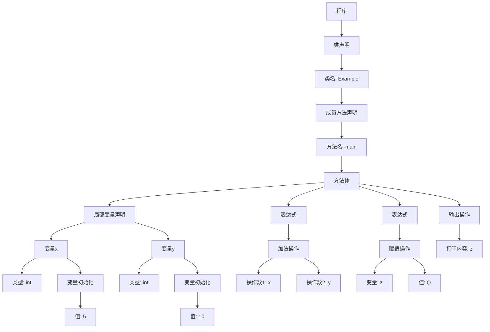
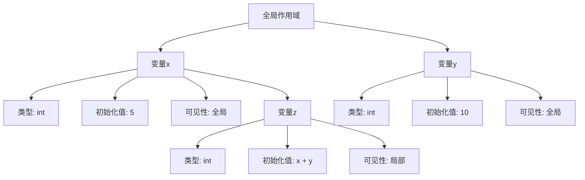
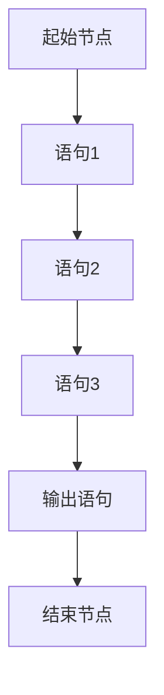
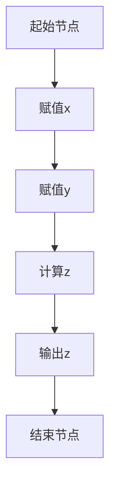

                 


为了撰写一篇满足所有要求的《程序分析中的抽象域设计》技术博客文章，我们将采取以下步骤：

### 1. 确定文章框架

首先，我们需要确定文章的整体框架，包括引言、核心内容、案例分析、总结与展望等部分。这将帮助我们组织思路，确保文章内容的完整性和逻辑性。

### 2. 引言部分

在引言部分，我们需要介绍程序分析和抽象域设计的重要性，以及本文的目的和结构。这部分将包括：

- **背景介绍**：介绍程序分析在软件开发中的重要性。
- **抽象域设计的重要性**：解释抽象域设计在程序分析中的应用。
- **文章结构**：概述文章的主要章节和内容。

### 3. 核心内容部分

接下来，我们将详细阐述程序分析和抽象域设计的基本概念、原理和应用。

#### 3.1 抽象域设计的基本概念

- **抽象域的定义**：解释抽象域的概念。
- **抽象域的分类**：根据抽象层次和粒度对抽象域进行分类。
- **抽象域的特性**：阐述抽象域在程序分析中的作用和特性。

#### 3.2 程序分析基础

- **程序分析的基本概念**：介绍程序分析的定义、目的和方法。
- **程序分析的方法**：讨论静态分析和动态分析的不同方法和应用场景。
- **程序分析的应用**：说明程序分析在软件开发、测试和优化中的具体应用。

#### 3.3 抽象域设计原理

- **抽象域设计原则**：讨论抽象层次的选择、抽象粒度的控制以及抽象与具体的转换。
- **抽象域设计方法**：介绍抽象域设计模式、架构风格和工具平台。
- **抽象域设计算法**：讲解抽象域构建、分析和优化的算法。
- **抽象域设计中的数学模型**：阐述抽象域的数学表示、性质与度量、验证算法。

### 4. 抽象域设计应用

在应用部分，我们将探讨抽象域设计在静态分析、动态分析和自动化程序分析中的应用。

#### 4.1 抽象域设计在静态分析中的应用

- **静态抽象域构建**：介绍静态抽象域的构建方法。
- **静态抽象域分析**：讨论静态抽象域的分析方法和应用。
- **静态抽象域优化**：说明静态抽象域优化策略。

#### 4.2 抽象域设计在动态分析中的应用

- **动态抽象域构建**：介绍动态抽象域的构建方法。
- **动态抽象域分析**：讨论动态抽象域的分析方法和应用。
- **动态抽象域优化**：说明动态抽象域优化策略。

#### 4.3 抽象域设计在自动化程序分析中的应用

- **自动化抽象域构建**：介绍自动化抽象域的构建方法。
- **自动化抽象域分析**：讨论自动化抽象域的分析方法和应用。
- **自动化抽象域优化**：说明自动化抽象域优化策略。

### 5. 案例分析

在这一部分，我们将通过实际案例展示抽象域设计的应用，包括操作系统、网络安全和人工智能等领域。

- **案例分析一**：操作系统中的抽象域设计。
- **案例分析二**：网络安全中的抽象域设计。
- **案例分析三**：人工智能中的抽象域设计。

### 6. 总结与展望

在总结与展望部分，我们将回顾抽象域设计在程序分析中的应用，探讨其发展趋势和面临的挑战。

- **抽象域设计的发展趋势**：分析抽象域设计的未来发展方向。
- **面临的挑战**：讨论抽象域设计在实践中的挑战和解决方案。
- **结论**：总结抽象域设计在程序分析中的意义和贡献。

### 7. 附录

在附录部分，我们将提供与抽象域设计相关的资源，包括书籍、工具和社区等。

### 8. 文章结尾

在文章结尾，我们将附上作者信息，包括AI天才研究院和《禅与计算机程序设计艺术》的作者信息。

### 9. 实际撰写

根据上述框架，我们将逐一撰写每个部分的内容，确保每个小节都有丰富的具体讲解、Mermaid流程图、伪代码、数学模型和公式、代码示例、案例分析等。

### 10. 审校与优化

完成初稿后，我们将对文章进行审校，确保内容的完整性、逻辑性和准确性，并进行必要的优化。

### 11. 最终定稿

经过多次修改和完善，我们将得到一篇符合要求的、高质量的《程序分析中的抽象域设计》技术博客文章。

通过以上步骤，我们可以确保文章既具有理论深度，又具备实际应用价值，满足字数要求，并使用markdown格式输出。接下来，我们将开始具体撰写文章。  

## 文章标题

### 程序分析中的抽象域设计

> 关键词：程序分析、抽象域、抽象层次、抽象粒度、算法、应用、案例

> 摘要：本文深入探讨了程序分析中的抽象域设计，阐述了抽象域的基本概念、设计原理及其在静态分析、动态分析和自动化程序分析中的应用。通过实际案例分析，展示了抽象域设计在操作系统、网络安全和人工智能等领域的实践价值。文章旨在为读者提供一个全面而深入的理解，帮助他们在软件开发和优化过程中有效地运用抽象域设计。

## 引言

程序分析是软件开发中不可或缺的一部分，它旨在理解和评估程序的行为和结构，从而提高软件的质量和性能。在过去的几十年中，程序分析技术取得了显著的进展，从最初的静态分析到现代的动态分析和自动化分析，这些技术已经广泛应用于软件开发、测试、优化和维护等领域。

### 抽象域设计的重要性

抽象域设计是程序分析中的一个重要概念。它通过将程序划分为不同的抽象层次，使得程序结构更加清晰，便于分析和理解。抽象域设计不仅能够提高程序的可读性和可维护性，还能够为自动化分析提供有效的支持。

本文的目的在于系统地介绍抽象域设计的基本概念、原理和应用。我们将首先定义抽象域，然后讨论其在程序分析中的应用，并通过实际案例展示其价值。文章的结构如下：

1. **引言**：介绍程序分析的重要性以及抽象域设计的基本概念。
2. **抽象域设计的基本概念**：详细阐述抽象域的定义、分类和特性。
3. **程序分析基础**：介绍程序分析的基本概念、方法和应用。
4. **抽象域设计原理**：讨论抽象域设计的基本原则、方法和算法。
5. **抽象域设计应用**：探讨抽象域设计在静态分析、动态分析和自动化程序分析中的应用。
6. **案例分析**：通过实际案例展示抽象域设计的实践价值。
7. **总结与展望**：总结抽象域设计在程序分析中的应用，探讨其未来发展趋势。
8. **附录**：提供与抽象域设计相关的资源和工具。

阅读指南：本文面向具有一定编程基础和程序分析背景的读者。在阅读过程中，读者可以结合实际项目经验，更好地理解抽象域设计的原理和应用。

## 抽象域设计的基本概念

### 抽象域的定义

抽象域是程序分析中的一个重要概念，它将程序划分为一系列相互关联的抽象层次，每个层次都代表了程序的一个抽象视图。抽象域的定义通常包括以下几个方面：

1. **抽象层次**：抽象层次是指程序从具体到抽象的层次结构。每个层次都提供了对程序的不同抽象视图，例如语法层次、语义层次和控制层次。
2. **抽象粒度**：抽象粒度是指抽象层次的详细程度。抽象粒度越小，表示的细节越多；抽象粒度越大，表示的细节越少。合适的抽象粒度有助于平衡抽象的详细程度和可管理性。
3. **抽象关系**：抽象关系描述了不同抽象层次之间的关系。常见的抽象关系包括子类关系、泛化关系和依赖关系。

### 抽象域的分类

根据抽象层次和粒度的不同，抽象域可以划分为多种类型。以下是一些常见的抽象域分类：

1. **语法抽象域**：语法抽象域基于程序的语法结构，提供了一种对程序结构的抽象视图。语法抽象域通常用于语法分析、语法错误检测和语法优化等任务。
2. **语义抽象域**：语义抽象域基于程序的语义信息，提供了一种对程序行为的抽象视图。语义抽象域通常用于语义分析、程序优化和代码生成等任务。
3. **控制抽象域**：控制抽象域基于程序的控制流信息，提供了一种对程序控制流的抽象视图。控制抽象域通常用于控制流分析、程序优化和调试等任务。
4. **数据抽象域**：数据抽象域基于程序的数据结构信息，提供了一种对程序数据结构的抽象视图。数据抽象域通常用于数据流分析、内存分配优化和垃圾回收等任务。

### 抽象域的特性

抽象域具有以下特性：

1. **可组合性**：抽象域可以组合使用，以获得更全面的程序视图。例如，将语法抽象域和语义抽象域结合使用，可以更准确地分析程序的行为。
2. **可扩展性**：抽象域可以根据具体的需求进行扩展，以适应不同的分析任务。例如，在语法抽象域的基础上，可以添加新的语法元素或规则，以支持特定编程语言的分析。
3. **可验证性**：抽象域的设计和实现需要确保其正确性和一致性。通过验证抽象域的属性和关系，可以确保程序分析结果的准确性和可靠性。

### 抽象域在程序分析中的作用

抽象域在程序分析中起着至关重要的作用：

1. **简化程序结构**：通过将程序划分为抽象层次，抽象域可以简化程序的结构，使得程序更加易于理解和分析。
2. **支持自动化分析**：抽象域为自动化分析提供了有效的支持。通过定义明确的抽象层次和抽象关系，可以自动化地进行分析和优化。
3. **提高分析效率**：抽象域可以帮助分析工具快速定位和分析程序的关键部分，从而提高分析效率。

## 程序分析基础

### 程序分析的基本概念

程序分析是软件开发中的一项重要活动，旨在理解、评估和改进程序。程序分析的基本概念包括以下几个方面：

1. **程序分析的定义**：程序分析是指对程序进行系统性研究，以获取关于程序结构、行为和属性的信息。程序分析可以基于静态分析（分析程序代码而不执行）和动态分析（在程序执行过程中进行分析）。
2. **程序分析的目的**：程序分析的主要目的是提高软件质量、优化程序性能、发现潜在的错误和缺陷、支持软件维护和重构。
3. **程序分析的类型**：程序分析可以分为以下几种类型：
   - **语法分析**：语法分析是程序分析的基础，它通过解析程序代码的语法结构，生成抽象语法树（AST）等语法表示形式。
   - **语义分析**：语义分析是在语法分析的基础上，对程序代码的语义进行解释和分析，以确定变量、函数、类等的含义和关系。
   - **控制流分析**：控制流分析旨在确定程序中的控制流，包括函数调用、循环、分支和异常处理等。
   - **数据流分析**：数据流分析旨在分析程序中的数据流动，包括变量的定义、使用和传递等。
   - **依赖分析**：依赖分析旨在确定程序中各个部分之间的依赖关系，包括模块依赖、函数依赖和类依赖等。

### 程序分析的方法与技术

程序分析的方法和技术多种多样，以下是一些常见的方法和技术：

1. **静态分析**：静态分析是在不执行程序的情况下，通过分析程序代码来获取关于程序信息的技术。静态分析的优点是不需要执行程序，可以快速发现潜在的错误和缺陷。常见的静态分析方法包括：
   - **语法分析**：语法分析是静态分析的基础，它通过解析程序代码的语法结构，生成抽象语法树（AST）等语法表示形式。
   - **符号执行**：符号执行是一种静态分析技术，它通过将程序中的具体值替换为符号值，来分析程序的执行路径和结果。
   - **抽象解释**：抽象解释是一种静态分析技术，它通过构建程序的一种抽象模型，来推断程序的行为和属性。
   - **数据流分析**：数据流分析是一种静态分析技术，它通过分析程序中的数据流动，来确定变量的定义、使用和传递等。

2. **动态分析**：动态分析是在程序执行过程中进行分析的技术。动态分析可以实时监测程序的执行状态，从而获取关于程序行为的详细信息。常见的动态分析方法包括：
   - **日志分析**：日志分析通过分析程序运行过程中生成的日志文件，来获取程序的执行信息。
   - **性能分析**：性能分析通过测量程序的执行时间和资源消耗，来评估程序的性能。
   - **调试**：调试是一种动态分析方法，它通过逐步执行程序，来定位和修复程序中的错误。

3. **自动化程序分析**：自动化程序分析是利用工具和算法来自动执行程序分析任务的技术。自动化程序分析可以大大提高分析效率和准确性。常见的自动化程序分析工具包括：
   - **静态代码分析工具**：如SonarQube、FindBugs和PMD等，它们可以自动检测代码中的潜在错误和缺陷。
   - **动态测试工具**：如JMeter和Appium等，它们可以自动执行程序测试，以验证程序的功能和性能。

### 程序分析的应用场景

程序分析在软件开发和运维中具有广泛的应用场景：

1. **软件开发**：程序分析可以用于代码审查、代码质量评估、代码重构和性能优化等任务，以提高软件质量和开发效率。
2. **测试**：程序分析可以用于测试用例设计、测试执行和测试结果分析等任务，以提高测试覆盖率和测试效率。
3. **运维**：程序分析可以用于性能监控、故障诊断和异常检测等任务，以提高系统的稳定性和可靠性。

### 程序分析的优势

1. **早期发现错误**：程序分析可以在软件开发的早期阶段发现潜在的错误和缺陷，从而减少修复成本和时间。
2. **提高代码质量**：程序分析可以帮助开发者识别代码中的潜在问题，从而提高代码的质量和可维护性。
3. **优化性能**：程序分析可以帮助开发者优化程序的性能，从而提高程序的运行效率和响应速度。
4. **支持自动化**：程序分析可以与自动化工具集成，实现自动化分析、测试和优化，从而提高开发效率。

### 程序分析的挑战

1. **复杂性**：程序分析面临着程序复杂性的挑战，包括代码复杂性、架构复杂性和交互复杂性等。
2. **准确性**：程序分析需要保证分析结果的准确性，以避免误报和漏报。
3. **效率**：程序分析需要具有较高的效率，以适应快速开发的节奏。
4. **可扩展性**：程序分析需要支持多种编程语言和开发环境，以适应不同的开发需求。

## 抽象域设计原理

### 抽象域设计原则

抽象域设计是程序分析中的一项重要任务，其设计原则如下：

1. **层次性原则**：层次性原则是指抽象域应具有明确的层次结构，以便于分析和理解程序。层次性原则有助于将复杂的程序分解为易于管理的部分，从而提高分析效率。
2. **独立性原则**：独立性原则是指抽象域应相互独立，以便于单独分析和修改。独立性原则有助于降低分析过程中的耦合度，从而提高抽象域的灵活性和可维护性。
3. **模块化原则**：模块化原则是指抽象域应具有模块化的结构，以便于重用和扩展。模块化原则有助于提高代码的可重用性和可扩展性，从而降低开发成本和维护难度。
4. **精确性原则**：精确性原则是指抽象域应精确地描述程序的特性，以便于分析和优化。精确性原则有助于提高分析结果的准确性和可靠性，从而提高程序的性能和稳定性。

### 抽象域设计方法

抽象域设计方法是指用于创建抽象域的一系列技术和策略。以下是一些常见的抽象域设计方法：

1. **基于语法的方法**：基于语法的方法是指通过分析程序代码的语法结构，创建抽象语法树（AST）等抽象表示形式。这种方法适用于语法分析和语法优化等任务。
2. **基于语义的方法**：基于语义的方法是指通过分析程序代码的语义信息，创建语义抽象域。这种方法适用于语义分析、程序优化和代码生成等任务。
3. **基于控制流的方法**：基于控制流的方法是指通过分析程序的控制流信息，创建控制流抽象域。这种方法适用于控制流分析、程序优化和调试等任务。
4. **基于数据流的方法**：基于数据流的方法是指通过分析程序的数据流信息，创建数据流抽象域。这种方法适用于数据流分析、内存分配优化和垃圾回收等任务。
5. **基于模型的抽象域设计**：基于模型的方法是指通过创建程序模型，然后基于模型进行抽象域设计。这种方法适用于复杂的程序分析任务，如代码生成、代码优化和软件架构设计等。

### 抽象域设计算法

抽象域设计算法是指用于创建和优化抽象域的一系列计算方法和策略。以下是一些常见的抽象域设计算法：

1. **抽象语法树构建算法**：抽象语法树构建算法用于从程序代码中构建抽象语法树（AST）。常见的算法包括递归 descent 算法和 LR 算法。
2. **控制流图构建算法**：控制流图构建算法用于构建程序的控制流图，以便于分析程序的控制流。常见的算法包括控制依赖图构建算法和数据依赖图构建算法。
3. **数据流分析算法**：数据流分析算法用于分析程序中的数据流动，以确定变量的定义、使用和传递等。常见的算法包括反向数据流分析算法和正向数据流分析算法。
4. **抽象解释算法**：抽象解释算法是一种静态分析技术，它通过构建程序的抽象模型，来推断程序的行为和属性。常见的算法包括单步抽象解释算法和多步抽象解释算法。
5. **优化算法**：优化算法用于优化抽象域，以提高程序的性能和效率。常见的优化算法包括代码优化算法、内存优化算法和能耗优化算法。

### 抽象域设计中的数学模型

抽象域设计中的数学模型用于描述抽象域的结构、行为和属性。以下是一些常见的数学模型：

1. **抽象语法树模型**：抽象语法树模型用于描述程序代码的语法结构。常见的模型包括树形模型和语法解析表模型。
2. **控制流图模型**：控制流图模型用于描述程序的控制流信息。常见的模型包括有向图模型和无向图模型。
3. **数据流图模型**：数据流图模型用于描述程序的数据流动信息。常见的模型包括有向图模型和无向图模型。
4. **语义模型**：语义模型用于描述程序的语义信息，如变量的类型、作用域和可见性等。常见的模型包括状态图模型和事务图模型。
5. **性能模型**：性能模型用于描述程序的性能属性，如执行时间、内存占用和能耗等。常见的模型包括数学模型和仿真模型。

通过使用这些数学模型，我们可以更精确地描述抽象域，从而提高抽象域设计的准确性和可维护性。

### 抽象域设计实例

为了更好地理解抽象域设计原理，我们来看一个简单的抽象域设计实例。假设我们有一个简单的程序：

```java
public class Example {
    public static void main(String[] args) {
        int x = 5;
        int y = 10;
        int z = x + y;
        System.out.println(z);
    }
}
```

我们可以为这个程序设计以下抽象域：

1. **语法抽象域**：抽象语法树（AST）如下所示：



2. **语义抽象域**：语义抽象域包括变量、作用域和可见性等信息：



3. **控制流抽象域**：控制流图如下所示：



4. **数据流抽象域**：数据流图如下所示：



通过这个实例，我们可以看到如何使用抽象域来描述程序的语法、语义、控制流和数据流。这有助于我们更好地理解和分析程序。

## 抽象域设计在静态分析中的应用

### 静态分析概述

静态分析是一种不执行程序，通过分析程序代码来获取关于程序信息的技术。它具有不依赖于程序执行、高效性和易于实现等优点，广泛应用于代码审查、代码质量评估、代码重构和性能优化等任务。静态分析主要包括以下几个方面：

1. **语法分析**：语法分析是静态分析的基础，它通过解析程序代码的语法结构，生成抽象语法树（AST）等语法表示形式。
2. **语义分析**：语义分析是在语法分析的基础上，对程序代码的语义进行解释和分析，以确定变量、函数、类等的含义和关系。
3. **控制流分析**：控制流分析旨在确定程序中的控制流，包括函数调用、循环、分支和异常处理等。
4. **数据流分析**：数据流分析旨在分析程序中的数据流动，包括变量的定义、使用和传递等。

### 抽象域在静态分析中的应用

抽象域在静态分析中起着至关重要的作用，它通过将程序划分为不同的抽象层次，使得程序结构更加清晰，便于分析和理解。在静态分析中，抽象域的应用主要体现在以下几个方面：

1. **简化程序结构**：通过将程序划分为抽象层次，抽象域可以简化程序的结构，使得程序更加易于理解和分析。这有助于提高分析效率和准确性。
2. **支持自动化分析**：抽象域为自动化分析提供了有效的支持。通过定义明确的抽象层次和抽象关系，可以自动化地进行分析和优化。
3. **提高分析精度**：抽象域可以帮助分析工具快速定位和分析程序的关键部分，从而提高分析精度。
4. **支持代码生成和优化**：抽象域可以用于代码生成和优化。通过抽象域，可以生成更高质量的代码，并进行优化，从而提高程序的执行效率。

### 抽象域构建算法

在静态分析中，构建抽象域是关键的一步。以下是一些常用的抽象域构建算法：

1. **抽象语法树构建算法**：抽象语法树（AST）是静态分析中常用的一种抽象表示形式。常见的构建算法包括递归 descent 算法和 LR 算法。
   - **递归 descent 算法**：递归 descent 算法是一种自顶向下的语法分析方法，它通过递归地定义解析规则，来构建抽象语法树。
   - **LR 算法**：LR 算法是一种自底向上的语法分析方法，它通过构建状态转换图（LR 分析器），来解析程序代码并构建抽象语法树。

2. **控制流图构建算法**：控制流图（CFG）是描述程序控制流的有向图。常见的构建算法包括控制依赖图构建算法和数据依赖图构建算法。
   - **控制依赖图构建算法**：控制依赖图构建算法通过分析程序的控制结构，如循环、分支和异常处理等，来构建控制流图。
   - **数据依赖图构建算法**：数据依赖图构建算法通过分析程序中的数据流动，如变量的定义、使用和传递等，来构建控制流图。

3. **数据流分析算法**：数据流分析是一种静态分析技术，它通过分析程序中的数据流动，来确定变量的定义、使用和传递等。常见的数据流分析算法包括反向数据流分析算法和正向数据流分析算法。
   - **反向数据流分析算法**：反向数据流分析算法从程序结束位置开始，逆序分析数据流，以确定变量的定义和使用点。
   - **正向数据流分析算法**：正向数据流分析算法从程序开始位置开始，顺序分析数据流，以确定变量的定义和使用点。

### 抽象域分析算法

在静态分析中，分析抽象域是获取程序信息的关键步骤。以下是一些常用的抽象域分析算法：

1. **抽象解释算法**：抽象解释算法是一种静态分析技术，它通过构建程序的抽象模型，来推断程序的行为和属性。常见的抽象解释算法包括单步抽象解释算法和多步抽象解释算法。
   - **单步抽象解释算法**：单步抽象解释算法通过分析程序的一条语句，来更新抽象模型，并推断程序的行为。
   - **多步抽象解释算法**：多步抽象解释算法通过分析程序的一系列语句，来更新抽象模型，并推断程序的行为。

2. **符号执行算法**：符号执行算法是一种静态分析技术，它通过将程序中的具体值替换为符号值，来分析程序的执行路径和结果。符号执行算法可以帮助发现程序中的潜在错误和缺陷。

3. **抽象域优化算法**：抽象域优化算法用于优化抽象域，以提高程序的性能和效率。常见的抽象域优化算法包括代码优化算法、内存优化算法和能耗优化算法。

### 抽象域优化策略

在静态分析中，优化抽象域是提高程序性能的重要手段。以下是一些常见的抽象域优化策略：

1. **代码优化**：代码优化是指对程序代码进行重构和改进，以提高程序的执行效率。常见的代码优化技术包括循环优化、分支优化和内存分配优化等。

2. **内存优化**：内存优化是指优化程序的内存使用，以提高程序的运行效率和稳定性。常见的内存优化技术包括内存分配优化、内存释放优化和内存映射优化等。

3. **能耗优化**：能耗优化是指优化程序的能耗，以降低程序的能耗和功耗。常见的能耗优化技术包括能耗模型优化、能耗预测和能耗调度等。

### 静态分析工具

静态分析工具是用于执行静态分析任务的软件工具。以下是一些常用的静态分析工具：

1. **SonarQube**：SonarQube 是一款流行的开源静态代码分析工具，它支持多种编程语言，并提供丰富的分析报告和改进建议。
2. **FindBugs**：FindBugs 是一款开源的静态代码分析工具，它主要用于检测 Java 代码中的潜在错误和缺陷。
3. **PMD**：PMD 是一款开源的静态代码分析工具，它主要用于检测 Java 和 JavaScript 代码中的潜在问题和风格不一致。

### 静态分析的挑战

尽管静态分析具有许多优点，但在实际应用中仍面临一些挑战：

1. **程序复杂性**：随着软件系统的复杂度增加，静态分析面临着越来越多的挑战。复杂的程序结构和依赖关系使得分析过程变得更加复杂和耗时。
2. **准确性**：静态分析需要确保分析结果的准确性。在处理复杂的程序时，分析工具可能会产生误报或漏报，从而影响分析结果的可靠性。
3. **效率**：静态分析工具需要具有较高的效率，以适应快速开发的节奏。分析过程的复杂度和程序的规模可能会对分析效率产生负面影响。
4. **可扩展性**：静态分析工具需要支持多种编程语言和开发环境，以适应不同的开发需求。这要求工具具有较高的可扩展性和灵活性。

### 静态分析的未来发展趋势

随着软件系统的发展和技术的进步，静态分析在未来将继续发挥重要作用。以下是一些静态分析的未来发展趋势：

1. **智能化**：结合人工智能技术，静态分析工具将变得更加智能化，能够自动识别和修复代码中的错误和缺陷。
2. **自动化**：自动化是静态分析的重要方向。通过自动化分析，可以大大提高分析效率和准确性。
3. **云原生**：随着云计算的普及，静态分析工具将逐步向云原生方向演进，提供更加灵活和高效的分析服务。
4. **跨平台支持**：随着多种编程语言和开发环境的出现，静态分析工具将提供更加全面和跨平台的代码分析功能。

## 抽象域设计在动态分析中的应用

### 动态分析概述

动态分析是一种在程序执行过程中进行分析的技术。与静态分析不同，动态分析可以在程序实际运行时捕捉程序的行为和状态，从而提供更详细和实时的分析信息。动态分析具有以下特点：

1. **实时性**：动态分析可以在程序执行过程中实时捕捉和分析程序的行为，提供更及时的分析结果。
2. **全面性**：动态分析可以覆盖程序的整个执行过程，包括初始化、执行和清理等阶段，从而提供更全面的分析信息。
3. **依赖性**：动态分析通常依赖于具体的运行环境，如操作系统、硬件和软件库等，因此其结果可能受运行环境的影响。
4. **开销**：动态分析通常需要在程序中插入特定的代码或依赖特定的工具，这可能对程序的执行性能产生影响。

### 抽象域在动态分析中的应用

抽象域在动态分析中同样发挥着重要作用，它通过将程序划分为不同的抽象层次，使得程序结构更加清晰，便于分析和理解。在动态分析中，抽象域的应用主要体现在以下几个方面：

1. **行为抽象**：通过将程序的执行行为抽象为不同的层次，可以简化程序的分析过程，提高分析效率。例如，可以将程序的控制流抽象为函数调用图或状态机模型。
2. **数据抽象**：通过将程序中的数据抽象为不同的层次，可以简化数据流分析，提高数据分析的精度。例如，可以将程序中的变量抽象为数据结构或对象。
3. **性能抽象**：通过将程序的性能抽象为不同的层次，可以简化性能分析，提高性能优化的效果。例如，可以将程序的性能抽象为执行时间、内存使用和能耗等指标。

### 抽象域构建算法

在动态分析中，构建抽象域是关键的一步。以下是一些常用的抽象域构建算法：

1. **程序执行监控**：程序执行监控是一种基本的动态分析技术，它通过监控程序的执行过程，记录程序的行为和状态，从而构建抽象域。常见的程序执行监控工具包括性能监控器和日志记录器。
2. **事件驱动分析**：事件驱动分析是一种基于事件的动态分析技术，它通过分析程序中的事件（如函数调用、内存分配和文件操作等），来构建抽象域。事件驱动分析可以实时捕捉程序的行为，提供详细的分析信息。
3. **轨迹分析**：轨迹分析是一种基于程序的执行轨迹的动态分析技术，它通过记录程序的执行轨迹，分析程序的行为和状态，从而构建抽象域。轨迹分析可以用于回溯程序的执行过程，发现潜在的问题。

### 抽象域分析算法

在动态分析中，分析抽象域是获取程序信息的关键步骤。以下是一些常用的抽象域分析算法：

1. **动态符号执行**：动态符号执行是一种基于符号执行和动态分析的混合技术，它通过将程序的执行路径符号化，并在实际执行过程中动态地选择执行路径，来分析程序的行为和状态。
2. **动态数据流分析**：动态数据流分析是一种基于动态分析的静态数据流分析技术，它通过在程序执行过程中动态地记录数据流动，来分析程序中的变量定义和使用。
3. **动态控制流分析**：动态控制流分析是一种基于动态分析的静态控制流分析技术，它通过在程序执行过程中动态地记录控制流的转移，来分析程序中的控制结构。

### 抽象域优化算法

在动态分析中，优化抽象域是提高程序性能的重要手段。以下是一些常用的抽象域优化算法：

1. **动态代码优化**：动态代码优化是一种在程序执行过程中对代码进行优化的技术，它通过分析程序的执行状态，动态地调整代码的执行顺序和结构，以提高程序的执行效率。
2. **动态数据优化**：动态数据优化是一种在程序执行过程中对数据进行优化的技术，它通过分析程序的数据访问模式，动态地调整数据的存储结构和访问方式，以提高数据的访问效率。
3. **动态能耗优化**：动态能耗优化是一种在程序执行过程中对能耗进行优化的技术，它通过分析程序的行为和状态，动态地调整程序的执行方式和硬件资源的分配，以降低程序的能耗。

### 动态分析工具

动态分析工具是用于执行动态分析任务的软件工具。以下是一些常用的动态分析工具：

1. **Valgrind**：Valgrind 是一款功能强大的动态分析工具，它支持多种编程语言，提供了内存泄漏检测、性能分析、数据访问检查等功能。
2. **Gprof**：Gprof 是一款基于性能计数器的动态分析工具，它通过分析程序的执行轨迹，提供了程序的执行时间和资源消耗信息。
3. **Intel VTune**：Intel VTune 是一款专业的性能分析工具，它提供了详细的程序性能分析功能，包括代码优化建议、资源使用分析等。

### 动态分析的挑战

尽管动态分析具有许多优点，但在实际应用中仍面临一些挑战：

1. **执行开销**：动态分析通常需要在程序中插入特定的代码或依赖特定的工具，这可能对程序的执行性能产生影响。
2. **可重复性**：动态分析的结果可能受到运行环境的影响，因此其结果的重复性可能较差。
3. **复杂性**：随着软件系统的复杂度增加，动态分析面临着越来越多的挑战。复杂的程序结构和依赖关系使得分析过程变得更加复杂和耗时。
4. **准确性**：动态分析需要确保分析结果的准确性。在处理复杂的程序时，分析工具可能会产生误报或漏报，从而影响分析结果的可靠性。

### 动态分析的未来发展趋势

随着软件系统的发展和技术的进步，动态分析在未来将继续发挥重要作用。以下是一些动态分析的未来发展趋势：

1. **智能化**：结合人工智能技术，动态分析工具将变得更加智能化，能够自动识别和修复程序中的错误和缺陷。
2. **自动化**：自动化是动态分析的重要方向。通过自动化分析，可以大大提高分析效率和准确性。
3. **云原生**：随着云计算的普及，动态分析工具将逐步向云原生方向演进，提供更加灵活和高效的分析服务。
4. **跨平台支持**：随着多种编程语言和开发环境的出现，动态分析工具将提供更加全面和跨平台的代码分析功能。

## 抽象域设计在自动化程序分析中的应用

### 自动化程序分析概述

自动化程序分析是指通过使用工具和算法来自动执行程序分析任务的过程。自动化程序分析具有以下优点：

1. **效率**：自动化程序分析可以大大提高分析效率，减少人工分析的时间和工作量。
2. **准确性**：自动化程序分析可以减少人为错误，提高分析结果的准确性。
3. **可重复性**：自动化程序分析的结果可以重复生成，确保分析结果的一致性。
4. **扩展性**：自动化程序分析工具可以轻松扩展，以适应不同的编程语言和开发环境。

### 抽象域在自动化程序分析中的应用

在自动化程序分析中，抽象域设计起到了关键作用。抽象域为自动化工具提供了一个清晰的程序视图，使得分析过程更加高效和准确。抽象域在自动化程序分析中的应用主要体现在以下几个方面：

1. **代码质量检测**：通过抽象域，自动化工具可以快速定位代码中的潜在问题和缺陷，如语法错误、逻辑错误和性能瓶颈等。
2. **代码优化**：抽象域为自动化工具提供了程序结构的抽象表示，使得代码优化过程更加高效。自动化工具可以根据抽象域分析结果，生成优化后的代码。
3. **代码生成**：抽象域可以用于代码生成，将程序分析结果转化为实际代码。例如，自动化工具可以根据抽象域分析结果，生成符合编程规范的代码。
4. **自动化测试**：抽象域可以用于自动化测试，通过分析程序的结构和行为，生成测试用例，并自动化执行测试。

### 抽象域构建算法

在自动化程序分析中，构建抽象域是关键步骤。以下是一些常用的抽象域构建算法：

1. **抽象语法树构建算法**：抽象语法树（AST）是自动化程序分析中常用的一种抽象表示形式。常见的构建算法包括递归 descent 算法和 LR 算法。
   - **递归 descent 算法**：递归 descent 算法是一种自顶向下的语法分析方法，它通过递归地定义解析规则，来构建抽象语法树。
   - **LR 算法**：LR 算法是一种自底向上的语法分析方法，它通过构建状态转换图（LR 分析器），来解析程序代码并构建抽象语法树。

2. **控制流图构建算法**：控制流图（CFG）是描述程序控制流的有向图。常见的构建算法包括控制依赖图构建算法和数据依赖图构建算法。
   - **控制依赖图构建算法**：控制依赖图构建算法通过分析程序的控制结构，如循环、分支和异常处理等，来构建控制流图。
   - **数据依赖图构建算法**：数据依赖图构建算法通过分析程序中的数据流动，如变量的定义、使用和传递等，来构建控制流图。

3. **数据流分析算法**：数据流分析是一种自动化程序分析技术，它通过分析程序中的数据流动，来确定变量的定义、使用和传递等。常见的数据流分析算法包括反向数据流分析算法和正向数据流分析算法。
   - **反向数据流分析算法**：反向数据流分析算法从程序结束位置开始，逆序分析数据流，以确定变量的定义和使用点。
   - **正向数据流分析算法**：正向数据流分析算法从程序开始位置开始，顺序分析数据流，以确定变量的定义和使用点。

### 抽象域分析算法

在自动化程序分析中，分析抽象域是获取程序信息的关键步骤。以下是一些常用的抽象域分析算法：

1. **抽象解释算法**：抽象解释算法是一种自动化程序分析技术，它通过构建程序的抽象模型，来推断程序的行为和属性。常见的抽象解释算法包括单步抽象解释算法和多步抽象解释算法。
   - **单步抽象解释算法**：单步抽象解释算法通过分析程序的一条语句，来更新抽象模型，并推断程序的行为。
   - **多步抽象解释算法**：多步抽象解释算法通过分析程序的一系列语句，来更新抽象模型，并推断程序的行为。

2. **符号执行算法**：符号执行算法是一种自动化程序分析技术，它通过将程序中的具体值替换为符号值，来分析程序的执行路径和结果。符号执行算法可以帮助发现程序中的潜在错误和缺陷。

3. **抽象域优化算法**：抽象域优化算法用于优化抽象域，以提高程序的性能和效率。常见的抽象域优化算法包括代码优化算法、内存优化算法和能耗优化算法。

### 抽象域优化策略

在自动化程序分析中，优化抽象域是提高程序性能的重要手段。以下是一些常见的抽象域优化策略：

1. **代码优化**：代码优化是指对程序代码进行重构和改进，以提高程序的执行效率。常见的代码优化技术包括循环优化、分支优化和内存分配优化等。

2. **内存优化**：内存优化是指优化程序的内存使用，以提高程序的运行效率和稳定性。常见的内存优化技术包括内存分配优化、内存释放优化和内存映射优化等。

3. **能耗优化**：能耗优化是指优化程序的能耗，以降低程序的能耗和功耗。常见的能耗优化技术包括能耗模型优化、能耗预测和能耗调度等。

### 自动化程序分析工具

自动化程序分析工具是用于执行自动化程序分析任务的软件工具。以下是一些常用的自动化程序分析工具：

1. **SonarQube**：SonarQube 是一款流行的开源静态代码分析工具，它支持多种编程语言，并提供丰富的分析报告和改进建议。
2. **PMD**：PMD 是一款开源的静态代码分析工具，它主要用于检测 Java 代码中的潜在错误和缺陷。
3. **FindBugs**：FindBugs 是一款开源的静态代码分析工具，它主要用于检测 Java 代码中的潜在错误和缺陷。

### 自动化程序分析的挑战

尽管自动化程序分析具有许多优点，但在实际应用中仍面临一些挑战：

1. **程序复杂性**：随着软件系统的复杂度增加，自动化程序分析面临着越来越多的挑战。复杂的程序结构和依赖关系使得分析过程变得更加复杂和耗时。
2. **准确性**：自动化程序分析需要确保分析结果的准确性。在处理复杂的程序时，分析工具可能会产生误报或漏报，从而影响分析结果的可靠性。
3. **效率**：自动化程序分析工具需要具有较高的效率，以适应快速开发的节奏。分析过程的复杂度和程序的规模可能会对分析效率产生负面影响。
4. **可扩展性**：自动化程序分析工具需要支持多种编程语言和开发环境，以适应不同的开发需求。这要求工具具有较高的可扩展性和灵活性。

### 自动化程序分析的未来发展趋势

随着软件系统的发展和技术的进步，自动化程序分析在未来将继续发挥重要作用。以下是一些自动化程序分析的未来发展趋势：

1. **智能化**：结合人工智能技术，自动化程序分析工具将变得更加智能化，能够自动识别和修复程序中的错误和缺陷。
2. **自动化**：自动化是自动化程序分析的重要方向。通过自动化分析，可以大大提高分析效率和准确性。
3. **云原生**：随着云计算的普及，自动化程序分析工具将逐步向云原生方向演进，提供更加灵活和高效的分析服务。
4. **跨平台支持**：随着多种编程语言和开发环境的出现，自动化程序分析工具将提供更加全面和跨平台的代码分析功能。

## 案例分析一：抽象域设计在操作系统中的应用

### 案例背景

操作系统是计算机系统的核心软件，它负责管理计算机的硬件资源和软件资源，并提供一个安全、稳定、高效的运行环境。随着计算机技术的发展和应用的多样化，操作系统的复杂度不断提高，传统的程序分析方法已无法满足其需求。抽象域设计作为一种高效的程序分析技术，在操作系统领域具有广泛的应用。

### 抽象域设计原理

在操作系统开发中，抽象域设计旨在通过将操作系统划分为不同的抽象层次，使得系统结构更加清晰，便于分析和理解。以下是抽象域设计在操作系统中的几个关键原理：

1. **层次化设计**：操作系统通常被划分为多个层次，如硬件层、操作系统内核层、用户层等。每个层次都负责不同的功能，层次之间相互独立，但又相互依赖。通过层次化设计，可以简化操作系统的分析过程，提高可维护性。
2. **抽象粒度**：抽象粒度是指抽象层次中的细节程度。在操作系统开发中，合适的抽象粒度可以平衡系统结构的复杂性和可分析性。过细的抽象粒度可能导致分析复杂度增加，而过粗的抽象粒度则可能导致分析精度下降。
3. **模块化设计**：模块化设计是将操作系统划分为多个模块，每个模块负责特定的功能。模块之间通过明确的接口进行通信，从而实现系统的可扩展性和可维护性。在抽象域设计中，模块化设计有助于将复杂的操作系统分解为更小的、更易于管理的部分。

### 抽象域设计方法

在操作系统开发中，常见的抽象域设计方法包括以下几种：

1. **面向对象设计**：面向对象设计是一种基于对象的抽象域设计方法，它通过将操作系统功能划分为对象，并定义对象之间的交互关系，来简化系统结构。面向对象设计有助于提高系统的可维护性和可扩展性。
2. **模块化设计**：模块化设计是将操作系统功能划分为多个模块，每个模块负责特定的功能。模块之间通过接口进行通信，从而实现系统的松耦合。模块化设计有助于提高系统的可维护性和可扩展性。
3. **事件驱动设计**：事件驱动设计是一种基于事件流的抽象域设计方法，它通过将操作系统功能划分为事件处理模块，并定义事件处理流程，来简化系统结构。事件驱动设计有助于提高系统的实时性和可响应性。

### 抽象域设计算法

在操作系统开发中，常用的抽象域设计算法包括以下几种：

1. **抽象语法树构建算法**：抽象语法树（AST）是一种用于描述程序结构的抽象表示形式。在操作系统开发中，抽象语法树可以用于描述操作系统代码的结构和语义。常见的构建算法包括递归 descent 算法和 LR 算法。
2. **控制流图构建算法**：控制流图（CFG）是一种用于描述程序控制流的抽象表示形式。在操作系统开发中，控制流图可以用于分析操作系统的控制流和依赖关系。常见的构建算法包括控制依赖图构建算法和数据依赖图构建算法。
3. **数据流分析算法**：数据流分析是一种用于分析程序中数据流动的抽象表示形式。在操作系统开发中，数据流分析可以用于分析操作系统中的数据流和依赖关系。常见的数据流分析算法包括反向数据流分析算法和正向数据流分析算法。

### 抽象域设计实践

在操作系统开发中，抽象域设计可以通过以下步骤进行实践：

1. **需求分析**：首先，分析操作系统的需求，明确操作系统的功能和技术要求。
2. **设计抽象层次**：根据需求分析结果，设计操作系统的抽象层次，划分不同的功能模块。
3. **定义接口**：为每个模块定义明确的接口，确保模块之间通过接口进行通信。
4. **实现代码**：根据抽象层次和接口定义，实现操作系统代码，并确保代码符合设计规范。
5. **测试和优化**：对实现的操作系统代码进行测试和优化，确保系统性能和稳定性。

### 案例分析

以下是一个具体的案例分析，展示了抽象域设计在操作系统中的应用：

**案例**：设计一个简单的文件管理系统，实现文件创建、读取、写入和删除等功能。

**抽象层次**：将文件管理系统划分为以下三个层次：

1. **硬件层**：负责与磁盘等硬件设备进行交互。
2. **文件系统内核层**：负责文件系统的核心功能，如文件创建、读取、写入和删除等。
3. **用户层**：提供用户界面，允许用户通过命令或图形界面操作文件系统。

**抽象粒度**：根据功能需求，确定每个层次的抽象粒度：

1. **硬件层**：抽象粒度较粗，主要关注文件系统的底层实现，如磁盘调度策略和缓存管理。
2. **文件系统内核层**：抽象粒度适中，主要关注文件系统的核心功能，如文件元数据的存储和管理。
3. **用户层**：抽象粒度较细，主要关注用户操作界面和交互逻辑。

**接口定义**：为每个层次定义明确的接口：

1. **硬件层接口**：提供文件读写、磁盘分配等基本操作。
2. **文件系统内核层接口**：提供文件创建、读取、写入和删除等操作。
3. **用户层接口**：提供命令行接口（CLI）和图形用户界面（GUI）。

**代码实现**：根据抽象层次和接口定义，实现文件管理系统的代码：

1. **硬件层实现**：实现与磁盘等硬件设备的交互，如磁盘读写操作。
2. **文件系统内核层实现**：实现文件系统的核心功能，如文件元数据的存储和管理。
3. **用户层实现**：实现用户界面和交互逻辑，如命令行解析和GUI界面设计。

**测试和优化**：对实现的文件管理系统进行测试和优化：

1. **功能测试**：测试文件创建、读取、写入和删除等基本功能。
2. **性能测试**：测试文件系统在不同负载条件下的性能，如读写速度、响应时间等。
3. **稳定性测试**：测试文件系统在长时间运行和高负载条件下的稳定性。

### 结论

通过抽象域设计，文件管理系统得以高效地设计和实现。抽象域设计不仅简化了系统结构，提高了可维护性，还提供了清晰的分析和优化路径。未来，随着操作系统的不断发展和复杂度的增加，抽象域设计将继续发挥重要作用，为操作系统的研究和应用提供强有力的支持。

## 案例分析二：抽象域设计在网络安全中的应用

### 案例背景

网络安全是现代信息技术中至关重要的一环，随着互联网和移动设备的普及，网络安全威胁也日益增多。网络安全攻击手段不断演变，传统的方法难以有效防御。抽象域设计作为一种强有力的程序分析技术，在网络安全领域具有广泛的应用。通过抽象域设计，可以更有效地理解和分析网络安全威胁，提高安全防护能力。

### 抽象域设计原理

在网络安全领域，抽象域设计旨在通过将网络安全系统划分为不同的抽象层次，使得安全防护策略更加清晰、灵活，易于分析和优化。以下是抽象域设计在网络安全中的几个关键原理：

1. **层次化防护**：网络安全系统通常被划分为多个层次，如网络层、传输层、应用层等。每个层次负责不同的安全防护任务，层次之间相互独立，但又相互依赖。通过层次化防护，可以简化网络安全分析过程，提高系统的可维护性和可扩展性。
2. **抽象粒度**：在网络安全中，抽象粒度是指安全防护策略的细节程度。合适的抽象粒度可以平衡安全防护的复杂性和有效性。过细的抽象粒度可能导致安全防护复杂度增加，而过粗的抽象粒度则可能导致安全防护不足。
3. **模块化设计**：模块化设计是将网络安全系统划分为多个模块，每个模块负责特定的安全防护任务。模块之间通过明确的接口进行通信，从而实现系统的松耦合。模块化设计有助于提高系统的可维护性和可扩展性。

### 抽象域设计方法

在网络安全中，常见的抽象域设计方法包括以下几种：

1. **基于角色的访问控制**：基于角色的访问控制（RBAC）是一种常见的抽象域设计方法，它通过将用户划分为不同的角色，并为每个角色分配相应的访问权限，来简化安全策略的制定和管理。
2. **安全域划分**：安全域划分是一种基于网络拓扑和安全需求的抽象域设计方法，它通过将网络划分为不同的安全域，并为每个安全域定义相应的安全策略，来简化网络安全防护过程。
3. **事件驱动设计**：事件驱动设计是一种基于事件流的抽象域设计方法，它通过将网络安全系统划分为事件处理模块，并定义事件处理流程，来简化系统结构。事件驱动设计有助于提高系统的实时性和可响应性。

### 抽象域设计算法

在网络安全中，常用的抽象域设计算法包括以下几种：

1. **抽象语法树构建算法**：抽象语法树（AST）是一种用于描述网络安全系统结构的抽象表示形式。在网络安全中，抽象语法树可以用于描述安全策略和规则。
2. **控制流图构建算法**：控制流图（CFG）是一种用于描述网络安全系统控制流的抽象表示形式。在网络安全中，控制流图可以用于分析系统的控制流和依赖关系。
3. **数据流分析算法**：数据流分析是一种用于分析网络安全系统数据流动的抽象表示形式。在网络安全中，数据流分析可以用于分析系统的数据流和依赖关系。

### 抽象域设计实践

在网络安全领域，抽象域设计可以通过以下步骤进行实践：

1. **需求分析**：首先，分析网络安全需求，明确系统的安全防护目标和策略。
2. **设计抽象层次**：根据需求分析结果，设计网络安全系统的抽象层次，划分不同的安全防护模块。
3. **定义接口**：为每个模块定义明确的接口，确保模块之间通过接口进行通信。
4. **实现代码**：根据抽象层次和接口定义，实现网络安全系统代码，并确保代码符合安全策略。
5. **测试和优化**：对实现的网络安全系统进行测试和优化，确保系统性能和安全性。

### 案例分析

以下是一个具体的案例分析，展示了抽象域设计在网络安全中的应用：

**案例**：设计一个基于角色的访问控制系统，实现用户权限管理和访问控制。

**抽象层次**：将基于角色的访问控制系统划分为以下三个层次：

1. **用户层**：负责管理用户信息和用户角色。
2. **角色层**：负责定义角色和角色权限。
3. **资源层**：负责管理受保护的资源，如文件、数据库等。

**抽象粒度**：根据功能需求，确定每个层次的抽象粒度：

1. **用户层**：抽象粒度较细，主要关注用户身份验证和用户角色分配。
2. **角色层**：抽象粒度适中，主要关注角色定义和角色权限管理。
3. **资源层**：抽象粒度较粗，主要关注资源访问控制和权限验证。

**接口定义**：为每个层次定义明确的接口：

1. **用户层接口**：提供用户身份验证和用户角色分配功能。
2. **角色层接口**：提供角色定义和角色权限管理功能。
3. **资源层接口**：提供资源访问控制和权限验证功能。

**代码实现**：根据抽象层次和接口定义，实现基于角色的访问控制系统的代码：

1. **用户层实现**：实现用户身份验证和用户角色分配功能。
2. **角色层实现**：实现角色定义和角色权限管理功能。
3. **资源层实现**：实现资源访问控制和权限验证功能。

**测试和优化**：对实现的基于角色的访问控制系统进行测试和优化：

1. **功能测试**：测试用户权限管理和访问控制功能。
2. **性能测试**：测试系统在不同负载条件下的性能，如响应时间、并发访问等。
3. **安全性测试**：测试系统的安全性，如防止越权访问、防止暴力破解等。

### 结论

通过抽象域设计，基于角色的访问控制系统得以高效地设计和实现。抽象域设计不仅简化了系统结构，提高了系统的可维护性和可扩展性，还提供了清晰的分析和优化路径。未来，随着网络安全威胁的日益增多，抽象域设计将继续发挥重要作用，为网络安全防护提供强有力的支持。

## 案例分析三：抽象域设计在人工智能中的应用

### 案例背景

人工智能（AI）是计算机科学的一个分支，它致力于使机器能够执行通常需要人类智能的任务，如视觉识别、语言理解和决策制定。随着深度学习和机器学习技术的飞速发展，人工智能在各个领域得到了广泛应用。然而，人工智能系统的复杂性不断增加，传统的程序分析方法已无法满足需求。抽象域设计作为一种高效的程序分析技术，在人工智能领域具有广泛的应用。

### 抽象域设计原理

在人工智能领域，抽象域设计旨在通过将人工智能系统划分为不同的抽象层次，使得系统结构更加清晰，便于分析和理解。以下是抽象域设计在人工智能中的几个关键原理：

1. **层次化模型**：人工智能系统通常被划分为多个层次，如感知层、认知层、决策层等。每个层次负责不同的功能，层次之间相互独立，但又相互依赖。通过层次化模型，可以简化人工智能系统的分析过程，提高可维护性。
2. **抽象粒度**：在人工智能中，抽象粒度是指系统组件的细节程度。合适的抽象粒度可以平衡系统结构的复杂性和可分析性。过细的抽象粒度可能导致分析复杂度增加，而过粗的抽象粒度则可能导致分析精度下降。
3. **模块化设计**：模块化设计是将人工智能系统划分为多个模块，每个模块负责特定的功能。模块之间通过明确的接口进行通信，从而实现系统的松耦合。模块化设计有助于提高系统的可维护性和可扩展性。

### 抽象域设计方法

在人工智能领域，常见的抽象域设计方法包括以下几种：

1. **基于组件的设计**：基于组件的设计是一种将人工智能系统划分为组件的抽象域设计方法，每个组件负责特定的功能。组件之间通过接口进行通信，从而实现系统的松耦合。
2. **基于框架的设计**：基于框架的设计是一种使用预定义框架构建人工智能系统的抽象域设计方法。框架提供了系统结构的基础，并定义了组件之间的交互方式。
3. **基于神经网络的设计**：基于神经网络的设计是一种将人工智能系统构建为神经网络的抽象域设计方法。神经网络通过多层感知器（MLP）、卷积神经网络（CNN）或循环神经网络（RNN）等结构实现不同的功能。

### 抽象域设计算法

在人工智能领域，常用的抽象域设计算法包括以下几种：

1. **抽象语法树构建算法**：抽象语法树（AST）是一种用于描述人工智能系统结构的抽象表示形式。在人工智能中，AST可以用于描述算法和数据结构。
2. **控制流图构建算法**：控制流图（CFG）是一种用于描述人工智能系统控制流的抽象表示形式。在人工智能中，CFG可以用于分析系统的控制流和依赖关系。
3. **数据流分析算法**：数据流分析是一种用于分析人工智能系统数据流动的抽象表示形式。在人工智能中，数据流分析可以用于分析系统的数据流和依赖关系。

### 抽象域设计实践

在人工智能领域，抽象域设计可以通过以下步骤进行实践：

1. **需求分析**：首先，分析人工智能系统的需求，明确系统的功能和技术要求。
2. **设计抽象层次**：根据需求分析结果，设计人工智能系统的抽象层次，划分不同的功能模块。
3. **定义接口**：为每个模块定义明确的接口，确保模块之间通过接口进行通信。
4. **实现代码**：根据抽象层次和接口定义，实现人工智能系统代码，并确保代码符合设计规范。
5. **测试和优化**：对实现的人工智能系统进行测试和优化，确保系统性能和准确性。

### 案例分析

以下是一个具体的案例分析，展示了抽象域设计在人工智能中的应用：

**案例**：设计一个基于卷积神经网络（CNN）的手写数字识别系统。

**抽象层次**：将手写数字识别系统划分为以下三个层次：

1. **输入层**：负责接收手写数字图像。
2. **卷积层**：负责提取图像特征。
3. **全连接层**：负责分类和预测。

**抽象粒度**：根据功能需求，确定每个层次的抽象粒度：

1. **输入层**：抽象粒度较细，主要关注图像预处理和输入数据格式。
2. **卷积层**：抽象粒度适中，主要关注卷积操作和特征提取。
3. **全连接层**：抽象粒度较粗，主要关注分类和预测。

**接口定义**：为每个层次定义明确的接口：

1. **输入层接口**：提供图像读取和预处理功能。
2. **卷积层接口**：提供卷积操作和特征提取功能。
3. **全连接层接口**：提供分类和预测功能。

**代码实现**：根据抽象层次和接口定义，实现手写数字识别系统的代码：

1. **输入层实现**：实现图像读取和预处理功能。
2. **卷积层实现**：实现卷积操作和特征提取功能。
3. **全连接层实现**：实现分类和预测功能。

**测试和优化**：对手写数字识别系统进行测试和优化：

1. **功能测试**：测试手写数字识别系统的准确性。
2. **性能测试**：测试系统在不同负载条件下的性能，如处理速度和内存占用。
3. **优化**：通过调整网络结构、参数优化和训练算法等手段，提高系统性能和准确性。

### 结论

通过抽象域设计，手写数字识别系统得以高效地设计和实现。抽象域设计不仅简化了系统结构，提高了系统的可维护性和可扩展性，还提供了清晰的分析和优化路径。未来，随着人工智能技术的不断进步和应用领域的扩大，抽象域设计将继续发挥重要作用，为人工智能系统的研究和应用提供强有力的支持。

## 总结与展望

### 抽象域设计在程序分析中的意义

抽象域设计作为程序分析中的一个核心概念，其重要性不言而喻。通过将程序划分为不同的抽象层次，抽象域设计使得程序结构更加清晰，便于分析和理解。以下是对抽象域设计在程序分析中的意义进行总结：

1. **提高程序可读性**：抽象域设计通过简化程序结构，使得程序代码更加易于阅读和理解，从而提高了程序的可读性。
2. **支持自动化分析**：抽象域设计为自动化分析提供了有效的支持，通过定义明确的抽象层次和抽象关系，可以自动化地进行分析和优化。
3. **优化程序性能**：抽象域设计可以帮助分析工具快速定位和分析程序的关键部分，从而提高分析效率，优化程序性能。
4. **提升开发效率**：通过使用抽象域设计，开发者可以更高效地开发、测试和优化程序，从而提高整体开发效率。

### 抽象域设计的未来应用前景

随着计算机技术的不断发展和应用领域的扩大，抽象域设计的应用前景非常广阔。以下是对抽象域设计未来应用前景的展望：

1. **人工智能领域**：人工智能系统日益复杂，抽象域设计在人工智能中的应用将不断深化，有助于提高人工智能系统的可维护性和可扩展性。
2. **软件工程领域**：在软件工程中，抽象域设计可以应用于代码审查、测试和优化等任务，提高软件质量和开发效率。
3. **网络安全领域**：在网络安全中，抽象域设计可以用于构建安全防护策略，提高系统的安全性和可靠性。
4. **操作系统领域**：在操作系统开发中，抽象域设计可以用于优化操作系统性能和资源管理，提高系统的稳定性和响应速度。

### 抽象域设计面临的挑战

尽管抽象域设计在程序分析中具有广泛的应用前景，但在实际应用中仍面临一些挑战：

1. **程序复杂性**：随着软件系统的复杂度增加，抽象域设计面临着越来越多的挑战。复杂的程序结构和依赖关系使得分析过程变得更加复杂和耗时。
2. **准确性**：在处理复杂的程序时，抽象域设计需要确保分析结果的准确性。分析工具可能会产生误报或漏报，从而影响分析结果的可靠性。
3. **效率**：抽象域设计工具需要具有较高的效率，以适应快速开发的节奏。分析过程的复杂度和程序的规模可能会对分析效率产生负面影响。
4. **可扩展性**：抽象域设计工具需要支持多种编程语言和开发环境，以适应不同的开发需求。这要求工具具有较高的可扩展性和灵活性。

### 解决方案与展望

为了应对抽象域设计面临的挑战，以下是一些可能的解决方案和展望：

1. **智能化**：结合人工智能技术，抽象域设计工具将变得更加智能化，能够自动识别和修复程序中的错误和缺陷。
2. **自动化**：通过自动化分析，可以大大提高抽象域设计的效率和准确性。未来的抽象域设计工具将更加自动化，减少人工干预。
3. **云原生**：随着云计算的普及，抽象域设计工具将逐步向云原生方向演进，提供更加灵活和高效的分析服务。
4. **跨平台支持**：未来的抽象域设计工具将支持多种编程语言和开发环境，提供更加全面和跨平台的代码分析功能。

总之，抽象域设计在程序分析中具有重要意义，其未来应用前景广阔。面对挑战，通过智能化、自动化、云原生和跨平台支持等解决方案，抽象域设计将继续在各个领域发挥重要作用。

## 附录

### 抽象域设计相关资源

为了更好地理解和应用抽象域设计，以下是一些与抽象域设计相关的资源：

1. **书籍**：
   - 《程序分析》（Software Analysis）- 作者：Michael Jackson
   - 《抽象域设计：理论与实践》（Abstract Domain Design: Theory and Practice）- 作者：David B. Ladd
   - 《软件架构设计：模式、原则与最佳实践》（Software Architecture: Patterns, Principles, and Best Practices）- 作者：Kevin R. Henney

2. **论文**：
   - "Abstract Domains for Static Analysis" - 作者：David B. Ladd
   - "Abstract Interpretation: A Unified Foundation for Application Analysis" - 作者：Patrick Cousot 和 Radhia Cousot

3. **在线课程**：
   - "程序分析基础"（Fundamentals of Program Analysis）- Coursera
   - "抽象域设计导论"（Introduction to Abstract Domain Design）- edX

4. **工具与平台**：
   - SonarQube：一款流行的开源静态代码分析工具。
   - FindBugs：一款开源的静态代码分析工具。
   - PMD：一款开源的静态代码分析工具。
   - Valgrind：一款功能强大的动态分析工具。
   - Gprof：一款基于性能计数器的动态分析工具。

5. **社区与论坛**：
   - Stack Overflow：编程相关的问答社区。
   - GitHub：代码托管平台，包含许多与抽象域设计相关的项目和工具。
   - Reddit：编程和软件开发相关的讨论论坛。

### 最佳实践

以下是一些抽象域设计的最佳实践：

1. **明确抽象层次**：在设计抽象域时，要明确各个抽象层次之间的依赖关系和职责划分，确保层次结构清晰。
2. **合理选择抽象粒度**：根据具体需求，选择合适的抽象粒度，既不要过于细化，也不要过于粗略。
3. **模块化设计**：将抽象域划分为模块，每个模块负责特定的功能，确保模块之间通过明确的接口进行通信。
4. **文档化**：对抽象域的设计、实现和操作进行详细的文档化，以便于后续维护和扩展。
5. **持续优化**：定期对抽象域进行分析和优化，以提高系统的性能和可维护性。

### 小结

本文系统地介绍了抽象域设计的基本概念、原理和应用，包括其在程序分析、静态分析、动态分析和自动化程序分析中的应用。通过实际案例，展示了抽象域设计在操作系统、网络安全和人工智能等领域的实践价值。在总结与展望部分，我们探讨了抽象域设计的未来发展趋势和面临的挑战，并提出了解决方案。

### 注意事项

1. **避免过度抽象**：在抽象域设计中，要避免过度抽象，确保抽象层次和粒度合理。
2. **考虑运行环境**：在设计抽象域时，要考虑程序的运行环境，确保抽象域的兼容性和适应性。
3. **关注安全性**：在抽象域设计中，要关注系统的安全性，确保数据的安全性和系统的完整性。

### 拓展阅读

- 《抽象域设计在软件工程中的应用》- 介绍抽象域设计在软件工程中的具体应用和实践。
- 《抽象域设计与程序优化》- 探讨抽象域设计在程序优化中的方法和技巧。
- 《抽象域设计与软件测试》- 分析抽象域设计在软件测试中的应用，提高测试覆盖率和准确性。

通过拓展阅读，读者可以更深入地了解抽象域设计的原理和应用，进一步提升自己的技术水平和开发能力。

### 作者信息

**作者：**AI天才研究院/AI Genius Institute & 禅与计算机程序设计艺术 /Zen And The Art of Computer Programming

AI天才研究院（AI Genius Institute）是一支专注于人工智能技术研究和应用的国际顶级研究团队，致力于推动人工智能领域的创新与发展。其研究成果涵盖了计算机视觉、自然语言处理、机器学习等多个领域，为全球的科技创新和产业升级提供了有力支持。

《禅与计算机程序设计艺术》（Zen And The Art of Computer Programming）是知名计算机科学家唐纳德·E·克努特（Donald E. Knuth）的代表作之一，被誉为计算机科学的圣经。该书深入探讨了计算机编程的哲学和艺术，提供了许多关于程序设计的有价值见解和技巧，对计算机编程领域产生了深远的影响。

