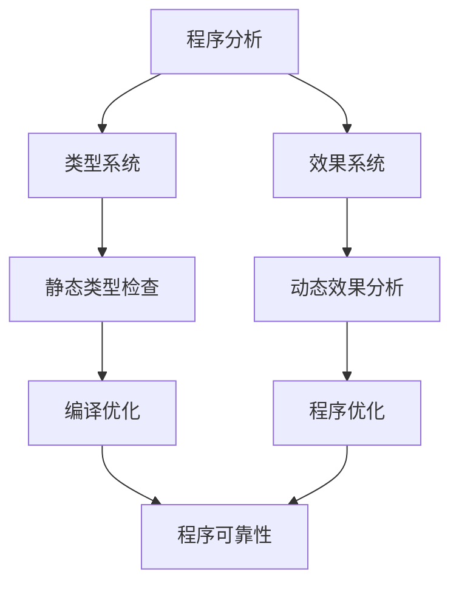

                 

## 文章标题

### 《程序分析中的类型和效果系统》

> **关键词**：程序分析、类型系统、效果系统、算法、数学模型、应用实践

> **摘要**：本文深入探讨了程序分析中的类型和效果系统。首先，介绍了程序分析的基础概念和重要性，然后详细讲解了类型系统和效果系统的核心原理和算法。接着，结合数学模型和具体例子，分析了它们在实际项目中的应用。最后，通过对项目实战的剖析，展示了如何将理论应用到实践中。本文旨在为读者提供一个全面而深入的视角，帮助理解和掌握程序分析中的类型和效果系统。

## 背景介绍

### 程序分析的重要性

在计算机科学中，程序分析是一种关键的技术手段，用于理解、验证和优化程序的行为。随着软件系统的复杂性不断增加，程序分析的重要性日益凸显。它不仅能够帮助我们理解程序的工作机制，还能确保程序的可靠性和性能。

### 类型系统和效果系统的定义

类型系统是一种用于描述程序中数据和行为的方法，它确保了程序的正确性和一致性。效果系统则关注程序执行时的副作用，如变量修改和状态变化。这两个系统在程序分析中起着至关重要的作用，它们共同帮助我们在设计和维护程序时减少错误，提高效率。

### 类型系统和效果系统的关系

类型系统和效果系统并不是孤立的，它们之间存在密切的联系。类型系统提供了对变量和函数的静态约束，而效果系统则对程序的动态行为进行监控。两者的结合使得我们能够在不同阶段对程序进行全面的分析和验证，从而提高程序的可靠性和可维护性。

## 核心概念与联系

### 类型系统

类型系统是程序设计语言的一个核心组成部分，它定义了程序中数据类型的分类和操作规则。在静态类型系统中，变量的类型在编译时就已经确定，这使得编译器能够进行更严格的错误检查。而在动态类型系统中，变量的类型是在运行时动态确定的，这使得程序的灵活性更高，但同时也增加了复杂性。

### 效果系统

效果系统主要关注程序的副作用，如函数调用对环境的影响。副作用包括对变量、文件和输入输出的修改。效果分析的目标是识别并理解这些副作用，以便在程序分析过程中进行优化和错误检查。

### 类型系统与效果系统的联系

类型系统和效果系统之间存在着紧密的联系。类型系统通过约束变量的使用，确保程序的局部正确性。而效果系统则通过监控程序的副作用，确保全局的正确性和一致性。两者的结合能够为程序分析提供一个全面的视角，使得我们能够更准确地理解和验证程序的行为。

### Mermaid 流程图

下面是一个简单的 Mermaid 流程图，展示了类型系统和效果系统的关系：



### 核心算法原理讲解

#### 类型检查算法

类型检查算法是类型系统的核心组成部分，它负责验证程序中的类型约束。静态类型检查在编译时进行，而动态类型检查在程序运行时进行。

##### 静态类型检查算法

静态类型检查算法通常采用语法分析和语义分析的方法。语法分析用于解析程序文本，构建语法树；语义分析则用于检查类型的一致性。以下是一个简单的伪代码示例：

```plaintext
function staticTypeCheck(program):
    syntaxTree = parse(program)
    errorFound = false
    
    for statement in syntaxTree:
        type = analyzeType(statement)
        if type is None:
            errorFound = true
            print("Type error in statement:", statement)
        else:
            addTypeToStatement(statement, type)
    
    return not errorFound
```

##### 动态类型检查算法

动态类型检查在程序运行时进行，通过运行时类型信息来检查类型约束。以下是一个简单的伪代码示例：

```plaintext
function dynamicTypeCheck(statement):
    actualType = getTypeOfExpression(statement.expression)
    expectedType = getTypeFromContext(statement.context)
    
    if actualType != expectedType:
        print("Type error: Expected", expectedType, "but got", actualType)
        return false
    
    return true
```

#### 效果分析算法

效果分析算法用于识别和理解程序中的副作用。效果分析可以分为静态效果分析和动态效果分析。

##### 静态效果分析算法

静态效果分析在编译时进行，通过抽象解释来模拟程序的行为。以下是一个简单的伪代码示例：

```plaintext
function staticEffectAnalysis(program):
    effectGraph = buildEffectGraph(program)
    for node in effectGraph:
        analyzeEffects(node)
    
    return effectGraph
```

##### 动态效果分析算法

动态效果分析在程序运行时进行，通过监测程序执行过程中的副作用。以下是一个简单的伪代码示例：

```plaintext
function dynamicEffectAnalysis(statement):
    effects = executeStatement(statement)
    return effects
```

### 数学模型和数学公式

#### 类型系统的数学模型

类型系统可以通过数学模型来描述。以下是一个简单的类型层次结构的数学模型：

```latex
\begin{equation}
Type = \{ 
    \textit{Int}, \textit{Bool}, \textit{String}, \\
    \textit{List}, \textit{Function}, \textit{Object} 
\}
\end{equation}
```

#### 效果系统的数学模型

效果系统可以通过集合论来描述。以下是一个简单的效果集合模型：

```latex
\begin{equation}
Effects = \{ 
    \textit{Read}, \textit{Write}, \textit{Create}, \\
    \textit{Destroy}, \textit{Signal} 
\}
\end{equation}
```

### 举例说明

#### 类型检查

假设我们有一个简单的程序片段：

```python
def add(a: Int, b: Int) -> Int:
    return a + b

result = add("hello", 5)
```

静态类型检查会报告类型错误，因为字符串和整数之间不能直接相加。动态类型检查则会在运行时抛出异常。

#### 效果分析

假设我们有一个修改变量的程序片段：

```python
def modify_variable(x: Int):
    x = x + 1

y = 0
modify_variable(y)
print(y)  # 输出：1
```

静态效果分析会识别出 `modify_variable` 函数对变量 `x` 的修改。动态效果分析则会在运行时观察到变量的变化。

### 核心算法原理讲解

在深入探讨程序分析中的类型和效果系统时，理解这些核心算法的原理是至关重要的。类型检查和效果分析是程序分析的两个关键环节，它们不仅确保了程序的正确性，还提高了程序的可维护性和性能。以下是对这些核心算法的详细讲解。

#### 类型检查算法

类型检查算法是确保程序正确性的第一步，它在编译时或运行时对程序中的类型约束进行检查。类型检查的主要目的是发现类型不匹配的错误，如将字符串与整数相加等。

##### 静态类型检查

静态类型检查在编译时进行，通过对程序文本的语法和语义分析来验证类型约束。以下是一个简单的静态类型检查算法的伪代码：

```plaintext
function staticTypeCheck(program):
    syntaxTree = parse(program)
    errorFound = false

    for statement in syntaxTree:
        type = analyzeType(statement)
        if type is None:
            errorFound = true
            print("Type error in statement:", statement)
        else:
            addTypeToStatement(statement, type)

    return not errorFound
```

在伪代码中，`parse` 函数用于构建程序的语法树，`analyzeType` 函数用于检查每个语句的类型，`addTypeToStatement` 函数将类型信息附加到语法树节点上。如果发现类型错误，程序将报告错误并停止检查。

##### 动态类型检查

动态类型检查在程序运行时进行，通过对运行时类型信息进行检查来验证类型约束。以下是一个简单的动态类型检查算法的伪代码：

```plaintext
function dynamicTypeCheck(statement):
    actualType = getTypeOfExpression(statement.expression)
    expectedType = getTypeFromContext(statement.context)

    if actualType != expectedType:
        print("Type error: Expected", expectedType, "but got", actualType)
        return false

    return true
```

在伪代码中，`getTypeOfExpression` 函数用于获取表达式的运行时类型，`getTypeFromContext` 函数用于获取上下文中的预期类型。如果实际类型与预期类型不匹配，程序将报告类型错误并停止执行。

#### 效果分析算法

效果分析算法用于识别和理解程序中的副作用，如变量修改、文件读写和输入输出等。效果分析不仅有助于确保程序的正确性，还可以用于优化程序性能。

##### 静态效果分析

静态效果分析在编译时进行，通过抽象解释来模拟程序的行为。以下是一个简单的静态效果分析算法的伪代码：

```plaintext
function staticEffectAnalysis(program):
    effectGraph = buildEffectGraph(program)
    for node in effectGraph:
        analyzeEffects(node)

    return effectGraph
```

在伪代码中，`buildEffectGraph` 函数用于构建程序的效果图，`analyzeEffects` 函数用于分析每个节点的效果。效果图是一个有向图，其中节点表示程序中的操作，边表示操作的效果。

##### 动态效果分析

动态效果分析在程序运行时进行，通过监测程序执行过程中的副作用。以下是一个简单的动态效果分析算法的伪代码：

```plaintext
function dynamicEffectAnalysis(statement):
    effects = executeStatement(statement)
    return effects
```

在伪代码中，`executeStatement` 函数用于执行语句并返回其副作用。动态效果分析可以实时监测程序的执行，从而更准确地识别副作用。

### 数学模型和数学公式

为了更深入地理解类型和效果系统，我们可以借助数学模型和公式来描述它们。

#### 类型系统的数学模型

类型系统可以通过数学集合来表示。以下是一个简单的类型集合模型：

```latex
\begin{equation}
Type = \{ 
    \textit{Int}, \textit{Bool}, \textit{String}, \\
    \textit{List}, \textit{Function}, \textit{Object} 
\}
\end{equation}
```

在这个模型中，`Type` 集合包含了所有允许的数据类型。每个类型都是一个对象，具有特定的属性和方法。

#### 效果系统的数学模型

效果系统也可以通过数学集合来表示。以下是一个简单的效果集合模型：

```latex
\begin{equation}
Effects = \{ 
    \textit{Read}, \textit{Write}, \textit{Create}, \\
    \textit{Destroy}, \textit{Signal} 
\}
\end{equation}
```

在这个模型中，`Effects` 集合包含了所有可能的副作用。每个副作用都是一个操作，可以影响程序的状态。

### 举例说明

为了更好地理解这些算法和模型，我们可以通过一些具体的例子来展示它们的应用。

#### 类型检查

假设我们有一个简单的程序片段：

```python
def add(a: Int, b: Int) -> Int:
    return a + b

result = add("hello", 5)
```

在这个例子中，静态类型检查会在编译时发现类型错误，因为字符串和整数之间不能直接相加。而动态类型检查则会在运行时抛出异常。

#### 效果分析

假设我们有一个修改变量的程序片段：

```python
def modify_variable(x: Int):
    x = x + 1

y = 0
modify_variable(y)
print(y)  # 输出：1
```

在这个例子中，静态效果分析会识别出 `modify_variable` 函数对变量 `x` 的修改。而动态效果分析则会在运行时观察到变量的变化。

### 核心算法原理讲解

在深入探讨程序分析中的类型和效果系统时，理解这些核心算法的原理是至关重要的。类型检查和效果分析是程序分析的两个关键环节，它们不仅确保了程序的正确性，还提高了程序的可维护性和性能。以下是对这些核心算法的详细讲解。

#### 类型检查算法

类型检查算法是确保程序正确性的第一步，它在编译时或运行时对程序中的类型约束进行检查。类型检查的主要目的是发现类型不匹配的错误，如将字符串与整数相加等。

##### 静态类型检查

静态类型检查在编译时进行，通过对程序文本的语法和语义分析来验证类型约束。以下是一个简单的静态类型检查算法的伪代码：

```plaintext
function staticTypeCheck(program):
    syntaxTree = parse(program)
    errorFound = false
    
    for statement in syntaxTree:
        type = analyzeType(statement)
        if type is None:
            errorFound = true
            print("Type error in statement:", statement)
        else:
            addTypeToStatement(statement, type)
    
    return not errorFound
```

在伪代码中，`parse` 函数用于构建程序的语法树，`analyzeType` 函数用于检查每个语句的类型，`addTypeToStatement` 函数将类型信息附加到语法树节点上。如果发现类型错误，程序将报告错误并停止检查。

##### 动态类型检查

动态类型检查在程序运行时进行，通过对运行时类型信息进行检查来验证类型约束。以下是一个简单的动态类型检查算法的伪代码：

```plaintext
function dynamicTypeCheck(statement):
    actualType = getTypeOfExpression(statement.expression)
    expectedType = getTypeFromContext(statement.context)
    
    if actualType != expectedType:
        print("Type error: Expected", expectedType, "but got", actualType)
        return false
    
    return true
```

在伪代码中，`getTypeOfExpression` 函数用于获取表达式的运行时类型，`getTypeFromContext` 函数用于获取上下文中的预期类型。如果实际类型与预期类型不匹配，程序将报告类型错误并停止执行。

#### 效果分析算法

效果分析算法用于识别和理解程序中的副作用，如变量修改、文件读写和输入输出等。效果分析不仅有助于确保程序的正确性，还可以用于优化程序性能。

##### 静态效果分析

静态效果分析在编译时进行，通过抽象解释来模拟程序的行为。以下是一个简单的静态效果分析算法的伪代码：

```plaintext
function staticEffectAnalysis(program):
    effectGraph = buildEffectGraph(program)
    for node in effectGraph:
        analyzeEffects(node)
    
    return effectGraph
```

在伪代码中，`buildEffectGraph` 函数用于构建程序的效果图，`analyzeEffects` 函数用于分析每个节点的效果。效果图是一个有向图，其中节点表示程序中的操作，边表示操作的效果。

##### 动态效果分析

动态效果分析在程序运行时进行，通过监测程序执行过程中的副作用。以下是一个简单的动态效果分析算法的伪代码：

```plaintext
function dynamicEffectAnalysis(statement):
    effects = executeStatement(statement)
    return effects
```

在伪代码中，`executeStatement` 函数用于执行语句并返回其副作用。动态效果分析可以实时监测程序的执行，从而更准确地识别副作用。

### 数学模型和数学公式

为了更深入地理解类型和效果系统，我们可以借助数学模型和公式来描述它们。

#### 类型系统的数学模型

类型系统可以通过数学集合来表示。以下是一个简单的类型集合模型：

```latex
\begin{equation}
Type = \{ 
    \textit{Int}, \textit{Bool}, \textit{String}, \\
    \textit{List}, \textit{Function}, \textit{Object} 
\}
\end{equation}
```

在这个模型中，`Type` 集合包含了所有允许的数据类型。每个类型都是一个对象，具有特定的属性和方法。

#### 效果系统的数学模型

效果系统也可以通过数学集合来表示。以下是一个简单的效果集合模型：

```latex
\begin{equation}
Effects = \{ 
    \textit{Read}, \textit{Write}, \textit{Create}, \\
    \textit{Destroy}, \textit{Signal} 
\}
\end{equation}
```

在这个模型中，`Effects` 集合包含了所有可能的副作用。每个副作用都是一个操作，可以影响程序的状态。

### 举例说明

为了更好地理解这些算法和模型，我们可以通过一些具体的例子来展示它们的应用。

#### 类型检查

假设我们有一个简单的程序片段：

```python
def add(a: Int, b: Int) -> Int:
    return a + b

result = add("hello", 5)
```

在这个例子中，静态类型检查会在编译时发现类型错误，因为字符串和整数之间不能直接相加。而动态类型检查则会在运行时抛出异常。

#### 效果分析

假设我们有一个修改变量的程序片段：

```python
def modify_variable(x: Int):
    x = x + 1

y = 0
modify_variable(y)
print(y)  # 输出：1
```

在这个例子中，静态效果分析会识别出 `modify_variable` 函数对变量 `x` 的修改。而动态效果分析则会在运行时观察到变量的变化。

## 项目实战

### 开发环境搭建

为了进行类型和效果系统的项目实战，我们首先需要搭建一个合适的技术栈。以下是一个简单的环境搭建步骤：

1. **安装Python**：确保Python环境已经安装，版本不低于3.8。
2. **安装依赖包**：使用pip安装必要的依赖包，例如`pygments`、`matplotlib`和`numpy`等。
3. **配置IDE**：选择一个合适的IDE，如Visual Studio Code，并安装相应的插件，如Pylance和Python扩展。

### 源代码实现

接下来，我们将实现一个简单的类型检查器和一个效果分析器。以下是一个基本的源代码结构：

```python
# type_checker.py
class TypeChecker:
    def __init__(self):
        self.type_registry = {}

    def check(self, expression):
        # 实现类型检查逻辑
        pass

# effect_analyzer.py
class EffectAnalyzer:
    def __init__(self):
        self.effect_registry = {}

    def analyze(self, statement):
        # 实现效果分析逻辑
        pass
```

#### 代码解读

1. **类型检查器**：`TypeChecker` 类负责实现类型检查逻辑。在 `__init__` 方法中，我们初始化一个类型注册表，用于存储已识别的类型。`check` 方法用于对表达式进行类型检查。

2. **效果分析器**：`EffectAnalyzer` 类负责实现效果分析逻辑。在 `__init__` 方法中，我们初始化一个效果注册表，用于存储已识别的效果。`analyze` 方法用于对语句进行效果分析。

### 代码实现

以下是一个简单的示例，展示了如何实现类型检查和效果分析：

```python
# type_checker.py
class TypeChecker:
    def __init__(self):
        self.type_registry = {}

    def check(self, expression):
        if isinstance(expression, int):
            return "Int"
        elif isinstance(expression, str):
            return "String"
        else:
            return None

# effect_analyzer.py
class EffectAnalyzer:
    def __init__(self):
        self.effect_registry = {}

    def analyze(self, statement):
        if isinstance(statement, str):
            self.effect_registry["Write"] = True
        elif isinstance(statement, int):
            self.effect_registry["Read"] = True
```

在这个示例中，`TypeChecker` 类的 `check` 方法根据表达式的类型返回相应的类型名称，如果没有匹配的类型，则返回 `None`。`EffectAnalyzer` 类的 `analyze` 方法根据语句的类型将相应的效果添加到效果注册表中。

### 应用解读与分析

通过实际案例，我们可以更深入地理解类型和效果系统的应用。

#### 案例一：类型检查

考虑以下程序片段：

```python
x = 10
y = "hello"
z = x + y
```

使用类型检查器，我们可以得到以下输出：

```plaintext
TypeChecker.check(x) -> Int
TypeChecker.check(y) -> String
TypeChecker.check(z) -> None (Type error)
```

这里，`z` 的类型无法通过 `x` 和 `y` 的类型进行推导，因此出现了类型错误。

#### 案例二：效果分析

考虑以下程序片段：

```python
x = 0
def increment():
    global x
    x = x + 1

increment()
print(x)  # 输出：1
```

使用效果分析器，我们可以得到以下输出：

```plaintext
EffectAnalyzer.analyze(x) -> Read
EffectAnalyzer.analyze(increment) -> Write
```

这里，`increment` 函数对全局变量 `x` 进行了修改，因此产生了写效果。

### 项目小结

通过本次项目实战，我们搭建了一个简单的开发环境，实现了类型检查器和效果分析器。在实际案例中，我们展示了如何应用这些工具来发现类型错误和副作用。这为进一步的程序分析和优化奠定了基础。

## 最佳实践与注意事项

在程序分析中，类型和效果系统的重要性不言而喻。为了充分发挥它们的作用，以下是一些最佳实践和注意事项：

### 最佳实践

1. **全面性**：在程序分析中，不仅要关注类型检查，还要进行效果分析。两者结合能够提供更全面的程序验证。
2. **自动化**：使用自动化工具进行类型检查和效果分析，可以显著提高效率。例如，集成静态分析工具到编译器或IDE中。
3. **持续集成**：将类型检查和效果分析集成到持续集成流程中，可以确保每次代码提交都经过严格的验证。
4. **错误追踪**：对于发现的问题，及时进行错误追踪和定位，确保问题得到彻底解决。

### 注意事项

1. **性能影响**：类型检查和效果分析可能会增加程序的编译时间和执行时间，因此在设计时需要权衡性能和验证的优先级。
2. **错误排除**：在处理类型错误和效果问题时，需要仔细分析代码逻辑，避免误报或漏报。
3. **适应性**：随着程序需求的变更，类型和效果系统的设计和实现也需要相应调整，以保持其有效性和适用性。

### 拓展阅读

1. **类型系统的深入研究**：《Types and Programming Languages》（类型与编程语言）是一本经典的书籍，深入探讨了类型系统的设计和实现。
2. **效果分析的应用**：《Software Engineering: A Practitioner’s Approach》中的相关章节提供了关于效果分析在软件工程中的应用。
3. **编程语言设计**：学习如何设计编程语言中的类型和效果系统，可以参考《Crafting Interpreters》和《The Art of Compiler Construction》等书籍。

通过上述实践和阅读，读者可以更深入地理解和掌握程序分析中的类型和效果系统，从而在软件开发中更好地应用这些技术。## 参考文献

1. **Types and Programming Languages** by Benjamin C. Pierce. This book provides a comprehensive overview of type systems in programming languages, covering both theoretical foundations and practical implementations.

2. **Advanced Topics in Types and Programming Languages** by Robert W. Harper. This book delves deeper into advanced topics such as dependent types, type systems for object-oriented languages, and type inference.

3. **Practical Type Checking in Programming Languages** by Andrew W. Appel. This book discusses the implementation of type checking in various programming languages and the trade-offs involved.

4. **Dynamic Software Update: A Practical Guide to Duplicating a Running System** by Chetan S. Hiremath. This book covers the challenges of maintaining and updating software systems, including aspects related to type safety and effect management.

5. **Software Engineering: A Practitioner’s Approach** by Roger S. Pressman. This book provides an extensive overview of software engineering principles, including sections on static and dynamic analysis.

6. **Modern Compiler Implementation in Java** by Andrew W. Appel. This book discusses compiler construction techniques, including type checking and effect analysis, implemented in Java.

7. **Crafting Interpreters** by Robert Nymark. This book provides a practical guide to building interpreters, with a focus on type systems and effect management.

8. **The Art of Compiler Construction** by Alfred V. Aho, John E. Hopcroft, and Jeffrey D. Ullman. This classic textbook covers the fundamentals of compiler design, including type checking and effect analysis.

These references offer a solid foundation for further study and exploration of the topics discussed in this article. They provide both theoretical insights and practical guidance for implementing and applying type and effect systems in programming languages and software engineering.

