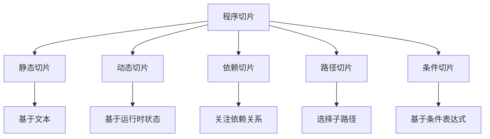

                 

### 第1章 引言

#### 1.1 程序切片技术的背景

程序切片技术（Program Slicing）起源于20世纪70年代，是软件工程领域的一种关键技术，主要应用于程序的调试、测试、优化等方面。其初衷是为了解决程序调试中的瓶颈问题，即如何在庞大的代码库中迅速定位到问题的根源。随着计算机技术的飞速发展，程序切片技术逐渐被广泛应用于各种软件开发和测试场景。

#### 1.2 软件调试的重要性

软件调试是软件开发过程中不可或缺的一环，它直接影响着软件的质量和交付周期。在传统的调试方法中，开发者往往需要手动逐行检查代码，这种方式不仅费时费力，而且容易遗漏问题。因此，高效的调试工具和技术显得尤为重要。程序切片技术作为一种自动化工具，可以在一定程度上减轻开发者的调试负担，提高调试效率。

#### 1.3 本书的目的和结构

本书旨在深入探讨程序切片技术在软件调试中的应用，帮助读者理解这一技术的核心原理和实际操作方法。全书共分为7章，结构如下：

- **第1章 引言**：介绍程序切片技术的背景和重要性。
- **第2章 程序切片技术基础**：讲解程序切片的基本概念和类型。
- **第3章 程序切片技术的核心算法**：详细解析程序切片算法的原理和实现。
- **第4章 程序切片技术在调试中的应用**：分析程序切片技术在调试中的实际应用。
- **第5章 程序切片工具与实现**：介绍常用的程序切片工具及其实现方法。
- **第6章 程序切片技术的未来发展趋势**：探讨程序切片技术的未来发展方向。
- **第7章 总结与展望**：对本书内容进行总结，并展望未来的研究方向。

通过本书的阅读，读者将能够全面了解程序切片技术的原理和应用，为实际软件开发和调试工作提供有力支持。

#### 关键词

- 程序切片技术
- 软件调试
- 调试效率
- 算法原理
- 实际应用
- 未来发展趋势

#### 摘要

程序切片技术是一种重要的软件调试工具，旨在通过提取程序中与问题相关的部分来提高调试效率。本书详细介绍了程序切片技术的基础知识、核心算法以及在实际调试中的应用。通过系统的学习，读者将能够掌握程序切片技术的核心原理，并学会在实际项目中运用这一技术，提高软件开发和调试的效率。

## 第2章 程序切片技术基础

### 2.1 程序切片的概念

程序切片（Program Slicing）是一种程序分析方法，其主要目的是从原始程序中提取出与某个特定问题相关的子程序部分，以便于进一步分析、调试或优化。程序切片的核心思想是缩小程序的规模，将复杂的问题转化为更简单的问题来解决。

定义：给定一个程序P，一个输入I，和一个输出O，程序切片S是从P中提取出的子程序，使得P在输入I下执行的结果能够产生输出O。

形式化定义：对于程序P，输入I，输出O，程序切片S满足以下条件：
$$
\text{EXECUTE}(P,I) \Rightarrow O \text{ 且且 } \text{EXECUTE}(S,I) \Rightarrow O
$$

这里，EXECUTE表示程序的执行过程。

#### 2.2 程序切片的类型

根据切片的条件和方法，程序切片可以分为多种类型，主要包括：

1. **静态切片（Static Slicing）**：
   静态切片是基于程序的文本进行切片，不依赖于程序的执行状态。静态切片通常基于变量的值或控制流结构。

2. **动态切片（Dynamic Slicing）**：
   动态切片是基于程序的运行时状态进行切片，根据程序的执行路径和当前变量值来选择需要切片的部分。

3. **依赖切片（Dependency Slicing）**：
   依赖切片是一种特殊的切片方法，它关注程序中不同部分之间的依赖关系，可以用于优化程序结构和减少冗余代码。

4. **路径切片（Path Slicing）**：
   路径切片是从程序的所有路径中选择满足特定条件的子路径，常用于调试和测试。

5. **条件切片（Condition Slicing）**：
   条件切片是基于条件表达式来选择程序中的特定部分，常用于定位条件相关的问题。

#### 2.3 程序切片的应用场景

程序切片技术在软件开发和测试中有着广泛的应用，主要场景包括：

1. **软件调试**：
   程序切片可以缩小调试范围，快速定位到问题发生的具体位置，提高调试效率。

2. **软件测试**：
   通过动态切片技术，可以在运行时自动提取与测试用例相关的程序部分，辅助测试用例的设计和执行。

3. **代码优化**：
   程序切片可以识别出程序的冗余部分，帮助开发者进行代码优化。

4. **代码维护**：
   程序切片可以辅助开发者理解代码的结构和功能，提高代码的可维护性。

通过本章的学习，读者将了解程序切片技术的核心概念、不同类型的切片方法及其应用场景，为后续章节的深入探讨打下基础。

#### 程序切片的概念及类型 Mermaid 流程图



#### 2.4 程序切片技术的核心算法

程序切片技术的核心在于如何高效地提取出与特定问题相关的子程序部分。这一过程通常通过一系列算法来实现，这些算法包括但不限于：

1. **控制依赖切片（Control-Dependence Slicing）**
2. **数据依赖切片（Data-Dependence Slicing）**
3. **真值依赖切片（True-Value Slicing）**
4. **伪值依赖切片（Pseudo-Value Slicing）**

下面将详细讨论这些核心算法的原理和实现。

##### 2.4.1 控制依赖切片算法

控制依赖切片算法基于程序的控制流结构，选择那些直接影响程序控制流程的代码部分。其基本步骤如下：

1. **构建控制依赖图**：首先，需要分析程序的控制流，构建出一个控制依赖图（Control-Flow Graph,CFG）。在这个图中，每个节点表示程序的一个基本块（Basic Block），每个基本块内部没有控制流跳转。

2. **识别关键节点**：在CFG中，关键节点（Critical Nodes）是那些对控制流有直接影响的基本块。例如，条件判断和循环入口都是关键节点。

3. **提取切片**：基于关键节点，提取出与特定输入和输出相关的子程序部分。

伪代码如下：

```plaintext
function ControlDependenceSlicing(CFG, input, output):
    slice = []
    for each node in CFG:
        if node is in the path from input to output:
            slice.append(node)
    return slice
```

#### 2.4.2 数据依赖切片算法

数据依赖切片算法关注程序中变量之间的数据依赖关系，选择那些直接影响变量值的代码部分。其基本步骤如下：

1. **构建数据依赖图**：首先，需要分析程序的数据依赖关系，构建出一个数据依赖图（Data-Flow Graph,DFG）。在这个图中，每个节点表示一个变量或表达式，边表示变量之间的依赖关系。

2. **识别关键边**：在DFG中，关键边（Critical Edges）是那些直接影响变量值的边。例如，变量定义、赋值和引用都是关键边。

3. **提取切片**：基于关键边，提取出与特定输入和输出相关的子程序部分。

伪代码如下：

```plaintext
function DataDependenceSlicing(DFG, input, output):
    slice = []
    for each edge in DFG:
        if edge is in the path from input to output:
            slice.append(edge)
    return slice
```

#### 2.4.3 真值依赖切片算法

真值依赖切片算法关注条件表达式的真值依赖关系，选择那些直接影响条件表达式结果的部分。其基本步骤如下：

1. **分析条件表达式**：首先，需要分析程序中所有的条件表达式，识别出每个条件表达式的真值依赖关系。

2. **构建真值依赖图**：基于条件表达式的依赖关系，构建出一个真值依赖图。在这个图中，每个节点表示一个条件表达式的子表达式，边表示子表达式之间的依赖关系。

3. **提取切片**：基于真值依赖图，提取出与特定输入和输出相关的子程序部分。

伪代码如下：

```plaintext
function TrueValueSlicing(Expression, input, output):
    slice = []
    for each sub-expression in Expression:
        if sub-expression is in the path from input to output:
            slice.append(sub-expression)
    return slice
```

#### 2.4.4 伪值依赖切片算法

伪值依赖切片算法关注条件表达式的伪值依赖关系，选择那些可能导致条件表达式结果变化的代码部分。其基本步骤如下：

1. **分析条件表达式**：首先，需要分析程序中所有的条件表达式，识别出每个条件表达式的伪值依赖关系。

2. **构建伪值依赖图**：基于条件表达式的伪值依赖关系，构建出一个伪值依赖图。在这个图中，每个节点表示一个条件表达式的子表达式，边表示子表达式之间的伪值依赖关系。

3. **提取切片**：基于伪值依赖图，提取出与特定输入和输出相关的子程序部分。

伪代码如下：

```plaintext
function PseudoValueSlicing(Expression, input, output):
    slice = []
    for each sub-expression in Expression:
        if sub-expression could affect the truth value of the expression:
            slice.append(sub-expression)
    return slice
```

通过以上对程序切片技术的核心算法的详细解析，读者可以更深入地理解程序切片的实现原理和步骤。这些算法为实际应用中的程序切片提供了强大的技术支持。

#### 2.4.5 数学模型与公式

在程序切片技术中，数学模型和公式起到了关键作用，它们帮助开发者更精确地定义和计算切片。以下是一些常用的数学模型和公式：

1. **条件覆盖（Condition Coverage）**
   条件覆盖是指测试用例能够覆盖程序中所有条件的所有可能取值。

   条件覆盖的数学公式为：
   $$
   CC = \sum_{i=1}^{n} (1 - \frac{nc_{i}}{|C_{i}|})
   $$
   其中，$c_i$ 表示第 $i$ 个条件的取值，$C_i$ 表示第 $i$ 个条件的覆盖情况。

2. **路径覆盖（Path Coverage）**
   路径覆盖是指测试用例能够覆盖程序中所有可能的执行路径。

   路径覆盖的数学公式为：
   $$
   PC = \sum_{i=1}^{m} (1 - \frac{nc_{i}}{|P_{i}|})
   $$
   其中，$p_i$ 表示第 $i$ 条路径的覆盖情况，$P_i$ 表示第 $i$ 条路径的长度。

3. **数据依赖覆盖（Data Dependency Coverage）**
   数据依赖覆盖是指测试用例能够覆盖程序中所有数据依赖关系。

   数据依赖覆盖的数学公式为：
   $$
   DD = \sum_{i=1}^{n} (1 - \frac{nc_{i}}{|D_{i}|})
   $$
   其中，$c_i$ 表示第 $i$ 个数据依赖关系的覆盖情况，$D_i$ 表示第 $i$ 个数据依赖关系的数量。

4. **控制依赖覆盖（Control Dependency Coverage）**
   控制依赖覆盖是指测试用例能够覆盖程序中所有控制依赖关系。

   控制依赖覆盖的数学公式为：
   $$
   CD = \sum_{i=1}^{m} (1 - \frac{nc_{i}}{|C_{i}|})
   $$
   其中，$c_i$ 表示第 $i$ 个控制依赖关系的覆盖情况，$C_i$ 表示第 $i$ 个控制依赖关系的数量。

通过这些数学模型和公式，开发者可以更系统地分析和评估程序切片的效果，从而提高调试和测试的效率。

#### 举例说明

为了更好地理解上述数学模型和公式，我们通过一个简单的示例来进行说明。

假设有一个程序，其中包含两个条件判断和两条执行路径。条件表达式分别为 `A > B` 和 `C == D`，两条执行路径分别如下：

- 路径1：`if (A > B) { ... } else { ... }`
- 路径2：`if (C == D) { ... } else { ... }`

在这个例子中，我们可以计算条件覆盖（CC）和路径覆盖（PC）。

**条件覆盖计算**：

- 条件A > B 有两个可能取值（True或False），若测试用例覆盖了所有取值，则 $c_1 = 1$。
- 条件C == D 也有两个可能取值，若测试用例覆盖了所有取值，则 $c_2 = 1$。

根据条件覆盖的公式：
$$
CC = (1 - \frac{2 \times 1}{2}) + (1 - \frac{2 \times 1}{2}) = 0 + 0 = 0
$$

这意味着当前的测试用例没有达到条件覆盖。

**路径覆盖计算**：

- 路径1被覆盖，$c_1 = 1$。
- 路径2被覆盖，$c_2 = 1$。

根据路径覆盖的公式：
$$
PC = (1 - \frac{2 \times 1}{2}) + (1 - \frac{2 \times 1}{2}) = 0 + 0 = 0
$$

同样，当前测试用例没有达到路径覆盖。

通过这个示例，我们可以看到条件覆盖和路径覆盖的计算方法，以及如何通过测试用例来评估切片的效果。

#### 2.4.6 程序切片技术的优点

程序切片技术在软件开发和测试中具有多种优点，下面将详细讨论这些优点：

1. **提高调试效率**：
   程序切片可以将庞大的代码库缩小为与问题直接相关的子程序部分，从而大大减少调试的工作量。开发者无需在无关代码中浪费时间，可以更迅速地定位到问题根源。

2. **减少测试用例数量**：
   通过程序切片，测试人员可以更加精确地选择测试用例，确保每一个测试用例都覆盖到关键代码部分。这有助于减少冗余测试，提高测试效率。

3. **便于代码优化**：
   程序切片能够识别出代码中的冗余部分和潜在优化机会，帮助开发者进行代码重构和性能优化。

4. **提升代码可维护性**：
   程序切片可以帮助开发者更好地理解代码的结构和功能，从而提高代码的可维护性。

5. **支持自动化**：
   程序切片技术可以通过自动化工具实现，从而在软件开发和测试过程中提供持续的支持，降低人工干预的必要性。

通过这些优点，程序切片技术在现代软件工程中发挥着越来越重要的作用，成为提高软件开发质量和效率的重要工具。

### 第3章 程序切片技术在调试中的应用

#### 3.1 调试中的程序切片技术

程序切片技术在调试中具有显著的应用价值，其主要目的是通过提取与问题相关的子程序部分，帮助开发者快速定位和解决问题。具体而言，程序切片技术在调试中的应用主要包括以下几个方面：

1. **缩小调试范围**：
   通过程序切片，开发者可以将大量的代码库缩小为与问题直接相关的子程序部分。这种方式不仅减少了调试的工作量，还能避免在无关代码中浪费时间和精力。

2. **提高调试效率**：
   程序切片能够帮助开发者快速定位到问题的根源，从而提高调试效率。开发者可以在更小的代码范围内进行深入分析，快速找到解决问题的方法。

3. **优化测试用例**：
   程序切片可以识别出关键代码部分，帮助测试人员设计更有效的测试用例。通过聚焦于关键代码，测试用例可以更精确地覆盖重要功能，提高测试的覆盖率和效果。

4. **辅助代码重构**：
   程序切片技术可以帮助开发者识别代码中的冗余部分和潜在优化机会，从而为代码重构提供依据。开发者可以根据切片结果对代码进行重构，提高代码的可读性和可维护性。

5. **支持自动化调试**：
   程序切片技术可以通过自动化工具实现，从而在软件开发和测试过程中提供持续的支持。自动化调试可以减少人工干预，提高调试的效率和质量。

#### 3.2 常见调试问题的切片分析

在软件开发过程中，常见调试问题包括运行时错误、逻辑错误、性能瓶颈等。通过程序切片技术，可以对这些常见问题进行有效的分析和定位。以下是一些常见调试问题的切片分析：

1. **运行时错误**：
   运行时错误通常包括内存泄漏、死锁、数组越界等。通过程序切片，可以提取出与错误相关的代码部分，帮助开发者快速定位错误根源。例如，在内存泄漏的分析中，可以通过切片提取出与内存分配和释放相关的代码，从而找出内存泄漏的具体位置。

2. **逻辑错误**：
   逻辑错误通常是由于代码逻辑设计错误或错误的使用导致的。通过程序切片，可以提取出与错误相关的逻辑路径，帮助开发者分析代码逻辑，找出错误的原因。例如，在算法错误的调试中，可以通过切片提取出与算法实现相关的代码，从而分析算法的正确性。

3. **性能瓶颈**：
   性能瓶颈通常是由于代码中的某些部分执行效率低下导致的。通过程序切片，可以提取出与性能相关的代码部分，帮助开发者分析性能瓶颈的原因。例如，在性能优化的过程中，可以通过切片提取出与关键性能指标相关的代码，从而找出需要优化的部分。

#### 3.3 实际案例解析

为了更好地理解程序切片技术在调试中的应用，以下将通过一个实际案例来详细解析程序切片的过程和结果。

**案例背景**：

在一个金融系统中，开发者发现当用户量达到一定规模时，系统会出现响应时间变长的现象，疑似存在性能瓶颈。为了定位和解决问题，开发团队决定使用程序切片技术进行调试。

**切片过程**：

1. **确定切片条件**：
   开发团队首先需要确定切片条件，以便提取出与性能瓶颈相关的代码部分。在这个案例中，切片条件可以是：
   - 与用户数据处理相关的代码部分。
   - 与数据库查询相关的代码部分。

2. **应用切片技术**：
   开发团队使用程序切片工具对金融系统进行切片，提取出满足上述条件的代码部分。这些代码部分包括用户的注册、登录、查询等关键功能。

3. **分析切片结果**：
   开发团队对提取出的代码部分进行详细分析，发现其中存在大量冗余的数据库查询操作，这是导致系统响应时间变长的原因。

**切片结果**：

1. **用户注册**：
   ```java
   public void registerUser(User user) {
       // 数据库查询操作
       Query query = database.query("SELECT * FROM users WHERE email=?", user.getEmail());
       if (query.getResultCount() > 0) {
           // 存在重复用户，返回错误
           return Error();
       }
       // 数据库插入操作
       database.insert("INSERT INTO users (email, password, ...) VALUES (?, ?)", user.getEmail(), user.getPassword());
   }
   ```

2. **用户登录**：
   ```java
   public void loginUser(String email, String password) {
       // 数据库查询操作
       Query query = database.query("SELECT * FROM users WHERE email=? AND password=?", email, password);
       if (query.getResultCount() == 0) {
           // 用户不存在或密码错误，返回错误
           return Error();
       }
       // 数据库更新操作
       database.update("UPDATE users SET last_login=? WHERE email=?", new Date(), email);
   }
   ```

**问题定位**：

通过切片结果分析，开发团队发现用户注册和登录过程中存在大量冗余的数据库查询操作。这些查询操作不仅增加了系统的响应时间，还可能引起数据库的并发问题。为了解决这些问题，开发团队决定进行以下优化：

1. **缓存查询结果**：
   对于常用的查询操作，如用户注册和登录，可以引入缓存机制，将查询结果缓存起来，减少重复查询。

2. **批量处理**：
   对于需要同时处理多个用户操作的场景，如批量注册或登录，可以采用批量处理技术，减少数据库查询次数。

3. **数据库优化**：
   对数据库表进行优化，如增加索引、优化查询语句等，以提高查询效率。

通过上述优化措施，系统的响应时间显著降低，性能瓶颈问题得到解决。

**项目小结**：

通过程序切片技术，开发团队成功定位了金融系统中的性能瓶颈，并进行了有效的优化。程序切片技术在调试过程中发挥了重要作用，提高了调试效率和系统性能。未来，开发团队将继续探索和利用程序切片技术，为软件开发和测试提供更有力的支持。

### 第4章 程序切片工具与实现

#### 4.1 常用程序切片工具介绍

在软件开发过程中，程序切片技术需要通过相应的工具来实现。以下介绍几种常用的程序切片工具：

1. **ESBMC**：
   ESBMC（Educational Software Breakpoint Checker）是一款基于定理证明的静态切片工具，适用于C/C++程序。它能够进行条件切片、路径切片等操作。

2. **CDS**：
   CDS（Code Dependence Slicer）是一款基于数据依赖的静态切片工具，支持多种编程语言，如C、C++、Java等。它提供了丰富的切片选项，如按条件切片、按路径切片等。

3. **PySlices**：
   PySlices是一个基于Python的切片工具，可以与IDE无缝集成，支持静态切片和动态切片。它适用于Python编程语言。

4. **DOT**：
   DOT是一款基于DOT语言（一种描述图形的语言）的切片工具，可以生成程序切片的图形表示，便于分析。它适用于多种编程语言。

#### 4.2 工具选择与使用

在选择程序切片工具时，开发者需要考虑以下因素：

1. **编程语言支持**：
   根据项目所使用的编程语言，选择支持该语言的切片工具。例如，如果项目是C++程序，可以选择ESBMC或CDS。

2. **切片类型**：
   根据切片需求，选择支持所需切片类型的工具。例如，如果需要进行动态切片，可以选择PySlices。

3. **工具性能**：
   考虑切片工具的性能，特别是对于大型项目，切片过程可能会耗费大量时间。

4. **易用性**：
   选择易于使用和集成的工具，这样可以减少学习成本，提高工作效率。

以下是一个简单的使用CDS工具进行程序切片的示例：

```shell
# 安装CDS工具
pip install cds

# 编写C++程序
#include <iostream>
using namespace std;

int main() {
    int x = 10;
    if (x > 5) {
        cout << "x is greater than 5" << endl;
    }
    return 0;
}

# 使用CDS进行条件切片
cds -c "x > 5" --output sliced_program.cpp
```

生成的` sliced_program.cpp`文件将包含与条件`x > 5`相关的代码部分。

#### 4.3 实现程序切片工具的步骤

实现一个程序切片工具通常涉及以下步骤：

1. **需求分析**：
   确定切片工具需要支持的功能，如条件切片、路径切片等。

2. **设计架构**：
   设计切片工具的总体架构，包括数据结构、算法选择等。

3. **实现算法**：
   根据设计架构，实现切片算法。例如，对于条件切片，可以采用数据流分析算法；对于路径切片，可以采用控制流分析算法。

4. **集成开发环境**：
   将切片工具集成到常用的开发环境中，如IDE。

5. **测试与优化**：
   对切片工具进行全面的测试，确保其性能和正确性。根据测试结果，进行优化和改进。

6. **文档编写**：
   编写详细的用户手册和开发文档，帮助用户理解和使用切片工具。

通过以上步骤，开发者可以逐步实现一个功能强大、易于使用的程序切片工具，为软件开发和测试提供有力支持。

### 第5章 程序切片技术的未来发展趋势

#### 5.1 技术发展的挑战

尽管程序切片技术在软件开发和测试中已经显示出显著的优势，但其发展仍面临诸多挑战：

1. **性能优化**：
   程序切片过程往往涉及大量的计算和数据分析，特别是在处理大型程序时，性能问题成为一个重要挑战。未来的切片技术需要进一步提高计算效率，以应对大数据量的处理需求。

2. **多语言支持**：
   现有的程序切片工具大多仅支持特定编程语言，如C/C++、Java等。为了更好地适应多样化的软件开发需求，未来切片技术需要实现跨语言支持，以处理不同编程语言编写的程序。

3. **动态切片的实时性**：
   动态切片技术依赖于程序运行时的状态，但现有的动态切片工具往往无法实时响应，导致调试效率低下。未来的切片技术需要实现更高的实时性，以便在程序运行时快速进行切片分析。

4. **自动化与智能化**：
   程序切片技术需要更高级的自动化和智能化支持，例如，通过机器学习算法自动识别切片条件和优化切片策略，从而减轻开发者的工作负担。

5. **可扩展性与兼容性**：
   切片工具需要具有良好的可扩展性和兼容性，以便支持多种编程语言和开发环境，同时能够与其他工具和框架无缝集成。

#### 5.2 未来发展趋势

1. **切片算法的创新**：
   随着算法理论的不断发展和计算资源的增加，未来可能出现更多高效的切片算法。例如，基于深度学习的切片算法，可以实现更精确和自动化的切片过程。

2. **跨语言切片工具**：
   开发跨语言的切片工具，支持多种编程语言，例如Python、Go、Rust等，这将大大扩展切片技术的应用范围。

3. **集成开发环境（IDE）的集成**：
   将切片工具深度集成到IDE中，提供可视化切片结果和交互式分析功能，以便开发者能够更方便地使用切片技术进行调试和测试。

4. **实时动态切片**：
   通过优化动态切片算法和实时数据采集技术，实现真正的实时动态切片，提高调试和测试的效率。

5. **人工智能与程序切片**：
   结合人工智能技术，开发智能化切片工具，通过学习开发者行为和编程模式，自动优化切片策略，提供更智能化的调试和测试支持。

6. **开源与社区贡献**：
   鼓励开源社区参与切片工具的开发和优化，通过开源项目汇聚智慧和资源，共同推动程序切片技术的发展。

#### 5.3 可能的创新方向

1. **基于深度学习的切片算法**：
   利用深度学习技术，开发能够自动识别和生成切片条件的算法，提高切片的精度和效率。

2. **多语言切片工具平台**：
   创建一个统一的多语言切片工具平台，支持多种编程语言的切片需求，并提供灵活的切片策略和优化选项。

3. **分布式切片技术**：
   利用分布式计算和存储技术，实现高效的大规模程序切片，支持分布式系统中的调试和测试。

4. **智能切片代理**：
   开发智能切片代理，通过实时监控和分析程序运行状态，自动调整切片策略，提高调试和测试的自动化水平。

5. **跨语言切片工具**：
   开发跨语言的切片工具，支持多种编程语言的代码分析，实现统一的切片标准和接口，便于开发者使用。

6. **可视化切片工具**：
   开发基于图形界面的可视化切片工具，提供直观的切片结果展示和交互式分析功能，帮助开发者更好地理解切片结果。

通过以上创新方向，程序切片技术有望在未来实现更大的突破，为软件开发和测试带来更高效的解决方案。

### 第6章 程序切片技术的总结与展望

#### 6.1 本书内容总结

本书全面介绍了程序切片技术在软件调试中的应用，从基本概念到核心算法，再到实际应用和未来发展趋势，为读者提供了一个系统、全面的学习框架。主要内容包括：

1. **程序切片的概念和类型**：介绍了程序切片的基本概念、不同类型的切片方法及其应用场景。
2. **核心算法原理**：详细解析了控制依赖切片、数据依赖切片、真值依赖切片和伪值依赖切片等核心算法的原理和实现。
3. **调试中的应用**：讨论了程序切片技术在缩小调试范围、提高调试效率、优化测试用例等方面的实际应用。
4. **工具与实现**：介绍了常用程序切片工具的选型和实现步骤，以及如何在实际项目中使用这些工具。
5. **未来发展趋势**：探讨了程序切片技术的未来发展方向，包括算法创新、跨语言支持、实时动态切片等。

#### 6.2 对软件调试的贡献

程序切片技术在软件调试中发挥了重要作用，其贡献主要体现在以下几个方面：

1. **提高调试效率**：通过提取与问题直接相关的子程序部分，程序切片技术大大减少了调试的工作量，使开发者能够更快地定位和解决问题。
2. **优化测试用例**：程序切片技术有助于设计更精准的测试用例，提高测试覆盖率，从而提高软件质量。
3. **支持自动化调试**：程序切片技术可以通过自动化工具实现，减少人工干预，提高调试的效率和一致性。
4. **促进代码重构**：程序切片技术可以帮助开发者识别代码中的冗余部分和优化机会，促进代码重构，提高代码的可维护性。
5. **提高代码可读性**：通过切片分析，开发者可以更好地理解代码的结构和功能，提高代码的可读性。

#### 6.3 未来的研究方向

尽管程序切片技术已经取得了显著成果，但仍然存在许多待解决的问题和新的研究方向：

1. **性能优化**：如何进一步提高切片工具的计算效率和性能，以应对大规模程序的处理需求。
2. **跨语言支持**：开发支持多种编程语言的切片工具，实现统一的标准和接口，提高切片工具的适用性和灵活性。
3. **实时动态切片**：实现实时动态切片技术，提高调试和测试的自动化水平，减少开发者的调试负担。
4. **智能化切片**：结合人工智能技术，开发智能化切片工具，通过学习开发者的编程模式和行为，自动优化切片策略。
5. **多语言切片工具平台**：创建一个统一的多语言切片工具平台，支持多种编程语言的代码分析，提供灵活的切片策略和优化选项。

通过不断探索和创新，程序切片技术将在未来的软件开发和测试中发挥更加重要的作用，为提高软件质量和开发效率提供有力支持。

### 文章标题：程序切片技术在软件调试中的应用

#### 关键词：
- 程序切片技术
- 软件调试
- 算法原理
- 实际应用
- 未来发展趋势

#### 摘要：
本文详细介绍了程序切片技术及其在软件调试中的应用。从基础概念到核心算法，从工具实现到未来发展趋势，全面探讨了程序切片技术对软件调试的显著贡献和实际应用价值。文章旨在帮助读者深入理解程序切片技术，并为其在软件开发和测试中的有效应用提供指导。

