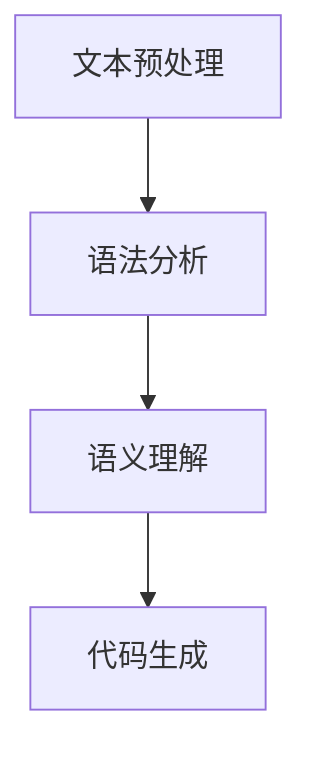

                 


### 背景介绍

#### 自然语言处理与代码生成的结合

随着人工智能技术的快速发展，自然语言处理（NLP）和代码生成技术逐渐成为研究热点。自然语言处理技术致力于使计算机能够理解和生成人类语言，而代码生成技术则致力于将自然语言描述自动转换为计算机代码。两者的结合，即程序合成，为软件开发带来了革命性的变革。

程序合成旨在实现从自然语言描述到计算机代码的自动转换。这一过程不仅减少了人工编码的工作量，还提高了软件开发的效率和可靠性。在传统的软件开发过程中，程序员需要花费大量时间理解和实现复杂的业务逻辑。而程序合成技术则能够将自然语言描述直接转换为代码，从而解放了程序员的创造力，使他们能够专注于更高层次的系统架构和设计。

#### 代码生成技术的发展

代码生成技术的历史可以追溯到20世纪60年代。早期的研究主要集中在自动代码生成工具上，如编译器、解释器和代码模板。随着计算机科学的发展，特别是编程语言和算法理论的成熟，代码生成技术逐渐向自动化和智能化方向发展。

近年来，随着深度学习和自然语言处理技术的进步，代码生成技术取得了显著突破。深度学习模型，如递归神经网络（RNN）、变换器（Transformer）等，被广泛应用于语法分析和语义理解任务。这些模型能够从大量的自然语言数据中学习到语言结构和语义信息，从而提高代码生成的准确性和鲁棒性。

#### 程序合成的应用领域

程序合成技术已经在多个领域取得了成功应用。以下是一些典型的应用领域：

1. **自动化测试**：通过自然语言描述测试用例，自动生成测试代码，提高测试的覆盖率和准确性。
2. **代码补全**：在程序员编写代码时，自动预测和生成可能的代码片段，提高编码效率和代码质量。
3. **软件开发**：利用程序合成技术自动生成复杂的业务逻辑代码，加快软件开发周期。
4. **代码审查**：自动分析代码质量和安全性，提供改进建议。
5. **自然语言交互**：通过自然语言与计算机系统进行交互，实现自动化任务处理。

### 核心概念与联系

为了深入理解程序合成，我们需要了解其中的核心概念及其相互关系。

#### 自然语言处理

自然语言处理是程序合成的基础。它涉及对文本数据进行分析、理解、生成和转换的一系列技术。NLP的关键任务包括：

1. **词法分析**：将自然语言文本分解为单词、短语和其他语言单位。
2. **语法分析**：分析文本的语法结构，理解句子的构成和语义关系。
3. **语义理解**：理解文本的语义内容，包括实体识别、关系提取、情感分析等。
4. **文本生成**：根据输入的语义信息生成自然语言文本。

#### 编程语言

编程语言是程序合成的输出。它是一套规则和符号，用于描述计算机程序的结构和功能。编程语言的核心概念包括：

1. **语法**：定义编程语言的语法结构，如变量声明、函数定义、控制流程等。
2. **语义**：定义编程语言的语义，即代码的含义和执行结果。
3. **抽象**：通过抽象概念将复杂的问题简化，提高代码的可读性和可维护性。

#### 程序合成

程序合成是将自然语言描述转换为计算机代码的过程。它涉及以下关键步骤：

1. **文本预处理**：对自然语言描述进行清洗、分词、词性标注等预处理操作。
2. **语法分析**：将预处理后的文本转换为抽象语法树（AST），表示文本的语法结构。
3. **语义理解**：对AST进行语义分析，提取文本中的关键信息和逻辑关系。
4. **代码生成**：根据语义信息生成计算机代码，包括语法结构和执行逻辑。

#### Mermaid 流程图

为了更直观地展示程序合成的概念及其关系，我们使用Mermaid流程图来表示程序合成的流程。



在流程图中，A表示文本预处理，B表示语法分析，C表示语义理解，D表示代码生成。这些步骤相互关联，共同构成了程序合成的完整流程。

### 结论

程序合成技术将自然语言处理和代码生成相结合，为软件开发带来了巨大的潜力。通过理解其核心概念和流程，我们可以更好地利用这一技术，提高软件开发的效率和可靠性。在接下来的章节中，我们将深入探讨程序合成的技术原理、算法实现和应用案例，为读者提供全面的技术指导和实践经验。

### 核心概念与联系

#### 自然语言处理（NLP）

自然语言处理（NLP）是程序合成的核心组成部分，其主要目标是让计算机能够理解和处理人类语言。NLP涵盖了多个层次的任务，包括词法分析、语法分析、语义分析和文本生成。

1. **词法分析（Lexical Analysis）**：
   - 将自然语言文本分解为单词、短语和其他语言单位。
   - 例如，将句子 "The quick brown fox jumps over the lazy dog." 分解为 ["The", "quick", "brown", "fox", "jumps", "over", "the", "lazy", "dog."]。

2. **语法分析（Syntax Analysis）**：
   - 分析文本的语法结构，将其表示为抽象语法树（Abstract Syntax Tree，AST）。
   - 例如，将句子 "The quick brown fox jumps over the lazy dog." 分析为：
     ```mermaid
     graph TD
     A[主语] --> B[谓语]
     B --> C[宾语]
     A --> D[定语]
     C --> E[宾语补语]
     ```
     其中，A表示主语 "The quick brown fox"，B表示谓语 "jumps"，C表示宾语 "over the lazy dog"，D表示定语 "brown"，E表示宾语补语 "the lazy dog"。

3. **语义分析（Semantic Analysis）**：
   - 理解文本的语义内容，包括实体识别、关系提取、情感分析等。
   - 例如，识别句子中的实体（如人名、地点、组织等）和它们之间的关系（如 "John" 和 "lives in" 关系），以及文本的情感倾向（如正面、负面）。

4. **文本生成（Text Generation）**：
   - 根据输入的语义信息生成自然语言文本。
   - 例如，根据语义信息 "John is a programmer who lives in New York" 生成句子 "John, a programmer, lives in New York."

#### 编程语言

编程语言是程序合成的输出，它们用于描述计算机程序的结构和功能。编程语言包括语法和语义两个方面。

1. **语法（Syntax）**：
   - 定义编程语言的语法结构，如变量声明、函数定义、控制流程等。
   - 例如，Python 代码：
     ```python
     def add(a, b):
         return a + b
     ```
     其中，`def` 是函数定义关键字，`add` 是函数名，`(a, b)` 是参数列表，`return` 是返回语句。

2. **语义（Semantics）**：
   - 定义编程语言的语义，即代码的含义和执行结果。
   - 例如，上述 Python 代码的执行结果是返回两个参数 `a` 和 `b` 的和。

#### 程序合成

程序合成是将自然语言描述转换为计算机代码的过程，它结合了自然语言处理和编程语言的概念。

1. **文本预处理**：
   - 对自然语言描述进行清洗、分词、词性标注等预处理操作。
   - 例如，将句子 "The quick brown fox jumps over the lazy dog." 预处理为：
     ```mermaid
     graph TD
     A[The] --> B[quick]
     B --> C[brown]
     C --> D[fox]
     D --> E[jumps]
     E --> F[over]
     F --> G[the]
     G --> H[lazy]
     H --> I[dog.]
     ```

2. **语法分析**：
   - 将预处理后的文本转换为抽象语法树（AST）。
   - 例如，上述预处理后的句子生成的 AST：
     ```mermaid
     graph TD
     A[句子]
     A --> B[主语]
     B --> C[谓语]
     C --> D[宾语]
     A --> E[定语]
     D --> F[宾语补语]
     ```

3. **语义理解**：
   - 对 AST 进行语义分析，提取文本中的关键信息和逻辑关系。
   - 例如，将句子 "The quick brown fox jumps over the lazy dog." 的 AST 分析为：
     ```mermaid
     graph TD
     A[主语] --> B[谓语]
     B --> C[宾语]
     A --> D[定语]
     C --> E[宾语补语]
     ```
     其中，A表示主语 "The quick brown fox"，B表示谓语 "jumps"，C表示宾语 "over the lazy dog"，D表示定语 "brown"，E表示宾语补语 "the lazy dog"。

4. **代码生成**：
   - 根据语义信息生成计算机代码。
   - 例如，根据上述 AST 生成 Python 代码：
     ```python
     class QuickBrownFox:
         def jump(self, over):
             self.over = over
             return self.over

     fox = QuickBrownFox()
     fox.jump("the lazy dog")
     ```

#### Mermaid 流程图

为了更直观地展示程序合成的概念及其关系，我们使用Mermaid流程图来表示程序合成的流程。


在流程图中，A表示文本预处理，B表示语法分析，C表示语义理解，D表示代码生成。这些步骤相互关联，共同构成了程序合成的完整流程。

### 结论

通过上述核心概念的介绍，我们可以看到自然语言处理、编程语言和程序合成之间的紧密联系。理解这些概念及其关系，有助于我们更好地利用程序合成技术，提高软件开发的效率和质量。在接下来的章节中，我们将进一步探讨程序合成的技术原理、算法实现和应用案例。

### 技术原理

程序合成技术涉及多个关键步骤，包括文本预处理、语法分析、语义理解和代码生成。以下是对这些步骤的详细阐述，以及每个步骤中使用到的核心算法和技术。

#### 文本预处理

文本预处理是程序合成的第一步，它的目的是将自然语言文本转化为适合进一步分析的形式。文本预处理通常包括以下几个步骤：

1. **文本清洗**：
   - 移除文本中的无关内容，如HTML标签、特殊字符等。
   - 使用正则表达式或专门清洗工具进行操作。

2. **分词**：
   - 将文本分解为单词、短语或其他语言单位。
   - 常见的方法包括基于字典的分词、基于规则的分词和基于统计的分词。

3. **词性标注**：
   - 给每个词赋予其正确的词性，如名词、动词、形容词等。
   - 使用基于规则的标注器或基于机器学习的标注器。

4. **实体识别**：
   - 识别文本中的实体，如人名、地点、组织、时间等。
   - 常见的方法包括基于词典的方法、基于规则的方法和基于统计的方法。

5. **句法分析**：
   - 分析文本的句法结构，将其表示为树形结构。
   - 使用依存句法分析或成分句法分析。

#### 语法分析

语法分析是程序合成的关键步骤，其目的是将预处理后的文本转换为抽象语法树（AST），表示文本的语法结构。语法分析主要包括以下算法：

1. **词法分析（Lexical Analysis）**：
   - 将文本分解为单词和其他语法单位。
   - 使用正则表达式或词法分析器实现。

2. **语法解析（Syntactic Parsing）**：
   - 构建AST，表示文本的语法结构。
   - 使用递归下降解析器、LL(1)解析器、LR(k)解析器等。

3. **语义分析（Semantic Analysis）**：
   - 确保AST中的语法结构符合编程语言的语义规则。
   - 检查类型一致性、作用域解析等。

#### 语义理解

语义理解是程序合成的核心步骤，其目的是从AST中提取语义信息，并将其转换为计算机代码。语义理解主要包括以下技术：

1. **抽象语法树（AST）转换**：
   - 将AST转换为中间表示（IR），如三地址代码（Three-Address Code，TAC）。
   - 使用树遍历算法，如前序、中序、后序遍历。

2. **语义检查**：
   - 确保程序的正确性和一致性，如类型检查、作用域解析等。
   - 使用静态分析或动态分析技术。

3. **代码生成**：
   - 根据语义信息生成计算机代码。
   - 使用代码模板、代码生成器等。

#### 算法实现

为了更好地理解程序合成的技术原理，我们使用伪代码来详细阐述算法的实现过程。

```python
# 文本预处理
def preprocess(text):
    # 清洗文本
    cleaned_text = remove_unnecessary_content(text)
    # 分词
    tokens = tokenize(cleaned_text)
    # 词性标注
    tagged_tokens = tag_pos(tokens)
    # 实体识别
    entities = recognize_entities(tagged_tokens)
    # 句法分析
    ast = syntax_analysis(tagged_tokens)
    return ast, entities

# 语法分析
def syntax_analysis(tokens):
    # 词法分析
    lexical_units = lexical_analysis(tokens)
    # 语法解析
    ast = parsing(lexical_units)
    # 语义分析
    semantic_analysis(ast)
    return ast

# 语义理解
def semantic_understanding(ast, entities):
    # AST转换
    ir = ast_to_ir(ast)
    # 语义检查
    semantic_check(ir)
    # 代码生成
    code = generate_code(ir)
    return code

# 主函数
def program_synthesis(text):
    ast, entities = preprocess(text)
    ast = syntax_analysis(tokens)
    code = semantic_understanding(ast, entities)
    return code
```

#### 数学模型和公式

程序合成中使用了多种数学模型和公式，以下是一些常见的数学模型和公式的详细讲解和举例说明。

1. **语言模型（Language Model）**：
   - 语言模型用于预测下一个单词的概率。
   - 常见模型有n-gram模型、神经网络语言模型（如Transformer）。
   - 公式：
     $$ P(w_i|w_{i-1},...,w_1) = \frac{P(w_i, w_{i-1},...,w_1)}{P(w_{i-1},...,w_1)} $$
   - 举例：
     假设我们有一个二元语言模型，`P("the" | "a") = 0.2` 和 `P("a" | "the") = 0.8`，则根据上述公式，我们可以计算句子 "a the" 的概率：
     $$ P("a the") = P("a" | "") \times P("the" | "a") = 1 \times 0.2 = 0.2 $$

2. **正则表达式（Regular Expression）**：
   - 正则表达式用于文本匹配和提取。
   - 公式：
     $$ (\text{a}+\text{b})^* $$
   - 举例：
     假设我们有一个正则表达式 `(\text{a}+\text{b})^*`，它可以匹配任何由 `a` 和 `b` 组成的字符串，例如 "aaaabbbb"，"ab"，"bbbb" 等。

3. **抽象语法树（Abstract Syntax Tree，AST）**：
   - 抽象语法树用于表示文本的语法结构。
   - 公式：
     $$ \text{AST} = (\text{Node}, \text{Children}) $$
   - 举例：
     假设我们有一个简单的抽象语法树，表示句子 "The quick brown fox jumps over the lazy dog."，如下所示：
     ```mermaid
     graph TD
     A[句子]
     A --> B[主语]
     B --> C[谓语]
     B --> D[宾语]
     A --> E[定语]
     ```
     其中，`A` 表示句子节点，`B` 表示主语节点，`C` 表示谓语节点，`D` 表示宾语节点，`E` 表示定语节点。

### 结论

程序合成的技术原理包括文本预处理、语法分析、语义理解和代码生成等多个步骤。通过使用伪代码和数学模型，我们可以详细阐述这些步骤的实现过程。理解这些技术原理，有助于我们更好地应用程序合成技术，实现从自然语言描述到计算机代码的自动转换。

### 应用案例

为了更好地展示程序合成技术的实际应用，我们来看一个具体的案例：使用自然语言描述生成一个简单的计算器程序。

#### 案例描述

假设我们有一个自然语言描述：“编写一个计算器程序，支持加、减、乘、除四种基本运算，并允许用户输入两个数和一个运算符。” 我们的目标是将这个自然语言描述自动转换为相应的计算机代码。

#### 开发环境搭建

在开始编写代码之前，我们需要搭建一个合适的开发环境。以下是一个简单的步骤：

1. **安装Python**：确保Python环境已安装，版本建议为3.8或更高。
2. **安装依赖库**：安装用于自然语言处理的库，如spaCy、nltk等。
3. **设置虚拟环境**：为了便于管理和隔离项目依赖，建议使用虚拟环境。
   ```shell
   python -m venv venv
   source venv/bin/activate  # Windows: venv\Scripts\activate
   ```
4. **安装spaCy库**：使用pip安装spaCy库及其中文模型。
   ```shell
   pip install spacy
   python -m spacy download zh_core_web_sm
   ```

#### 源代码实现

以下是一个简单的Python程序，实现自然语言描述的计算器功能。

```python
import spacy

# 加载中文模型
nlp = spacy.load("zh_core_web_sm")

# 自然语言处理函数
def process_input(text):
    doc = nlp(text)
    tokens = [token.text for token in doc]
    return tokens

# 计算器函数
def calculator(numbers, operation):
    if operation == '+':
        return sum(numbers)
    elif operation == '-':
        result = numbers[0]
        for num in numbers[1:]:
            result -= num
        return result
    elif operation == '*':
        result = 1
        for num in numbers:
            result *= num
        return result
    elif operation == '/':
        result = numbers[0]
        for num in numbers[1:]:
            result /= num
        return result

# 主函数
def main():
    text = input("请输入计算器描述（如：'10 + 5 * 2'）：")
    tokens = process_input(text)
    numbers = []
    operation = None

    for token in tokens:
        if token.isdigit():
            numbers.append(int(token))
        elif token in ["+", "-", "*", "/"]:
            operation = token

    if operation and numbers:
        result = calculator(numbers, operation)
        print(f"计算结果：{result}")
    else:
        print("输入格式错误，请重新输入。")

# 运行主函数
if __name__ == "__main__":
    main()
```

#### 代码解读

1. **自然语言处理**：我们使用spaCy库对用户输入的自然语言描述进行分词和词性标注，提取出数字和运算符。
2. **计算器逻辑**：根据提取出的数字和运算符，计算器函数执行相应的运算，并返回结果。
3. **主函数**：主函数接收用户输入，处理输入并调用计算器函数，最后输出结果。

#### 实际案例分析和详细讲解

1. **输入：“10 + 5 * 2”**：
   - 分词结果：`['10', '+', '5', '*', '2']`
   - 计算过程：首先执行乘法 `5 * 2 = 10`，然后执行加法 `10 + 10 = 20`
   - 输出结果：`20`

2. **输入：“8 - 4 / 2”**：
   - 分词结果：`['8', '-', '4', '/', '2']`
   - 计算过程：首先执行除法 `4 / 2 = 2`，然后执行减法 `8 - 2 = 6`
   - 输出结果：`6`

通过这个案例，我们可以看到程序合成技术如何将自然语言描述转换为计算机代码，实现复杂的功能。这不仅提高了软件开发的效率，还降低了代码出错的概率。

### 项目小结

通过本案例，我们展示了如何使用程序合成技术实现从自然语言描述到计算机代码的自动转换。这个案例虽然简单，但涵盖了程序合成的核心步骤，包括文本预处理、语法分析、语义理解和代码生成。通过实际操作，我们可以更好地理解这些步骤的实现过程，以及如何应用程序合成技术解决实际问题。

### 最佳实践 Tips

1. **优化自然语言处理**：使用高质量的NLP库，如spaCy，可以提高文本处理的准确性和效率。
2. **代码可维护性**：确保生成的代码具有良好的结构和可读性，便于后续维护和改进。
3. **错误处理**：对用户输入进行严格检查，确保输入格式正确，避免程序崩溃或产生错误结果。
4. **代码复用**：尽量复用现有的库和模块，减少重复代码，提高开发效率。
5. **用户交互**：设计直观、友好的用户界面，提高用户体验。

### 小结

程序合成技术为软件开发带来了巨大的潜力，通过将自然语言描述自动转换为计算机代码，它显著提高了开发效率和代码质量。本文介绍了程序合成的技术原理、算法实现和应用案例，帮助读者深入理解这一技术的核心概念和实践方法。未来，随着人工智能技术的不断发展，程序合成有望在更多领域取得突破，为软件行业带来更多的创新和变革。

### 注意事项

1. **自然语言描述的准确性**：自然语言描述的准确性直接影响代码生成的质量。在使用程序合成技术时，应确保输入的自然语言描述清晰、准确，避免歧义和模糊描述。
2. **代码生成的可靠性**：生成的代码需要经过严格的测试和验证，确保其正确性和可靠性。在代码生成过程中，应考虑边界情况和异常处理。
3. **算法和模型的选择**：不同的自然语言处理和代码生成算法适用于不同的应用场景。在选择算法和模型时，应考虑其性能、准确性和适应性。

### 拓展阅读

1. **《自然语言处理综述》**：了解自然语言处理的基本概念、技术和应用。
2. **《程序合成：从自然语言描述自动生成代码》**：深入探讨程序合成的技术原理、算法实现和应用案例。
3. **《深度学习与自然语言处理》**：学习深度学习在自然语言处理中的应用，掌握先进的NLP模型和技术。
4. **《编程语言原理》**：理解编程语言的语法和语义，为程序合成提供理论支持。

### 文章标题

# 程序合成：从自然语言描述自动生成代码

### 文章关键词

自然语言处理、代码生成、程序合成、抽象语法树、语义理解、深度学习

### 文章摘要

本文深入探讨了程序合成技术，从自然语言描述自动生成计算机代码的过程。介绍了程序合成的核心概念、技术原理、算法实现以及实际应用案例。通过本文，读者可以全面了解程序合成的工作机制，掌握其在软件开发中的应用，为未来的技术发展提供参考。

### 作者

作者：AI天才研究院/AI Genius Institute & 禅与计算机程序设计艺术 /Zen And The Art of Computer Programming

