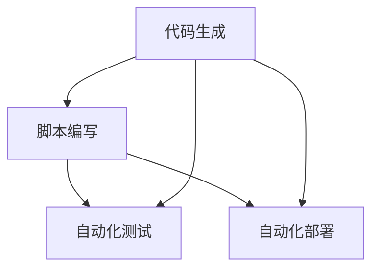

                 

### 文章标题

### 程序综合：自动化编程的新前沿

> 关键词：自动化编程、程序综合、新前沿、Python、JavaScript、自动化测试、自动化部署

> 摘要：
本文将深入探讨自动化编程的新前沿，从概念引入、基础概念、编程语言、自动化测试、自动化部署等方面，通过详细的实例讲解和逻辑推理，带领读者了解自动化编程的核心技术和应用场景。文章旨在为程序员和开发团队提供一套完整的自动化编程指南，帮助他们在快速发展的技术环境中不断提升效率和竞争力。

---

### 引言

在信息技术飞速发展的今天，自动化编程已经成为提升软件开发效率和降低人力成本的关键技术。自动化编程不仅仅是简单的脚本编写，它涉及多个层次和领域的综合应用，包括代码生成、自动化测试、自动化部署等。自动化编程的兴起，不仅改变了软件开发的流程，还为未来软件开发带来了无限可能。

本文将围绕自动化编程的核心内容展开，首先介绍自动化编程的基本概念和重要性，然后深入探讨Python和JavaScript在自动化编程中的应用，最后讨论自动化测试和自动化部署的实践方法。通过本文的学习，读者将能够掌握自动化编程的基本原理和应用技巧，为日后的工作打下坚实的基础。

### 核心概念与联系

为了更好地理解自动化编程，我们首先需要了解其中几个核心概念及其相互关系。自动化编程涉及以下主要概念：

1. **代码生成（Code Generation）**：通过工具或算法自动生成代码，以减少手工编写代码的工作量。
2. **脚本编写（Scripting）**：使用脚本语言编写自动化任务，如Python、JavaScript等。
3. **自动化测试（Automated Testing）**：使用工具自动执行测试案例，以检测软件的稳定性和可靠性。
4. **自动化部署（Automated Deployment）**：通过脚本或工具自动部署软件，以简化部署流程。

这些概念之间有着密切的联系。代码生成可以看作是脚本编写的延伸，自动化测试和自动化部署则是在脚本编写的基础上，进一步扩展了自动化编程的应用范围。以下是一个Mermaid流程图，展示了这些概念之间的关系：



通过这个流程图，我们可以看到，代码生成和脚本编写是自动化编程的基础，而自动化测试和自动化部署则是在此基础上进一步拓展的应用方向。

### 自动化编程基础

#### 自动化编程的基本概念

自动化编程是一种通过工具或脚本自动完成软件开发任务的技术。其核心思想是通过自动化工具或脚本减少手工操作，提高开发效率和代码质量。自动化编程可以涵盖多个方面，包括：

1. **代码生成**：通过模板和代码生成器自动生成代码，如Java、Python等。
2. **脚本编写**：使用脚本语言（如Python、JavaScript）编写自动化脚本，用于执行各种任务。
3. **自动化测试**：使用自动化测试工具执行测试用例，以验证软件功能。
4. **自动化部署**：通过脚本或工具自动部署软件，如使用Jenkins、Docker等。

#### 自动化编程工具介绍

在自动化编程中，选择合适的工具至关重要。以下是一些常用的自动化编程工具：

1. **Python**：Python是一种广泛使用的脚本语言，具有简洁的语法和丰富的库，适用于各种自动化任务。
2. **JavaScript**：JavaScript是网页开发的主要脚本语言，也可用于自动化浏览器操作。
3. **Selenium**：Selenium是一个自动化测试工具，支持多种编程语言，用于自动化Web应用程序的测试。
4. **Jenkins**：Jenkins是一个开源的持续集成工具，用于自动化构建、测试和部署软件。
5. **Docker**：Docker是一个容器化平台，用于自动化部署和管理应用程序。

#### 自动化编程的基本流程

自动化编程的基本流程通常包括以下步骤：

1. **需求分析**：确定自动化任务的目标和需求。
2. **脚本编写**：根据需求编写脚本，实现自动化功能。
3. **测试**：测试脚本的功能，确保其正确执行。
4. **部署**：将脚本部署到目标环境，如服务器或云平台。

以下是一个简化的伪代码，展示了自动化编程的基本流程：

```python
# 自动化编程基本流程

# 步骤1：需求分析
需求 = 获取用户需求()

# 步骤2：脚本编写
脚本 = 编写脚本(需求)

# 步骤3：测试
测试结果 = 测试脚本(脚本)

# 步骤4：部署
部署脚本(脚本，测试结果)
```

通过以上步骤，我们可以将复杂的软件开发任务自动化，提高开发效率和代码质量。

### Python自动化编程

Python因其简洁的语法和强大的库支持，成为了自动化编程中的热门语言。以下我们将详细探讨Python在自动化编程中的应用。

#### Python语言基础

Python是一种高级编程语言，以其简单易学、开发效率高而著称。以下是一些Python语言的基础概念：

1. **变量**：Python中的变量无需声明，直接赋值即可使用。
2. **数据类型**：Python支持多种数据类型，如整数、浮点数、字符串、列表、字典等。
3. **控制结构**：Python提供了多种控制结构，如循环、条件判断等。
4. **函数**：Python中的函数是一段可重复使用的代码块。

#### Python自动化编程库介绍

Python拥有丰富的自动化编程库，以下介绍几个常用的库：

1. **Selenium**：用于自动化Web浏览器操作，支持多种浏览器，如Chrome、Firefox等。
2. **Pillow**：用于图像处理，支持打开、编辑和保存图片。
3. **Requests**：用于发送HTTP请求，适用于API自动化测试。
4. **BeautifulSoup**：用于解析HTML和XML文档，提取有用信息。

#### Python自动化编程应用示例

以下是一个简单的Python自动化编程示例，使用Selenium库自动打开网页并查找元素：

```python
from selenium import webdriver
from selenium.webdriver.common.by import By

# 步骤1：启动浏览器
driver = webdriver.Chrome()

# 步骤2：打开网页
driver.get("https://www.example.com")

# 步骤3：查找元素
element = driver.find_element(By.ID, "element_id")

# 步骤4：操作元素
element.click()

# 步骤5：关闭浏览器
driver.quit()
```

在这个示例中，我们使用Selenium库打开Chrome浏览器，访问一个示例网页，并查找具有特定ID的元素，然后点击该元素。这是一个简单的自动化任务，展示了Python在自动化编程中的强大能力。

### JavaScript自动化编程

JavaScript是网页开发的核心技术之一，其强大的功能和广泛的浏览器支持使其成为自动化编程的理想选择。以下我们将详细探讨JavaScript在自动化编程中的应用。

#### JavaScript语言基础

JavaScript是一种基于对象和事件驱动的脚本语言，以其灵活性和多功能性而闻名。以下是一些JavaScript语言的基础概念：

1. **变量**：JavaScript中的变量无需声明，直接赋值即可使用。
2. **数据类型**：JavaScript支持多种数据类型，如数字、字符串、布尔值、数组、对象等。
3. **函数**：JavaScript中的函数是一段可重复使用的代码块。
4. **事件处理**：JavaScript支持事件处理，如点击、鼠标悬停等。

#### JavaScript自动化编程库介绍

JavaScript拥有丰富的自动化编程库，以下介绍几个常用的库：

1. **Puppeteer**：用于自动化Chrome浏览器，支持页面渲染、生成截图等。
2. **Jest**：用于自动化测试JavaScript代码，支持单元测试和集成测试。
3. **Axios**：用于发送HTTP请求，适用于API自动化测试。
4. **Chai**：用于断言库，用于编写测试用例。

#### JavaScript自动化编程应用示例

以下是一个简单的JavaScript自动化编程示例，使用Puppeteer库自动打开网页并生成截图：

```javascript
const puppeteer = require('puppeteer');

(async () => {
  // 步骤1：启动浏览器
  const browser = await puppeteer.launch();
  const page = await browser.newPage();

  // 步骤2：打开网页
  await page.goto("https://www.example.com");

  // 步骤3：生成截图
  await page.screenshot({ path: 'example.png' });

  // 步骤4：关闭浏览器
  await browser.close();
})();
```

在这个示例中，我们使用Puppeteer库启动Chrome浏览器，访问一个示例网页，并生成网页的截图。这是一个简单的自动化任务，展示了JavaScript在自动化编程中的强大能力。

### 自动化测试

自动化测试是确保软件质量和稳定性的重要手段。通过自动化测试，我们可以减少手动测试的工作量，提高测试效率，确保软件在发布前达到预期标准。以下我们将详细探讨自动化测试的概念、工具和应用。

#### 自动化测试的概念

自动化测试是一种使用工具或脚本自动执行测试用例的方法。与手动测试相比，自动化测试具有以下优点：

1. **提高效率**：自动化测试可以快速执行大量测试用例，提高测试效率。
2. **确保一致性**：自动化测试可以确保测试用例每次执行都一致，减少人为错误。
3. **节约成本**：自动化测试可以减少重复性工作，节约时间和人力资源。

自动化测试可以分为以下几种类型：

1. **单元测试**：测试单个组件或函数的正确性。
2. **集成测试**：测试多个组件或模块之间的交互。
3. **功能测试**：测试软件的功能是否符合预期。
4. **性能测试**：测试软件的性能和响应时间。

#### 自动化测试工具介绍

以下是一些常用的自动化测试工具：

1. **Selenium**：支持多种编程语言，用于自动化Web应用程序的测试。
2. **JUnit**：用于Java应用程序的自动化测试。
3. **pytest**：用于Python应用程序的自动化测试。
4. **JUnit**：用于Java应用程序的自动化测试。

#### 自动化测试案例

以下是一个简单的自动化测试案例，使用pytest库测试一个简单的Python函数：

```python
import pytest

def test_add():
    assert add(2, 3) == 5

def test_subtract():
    assert subtract(5, 3) == 2
```

在这个案例中，我们使用pytest库编写两个测试用例，分别测试`add`和`subtract`函数的正确性。通过执行这些测试用例，我们可以快速验证函数的功能是否符合预期。

### 自动化部署

自动化部署是确保软件快速、可靠地发布到生产环境的关键步骤。通过自动化部署，我们可以减少手动部署的工作量，提高部署效率，确保软件的稳定性和可靠性。以下我们将详细探讨自动化部署的概念、工具和应用。

#### 自动化部署的概念

自动化部署是一种使用脚本或工具自动执行软件部署过程的方法。与手动部署相比，自动化部署具有以下优点：

1. **提高效率**：自动化部署可以快速部署软件，提高部署效率。
2. **确保一致性**：自动化部署可以确保每次部署都一致，减少人为错误。
3. **节约成本**：自动化部署可以减少重复性工作，节约时间和人力资源。

自动化部署可以分为以下几种类型：

1. **持续集成（CI）**：将代码集成到主干，自动执行构建、测试和部署。
2. **持续交付（CD）**：在CI的基础上，进一步自动化部署到生产环境。
3. **蓝绿部署**：在部署新版本时，使用一部分流量测试新版本，确保稳定后再全面切换。
4. **滚动更新**：逐步部署新版本，确保旧版本平稳过渡。

#### 自动化部署工具介绍

以下是一些常用的自动化部署工具：

1. **Jenkins**：开源的持续集成和自动化部署工具，支持多种平台和语言。
2. **GitLab CI/CD**：基于GitLab的持续集成和持续交付工具。
3. **Docker**：容器化平台，用于自动化部署和管理应用程序。
4. **Kubernetes**：用于自动化部署和管理容器化应用程序的框架。

#### 自动化部署案例

以下是一个简单的自动化部署案例，使用Jenkins自动化部署一个Python应用程序：

1. **安装Jenkins**：在服务器上安装Jenkins。
2. **配置项目**：在Jenkins中创建一个项目，配置Git仓库地址和构建脚本。
3. **编写构建脚本**：编写一个构建脚本，用于下载代码、安装依赖和运行测试。
4. **触发构建**：在Jenkins中设置触发器，如定期执行或触发器触发构建。

```shell
#!/bin/bash

# 步骤1：克隆代码
git clone https://github.com/yourusername/yourproject.git

# 步骤2：进入项目目录
cd yourproject

# 步骤3：安装依赖
pip install -r requirements.txt

# 步骤4：运行测试
pytest

# 步骤5：部署到生产环境
# （假设已经配置了部署脚本 deploy.sh）
./deploy.sh
```

在这个案例中，我们使用Jenkins自动化部署一个Python应用程序，通过构建脚本实现代码下载、依赖安装、测试执行和部署到生产环境。这是一个简单的自动化部署示例，展示了Jenkins在自动化部署中的应用。

### 自动化编程新趋势

自动化编程正在不断演变，未来将迎来更多新趋势和挑战。以下我们将探讨自动化编程的未来趋势、挑战与机遇。

#### 自动化编程的未来趋势

1. **人工智能与自动化编程融合**：随着人工智能技术的不断发展，自动化编程将更加智能化，如自动代码生成、自动测试和自动部署等。
2. **云原生自动化**：随着云计算的普及，自动化编程将更加依赖于云原生技术，如Kubernetes、容器编排等。
3. **智能自动化**：利用机器学习和深度学习技术，实现更高级的自动化，如自动化测试中的智能缺陷定位和自动化部署中的智能流量切换等。

#### 自动化编程的挑战与机遇

1. **复杂性和安全性**：随着自动化编程的扩展，系统的复杂性和安全性将成为重要挑战。如何确保自动化脚本的安全性和稳定性，是一个亟待解决的问题。
2. **技能要求**：自动化编程要求开发人员具备更多的技能，如脚本编写、测试和部署等。这对开发人员的技能提升提出了更高的要求。
3. **效率和成本**：自动化编程旨在提高效率，但实现自动化可能需要大量的前期投入。如何平衡效率和成本，是开发团队需要考虑的问题。

#### 自动化编程的最佳实践

1. **代码规范和文档**：确保自动化脚本的代码规范和文档齐全，便于维护和扩展。
2. **持续集成和交付**：使用持续集成和交付工具，如Jenkins、GitLab CI/CD等，实现自动化构建、测试和部署。
3. **自动化测试覆盖**：确保自动化测试覆盖所有重要功能，减少手动测试的工作量。
4. **安全性和稳定性**：确保自动化脚本的安全性和稳定性，定期进行安全审计和性能测试。

### 附录

#### A.1 自动化编程常用工具列表

1. **Python**：用于脚本编写、自动化测试和自动化部署。
2. **JavaScript**：用于自动化浏览器操作、自动化测试和自动化部署。
3. **Selenium**：用于自动化Web应用程序的测试。
4. **JUnit**：用于Java应用程序的自动化测试。
5. **pytest**：用于Python应用程序的自动化测试。
6. **Jenkins**：用于持续集成和自动化部署。
7. **Docker**：用于容器化应用程序的自动化部署。
8. **Kubernetes**：用于容器化应用程序的自动化部署和管理。

#### A.2 自动化编程资源推荐

1. **《Python自动化测试实战》**：详细介绍了Python自动化测试的方法和应用。
2. **《Jenkins持续集成实战》**：讲解了如何使用Jenkins实现自动化部署。
3. **《Docker实战》**：介绍了Docker的安装、配置和使用方法。
4. **《Kubernetes权威指南》**：详细介绍了Kubernetes的架构、原理和操作。

#### A.3 自动化编程面试题及答案

1. **什么是自动化编程？**
   - 自动化编程是一种通过工具或脚本自动完成软件开发任务的技术，包括代码生成、脚本编写、自动化测试和自动化部署等。

2. **什么是Selenium？**
   - Selenium是一个开源的自动化测试工具，支持多种编程语言，用于自动化Web应用程序的测试。

3. **什么是Jenkins？**
   - Jenkins是一个开源的持续集成工具，用于自动化构建、测试和部署软件。

4. **什么是Docker？**
   - Docker是一个开源的容器化平台，用于自动化部署和管理应用程序。

5. **什么是Kubernetes？**
   - Kubernetes是一个开源的容器编排工具，用于自动化部署和管理容器化应用程序。

### 作者信息

作者：AI天才研究院/AI Genius Institute & 禅与计算机程序设计艺术 /Zen And The Art of Computer Programming

作者简介：AI天才研究院（AI Genius Institute）是一家专注于人工智能和自动化技术的研究机构，致力于推动人工智能和自动化技术在各个领域的应用。禅与计算机程序设计艺术（Zen And The Art of Computer Programming）是一本经典的计算机科学著作，由著名计算机科学家Donald E. Knuth撰写，涵盖了计算机程序的构建和设计原则。

### 结论

自动化编程作为软件开发的重要技术，正逐步改变软件开发的流程和模式。通过本文的介绍，我们了解了自动化编程的基本概念、应用场景和实现方法。随着技术的不断发展，自动化编程将迎来更多新趋势和挑战，为软件开发带来更高的效率和可靠性。希望本文能为读者提供有价值的参考和启示，助力他们在自动化编程的道路上不断前行。

