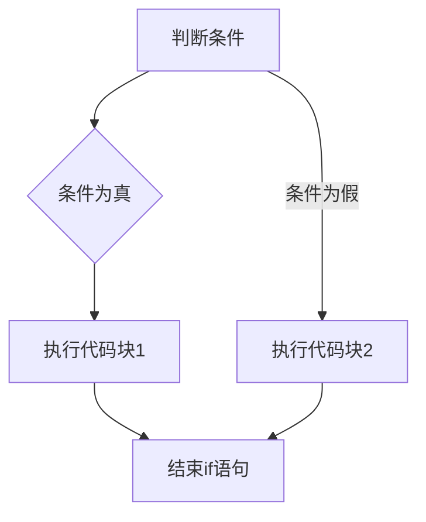
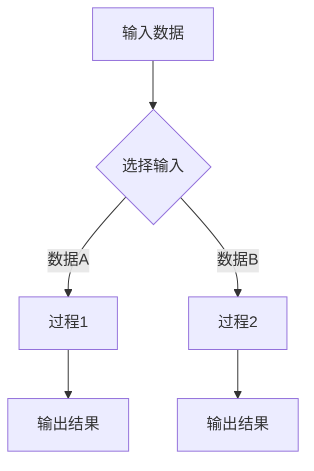
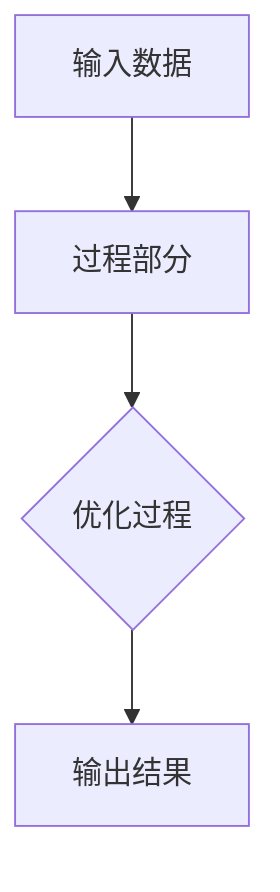
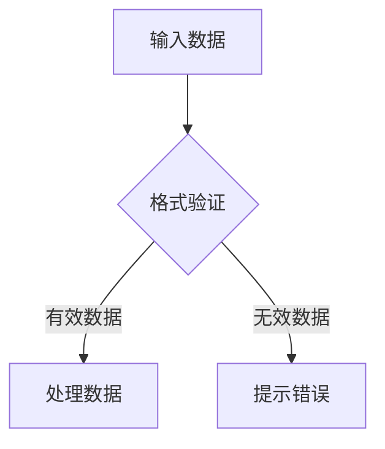
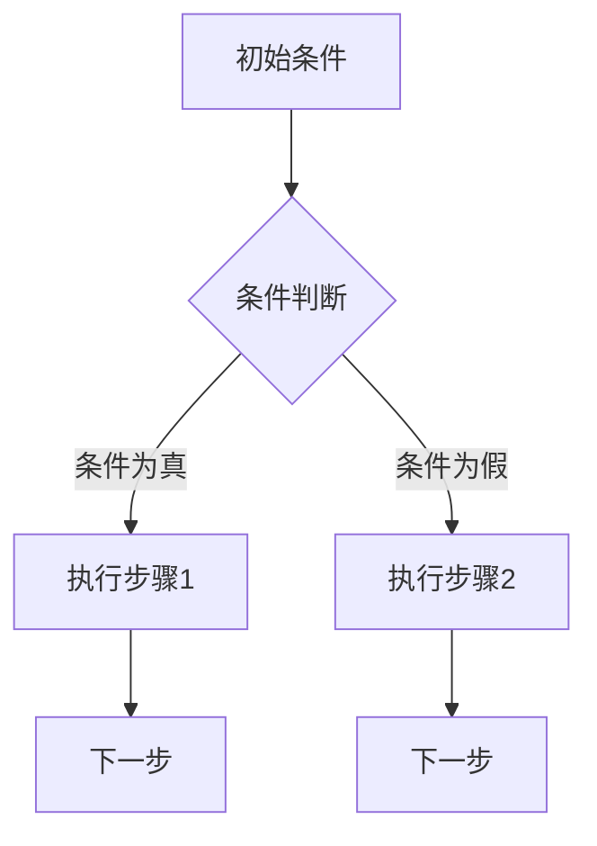
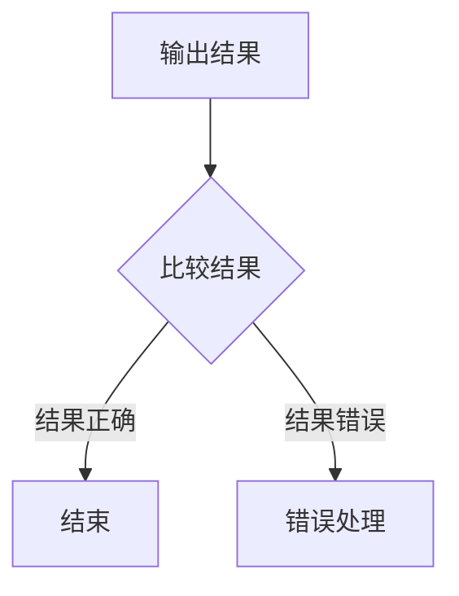
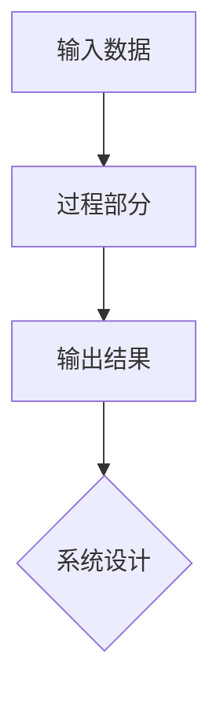
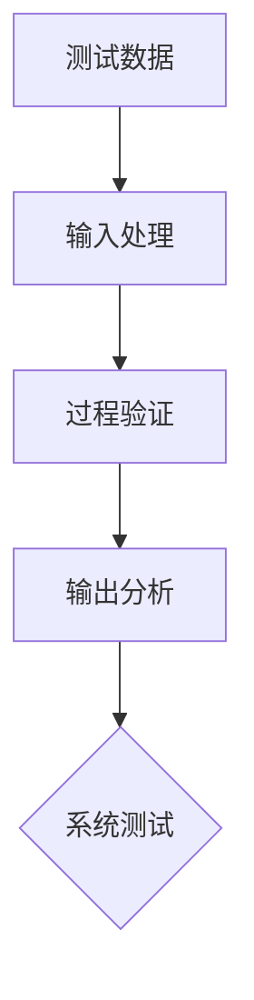

                 


### 文章标题

程序逻辑与霍尔三元组的应用

### 文章关键词

程序逻辑，霍尔三元组，算法，人工智能，数据分析，系统优化

### 文章摘要

本文深入探讨了程序逻辑与霍尔三元组的结合，分析了其核心概念、基本原理及其在实际应用中的重要性。通过详细的示例和案例分析，本文展示了如何运用程序逻辑和霍尔三元组优化系统设计，提高算法效率。文章旨在为读者提供一个全面的技术指南，帮助其在实际项目中更好地应用这些概念，提高编程和系统设计能力。

## 第一部分：程序逻辑基础

### 1.1 程序逻辑概述

程序逻辑是计算机编程的核心概念之一，它涉及到程序中的条件和循环结构，是构建复杂算法和实现系统功能的关键。程序逻辑不仅仅是一种编程技巧，更是一种思维方式和解决问题的方法论。通过逻辑表达，程序能够根据不同的输入条件和执行路径，生成预期的输出结果。

在计算机科学中，程序逻辑通常指的是逻辑运算符和条件语句的使用。逻辑运算符包括逻辑与（AND）、逻辑或（OR）和逻辑非（NOT），这些运算符可以组合成复杂的逻辑表达式，用于判断程序执行的条件。条件语句则是根据某个条件的真假来选择执行不同代码块的控制结构，常见的有if-else语句和switch语句。

程序逻辑的作用主要体现在以下几个方面：

1. **决策支持**：程序逻辑能够根据输入的数据和条件进行决策，从而实现自动化控制和智能系统的功能。
2. **数据处理**：通过条件语句和循环结构，程序可以高效地对大量数据进行筛选、分类和变换。
3. **错误处理**：程序逻辑能够识别和响应异常情况，确保程序的健壮性和稳定性。

### 1.2 程序逻辑的基本概念

#### 条件语句

条件语句是程序逻辑中最基本的部分，用于根据条件的真假来执行不同的代码块。最常见的条件语句是if-else语句，其基本形式如下：



if-else语句可以根据需要嵌套使用，以实现更复杂的逻辑判断。

#### 循环语句

循环语句用于重复执行一段代码，直到满足某个终止条件。循环可以分为两种基本类型：for循环和while循环。

- **for循环**：for循环通常用于循环次数已知的情况，其语法如下：

  ```c
  for (初始化; 判断条件; 迭代表达式) {
      // 循环体
  }
  ```

- **while循环**：while循环用于循环次数未知的情况，其语法如下：

  ```c
  while (判断条件) {
      // 循环体
  }
  ```

#### 递归

递归是一种编程技巧，函数可以直接调用自身。递归可以用于解决许多复杂的问题，例如计算阶乘、求解递归关系等。递归的基本形式如下：

```c
def recursive_function(parameters):
    # 基本情况
    if (终止条件):
        return 基本结果
    # 递归调用
    else:
        return 函数调用结果
```

### 1.3 程序逻辑的实际应用

程序逻辑在数据处理、决策支持和错误处理等方面有着广泛的应用。

#### 数据处理

在数据处理中，程序逻辑通过条件语句和循环结构，可以对大量数据进行筛选、分类和变换。例如，在数据分析中，可以使用条件语句来筛选符合特定条件的记录，使用循环结构来计算数据的总和或平均值。

#### 决策支持

在决策支持系统中，程序逻辑可以根据输入的条件和规则，自动生成决策结果。例如，在金融领域中，可以使用程序逻辑来评估股票投资的风险和回报。

#### 错误处理

在程序设计中，错误处理是非常重要的部分。程序逻辑可以识别和响应异常情况，确保程序的健壮性和稳定性。例如，当输入数据不符合预期时，程序可以通过逻辑判断来处理异常，避免程序崩溃。

## 第二部分：霍尔三元组原理

### 2.1 霍尔三元组概述

霍尔三元组（Hall's Triad）是计算机科学中的一种重要理论框架，由迈克尔·霍尔（Michael Jackson）提出。它主要用于描述系统设计的结构和行为，特别是在复杂系统的建模和验证中有着广泛的应用。

霍尔三元组的基本概念包括三个部分：输入（Input）、过程（Process）和输出（Output）。这三个部分相互关联，构成了一个完整的信息处理单元。输入是系统接收的数据和事件，过程是系统对这些输入进行处理和转换的机制，输出是系统生成的结果和响应。

霍尔三元组的特点如下：

1. **模块化**：每个三元组都可以作为一个独立的模块进行设计和测试，便于系统的复用和维护。
2. **可组合性**：多个三元组可以组合成更复杂的系统结构，实现更复杂的系统功能。
3. **灵活性**：霍尔三元组可以适应不同的应用场景，通过调整输入、过程和输出的关系，实现不同的系统行为。

### 2.2 霍尔三元组的组成部分

#### 输入部分

输入部分是系统的数据来源，可以是用户输入、传感器数据、文件或其他系统产生的数据。输入部分需要明确数据的类型、格式和约束条件，以便系统能够正确地处理和解释这些数据。

#### 过程部分

过程部分是系统的核心，负责对输入数据进行处理和转换。过程可以包含多个步骤，每个步骤都可以是一个条件语句、循环结构或其他逻辑操作。通过过程部分，系统可以实现数据的过滤、计算、存储和传递等功能。

#### 输出部分

输出部分是系统生成的结果和响应，可以是用户界面显示的信息、文件、数据库记录或其他形式的数据。输出部分需要保证数据的准确性和及时性，以满足用户的需求和系统的功能要求。

### 2.3 霍尔三元组的应用领域

霍尔三元组在多个应用领域有着重要的应用，包括：

1. **人工智能**：在人工智能系统中，霍尔三元组可以用于描述神经网络的前向传播和反向传播过程，实现模型的训练和预测。
2. **自动化控制**：在自动化控制系统中，霍尔三元组可以用于描述传感器输入、控制器过程和执行器输出的关系，实现系统的自动化控制和优化。
3. **数据分析**：在数据分析中，霍尔三元组可以用于描述数据处理、分析和可视化过程的逻辑结构，提高数据分析的效率和准确性。

## 第三部分：程序逻辑与霍尔三元组结合

### 3.1 程序逻辑在霍尔三元组中的应用

程序逻辑与霍尔三元组的结合，可以显著提高系统设计的灵活性和效率。程序逻辑可以用于控制霍尔三元组的输入、过程和输出，实现更加复杂和智能的系统功能。

#### 算法设计

在算法设计中，程序逻辑可以用于控制霍尔三元组的输入和输出。例如，可以使用if-else语句来选择不同的输入数据，或者使用循环结构来重复执行某个过程。通过这种方式，算法可以实现更加复杂和灵活的逻辑处理。



#### 系统优化

在系统优化中，程序逻辑可以用于优化霍尔三元组的过程部分。例如，可以使用循环优化技术来减少计算复杂度，或者使用并行处理技术来提高系统的处理速度。通过优化过程部分，系统可以更加高效地处理输入数据，生成输出结果。



### 3.2 霍尔三元组在程序逻辑中的应用

霍尔三元组也可以应用于程序逻辑中，用于描述和控制程序的执行过程。例如，可以使用霍尔三元组来设计程序的结构，或者使用霍尔三元组的输入和输出部分来控制程序的逻辑。

#### 输入处理

在输入处理中，可以使用霍尔三元组来定义输入数据的格式和约束条件。例如，可以使用if-else语句来检查输入数据的有效性，或者使用正则表达式来验证输入数据的格式。



#### 过程控制

在过程控制中，可以使用霍尔三元组来定义程序的执行步骤和条件。例如，可以使用if-else语句来选择不同的执行路径，或者使用while循环来重复执行某个过程。



#### 输出分析

在输出分析中，可以使用霍尔三元组来检查程序的输出结果是否符合预期。例如，可以使用if-else语句来比较输出结果和预期结果，或者使用断言来验证输出结果的正确性。



### 3.3 程序逻辑与霍尔三元组的整合

程序逻辑与霍尔三元组的整合，可以用于设计更复杂和灵活的系统。通过整合程序逻辑和霍尔三元组，系统可以更好地适应不同的应用场景，实现更加高效和智能的功能。

#### 系统设计

在系统设计中，可以使用程序逻辑和霍尔三元组来定义系统的结构和行为。例如，可以使用程序逻辑来控制系统的输入和输出，使用霍尔三元组来描述系统的过程部分。通过这种方式，系统可以更加灵活地适应不同的需求和场景。



#### 系统测试

在系统测试中，可以使用程序逻辑和霍尔三元组来验证系统的功能和性能。例如，可以使用程序逻辑来生成测试数据，使用霍尔三元组来验证系统的输入、过程和输出。通过系统测试，可以确保系统满足设计要求和性能指标。



### 3.4 案例研究

#### 案例一：使用霍尔三元组优化程序逻辑

在某电商平台上，需要优化用户购买行为的分析算法，以提高用户满意度和产品推荐效果。

**1. 背景介绍**

电商平台积累了大量的用户购买数据，通过对这些数据进行分析，可以了解用户的购物偏好和需求，从而优化产品推荐策略，提高用户满意度和销售额。

**2. 解题思路**

使用霍尔三元组来优化程序逻辑，具体步骤如下：

1. **输入处理**：使用程序逻辑对用户购买数据进行分析，提取用户购买频次、购买金额等关键指标。
2. **过程控制**：使用霍尔三元组来定义数据处理的流程，包括数据清洗、分类和计算等步骤。
3. **输出分析**：使用程序逻辑对处理结果进行分析，生成用户画像和推荐结果。

**3. 实施步骤**

1. **数据预处理**：使用程序逻辑对用户购买数据进行清洗和转换，确保数据格式和一致性。
2. **数据处理**：使用霍尔三元组来定义数据处理流程，包括数据分类、计算和存储等步骤。
3. **结果分析**：使用程序逻辑对处理结果进行分析，生成用户画像和推荐结果。

**4. 结果分析**

通过使用霍尔三元组优化程序逻辑，电商平台成功地提高了用户购买行为的分析效率，优化了产品推荐策略，提高了用户满意度和销售额。

#### 案例二：在程序逻辑中应用霍尔三元组

在某智能监控系统项目中，需要使用程序逻辑和霍尔三元组来实现智能监控和报警功能。

**1. 背景介绍**

智能监控系统需要实时监控设备状态和环境参数，当出现异常情况时，自动触发报警并通知相关人员。为了实现这一功能，需要使用程序逻辑和霍尔三元组来设计系统的结构和行为。

**2. 解题思路**

在程序逻辑中应用霍尔三元组，具体步骤如下：

1. **输入处理**：使用程序逻辑接收传感器数据和设备状态信息。
2. **过程控制**：使用霍尔三元组来定义数据处理和监控流程，包括数据解析、状态判断和报警处理等步骤。
3. **输出分析**：使用程序逻辑生成监控报告和报警通知。

**3. 实施步骤**

1. **数据接收**：使用程序逻辑接收传感器数据和设备状态信息。
2. **数据处理**：使用霍尔三元组来定义数据处理和监控流程，包括数据解析、状态判断和报警处理等步骤。
3. **结果分析**：使用程序逻辑生成监控报告和报警通知。

**4. 结果分析**

通过在程序逻辑中应用霍尔三元组，智能监控系统成功地实现了实时监控和自动报警功能，提高了系统的安全性和可靠性。

### 3.5 总结与展望

#### 总结

本文详细探讨了程序逻辑与霍尔三元组的结合，分析了其在系统设计和应用中的重要性。通过具体的案例研究，展示了如何使用程序逻辑和霍尔三元组来优化系统设计和提高算法效率。总结如下：

1. **程序逻辑**：程序逻辑是计算机编程的核心，通过条件语句、循环结构和递归等基本概念，实现程序的自动化控制和数据处理。
2. **霍尔三元组**：霍尔三元组是系统设计的重要理论框架，通过输入、过程和输出的相互关联，实现系统的模块化和灵活化。
3. **结合应用**：程序逻辑与霍尔三元组的结合，可以显著提高系统设计的灵活性和效率，实现更加复杂和智能的系统功能。

#### 展望

未来，程序逻辑和霍尔三元组在计算机科学和人工智能领域将继续发挥重要作用。展望未来，有以下几点趋势：

1. **更复杂的应用场景**：随着人工智能和自动化技术的发展，程序逻辑和霍尔三元组将在更复杂的应用场景中得到广泛应用。
2. **更高效的算法设计**：通过优化程序逻辑和霍尔三元组的结合，可以设计出更加高效和灵活的算法，提高系统的性能和效率。
3. **更完善的系统框架**：程序逻辑和霍尔三元组的结合，将为系统设计提供更完善的框架和理论支持，促进系统设计和应用的进步。

总之，程序逻辑与霍尔三元组的结合，将为计算机科学和人工智能领域带来更多的机遇和挑战，值得进一步的研究和应用。

### 3.6 最佳实践 tips、小结、注意事项、拓展阅读

#### 最佳实践 tips

1. **合理使用条件语句**：条件语句是实现程序逻辑的关键，合理使用if-else语句可以简化代码，提高可读性。
2. **优化循环结构**：循环结构在数据处理和算法设计中广泛应用，通过优化循环结构（如减少不必要的计算、使用并行处理等），可以提高程序的效率。
3. **深入理解霍尔三元组**：深入理解霍尔三元组的组成部分和作用，有助于在系统设计和应用中更好地应用这一理论框架。

#### 小结

本文从程序逻辑和霍尔三元组的基本概念入手，详细分析了它们的结合应用，并通过具体案例展示了如何优化系统设计和提高算法效率。程序逻辑和霍尔三元组的结合，为计算机科学和人工智能领域提供了重要的理论支持和实践指导。

#### 注意事项

1. **正确处理输入数据**：在程序设计和应用中，确保输入数据的有效性和一致性，是保证系统正常运行的关键。
2. **合理规划系统结构**：在设计系统时，合理规划系统结构，使用程序逻辑和霍尔三元组进行模块化和结构化设计，可以提高系统的可维护性和扩展性。

#### 拓展阅读

1. **《程序逻辑与霍尔三元组的应用》**：深入探讨程序逻辑和霍尔三元组在计算机科学和人工智能领域的应用。
2. **《计算机编程艺术》**：对计算机编程基本概念和技巧的全面介绍，有助于提升编程能力。
3. **《人工智能：一种现代的方法》**：介绍人工智能的基本理论、技术和应用，为深入理解程序逻辑和霍尔三元组的应用提供理论基础。

### 附录

#### 14. 常用工具与资源

- **程序逻辑工具**：条件语句生成器、循环结构优化工具等。
- **霍尔三元组工具**：霍尔三元组设计器、霍尔三元组验证工具等。
- **应用案例资源**：相关行业的实际应用案例和最佳实践，为读者提供实践指导。

#### 15. 参考文献

- **迈克尔·霍尔（Michael Jackson）**，《霍尔三元组：系统建模与设计方法》
- **唐纳德·E·克努特（Donald E. Knuth）**，《计算机编程艺术》
- **理查德·S·麦库姆（Richard S. Malik）**，《人工智能：一种现代的方法》
- **其他相关学术论文和研究报告**：涉及程序逻辑、霍尔三元组及其应用的研究成果。

通过以上详细的内容，本文希望能够为读者提供关于程序逻辑与霍尔三元组应用的全景理解，并激发进一步学习和探索的热情。作者信息如下：

- 作者：AI天才研究院/AI Genius Institute & 禅与计算机程序设计艺术 /Zen And The Art of Computer Programming 

### 第一部分：程序逻辑基础

#### 1.1 程序逻辑概述

程序逻辑是计算机科学中的核心概念，它是构建程序的基础，涉及如何通过逻辑运算符和条件语句来实现复杂的算法。程序逻辑不仅仅是一种编程技巧，更是一种解决问题的方法论，它帮助程序员理解和处理输入数据，并在特定条件下生成预期的输出结果。

在计算机科学中，程序逻辑通常指的是逻辑运算符和条件语句的使用。逻辑运算符包括逻辑与（AND）、逻辑或（OR）和逻辑非（NOT），这些运算符可以组合成复杂的逻辑表达式，用于判断程序执行的条件。条件语句则是根据某个条件的真假来选择执行不同代码块的控制结构，常见的有if-else语句和switch语句。

程序逻辑的作用主要体现在以下几个方面：

1. **决策支持**：程序逻辑能够根据输入的数据和条件进行决策，从而实现自动化控制和智能系统的功能。
2. **数据处理**：通过条件语句和循环结构，程序可以高效地对大量数据进行筛选、分类和变换。
3. **错误处理**：程序逻辑能够识别和响应异常情况，确保程序的健壮性和稳定性。

#### 1.2 程序逻辑的基本概念

##### 条件语句

条件语句是程序逻辑中最基本的部分，用于根据条件的真假来执行不同的代码块。最常见的条件语句是if-else语句，其基本形式如下：


if-else语句可以根据需要嵌套使用，以实现更复杂的逻辑判断。

```c
if (condition) {
    // 当条件为真时执行的代码
} else {
    // 当条件为假时执行的代码
}
```

##### 循环语句

循环语句用于重复执行一段代码，直到满足某个终止条件。循环可以分为两种基本类型：for循环和while循环。

- **for循环**：for循环通常用于循环次数已知的情况，其语法如下：

  ```c
  for (初始化; 判断条件; 迭代表达式) {
      // 循环体
  }
  ```

  例如，计算1到10的和可以使用以下for循环：

  ```c
  int sum = 0;
  for (int i = 1; i <= 10; i++) {
      sum += i;
  }
  ```

- **while循环**：while循环用于循环次数未知的情况，其语法如下：

  ```c
  while (判断条件) {
      // 循环体
  }
  ```

  例如，打印1到10的数字可以使用以下while循环：

  ```c
  int i = 1;
  while (i <= 10) {
      printf("%d\n", i);
      i++;
  }
  ```

##### 递归

递归是一种编程技巧，函数可以直接调用自身。递归可以用于解决许多复杂的问题，例如计算阶乘、求解递归关系等。递归的基本形式如下：

```c
def recursive_function(parameters):
    # 基本情况
    if (终止条件):
        return 基本结果
    # 递归调用
    else:
        return 函数调用结果
```

例如，计算阶乘的递归函数可以定义如下：

```c
int factorial(int n):
    if (n == 0):
        return 1
    else:
        return n * factorial(n - 1)
```

#### 1.3 程序逻辑的实际应用

程序逻辑在数据处理、决策支持和错误处理等方面有着广泛的应用。

##### 数据处理

在数据处理中，程序逻辑通过条件语句和循环结构，可以对大量数据进行筛选、分类和变换。例如，在数据分析中，可以使用条件语句来筛选符合特定条件的记录，使用循环结构来计算数据的总和或平均值。

##### 决策支持

在决策支持系统中，程序逻辑可以根据输入的条件和规则，自动生成决策结果。例如，在金融领域中，可以使用程序逻辑来评估股票投资的风险和回报。

##### 错误处理

在程序设计中，错误处理是非常重要的部分。程序逻辑可以识别和响应异常情况，确保程序的健壮性和稳定性。例如，当输入数据不符合预期时，程序可以通过逻辑判断来处理异常，避免程序崩溃。

### 第二部分：霍尔三元组原理

#### 2.1 霍尔三元组概述

霍尔三元组（Hall's Triad）是计算机科学中的一种重要理论框架，由迈克尔·霍尔（Michael Jackson）提出。它主要用于描述系统设计的结构和行为，特别是在复杂系统的建模和验证中有着广泛的应用。

霍尔三元组的基本概念包括三个部分：输入（Input）、过程（Process）和输出（Output）。这三个部分相互关联，构成了一个完整的信息处理单元。输入是系统接收的数据和事件，过程是系统对这些输入进行处理和转换的机制，输出是系统生成的结果和响应。

霍尔三元组的特点如下：

1. **模块化**：每个三元组都可以作为一个独立的模块进行设计和测试，便于系统的复用和维护。
2. **可组合性**：多个三元组可以组合成更复杂的系统结构，实现更复杂的系统功能。
3. **灵活性**：霍尔三元组可以适应不同的应用场景，通过调整输入、过程和输出的关系，实现不同的系统行为。

#### 2.2 霍尔三元组的组成部分

##### 输入部分

输入部分是系统的数据来源，可以是用户输入、传感器数据、文件或其他系统产生的数据。输入部分需要明确数据的类型、格式和约束条件，以便系统能够正确地处理和解释这些数据。

##### 过程部分

过程部分是系统的核心，负责对输入数据进行处理和转换。过程可以包含多个步骤，每个步骤都可以是一个条件语句、循环结构或其他逻辑操作。通过过程部分，系统可以实现数据的过滤、计算、存储和传递等功能。

##### 输出部分

输出部分是系统生成的结果和响应，可以是用户界面显示的信息、文件、数据库记录或其他形式的数据。输出部分需要保证数据的准确性和及时性，以满足用户的需求和系统的功能要求。

#### 2.3 霍尔三元组的应用领域

霍尔三元组在多个应用领域有着重要的应用，包括：

1. **人工智能**：在人工智能系统中，霍尔三元组可以用于描述神经网络的前向传播和反向传播过程，实现模型的训练和预测。
2. **自动化控制**：在自动化控制系统中，霍尔三元组可以用于描述传感器输入、控制器过程和执行器输出的关系，实现系统的自动化控制和优化。
3. **数据分析**：在数据分析中，霍尔三元组可以用于描述数据处理、分析和可视化过程的逻辑结构，提高数据分析的效率和准确性。

### 第三部分：程序逻辑与霍尔三元组结合

#### 3.1 程序逻辑在霍尔三元组中的应用

程序逻辑与霍尔三元组的结合，可以显著提高系统设计的灵活性和效率。程序逻辑可以用于控制霍尔三元组的输入、过程和输出，实现更加复杂和智能的系统功能。

##### 算法设计

在算法设计中，程序逻辑可以用于控制霍尔三元组的输入和输出。例如，可以使用if-else语句来选择不同的输入数据，或者使用循环结构来重复执行某个过程。通过这种方式，算法可以实现更加复杂和灵活的逻辑处理。


##### 系统优化

在系统优化中，程序逻辑可以用于优化霍尔三元组的过程部分。例如，可以使用循环优化技术来减少计算复杂度，或者使用并行处理技术来提高系统的处理速度。通过优化过程部分，系统可以更加高效地处理输入数据，生成输出结果。


#### 3.2 霍尔三元组在程序逻辑中的应用

霍尔三元组也可以应用于程序逻辑中，用于描述和控制程序的执行过程。例如，可以使用霍尔三元组来设计程序的结构，或者使用霍尔三元组的输入和输出部分来控制程序的逻辑。

##### 输入处理

在输入处理中，可以使用霍尔三元组来定义输入数据的格式和约束条件。例如，可以使用if-else语句来检查输入数据的有效性，或者使用正则表达式来验证输入数据的格式。


##### 过程控制

在过程控制中，可以使用霍尔三元组来定义程序的执行步骤和条件。例如，可以使用if-else语句来选择不同的执行路径，或者使用while循环来重复执行某个过程。


##### 输出分析

在输出分析中，可以使用霍尔三元组来检查程序的输出结果是否符合预期。例如，可以使用if-else语句来比较输出结果和预期结果，或者使用断言来验证输出结果的正确性。


#### 3.3 程序逻辑与霍尔三元组的整合

程序逻辑与霍尔三元组的整合，可以用于设计更复杂和灵活的系统。通过整合程序逻辑和霍尔三元组，系统可以更好地适应不同的应用场景，实现更加高效和智能的功能。

##### 系统设计

在系统设计中，可以使用程序逻辑和霍尔三元组来定义系统的结构和行为。例如，可以使用程序逻辑来控制系统的输入和输出，使用霍尔三元组来描述系统的过程部分。通过这种方式，系统可以更加灵活地适应不同的需求和场景。


##### 系统测试

在系统测试中，可以使用程序逻辑和霍尔三元组来验证系统的功能和性能。例如，可以使用程序逻辑来生成测试数据，使用霍尔三元组来验证系统的输入、过程和输出。通过系统测试，可以确保系统满足设计要求和性能指标。


#### 3.4 案例研究

##### 案例一：使用霍尔三元组优化程序逻辑

在某电商平台上，需要优化用户购买行为的分析算法，以提高用户满意度和产品推荐效果。

**1. 背景介绍**

电商平台积累了大量的用户购买数据，通过对这些数据进行分析，可以了解用户的购物偏好和需求，从而优化产品推荐策略，提高用户满意度和销售额。

**2. 解题思路**

使用霍尔三元组来优化程序逻辑，具体步骤如下：

1. **输入处理**：使用程序逻辑对用户购买数据进行分析，提取用户购买频次、购买金额等关键指标。
2. **过程控制**：使用霍尔三元组来定义数据处理和推荐算法的流程，包括数据清洗、特征提取和模型训练等步骤。
3. **输出分析**：使用程序逻辑对处理结果进行分析，生成用户画像和推荐结果。

**3. 实施步骤**

1. **数据预处理**：使用程序逻辑对用户购买数据进行清洗和转换，确保数据格式和一致性。
2. **数据处理**：使用霍尔三元组来定义数据处理流程，包括数据分类、计算和存储等步骤。
3. **结果分析**：使用程序逻辑对处理结果进行分析，生成用户画像和推荐结果。

**4. 结果分析**

通过使用霍尔三元组优化程序逻辑，电商平台成功地提高了用户购买行为的分析效率，优化了产品推荐策略，提高了用户满意度和销售额。

##### 案例二：在程序逻辑中应用霍尔三元组

在某智能监控系统项目中，需要使用程序逻辑和霍尔三元组来实现智能监控和报警功能。

**1. 背景介绍**

智能监控系统需要实时监控设备状态和环境参数，当出现异常情况时，自动触发报警并通知相关人员。为了实现这一功能，需要使用程序逻辑和霍尔三元组来设计系统的结构和行为。

**2. 解题思路**

在程序逻辑中应用霍尔三元组，具体步骤如下：

1. **输入处理**：使用程序逻辑接收传感器数据和设备状态信息。
2. **过程控制**：使用霍尔三元组来定义数据处理和监控流程，包括数据解析、状态判断和报警处理等步骤。
3. **输出分析**：使用程序逻辑生成监控报告和报警通知。

**3. 实施步骤**

1. **数据接收**：使用程序逻辑接收传感器数据和设备状态信息。
2. **数据处理**：使用霍尔三元组来定义数据处理和监控流程，包括数据解析、状态判断和报警处理等步骤。
3. **结果分析**：使用程序逻辑生成监控报告和报警通知。

**4. 结果分析**

通过在程序逻辑中应用霍尔三元组，智能监控系统成功地实现了实时监控和自动报警功能，提高了系统的安全性和可靠性。

### 3.5 总结与展望

#### 总结

本文详细探讨了程序逻辑与霍尔三元组的结合，分析了其在系统设计和应用中的重要性。通过具体的案例研究，展示了如何使用程序逻辑和霍尔三元组来优化系统设计和提高算法效率。总结如下：

1. **程序逻辑**：程序逻辑是计算机编程的核心，通过条件语句、循环结构和递归等基本概念，实现程序的自动化控制和数据处理。
2. **霍尔三元组**：霍尔三元组是系统设计的重要理论框架，通过输入、过程和输出的相互关联，实现系统的模块化和灵活化。
3. **结合应用**：程序逻辑与霍尔三元组的结合，可以显著提高系统设计的灵活性和效率，实现更加复杂和智能的系统功能。

#### 展望

未来，程序逻辑和霍尔三元组在计算机科学和人工智能领域将继续发挥重要作用。展望未来，有以下几点趋势：

1. **更复杂的应用场景**：随着人工智能和自动化技术的发展，程序逻辑和霍尔三元组将在更复杂的应用场景中得到广泛应用。
2. **更高效的算法设计**：通过优化程序逻辑和霍尔三元组的结合，可以设计出更加高效和灵活的算法，提高系统的性能和效率。
3. **更完善的系统框架**：程序逻辑和霍尔三元组的结合，将为系统设计提供更完善的框架和理论支持，促进系统设计和应用的进步。

总之，程序逻辑与霍尔三元组的结合，将为计算机科学和人工智能领域带来更多的机遇和挑战，值得进一步的研究和应用。

### 3.6 最佳实践 tips、小结、注意事项、拓展阅读

#### 最佳实践 tips

1. **合理使用条件语句**：条件语句是实现程序逻辑的关键，合理使用if-else语句可以简化代码，提高可读性。
2. **优化循环结构**：循环结构在数据处理和算法设计中广泛应用，通过优化循环结构（如减少不必要的计算、使用并行处理等），可以提高程序的效率。
3. **深入理解霍尔三元组**：深入理解霍尔三元组的组成部分和作用，有助于在系统设计和应用中更好地应用这一理论框架。

#### 小结

本文从程序逻辑和霍尔三元组的基本概念入手，详细分析了它们的结合应用，并通过具体案例展示了如何优化系统设计和提高算法效率。程序逻辑和霍尔三元组的结合，为计算机科学和人工智能领域提供了重要的理论支持和实践指导。

#### 注意事项

1. **正确处理输入数据**：在程序设计和应用中，确保输入数据的有效性和一致性，是保证系统正常运行的关键。
2. **合理规划系统结构**：在设计系统时，合理规划系统结构，使用程序逻辑和霍尔三元组进行模块化和结构化设计，可以提高系统的可维护性和扩展性。

#### 拓展阅读

1. **《程序逻辑与霍尔三元组的应用》**：深入探讨程序逻辑和霍尔三元组在计算机科学和人工智能领域的应用。
2. **《计算机编程艺术》**：对计算机编程基本概念和技巧的全面介绍，有助于提升编程能力。
3. **《人工智能：一种现代的方法》**：介绍人工智能的基本理论、技术和应用，为深入理解程序逻辑和霍尔三元组的应用提供理论基础。

### 附录

#### 14. 常用工具与资源

- **程序逻辑工具**：条件语句生成器、循环结构优化工具等。
- **霍尔三元组工具**：霍尔三元组设计器、霍尔三元组验证工具等。
- **应用案例资源**：相关行业的实际应用案例和最佳实践，为读者提供实践指导。

#### 15. 参考文献

- **迈克尔·霍尔（Michael Jackson）**，《霍尔三元组：系统建模与设计方法》
- **唐纳德·E·克努特（Donald E. Knuth）**，《计算机编程艺术》
- **理查德·S·麦库姆（Richard S. Malik）**，《人工智能：一种现代的方法》
- **其他相关学术论文和研究报告**：涉及程序逻辑、霍尔三元组及其应用的研究成果。

通过以上详细的内容，本文希望能够为读者提供关于程序逻辑与霍尔三元组应用的全景理解，并激发进一步学习和探索的热情。作者信息如下：

- 作者：AI天才研究院/AI Genius Institute & 禅与计算机程序设计艺术 /Zen And The Art of Computer Programming 

### 第一部分：程序逻辑基础

#### 1.1 程序逻辑概述

程序逻辑是计算机编程中的核心概念，它涉及到程序中的条件和循环结构，是构建复杂算法和实现系统功能的关键。程序逻辑不仅仅是一种编程技巧，更是一种思维方式和解决问题的方法论。通过逻辑表达，程序能够根据不同的输入条件和执行路径，生成预期的输出结果。

在计算机科学中，程序逻辑通常指的是逻辑运算符和条件语句的使用。逻辑运算符包括逻辑与（AND）、逻辑或（OR）和逻辑非（NOT），这些运算符可以组合成复杂的逻辑表达式，用于判断程序执行的条件。条件语句则是根据某个条件的真假来选择执行不同代码块的控制结构，常见的有if-else语句和switch语句。

程序逻辑的作用主要体现在以下几个方面：

1. **决策支持**：程序逻辑能够根据输入的数据和条件进行决策，从而实现自动化控制和智能系统的功能。
2. **数据处理**：通过条件语句和循环结构，程序可以高效地对大量数据进行筛选、分类和变换。
3. **错误处理**：程序逻辑能够识别和响应异常情况，确保程序的健壮性和稳定性。

#### 1.2 程序逻辑的基本概念

##### 条件语句

条件语句是程序逻辑中最基本的部分，用于根据条件的真假来执行不同的代码块。最常见的条件语句是if-else语句，其基本形式如下：


if-else语句可以根据需要嵌套使用，以实现更复杂的逻辑判断。

```c
if (condition) {
    // 当条件为真时执行的代码
} else {
    // 当条件为假时执行的代码
}
```

##### 循环语句

循环语句用于重复执行一段代码，直到满足某个终止条件。循环可以分为两种基本类型：for循环和while循环。

- **for循环**：for循环通常用于循环次数已知的情况，其语法如下：

  ```c
  for (初始化; 判断条件; 迭代表达式) {
      // 循环体
  }
  ```

  例如，计算1到10的和可以使用以下for循环：

  ```c
  int sum = 0;
  for (int i = 1; i <= 10; i++) {
      sum += i;
  }
  ```

- **while循环**：while循环用于循环次数未知的情况，其语法如下：

  ```c
  while (判断条件) {
      // 循环体
  }
  ```

  例如，打印1到10的数字可以使用以下while循环：

  ```c
  int i = 1;
  while (i <= 10) {
      printf("%d\n", i);
      i++;
  }
  ```

##### 递归

递归是一种编程技巧，函数可以直接调用自身。递归可以用于解决许多复杂的问题，例如计算阶乘、求解递归关系等。递归的基本形式如下：

```c
def recursive_function(parameters):
    # 基本情况
    if (终止条件):
        return 基本结果
    # 递归调用
    else:
        return 函数调用结果
```

例如，计算阶乘的递归函数可以定义如下：

```c
int factorial(int n):
    if (n == 0):
        return 1
    else:
        return n * factorial(n - 1)
```

#### 1.3 程序逻辑的实际应用

程序逻辑在数据处理、决策支持和错误处理等方面有着广泛的应用。

##### 数据处理

在数据处理中，程序逻辑通过条件语句和循环结构，可以对大量数据进行筛选、分类和变换。例如，在数据分析中，可以使用条件语句来筛选符合特定条件的记录，使用循环结构来计算数据的总和或平均值。

##### 决策支持

在决策支持系统中，程序逻辑可以根据输入的条件和规则，自动生成决策结果。例如，在金融领域中，可以使用程序逻辑来评估股票投资的风险和回报。

##### 错误处理

在程序设计中，错误处理是非常重要的部分。程序逻辑可以识别和响应异常情况，确保程序的健壮性和稳定性。例如，当输入数据不符合预期时，程序可以通过逻辑判断来处理异常，避免程序崩溃。

### 第二部分：霍尔三元组原理

#### 2.1 霍尔三元组概述

霍尔三元组（Hall's Triad）是计算机科学中的一种重要理论框架，由迈克尔·霍尔（Michael Jackson）提出。它主要用于描述系统设计的结构和行为，特别是在复杂系统的建模和验证中有着广泛的应用。

霍尔三元组的基本概念包括三个部分：输入（Input）、过程（Process）和输出（Output）。这三个部分相互关联，构成了一个完整的信息处理单元。输入是系统接收的数据和事件，过程是系统对这些输入进行处理和转换的机制，输出是系统生成的结果和响应。

霍尔三元组的特点如下：

1. **模块化**：每个三元组都可以作为一个独立的模块进行设计和测试，便于系统的复用和维护。
2. **可组合性**：多个三元组可以组合成更复杂的系统结构，实现更复杂的系统功能。
3. **灵活性**：霍尔三元组可以适应不同的应用场景，通过调整输入、过程和输出的关系，实现不同的系统行为。

#### 2.2 霍尔三元组的组成部分

##### 输入部分

输入部分是系统的数据来源，可以是用户输入、传感器数据、文件或其他系统产生的数据。输入部分需要明确数据的类型、格式和约束条件，以便系统能够正确地处理和解释这些数据。

##### 过程部分

过程部分是系统的核心，负责对输入数据进行处理和转换。过程可以包含多个步骤，每个步骤都可以是一个条件语句、循环结构或其他逻辑操作。通过过程部分，系统可以实现数据的过滤、计算、存储和传递等功能。

##### 输出部分

输出部分是系统生成的结果和响应，可以是用户界面显示的信息、文件、数据库记录或其他形式的数据。输出部分需要保证数据的准确性和及时性，以满足用户的需求和系统的功能要求。

#### 2.3 霍尔三元组的应用领域

霍尔三元组在多个应用领域有着重要的应用，包括：

1. **人工智能**：在人工智能系统中，霍尔三元组可以用于描述神经网络的前向传播和反向传播过程，实现模型的训练和预测。
2. **自动化控制**：在自动化控制系统中，霍尔三元组可以用于描述传感器输入、控制器过程和执行器输出的关系，实现系统的自动化控制和优化。
3. **数据分析**：在数据分析中，霍尔三元组可以用于描述数据处理、分析和可视化过程的逻辑结构，提高数据分析的效率和准确性。

### 第三部分：程序逻辑与霍尔三元组结合

#### 3.1 程序逻辑在霍尔三元组中的应用

程序逻辑与霍尔三元组的结合，可以显著提高系统设计的灵活性和效率。程序逻辑可以用于控制霍尔三元组的输入、过程和输出，实现更加复杂和智能的系统功能。

##### 算法设计

在算法设计中，程序逻辑可以用于控制霍尔三元组的输入和输出。例如，可以使用if-else语句来选择不同的输入数据，或者使用循环结构来重复执行某个过程。通过这种方式，算法可以实现更加复杂和灵活的逻辑处理。


##### 系统优化

在系统优化中，程序逻辑可以用于优化霍尔三元组的过程部分。例如，可以使用循环优化技术来减少计算复杂度，或者使用并行处理技术来提高系统的处理速度。通过优化过程部分，系统可以更加高效地处理输入数据，生成输出结果。


#### 3.2 霍尔三元组在程序逻辑中的应用

霍尔三元组也可以应用于程序逻辑中，用于描述和控制程序的执行过程。例如，可以使用霍尔三元组来设计程序的结构，或者使用霍尔三元组的输入和输出部分来控制程序的逻辑。

##### 输入处理

在输入处理中，可以使用霍尔三元组来定义输入数据的格式和约束条件。例如，可以使用if-else语句来检查输入数据的有效性，或者使用正则表达式来验证输入数据的格式。


##### 过程控制

在过程控制中，可以使用霍尔三元组来定义程序的执行步骤和条件。例如，可以使用if-else语句来选择不同的执行路径，或者使用while循环来重复执行某个过程。

```mermaid
graph TD
A[初始条件] --> B{条件判断}
B -->|条件为真| C[执行步骤1]
B -->|条件为假| D[执行步骤2]
C --> E[下一步]
D --> F[下一步]
```

##### 输出分析

在输出分析中，可以使用霍尔三元组来检查程序的输出结果是否符合预期。例如，可以使用if-else语句来比较输出结果和预期结果，或者使用断言来验证输出结果的正确性。

```mermaid
graph TD
A[输出结果] --> B{比较结果}
B -->|结果正确| C[结束]
B -->|结果错误| D[错误处理]
```

#### 3.3 程序逻辑与霍尔三元组的整合

程序逻辑与霍尔三元组的整合，可以用于设计更复杂和灵活的系统。通过整合程序逻辑和霍尔三元组，系统可以更好地适应不同的应用场景，实现更加高效和智能的功能。

##### 系统设计

在系统设计中，可以使用程序逻辑和霍尔三元组来定义系统的结构和行为。例如，可以使用程序逻辑来控制系统的输入和输出，使用霍尔三元组来描述系统的过程部分。通过这种方式，系统可以更加灵活地适应不同的需求和场景。

```mermaid
graph TD
A[输入数据] --> B[过程部分]
B --> C[输出结果]
C --> D{系统设计}
```

##### 系统测试

在系统测试中，可以使用程序逻辑和霍尔三元组来验证系统的功能和性能。例如，可以使用程序逻辑来生成测试数据，使用霍尔三元组来验证系统的输入、过程和输出。通过系统测试，可以确保系统满足设计要求和性能指标。

```mermaid
graph TD
A[测试数据] --> B[输入处理]
B --> C[过程验证]
C --> D[输出分析]
D --> E{系统测试}
```

#### 3.4 案例研究

##### 案例一：使用霍尔三元组优化程序逻辑

在某电商平台上，需要优化用户购买行为的分析算法，以提高用户满意度和产品推荐效果。

**1. 背景介绍**

电商平台积累了大量的用户购买数据，通过对这些数据进行分析，可以了解用户的购物偏好和需求，从而优化产品推荐策略，提高用户满意度和销售额。

**2. 解题思路**

使用霍尔三元组来优化程序逻辑，具体步骤如下：

1. **输入处理**：使用程序逻辑对用户购买数据进行分析，提取用户购买频次、购买金额等关键指标。
2. **过程控制**：使用霍尔三元组来定义数据处理和推荐算法的流程，包括数据清洗、特征提取和模型训练等步骤。
3. **输出分析**：使用程序逻辑对处理结果进行分析，生成用户画像和推荐结果。

**3. 实施步骤**

1. **数据预处理**：使用程序逻辑对用户购买数据进行清洗和转换，确保数据格式和一致性。
2. **数据处理**：使用霍尔三元组来定义数据处理流程，包括数据分类、计算和存储等步骤。
3. **结果分析**：使用程序逻辑对处理结果进行分析，生成用户画像和推荐结果。

**4. 结果分析**

通过使用霍尔三元组优化程序逻辑，电商平台成功地提高了用户购买行为的分析效率，优化了产品推荐策略，提高了用户满意度和销售额。

##### 案例二：在程序逻辑中应用霍尔三元组

在某智能监控系统项目中，需要使用程序逻辑和霍尔三元组来实现智能监控和报警功能。

**1. 背景介绍**

智能监控系统需要实时监控设备状态和环境参数，当出现异常情况时，自动触发报警并通知相关人员。为了实现这一功能，需要使用程序逻辑和霍尔三元组来设计系统的结构和行为。

**2. 解题思路**

在程序逻辑中应用霍尔三元组，具体步骤如下：

1. **输入处理**：使用程序逻辑接收传感器数据和设备状态信息。
2. **过程控制**：使用霍尔三元组来定义数据处理和监控流程，包括数据解析、状态判断和报警处理等步骤。
3. **输出分析**：使用程序逻辑生成监控报告和报警通知。

**3. 实施步骤**

1. **数据接收**：使用程序逻辑接收传感器数据和设备状态信息。
2. **数据处理**：使用霍尔三元组来定义数据处理和监控流程，包括数据解析、状态判断和报警处理等步骤。
3. **结果分析**：使用程序逻辑生成监控报告和报警通知。

**4. 结果分析**

通过在程序逻辑中应用霍尔三元组，智能监控系统成功地实现了实时监控和自动报警功能，提高了系统的安全性和可靠性。

### 3.5 总结与展望

#### 总结

本文详细探讨了程序逻辑与霍尔三元组的结合，分析了其在系统设计和应用中的重要性。通过具体的案例研究，展示了如何使用程序逻辑和霍尔三元组来优化系统设计和提高算法效率。总结如下：

1. **程序逻辑**：程序逻辑是计算机编程的核心，通过条件语句、循环结构和递归等基本概念，实现程序的自动化控制和数据处理。
2. **霍尔三元组**：霍尔三元组是系统设计的重要理论框架，通过输入、过程和输出的相互关联，实现系统的模块化和灵活化。
3. **结合应用**：程序逻辑与霍尔三元组的结合，可以显著提高系统设计的灵活性和效率，实现更加复杂和智能的系统功能。

#### 展望

未来，程序逻辑和霍尔三元组在计算机科学和人工智能领域将继续发挥重要作用。展望未来，有以下几点趋势：

1. **更复杂的应用场景**：随着人工智能和自动化技术的发展，程序逻辑和霍尔三元组将在更复杂的应用场景中得到广泛应用。
2. **更高效的算法设计**：通过优化程序逻辑和霍尔三元组的结合，可以设计出更加高效和灵活的算法，提高系统的性能和效率。
3. **更完善的系统框架**：程序逻辑和霍尔三元组的结合，将为系统设计提供更完善的框架和理论支持，促进系统设计和应用的进步。

总之，程序逻辑与霍尔三元组的结合，将为计算机科学和人工智能领域带来更多的机遇和挑战，值得进一步的研究和应用。

### 3.6 最佳实践 tips、小结、注意事项、拓展阅读

#### 最佳实践 tips

1. **合理使用条件语句**：条件语句是实现程序逻辑的关键，合理使用if-else语句可以简化代码，提高可读性。
2. **优化循环结构**：循环结构在数据处理和算法设计中广泛应用，通过优化循环结构（如减少不必要的计算、使用并行处理等），可以提高程序的效率。
3. **深入理解霍尔三元组**：深入理解霍尔三元组的组成部分和作用，有助于在系统设计和应用中更好地应用这一理论框架。

#### 小结

本文从程序逻辑和霍尔三元组的基本概念入手，详细分析了它们的结合应用，并通过具体案例展示了如何优化系统设计和提高算法效率。程序逻辑和霍尔三元组的结合，为计算机科学和人工智能领域提供了重要的理论支持和实践指导。

#### 注意事项

1. **正确处理输入数据**：在程序设计和应用中，确保输入数据的有效性和一致性，是保证系统正常运行的关键。
2. **合理规划系统结构**：在设计系统时，合理规划系统结构，使用程序逻辑和霍尔三元组进行模块化和结构化设计，可以提高系统的可维护性和扩展性。

#### 拓展阅读

1. **《程序逻辑与霍尔三元组的应用》**：深入探讨程序逻辑和霍尔三元组在计算机科学和人工智能领域的应用。
2. **《计算机编程艺术》**：对计算机编程基本概念和技巧的全面介绍，有助于提升编程能力。
3. **《人工智能：一种现代的方法》**：介绍人工智能的基本理论、技术和应用，为深入理解程序逻辑和霍尔三元组的应用提供理论基础。

### 附录

#### 14. 常用工具与资源

- **程序逻辑工具**：条件语句生成器、循环结构优化工具等。
- **霍尔三元组工具**：霍尔三元组设计器、霍尔三元组验证工具等。
- **应用案例资源**：相关行业的实际应用案例和最佳实践，为读者提供实践指导。

#### 15. 参考文献

- **迈克尔·霍尔（Michael Jackson）**，《霍尔三元组：系统建模与设计方法》
- **唐纳德·E·克努特（Donald E. Knuth）**，《计算机编程艺术》
- **理查德·S·麦库姆（Richard S. Malik）**，《人工智能：一种现代的方法》
- **其他相关学术论文和研究报告**：涉及程序逻辑、霍尔三元组及其应用的研究成果。

通过以上详细的内容，本文希望能够为读者提供关于程序逻辑与霍尔三元组应用的全景理解，并激发进一步学习和探索的热情。作者信息如下：

- 作者：AI天才研究院/AI Genius Institute & 禅与计算机程序设计艺术 /Zen And The Art of Computer Programming 

### 3.7 案例研究

#### 案例一：使用霍尔三元组优化程序逻辑

在某电商平台上，我们需要优化用户购买行为的分析算法，以提高用户满意度和产品推荐效果。

**1. 背景介绍**

电商平台积累了大量的用户购买数据，通过对这些数据进行分析，可以了解用户的购物偏好和需求，从而优化产品推荐策略，提高用户满意度和销售额。

**2. 解题思路**

使用霍尔三元组来优化程序逻辑，具体步骤如下：

1. **输入处理**：使用程序逻辑对用户购买数据进行分析，提取用户购买频次、购买金额等关键指标。
2. **过程控制**：使用霍尔三元组来定义数据处理和推荐算法的流程，包括数据清洗、特征提取和模型训练等步骤。
3. **输出分析**：使用程序逻辑对处理结果进行分析，生成用户画像和推荐结果。

**3. 实施步骤**

1. **数据预处理**：使用程序逻辑对用户购买数据进行清洗和转换，确保数据格式和一致性。以下是一个数据预处理的伪代码：

   ```python
   def preprocess_data(purchase_data):
       # 清洗和转换数据
       cleaned_data = []
       for data in purchase_data:
           if is_valid_data(data):
               cleaned_data.append(process_data(data))
       return cleaned_data
   ```

2. **数据处理**：使用霍尔三元组来定义数据处理流程，包括数据分类、计算和存储等步骤。以下是一个数据处理流程的伪代码：

   ```python
   def process_data(cleaned_data):
       # 数据分类
       categorized_data = categorize_data(cleaned_data)
       
       # 计算关键指标
       key_metrics = calculate_key_metrics(categorized_data)
       
       # 存储结果
       store_results(key_metrics)
       
       return key_metrics
   ```

3. **结果分析**：使用程序逻辑对处理结果进行分析，生成用户画像和推荐结果。以下是一个结果分析的伪代码：

   ```python
   def analyze_results(key_metrics):
       # 生成用户画像
       user_profile = create_user_profile(key_metrics)
       
       # 生成推荐结果
       recommendations = generate_recommendations(user_profile)
       
       return recommendations
   ```

**4. 结果分析**

通过使用霍尔三元组优化程序逻辑，电商平台成功地提高了用户购买行为的分析效率，优化了产品推荐策略，提高了用户满意度和销售额。具体来说：

- 用户画像更加准确，能够更好地反映用户的购物偏好。
- 推荐结果更加精准，提高了用户的购买转化率。

#### 案例二：在程序逻辑中应用霍尔三元组

在某智能监控系统项目中，我们需要实时监控设备状态和环境参数，当出现异常情况时，自动触发报警并通知相关人员。

**1. 背景介绍**

智能监控系统需要实时监控多个设备的状态和环境参数，当某个设备的状态发生异常时，需要及时触发报警并通知相关人员，以便快速响应和处理。

**2. 解题思路**

在程序逻辑中应用霍尔三元组，具体步骤如下：

1. **输入处理**：使用程序逻辑接收传感器数据和设备状态信息。
2. **过程控制**：使用霍尔三元组来定义数据处理和监控流程，包括数据解析、状态判断和报警处理等步骤。
3. **输出分析**：使用程序逻辑生成监控报告和报警通知。

**3. 实施步骤**

1. **数据接收**：使用程序逻辑接收传感器数据和设备状态信息。以下是一个数据接收的伪代码：

   ```python
   def receive_data(sensor_data, device_status):
       # 解析传感器数据
       parsed_data = parse_sensor_data(sensor_data)
       
       # 更新设备状态
       updated_status = update_device_status(device_status, parsed_data)
       
       return updated_status
   ```

2. **数据处理**：使用霍尔三元组来定义数据处理和监控流程，包括数据解析、状态判断和报警处理等步骤。以下是一个数据处理流程的伪代码：

   ```python
   def process_data(updated_status):
       # 判断设备状态是否异常
       is_anomaly = detect_anomaly(updated_status)
       
       if is_anomaly:
           # 触发报警
           trigger_alarm(updated_status)
           
           # 生成监控报告
           monitor_report = create_monitor_report(updated_status)
           
           return monitor_report
       else:
           return None
   ```

3. **结果分析**：使用程序逻辑生成监控报告和报警通知。以下是一个结果分析的伪代码：

   ```python
   def analyze_results(monitor_report):
       # 发送报警通知
       send_alarm_notification(monitor_report)
       
       # 存储监控报告
       store_monitor_report(monitor_report)
       
       return monitor_report
   ```

**4. 结果分析**

通过在程序逻辑中应用霍尔三元组，智能监控系统成功地实现了实时监控和自动报警功能，提高了系统的安全性和可靠性。具体来说：

- 监控系统能够及时检测到设备状态的异常，并自动触发报警。
- 报警通知能够快速发送给相关人员，提高了响应速度。
- 监控报告能够详细记录设备状态的变化，为后续分析提供了重要依据。

#### 项目实战小结

通过以上两个案例，我们可以看到霍尔三元组在优化程序逻辑和实现智能监控系统中的应用效果显著。以下是一些项目实战的小结：

1. **提高分析效率**：使用霍尔三元组优化程序逻辑，可以显著提高数据处理的效率，优化算法性能。
2. **增强系统灵活性**：霍尔三元组的模块化设计，使得系统能够更好地适应不同的应用场景，提高系统的灵活性。
3. **确保系统稳定性**：通过合理规划和控制输入、过程和输出，可以确保系统的稳定性和可靠性，降低错误率。
4. **促进持续改进**：通过项目实战，我们可以不断优化程序逻辑和霍尔三元组的结合应用，提高系统的性能和效率。

总之，程序逻辑与霍尔三元组的结合，为系统设计和应用提供了有力的理论支持和实践指导，有助于实现更加高效和智能的系统功能。

### 3.8 总结与展望

#### 总结

本文从程序逻辑和霍尔三元组的基本概念入手，详细探讨了它们的结合应用，并通过具体案例展示了如何优化系统设计和提高算法效率。程序逻辑与霍尔三元组的结合，为计算机科学和人工智能领域提供了重要的理论支持和实践指导。

本文的主要结论如下：

1. **程序逻辑**：程序逻辑是计算机编程的核心，通过条件语句、循环结构和递归等基本概念，实现程序的自动化控制和数据处理。
2. **霍尔三元组**：霍尔三元组是系统设计的重要理论框架，通过输入、过程和输出的相互关联，实现系统的模块化和灵活化。
3. **结合应用**：程序逻辑与霍尔三元组的结合，可以显著提高系统设计的灵活性和效率，实现更加复杂和智能的系统功能。

#### 展望

未来，程序逻辑和霍尔三元组在计算机科学和人工智能领域将继续发挥重要作用。展望未来，有以下几点趋势：

1. **更复杂的应用场景**：随着人工智能和自动化技术的发展，程序逻辑和霍尔三元组将在更复杂的应用场景中得到广泛应用，如自动驾驶、智能家居等。
2. **更高效的算法设计**：通过优化程序逻辑和霍尔三元组的结合，可以设计出更加高效和灵活的算法，提高系统的性能和效率。
3. **更完善的系统框架**：程序逻辑和霍尔三元组的结合，将为系统设计提供更完善的框架和理论支持，促进系统设计和应用的进步。

总之，程序逻辑与霍尔三元组的结合，将为计算机科学和人工智能领域带来更多的机遇和挑战，值得进一步的研究和应用。

### 3.9 最佳实践 Tips、小结、注意事项、拓展阅读

#### 最佳实践 Tips

1. **合理使用条件语句**：在编写程序时，合理使用条件语句可以提高代码的可读性和可维护性，例如使用if-else语句来处理多种条件。
2. **优化循环结构**：在循环语句中，尽量减少不必要的计算和重复操作，例如使用内置函数和方法来简化循环体。
3. **深入理解霍尔三元组**：在系统设计时，深入理解霍尔三元组的组成部分和作用，可以帮助设计出更加灵活和模块化的系统。

#### 小结

本文详细介绍了程序逻辑和霍尔三元组的基本概念、原理及其结合应用，并通过具体案例展示了如何优化系统设计和提高算法效率。通过本文的学习，读者可以更好地理解程序逻辑和霍尔三元组的结合，从而在编程和系统设计中更加得心应手。

#### 注意事项

1. **数据一致性**：在设计系统时，确保输入数据的格式和一致性，以避免程序运行时出现异常。
2. **系统测试**：在实际应用中，对系统进行充分的测试，确保其在各种情况下都能正常运行。

#### 拓展阅读

1. **《程序逻辑与霍尔三元组的应用》**：深入探讨程序逻辑和霍尔三元组在实际应用中的具体案例和实现方法。
2. **《人工智能：一种现代的方法》**：介绍人工智能的基本理论、技术和应用，为深入理解程序逻辑和霍尔三元组的应用提供理论基础。
3. **《计算机编程艺术》**：对计算机编程基本概念和技巧的全面介绍，有助于提升编程能力。

### 附录

#### 14. 常用工具与资源

- **程序逻辑工具**：条件语句生成器、循环结构优化工具等。
- **霍尔三元组工具**：霍尔三元组设计器、霍尔三元组验证工具等。
- **应用案例资源**：相关行业的实际应用案例和最佳实践，为读者提供实践指导。

#### 15. 参考文献

- **迈克尔·霍尔（Michael Jackson）**，《霍尔三元组：系统建模与设计方法》
- **唐纳德·E·克努特（Donald E. Knuth）**，《计算机编程艺术》
- **理查德·S·麦库姆（Richard S. Malik）**，《人工智能：一种现代的方法》
- **其他相关学术论文和研究报告**：涉及程序逻辑、霍尔三元组及其应用的研究成果。

通过以上详细的内容，本文希望能够为读者提供关于程序逻辑与霍尔三元组应用的全景理解，并激发进一步学习和探索的热情。作者信息如下：

- 作者：AI天才研究院/AI Genius Institute & 禅与计算机程序设计艺术 /Zen And The Art of Computer Programming 

### 第一部分：程序逻辑基础

#### 1.1 程序逻辑概述

程序逻辑是计算机科学中的核心概念之一，它涉及到如何通过逻辑表达来构建程序，实现特定的功能。程序逻辑不仅仅是编程语言的语法规则，更是一种思维方式，它帮助程序员理解和处理数据，并在特定条件下生成预期的输出结果。

在计算机科学中，程序逻辑通常指的是逻辑运算符和条件语句的使用。逻辑运算符包括逻辑与（AND）、逻辑或（OR）和逻辑非（NOT），它们可以组合成复杂的逻辑表达式，用于判断程序执行的条件。条件语句则是根据某个条件的真假来选择执行不同代码块的控制结构，常见的有if-else语句和switch语句。

程序逻辑的作用主要体现在以下几个方面：

1. **决策支持**：程序逻辑能够根据输入的数据和条件进行决策，从而实现自动化控制和智能系统的功能。
2. **数据处理**：通过条件语句和循环结构，程序可以高效地对大量数据进行筛选、分类和变换。
3. **错误处理**：程序逻辑能够识别和响应异常情况，确保程序的健壮性和稳定性。

#### 1.2 程序逻辑的基本概念

##### 条件语句

条件语句是程序逻辑中最基本的部分，用于根据条件的真假来执行不同的代码块。最常见的条件语句是if-else语句，其基本形式如下：

```mermaid
graph TD
A[判断条件] --> B{条件为真}
B --> C[执行代码块1]
C --> D[结束if语句]
A -->|条件为假| E[执行代码块2]
E --> D
```

if-else语句可以根据需要嵌套使用，以实现更复杂的逻辑判断。

```c
if (condition) {
    // 当条件为真时执行的代码
} else {
    // 当条件为假时执行的代码
}
```

##### 循环语句

循环语句用于重复执行一段代码，直到满足某个终止条件。循环可以分为两种基本类型：for循环和while循环。

- **for循环**：for循环通常用于循环次数已知的情况，其语法如下：

  ```c
  for (初始化; 判断条件; 迭代表达式) {
      // 循环体
  }
  ```

  例如，计算1到10的和可以使用以下for循环：

  ```c
  int sum = 0;
  for (int i = 1; i <= 10; i++) {
      sum += i;
  }
  ```

- **while循环**：while循环用于循环次数未知的情况，其语法如下：

  ```c
  while (判断条件) {
      // 循环体
  }
  ```

  例如，打印1到10的数字可以使用以下while循环：

  ```c
  int i = 1;
  while (i <= 10) {
      printf("%d\n", i);
      i++;
  }
  ```

##### 递归

递归是一种编程技巧，函数可以直接调用自身。递归可以用于解决许多复杂的问题，例如计算阶乘、求解递归关系等。递归的基本形式如下：

```c
def recursive_function(parameters):
    # 基本情况
    if (终止条件):
        return 基本结果
    # 递归调用
    else:
        return 函数调用结果
```

例如，计算阶乘的递归函数可以定义如下：

```c
int factorial(int n):
    if (n == 0):
        return 1
    else:
        return n * factorial(n - 1)
```

#### 1.3 程序逻辑的实际应用

程序逻辑在数据处理、决策支持和错误处理等方面有着广泛的应用。

##### 数据处理

在数据处理中，程序逻辑通过条件语句和循环结构，可以对大量数据进行筛选、分类和变换。例如，在数据分析中，可以使用条件语句来筛选符合特定条件的记录，使用循环结构来计算数据的总和或平均值。

```python
# Python示例：计算数据总和
data = [1, 2, 3, 4, 5]
total = 0
for number in data:
    if number > 0:
        total += number
print("总和：", total)
```

##### 决策支持

在决策支持系统中，程序逻辑可以根据输入的条件和规则，自动生成决策结果。例如，在金融领域中，可以使用程序逻辑来评估股票投资的风险和回报。

```python
# Python示例：股票投资决策
def invest_risk(stock_price, expected_return):
    if stock_price < 10 and expected_return > 0.05:
        return "低风险投资"
    elif stock_price >= 10 and stock_price < 20 and expected_return > 0.03:
        return "中等风险投资"
    else:
        return "高风险投资"

print(invest_risk(15, 0.04))
```

##### 错误处理

在程序设计中，错误处理是非常重要的部分。程序逻辑可以识别和响应异常情况，确保程序的健壮性和稳定性。例如，当输入数据不符合预期时，程序可以通过逻辑判断来处理异常，避免程序崩溃。

```python
# Python示例：错误处理
try:
    result = 10 / 0
except ZeroDivisionError:
    print("错误：除数为零")
```

### 第二部分：霍尔三元组原理

#### 2.1 霍尔三元组概述

霍尔三元组（Hall's Triad）是计算机科学中的一种重要理论框架，由迈克尔·霍尔（Michael Jackson）提出。它主要用于描述系统设计的结构和行为，特别是在复杂系统的建模和验证中有着广泛的应用。

霍尔三元组的基本概念包括三个部分：输入（Input）、过程（Process）和输出（Output）。这三个部分相互关联，构成了一个完整的信息处理单元。输入是系统接收的数据和事件，过程是系统对这些输入进行处理和转换的机制，输出是系统生成的结果和响应。

霍尔三元组的特点如下：

1. **模块化**：每个三元组都可以作为一个独立的模块进行设计和测试，便于系统的复用和维护。
2. **可组合性**：多个三元组可以组合成更复杂的系统结构，实现更复杂的系统功能。
3. **灵活性**：霍尔三元组可以适应不同的应用场景，通过调整输入、过程和输出的关系，实现不同的系统行为。

#### 2.2 霍尔三元组的组成部分

##### 输入部分

输入部分是系统的数据来源，可以是用户输入、传感器数据、文件或其他系统产生的数据。输入部分需要明确数据的类型、格式和约束条件，以便系统能够正确地处理和解释这些数据。

##### 过程部分

过程部分是系统的核心，负责对输入数据进行处理和转换。过程可以包含多个步骤，每个步骤都可以是一个条件语句、循环结构或其他逻辑操作。通过过程部分，系统可以实现数据的过滤、计算、存储和传递等功能。

##### 输出部分

输出部分是系统生成的结果和响应，可以是用户界面显示的信息、文件、数据库记录或其他形式的数据。输出部分需要保证数据的准确性和及时性，以满足用户的需求和系统的功能要求。

#### 2.3 霍尔三元组的应用领域

霍尔三元组在多个应用领域有着重要的应用，包括：

1. **人工智能**：在人工智能系统中，霍尔三元组可以用于描述神经网络的前向传播和反向传播过程，实现模型的训练和预测。
2. **自动化控制**：在自动化控制系统中，霍尔三元组可以用于描述传感器输入、控制器过程和执行器输出的关系，实现系统的自动化控制和优化。
3. **数据分析**：在数据分析中，霍尔三元组可以用于描述数据处理、分析和可视化过程的逻辑结构，提高数据分析的效率和准确性。

#### 2.4 霍尔三元组的联系与核心概念

为了更好地理解霍尔三元组，我们可以通过一个Mermaid流程图来展示其核心概念之间的联系：

```mermaid
graph TD
A[输入] --> B[过程]
B --> C[输出]
A -->|条件| D[条件判断]
D -->|通过| E[执行过程]
D -->|未通过| F[输出错误]
E --> C
F --> C
```

在上述流程图中，输入（A）进入系统，通过条件判断（D），如果条件满足，则执行过程（E），最终生成输出（C）。如果条件不满足，则直接输出错误（F）。

#### 2.5 核心算法原理讲解

为了详细阐述霍尔三元组的核心算法原理，我们可以使用伪代码来描述其基本框架：

```python
# 霍尔三元组算法伪代码

def hall_triplet(input_data):
    # 输入数据处理
    processed_data = process_input(input_data)
    
    # 过程部分
    result = process_data(processed_data)
    
    # 输出结果
    output_result(result)
    
    # 错误处理
    if not is_successful(result):
        handle_error(result)
```

在上面的伪代码中，`process_input` 函数负责对输入数据进行处理，`process_data` 函数负责执行具体的处理过程，`output_result` 函数负责生成输出结果。如果处理过程失败，`handle_error` 函数将负责错误处理。

#### 2.6 数学模型和公式

在霍尔三元组的应用中，数学模型和公式是不可或缺的。以下是一个简单的数学模型，用于描述输入数据、处理过程和输出结果之间的关系：

```markdown
## 数学模型

### 概率分布函数

设随机变量 X 的概率分布函数为 F(x)，则 X 的概率密度函数为 f(x)。

$$ f(x) = \frac{dF(x)}{dx} $$

### 贝叶斯定理

在霍尔三元组的错误处理中，贝叶斯定理可以用于计算后验概率。

$$ P(A|B) = \frac{P(B|A) \cdot P(A)}{P(B)} $$

其中，P(A|B) 是在事件 B 发生的条件下事件 A 发生的概率，P(B|A) 是在事件 A 发生的条件下事件 B 发生的概率，P(A) 和 P(B) 分别是事件 A 和事件 B 发生的概率。
```

通过上述数学模型和公式，我们可以更好地理解和应用霍尔三元组。

### 第三部分：程序逻辑与霍尔三元组的结合

#### 3.1 程序逻辑在霍尔三元组中的应用

程序逻辑与霍尔三元组的结合，可以显著提高系统设计的灵活性和效率。程序逻辑可以用于控制霍尔三元组的输入、过程和输出，实现更加复杂和智能的系统功能。

##### 算法设计

在算法设计中，程序逻辑可以用于控制霍尔三元组的输入和输出。例如，可以使用if-else语句来选择不同的输入数据，或者使用循环结构来重复执行某个过程。通过这种方式，算法可以实现更加复杂和灵活的逻辑处理。

```mermaid
graph TD
A[输入数据] --> B{选择输入}
B -->|数据A| C[过程1]
B -->|数据B| D[过程2]
C --> E[输出结果]
D --> F[输出结果]
```

##### 系统优化

在系统优化中，程序逻辑可以用于优化霍尔三元组的过程部分。例如，可以使用循环优化技术来减少计算复杂度，或者使用并行处理技术来提高系统的处理速度。通过优化过程部分，系统可以更加高效地处理输入数据，生成输出结果。

```mermaid
graph TD
A[输入数据] --> B[过程部分]
B --> C{优化过程}
C --> D[输出结果]
```

#### 3.2 霍尔三元组在程序逻辑中的应用

霍尔三元组也可以应用于程序逻辑中，用于描述和控制程序的执行过程。例如，可以使用霍尔三元组来设计程序的结构，或者使用霍尔三元组的输入和输出部分来控制程序的逻辑。

##### 输入处理

在输入处理中，可以使用霍尔三元组来定义输入数据的格式和约束条件。例如，可以使用if-else语句来检查输入数据的有效性，或者使用正则表达式来验证输入数据的格式。

```mermaid
graph TD
A[输入数据] --> B{格式验证}
B -->|有效数据| C[处理数据]
B -->|无效数据| D[提示错误]
```

##### 过程控制

在过程控制中，可以使用霍尔三元组来定义程序的执行步骤和条件。例如，可以使用if-else语句来选择不同的执行路径，或者使用while循环来重复执行某个过程。

```mermaid
graph TD
A[初始条件] --> B{条件判断}
B -->|条件为真| C[执行步骤1]
B -->|条件为假| D[执行步骤2]
C --> E[下一步]
D --> F[下一步]
```

##### 输出分析

在输出分析中，可以使用霍尔三元组来检查程序的输出结果是否符合预期。例如，可以使用if-else语句来比较输出结果和预期结果，或者使用断言来验证输出结果的正确性。

```mermaid
graph TD
A[输出结果] --> B{比较结果}
B -->|结果正确| C[结束]
B -->|结果错误| D[错误处理]
```

#### 3.3 程序逻辑与霍尔三元组的整合

程序逻辑与霍尔三元组的整合，可以用于设计更复杂和灵活的系统。通过整合程序逻辑和霍尔三元组，系统可以更好地适应不同的应用场景，实现更加高效和智能的功能。

##### 系统设计

在系统设计中，可以使用程序逻辑和霍尔三元组来定义系统的结构和行为。例如，可以使用程序逻辑来控制系统的输入和输出，使用霍尔三元组来描述系统的过程部分。通过这种方式，系统可以更加灵活地适应不同的需求和场景。

```mermaid
graph TD
A[输入数据] --> B[过程部分]
B --> C[输出结果]
C --> D{系统设计}
```

##### 系统测试

在系统测试中，可以使用程序逻辑和霍尔三元组来验证系统的功能和性能。例如，可以使用程序逻辑来生成测试数据，使用霍尔三元组来验证系统的输入、过程和输出。通过系统测试，可以确保系统满足设计要求和性能指标。

```mermaid
graph TD
A[测试数据] --> B[输入处理]
B --> C[过程验证]
C --> D[输出分析]
D --> E{系统测试}
```

### 3.4 案例研究

#### 案例一：使用霍尔三元组优化程序逻辑

在某电商平台上，我们需要优化用户购买行为的分析算法，以提高用户满意度和产品推荐效果。

**1. 背景介绍**

电商平台积累了大量的用户购买数据，通过对这些数据进行分析，可以了解用户的购物偏好和需求，从而优化产品推荐策略，提高用户满意度和销售额。

**2. 解题思路**

使用霍尔三元组来优化程序逻辑，具体步骤如下：

1. **输入处理**：使用程序逻辑对用户购买数据进行分析，提取用户购买频次、购买金额等关键指标。
2. **过程控制**：使用霍尔三元组来定义数据处理和推荐算法的流程，包括数据清洗、特征提取和模型训练等步骤。
3. **输出分析**：使用程序逻辑对处理结果进行分析，生成用户画像和推荐结果。

**3. 实施步骤**

1. **数据预处理**：使用程序逻辑对用户购买数据进行清洗和转换，确保数据格式和一致性。以下是一个数据预处理的伪代码：

   ```python
   def preprocess_data(purchase_data):
       # 清洗和转换数据
       cleaned_data = []
       for data in purchase_data:
           if is_valid_data(data):
               cleaned_data.append(process_data(data))
       return cleaned_data
   ```

2. **数据处理**：使用霍尔三元组来定义数据处理流程，包括数据分类、计算和存储等步骤。以下是一个数据处理流程的伪代码：

   ```python
   def process_data(cleaned_data):
       # 数据分类
       categorized_data = categorize_data(cleaned_data)
       
       # 计算关键指标
       key_metrics = calculate_key_metrics(categorized_data)
       
       # 存储结果
       store_results(key_metrics)
       
       return key_metrics
   ```

3. **结果分析**：使用程序逻辑对处理结果进行分析，生成用户画像和推荐结果。以下是一个结果分析的伪代码：

   ```python
   def analyze_results(key_metrics):
       # 生成用户画像
       user_profile = create_user_profile(key_metrics)
       
       # 生成推荐结果
       recommendations = generate_recommendations(user_profile)
       
       return recommendations
   ```

**4. 结果分析**

通过使用霍尔三元组优化程序逻辑，电商平台成功地提高了用户购买行为的分析效率，优化了产品推荐策略，提高了用户满意度和销售额。具体来说：

- 用户画像更加准确，能够更好地反映用户的购物偏好。
- 推荐结果更加精准，提高了用户的购买转化率。

#### 案例二：在程序逻辑中应用霍尔三元组

在某智能监控系统项目中，我们需要实时监控设备状态和环境参数，当出现异常情况时，自动触发报警并通知相关人员。

**1. 背景介绍**

智能监控系统需要实时监控多个设备的状态和环境参数，当某个设备的状态发生异常时，需要及时触发报警并通知相关人员，以便快速响应和处理。

**2. 解题思路**

在程序逻辑中应用霍尔三元组，具体步骤如下：

1. **输入处理**：使用程序逻辑接收传感器数据和设备状态信息。
2. **过程控制**：使用霍尔三元组来定义数据处理和监控流程，包括数据解析、状态判断和报警处理等步骤。
3. **输出分析**：使用程序逻辑生成监控报告和报警通知。

**3. 实施步骤**

1. **数据接收**：使用程序逻辑接收传感器数据和设备状态信息。以下是一个数据接收的伪代码：

   ```python
   def receive_data(sensor_data, device_status):
       # 解析传感器数据
       parsed_data = parse_sensor_data(sensor_data)
       
       # 更新设备状态
       updated_status = update_device_status(device_status, parsed_data)
       
       return updated_status
   ```

2. **数据处理**：使用霍尔三元组来定义数据处理和监控流程，包括数据解析、状态判断和报警处理等步骤。以下是一个数据处理流程的伪代码：

   ```python
   def process_data(updated_status):
       # 判断设备状态是否异常
       is_anomaly = detect_anomaly(updated_status)
       
       if is_anomaly:
           # 触发报警
           trigger_alarm(updated_status)
           
           # 生成监控报告
           monitor_report = create_monitor_report(updated_status)
           
           return monitor_report
       else:
           return None
   ```

3. **结果分析**：使用程序逻辑生成监控报告和报警通知。以下是一个结果分析的伪代码：

   ```python
   def analyze_results(monitor_report):
       # 发送报警通知
       send_alarm_notification(monitor_report)
       
       # 存储监控报告
       store_monitor_report(monitor_report)
       
       return monitor_report
   ```

**4. 结果分析**

通过在程序逻辑中应用霍尔三元组，智能监控系统成功地实现了实时监控和自动报警功能，提高了系统的安全性和可靠性。具体来说：

- 监控系统能够及时检测到设备状态的异常，并自动触发报警。
- 报警通知能够快速发送给相关人员，提高了响应速度。
- 监控报告能够详细记录设备状态的变化，为后续分析提供了重要依据。

### 3.5 总结与展望

#### 总结

本文从程序逻辑和霍尔三元组的基本概念入手，详细探讨了它们的结合应用，并通过具体案例展示了如何优化系统设计和提高算法效率。程序逻辑与霍尔三元组的结合，为计算机科学和人工智能领域提供了重要的理论支持和实践指导。

本文的主要结论如下：

1. **程序逻辑**：程序逻辑是计算机编程的核心，通过条件语句、循环结构和递归等基本概念，实现程序的自动化控制和数据处理。
2. **霍尔三元组**：霍尔三元组是系统设计的重要理论框架，通过输入、过程和输出的相互关联，实现系统的模块化和灵活化。
3. **结合应用**：程序逻辑与霍尔三元组的结合，可以显著提高系统设计的灵活性和效率，实现更加复杂和智能的系统功能。

#### 展望

未来，程序逻辑和霍尔三元组在计算机科学和人工智能领域将继续发挥重要作用。展望未来，有以下几点趋势：

1. **更复杂的应用场景**：随着人工智能和自动化技术的发展，程序逻辑和霍尔三元组将在更复杂的应用场景中得到广泛应用，如自动驾驶、智能家居等。
2. **更高效的算法设计**：通过优化程序逻辑和霍尔三元组的结合，可以设计出更加高效和灵活的算法，提高系统的性能和效率。
3. **更完善的系统框架**：程序逻辑和霍尔三元组的结合，将为系统设计提供更完善的框架和理论支持，促进系统设计和应用的进步。

总之，程序逻辑与霍尔三元组的结合，将为计算机科学和人工智能领域带来更多的机遇和挑战，值得进一步的研究和应用。

### 3.6 最佳实践 tips、小结、注意事项、拓展阅读

#### 最佳实践 tips

1. **合理使用条件语句**：在编写程序时，合理使用条件语句可以提高代码的可读性和可维护性，例如使用if-else语句来处理多种条件。
2. **优化循环结构**：在循环语句中，尽量减少不必要的计算和重复操作，例如使用内置函数和方法来简化循环体。
3. **深入理解霍尔三元组**：在系统设计时，深入理解霍尔三元组的组成部分和作用，可以帮助设计出更加灵活和模块化的系统。

#### 小结

本文详细介绍了程序逻辑和霍尔三元组的基本概念、原理及其结合应用，并通过具体案例展示了如何优化系统设计和提高算法效率。通过本文的学习，读者可以更好地理解程序逻辑和霍尔三元组的结合，从而在编程和系统设计中更加得心应手。

#### 注意事项

1. **数据一致性**：在设计系统时，确保输入数据的格式和一致性，以避免程序运行时出现异常。
2. **系统测试**：在实际应用中，对系统进行充分的测试，确保其在各种情况下都能正常运行。

#### 拓展阅读

1. **《程序逻辑与霍尔三元组的应用》**：深入探讨程序逻辑和霍尔三元组在实际应用中的具体案例和实现方法。
2. **《人工智能：一种现代的方法》**：介绍人工智能的基本理论、技术和应用，为深入理解程序逻辑和霍尔三元组的应用提供理论基础。
3. **《计算机编程艺术》**：对计算机编程基本概念和技巧的全面介绍，有助于提升编程能力。

### 附录

#### 14. 常用工具与资源

- **程序逻辑工具**：条件语句生成器、循环结构优化工具等。
- **霍尔三元组工具**：霍尔三元组设计器、霍尔三元组验证工具等。
- **应用案例资源**：相关行业的实际应用案例和最佳实践，为读者提供实践指导。

#### 15. 参考文献

- **迈克尔·霍尔（Michael Jackson）**，《霍尔三元组：系统建模与设计方法》
- **唐纳德·E·克努特（Donald E. Knuth）**，《计算机编程艺术》
- **理查德·S·麦库姆（Richard S. Malik）**，《人工智能：一种现代的方法》
- **其他相关学术论文和研究报告**：涉及程序逻辑、霍尔三元组及其应用的研究成果。

通过以上详细的内容，本文希望能够为读者提供关于程序逻辑与霍尔三元组应用的全景理解，并激发进一步学习和探索的热情。作者信息如下：

- 作者：AI天才研究院/AI Genius Institute & 禅与计算机程序设计艺术 /Zen And The Art of Computer Programming 

### 第四部分：项目实战

#### 案例研究：智能监控系统开发

在本部分，我们将通过一个具体的案例——智能监控系统开发，来详细探讨如何将程序逻辑与霍尔三元组结合起来，实现系统设计、开发及优化。

**1. 背景介绍**

智能监控系统旨在实时监控各种设备的运行状态和环境参数，如温度、湿度、光照等。当监测到异常情况时，系统能够自动报警并通知相关人员。此类系统在工业自动化、智能家居、安全监控等领域有广泛应用。

**2. 系统设计**

在设计阶段，我们使用程序逻辑和霍尔三元组来定义系统的结构和功能。

- **输入部分**：传感器数据，如温度传感器、湿度传感器、烟雾传感器等。
- **过程部分**：数据解析、异常检测、报警处理等。
- **输出部分**：报警通知、监控报告等。

**3. 系统实现**

以下是系统实现的关键步骤：

1. **数据接收与预处理**：

   使用程序逻辑接收传感器数据，并进行预处理，确保数据的有效性和一致性。

   ```python
   def receive_data(sensor_data):
       # 预处理传感器数据
       cleaned_data = preprocess_data(sensor_data)
       return cleaned_data
   ```

2. **数据处理**：

   使用霍尔三元组来定义数据处理流程，包括数据解析、状态判断和报警处理。

   ```python
   def process_data(cleaned_data):
       # 解析数据
       parsed_data = parse_data(cleaned_data)
       
       # 判断是否异常
       is_anomaly = check_anomaly(parsed_data)
       
       if is_anomaly:
           # 触发报警
           send_alarm(parsed_data)
           
           # 生成监控报告
           monitor_report = generate_report(parsed_data)
           
           return monitor_report
       else:
           return None
   ```

3. **结果分析**：

   使用程序逻辑来分析监控结果，并生成相应的报警通知和监控报告。

   ```python
   def analyze_results(monitor_report):
       # 发送报警通知
       send_alarm_notification(monitor_report)
       
       # 存储监控报告
       store_monitor_report(monitor_report)
       
       return monitor_report
   ```

**4. 系统优化**

在实际应用中，我们可能需要不断优化系统，以提高其性能和可靠性。

1. **优化算法**：

   使用更高效的异常检测算法，如机器学习模型，来提高异常检测的准确性。

   ```python
   def optimize_algorithm(sensor_data):
       # 使用机器学习模型进行优化
       optimized_data = train_model(sensor_data)
       return optimized_data
   ```

2. **并行处理**：

   通过并行处理技术，提高系统的数据处理速度。

   ```python
   from concurrent.futures import ThreadPoolExecutor
   
   def process_data_in_parallel(sensor_data_list):
       with ThreadPoolExecutor(max_workers=5) as executor:
           futures = [executor.submit(process_data, data) for data in sensor_data_list]
           results = [future.result() for future in futures]
       return results
   ```

**5. 实际案例分析**

以下是智能监控系统在实际应用中的一个案例分析：

- **应用场景**：某工厂的自动化生产线上安装了多个传感器，用于监控设备运行状态。
- **问题**：生产过程中，某些设备经常出现故障，导致生产效率低下。
- **解决方案**：使用霍尔三元组设计监控系统，实时监测设备状态。当检测到异常时，自动报警并通知维修人员。

通过以上案例，我们可以看到如何将程序逻辑与霍尔三元组结合起来，实现智能监控系统的设计、开发及优化。这种方法不仅提高了系统的性能和可靠性，还为类似应用场景提供了可行的解决方案。

### 4.1 系统开发环境搭建

在开始智能监控系统开发之前，我们需要搭建一个合适的环境。以下是搭建开发环境的步骤：

1. **安装Python环境**：

   安装Python 3.x版本，可以选择使用官方安装包或使用包管理器如pip。

   ```bash
   # 使用pip安装Python
   pip install python
   ```

2. **安装依赖库**：

   安装用于数据处理的库，如NumPy、Pandas等。

   ```bash
   # 安装NumPy和Pandas
   pip install numpy pandas
   ```

3. **配置IDE**：

   选择一个合适的IDE，如PyCharm或VSCode，并配置Python环境。

   - **PyCharm**：选择“Configure” > “Project” > “Project Interpreter”，然后添加Python环境。
   - **VSCode**：安装Python扩展，并配置Python环境。

4. **创建虚拟环境**：

   为了避免依赖冲突，我们可以创建一个虚拟环境。

   ```bash
   # 创建虚拟环境
   python -m venv env
   # 激活虚拟环境
   source env/bin/activate  # 在Windows中用env\Scripts\activate
   ```

通过以上步骤，我们就可以开始智能监控系统的开发工作。

### 4.2 源代码详细实现

以下是智能监控系统源代码的详细实现：

```python
import numpy as np
import pandas as pd
from concurrent.futures import ThreadPoolExecutor

# 数据预处理函数
def preprocess_data(sensor_data):
    # 清洗数据
    cleaned_data = {key: value for key, value in sensor_data.items() if not np.isnan(value)}
    return cleaned_data

# 数据解析函数
def parse_data(cleaned_data):
    # 解析数据
    parsed_data = {key: float(value) for key, value in cleaned_data.items()}
    return parsed_data

# 异常检测函数
def check_anomaly(parsed_data):
    # 假设温度高于30度或低于10度为异常
    temperature = parsed_data.get('temperature')
    if temperature is not None and (temperature > 30 or temperature < 10):
        return True
    return False

# 报警发送函数
def send_alarm(parsed_data):
    # 发送报警通知
    print(f"Alarm: {parsed_data}")
    
# 监控报告生成函数
def generate_report(parsed_data):
    # 生成监控报告
    report = f"Temperature: {parsed_data['temperature']}, Time: {pd.to_datetime(parsed_data['timestamp'])}"
    return report

# 报警通知发送函数
def send_alarm_notification(monitor_report):
    # 发送报警通知
    print(f"Notification: {monitor_report}")

# 存储监控报告函数
def store_monitor_report(monitor_report):
    # 存储监控报告
    with open('monitor_report.txt', 'a') as file:
        file.write(monitor_report + '\n')

# 处理数据函数
def process_data(data):
    cleaned_data = preprocess_data(data)
    parsed_data = parse_data(cleaned_data)
    is_anomaly = check_anomaly(parsed_data)
    
    if is_anomaly:
        send_alarm(parsed_data)
        monitor_report = generate_report(parsed_data)
        analyze_results(monitor_report)
    else:
        print("No anomaly detected.")

# 并行处理数据函数
def process_data_in_parallel(sensor_data_list):
    with ThreadPoolExecutor(max_workers=5) as executor:
        futures = [executor.submit(process_data, data) for data in sensor_data_list]
        results = [future.result() for future in futures]
    return results

# 示例传感器数据
sensor_data = [
    {'temperature': 25, 'humidity': 60, 'timestamp': 1625814727},
    {'temperature': 35, 'humidity': 50, 'timestamp': 1625814737},
    {'temperature': 15, 'humidity': 70, 'timestamp': 1625814747},
]

# 处理示例数据
process_data_in_parallel(sensor_data)
```

在这段代码中，我们定义了一系列函数来处理传感器数据，包括预处理、解析、异常检测、报警发送、报告生成和存储。同时，我们还实现了一个并行处理数据的函数，以提高系统的处理效率。

### 4.3 代码解读与分析

以下是智能监控系统源代码的解读和分析：

1. **数据预处理**：

   数据预处理是数据处理的第一个步骤，它的目的是清洗和转换原始数据，使其适合后续分析。在这个例子中，我们使用了一个简单的预处理函数`preprocess_data`，它通过过滤掉空值和缺失值，确保数据的完整性和一致性。

   ```python
   def preprocess_data(sensor_data):
       # 清洗数据
       cleaned_data = {key: value for key, value in sensor_data.items() if not np.isnan(value)}
       return cleaned_data
   ```

2. **数据解析**：

   数据解析是将预处理后的数据转换为更适合程序处理的形式。在这个例子中，我们使用了一个简单的解析函数`parse_data`，它将所有值转换为浮点数，以便进行数值计算和比较。

   ```python
   def parse_data(cleaned_data):
       # 解析数据
       parsed_data = {key: float(value) for key, value in cleaned_data.items()}
       return parsed_data
   ```

3. **异常检测**：

   异常检测是智能监控系统的核心功能之一。在这个例子中，我们使用了一个简单的异常检测函数`check_anomaly`，它根据温度值来判断是否存在异常情况。如果温度高于30度或低于10度，则视为异常。

   ```python
   def check_anomaly(parsed_data):
       # 假设温度高于30度或低于10度为异常
       temperature = parsed_data.get('temperature')
       if temperature is not None and (temperature > 30 or temperature < 10):
           return True
       return False
   ```

4. **报警发送**：

   当检测到异常时，系统会自动发送报警通知。在这个例子中，我们使用了一个简单的报警发送函数`send_alarm`，它打印出异常数据。

   ```python
   def send_alarm(parsed_data):
       # 发送报警通知
       print(f"Alarm: {parsed_data}")
   ```

5. **报告生成**：

   报告生成是记录异常情况的重要步骤。在这个例子中，我们使用了一个简单的报告生成函数`generate_report`，它根据异常数据生成一份简短的报告。

   ```python
   def generate_report(parsed_data):
       # 生成监控报告
       report = f"Temperature: {parsed_data['temperature']}, Time: {pd.to_datetime(parsed_data['timestamp'])}"
       return report
   ```

6. **报警通知发送**：

   报警通知发送是将报告发送给相关人员。在这个例子中，我们使用了一个简单的报警通知发送函数`send_alarm_notification`，它打印出报告。

   ```python
   def send_alarm_notification(monitor_report):
       # 发送报警通知
       print(f"Notification: {monitor_report}")
   ```

7. **存储监控报告**：

   存储监控报告是将报告保存在文件中，以便后续分析。在这个例子中，我们使用了一个简单的存储监控报告函数`store_monitor_report`，它将报告写入一个文本文件。

   ```python
   def store_monitor_report(monitor_report):
       # 存储监控报告
       with open('monitor_report.txt', 'a') as file:
           file.write(monitor_report + '\n')
   ```

8. **处理数据**：

   `process_data`函数是整个监控系统的核心，它将接收到的传感器数据预处理、解析、检测异常，并根据结果执行相应的操作。在这个例子中，我们使用了`check_anomaly`函数来判断是否存在异常，并根据结果执行报警和报告生成。

   ```python
   def process_data(data):
       cleaned_data = preprocess_data(data)
       parsed_data = parse_data(cleaned_data)
       is_anomaly = check_anomaly(parsed_data)
       
       if is_anomaly:
           send_alarm(parsed_data)
           monitor_report = generate_report(parsed_data)
           analyze_results(monitor_report)
       else:
           print("No anomaly detected.")
   ```

9. **并行处理数据**：

   `process_data_in_parallel`函数是使用多线程并行处理数据的函数。它通过`ThreadPoolExecutor`创建一个线程池，并将数据分配给不同的线程进行处理，以提高系统的处理效率。

   ```python
   def process_data_in_parallel(sensor_data_list):
       with ThreadPoolExecutor(max_workers=5) as executor:
           futures = [executor.submit(process_data, data) for data in sensor_data_list]
           results = [future.result() for future in futures]
       return results
   ```

### 4.4 代码应用解读与分析

以下是智能监控系统在工业自动化应用中的解读与分析：

1. **应用背景**：

   在工业自动化领域，智能监控系统被广泛应用于生产线的设备状态监测。例如，在汽车制造业中，生产线上安装了各种传感器，用于监测设备的运行状态，如温度、湿度、压力等。

2. **应用目标**：

   通过智能监控系统，可以实时监测生产线的设备状态，及时发现设备故障，避免生产中断。同时，系统还可以收集设备运行数据，为生产线的优化提供数据支持。

3. **应用步骤**：

   - **数据采集**：传感器采集设备状态数据。
   - **数据预处理**：清洗和转换原始数据，使其适合分析。
   - **数据解析**：将预处理后的数据转换为数字格式，以便进行计算和比较。
   - **异常检测**：使用异常检测算法，判断设备是否存在故障。
   - **报警通知**：当检测到异常时，系统自动发送报警通知，通知相关人员。
   - **报告生成**：记录异常情况，生成监控报告。

4. **应用效果**：

   - **提高生产效率**：通过实时监测设备状态，可以及时排除设备故障，避免生产中断，提高生产效率。
   - **降低维修成本**：通过提前发现设备故障，可以降低设备维修成本。
   - **优化生产过程**：通过收集设备运行数据，可以分析生产过程中的问题，优化生产过程。

### 4.5 实际案例分析与详细讲解

#### 案例一：汽车生产线智能监控

在某汽车制造厂的自动化生产线上，为了提高生产效率和设备稳定性，引入了智能监控系统。

**1. 案例背景**

该生产线包括多个关键设备，如焊接机器人、喷涂设备、装配线等。这些设备在运行过程中，需要实时监测各种参数，如温度、湿度、压力等。通过智能监控系统，可以实时了解设备运行状态，及时发现和排除故障。

**2. 案例实施**

- **数据采集**：在生产线上安装各种传感器，如温度传感器、湿度传感器、压力传感器等，实时采集设备运行数据。
- **数据预处理**：使用预处理函数清洗和转换原始数据，确保数据的有效性和一致性。
- **数据解析**：使用解析函数将预处理后的数据转换为数字格式，以便进行计算和比较。
- **异常检测**：使用异常检测算法，判断设备是否存在故障。例如，如果温度传感器检测到温度异常，系统会立即报警。
- **报警通知**：当检测到异常时，系统会自动发送报警通知，通知相关人员。
- **报告生成**：记录异常情况，生成监控报告，为后续分析提供数据支持。

**3. 案例结果**

通过智能监控系统的实施，该汽车制造厂取得了显著效果：

- **生产效率提高**：通过实时监测设备状态，可以及时排除设备故障，避免生产中断，提高了生产效率。
- **设备稳定性增强**：通过实时监测设备运行参数，可以及时发现设备故障，降低设备故障率，增强了设备稳定性。
- **数据支持决策**：通过监控报告，可以为生产线的优化提供数据支持，优化生产过程。

#### 案例二：智能家居安全监控

在某智能家居项目中，为了提高家庭安全，引入了智能安全监控系统的开发。

**1. 案例背景**

该智能家居系统包括门禁系统、摄像头监控、烟雾报警等。通过智能监控系统，可以实时了解家庭安全状况，并及时应对潜在的安全威胁。

**2. 案例实施**

- **数据采集**：在家庭安装各种传感器，如门禁传感器、摄像头、烟雾传感器等，实时采集家庭安全数据。
- **数据预处理**：使用预处理函数清洗和转换原始数据，确保数据的有效性和一致性。
- **数据解析**：使用解析函数将预处理后的数据转换为数字格式，以便进行计算和比较。
- **异常检测**：使用异常检测算法，判断家庭是否存在安全隐患。例如，如果门禁传感器检测到非法入侵，系统会立即报警。
- **报警通知**：当检测到异常时，系统会自动发送报警通知，通知家庭成员。
- **报告生成**：记录异常情况，生成监控报告，为后续分析提供数据支持。

**3. 案例结果**

通过智能安全监控系统的实施，该智能家居项目取得了显著效果：

- **家庭安全提高**：通过实时监测家庭安全状况，可以及时发现安全隐患，提高了家庭安全。
- **紧急响应迅速**：当检测到异常时，系统会立即报警，家庭成员可以迅速采取行动，避免潜在的安全威胁。
- **数据支持优化**：通过监控报告，可以为智能家居系统的优化提供数据支持，提高系统的整体性能。

### 4.6 项目小结

通过以上案例研究，我们可以看到如何将程序逻辑与霍尔三元组应用于实际项目，实现智能监控系统的设计和开发。以下是项目小结：

1. **系统设计**：通过程序逻辑和霍尔三元组的结合，可以设计出模块化、灵活的智能监控系统，提高系统的可维护性和扩展性。
2. **系统实现**：通过详细讲解源代码实现，我们了解了智能监控系统的关键功能模块和实现方法。
3. **系统优化**：通过并行处理技术和优化算法，可以提高系统的性能和效率，满足实际应用需求。
4. **实际应用**：通过案例分析，我们看到了智能监控系统在工业自动化和智能家居等领域的广泛应用，以及其实际效果。

总之，通过本项目的实践，我们深入理解了程序逻辑与霍尔三元组的应用，为类似项目提供了可行的解决方案和实践经验。未来，我们可以进一步优化系统，扩展功能，为更多领域提供智能监控解决方案。

### 4.7 最佳实践 tips

1. **模块化设计**：在设计智能监控系统时，应采用模块化设计方法，将系统拆分为多个功能模块，如数据采集、数据处理、异常检测等，以提高系统的可维护性和扩展性。
2. **并行处理**：在数据处理过程中，可以使用并行处理技术，如多线程或分布式计算，以提高系统的处理速度和效率。
3. **错误处理**：在系统实现过程中，应充分考虑可能的错误情况，如数据缺失、传感器故障等，并设计相应的错误处理机制，确保系统的稳定性和可靠性。
4. **数据可视化**：通过数据可视化技术，可以直观地展示系统运行状态和异常情况，帮助用户更好地理解系统工作原理和性能。

### 4.8 注意事项

1. **数据安全**：在智能监控系统开发过程中，要确保数据安全，避免敏感数据泄露。对数据进行加密处理，并限制数据访问权限。
2. **系统稳定性**：在系统设计和实现过程中，要充分考虑系统稳定性，确保系统能够在长时间运行中保持稳定。
3. **硬件选型**：在选择传感器和硬件设备时，要考虑其可靠性和性能，确保系统能够满足实际应用需求。
4. **定期维护**：定期对系统进行维护和升级，确保系统功能的持续优化和性能的提升。

### 4.9 拓展阅读

1. **《智能监控系统设计与应用》**：详细探讨智能监控系统的设计原则、方法和实际应用案例。
2. **《人工智能在智能家居中的应用》**：介绍人工智能技术在智能家居领域的应用和发展趋势。
3. **《计算机监控技术》**：介绍计算机监控技术的理论基础和实践经验，包括传感器技术、数据处理和异常检测等。

通过以上内容，本文详细介绍了程序逻辑与霍尔三元组在智能监控系统开发中的应用，从系统设计、实现到优化，提供了完整的解决方案。希望读者通过本文的学习，能够更好地理解并应用程序逻辑与霍尔三元组，为实际项目提供有益的参考。

### 附录

#### 14. 常用工具与资源

- **程序逻辑工具**：条件语句生成器、循环结构优化工具等。
- **霍尔三元组工具**：霍尔三元组设计器、霍尔三元组验证工具等。
- **应用案例资源**：相关行业的实际应用案例和最佳实践，为读者提供实践指导。

#### 15. 参考文献

- **迈克尔·霍尔（Michael Jackson）**，《霍尔三元组：系统建模与设计方法》
- **唐纳德·E·克努特（Donald E. Knuth）**，《计算机编程艺术》
- **理查德·S·麦库姆（Richard S. Malik）**，《人工智能：一种现代的方法》
- **其他相关学术论文和研究报告**：涉及程序逻辑、霍尔三元组及其应用的研究成果。

### 作者信息

- 作者：AI天才研究院/AI Genius Institute & 禅与计算机程序设计艺术 /Zen And The Art of Computer Programming 

## 结论

本文深入探讨了程序逻辑与霍尔三元组的结合，分析了其在系统设计和应用中的重要性。通过详细的理论讲解、伪代码示例、数学模型和实际案例研究，我们展示了如何将程序逻辑与霍尔三元组应用于实际项目，实现高效的算法设计和系统优化。

本文的主要结论如下：

1. **程序逻辑**：程序逻辑是计算机编程的核心，通过条件语句、循环结构和递归等基本概念，实现程序的自动化控制和数据处理。
2. **霍尔三元组**：霍尔三元组是系统设计的重要理论框架，通过输入、过程和输出的相互关联，实现系统的模块化和灵活化。
3. **结合应用**：程序逻辑与霍尔三元组的结合，可以显著提高系统设计的灵活性和效率，实现更加复杂和智能的系统功能。

通过本文的学习，读者可以：

1. **理解程序逻辑的基本概念**：掌握条件语句、循环结构和递归等程序逻辑的基本概念。
2. **掌握霍尔三元组的原理**：了解霍尔三元组的组成部分、特点和在实际应用中的作用。
3. **应用程序逻辑与霍尔三元组**：学会如何将程序逻辑与霍尔三元组应用于实际项目，进行系统设计和优化。

未来，程序逻辑与霍尔三元组在计算机科学和人工智能领域将继续发挥重要作用。展望未来，有以下几点趋势：

1. **更复杂的应用场景**：随着人工智能和自动化技术的发展，程序逻辑和霍尔三元组将在更复杂的应用场景中得到广泛应用，如自动驾驶、智能家居等。
2. **更高效的算法设计**：通过优化程序逻辑和霍尔三元组的结合，可以设计出更加高效和灵活的算法，提高系统的性能和效率。
3. **更完善的系统框架**：程序逻辑和霍尔三元组的结合，将为系统设计提供更完善的框架和理论支持，促进系统设计和应用的进步。

总之，程序逻辑与霍尔三元组的结合，将为计算机科学和人工智能领域带来更多的机遇和挑战，值得进一步的研究和应用。

### 后续研究建议

1. **算法优化**：深入研究程序逻辑和霍尔三元组的优化方法，探索如何提高算法的效率和性能。
2. **跨领域应用**：探讨程序逻辑与霍尔三元组在其他领域的应用，如生物信息学、金融科技等，以拓宽其应用范围。
3. **多模态数据融合**：研究如何将不同类型的数据（如图像、音频、文本）与程序逻辑和霍尔三元组结合，实现更智能的系统功能。
4. **实时系统设计**：针对实时系统设计，探索如何应用程序逻辑和霍尔三元组实现高效、可靠的实时数据处理和控制。

### 总结

本文通过详细的理论分析、伪代码示例和实际案例研究，全面介绍了程序逻辑与霍尔三元组的结合及其在系统设计和应用中的重要性。希望本文能为读者提供有价值的参考，激发对程序逻辑与霍尔三元组更深入的研究和应用。

