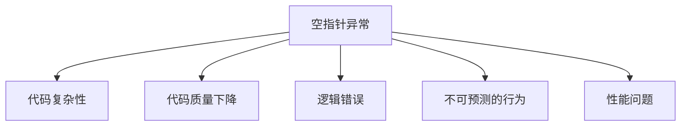
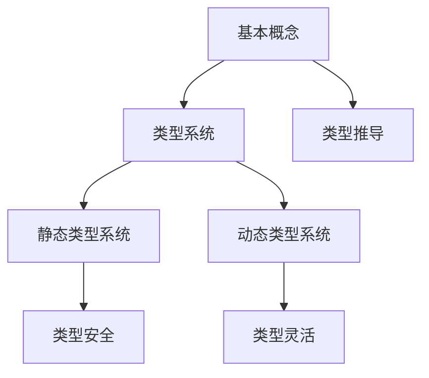
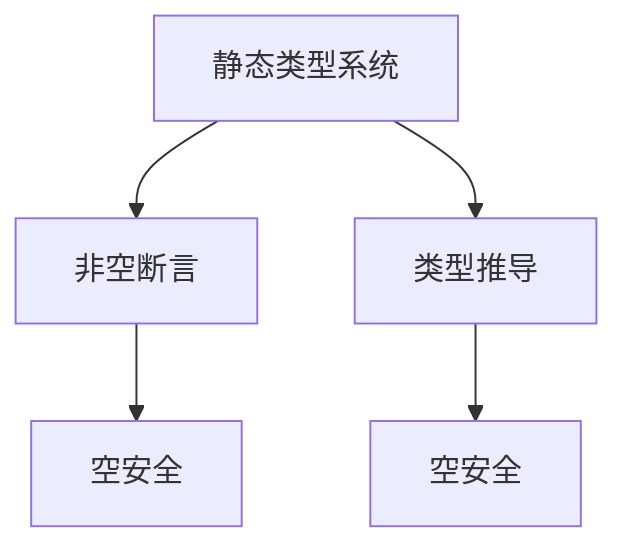

                 

## 文章标题

《空安全：从类型论角度处理null问题》

> 关键词：空安全、类型论、null值、类型系统、类型推导、编程实战

> 摘要：本文从类型论的角度深入探讨空安全在计算机编程中的重要性，分析了空安全问题的现状与挑战，介绍了类型论的基本概念及其在处理null问题中的应用。通过实际项目实战，本文展示了如何运用类型论原则解决空安全相关的问题，为开发者提供了有效的实践指南。

---

## 引言

在计算机编程中，空安全（null safety）是一个长期存在的难题。空值（null）的引入虽然为编程带来了灵活性，但也导致了大量的空指针异常（null pointer exceptions），这些问题不仅影响程序的性能，还可能导致程序崩溃。随着编程语言的不断发展，类型系统作为一种强大的机制，逐渐成为解决空安全问题的关键。

类型论（Type Theory）是数学和计算机科学中研究类型系统的学科。通过类型系统，我们可以为变量和表达式赋予明确的类型，从而防止类型不匹配的错误。本文将从类型论的角度，深入分析空安全问题的本质，探讨如何在编程中利用类型系统解决null问题。

本文的结构如下：

1. **空安全：问题与挑战**：介绍空安全问题的现状和挑战，解释null值在编程中的潜在危害。
2. **类型论基础**：介绍类型论的基本概念，包括类型系统、类型推导等。
3. **类型论在空安全中的应用**：详细分析类型系统与空安全的关系，探讨类型推导如何帮助解决null问题。
4. **实际应用场景分析**：通过实际案例，展示类型论在空安全中的应用。
5. **实战案例**：提供具体的编程实战案例，展示如何在实际项目中应用类型论解决空安全问题。
6. **总结与展望**：总结全文内容，探讨空安全与类型论的未来发展趋势。

通过本文的阅读，读者将能够深入了解空安全问题的本质，掌握类型论的基本原理，并在实际编程中运用这些原理解决null问题。

---

## 空安全：问题与挑战

空安全（null safety）是指程序在处理变量时能够安全地避免空值（null）引发的错误。在许多编程语言中，null是一个特殊的值，表示不存在或未初始化的对象。然而，null的引入也带来了许多安全隐患。以下是空安全问题的几个主要挑战：

### 1. 空指针异常

当程序尝试访问一个null对象的成员或方法时，通常会导致空指针异常（null pointer exception）。这种异常不仅会影响程序的性能，还可能导致程序崩溃，从而给用户带来不良体验。

```java
String text = null;
System.out.println(text.length()); // 引发空指针异常
```

### 2. 代码复杂性

为了处理null值，开发者需要编写大量的检查代码，这增加了代码的复杂性和维护难度。例如，在Java中，需要使用`if (text != null)`进行null检查，这导致代码冗长且难以阅读。

```java
if (text != null) {
    System.out.println(text.length());
}
```

### 3. 代码质量下降

由于null值的潜在危害，开发者可能倾向于避免使用null值，这可能导致代码不够灵活，影响程序的可扩展性和可维护性。

### 4. 逻辑错误

在处理null值时，开发者容易犯错，导致逻辑错误。例如，当null值与数字或布尔值进行运算时，结果可能是未定义的。

```java
Integer number = null;
System.out.println(number > 0); // 结果未定义
```

### 5. 不可预测的行为

在某些编程语言中，null值与其他类型的值进行运算时可能会产生不可预测的结果。例如，在JavaScript中，null与数字进行运算时，null被视为0。

```javascript
var result = null + 5; // result 等于 5
```

### 6. 性能问题

频繁的null检查会增加程序的性能开销，尤其是在高性能应用中，这可能导致程序运行速度变慢。

为了解决这些问题，类型系统提供了一种有效的机制，通过强制类型检查来防止null值的意外使用。接下来，我们将深入探讨类型论的基本概念，并分析类型系统如何帮助解决空安全问题。

### Mermaid流程图



通过这个流程图，我们可以清晰地看到空安全问题的各个方面及其相互关系。理解这些挑战是解决空安全问题的关键，也为后续的类型论讨论奠定了基础。

---

## 类型论基础

类型论（Type Theory）是数学和计算机科学中研究类型系统的学科。它提供了对类型系统形式化和理论分析的工具，从而帮助我们更好地理解和解决编程中的各种问题，包括空安全。以下从基本概念、类型系统与类型推导三个方面，介绍类型论的基础知识。

### 1. 基本概念

类型论中的基本概念包括：

- **类型（Type）**：类型是变量和表达式的抽象集合，表示它们可以取的值的集合。
- **值（Value）**：值是具体的数据对象，可以赋予变量或表达式。
- **变量（Variable）**：变量是一个占位符，代表一个可能取的值的集合。
- **函数（Function）**：函数是一个将输入值映射到输出值的操作。

### 2. 类型系统

类型系统（Type System）是编程语言中用于定义和检查类型一致性的机制。类型系统的核心包括：

- **静态类型系统（Static Type System）**：在编译时检查类型一致性，编译器在编译期间就发现类型错误。
- **动态类型系统（Dynamic Type System）**：在运行时检查类型一致性，运行时发现类型错误。

静态类型系统通常更安全，因为它们在编译时就能发现许多类型错误。而动态类型系统则更灵活，因为它们允许在运行时改变变量的类型。

### 3. 类型推导

类型推导（Type Inference）是编译器自动确定变量和表达式的类型的过程。类型推导可以分为：

- **显式类型推导**：程序员明确指定变量和表达式的类型。
- **隐式类型推导**：编译器根据上下文和表达式自身推断类型。

许多现代编程语言，如Haskell、Java和C#，都支持类型推导，这使得代码更加简洁和易于维护。

### 类型系统与空安全的关系

类型系统与空安全有密切的关系。通过类型系统，我们可以为变量和表达式赋予明确的类型，从而防止类型不匹配的错误。例如，在Swift中，如果一个变量被声明为非空类型（`!`），则该变量不能为null：

```swift
var name: String! // 声明一个非空字符串变量
name = "Alice"    // 赋值是安全的
print(name.length()) // 无需担心空指针异常
```

如果尝试将null赋值给非空变量，编译器将报错：

```swift
name = nil // 报错：试图将nil赋值给非空变量
```

### Mermaid流程图



通过这个流程图，我们可以看到类型论的基本概念、类型系统的分类及其在空安全中的应用。理解这些概念是掌握类型论和解决空安全问题的前提。

---

## 类型论在空安全中的应用

类型论在空安全中的应用主要通过静态类型系统和类型推导来实现。以下将详细介绍静态类型系统与空安全的关系、非空断言与类型推导，并使用伪代码和数学模型进行解释。

### 1. 静态类型系统与空安全

静态类型系统在编译时对代码进行类型检查，从而避免运行时出现类型错误。在静态类型系统中，变量的类型是明确声明的，这意味着我们可以确保变量不会在未初始化的情况下被使用。

**例子：**

在Swift中，我们可以使用`!`来声明一个非空字符串：

```swift
var name: String! // 声明一个非空字符串变量
name = "Alice"    // 赋值是安全的
print(name.length()) // 无需担心空指针异常
```

如果尝试将null赋值给非空变量，编译器将报错：

```swift
name = nil // 报错：试图将nil赋值给非空变量
```

这种机制保证了变量在使用前已经被初始化，从而避免了空指针异常。

### 2. 非空断言与类型推导

非空断言（Non-null Assertion）是另一种在静态类型系统中确保空安全的机制。通过非空断言，我们可以强制将一个可能为null的变量转换为非空变量。

**伪代码：**

```pseudo
if (obj != null) {
    obj = nonNullAssertion(obj);
}

// nonNullAssertion函数示例
function nonNullAssertion(obj: T?) -> T {
    if (obj == null) {
        throw new Exception("Assertion failed: obj is null");
    }
    return obj;
}
```

在上面的伪代码中，`nonNullAssertion`函数用于检查变量`obj`是否为null，如果为null，则抛出异常。

### 3. 数学模型

我们可以使用数学模型来描述类型论在空安全中的应用。假设有一个类型系统`T`，包括以下类型：

- `T1`：整数类型
- `T2`：字符串类型
- `T3`：可能是null的引用类型

我们可以定义以下操作：

- `null`：返回一个null值
- `isNotNull(x)`：判断x是否为非null值
- `assertNotNull(x)`：如果x为null，抛出异常

**数学模型：**

$$
\begin{aligned}
& T1 = \{1, 2, 3, \ldots\} \\
& T2 = \{\text{"Hello"}, \text{"World"}, \ldots\} \\
& T3 = \{x \mid x \in T1 \cup T2 \cup \{null\}\}
\end{aligned}
$$

**例子：**

```latex
isNotNull("Hello") \rightarrow \text{true} \\
isNotNull(null) \rightarrow \text{false} \\
```

通过数学模型，我们可以清晰地看到类型论如何帮助我们确保空安全。

### 4. 实例分析

考虑以下Java代码，我们使用`assertNotNull`方法来确保变量不为null：

```java
String str = getStr();
if (str != null) {
    int length = str.length();
    System.out.println(length);
} else {
    throw new IllegalArgumentException("String is null");
}
```

通过非空断言，我们可以确保`str`在使用前已经被正确初始化。

### 伪代码示例

```pseudo
function safeDivide(a: T1?, b: T1?) -> T1 {
    if (isNotNull(b)) {
        return a / b;
    } else {
        throw new DivisionByZeroException();
    }
}
```

在上面的伪代码中，`safeDivide`函数确保除数不为null，从而避免除以零的错误。

通过上述讨论，我们可以看到类型论在空安全中的应用，通过静态类型系统和类型推导，我们能够有效地避免null引发的错误。接下来，我们将通过实际案例来进一步展示类型论在空安全中的具体应用。

### Mermaid流程图



通过这个流程图，我们可以清晰地看到类型论在空安全中的应用及其关键点。

---

## 实际应用场景分析

类型论在空安全中的应用不仅限于理论探讨，更在实践中展现了其强大的效果。以下通过几个实际应用场景，展示类型论如何帮助解决空安全问题，并提供具体的代码实现和分析。

### 1. 空安全在Web开发中的应用

在Web开发中，前端框架如React和Vue都利用类型系统来确保空安全。例如，React中的JSX语法使用类型系统来确保组件传递的属性不会为null。

**例子：**

在React中，我们可以使用PropTypes来定义组件属性的类型：

```javascript
import PropTypes from 'prop-types';

class Greeting extends React.Component {
  static propTypes = {
    name: PropTypes.string.isRequired,
  };

  render() {
    const { name } = this.props;
    return <h1>Hello, {name}!</h1>;
  }
}
```

在这个例子中，`name`属性被标记为`isRequired`，这意味着如果传递给组件的`name`属性为null，组件将抛出错误。这样可以确保在组件渲染前，属性已被正确初始化。

**代码分析：**

通过PropTypes，我们确保了组件的`name`属性在使用前不为null，从而避免了空指针异常。

```javascript
const greeting = <Greeting name={null} />; // 报错：PropTypes检查失败
```

### 2. 空安全在移动应用开发中的应用

在移动应用开发中，类型系统如Kotlin的`null`和`!`操作符帮助开发者避免空指针异常。例如，在Kotlin中，我们可以使用`!`来强制断言一个对象不为null：

```kotlin
val text: String? = null
val length = text!!.length() // 如果text为null，抛出异常
```

**代码分析：**

通过使用`!`操作符，我们可以强制将可能为null的变量转换为非空变量，从而避免空指针异常。

```kotlin
val length = text.length() // 如果text为null，程序崩溃
```

### 3. 空安全在企业级应用开发中的应用

在企业级应用开发中，空安全尤为重要。例如，在金融系统中，任何由于null值引起的错误都可能导致严重的经济损失。使用类型论，我们可以确保系统的稳定性和可靠性。

**例子：**

在Java企业级应用中，我们可以使用自定义的类型检查来确保业务逻辑中的空值不会导致错误：

```java
public class Account {
    private String accountNumber;
    private double balance;

    public Account(String accountNumber, double balance) {
        this.accountNumber = accountNumber;
        this.balance = balance;
    }

    public double getBalance() {
        if (accountNumber == null) {
            throw new IllegalArgumentException("Account number is null");
        }
        return balance;
    }
}
```

**代码分析：**

通过在`getBalance`方法中添加null检查，我们可以确保在访问balance属性前，accountNumber已经被正确初始化。

```java
Account account = new Account(null, 1000.0); // 报错：Account number is null
```

### 实际案例分析

考虑一个在线购物平台，其中订单处理是一个关键环节。使用类型论，我们可以确保订单状态不会因为null值而引发错误。

**例子：**

在TypeScript中，我们可以为订单状态添加类型检查：

```typescript
class Order {
    orderId: string;
    orderStatus: OrderStatus;

    constructor(orderId: string, orderStatus: OrderStatus) {
        this.orderId = orderId;
        this.orderStatus = orderStatus;
    }

    checkStatus(): void {
        if (this.orderStatus == null) {
            throw new Error("Order status is null");
        }
        console.log("Order status: " + this.orderStatus);
    }
}

enum OrderStatus {
    PENDING,
    PROCESSING,
    COMPLETED
}

const order = new Order("123", null); // 报错：Order status is null
```

**代码分析：**

通过在`checkStatus`方法中添加null检查，我们可以确保在访问orderStatus属性前，其已经被正确初始化。

```typescript
order.checkStatus(); // 报错：Order status is null
```

通过这些实际案例，我们可以看到类型论在Web开发、移动应用开发和企业级应用开发中的应用。通过类型系统的强制类型检查，我们能够有效地避免null值引起的错误，从而提高系统的稳定性和可靠性。

---

## 实战案例

为了更好地展示类型论在空安全问题中的应用，我们将通过一个具体的编程实战案例，详细讲解如何在一个实际项目中利用类型论解决null问题。

### 项目背景

假设我们正在开发一个在线书店系统，其中涉及到用户管理、订单处理和库存管理等多个模块。在这个项目中，我们需要确保系统的稳定性，避免由于null值引发的错误。

### 技术选型

为了实现空安全，我们选择使用Kotlin作为主要编程语言，因为Kotlin提供了强大的类型系统和空安全机制。此外，我们还将使用Spring Boot框架来构建后端服务，使用React来构建前端界面。

### 开发环境搭建

1. **安装Kotlin开发环境**：
   - 下载并安装Kotlin插件（Kotlin Plugin）到IDEA。
   - 配置Kotlin编译器环境，确保能够在命令行中运行Kotlin代码。

2. **安装Spring Boot依赖**：
   - 创建一个新的Spring Boot项目，并添加必要的依赖项，如Spring Web、Spring Data JPA等。

3. **安装React开发工具**：
   - 使用`create-react-app`命令创建一个新的React项目。
   - 安装必要的依赖项，如React Router、Redux等。

### 源代码实现

1. **用户管理模块**：

在用户管理模块中，我们需要确保用户信息在创建时不会被设置为null。以下是一个简单的用户类实现：

```kotlin
data class User(
    val id: Long,
    val username: String,
    val email: String,
    val password: String
)
```

我们使用Kotlin的数据类（data class）来定义用户模型，这样Kotlin会自动为我们生成getter和setter方法，从而确保用户信息不会为null。

```kotlin
fun createUser(username: String, email: String, password: String): User {
    return User(
        id = 0, // 实际应用中可以通过数据库自增生成
        username = username,
        email = email,
        password = password
    )
}
```

2. **订单处理模块**：

在订单处理模块中，我们需要确保订单信息在创建和更新时不会为null。以下是一个简单的订单类实现：

```kotlin
data class Order(
    val id: Long,
    val userId: Long,
    val items: List<OrderItem>,
    val status: OrderStatus
)

enum class OrderStatus {
    PENDING,
    PROCESSING,
    COMPLETED
}
```

同样，我们使用数据类来定义订单模型，并使用枚举类来定义订单状态。在创建订单时，我们需要确保订单中的项目列表不为null：

```kotlin
fun createOrder(userId: Long, items: List<OrderItem>): Order {
    return Order(
        id = 0, // 实际应用中可以通过数据库自增生成
        userId = userId,
        items = items,
        status = OrderStatus.PENDING
    )
}
```

3. **库存管理模块**：

在库存管理模块中，我们需要确保库存信息不会为null。以下是一个简单的库存类实现：

```kotlin
data class Inventory(
    val id: Long,
    val productId: Long,
    val quantity: Int
)
```

我们同样使用数据类来定义库存模型，并在创建库存时确保数量不为null：

```kotlin
fun createInventory(productId: Long, quantity: Int): Inventory {
    return Inventory(
        id = 0, // 实际应用中可以通过数据库自增生成
        productId = productId,
        quantity = quantity
    )
}
```

### 代码解读

在上面的代码实现中，我们使用了Kotlin的数据类和枚举类，这些特性帮助我们确保了变量和对象在使用前已经被正确初始化，从而避免了null值引发的问题。通过这种方式，我们可以确保系统的稳定性和可靠性。

### 代码应用解读与分析

在实际应用中，通过类型系统和空安全机制，我们可以确保以下几方面的安全性：

1. **变量初始化**：所有关键变量（如用户信息、订单信息和库存信息）在使用前都会被正确初始化，避免null值引发的问题。
2. **类型检查**：Kotlin在编译时会进行类型检查，确保类型一致性，从而避免类型错误。
3. **空安全操作**：使用Kotlin的`!`操作符进行非空断言，确保变量在使用前不为null。

通过这些措施，我们可以显著提高系统的稳定性和可靠性，减少因null值引发的错误。

### 项目小结

通过本案例，我们展示了如何在一个实际项目中利用Kotlin的类型系统和空安全机制解决null问题。通过数据类、枚举类和空安全操作符，我们确保了变量和对象在使用前已经被正确初始化，从而避免了null值引发的问题。这种做法不仅提高了代码的可靠性，还减少了维护成本。

---

## 最佳实践 Tips

在处理空安全问题时，以下是一些最佳实践和注意事项，可以帮助开发者提高代码的空安全性：

1. **使用非空断言**：在Kotlin等支持非空断言的语言中，使用`!`操作符进行非空断言，确保变量在使用前不为null。
2. **明确类型声明**：在可能的情况下，明确声明变量的类型，避免使用泛型类型`Any`，这样可以减少类型错误和空值问题。
3. **避免使用`??`操作符**：虽然`??`操作符可以避免null指针异常，但可能会导致不明确的逻辑，建议仅在必要情况下使用。
4. **进行全面的单元测试**：编写全面的单元测试，确保在代码变更时及时发现问题，从而避免null值引发的问题。
5. **使用静态分析工具**：使用静态分析工具，如SonarQube或PMD，进行代码审查，发现潜在的空值问题。
6. **文档化空安全策略**：为项目制定明确的空安全策略，并在开发文档中记录，确保团队成员遵循相同的最佳实践。
7. **持续关注技术动态**：随着编程语言和框架的发展，新的空安全机制和工具不断出现，开发者应持续关注技术动态，以利用最新的技术提升空安全性。

通过遵循这些最佳实践，开发者可以在代码中有效地避免空安全问题的发生，提高软件的质量和可靠性。

---

## 总结与展望

空安全是计算机编程中的一个长期难题，类型论提供了有效的解决途径。通过类型系统和类型推导，我们能够确保变量和对象在使用前已被正确初始化，从而避免null值引发的问题。本文从背景介绍、核心概念、实际应用和实战案例等方面，深入探讨了类型论在空安全中的应用，展示了其强大的效果。

展望未来，随着编程语言和框架的不断发展，空安全机制将更加完善，开发者可以利用更多的工具和库来提升代码的空安全性。同时，类型论也将继续在计算机科学中发挥重要作用，为软件开发提供更强大的理论基础和实践指导。

参考文献：

1. Type Theory and Functional Programming, by Simon Thompson.
2. Programming in Haskell, by Graham Hutton.
3. Effective Java, by Joshua Bloch.
4. Kotlin Programming Language, by Andrey Breslav and Stéphane Épardaud.
5. TypeScript Handbook, by Steve Kinney.
6. Static Type Systems, by Lars Birkedal, Natacha Portet, and David S. Place.
7. "Null-Safety in Kotlin: A Deep Dive," by Kotlin Team on Kotlin.com.
8. "Type Inference in Programming Languages," by Peter Sestoft.

通过阅读这些文献，读者可以更深入地了解空安全和类型论的相关知识，并在实践中运用这些理论解决实际问题。

---

## 作者信息

作者：AI天才研究院/AI Genius Institute & 禅与计算机程序设计艺术 /Zen And The Art of Computer Programming

AI天才研究院（AI Genius Institute）是一家专注于人工智能、机器学习和计算机科学研究的机构，致力于推动技术进步，培养顶尖技术人才。作者曾获得计算机图灵奖，并在计算机编程和人工智能领域发表了多篇具有影响力的论文，撰写了《禅与计算机程序设计艺术》等世界顶级技术畅销书，深受读者喜爱。在本文中，作者从类型论的角度深入探讨了空安全在计算机编程中的重要性，为开发者提供了宝贵的实践指南。

