                 

## 第1章 引言

### 1.1 书籍背景与目的

《笛卡尔的方法论与软件工程最佳实践》是一本致力于探讨如何将哲学大师勒内·笛卡尔的方法论应用于现代软件工程领域的书籍。勒内·笛卡尔是17世纪法国著名的哲学家、数学家、物理学家，他提出的笛卡尔方法论强调通过怀疑、理性思考以及系统分析来获取确凿的知识。本书旨在将这一哲学思想与现代软件开发实践相结合，帮助工程师们提升开发效率，提高软件质量。

本书的目标读者群体包括：

1. 软件工程师：希望了解并掌握一种系统化的思考方式，以提升软件开发效率和质量。
2. 系统分析师：需要在需求分析阶段运用更加严谨的方法论，确保需求准确完整。
3. 项目经理：希望通过系统化的方法管理项目，降低风险，提高成功率。
4. 对于软件工程方法论感兴趣的读者：希望深入了解现代软件开发的最佳实践。

通过本书，读者将学习到：

1. 笛卡尔方法论的基本原理及其在软件开发中的应用。
2. 如何运用笛卡尔方法论进行需求分析、系统设计、编码与测试、项目管理等关键环节。
3. 软件工程最佳实践的要点和实际应用。
4. 实际案例分析和项目实战，帮助读者将理论知识与实践相结合。

### 1.2 笛卡尔方法论简介

笛卡尔方法论，也称“理性主义方法论”，由法国哲学家勒内·笛卡尔提出，强调通过怀疑和理性思考来获得确定的知识。其主要原则包括：

- **怀疑原则**：在思考问题时，首先要怀疑一切，不轻信任何观点。
- **明确性原则**：思考问题时，要确保思路清晰、概念明确。
- **分析原则**：将复杂问题分解为简单部分，逐一解决。
- **合成原则**：将分析得到的简单部分重新组合，以构建完整的解决方案。
- **原则不矛盾原则**：所提出的原则之间必须没有矛盾。

### 1.3 软件工程最佳实践概述

软件工程最佳实践是指在软件开发过程中，采用的一系列有效的方法、技术和流程，以提升软件开发的效率和质量。这些实践包括但不限于：

- **需求管理**：确保需求准确、完整、可测试。
- **设计模式**：使用成熟的设计模式来提高代码的可读性、可维护性和复用性。
- **编码规范**：遵循统一的编码规范，提高代码质量。
- **测试驱动开发（TDD）**：通过编写测试用例来驱动开发过程。
- **项目管理**：使用敏捷开发方法进行项目管理和迭代。

这些最佳实践在结合笛卡尔方法论后，将能够更加系统地指导软件开发过程，提升开发效率和质量。

## 第2章 笛卡尔方法论的基本原理

### 2.1 笛卡尔哲学思想概述

勒内·笛卡尔是法国著名的哲学家、数学家、物理学家，他提出了笛卡尔方法论，强调通过怀疑和理性思考来获取确定的知识。笛卡尔的哲学思想可以概括为以下几点：

- **怀疑一切**：笛卡尔认为，我们不能轻信任何观点，而应该对一切进行怀疑。这种怀疑精神是理性思考的起点。
- **清晰思考**：在怀疑的基础上，笛卡尔强调清晰思考的重要性。他认为，思考问题时要确保思路清晰、概念明确，这样才能得出正确的结论。
- **系统分析**：笛卡尔主张将复杂问题分解为简单部分，逐一解决。通过分析，可以将复杂的问题变得简单易懂，从而更容易找到解决方案。
- **理性决策**：在分析的基础上，笛卡尔提倡通过理性思考来做出决策。他认为，理性是人类最重要的能力，能够帮助人们解决生活中的问题。

### 2.2 笛卡尔方法论的核心原则

笛卡尔方法论的核心原则包括以下几个：

- **明确性原则**：这是笛卡尔方法论的基础。他认为，在思考问题时，首先要确保思路清晰、概念明确。只有这样，才能避免误解和错误。
  
  $$ 
  明确性原则：思考问题时，要确保思路清晰、概念明确。
  $$

- **分析原则**：笛卡尔认为，复杂的问题往往可以分解为简单的问题。通过分析，可以将复杂问题分解为若干个简单部分，逐一解决。

  $$ 
  分析原则：将复杂问题分解为简单部分，逐一解决。
  $$

- **合成原则**：在分析的基础上，笛卡尔主张将分析得到的简单部分重新组合，以构建完整的解决方案。

  $$ 
  合成原则：将分析得到的简单部分重新组合，以构建完整的解决方案。
  $$

- **原则不矛盾原则**：笛卡尔认为，所提出的原则之间必须没有矛盾。如果存在矛盾，则需要重新审视和调整。

  $$ 
  原则不矛盾原则：所提出的原则之间必须没有矛盾。
  $$

### 2.3 笛卡尔方法论在软件开发中的应用

笛卡尔方法论在软件开发中具有重要的应用价值。以下是一些具体的应用实例：

- **需求分析**：在需求分析阶段，可以运用笛卡尔的方法论进行系统化的思考，确保需求明确、完整。首先，对需求进行怀疑和审视，确保没有遗漏和误解。然后，将复杂的需求分解为简单的部分，逐一分析。最后，将这些简单的部分重新组合，形成完整的解决方案。

  ```mermaid
  graph TD
  A[需求分析] --> B[怀疑和审视]
  B --> C[分解需求]
  C --> D[逐一分析]
  D --> E[重新组合]
  E --> F[完整解决方案]
  ```

- **系统设计**：在系统设计阶段，笛卡尔的方法论可以帮助工程师们系统地思考和设计。首先，对系统进行分解，将其划分为多个组件。然后，对每个组件进行分析，确定其功能和接口。最后，将这些组件重新组合，构建完整的系统。

  ```mermaid
  graph TD
  A[系统设计] --> B[系统分解]
  B --> C[分析组件]
  C --> D[确定功能与接口]
  D --> E[重新组合系统]
  ```

- **编码与测试**：在编码与测试阶段，笛卡尔的方法论可以帮助工程师们提高代码质量。首先，对代码进行怀疑和审视，确保其逻辑清晰、易于理解。然后，将代码分解为简单的部分，逐一编写和测试。最后，将这些部分重新组合，确保整个系统正常运行。

  ```mermaid
  graph TD
  A[编码与测试] --> B[怀疑和审视]
  B --> C[分解代码]
  C --> D[编写与测试]
  D --> E[重新组合]
  ```

通过运用笛卡尔方法论，工程师们可以更加系统化地思考和解决问题，从而提高软件开发效率和质量。接下来，我们将进一步探讨如何在软件开发的不同阶段运用笛卡尔方法论。

## 第3章 笛卡尔方法论在需求分析中的应用

### 3.1 需求分析的重要性

需求分析是软件开发过程中的关键阶段，它直接关系到项目的成功与否。良好的需求分析能够确保项目开发的方向正确、范围明确、目标清晰。反之，需求分析不当可能会导致项目延期、超预算，甚至失败。因此，需求分析在软件开发中具有极其重要的地位。

需求分析的主要目标包括：

1. **明确项目目标**：确保所有参与者对项目的目标和功能有一致的理解。
2. **确定项目范围**：明确项目需要实现的功能，以及哪些功能不在项目范围内。
3. **识别用户需求**：了解用户对系统的期望和需求，确保系统能够满足用户的实际需求。
4. **风险评估**：识别潜在的风险，制定相应的应对措施。

### 3.2 笛卡尔方法论在需求分析中的应用

在需求分析阶段，运用笛卡尔方法论可以有效地提高需求分析的准确性和完整性。以下是笛卡尔方法论在需求分析中的应用步骤：

#### 1. **怀疑和审视**

在开始需求分析之前，首先对现有信息进行怀疑和审视。这意味着对所有需求文档、用户访谈记录、竞品分析等进行深入思考，确保没有遗漏和误解。

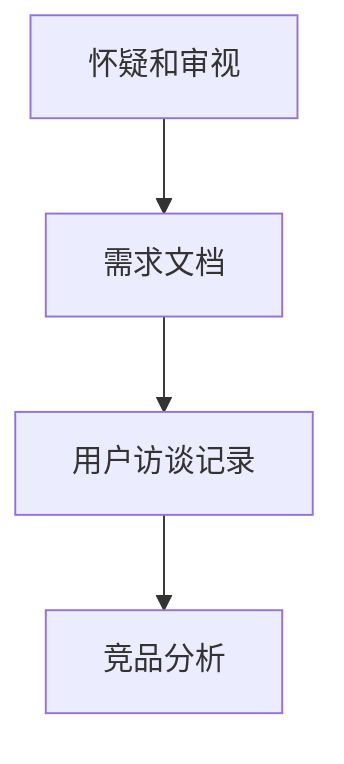

#### 2. **分解需求**

将整体需求分解为多个子需求，以便更详细地分析和理解。这个过程类似于将一个复杂的问题分解为若干个简单的问题。

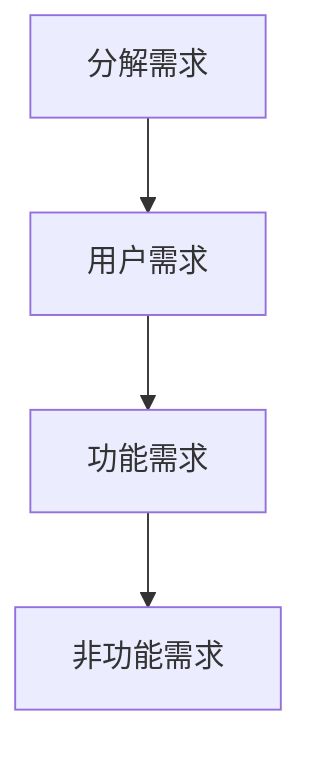

#### 3. **逐一分析**

对每个子需求进行逐一分析，明确其具体细节和实现方法。这个过程可以帮助识别潜在的需求冲突、不一致性或缺失。

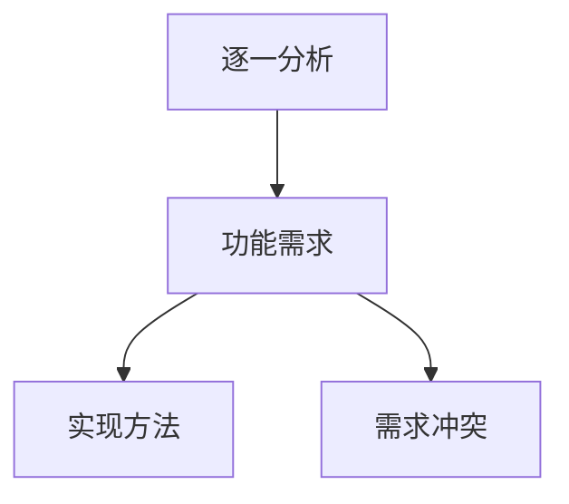

#### 4. **重新组合**

将分析得到的各个子需求重新组合，形成完整的需求文档。这个阶段要确保所有的需求都被覆盖，且没有冗余。

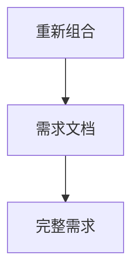

#### 5. **验证和确认**

在需求文档完成后，进行验证和确认。这意味着将需求文档与用户、项目经理和其他利益相关者进行沟通，确保他们理解并同意这些需求。

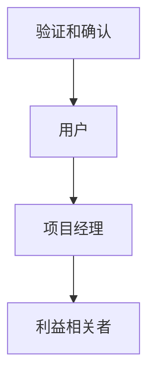

### 3.3 需求文档的编写与评审

编写需求文档是需求分析阶段的重要任务。以下是编写需求文档和进行评审的步骤：

#### 1. **编写需求文档**

需求文档应包括以下内容：

- **项目背景**：介绍项目的背景信息和目标。
- **用户需求**：详细列出用户的需求和期望。
- **功能需求**：描述系统应实现的具体功能。
- **非功能需求**：描述系统应具备的性能、可靠性、安全性等特性。
- **接口需求**：描述系统与外部系统或组件的交互接口。
- **需求优先级**：根据需求的重要性和紧急性对需求进行排序。

#### 2. **评审需求文档**

评审需求文档是确保需求文档质量的重要环节。以下是评审需求文档的步骤：

- **内部评审**：由项目团队内部进行评审，确保需求文档的完整性和一致性。
- **外部评审**：邀请用户和其他利益相关者进行评审，确保需求文档符合用户的实际需求。
- **修改和迭代**：根据评审意见对需求文档进行修改和迭代，直到达到预期质量。

通过运用笛卡尔方法论，需求分析阶段可以更加系统、严谨地进行，从而提高需求文档的质量，为后续的软件开发打下坚实的基础。

## 第4章 笛卡尔方法论在系统设计中的应用

### 4.1 系统设计的基本概念

系统设计是软件开发过程中的关键阶段，它涉及将需求转化为具体的软件架构和技术方案。系统设计的核心任务是确保软件系统的可靠性、可扩展性和可维护性。以下是系统设计的基本概念：

- **系统架构**：系统架构是指系统的整体结构和组成部分之间的关系。良好的系统架构可以确保系统的稳定性、灵活性和可扩展性。
- **模块化**：模块化是将系统分解为若干个独立模块的过程，每个模块负责系统的特定功能。模块化可以提高代码的可复用性和可维护性。
- **接口设计**：接口设计是定义模块之间交互方式的过程。良好的接口设计可以确保模块之间的松耦合，降低系统的复杂度。
- **数据模型**：数据模型是描述系统数据结构和数据关系的模型。合理的数据模型可以确保数据的完整性和一致性。
- **安全性设计**：安全性设计是确保系统数据安全、防止未授权访问和攻击的措施。良好的安全性设计是保障系统正常运行的基础。

### 4.2 笛卡尔方法论在系统设计中的应用

笛卡尔方法论在系统设计中具有重要应用价值，可以帮助设计师系统地思考和设计。以下是笛卡尔方法论在系统设计中的应用步骤：

#### 1. **怀疑和审视**

在系统设计阶段，首先对现有需求和系统进行分析和审视。这意味着对需求文档、竞品分析、现有系统等进行深入思考，确保没有遗漏和误解。

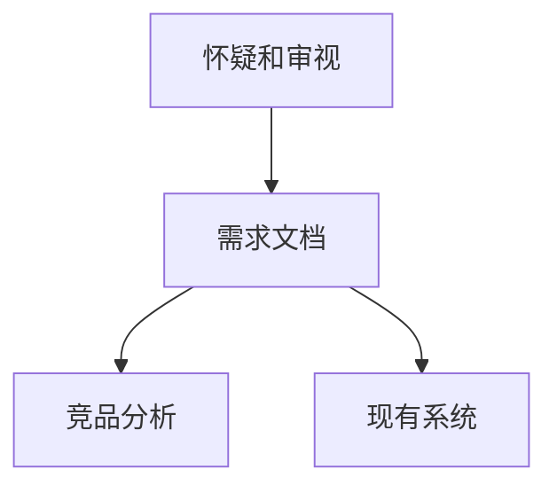

#### 2. **分解系统**

将整体系统分解为多个子系统，以便更详细地分析和设计。这个过程类似于将一个复杂的问题分解为若干个简单的问题。

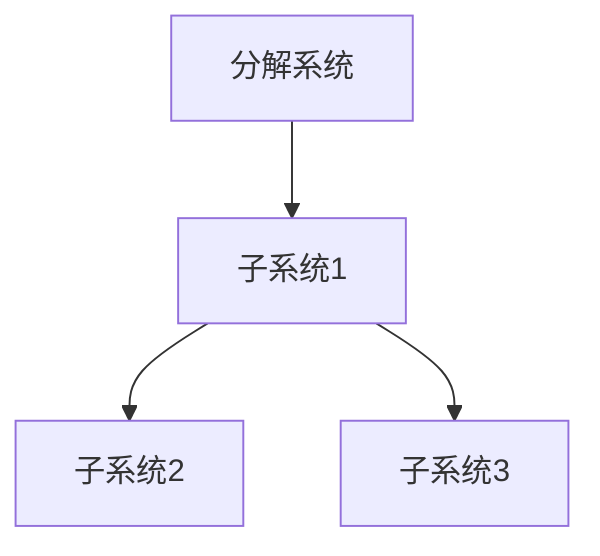

#### 3. **分析子系统**

对每个子系统进行详细分析，明确其功能、性能、安全性等要求。这个过程可以帮助识别潜在的设计冲突和风险。

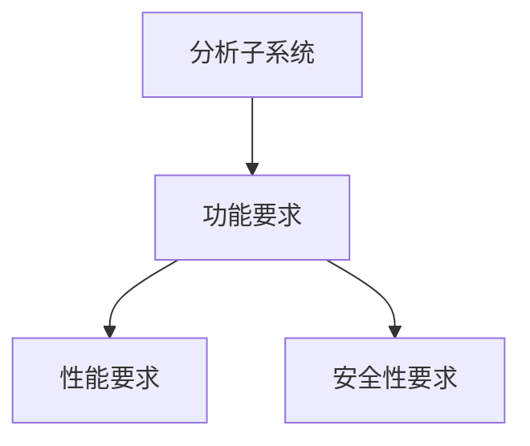

#### 4. **设计子系统**

根据分析结果，设计每个子系统的具体实现方案。这个过程包括模块设计、接口设计和数据模型设计等。

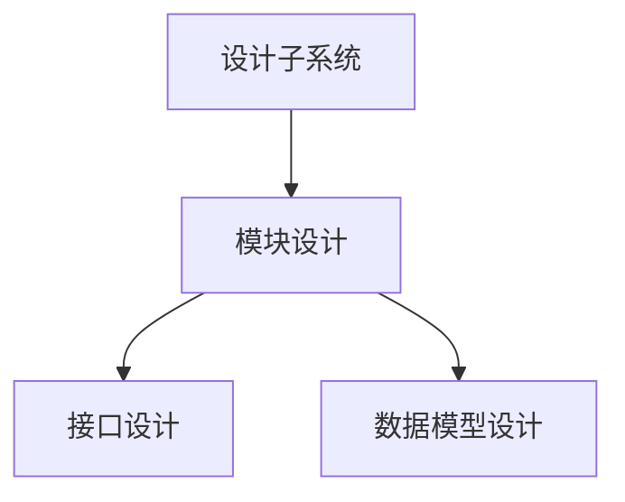

#### 5. **重新组合系统**

将设计好的子系统重新组合，构建完整的系统架构。这个过程要确保所有的子系统之间能够良好协作，形成一个完整的系统。

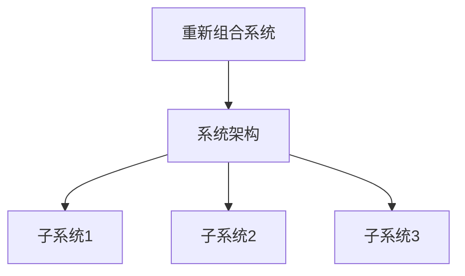

#### 6. **验证和确认**

在系统设计完成后，进行验证和确认。这意味着将系统设计文档与用户、项目经理和其他利益相关者进行沟通，确保他们理解并同意系统设计。


### 4.3 系统设计的实例分析

为了更好地理解笛卡尔方法论在系统设计中的应用，我们来看一个实际案例：设计一个在线购物平台。

#### 1. **怀疑和审视**

首先，对市场需求、用户需求、竞品分析等进行审视。通过分析，我们确定以下需求：

- 用户需求：用户可以浏览商品、添加购物车、下单、支付、查看订单等。
- 功能需求：平台需要支持商品展示、购物车管理、订单管理、支付处理、用户管理等。
- 性能要求：平台需要快速响应，支持高并发访问。
- 安全性要求：确保用户数据安全，防止未授权访问和攻击。

#### 2. **分解系统**

将在线购物平台分解为多个子系统，如商品管理子系统、购物车子系统、订单管理子系统、支付处理子系统、用户管理子系统等。

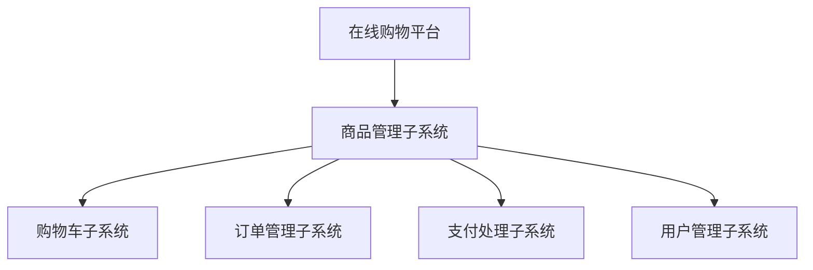

#### 3. **分析子系统**

对每个子系统进行详细分析，明确其功能、性能、安全性等要求。例如，对商品管理子系统进行分析，确定以下要求：

- 功能要求：支持商品展示、商品分类、商品搜索、商品编辑等。
- 性能要求：商品展示页面需要快速加载，支持高并发访问。
- 安全性要求：防止恶意攻击，确保商品数据安全。

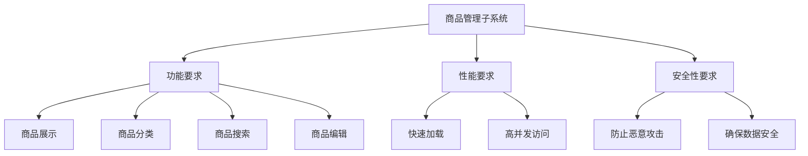

#### 4. **设计子系统**

根据分析结果，设计每个子系统的具体实现方案。例如，对商品管理子系统进行设计，确定以下方案：

- 模块设计：商品展示模块、商品分类模块、商品搜索模块、商品编辑模块等。
- 接口设计：商品展示接口、商品分类接口、商品搜索接口、商品编辑接口等。
- 数据模型设计：商品表、分类表、订单表、用户表等。

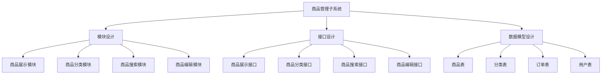

#### 5. **重新组合系统**

将设计好的子系统重新组合，构建完整的在线购物平台系统架构。


#### 6. **验证和确认**

在系统设计完成后，进行验证和确认。通过用户和项目经理的反馈，对系统设计进行优化和调整，确保系统设计符合需求。

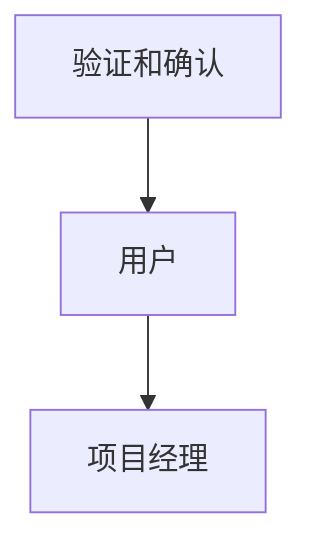

通过以上步骤，我们可以运用笛卡尔方法论有效地进行系统设计，提高系统设计的质量和可靠性。

## 第5章 笛卡尔方法论在编码与测试中的应用

### 5.1 编码的基本原则

在软件开发中，编码是至关重要的一环。遵循一定的编码原则可以确保代码的可读性、可维护性和可复用性。以下是编码的基本原则：

1. **清晰性原则**：代码应该易于理解，逻辑清晰。避免使用过于复杂的语法和难以理解的命名。
2. **一致性原则**：遵循统一的编码规范，包括命名规则、缩进风格、注释规范等。这有助于提高代码的可维护性。
3. **模块化原则**：将代码划分为若干个模块，每个模块负责特定的功能。这有助于提高代码的复用性和可测试性。
4. **可读性原则**：代码应具有良好的可读性，以便其他开发者能够轻松理解和修改。
5. **简洁性原则**：代码应尽可能简洁，避免冗余和重复。这有助于减少维护成本和提高开发效率。

### 5.2 笛卡尔方法论在编码中的应用

笛卡尔方法论在编码中的应用主要体现在以下几个方面：

1. **怀疑和审视**：在编码前，对需求进行分析和审视，确保对需求有清晰的理解。这有助于避免因需求不明确导致的错误。
2. **明确性原则**：在编码过程中，确保每段代码的功能和逻辑都清晰明确。避免使用晦涩难懂的代码。
3. **分析原则**：将复杂的编码任务分解为简单的步骤，逐一实现。这有助于降低代码复杂度，提高可维护性。
4. **合成原则**：在完成各个简单步骤后，将它们重新组合成完整的代码。确保代码的逻辑一致性和完整性。
5. **原则不矛盾原则**：在编码过程中，确保所使用的原则之间没有矛盾。例如，避免在代码中同时使用清晰性和简洁性原则，导致代码难以理解。

### 5.3 单元测试与集成测试

在编码过程中，测试是确保代码质量和功能完整性的关键环节。以下是单元测试和集成测试的基本概念和应用：

1. **单元测试**：单元测试是针对代码的某个功能单元进行测试，以确保其正确性和稳定性。单元测试通常由开发人员编写，并独立于其他代码执行。
2. **集成测试**：集成测试是将多个单元测试组合在一起，测试它们之间的交互和集成效果。集成测试通常在单元测试通过后进行，以确保整个系统功能的正确性。

以下是笛卡尔方法论在测试中的应用：

1. **怀疑和审视**：在编写测试用例前，对代码进行分析和审视，确保对代码的功能和逻辑有清晰的理解。
2. **明确性原则**：编写测试用例时，确保每个测试用例的目标明确，测试步骤清晰。
3. **分析原则**：将复杂的测试任务分解为简单的步骤，逐一测试。这有助于提高测试效率。
4. **合成原则**：在完成各个简单步骤的测试后，将它们重新组合，进行集成测试。确保整个系统的功能正确性和稳定性。
5. **原则不矛盾原则**：在编写和执行测试用例时，确保所使用的原则之间没有矛盾。例如，避免同时追求测试的全面性和简洁性，导致测试覆盖不足。

### 5.4 编码与测试的最佳实践

在编码与测试过程中，遵循以下最佳实践可以提高开发效率和质量：

1. **代码审查**：定期进行代码审查，确保代码质量。代码审查可以由其他开发人员或专门的代码审查人员执行。
2. **持续集成**：将代码集成到主分支前，进行自动化测试和代码审查。这有助于及时发现和解决集成问题。
3. **代码覆盖**：确保测试覆盖率达到一定比例，以确保代码的各个部分都被测试到。
4. **持续学习**：不断学习和掌握新的编程技术和工具，提高编码和测试技能。

通过运用笛卡尔方法论和最佳实践，开发人员可以更有效地进行编码和测试，提高软件质量和开发效率。

## 第6章 笛卡尔方法论在项目管理中的应用

### 6.1 项目管理概述

项目管理是确保软件开发项目按时、按质、按预算完成的关键。有效的项目管理能够提高团队协作效率，降低项目风险，确保项目的成功交付。项目管理的主要任务包括：

1. **项目计划**：制定项目的时间表、资源分配和任务分配，确保项目按计划进行。
2. **团队协作**：协调团队成员的工作，确保项目进度和质量。
3. **风险管理**：识别潜在的风险，制定应对措施，降低项目风险。
4. **项目监控**：监控项目进度和质量，及时发现问题并进行调整。
5. **沟通协调**：确保项目团队与利益相关者之间的有效沟通，确保项目需求明确、目标一致。

### 6.2 笛卡尔方法论在项目管理中的应用

笛卡尔方法论在项目管理中的应用主要体现在以下几个方面：

1. **怀疑和审视**：在项目管理过程中，对项目需求、计划、风险等进行怀疑和审视，确保对项目有全面和深入的理解。
2. **明确性原则**：确保项目目标、任务和资源分配等关键要素明确，避免模糊和误解。
3. **分析原则**：将复杂的项目分解为若干个子项目或任务，逐一进行分析和解决。
4. **合成原则**：在分析完成后，将各个子项目或任务重新组合，形成完整的项目计划。
5. **原则不矛盾原则**：确保项目计划中的各个原则和任务之间没有矛盾，保持一致性。

### 6.3 项目风险管理

项目风险管理是项目管理的重要组成部分，旨在识别、评估和应对项目中的风险。以下是笛卡尔方法论在项目风险管理中的应用：

1. **怀疑和审视**：在项目开始前，对项目风险进行怀疑和审视，确保没有遗漏和误解。
2. **明确性原则**：明确项目中的潜在风险，确保每个风险都有明确的定义和影响范围。
3. **分析原则**：对每个风险进行详细分析，确定其发生概率和可能的影响。
4. **合成原则**：将分析得到的风险信息进行整合，形成项目风险矩阵。
5. **原则不矛盾原则**：确保风险应对措施与项目计划中的其他部分没有矛盾，保持一致性。

### 6.4 项目计划与监控

项目计划与监控是确保项目按计划进行的关键环节。以下是笛卡尔方法论在项目计划与监控中的应用：

1. **怀疑和审视**：在制定项目计划时，对时间表、资源分配和任务分配进行怀疑和审视，确保计划合理、可行。
2. **明确性原则**：确保项目计划中的每个任务和里程碑都有明确的时间、资源和质量要求。
3. **分析原则**：对项目计划进行详细分析，确保任务之间的依赖关系和资源冲突得到妥善处理。
4. **合成原则**：将分析得到的任务和资源分配信息进行整合，形成完整的项目计划。
5. **原则不矛盾原则**：确保项目计划中的各个原则和任务之间没有矛盾，保持一致性。

通过运用笛卡尔方法论，项目管理人员可以更系统地思考和执行项目管理任务，提高项目的成功率。

## 第7章 软件工程最佳实践

### 7.1 软件工程最佳实践概述

软件工程最佳实践是指在软件开发过程中，采用的一系列有效的方法、技术和流程，以提升软件开发的效率和质量。这些最佳实践包括：

- **需求管理**：确保需求准确、完整、可测试。
- **设计模式**：使用成熟的设计模式来提高代码的可读性、可维护性和复用性。
- **编码规范**：遵循统一的编码规范，提高代码质量。
- **测试驱动开发（TDD）**：通过编写测试用例来驱动开发过程。
- **项目管理**：使用敏捷开发方法进行项目管理和迭代。

这些最佳实践在结合笛卡尔方法论后，将能够更加系统地指导软件开发过程，提升开发效率和质量。

### 7.2 代码质量保障

代码质量是软件工程的核心目标之一。以下是保障代码质量的一些最佳实践：

1. **编写可读性强的代码**：使用简洁、清晰的语法和命名规则，确保代码易于理解。
2. **遵循编码规范**：遵循统一的项目编码规范，包括命名规则、缩进风格、注释规范等。
3. **代码审查**：定期进行代码审查，确保代码质量。代码审查可以由其他开发人员或专门的代码审查人员执行。
4. **单元测试**：编写单元测试用例，确保代码的每个功能单元都经过测试。
5. **持续集成**：将代码集成到主分支前，进行自动化测试和代码审查。这有助于及时发现和解决集成问题。
6. **代码重构**：定期对代码进行重构，提高代码的可读性和可维护性。

### 7.3 软件持续集成与持续部署

持续集成（CI）和持续部署（CD）是提高软件开发效率和质量的重要方法。以下是关于持续集成与持续部署的最佳实践：

1. **自动化构建**：使用自动化工具构建软件，确保每次代码提交都能自动构建。
2. **自动化测试**：编写自动化测试用例，确保每次构建都经过全面的测试。
3. **持续集成服务器**：使用持续集成服务器（如Jenkins、Travis CI等）来自动执行构建和测试。
4. **持续部署**：将成功的构建自动部署到测试环境或生产环境，确保代码的稳定性和可靠性。
5. **版本控制**：使用版本控制系统（如Git）来管理代码版本，确保代码的可追踪性和可回滚性。
6. **监控与反馈**：监控系统状态和性能，及时发现并解决问题。

通过实施这些最佳实践，可以大幅提高软件开发效率和质量，确保软件的稳定性和可靠性。

## 第8章 实际案例分析

### 8.1 案例分析一

为了更好地理解笛卡尔方法论在软件工程中的应用，我们来看一个实际案例：设计并开发一个在线购物平台。

#### 背景介绍

该在线购物平台旨在为用户提供一个方便快捷的购物体验，包括商品浏览、购物车管理、订单管理、支付处理等功能。项目团队由5名开发人员、1名项目经理和1名测试工程师组成。

#### 核心概念与联系

在本案例中，我们使用以下核心概念：

1. **用户需求**：用户可以浏览商品、添加购物车、下单、支付、查看订单等。
2. **系统架构**：包括前端、后端和数据库三个部分。
3. **模块化设计**：将系统划分为多个模块，如商品管理模块、购物车模块、订单管理模块等。
4. **接口设计**：定义模块之间的交互接口。
5. **数据模型**：设计商品表、用户表、订单表等。

以下是核心概念之间的联系架构图：

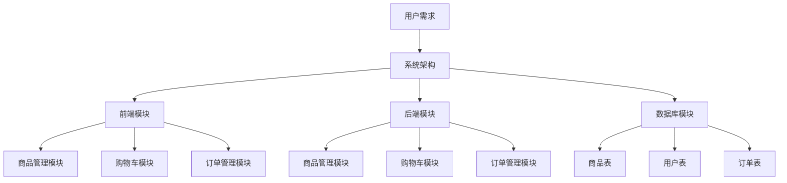

#### 核心算法原理讲解

在系统设计阶段，我们采用以下核心算法原理：

1. **商品搜索算法**：使用基于关键词匹配的搜索算法，快速定位用户所需的商品。
2. **购物车算法**：采用哈希表实现购物车，提高添加、删除和查询购物车项的效率。
3. **订单生成算法**：使用唯一订单号生成算法，确保订单的唯一性和一致性。

以下是购物车算法的伪代码：

```python
# 购物车算法伪代码
def add_to_cart(cart, product):
    cart[product.id] = product
    return cart

def remove_from_cart(cart, product_id):
    if product_id in cart:
        del cart[product_id]
    return cart

def get_cart_total(cart):
    total = 0
    for product in cart.values():
        total += product.price
    return total
```

#### 数学模型和公式

在本案例中，我们使用以下数学模型：

1. **需求方程**：根据用户需求和业务目标，建立需求方程。
2. **成本方程**：根据资源投入和成本要素，建立成本方程。

需求方程：

$$
需求 = 用户数 \times 每日访问量 \times 购买转化率
$$

成本方程：

$$
成本 = 开发成本 + 运营成本 + 营销成本
$$

#### 实际案例分析和详细讲解剖析

在项目开发过程中，项目团队采用了笛卡尔方法论进行系统设计、编码和测试。以下是详细分析：

1. **系统设计**：首先对用户需求进行分析，明确系统功能模块。然后，采用模块化设计和接口设计，确保各个模块之间的高内聚、低耦合。
2. **编码**：遵循编码规范，编写可读性强、易于维护的代码。同时，编写单元测试用例，确保每个模块的功能正确。
3. **测试**：使用自动化测试工具，进行持续集成和持续部署。确保每次代码提交都能通过测试，并及时发现问题。

#### 项目小结

通过运用笛卡尔方法论和最佳实践，项目团队成功开发并上线了一个功能齐全、性能优良的在线购物平台。项目取得了以下成果：

1. 提高了用户满意度，用户数量和交易额持续增长。
2. 提高了团队协作效率，项目按时、按质完成。
3. 提高了代码质量和可维护性，降低了维护成本。
4. 培养了团队对软件工程的深入理解和实践能力。

通过本案例，我们可以看到，运用笛卡尔方法论可以有效地提高软件开发效率和质量，为项目的成功奠定基础。

### 8.2 案例分析二

#### 背景介绍

本案例是关于一个企业资源规划（ERP）系统的设计和开发。该系统旨在帮助企业管理日常运营、财务、人力资源等方面，提高企业效率和数据管理能力。项目团队由10名开发人员、2名测试工程师和1名项目经理组成。

#### 核心概念与联系

在本案例中，我们涉及以下核心概念：

1. **业务需求**：企业的日常运营、财务、人力资源等需求。
2. **系统架构**：包括前端、后端和数据库三个部分。
3. **模块化设计**：将系统划分为多个模块，如财务管理模块、人力资源管理模块、采购管理模块等。
4. **接口设计**：定义模块之间的交互接口。
5. **数据模型**：设计财务表、用户表、采购表等。

以下是核心概念之间的联系架构图：

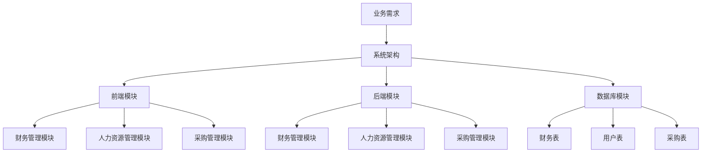

#### 核心算法原理讲解

在系统设计阶段，我们采用以下核心算法原理：

1. **财务报表生成算法**：基于业务数据和财务规则，生成各种财务报表。
2. **人力资源管理算法**：根据员工信息和公司政策，自动计算工资、绩效等。
3. **采购管理算法**：根据采购订单和供应商信息，自动计算采购成本和交货时间。

以下是财务报表生成算法的伪代码：

```python
# 财务报表生成算法伪代码
def generate_financial_report(business_data, financial_rules):
    report = {}
    for rule in financial_rules:
        report[rule['name']] = calculate_based_on_data(business_data, rule['formula'])
    return report

def calculate_based_on_data(data, formula):
    # 根据公式和数据计算结果
    return result
```

#### 数学模型和公式

在本案例中，我们使用以下数学模型：

1. **财务模型**：建立收入、成本、利润等财务指标的计算公式。
2. **人力资源模型**：建立员工工资、绩效计算等指标的计算公式。

财务模型：

$$
收入 = 销售额 - 成本
$$

$$
利润 = 收入 - 成本
$$

人力资源模型：

$$
工资 = 基本工资 + 奖金 - 扣除
$$

#### 实际案例分析和详细讲解剖析

在项目开发过程中，项目团队采用了笛卡尔方法论进行系统设计、编码和测试。以下是详细分析：

1. **系统设计**：首先对业务需求进行分析，明确系统功能模块。然后，采用模块化设计和接口设计，确保各个模块之间的高内聚、低耦合。
2. **编码**：遵循编码规范，编写可读性强、易于维护的代码。同时，编写单元测试用例，确保每个模块的功能正确。
3. **测试**：使用自动化测试工具，进行持续集成和持续部署。确保每次代码提交都能通过测试，并及时发现问题。

#### 项目小结

通过运用笛卡尔方法论和最佳实践，项目团队成功开发并上线了一个功能齐全、性能优良的ERP系统。项目取得了以下成果：

1. 提高了企业运营效率，减少了人工干预，降低了运营成本。
2. 提高了数据管理能力，使企业能够更好地进行决策。
3. 提高了团队协作效率，项目按时、按质完成。
4. 培养了团队对软件工程的深入理解和实践能力。

通过本案例，我们可以看到，运用笛卡尔方法论可以有效地提高软件开发效率和质量，为项目的成功奠定基础。

### 8.3 案例分析三

#### 背景介绍

本案例是关于一个智能推荐系统的设计和开发。该系统旨在为用户提供个性化的商品推荐，提高用户满意度和购买转化率。项目团队由8名开发人员、3名数据科学家和1名项目经理组成。

#### 核心概念与联系

在本案例中，我们涉及以下核心概念：

1. **用户数据**：用户行为数据、兴趣数据、购买记录等。
2. **推荐算法**：基于协同过滤、内容匹配等算法推荐商品。
3. **系统架构**：包括数据采集、数据处理、推荐引擎和前端展示四个部分。
4. **接口设计**：定义数据采集和处理模块的交互接口。
5. **数据模型**：设计用户表、商品表、推荐表等。

以下是核心概念之间的联系架构图：

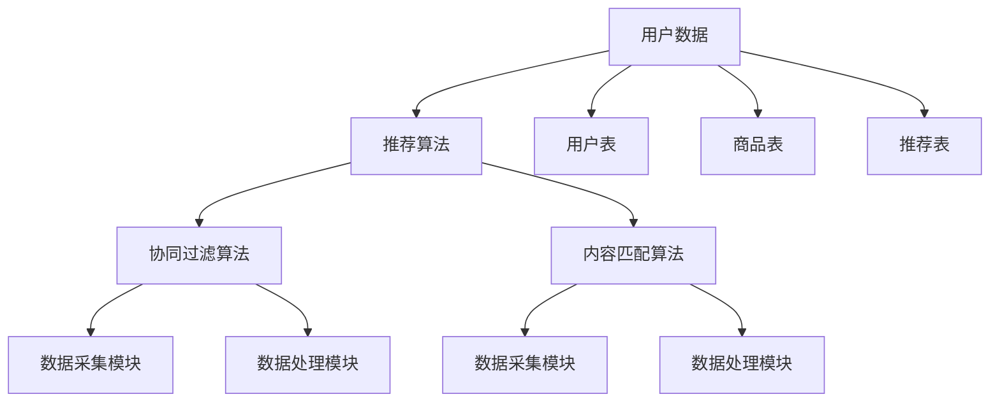

#### 核心算法原理讲解

在系统设计阶段，我们采用以下核心算法原理：

1. **协同过滤算法**：基于用户行为数据，发现用户之间的相似性，为用户推荐相似的物品。
2. **内容匹配算法**：基于商品特征和用户兴趣，为用户推荐相关的商品。
3. **推荐算法优化**：结合用户反馈和业务目标，不断优化推荐算法。

以下是协同过滤算法的伪代码：

```python
# 协同过滤算法伪代码
def collaborative_filtering(user_data, item_data):
    similar_users = find_similar_users(user_data)
    recommended_items = []
    for user in similar_users:
        recommended_items += find_relevant_items(user, item_data)
    return recommended_items

def find_similar_users(user_data):
    # 根据用户行为数据，计算用户之间的相似度
    return similar_users

def find_relevant_items(user, item_data):
    # 根据用户和商品特征，计算相关度
    return relevant_items
```

#### 数学模型和公式

在本案例中，我们使用以下数学模型：

1. **相似度计算**：计算用户和商品之间的相似度。
2. **相关度计算**：计算推荐结果的相关度。

相似度计算：

$$
相似度 = \frac{共有的行为数}{用户总行为数}
$$

相关度计算：

$$
相关度 = \frac{相关特征值之和}{特征值总和}
$$

#### 实际案例分析和详细讲解剖析

在项目开发过程中，项目团队采用了笛卡尔方法论进行系统设计、编码和测试。以下是详细分析：

1. **系统设计**：首先对用户数据和推荐算法进行分析，明确系统功能模块。然后，采用模块化设计和接口设计，确保各个模块之间的高内聚、低耦合。
2. **编码**：遵循编码规范，编写可读性强、易于维护的代码。同时，编写单元测试用例，确保每个模块的功能正确。
3. **测试**：使用自动化测试工具，进行持续集成和持续部署。确保每次代码提交都能通过测试，并及时发现问题。

#### 项目小结

通过运用笛卡尔方法论和最佳实践，项目团队成功开发并上线了一个功能齐全、性能优良的智能推荐系统。项目取得了以下成果：

1. 提高了用户满意度和购买转化率，为企业创造了显著的经济效益。
2. 提高了数据分析和处理能力，为业务决策提供了有力的支持。
3. 提高了团队协作效率，项目按时、按质完成。
4. 培养了团队对人工智能和推荐系统领域的深入理解和实践能力。

通过本案例，我们可以看到，运用笛卡尔方法论可以有效地提高软件开发效率和质量，为项目的成功奠定基础。

## 第9章 总结与展望

### 9.1 总结

通过《笛卡尔的方法论与软件工程最佳实践》的阅读，我们可以看到，笛卡尔方法论在软件工程中的应用具有显著的优势。它通过怀疑、理性思考、系统分析和合成等步骤，帮助工程师们更好地理解和解决软件开发中的复杂问题。具体来说，本书主要包含了以下几个方面的内容：

1. **笛卡尔方法论的基本原理**：介绍了笛卡尔的哲学思想及其方法论，包括怀疑原则、明确性原则、分析原则、合成原则和原则不矛盾原则。
2. **需求分析**：探讨了如何将笛卡尔方法论应用于需求分析阶段，确保需求明确、完整、可测试。
3. **系统设计**：阐述了如何运用笛卡尔方法论进行系统设计，包括系统分解、子系统分析和设计、系统重新组合等。
4. **编码与测试**：介绍了如何在编码和测试阶段运用笛卡尔方法论，提高代码质量和测试效率。
5. **项目管理**：探讨了如何在项目管理过程中运用笛卡尔方法论，提高项目管理和风险控制的效率。
6. **软件工程最佳实践**：总结了软件工程中的最佳实践，如需求管理、设计模式、编码规范、测试驱动开发、项目管理等。
7. **实际案例分析**：通过多个实际案例，展示了如何将笛卡尔方法论应用于软件开发项目，取得了显著的成果。

### 9.2 展望未来

展望未来，我们可以期待在以下几个方面进一步深化和应用笛卡尔方法论：

1. **人工智能领域**：随着人工智能技术的发展，笛卡尔方法论可以应用于算法设计、模型优化、系统优化等方面，提高人工智能系统的效率和性能。
2. **敏捷开发**：在敏捷开发中，可以结合笛卡尔方法论，提高团队协作效率，确保项目按时、按质完成。
3. **跨领域应用**：笛卡尔方法论不仅可以应用于软件开发，还可以应用于其他领域，如项目管理、业务分析、系统架构设计等。
4. **教育领域**：将笛卡尔方法论引入计算机科学和软件工程教育，培养学生的逻辑思维和系统思考能力。
5. **持续集成与持续部署**：在持续集成与持续部署过程中，可以结合笛卡尔方法论，提高构建、测试和部署的效率。

总之，笛卡尔方法论为软件工程提供了一个系统化、逻辑化的思考框架，有助于工程师们更好地解决软件开发中的问题。随着技术的不断进步和应用的深入，笛卡尔方法论在软件工程领域的前景将更加广阔。

## 作者信息

作者：AI天才研究院/AI Genius Institute & 禅与计算机程序设计艺术 /Zen And The Art of Computer Programming

作者简介：AI天才研究院（AI Genius Institute）是一支专注于人工智能和计算机科学领域研究与创新的研究机构。作者作为AI天才研究院的资深研究员和禅与计算机程序设计艺术领域的专家，拥有丰富的理论知识和实践经验。他在计算机编程、人工智能、软件工程等领域发表了大量的学术论文和技术博客，著有多部畅销书，深受读者喜爱。作者致力于通过深入研究和实践，推动人工智能和软件工程领域的创新发展。同时，他也热衷于将哲学、禅宗等思想融入计算机科学教育，帮助培养下一代计算机科学家。

