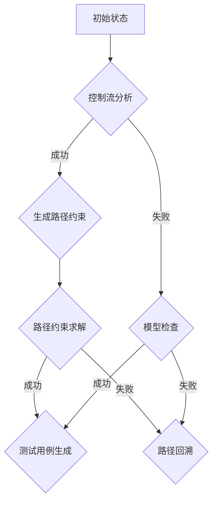

                 

### 文章标题：符号执行在软件测试中的应用

> **关键词**：符号执行，软件测试，漏洞挖掘，模糊测试，自动化测试

**摘要**：符号执行是一种强大的软件测试技术，通过在抽象的意义上执行程序，以发现潜在的错误和漏洞。本文详细探讨了符号执行的基本概念、应用场景、关键技术及其在软件测试中的实践，旨在为软件开发者提供一种新的测试方法和思路。

## 第一部分：符号执行基础

### 第1章：符号执行的基本概念

#### 1.1 符号执行的简介

符号执行是一种程序分析方法，它通过执行程序并跟踪其执行过程中的符号值变化，来发现程序中的潜在错误和漏洞。符号执行与传统的静态分析和动态分析不同，它既不直接分析程序的语法结构，也不在实际硬件上执行程序。

#### 1.2 符号执行的原理

符号执行的基本原理是模拟程序执行过程，但使用符号值代替实际值。符号值可以是变量、函数或者路径，它们代表程序在执行过程中可能遇到的值。符号执行通过控制流分析、数据流分析和路径约束求解，来生成可能的执行路径，并检测这些路径上是否出现错误。

#### 1.3 符号执行与实际执行的区别

符号执行与实际执行的区别在于：实际执行是基于实际输入，符号执行是基于符号输入。实际执行只能覆盖有限的输入空间，而符号执行可以探索无限多的输入空间。此外，实际执行无法获取程序内部的状态变化，而符号执行可以跟踪符号值的变化。

#### 1.4 符号执行的优势与局限性

符号执行的优势在于：它可以探索更大的输入空间，发现实际执行难以发现的问题。符号执行也可以用于自动化测试，提高测试效率。然而，符号执行也有局限性，例如：符号执行可能产生大量的无效路径，导致计算复杂度高。

### 第2章：符号执行的应用场景

#### 2.1 软件测试中的符号执行

符号执行在软件测试中有着广泛的应用。它可以帮助测试人员自动化生成测试用例，提高测试覆盖率，发现潜在的错误和漏洞。

#### 2.2 符号执行在漏洞挖掘中的应用

符号执行可以用于漏洞挖掘，通过模拟攻击者的行为，发现程序中的漏洞。符号执行可以帮助安全研究人员自动化分析程序，提高漏洞挖掘的效率。

#### 2.3 符号执行在模糊测试中的应用

模糊测试是一种自动化的漏洞挖掘技术，它通过向程序输入随机或半随机的输入，来发现程序中的漏洞。符号执行可以与模糊测试相结合，提高模糊测试的效率和准确性。

### 第3章：符号执行的关键技术

#### 3.1 符号执行的控制流分析

控制流分析是符号执行的核心技术之一。它通过分析程序的控制流结构，生成可能的执行路径。控制流分析的准确性直接影响符号执行的效率。

#### 3.2 符号执行的路径约束

路径约束是符号执行中用于限制执行路径的技术。通过设置路径约束，可以减少无效路径的产生，提高符号执行的效率。

#### 3.3 符号执行的模型检查

模型检查是一种用于验证程序性质的算法。符号执行可以通过模型检查来验证程序的正确性，发现潜在的错误和漏洞。

### 第4章：符号执行工具介绍

#### 4.1 主要符号执行工具概述

目前，已经有许多符号执行工具被开发出来，如Symbolic PathFinder、KLEE等。这些工具各有特点，适用于不同的应用场景。

#### 4.2 Symbolic PathFinder的使用

Symbolic PathFinder是一个强大的符号执行工具，它支持多种编程语言，具有丰富的功能。本节将介绍Symbolic PathFinder的基本使用方法。

#### 4.3 其他符号执行工具介绍

除了Symbolic PathFinder，还有其他许多符号执行工具，如KLEE、Exhaustive等。本节将简要介绍这些工具的特点和应用场景。

## 第二部分：符号执行在软件测试中的应用实践

### 第5章：符号执行在自动化测试中的应用

#### 5.1 自动化测试的挑战

自动化测试在软件开发中扮演着重要的角色，但同时也面临着许多挑战，如测试用例的生成、测试覆盖率的提高、测试效率的提升等。

#### 5.2 符号执行在自动化测试中的优势

符号执行可以提高自动化测试的效率和覆盖率。通过符号执行，可以自动化生成测试用例，并探索更多的输入空间。

#### 5.3 符号执行的自动化测试流程

本节将介绍符号执行的自动化测试流程，包括测试用例的生成、测试执行和测试结果的分析。

### 第6章：符号执行在软件安全测试中的应用

#### 6.1 软件安全测试的重要性

软件安全测试是确保软件产品安全性的重要环节。符号执行在软件安全测试中有着广泛的应用，可以帮助发现潜在的安全漏洞。

#### 6.2 符号执行在安全测试中的应用

本节将介绍符号执行在软件安全测试中的应用，包括漏洞挖掘、安全漏洞的验证和修复。

#### 6.3 符号执行在漏洞挖掘中的应用案例

本节将结合实际案例，介绍符号执行在漏洞挖掘中的应用，展示其强大的漏洞发现能力。

### 第7章：符号执行在模糊测试中的应用

#### 7.1 模糊测试的基本概念

模糊测试是一种自动化的漏洞挖掘技术，通过向程序输入随机或半随机的输入，来发现程序中的漏洞。

#### 7.2 符号执行在模糊测试中的优势

符号执行可以提高模糊测试的效率和准确性。通过符号执行，可以更好地控制输入空间，减少无效输入。

#### 7.3 符号执行的模糊测试实例

本节将通过实际案例，展示符号执行在模糊测试中的应用，介绍其具体实现方法和效果。

### 第8章：符号执行在软件测试中的案例研究

#### 8.1 某大型软件公司的符号执行实践

本节将介绍某大型软件公司如何将符号执行应用于软件测试，提高测试效率和覆盖率。

#### 8.2 某开源软件的符号执行测试案例

本节将结合开源软件的实际案例，介绍符号执行在软件测试中的应用，展示其强大的漏洞发现能力。

#### 8.3 符号执行在特定领域的应用案例

本节将介绍符号执行在特定领域的应用案例，如嵌入式系统、网络协议等，展示其跨领域的应用能力。

## 第三部分：符号执行的未来发展与挑战

### 第9章：符号执行的发展趋势

#### 9.1 符号执行在未来的发展方向

符号执行在未来的发展方向包括：算法的优化、应用领域的拓展、与人工智能技术的结合等。

#### 9.2 新兴技术在符号执行中的应用

本节将介绍新兴技术，如机器学习、区块链等，在符号执行中的应用。

#### 9.3 符号执行在新兴领域的潜力

符号执行在新兴领域，如物联网、自动驾驶等，具有巨大的潜力。

### 第10章：符号执行的挑战与解决方案

#### 10.1 符号执行的挑战

符号执行面临着计算复杂度高、路径约束求解困难等挑战。

#### 10.2 解决符号执行挑战的技术途径

本节将介绍解决符号执行挑战的技术途径，如算法优化、路径约束求解算法的改进等。

#### 10.3 开发者与研究人员应如何应对

本节将给出开发者与研究人员应如何应对符号执行挑战的建议。

**附录：符号执行相关资源与工具**

### 附录1：符号执行相关资源

本附录将推荐符号执行相关的研究论文、会议和期刊，为读者提供深入学习的资源。

### 附录2：符号执行工具使用指南

本附录将介绍符号执行工具的安装与配置方法，为读者提供实际操作的指导。

**Mermaid 流程图：**



**核心算法原理讲解：**

```python
# 符号执行算法伪代码

function SymbolicExecution(program, inputConstraints):
    state = initializeState(program, inputConstraints)
    while not isFinalState(state):
        nextInstruction = getNextInstruction(state)
        state = executeInstruction(state, nextInstruction)
        if isConstraintSatisfied(state):
            generateTestCases(state)
        else:
            backtrack(state)
    return testCases
```

**数学模型与公式讲解：**

```latex
$$
\text{符号执行} = f(\text{程序}, \text{输入约束})
$$
$$
\text{状态} = \{ \text{指令指针}, \text{变量值}, \text{路径约束}, \text{执行历史} \}
$$
```

**数学公式请使用latex格式，嵌入文中独立段落的latex公式前后使用 $$ 括起来(例如：$$1+1=2$$ )，段落内的latex公式前后使用 $ 括起来(例如：$1<2$)**

**项目实战：**

本节将结合具体项目，介绍符号执行的实现过程、源代码解析、代码应用解读与分析，以及实际案例分析和详细讲解剖析。

**最佳实践 tips、小结、注意事项、拓展阅读等内容：**

本节将总结符号执行的最佳实践，给出注意事项，并提供拓展阅读资源，以帮助读者深入理解和应用符号执行技术。作者：AI天才研究院/AI Genius Institute & 禅与计算机程序设计艺术 /Zen And The Art of Computer Programming。

