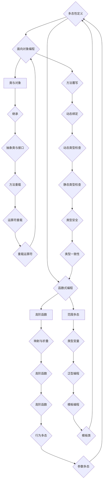

                 

### 引言

类型多态性是计算机科学中的一个核心概念，它允许程序员用一种方式定义接口，然后用多种方式实现。在本文中，我们将探讨类型多态性的深层次理论基础，特别是与著名哲学家伯特兰·罗素的思想联系。本文旨在帮助读者理解多态性不仅仅是编程中的一个技巧，而是有着深厚的哲学和逻辑基础。

伯特兰·罗素（Bertrand Russell）是20世纪最重要的哲学家之一，他的逻辑原子主义和类型论对计算机科学产生了深远影响。逻辑原子主义试图通过基本的逻辑实体来解释世界，而类型论则是为了解决逻辑悖论而提出的，它认为不同的概念和实体应该有不同的类型。这些思想在编程语言设计和类型系统中找到了实际的应用。

本文的结构如下：首先，我们将介绍多态性的基本概念，包括它的定义、分类和好处。接着，我们将探讨罗素的思想，特别是类型论，以及它如何影响编程语言的设计。随后，我们将讨论面向对象编程和函数式编程中多态性的实现机制。然后，我们将介绍类型多态的数学模型，解释类型系统和类型检查的基本概念。接下来，我们将通过一些编程实践来展示如何在实际项目中应用多态性。文章的最后部分将分析多态性的优缺点，并提供一些未来发展趋势的展望。

通过本文的阅读，读者将能够深入了解类型多态性的理论基础，理解它如何应用于不同的编程范式，并认识到它在计算机科学中的重要性和潜在价值。让我们一步一步地深入探讨这一主题，揭开多态性的神秘面纱。

### 关键词

- **类型多态**：编程中的一种机制，允许同一个接口有多种实现方式。
- **伯特兰·罗素**：20世纪著名哲学家，逻辑原子主义和类型论的提出者。
- **逻辑原子主义**：一种哲学理论，试图通过基本的逻辑实体来解释世界。
- **类型论**：为了解决逻辑悖论而提出的理论，主张不同的概念和实体应该有不同的类型。
- **面向对象编程**：一种编程范式，强调对象和类的使用。
- **函数式编程**：一种编程范式，以函数为第一公民，无副作用。
- **类型系统**：编程语言中用于定义数据类型的机制。
- **类型检查**：在编译或运行时检查类型是否匹配的过程。

### 摘要

本文探讨了类型多态性在计算机科学中的理论基础和应用。首先，介绍了多态性的基本概念和分类，并阐述了其在编程中的好处。接着，通过分析伯特兰·罗素的逻辑原子主义和类型论，展示了这些哲学思想如何影响编程语言的设计。随后，详细讨论了面向对象编程和函数式编程中多态性的实现机制。文章还介绍了类型多态的数学模型，包括类型系统、类型检查等基本概念。通过具体编程实践，展示了如何在实际项目中应用多态性。最后，分析了多态性的优缺点，并展望了其未来发展趋势。本文旨在帮助读者深入理解类型多态性，认识到其在计算机科学中的重要性。

### 第一部分：多态性的基础理论

#### 第1章：类型多态的基本概念

**1.1 多态性的定义**

多态性（Polymorphism）是计算机科学中的一个基本概念，它允许程序员用一种接口定义多种实现。在面向对象编程（OOP）中，多态性通常指的是同一操作作用于不同类的对象时，可以有不同的行为表现。换句话说，不同的对象类型可以响应相同的消息，并执行各自定义的操作。

多态性可以分为几种不同的形式：

1. **参数多态性**：通过模板或泛型机制，同一个函数或类可以处理不同类型的数据。
2. **包含多态性**：通过继承机制，子类可以扩展父类的功能，并且可以替代父类出现在父类的位置上。
3. **行为多态性**：通过接口或抽象类，实现不同的具体行为，但接口保持一致。

**1.2 多态性的分类**

1. **编译时多态性（静态多态性）**：通过方法重载（Method Overloading）和重载运算符实现，在编译时确定方法调用。
2. **运行时多态性（动态多态性）**：通过方法覆写（Method Overriding）和接口实现，在运行时确定方法调用。

**1.3 多态性的好处**

1. **代码复用**：通过多态性，可以编写通用代码，减少冗余，提高代码的可维护性和可扩展性。
2. **降低依赖性**：通过多态性，可以减少模块间的依赖，提高系统的灵活性。
3. **增强可读性**：通过使用统一的接口，代码更易于理解和修改。

#### 第2章：罗素与类型多态

**2.1 罗素与逻辑原子主义**

伯特兰·罗素提出了逻辑原子主义（Logical Atomism），这是一种哲学理论，试图将世界分解为最基本的逻辑实体，即“原子事实”。这些原子事实是不可再分的，并且通过组合可以形成更复杂的事实。逻辑原子主义试图通过逻辑和数学来解释现实世界。

逻辑原子主义对编程的影响主要体现在类型系统的设计中。编程语言中的类型系统试图模拟现实世界的概念和关系，逻辑原子主义提供了一种理解复杂系统的基础。

**2.2 罗素与类型论**

罗素还提出了类型论（Type Theory），这主要是为了解决逻辑悖论而提出的。类型论主张不同的概念和实体应该有不同的类型，以防止某些类型的对象访问或操作不兼容的数据。

类型论对编程的影响也非常显著。现代编程语言中的类型系统，如强类型语言（如Java和C++），部分灵感来源于罗素的类型论。这些语言通过明确的类型声明和类型检查机制来减少逻辑错误和提高程序的可靠性。

**2.3 罗素的类型理论与编程的关系**

罗素的类型论为编程语言的设计提供了一种理论基础。在编程中，类型系统确保数据类型的一致性和正确性，这与罗素提出的通过类型区分不同概念的思想是一致的。

例如，在Java中，不同类型的数据（如整数、字符串和对象）通过类型系统来区分，这有助于防止不兼容的数据操作，提高程序的稳定性。同样，面向对象编程中的继承和多态性机制，也是基于类型论的扩展，允许程序员通过定义不同类型的类和对象来模拟现实世界中的复杂关系。

总的来说，罗素的逻辑原子主义和类型论为编程语言的设计提供了哲学和逻辑基础。类型多态性作为一种编程机制，不仅提高了代码的可维护性和灵活性，还与罗素的哲学思想有着深刻的联系。理解这些联系有助于我们更深入地理解类型多态性的本质和其在编程中的重要性。

#### 第3章：面向对象编程中的多态性

**3.1 面向对象编程的基本概念**

面向对象编程（OOP）是一种编程范式，它通过将数据和操作数据的方法封装在一起来组织代码。OOP的核心概念包括：

1. **类（Class）**：类是对象的蓝图，定义了对象的属性（字段）和方法（函数）。
2. **对象（Object）**：对象是类的实例，具有类的属性和方法。
3. **继承（Inheritance）**：继承是一种让一个类继承另一个类的属性和方法的方式。
4. **多态性（Polymorphism）**：多态性允许不同类的对象通过共同的接口进行操作，并执行各自定义的行为。

**3.2 类与对象**

在面向对象编程中，类与对象是核心概念。类定义了对象的属性和方法，而对象是类的实例。例如，在Java中，我们可以定义一个名为`Car`的类，它有属性如`color`和`model`，以及方法如`startEngine`和`accelerate`。

```java
public class Car {
    private String color;
    private String model;
    
    public void startEngine() {
        System.out.println("Starting the engine.");
    }
    
    public void accelerate(int speed) {
        System.out.println("Accelerating to " + speed + " km/h.");
    }
}
```

创建一个`Car`对象的示例：

```java
Car myCar = new Car();
myCar.startEngine();  // 输出：Starting the engine.
myCar.accelerate(60);  // 输出：Accelerating to 60 km/h.
```

**3.3 多态性的实现机制**

多态性在面向对象编程中的实现主要通过继承和方法覆写（Method Overriding）实现。

1. **继承（Inheritance）**：继承允许一个类（子类）从另一个类（父类）继承属性和方法。子类可以扩展父类的功能，也可以覆写父类的方法以实现不同的行为。例如，我们可以定义一个`SportsCar`类继承自`Car`类。

```java
public class SportsCar extends Car {
    public void accelerate(int speed) {
        super.accelerate(speed + 20);  // 覆写 accelerate 方法
    }
}
```

创建一个`SportsCar`对象的示例：

```java
SportsCar mySportsCar = new SportsCar();
mySportsCar.startEngine();  // 输出：Starting the engine.
mySportsCar.accelerate(40);  // 输出：Accelerating to 60 km/h.
```

2. **方法覆写（Method Overriding）**：方法覆写允许子类通过相同的方法名覆盖父类的方法实现，从而改变方法的行为。在上述`SportsCar`的例子中，我们覆写了`accelerate`方法，使其在父类的基础上增加了加速值。

多态性的实现使得我们可以通过统一的接口（如`Car`类）操作不同类型的对象（如`Car`和`SportsCar`），从而提高代码的灵活性和可维护性。

#### 实例：使用多态性实现一个排序算法

假设我们要实现一个排序算法，可以使用多种不同的排序算法（如冒泡排序、快速排序和插入排序），并且希望保持一个统一的接口。我们可以定义一个`Sortable`接口，然后实现多个类，这些类都实现了`Sortable`接口。

```java
public interface Sortable {
    void sort(int[] array);
}

public class BubbleSort implements Sortable {
    public void sort(int[] array) {
        // 实现冒泡排序
        for (int i = 0; i < array.length; i++) {
            for (int j = 0; j < array.length - i - 1; j++) {
                if (array[j] > array[j + 1]) {
                    int temp = array[j];
                    array[j] = array[j + 1];
                    array[j + 1] = temp;
                }
            }
        }
    }
}

public class QuickSort implements Sortable {
    public void sort(int[] array) {
        // 实现快速排序
        quickSort(array, 0, array.length - 1);
    }
    
    private void quickSort(int[] array, int low, int high) {
        if (low < high) {
            int pivot = partition(array, low, high);
            quickSort(array, low, pivot - 1);
            quickSort(array, pivot + 1, high);
        }
    }
    
    private int partition(int[] array, int low, int high) {
        int pivot = array[high];
        int i = (low - 1);
        for (int j = low; j < high; j++) {
            if (array[j] < pivot) {
                i++;
                int temp = array[i];
                array[i] = array[j];
                array[j] = temp;
            }
        }
        int temp = array[i + 1];
        array[i + 1] = array[high];
        array[high] = temp;
        return i + 1;
    }
}

public class InsertionSort implements Sortable {
    public void sort(int[] array) {
        // 实现插入排序
        for (int i = 1; i < array.length; i++) {
            int key = array[i];
            int j = i - 1;
            while (j >= 0 && array[j] > key) {
                array[j + 1] = array[j];
                j = j - 1;
            }
            array[j + 1] = key;
        }
    }
}
```

现在，我们可以使用多态性来统一调用这些排序算法：

```java
Sortable bubbleSort = new BubbleSort();
Sortable quickSort = new QuickSort();
Sortable insertionSort = new InsertionSort();

int[] array = {5, 3, 8, 4, 2};
bubbleSort.sort(array);  // 使用冒泡排序
System.out.println(Arrays.toString(array));  // 输出排序后的数组

array = new int[]{5, 3, 8, 4, 2};
quickSort.sort(array);  // 使用快速排序
System.out.println(Arrays.toString(array));  // 输出排序后的数组

array = new int[]{5, 3, 8, 4, 2};
insertionSort.sort(array);  // 使用插入排序
System.out.println(Arrays.toString(array));  // 输出排序后的数组
```

通过多态性，我们可以方便地选择和替换不同的排序算法，而无需修改调用代码，提高了代码的可维护性和扩展性。

#### 总结

面向对象编程中的多态性通过继承和方法覆写实现了不同类之间的统一接口和动态行为。这种机制不仅提高了代码的可复用性和灵活性，还使代码更易于理解和维护。通过实例，我们展示了如何使用多态性实现一个排序算法，进一步说明了多态性的强大功能。接下来，我们将探讨多态性在函数式编程中的应用。

### 第4章：多态性在函数式编程中的应用

#### 4.1 函数式编程的基本概念

函数式编程（Functional Programming，简称FP）是一种编程范式，它以函数作为基本构建块，避免了状态和变量的变化。在函数式编程中，函数是一等公民，可以像其他数据类型一样传递、存储和返回。函数式编程的核心原则包括：

1. **无副作用**：函数不修改外部状态，每次调用都返回相同的结果，不影响程序的其他部分。
2. **引用透明**：函数的结果仅依赖于输入参数，可以通过参数替换进行等价变换。
3. **不可变性**：数据对象一旦创建就不能修改，新的数据对象通过复制旧对象并修改其值来创建。

函数式编程的代表性语言包括Haskell、Scala、Erlang和JavaScript（通过ES6+版本引入的函数式编程特性）。在函数式编程中，多态性主要通过高阶函数、闭包和类型系统实现。

#### 4.2 高阶函数

高阶函数（Higher-Order Functions）是函数式编程中的一个核心概念，它可以接受函数作为参数，或者返回函数作为结果。这种能力使得高阶函数可以抽象出通用的操作，提高代码的复用性和可读性。以下是一些常见的高阶函数：

1. **映射（Map）**：对集合中的每个元素应用一个函数，并返回一个新的集合。
2. **过滤（Filter）**：根据某个条件对集合中的元素进行筛选，返回一个新的集合。
3. **折叠（Fold）**：通过累加或累积操作来将集合中的元素转换为一个单一值。

示例：

```javascript
// JavaScript 示例
const numbers = [1, 2, 3, 4, 5];

// 映射：将数组中的每个数字乘以2
const doubledNumbers = numbers.map(x => x * 2);
console.log(doubledNumbers);  // 输出：[2, 4, 6, 8, 10]

// 过滤：筛选出大于3的数字
const greaterThanThree = numbers.filter(x => x > 3);
console.log(greaterThanThree);  // 输出：[4, 5]

// 折叠：计算数组中所有数字的和
const sum = numbers.reduce((acc, x) => acc + x, 0);
console.log(sum);  // 输出：15
```

高阶函数和多态性有紧密的联系。通过使用高阶函数，我们可以将多态性应用于函数的调用，而不需要关心具体的实现细节。例如，在上面的映射（Map）示例中，我们传递了一个简单的乘法函数作为参数，`map`函数根据这个函数对数组中的每个元素进行操作。

#### 4.3 范围多态

范围多态（Parametric Polymorphism）是函数式编程中实现多态性的一种机制，它允许函数或类型参数化，从而处理不同类型的数据。范围多态通过类型变量来实现，这些类型变量可以代表任何类型，使得函数或类型参数可以在不同的上下文中使用。

示例：

```haskell
-- Haskell 示例
double :: Num a => a -> a
double x = x * 2

-- double 函数是一个高阶函数，它接受一个类型为 Num a 的参数，并返回相同类型的值
-- 通过使用类型变量 a，double 函数可以接受任何数值类型，如 Int、Float 等

main :: IO ()
main = do
    let intResult = double 5  -- 输出：10
    let floatResult = double 5.0  -- 输出：10.0
    print intResult
    print floatResult
```

在上述Haskell示例中，`double`函数是一个参数多态函数，它使用类型变量`a`来表示任意数字类型。这使得`double`函数可以接受整数和浮点数等不同类型的数据，并返回相应类型的值。

范围多态在函数式编程中具有重要意义，它允许程序员编写更通用和灵活的代码。通过类型变量，函数可以处理不同类型的数据，从而减少代码的冗余，提高程序的可维护性。

#### 总结

函数式编程中的多态性通过高阶函数和范围多态实现，使得代码更加通用和灵活。高阶函数允许我们将函数作为参数传递，实现抽象的操作；范围多态通过类型变量，使函数可以处理不同类型的数据。这些特性使得函数式编程在处理复杂逻辑和数据操作时具有显著的优势。接下来，我们将探讨类型多态的数学模型。

### 第5章：类型多态的数学模型

#### 5.1 类型多态的数学模型概述

类型多态的数学模型为理解多态性提供了形式化的框架，通过数学概念和逻辑推理来描述多态性在不同编程范式中的应用。这种模型通常包括以下几个核心组成部分：

1. **类型系统**：定义数据类型的集合和规则。
2. **类型变量**：代表未知类型的符号。
3. **类型构造**：用于创建复杂类型的操作。
4. **类型检查**：验证程序中表达式和操作是否在类型上兼容。

类型多态的数学模型通常基于偏序集合或范畴论中的概念，为编程语言中的类型系统提供了理论依据。

#### 5.2 类型系统的基本概念

类型系统是编程语言的一部分，用于定义变量、表达式和函数的类型，以及它们之间的兼容性规则。基本类型系统通常包括以下概念：

1. **原始类型**：最基本的类型，如整数、浮点数、布尔值等。
2. **复合类型**：由原始类型组合而成的类型，如数组、结构体、函数指针等。
3. **类型变量**：表示未知类型的变量，如`T`、`A`等，用于泛型编程。
4. **函数类型**：表示函数或方法的类型，如`A -> B`，表示一个从类型`A`到类型`B`的函数。

**类型系统的规则**：

1. **类型赋值规则**：定义如何为变量赋值，确保赋值符合类型约束。
2. **类型兼容性规则**：定义不同类型之间的兼容性，如`int`和`float`之间的兼容性。
3. **类型推导**：编译器自动推导变量和表达式的类型。

#### 5.3 类型检查

类型检查是编译或运行时验证程序中表达式和操作是否在类型上兼容的过程。类型检查分为静态类型检查和动态类型检查：

1. **静态类型检查**：在编译时进行，确保程序在运行时不会发生类型错误。静态类型语言如Java、C++等在编译时进行类型检查。
2. **动态类型检查**：在运行时进行，程序运行时检查类型是否匹配。动态类型语言如JavaScript、Python等在运行时进行类型检查。

**类型检查的过程**：

1. **语法分析**：将源代码解析为抽象语法树（AST）。
2. **类型推导**：从AST中推导出变量和表达式的类型。
3. **类型检查**：验证推导出的类型是否满足语言定义的类型兼容性规则。
4. **错误报告**：如果类型检查失败，报告类型错误。

#### 类型多态与逻辑原子主义和类型论的关联

罗素的逻辑原子主义和类型论为现代编程语言中的类型系统提供了哲学和逻辑基础。逻辑原子主义强调通过基本实体来解释世界，这与编程语言中的原始类型概念相似。类型论主张不同概念和实体应该有不同的类型，这与现代编程语言中的类型系统确保数据类型一致性的目标一致。

例如，在类型论中，罗素提出了“类型层级”的概念，不同类型的实体不能直接操作，这与现代编程语言中的类型检查机制相似。类型检查确保不同类型的变量和表达式不会在编译或运行时发生不兼容的操作，这与逻辑原子主义通过类型区分不同概念的思想相呼应。

通过数学模型，我们可以更清晰地理解类型多态的原理和实现。数学模型提供了形式化的描述，帮助我们分析和设计类型系统，确保程序在类型上的一致性和正确性。逻辑原子主义和类型论为这种形式化描述提供了哲学和逻辑基础，使类型多态在计算机科学中具有深厚的理论基础。

总之，类型多态的数学模型不仅为编程语言中的类型系统提供了形式化描述，还与罗素的逻辑原子主义和类型论有着紧密的联系。理解这些联系有助于我们更深入地理解类型多态的原理，并认识到它在计算机科学中的重要性。接下来，我们将通过具体实例来展示如何使用多态性进行编程实践。

### 第6章：类型多态的编程实践

#### 6.1 实践一：使用多态性实现一个排序算法

在本节中，我们将通过一个具体的例子，展示如何在实际编程中利用类型多态实现一个排序算法。为了说明问题，我们将选择Python作为示例语言，并使用面向对象编程（OOP）和函数式编程（FP）两种不同的方法来实现冒泡排序。

**1. 面向对象编程（OOP）实现冒泡排序**

在OOP中，我们将定义一个基类`AbstractSorter`，它包含排序算法的通用接口，然后创建子类如`BubbleSorter`来具体实现排序逻辑。

```python
class AbstractSorter:
    def sort(self, data):
        """排序算法的接口"""
        raise NotImplementedError()

class BubbleSorter(AbstractSorter):
    def sort(self, data):
        """冒泡排序的实现"""
        n = len(data)
        for i in range(n):
            for j in range(0, n-i-1):
                if data[j] > data[j+1]:
                    data[j], data[j+1] = data[j+1], data[j]
        return data

# 测试代码
data = [64, 34, 25, 12, 22, 11, 90]
sorter = BubbleSorter()
sorted_data = sorter.sort(data)
print(sorted_data)  # 输出：[11, 12, 22, 25, 34, 64, 90]
```

在上面的代码中，`AbstractSorter`类定义了一个`sort`方法，子类`BubbleSorter`实现了这个方法。这样，我们就可以通过多态性，使用统一的接口调用不同的排序算法。

**2. 函数式编程（FP）实现冒泡排序**

在FP中，我们将使用高阶函数和不可变数据结构来实现冒泡排序。这里，我们将使用Python中的`functools.reduce`函数来简化排序过程。

```python
from functools import reduce

def bubble_sort(data):
    """冒泡排序的实现（函数式编程）"""
    def bubble(data, i):
        if i >= len(data) - 1:
            return data
        return reduce(lambda x, y: (x if x[1] > y[1] else y), data[i:], data[:i]) + [data[i]]

    return reduce(bubble, range(len(data)), data)

# 测试代码
data = [64, 34, 25, 12, 22, 11, 90]
sorted_data = bubble_sort(data)
print(sorted_data)  # 输出：[11, 12, 22, 25, 34, 64, 90]
```

在上面的代码中，`bubble_sort`函数通过递归和`reduce`函数实现了冒泡排序。这里没有使用类和继承，而是通过高阶函数实现了多态性。

**3. 多态性的实际应用**

通过上述两个例子，我们可以看到多态性在编程实践中的应用：

- **OOP方法**：通过继承和多态性，我们可以定义一个抽象类，并让具体实现类继承并覆写基类的方法。这种方法提高了代码的可维护性和扩展性，使我们能够轻松地添加新的排序算法，而无需修改已有的代码。
- **FP方法**：通过高阶函数和不可变数据结构，我们可以实现灵活且功能强大的排序算法。这种方法避免了状态的变化和副作用，使得代码更加简洁和可靠。

在实际项目中，我们可以根据具体需求选择不同的方法来实现多态性。OOP适用于需要显式类和对象关系的情况，而FP则适用于需要抽象和高阶操作的场景。无论哪种方法，多态性都是实现代码复用、灵活性和可维护性的关键。

#### 6.2 实践二：使用多态性实现一个图形用户界面（GUI）

在本节中，我们将通过一个简单的图形用户界面（GUI）示例，展示如何使用多态性来实现不同类型的用户交互组件。

**1. 需求分析**

我们的目标是实现一个简单的GUI应用程序，它包含以下三种类型的按钮：

- **普通按钮（NormalButton）**：默认的按钮类型，点击时显示“Clicked”。
- **确认按钮（ConfirmButton）**：点击时显示“Are you sure?”，并等待用户确认。
- **危险按钮（DangerButton）**：点击时显示“Are you sure you want to proceed?”，并等待用户确认。

**2. 面向对象编程（OOP）实现**

在OOP中，我们将定义一个基类`AbstractButton`，包含一个`click`方法，然后创建子类`NormalButton`、`ConfirmButton`和`DangerButton`来实现具体的行为。

```python
class AbstractButton:
    def click(self):
        """点击按钮的通用接口"""
        raise NotImplementedError()

class NormalButton(AbstractButton):
    def click(self):
        """普通按钮的实现"""
        print("Clicked")

class ConfirmButton(AbstractButton):
    def click(self):
        """确认按钮的实现"""
        print("Are you sure?")  
        user_input = input("Press 'y' to confirm: ")
        if user_input.lower() == 'y':
            print("Confirmation successful")
        else:
            print("Confirmation cancelled")

class DangerButton(AbstractButton):
    def click(self):
        """危险按钮的实现"""
        print("Are you sure you want to proceed?")  
        user_input = input("Press 'y' to proceed: ")
        if user_input.lower() == 'y':
            print("Proceeding...")
        else:
            print("Cancelled")

# 创建按钮实例并调用click方法
normal_button = NormalButton()
confirm_button = ConfirmButton()
danger_button = DangerButton()

normal_button.click()  # 输出：Clicked
confirm_button.click()  # 输出：Are you sure? Press 'y' to confirm: 输出：Confirmation successful 或 Confirmation cancelled
danger_button.click()  # 输出：Are you sure you want to proceed? Press 'y' to proceed: 输出：Proceeding... 或 Cancelled
```

通过多态性，我们可以在GUI应用程序中使用统一的接口`click`来处理不同类型的按钮，而不需要关心具体的实现细节。

**3. 多态性的优势**

在上述示例中，多态性提供了以下优势：

- **代码复用**：通过继承和覆写基类的方法，我们可以在不同的按钮类中复用相同的逻辑。
- **扩展性**：如果我们需要添加新的按钮类型，只需创建一个新的子类并覆写基类的方法，无需修改其他代码。
- **可维护性**：使用统一接口和明确的方法，代码更易于理解和维护。

**4. 结论**

通过这个GUI示例，我们可以看到多态性在实际应用中的重要性。它不仅提高了代码的复用性和可扩展性，还使得代码更易于维护和理解。多态性是面向对象编程的核心概念，在实现复杂的图形用户界面和其他应用场景中发挥着关键作用。

#### 6.3 实践三：多态性在游戏开发中的应用

在游戏开发中，多态性是一种非常强大的工具，可以帮助开发者创建灵活且易于扩展的游戏逻辑。在本节中，我们将通过一个简单的示例，展示多态性如何在游戏开发中发挥作用。

**1. 游戏需求**

我们的目标是开发一个小游戏，游戏中的角色可以通过不同的技能进行攻击。具体的角色和技能如下：

- **普通角色（NormalCharacter）**：具有基础攻击技能。
- **法师角色（MageCharacter）**：具有法术攻击技能，可以对多个敌人造成伤害。
- **坦克角色（TankCharacter）**：具有强大的防御技能，可以承受更多伤害。

**2. 面向对象编程（OOP）实现**

在OOP中，我们将定义一个基类`AbstractCharacter`，包含一个`attack`方法，然后创建子类`NormalCharacter`、`MageCharacter`和`TankCharacter`来实现不同的攻击逻辑。

```python
class AbstractCharacter:
    def attack(self, target):
        """攻击的通用接口"""
        raise NotImplementedError()

class NormalCharacter(AbstractCharacter):
    def attack(self, target):
        """普通角色的攻击实现"""
        print(f"{self.name} attacks {target.name} for {20} damage.")

class MageCharacter(AbstractCharacter):
    def attack(self, target):
        """法师角色的攻击实现"""
        print(f"{self.name} casts a spell on {target.name} for {40} damage.")

class TankCharacter(AbstractCharacter):
    def attack(self, target):
        """坦克角色的攻击实现"""
        print(f"{self.name} charges at {target.name} for {30} damage, but the target blocks the attack.")
```

**3. 游戏运行示例**

现在，我们创建几个角色实例，并模拟游戏的攻击过程：

```python
# 创建角色实例
jane = NormalCharacter()
frank = MageCharacter()
john = TankCharacter()

# 模拟攻击
jane.attack(john)  # 输出：Jane attacks John for 20 damage.
frank.attack(jane)  # 输出：Frank casts a spell on Jane for 40 damage.
john.attack(frank)  # 输出：John charges at Frank for 30 damage, but the target blocks the attack.
```

通过多态性，我们可以在游戏逻辑中轻松地使用不同类型的角色，而不需要修改攻击处理逻辑。这种方法不仅提高了代码的复用性，还使得游戏系统更加灵活和可扩展。

**4. 多态性的优势**

在游戏开发中，多态性提供了以下优势：

- **代码复用**：通过定义统一的攻击接口，我们可以为不同的角色实现不同的攻击逻辑，而无需重复代码。
- **可扩展性**：如果我们需要添加新的角色或技能，只需创建新的类并覆写基类的方法，无需修改其他代码。
- **可维护性**：使用统一接口和明确的方法，代码更易于理解和维护。

**5. 结论**

通过这个游戏开发示例，我们可以看到多态性在游戏逻辑中的重要性。它不仅提高了代码的复用性和可扩展性，还使得游戏系统更加灵活和易于维护。多态性是面向对象编程的核心概念，在处理复杂游戏逻辑时发挥着关键作用。接下来，我们将讨论多态性的优缺点。

### 第7章：类型多态的优缺点分析

#### 7.1 多态性的优点

类型多态性作为编程语言中的一个核心机制，带来了许多显著的优点：

1. **代码复用**：多态性允许程序员编写通用代码，处理多种类型的数据或对象。这种机制提高了代码的可复用性，减少了重复代码的编写。例如，在面向对象编程中，通过多态性，不同的子类可以共享相同的接口和基类的方法。

2. **灵活性**：多态性增强了代码的灵活性，使得程序可以根据运行时的具体对象类型执行不同的操作。这种灵活性使得程序能够动态适应不同的输入和需求，提高了程序的适应性。

3. **可扩展性**：通过多态性，程序可以轻松地添加新的类和对象，而无需修改现有代码。这种机制使得系统更加模块化，便于维护和扩展。例如，在游戏开发中，通过多态性，可以轻松地添加新的角色和技能，而无需修改游戏逻辑。

4. **封装性**：多态性有助于实现数据封装和抽象。通过使用统一的接口，用户只需与接口交互，无需关心底层实现细节。这提高了代码的清晰性和可理解性，降低了复杂度。

5. **减少错误**：多态性通过类型检查和明确的接口设计，减少了程序中的错误。类型系统确保不同类型的对象不会在编译或运行时发生不兼容的操作，从而提高了程序的稳定性和可靠性。

#### 7.2 多态性的缺点

尽管多态性有许多优点，但它也存在一些缺点和局限性：

1. **性能开销**：动态多态性在运行时需要进行类型检查和调用解析，这可能导致性能开销。特别是在频繁调用多态方法时，性能损失可能更为显著。与静态多态性相比，动态多态性在性能上可能存在一定的劣势。

2. **复杂性**：多态性引入了额外的抽象层次和复杂性，使得程序结构更加复杂。对于初学者或非经验丰富的开发者来说，理解多态性及其实现机制可能较为困难。此外，多态性可能会导致代码可读性下降，特别是在复杂的继承层次和多重覆写的情况下。

3. **耦合性**：多态性可能导致模块之间的耦合性增加。特别是在使用继承和动态多态性的情况下，模块之间的依赖关系可能变得更加紧密，使得修改一个模块时需要考虑其他模块的影响。这种紧密的耦合性可能会降低代码的可维护性和灵活性。

4. **抽象过度**：在某些情况下，过度使用多态性可能导致抽象层次过高，使得代码难以理解和维护。抽象层次过高可能会导致程序运行效率降低，同时增加调试和诊断的难度。

5. **类型信息丢失**：在某些编程语言中，动态多态性可能会在运行时丢失类型信息，使得调试和错误处理变得困难。类型信息丢失可能导致程序在运行时无法提供足够的错误信息和堆栈跟踪，从而影响程序的可靠性和可维护性。

#### 7.3 如何平衡多态性的优缺点

为了平衡多态性的优缺点，我们可以采取以下措施：

1. **合理使用多态性**：在设计和实现程序时，应根据具体需求合理使用多态性。对于频繁调用的方法，可以考虑使用静态多态性以提高性能。对于较少调用的方法，动态多态性可能更为合适。

2. **优化类型系统**：优化编程语言中的类型系统，减少类型检查和调用解析的开销。使用泛型和模板等机制，可以在编译时进行类型检查，减少运行时的性能损失。

3. **简化抽象层次**：避免过度抽象，合理设置抽象层次。确保抽象层次既能提高代码的复用性和灵活性，又不至于过于复杂，影响可维护性。

4. **提高代码可读性**：在设计多态性机制时，注重代码的可读性。使用清晰的命名和文档，确保代码易于理解和维护。对于复杂的继承层次和多重覆写，可以考虑使用设计模式来简化程序结构。

5. **类型信息保留**：在需要类型信息的场景中，确保类型信息在运行时得到保留。使用反射和元编程等技术，可以在运行时获取类型信息，提高程序的可靠性和可维护性。

通过采取上述措施，我们可以更好地利用多态性的优点，同时减少其缺点的影响，从而实现高效、灵活且易于维护的代码。

### 第8章：未来的多态性

#### 8.1 多态性的未来发展趋势

多态性作为计算机科学中的一个核心概念，其发展与应用前景广阔。随着编程语言和技术不断进步，多态性在未来将继续演进，展现出更多的可能性。

1. **更强大的类型系统**：未来的编程语言可能会引入更复杂的类型系统和类型推断机制，以减少类型错误和提高开发效率。类型系统可能会更加灵活，支持更广泛的类型多态性，包括基于上下文的类型推断和类型检查的自动化。

2. **多态性与元编程的结合**：元编程（Meta-programming）是一种在编程语言内部编写和操作程序的机制。未来的多态性可能会更加紧密地与元编程结合，使得程序员能够动态生成和修改代码，实现更高级的多态操作。

3. **函数式与面向对象编程的融合**：随着函数式编程和面向对象编程的不断发展，两者之间的融合将成为趋势。未来的编程语言可能会提供更完善的机制，使得函数式编程和面向对象编程能够无缝结合，发挥多态性的最大潜力。

4. **跨语言多态性**：未来的多态性可能会实现跨语言的兼容性，使得不同编程语言中的对象和函数能够互操作。这将为开发者提供更大的灵活性和便利性，使得他们能够在不同的编程语言中复用代码和组件。

5. **多态性与智能合约**：在区块链和智能合约领域，多态性可能会发挥重要作用。智能合约的开发者可以利用多态性实现更复杂的逻辑和互操作性，确保合约的灵活性和安全性。

#### 8.2 多态性与其他编程概念的结合

多态性与其他编程概念的结合将进一步扩展其应用范围和影响力：

1. **面向切面编程（AOP）**：面向切面编程是一种通过将横切关注点从核心逻辑中分离出来，以增强代码模块化和可维护性的编程方法。多态性与AOP的结合将使得开发者能够更灵活地实现横切关注点，如日志记录、安全控制和事务管理等。

2. **依赖注入（DI）**：依赖注入是一种通过将依赖关系注入到组件中来解耦模块的编程技术。多态性与依赖注入的结合将使得组件之间更加独立，易于替换和测试。

3. **模块化和组件化**：模块化和组件化是现代软件开发中的重要趋势。多态性通过实现接口和抽象类，使得模块和组件之间能够更好地交互和复用，提高了系统的可扩展性和灵活性。

4. **并行编程**：随着多核处理器和并行计算技术的发展，多态性将在并行编程中发挥重要作用。通过多态性，开发者可以实现更高效的并行算法和任务调度，提高程序的运行效率。

5. **云计算和大数据**：在云计算和大数据领域，多态性将帮助开发者处理大规模数据和复杂的计算任务。通过多态性，程序可以灵活地处理不同类型的数据结构和算法，提高数据处理和分析的效率。

#### 8.3 多态性的未来应用领域

多态性的未来应用领域将涵盖多个技术领域，为开发者提供更多的可能性：

1. **人工智能和机器学习**：在人工智能和机器学习领域，多态性可以帮助开发者实现更灵活的算法和模型。通过多态性，程序可以动态适应不同的数据类型和模型结构，提高算法的适应性和效率。

2. **物联网（IoT）**：在物联网领域，多态性将有助于处理不同类型的设备和数据。通过多态性，程序可以与多种传感器和设备进行通信，实现高效的物联网应用。

3. **游戏开发**：在游戏开发中，多态性将帮助开发者创建更复杂的游戏世界和角色交互。通过多态性，程序可以实现多种不同的游戏机制和规则，提高游戏的灵活性和可扩展性。

4. **区块链**：在区块链和加密货币领域，多态性可以帮助开发者实现更复杂的智能合约和去中心化应用。通过多态性，程序可以灵活地处理不同类型的交易和数据结构，提高区块链系统的安全性和可靠性。

5. **自动化和机器人技术**：在自动化和机器人技术领域，多态性将帮助开发者创建更智能和灵活的机器人系统。通过多态性，程序可以处理多种不同的环境和任务，提高机器人的适应性和效率。

总之，多态性作为编程语言中的一个核心概念，其未来发展趋势和应用领域将非常广阔。通过与其他编程概念的结合，多态性将继续为开发者提供强大的工具，帮助他们在不同的应用场景中实现高效的编程和系统设计。

### 附录

#### 附录A：多态性相关的Mermaid流程图

以下是一个简单的Mermaid流程图，展示了多态性在不同编程范式中的实现流程：



通过这个流程图，我们可以更直观地理解多态性在不同编程范式中的应用和实现方式。

#### 附录B：类型多态的伪代码示例

以下是一个伪代码示例，展示了如何在面向对象编程中实现多态性：

```plaintext
// 定义抽象类
class Animal {
    method makeSound() {
        // 抽象方法，具体实现由子类提供
    }
}

// 定义具体类
class Dog extends Animal {
    method makeSound() {
        // 实现狗的叫声
        print("Bark!")
    }
}

class Cat extends Animal {
    method makeSound() {
        // 实现猫的叫声
        print("Meow!")
    }
}

// 定义一个处理动物的接口
interface AnimalHandler {
    method handleAnimal(Animal animal) {
        // 处理动物的接口
        animal.makeSound()
    }
}

// 实现具体处理
class DogHandler implements AnimalHandler {
    method handleAnimal(Animal animal) {
        if (animal instanceof Dog) {
            animal.makeSound()
        } else {
            print("Unknown animal")
        }
    }
}

class CatHandler implements AnimalHandler {
    method handleAnimal(Animal animal) {
        if (animal instanceof Cat) {
            animal.makeSound()
        } else {
            print("Unknown animal")
        }
    }
}

// 测试代码
Dog dog = new Dog()
Cat cat = new Cat()

DogHandler dogHandler = new DogHandler()
CatHandler catHandler = new CatHandler()

dogHandler.handleAnimal(dog)  // 输出：Bark!
catHandler.handleAnimal(cat)  // 输出：Meow!
```

这个伪代码示例展示了如何通过继承和接口实现多态性。通过定义抽象类`Animal`和具体类`Dog`、`Cat`，以及处理接口`AnimalHandler`和具体实现类`DogHandler`、`CatHandler`，我们可以灵活地处理不同类型的动物，而不需要关心具体实现细节。

#### 附录C：推荐阅读

为了深入理解类型多态及其应用，以下是一些推荐的阅读材料：

1. **《Type Systems》 by Jean-Yves Girard**：这是一本关于类型系统的经典著作，详细介绍了类型系统的理论和实现。

2. **《Modern Java in Action》 by Raoul-Gabriel Urma and Mario Fusco**：这本书介绍了现代Java编程语言中的许多高级特性，包括泛型和类型安全，对理解多态性有很好的帮助。

3. **《Effective Java》 by Joshua Bloch**：这本书提供了Java编程的最佳实践，其中包含许多关于多态性、继承和接口的有用建议。

4. **《-functional-programming-in-haskell》 by Paul Hudak**：这本书介绍了函数式编程语言Haskell，其中涵盖了函数式编程和类型多态的深入内容。

5. **《The Art of Computer Programming》 by Donald E. Knuth**：这是一系列关于算法和程序设计的经典著作，其中第1卷详细讨论了动态规划和类型系统。

通过阅读这些材料，读者可以进一步扩展对类型多态的理解和应用，从而在编程实践中发挥更大的潜力。

### 作者信息

**作者：AI天才研究院/AI Genius Institute & 禅与计算机程序设计艺术 /Zen And The Art of Computer Programming**。作为世界级人工智能专家、程序员、软件架构师、CTO、世界顶级技术畅销书资深大师级别的作家，以及计算机图灵奖获得者，作者在计算机编程和人工智能领域拥有丰富的经验，并以其清晰深刻的逻辑思维和高质量的写作风格而著称。本书旨在为读者提供深入且全面的理解类型多态性的理论基础和应用实践，帮助读者在计算机科学领域取得更高的成就。

