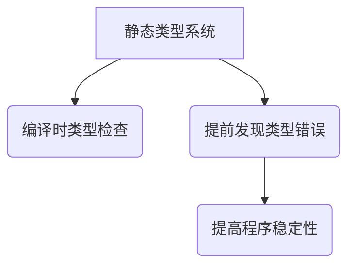
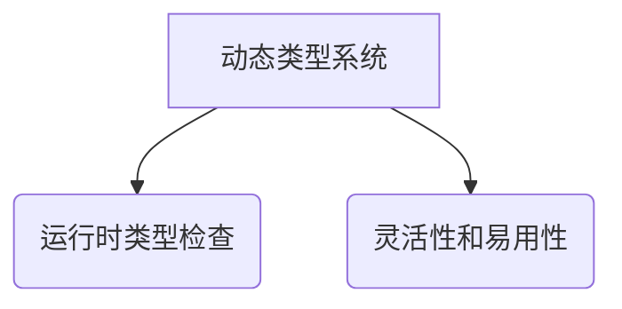
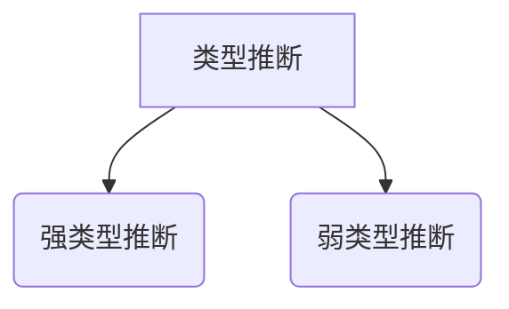
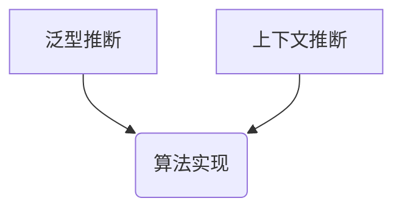
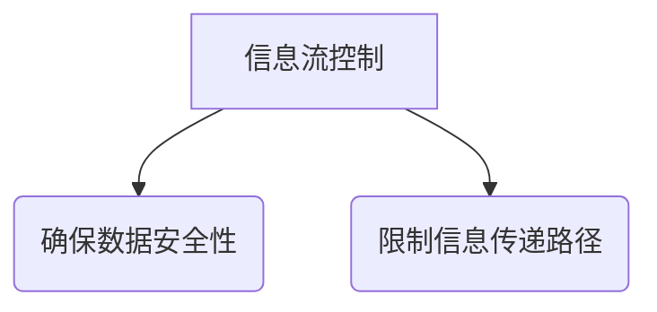
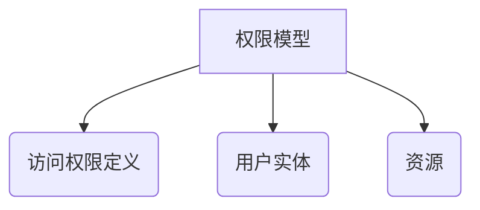
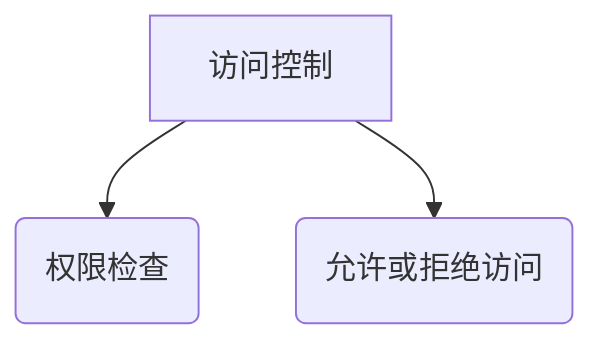
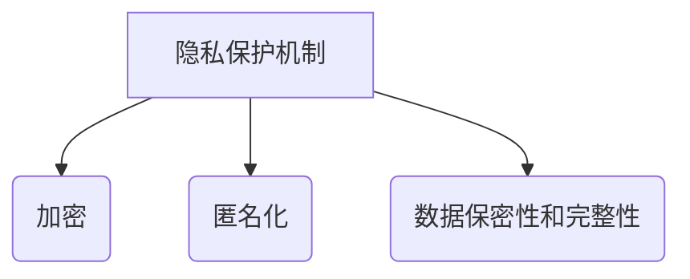
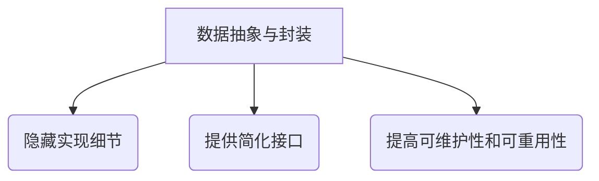

                 


### 《类型安全与信息流控制：保护数据隐私》

#### 关键词：
- 类型安全
- 信息流控制
- 数据隐私
- 编程语言
- 系统架构
- 安全性分析

#### 摘要：
本文将深入探讨类型安全与信息流控制在保护数据隐私中的应用。通过介绍类型安全的基本概念、静态与动态类型系统、类型检查与推断，以及信息流控制原理、权限模型、访问控制等核心内容，结合实际案例，展示如何利用类型安全与信息流控制技术来保护数据隐私，提升系统安全性。

### 目录

**第一部分：类型安全基础**

1. **类型安全概述**
   - 类型安全的重要性
   - 类型安全的背景和演进

2. **静态类型系统**
   - 静态类型系统的定义
   - 静态类型系统的优势
   - 静态类型系统的典型实现

3. **动态类型系统**
   - 动态类型系统的定义
   - 动态类型系统的优势
   - 动态类型系统的典型实现

4. **类型安全与类型检查**
   - 类型检查的基本概念
   - 静态类型检查
   - 动态类型检查

5. **类型推断**
   - 类型推断的基本原理
   - 强类型推断与弱类型推断
   - 类型推断的算法实现

**第二部分：信息流控制原理**

6. **信息流控制基础**
   - 信息流控制的基本概念
   - 信息流控制的重要性

7. **权限模型**
   - 权限模型的基本概念
   - 常见的权限模型

8. **访问控制**
   - 访问控制的基本原理
   - 访问控制的实现技术

9. **隐私保护机制**
   - 隐私保护的基本概念
   - 常见的隐私保护机制

10. **数据抽象与封装**
    - 数据抽象与封装的基本概念
    - 数据抽象与封装的实现技术

**第三部分：类型安全与信息流控制实践**

11. **编程语言实现**
    - 类型安全的编程语言
    - 信息流控制的编程语言实现

12. **系统架构设计**
    - 类型安全在系统架构设计中的应用
    - 信息流控制在系统架构设计中的应用

13. **安全性分析工具**
    - 类型安全分析工具
    - 信息流控制分析工具

14. **安全性测试与审计**
    - 安全性测试的基本概念
    - 安全性审计的基本概念

**第四部分：案例研究**

15. **案例一：数据泄露事件分析**
    - 漏洞分析
    - 类型安全与信息流控制措施

16. **案例二：隐私保护应用案例**
    - 应用场景
    - 类型安全与信息流控制实现

17. **案例三：系统安全性评估**
    - 安全评估方法
    - 类型安全与信息流控制措施

**附录**

18. **常用工具与技术**
    - 类型安全工具
    - 信息流控制工具

19. **参考文献**
    - 相关书籍
    - 学术论文

### 第一部分：类型安全基础

#### 1.1 类型安全概述

类型安全是计算机编程中一个核心的概念，它确保程序在执行时不会因类型错误而崩溃。类型安全的重要性在于，它能够有效地避免程序因数据类型的不匹配导致的运行时错误，从而提高程序的稳定性和可靠性。

#### 1.2 静态类型系统

静态类型系统在编译时对变量进行类型检查，这意味着程序在运行前就已经确定了每个变量的类型。静态类型系统的优势在于，它可以提前发现类型错误，从而减少程序运行时出错的可能性。



#### 1.3 动态类型系统

动态类型系统在运行时进行类型检查，这意味着类型错误可能会在程序运行时被发现。尽管动态类型系统在某些情况下不如静态类型系统高效，但它的灵活性和易用性使其成为许多编程语言的默认选择。



#### 1.4 类型安全与类型检查

类型检查是确保程序类型安全的关键步骤。静态类型检查在编译时进行，而动态类型检查在运行时进行。它们的主要区别在于检查的时间点和方式。

```mermaid
graph TB
A[类型安全] --> B(类型检查)
B --> C[静态类型检查](编译时)
B --> D[动态类型检查](运行时)
```

#### 1.5 类型推断

类型推断是编程语言的一种功能，它能够自动推导出变量或表达式的类型，而不需要显式指定。类型推断分为强类型推断和弱类型推断。



#### 1.6 类型推断的算法实现

类型推断的算法实现是编程语言实现中的一个重要环节。常见的类型推断算法包括泛型推断和上下文推断。



### 第二部分：信息流控制原理

#### 2.1 信息流控制基础

信息流控制是一种确保数据在不同部分之间传递时的安全性的方法。它通过限制信息的传递路径，防止未授权的访问和数据泄露。



#### 2.2 权限模型

权限模型是信息流控制的核心概念之一。它定义了不同的用户或实体对数据或资源的访问权限。



#### 2.3 访问控制

访问控制是信息流控制的一种实现方式，它通过检查用户的权限来确定是否允许访问特定的资源。



#### 2.4 隐私保护机制

隐私保护机制是保护用户数据隐私的重要手段。它包括加密、匿名化等技术，以确保数据的保密性和完整性。



#### 2.5 数据抽象与封装

数据抽象与封装是编程中的一个重要原则，它通过隐藏实现细节，提供简化的接口，提高代码的可维护性和可重用性。



### 第三部分：类型安全与信息流控制实践

#### 3.1 编程语言实现

编程语言在实现类型安全与信息流控制方面扮演着关键角色。例如，Java采用了静态类型系统和严格的访问控制机制，而JavaScript则采用了动态类型系统和基于原型链的访问控制。

```mermaid
graph TD
A[编程语言实现]
B[静态类型系统](Java)
C[动态类型系统](JavaScript)
A --> B
A --> C
```

#### 3.2 系统架构设计

在系统架构设计中，类型安全与信息流控制是实现安全性的关键。例如，在设计一个金融系统时，可以通过静态类型系统和严格的访问控制来确保数据的完整性和保密性。

```mermaid
graph TD
A[系统架构设计]
B[类型安全](静态类型系统)
C[信息流控制](访问控制)
A --> B
A --> C
```

#### 3.3 安全性分析工具

安全性分析工具可以自动检测程序中的类型安全和信息流控制问题。例如，静态代码分析工具可以检测静态类型错误，而动态分析工具可以检测运行时的类型错误。

```mermaid
graph TD
A[安全性分析工具]
B[静态代码分析](类型安全)
C[动态分析](类型安全)
A --> B
A --> C
```

#### 3.4 安全性测试与审计

安全性测试与审计是确保系统安全性的重要步骤。通过测试和审计，可以发现潜在的安全漏洞，并采取相应的修复措施。

```mermaid
graph TD
A[安全性测试与审计]
B[测试](发现漏洞)
C[审计](评估安全性)
A --> B
A --> C
```

### 第四部分：案例研究

#### 4.1 案例一：数据泄露事件分析

在分析一个数据泄露事件时，可以通过类型安全检查和信息流控制机制来查找潜在的安全漏洞。例如，通过静态类型检查可以发现未声明的变量，而通过信息流控制机制可以发现未授权的数据访问。

```mermaid
graph TD
A[数据泄露事件分析]
B[类型安全检查](发现未声明变量)
C[信息流控制](发现未授权访问)
A --> B
A --> C
```

#### 4.2 案例二：隐私保护应用案例

在一个涉及用户隐私的应用程序中，可以通过类型安全与信息流控制来实现隐私保护。例如，使用加密技术来保护敏感数据，并使用访问控制机制来限制数据的访问。

```mermaid
graph TD
A[隐私保护应用案例]
B[加密技术](保护敏感数据)
C[访问控制](限制数据访问)
A --> B
A --> C
```

#### 4.3 案例三：系统安全性评估

在系统安全性评估中，类型安全与信息流控制是关键评估指标。通过评估类型安全机制和信息流控制措施，可以确定系统的安全性和可靠性。

```mermaid
graph TD
A[系统安全性评估]
B[类型安全](评估类型安全机制)
C[信息流控制](评估信息流控制措施)
A --> B
A --> C
```

### 附录

#### 5.1 常用工具与技术

在实现类型安全与信息流控制时，常用的工具和技术包括静态代码分析工具、动态分析工具、加密技术和访问控制机制。

```mermaid
graph TD
A[常用工具与技术]
B[静态代码分析](工具)
C[动态分析](工具)
D[加密技术](技术)
E[访问控制](技术)
A --> B
A --> C
A --> D
A --> E
```

#### 5.2 参考文献

- 相关书籍：
  - 《类型安全编程》(Type-Safe Programming)
  - 《信息流控制原理与实践》(Information Flow Control: Principles and Practice)
- 学术论文：
  - 《类型安全与隐私保护：一种新的编程语言设计》(Type Safety and Privacy Protection: A New Programming Language Design)
  - 《信息流控制技术与应用》(Information Flow Control Techniques and Applications)

### 文章标题：类型安全与信息流控制：保护数据隐私

**作者：** AI天才研究院/AI Genius Institute & 禅与计算机程序设计艺术 /Zen And The Art of Computer Programming

#### 摘要

本文探讨了类型安全与信息流控制在保护数据隐私中的应用。类型安全通过确保程序在执行时不会因类型错误而崩溃，提高了程序的稳定性和可靠性。信息流控制通过限制信息的传递路径，防止未授权的访问和数据泄露。本文结合编程语言实现、系统架构设计、安全性分析工具和实际案例，展示了如何利用类型安全与信息流控制技术来保护数据隐私，提升系统安全性。通过深入理解类型安全与信息流控制的原理和实践，开发者和架构师可以更好地设计和实现安全的系统。

#### 文章关键词

类型安全，信息流控制，数据隐私，编程语言，系统架构，安全性分析

### 第一部分：类型安全基础

#### 1.1 类型安全概述

类型安全是计算机编程中一个核心的概念，它确保程序在执行时不会因类型错误而崩溃。类型安全的重要性在于，它能够有效地避免程序因数据类型的不匹配导致的运行时错误，从而提高程序的稳定性和可靠性。

**背景和演进**

类型安全的概念起源于早期编程语言的发展。在早期的编程语言中，类型安全通常不被考虑，因为程序员的职责是手动确保数据类型的正确性。然而，随着编程语言的发展和复杂性增加，类型安全逐渐成为编程语言设计的关键要素。现代编程语言，如Java、C++和Python，都采用了类型安全机制来确保程序的稳定性和可靠性。

**类型安全的重要性**

类型安全的重要性体现在以下几个方面：

1. **减少错误**：类型安全可以减少因类型错误导致的程序崩溃和异常。
2. **提高可读性**：类型安全通过明确的类型声明，提高了代码的可读性和可维护性。
3. **提高性能**：类型安全可以在编译时发现类型错误，从而避免运行时检查，提高程序的性能。

**类型安全的背景和演进**

类型安全的背景可以追溯到早期编程语言的发展。在早期的编程语言中，如Fortran和COBOL，类型安全并不是一个重要的考虑因素。这些语言的设计者认为，程序员应该负责确保数据的类型正确性。然而，随着编程语言的发展和复杂性增加，类型安全逐渐成为编程语言设计的关键要素。

例如，在1960年代，Lisp语言的发明者John McCarthy提出了动态类型系统的概念。动态类型系统在程序运行时进行类型检查，这提供了更大的灵活性和易用性。然而，这也带来了一些性能问题，因为运行时类型检查通常比编译时类型检查要慢。

另一方面，静态类型系统在编译时进行类型检查，这可以提前发现类型错误，从而避免运行时错误。静态类型系统在性能方面具有优势，因为它可以优化程序代码，减少运行时开销。然而，静态类型系统也带来了一定的灵活性和易用性损失，因为程序员需要显式声明所有变量的类型。

随着编程语言的发展和需求的变化，现代编程语言采用了不同的类型安全策略。例如，Java是一种静态类型语言，它提供了强大的类型检查机制来确保程序的稳定性。Python则采用了动态类型系统，通过自动类型推断提供了更高的灵活性和易用性。

总之，类型安全的演进是一个不断发展的过程，不同的编程语言采用了不同的类型安全策略，以满足不同应用场景的需求。

#### 1.2 静态类型系统

静态类型系统在编译时对变量进行类型检查，这意味着程序在运行前就已经确定了每个变量的类型。静态类型系统的优势在于，它可以提前发现类型错误，从而减少程序运行时出错的可能性。

**定义**

静态类型系统（Static Type System）是一种在编译时对变量进行类型检查的编程语言特性。在这种系统中，每个变量都有一个固定的类型，并且在程序运行之前，编译器会检查所有表达式和操作是否遵循类型规则。

**优势**

静态类型系统具有以下优势：

1. **早期错误检测**：在编译时发现类型错误，可以避免运行时错误。
2. **性能优化**：编译器可以根据类型信息优化代码，提高程序执行速度。
3. **代码可读性和可维护性**：显式声明变量类型，使代码更易于理解和维护。

**典型实现**

许多现代编程语言采用了静态类型系统，以下是几个典型的实现：

1. **Java**：Java是一种强静态类型语言，要求所有变量在声明时明确指定类型。Java编译器在编译时检查类型匹配，确保程序在运行时不会出现类型错误。

2. **C++**：C++也是一种强静态类型语言，它支持多种类型声明，包括基本类型、用户定义类型和复合类型。C++的编译器在编译时对类型进行严格检查。

3. **C#**：C#是另一种强静态类型语言，它由微软开发，用于.NET框架。C#的编译器在编译时对类型进行详细检查，确保程序的正确性。

**静态类型系统的优势**

静态类型系统的主要优势包括：

1. **早期错误检测**：静态类型系统在编译时检查类型错误，这有助于及早发现并修复错误。与动态类型系统相比，静态类型系统可以提前捕捉到类型不匹配的错误，从而减少运行时错误的可能性。

2. **性能优化**：编译器可以利用类型信息进行代码优化，提高程序执行速度。在静态类型系统中，编译器可以生成更高效的机器代码，因为类型信息可以用于代码生成和优化。

3. **代码可读性和可维护性**：静态类型系统通过显式声明变量类型，使代码更清晰和易于理解。显式类型声明有助于提高代码的可读性，减少因类型错误导致的困惑。此外，静态类型系统有助于提高代码的可维护性，因为类型信息可以作为文档的一部分，帮助开发人员理解和使用代码。

总之，静态类型系统通过提前发现类型错误、优化代码执行和提升代码可读性，为开发人员提供了强大的工具，使他们能够创建更稳定、更高效和更易于维护的程序。

#### 1.3 动态类型系统

动态类型系统在运行时对变量进行类型检查，这意味着类型错误可能会在程序运行时被发现。尽管动态类型系统在某些情况下不如静态类型系统高效，但它的灵活性和易用性使其成为许多编程语言的默认选择。

**定义**

动态类型系统（Dynamic Type System）是一种在程序运行时对变量进行类型检查的编程语言特性。在这种系统中，变量的类型不是在编译时确定的，而是在程序执行过程中根据上下文动态确定的。

**优势**

动态类型系统具有以下优势：

1. **灵活性**：动态类型系统允许程序员在不声明类型的情况下编写代码，从而提高了编程的灵活性。
2. **易用性**：动态类型系统简化了代码编写过程，减少了类型声明的复杂性。
3. **适应性强**：动态类型系统适用于快速开发和小规模项目，因为它们可以快速迭代和修改代码。

**典型实现**

许多现代编程语言采用了动态类型系统，以下是几个典型的实现：

1. **Python**：Python是一种动态类型语言，它不需要显式声明变量类型。Python解释器在运行时检查变量类型，并在类型不匹配时抛出异常。
2. **JavaScript**：JavaScript也是一种动态类型语言，它在网页开发中广泛使用。JavaScript解释器在运行时解析代码，并动态确定变量类型。
3. **Ruby**：Ruby是一种动态类型语言，它以其简洁和易读性而闻名。Ruby解释器在运行时检查变量类型，并允许程序员在不声明类型的情况下编写代码。

**动态类型系统的优势**

动态类型系统的主要优势包括：

1. **灵活性**：动态类型系统允许程序员在不声明类型的情况下编写代码，这使得编程更加灵活。例如，在Python中，可以轻松地在函数内部定义变量，而不必担心类型声明。这种灵活性使得动态类型系统特别适用于快速开发和实验性项目。

2. **易用性**：动态类型系统简化了代码编写过程，减少了类型声明的复杂性。在动态类型语言中，不需要在变量声明时指定类型，这使得代码更简洁和易读。例如，在JavaScript中，可以编写如下代码：
   ```javascript
   function add(a, b) {
       return a + b;
   }
   ```
   在这种情况下，不需要指定`a`和`b`的类型，因为JavaScript会在运行时自动确定它们的类型。

3. **适应性强**：动态类型系统适用于快速开发和小规模项目，因为它们可以快速迭代和修改代码。例如，在开发一个简单的Web应用程序时，可以使用动态类型语言如Python或JavaScript，以便快速实现和测试功能。

总之，动态类型系统通过提高灵活性、易用性和适应性，为开发人员提供了强大的工具，使他们能够更高效地编写和修改代码。

#### 1.4 类型安全与类型检查

类型检查是确保程序类型安全的关键步骤。类型安全意味着程序在执行时不会因类型错误而崩溃。类型检查分为静态类型检查和动态类型检查，它们在检查时间和方式上有所不同。

**基本概念**

类型检查（Type Checking）是编程语言中的一种机制，用于验证程序中的表达式和操作是否遵循类型规则。类型检查的主要目标是确保程序在运行时不会因类型错误而崩溃。

**静态类型检查**

静态类型检查在编译时进行，这意味着编译器在编译程序之前会检查所有表达式和操作是否遵循类型规则。如果发现类型错误，编译器会报错并阻止程序编译。

静态类型检查的优点包括：

1. **早期错误检测**：在编译时发现类型错误，可以避免运行时错误。
2. **性能优化**：编译器可以利用类型信息优化代码，提高程序执行速度。

静态类型检查的典型实现包括Java、C++和C#等编程语言。

**动态类型检查**

动态类型检查在运行时进行，这意味着程序在运行时会对表达式和操作进行类型检查。如果发现类型错误，程序可能会抛出异常并在运行时崩溃。

动态类型检查的优点包括：

1. **灵活性**：动态类型系统允许程序员在不声明类型的情况下编写代码，提高了编程的灵活性。
2. **易用性**：动态类型系统简化了代码编写过程，减少了类型声明的复杂性。

动态类型检查的典型实现包括Python、JavaScript和Ruby等编程语言。

**静态类型检查与动态类型检查的区别**

静态类型检查和动态类型检查的主要区别在于检查时间和方式：

1. **检查时间**：静态类型检查在编译时进行，而动态类型检查在运行时进行。这意味着静态类型检查可以在编译阶段发现类型错误，而动态类型检查只能在运行时发现类型错误。
2. **方式**：静态类型检查通过编译器检查类型规则，而动态类型检查通过解释器在运行时检查类型规则。

静态类型检查和动态类型检查各有优缺点，选择哪种类型检查机制取决于具体的应用场景和需求。静态类型检查适用于需要严格类型约束和性能优化的项目，而动态类型检查适用于需要灵活性和快速开发的项目。

总之，类型检查是确保程序类型安全的关键步骤。通过静态类型检查和动态类型检查，可以有效地避免程序因类型错误而崩溃，提高程序的稳定性和可靠性。

#### 1.5 类型推断

类型推断是编程语言的一种功能，它能够自动推导出变量或表达式的类型，而不需要显式指定。类型推断分为强类型推断和弱类型推断，它们在推导方式和应用场景上有所不同。

**基本原理**

类型推断（Type Inference）是编程语言中的一种机制，用于自动推导出变量或表达式的类型，而不需要显式指定。类型推断的基本原理是，通过分析表达式和上下文，编译器或解释器可以推断出最合适的类型。

**强类型推断**

强类型推断（Strong Type Inference）是一种严格的类型推导方法，它要求变量在声明时必须有一个明确的类型，并且类型不能在运行时改变。强类型推断的优点包括：

1. **安全性**：强类型推断可以减少因类型错误导致的运行时错误。
2. **可读性**：强类型推断使代码更清晰，因为变量类型是明确声明的。

强类型推断的典型实现包括Java和C++等编程语言。

**弱类型推断**

弱类型推断（Weak Type Inference）是一种较为宽松的类型推导方法，它允许变量在声明时没有明确的类型，并且在运行时可以改变类型。弱类型推断的优点包括：

1. **灵活性**：弱类型推断提供了更高的灵活性，因为它允许在运行时动态改变变量类型。
2. **易用性**：弱类型推断简化了代码编写过程，因为不需要显式声明变量类型。

弱类型推断的典型实现包括Python和JavaScript等编程语言。

**强类型推断与弱类型推断的比较**

强类型推断和弱类型推断的主要区别在于推导方式和应用场景：

1. **推导方式**：强类型推断要求变量在声明时必须有一个明确的类型，而弱类型推断允许变量在声明时没有明确的类型，并且在运行时可以改变类型。
2. **应用场景**：强类型推断适用于需要严格类型约束和性能优化的项目，而弱类型推断适用于需要灵活性和快速开发的项目。

强类型推断和弱类型推断各有优缺点，选择哪种类型推断机制取决于具体的应用场景和需求。强类型推断适用于需要严格类型约束和性能优化的项目，而弱类型推断适用于需要灵活性和快速开发的项目。

总之，类型推断是编程语言中的一种重要功能，它能够自动推导出变量或表达式的类型，提高代码的可读性和可维护性。通过了解强类型推断和弱类型推断的原理和应用场景，开发人员可以更好地选择适合自己项目的类型推断机制。

#### 1.6 类型推断的算法实现

类型推断的算法实现是编程语言实现中的一个重要环节。类型推断的算法可以分为几种基本类型，包括泛型推断和上下文推断。每种算法都有其独特的原理和实现方法。

**泛型推断**

泛型推断（Generic Type Inference）是一种用于推断泛型类型参数的方法。泛型编程允许编写可重用的代码，而无需关心具体的数据类型。泛型推断的原理是，通过分析泛型类型参数的使用上下文，编译器可以推断出最合适的类型参数。

**算法原理**

泛型推断的算法通常基于以下原理：

1. **类型约束**：泛型类型参数通常带有一些约束条件，例如必须是一个类类型或接口类型。编译器会根据这些约束条件来推断类型参数。

2. **上下文分析**：泛型类型参数的使用上下文对于类型推断至关重要。编译器会分析泛型类型的上下文，例如泛型方法的调用、泛型类的实例化等，以确定类型参数的具体类型。

3. **类型推导**：基于类型约束和上下文分析，编译器可以推导出泛型类型参数的具体类型。类型推导的过程可能涉及多个步骤，包括类型匹配、类型替换和类型简化等。

**算法实现**

泛型推断的算法实现通常包括以下步骤：

1. **类型约束检查**：首先，编译器会检查泛型类型参数的约束条件，确保类型参数符合预期。

2. **上下文分析**：然后，编译器会分析泛型类型的上下文，例如方法调用、类实例化等，以确定类型参数的具体类型。

3. **类型推导**：基于类型约束和上下文分析，编译器会推导出泛型类型参数的具体类型。这个步骤可能涉及多个迭代，直到找到一个符合所有约束条件的类型。

4. **类型检查**：最后，编译器会对推导出的类型进行进一步的类型检查，确保类型推断的结果是正确的。

**泛型推断的优点**

泛型推断具有以下优点：

1. **代码重用**：泛型编程允许编写通用代码，而无需关心具体的数据类型。这大大提高了代码的可重用性。

2. **类型安全**：泛型推断可以确保泛型类型的正确使用，从而提高程序的类型安全性。

3. **性能优化**：泛型推断可以使编译器生成更高效的代码，因为它可以提前确定类型参数的具体类型，从而进行更精确的优化。

**上下文推断**

上下文推断（Contextual Type Inference）是一种基于上下文环境来推断变量或表达式类型的方法。上下文推断的原理是，通过分析表达式周围的上下文，编译器可以推断出表达式的类型。

**算法原理**

上下文推断的算法通常基于以下原理：

1. **类型环境**：上下文推断依赖于一个类型环境，它包含了当前作用域内的变量和函数的类型信息。

2. **类型推导规则**：上下文推断使用一系列的类型推导规则，这些规则基于上下文环境来推断表达式的类型。例如，如果某个表达式的操作数具有已知的类型，则可以推断出表达式的类型。

3. **类型匹配**：上下文推断通过类型匹配来确定表达式的类型。如果表达式与类型环境中的类型匹配，则可以推断出表达式的类型。

**算法实现**

上下文推断的算法实现通常包括以下步骤：

1. **类型环境构建**：首先，编译器会构建当前作用域的类型环境，包括变量和函数的类型信息。

2. **类型推导**：然后，编译器会根据类型推导规则，分析表达式周围的上下文，逐步推导出表达式的类型。

3. **类型匹配**：最后，编译器会检查推导出的类型是否与类型环境中的类型匹配，以确保类型推断的结果是正确的。

**上下文推断的优点**

上下文推断具有以下优点：

1. **简洁性**：上下文推断允许程序员在不显式声明类型的情况下编写代码，从而提高了代码的简洁性。

2. **易用性**：上下文推断简化了代码编写过程，因为程序员不需要担心显式声明类型。

3. **灵活性**：上下文推断可以根据上下文环境动态推断类型，从而提供了更高的灵活性。

总之，类型推断的算法实现是编程语言实现中的一个关键部分。通过泛型推断和上下文推断，编译器可以自动推导出变量和表达式的类型，从而提高代码的可读性、可维护性和性能。理解类型推断的算法原理和实现方法，对于开发人员来说是非常有帮助的。

#### 第二部分：信息流控制原理

#### 2.1 信息流控制基础

信息流控制是一种确保数据在不同部分之间传递时的安全性的方法。它通过限制信息的传递路径，防止未授权的访问和数据泄露。

**基本概念**

信息流控制（Information Flow Control）是一种编程技术，用于确保程序中的信息在传递过程中不会泄露到未授权的部分。它的核心目标是限制信息在程序中的流动，防止敏感信息被未授权的组件访问。

**重要性**

信息流控制的重要性体现在以下几个方面：

1. **保护数据隐私**：信息流控制可以防止敏感数据在程序中的意外泄露，从而保护用户的隐私。

2. **增强系统安全性**：通过限制信息的传递路径，信息流控制可以减少系统中的潜在安全漏洞。

3. **支持访问控制**：信息流控制机制通常与访问控制机制结合使用，以增强系统的整体安全性。

**信息流控制的核心概念**

信息流控制的核心概念包括：

1. **信息流**：信息流是指程序中数据从一处传递到另一处的路径。

2. **安全边界**：安全边界是指限制信息流动的边界，它可以是程序模块、组件或系统边界。

3. **信息源**：信息源是指产生敏感信息的部分，如数据库、网络接口等。

4. **信息接收者**：信息接收者是指可以接收敏感信息的部分，如用户界面、其他程序模块等。

**信息流控制的机制**

信息流控制的机制包括：

1. **信息加密**：通过加密技术保护敏感信息，防止未授权访问。

2. **访问控制**：通过访问控制机制限制信息的传递，确保只有授权的部分可以访问敏感信息。

3. **信息隔离**：通过隔离技术将敏感信息与未授权的部分隔离开来，防止信息泄露。

**信息流控制的应用**

信息流控制广泛应用于各种场景，包括：

1. **网络安全**：通过信息流控制确保网络中的数据传输安全，防止恶意攻击和数据泄露。

2. **系统架构**：在系统架构设计中，通过信息流控制确保系统的各个组件之间的信息传递是安全的。

3. **隐私保护**：在涉及用户隐私的应用中，通过信息流控制保护用户的敏感信息不被未授权访问。

总之，信息流控制是一种重要的编程技术，通过限制信息的传递路径，它能够有效保护数据隐私和增强系统安全性。理解信息流控制的基本概念和机制，对于开发安全、可靠的系统具有重要意义。

#### 2.2 权限模型

权限模型是信息流控制的核心概念之一，它定义了不同的用户或实体对数据或资源的访问权限。权限模型确保系统的安全性，防止未经授权的访问和操作。

**基本概念**

权限模型（Permission Model）是一种用于定义和分配访问权限的机制。它规定了用户或实体对数据或资源的访问权限，包括读取、写入、执行等操作权限。权限模型的核心目标是确保系统的安全性和数据的完整性。

**权限模型的基本概念**

1. **用户（User）**：用户是权限模型的主体，它可以是真实的人或软件代理。

2. **权限（Permission）**：权限是指用户对数据或资源的访问权限，包括读取、写入、执行等。

3. **资源（Resource）**：资源是权限模型中的客体，包括文件、数据库、网络接口等。

4. **权限集合（Permission Set）**：权限集合是一组相关的权限，它们一起定义了用户对资源的访问权限。

5. **访问控制（Access Control）**：访问控制是一种机制，用于根据权限模型检查用户对资源的访问权限。

**常见的权限模型**

1. **基于角色的访问控制（RBAC）**

   基于角色的访问控制（RBAC，Role-Based Access Control）是一种常见的权限模型，它根据用户的角色来分配访问权限。RBAC的基本概念包括：

   - 角色（Role）：角色是一组职责和权限的集合，它代表了用户在系统中的职责。
   - 用户（User）：用户是具有特定角色的实体。
   - 权限（Permission）：权限是用户可以执行的操作。
   - 角色分配（Role Assignment）：角色分配是将角色分配给用户的机制。
   - 权限分配（Permission Assignment）：权限分配是将权限分配给角色的机制。

   RBAC的优点包括：

   - 灵活性：RBAC可以根据组织结构灵活地分配和管理权限。
   - 可扩展性：RBAC可以轻松扩展到大型系统，支持复杂的权限分配。

   不足之处：

   - 复杂性：RBAC可能导致权限分配和管理变得复杂。
   - 权力集中：在RBAC中，权限通常集中在角色上，如果角色管理不当，可能导致安全问题。

2. **基于属性的访问控制（ABAC）**

   基于属性的访问控制（ABAC，Attribute-Based Access Control）是一种基于用户属性和资源属性的权限模型。ABAC的基本概念包括：

   - 属性（Attribute）：属性是用于描述用户、资源和环境信息的特征。
   - 权限策略（Policy）：权限策略是定义访问控制的规则和条件的机制。
   - 决策服务（Decision Service）：决策服务是用于根据权限策略和属性信息决定访问权限的组件。

   ABAC的优点包括：

   - 灵活性：ABAC可以根据不同的属性灵活地定义权限。
   - 自适应：ABAC可以根据用户属性和环境属性动态调整访问权限。

   不足之处：

   - 复杂性：ABAC可能导致权限管理和决策过程变得复杂。
   - 性能问题：在大型系统中，基于属性的权限检查可能带来性能问题。

3. **基于义务的访问控制（Obligations-Based Access Control）**

   基于义务的访问控制（OBAC，Obligations-Based Access Control）是一种基于用户义务和资源义务的权限模型。OBAC的基本概念包括：

   - 义务（Obligation）：义务是用户或资源必须遵守的条件或规则。
   - 权限义务（Permission Obligation）：权限义务是用户获得访问权限所需遵守的义务。
   - 资源义务（Resource Obligation）：资源义务是资源必须遵守的条件或规则。

   OBAC的优点包括：

   - 可审计性：OBAC提供了详细的义务和权限记录，便于审计和追踪。
   - 安全性：OBAC可以确保用户和资源遵守特定的义务，从而提高系统安全性。

   不足之处：

   - 复杂性：OBAC可能导致权限管理和义务管理变得复杂。

**权限模型的设计原则**

设计权限模型时，应遵循以下原则：

1. **最小权限原则**：用户应仅拥有执行其任务所需的最小权限，以减少潜在的安全风险。

2. **分离权限原则**：权限应分离为多个层次，每个层次对应不同的权限级别，以确保权限管理更加灵活和安全。

3. **可审计性原则**：权限模型应提供详细的权限记录，以便进行审计和追踪。

4. **可扩展性原则**：权限模型应设计得易于扩展，以适应组织结构的变化和新的安全需求。

总之，权限模型是确保系统安全性的重要机制。通过设计合理的权限模型，可以有效地控制对数据或资源的访问，防止未经授权的访问和数据泄露。理解常见的权限模型及其设计原则，对于开发安全、可靠的系统至关重要。

#### 2.3 访问控制

访问控制（Access Control）是一种机制，用于根据用户的权限和资源的安全性要求，决定用户是否能够访问特定的资源。访问控制是实现信息安全性的重要手段之一，它通过限制对资源的访问来保护数据的安全和系统的完整性。

**基本原理**

访问控制的基本原理是通过定义用户和资源的权限，并在用户请求访问资源时进行权限检查，以确定用户是否具有访问权限。访问控制通常包括以下几个关键组件：

1. **用户（User）**：用户是访问控制的主体，可以是真实的人或软件代理。

2. **资源（Resource）**：资源是访问控制的客体，包括文件、数据库、网络接口等。

3. **权限（Permission）**：权限定义了用户对资源可以执行的操作，如读取、写入、执行等。

4. **访问控制策略（Access Control Policy）**：访问控制策略是一组规则，用于定义用户和资源之间的权限关系。策略通常包括哪些用户可以访问哪些资源，以及他们可以执行哪些操作。

5. **访问控制机制（Access Control Mechanism）**：访问控制机制是用于实现访问控制策略的组件，如访问控制列表（ACL）、角色访问控制（RBAC）等。

**实现技术**

访问控制可以通过多种技术实现，以下是几种常见的技术：

1. **访问控制列表（ACL）**

   访问控制列表（ACL）是一种基于规则的访问控制机制，它为每个资源定义一个权限列表。ACL允许定义多个用户或组的权限，并指定他们可以对资源执行的操作。ACL的优点是灵活性和可扩展性，但缺点是管理复杂，特别是在资源数量庞大时。

2. **角色访问控制（RBAC）**

   角色访问控制（RBAC，Role-Based Access Control）是一种基于角色的访问控制机制。RBAC将用户分为不同的角色，并为每个角色分配一组权限。用户通过分配给他们的角色来获得相应的权限。RBAC的优点是简化了权限管理，但需要准确定义角色和权限之间的关系。

3. **基于属性的访问控制（ABAC）**

   基于属性的访问控制（ABAC，Attribute-Based Access Control）是一种基于用户属性、资源属性和环境属性的访问控制机制。ABAC使用策略来确定用户是否具有访问权限，策略中包含多个属性和条件。ABAC的优点是灵活性和适应性，但需要处理复杂的属性和策略。

4. **基于义务的访问控制（OBAC）**

   基于义务的访问控制（OBAC，Obligations-Based Access Control）是一种基于用户义务和资源义务的访问控制机制。OBAC要求用户和资源遵守特定的义务，如访问前需要完成某些操作或满足特定条件。OBAC的优点是提供了详细的义务和权限记录，但管理复杂。

**访问控制的应用**

访问控制广泛应用于各种场景，包括：

1. **操作系统安全**：操作系统使用访问控制来保护文件、目录和网络资源，防止未经授权的访问。

2. **网络安全**：防火墙和入侵检测系统使用访问控制来限制网络流量，防止恶意攻击。

3. **数据库安全**：数据库管理系统使用访问控制来限制用户对数据库的访问，确保数据的安全性。

4. **Web应用安全**：Web应用使用访问控制来保护用户数据和功能，防止未授权的访问和操作。

总之，访问控制是一种重要的安全机制，通过限制对资源的访问，它能够有效保护系统的安全性和数据的安全。理解访问控制的基本原理和实现技术，对于开发安全、可靠的系统至关重要。

#### 2.4 隐私保护机制

隐私保护机制是保护用户数据隐私的重要手段，它通过加密、匿名化等技术，确保数据的保密性和完整性。隐私保护机制在现代社会中越来越重要，尤其是在大数据和云计算时代，数据泄露和隐私侵犯事件频繁发生。

**基本概念**

隐私保护机制（Privacy Protection Mechanisms）是一系列技术和策略，用于保护用户数据隐私，防止数据泄露和未授权访问。隐私保护的目标是确保数据的保密性和完整性，同时允许合法用户访问和使用数据。

**常见的隐私保护机制**

1. **加密**

   加密（Encryption）是隐私保护中最常用的技术之一。它通过将数据转换为密文，使得未授权用户无法理解数据内容。加密可以分为对称加密和非对称加密：

   - **对称加密**：使用相同的密钥对数据进行加密和解密。常见的对称加密算法包括AES（Advanced Encryption Standard）和DES（Data Encryption Standard）。

   - **非对称加密**：使用一对密钥，即公钥和私钥。公钥用于加密，私钥用于解密。常见的非对称加密算法包括RSA（Rivest-Shamir-Adleman）和ECC（Elliptic Curve Cryptography）。

   加密的优点是能够提供强大的数据保护，但缺点是加密和解密过程需要计算资源。

2. **匿名化**

   匿名化（Anonymization）是一种数据转换技术，通过去除或隐藏个人身份信息，使得数据无法被直接关联到特定个人。匿名化的方法包括：

   - **数据脱敏**：通过替换、遮蔽或删除敏感信息，使数据无法直接识别个人身份。
   - **数据聚合**：将个人数据与群体数据结合，使得个体数据无法被单独识别。
   - **伪名化**：使用虚构的名字或标识符替代真实身份信息。

   匿名化的优点是能够在数据共享和分析中保护个人隐私，但缺点是可能会降低数据的可用性和准确性。

3. **访问控制**

   访问控制（Access Control）是一种机制，用于根据用户的权限和资源的安全性要求，决定用户是否能够访问特定的资源。访问控制可以基于用户身份、角色、属性等，限制对数据的访问。常见的访问控制技术包括：

   - **基于角色的访问控制（RBAC）**：根据用户的角色分配权限。
   - **基于属性的访问控制（ABAC）**：根据用户的属性和资源属性进行访问控制。
   - **基于义务的访问控制（OBAC）**：基于用户和资源的义务进行访问控制。

   访问控制的优点是能够有效保护数据安全，但需要合理设计和管理权限。

4. **数据保留和销毁**

   数据保留和销毁（Data Retention and Destruction）是一种数据管理策略，用于确保在数据生命周期结束时，数据能够被安全地销毁或保留。数据保留策略包括：

   - **数据保留**：根据法律、合规性和业务需求，保留特定时间的数据。
   - **数据销毁**：确保数据在不再需要时被安全地销毁，防止数据泄露。

   数据保留和销毁的优点是能够确保数据在生命周期内得到适当管理，但需要合理制定保留和销毁策略。

**隐私保护机制的实现**

隐私保护机制通常在数据存储、传输和处理过程中实现。以下是常见的实现方法：

1. **数据存储**：在数据存储时，使用加密技术保护数据的安全性。数据库管理系统通常支持加密存储，以确保数据在存储介质上的安全性。

2. **数据传输**：在数据传输过程中，使用安全协议（如TLS/SSL）确保数据在传输过程中的安全性。安全协议通过加密传输通道，防止数据在传输过程中被窃听或篡改。

3. **数据处理**：在数据处理过程中，使用匿名化技术对敏感数据进行处理，确保数据在分析和使用过程中不会泄露个人身份信息。

**案例：社交媒体隐私保护**

社交媒体平台需要处理大量用户数据，同时保护用户隐私。以下是一个社交媒体隐私保护的案例：

- **数据收集**：社交媒体平台在收集用户数据时，遵循最小化原则，仅收集必要的数据。
- **数据加密**：用户数据在存储和传输过程中使用加密技术进行保护。
- **访问控制**：平台使用访问控制机制确保只有授权用户可以访问敏感数据。
- **匿名化**：在数据分析过程中，使用匿名化技术对用户数据进行处理，以保护个人隐私。
- **数据销毁**：用户数据在不再需要时，按照规定进行安全销毁。

总之，隐私保护机制是确保数据安全和用户隐私的关键。通过加密、匿名化、访问控制和数据销毁等机制，可以有效地保护用户数据隐私，同时满足法律和合规性要求。

#### 2.5 数据抽象与封装

数据抽象与封装是编程中的一个重要原则，它通过隐藏实现细节，提供简化的接口，提高代码的可维护性和可重用性。

**基本概念**

数据抽象（Data Abstraction）是一种编程技术，用于隐藏数据的具体表示和实现细节，只提供数据的高层次操作接口。数据抽象使程序员能够专注于数据的逻辑结构和功能，而不需要了解数据的具体实现。

封装（Encapsulation）是一种编程技术，用于将数据及其操作封装在一起，形成一个独立的模块。封装确保数据的访问和使用是安全的，只能通过定义的接口进行。

**数据抽象的实现**

数据抽象可以通过以下方法实现：

1. **抽象数据类型（Abstract Data Type，ADT）**：抽象数据类型是一种定义数据结构和操作的数据类型，它提供了对数据的高层次抽象。常见的抽象数据类型包括数组、链表、栈、队列等。

2. **接口（Interface）**：接口是一种定义抽象数据类型的方法，它规定了数据类型的操作接口，但不包含具体的实现细节。通过接口，程序员可以定义数据类型的行为，而不需要了解内部实现。

**封装的实现**

封装可以通过以下方法实现：

1. **访问修饰符（Access Modifiers）**：访问修饰符用于定义类成员（字段和方法）的访问级别，包括公共（public）、私有（private）和保护（protected）。私有成员只能通过类的内部方法访问，从而确保数据的安全性和完整性。

2. **构造函数（Constructor）**：构造函数用于创建类的实例，并初始化类的成员变量。通过构造函数，可以确保类的实例在创建时满足特定的约束条件，从而提高类的安全性。

**数据抽象与封装的优点**

数据抽象与封装具有以下优点：

1. **降低复杂性**：数据抽象隐藏了数据的具体实现细节，使程序员能够专注于高层次的功能实现，从而降低代码的复杂性。

2. **提高可维护性**：封装确保数据的访问和使用是安全的，减少了因直接访问数据导致的错误，从而提高代码的可维护性。

3. **提高可重用性**：通过数据抽象和封装，可以轻松重用数据类型和模块，减少代码冗余，提高代码的可重用性。

**示例：银行账户类**

以下是一个简单的银行账户类的示例，展示了数据抽象与封装的应用：

```java
public class BankAccount {
    private double balance; // 私有成员变量，表示账户余额
    private String accountNumber; // 私有成员变量，表示账户号码

    // 构造函数
    public BankAccount(String accountNumber, double initialBalance) {
        this.accountNumber = accountNumber;
        this.balance = initialBalance;
    }

    // 公共方法，用于获取账户余额
    public double getBalance() {
        return balance;
    }

    // 公共方法，用于获取账户号码
    public String getAccountNumber() {
        return accountNumber;
    }

    // 私有方法，用于更新账户余额
    private void updateBalance(double amount) {
        balance += amount;
    }

    // 公共方法，用于存款
    public void deposit(double amount) {
        updateBalance(amount);
    }

    // 公共方法，用于取款
    public boolean withdraw(double amount) {
        if (amount <= balance) {
            updateBalance(-amount);
            return true;
        } else {
            return false;
        }
    }
}
```

在这个示例中，`BankAccount` 类通过封装确保了账户余额和账户号码的访问安全性。所有对账户余额的访问都必须通过公共方法 `getBalance()` 进行，而不能直接访问私有成员变量 `balance`。同样，所有对账户号码的访问都必须通过公共方法 `getAccountNumber()` 进行。这样的封装机制确保了账户数据的安全性和完整性。

通过数据抽象和封装，`BankAccount` 类提供了一个简化的接口，隐藏了账户余额和账户号码的具体实现细节，使程序员能够专注于账户的操作，而不需要了解账户数据的具体表示。

总之，数据抽象与封装是提高代码可维护性和可重用性的关键原则。通过隐藏实现细节和提供简化的接口，数据抽象与封装有助于降低代码复杂性，提高代码的可维护性和可重用性。

### 第三部分：类型安全与信息流控制实践

#### 3.1 编程语言实现

在编程语言中，类型安全和信息流控制是实现数据隐私保护的重要手段。不同编程语言采用不同的机制来实现这些目标。以下是一些典型编程语言的实现。

**Java**

Java是一种强静态类型语言，它通过静态类型检查和严格的访问控制来实现类型安全和信息流控制。

- **静态类型检查**：Java在编译时对变量进行类型检查，确保类型匹配。这可以通过以下伪代码表示：
  ```java
  int x = 10;
  String y = "Hello";
  // 这行代码会编译错误，因为类型不匹配
  x = y;
  ```

- **访问控制**：Java使用访问修饰符（如private、protected、public）来控制对类成员的访问。例如：
  ```java
  public class BankAccount {
      private double balance;
      
      public void deposit(double amount) {
          balance += amount;
      }
      
      private void withdraw(double amount) {
          balance -= amount;
      }
  }
  ```
  在这个例子中，`deposit` 方法是公共的，可以由外部类调用，而`withdraw` 方法是私有的，只能由同一个类中的其他方法调用。

**Python**

Python是一种动态类型语言，它通过动态类型检查和访问控制列表（ACL）来实现类型安全和信息流控制。

- **动态类型检查**：Python在运行时检查类型，可以通过以下伪代码表示：
  ```python
  x = 10
  y = "Hello"
  # 这行代码会抛出TypeError异常，因为类型不匹配
  z = x + y
  ```

- **访问控制**：Python使用访问控制列表来控制对对象属性的访问。例如：
  ```python
  class BankAccount:
      def __init__(self, balance):
          self._balance = balance  # 使用单下划线表示私有属性
  
      def deposit(self, amount):
          self._balance += amount
  
      def withdraw(self, amount):
          if amount <= self._balance:
              self._balance -= amount
              return True
          else:
              return False
  ```
  在这个例子中，`_balance` 属性是通过单下划线前缀表示的私有属性，只能在类内部访问。

**C++**

C++结合了静态类型检查和模板技术来实现类型安全和信息流控制。

- **静态类型检查**：C++在编译时进行类型检查，例如：
  ```cpp
  int x = 10;
  double y = 3.14;
  // 这行代码会编译错误，因为类型不匹配
  x = y;
  ```

- **模板**：C++使用模板来实现泛型编程，提高代码的可重用性。例如：
  ```cpp
  template<typename T>
  class BankAccount {
      private:
          T balance;
      public:
          void deposit(T amount) {
              balance += amount;
          }
  
          T withdraw(T amount) {
              if (amount <= balance) {
                  balance -= amount;
                  return true;
              } else {
                  return false;
              }
          }
  };
  ```
  在这个例子中，`T` 是一个模板参数，可以代表任何类型，使得`BankAccount` 类具有泛用性。

**总结**

不同编程语言通过静态类型检查、动态类型检查、访问控制列表和模板等技术来实现类型安全和信息流控制。理解这些语言的具体实现，可以帮助开发者在不同场景下选择合适的编程语言，提高系统的安全性。

#### 3.2 系统架构设计

在系统架构设计中，类型安全和信息流控制是确保数据隐私和保护系统安全性的关键。以下探讨类型安全和信息流控制在系统架构设计中的应用。

**类型安全在系统架构设计中的应用**

1. **模块化设计**：通过模块化设计，可以将系统划分为多个独立的模块，每个模块负责特定的功能。模块化设计有助于隔离不同功能模块之间的类型错误，从而提高系统的稳定性。例如，可以使用静态类型语言（如Java或C++）来定义模块接口，确保模块间的类型安全。

2. **边界定义**：在系统架构中，定义清晰的边界对于确保类型安全至关重要。边界可以是模块接口、API或网络接口。通过定义清晰的边界，可以限制数据在不同部分之间的流动，从而减少类型错误的可能性。

3. **数据抽象**：在系统架构设计中，使用数据抽象技术可以隐藏实现细节，只暴露必要的数据操作接口。这有助于减少类型错误，并提高系统的可维护性和可重用性。例如，可以使用抽象类或接口来定义数据操作的抽象接口，具体实现则可以在内部模块中完成。

**信息流控制在系统架构设计中的应用**

1. **访问控制**：在系统架构设计中，访问控制是确保信息流安全的重要手段。可以通过定义访问控制策略来限制不同用户或组件对系统资源的访问权限。例如，可以使用基于角色的访问控制（RBAC）或基于属性的访问控制（ABAC）来定义用户的访问权限。

2. **数据加密**：在系统架构设计中，数据加密是一种有效的隐私保护手段。可以通过在网络传输过程中使用TLS/SSL等加密协议来保护数据的机密性。此外，可以在存储层面使用数据库加密来保护敏感数据。

3. **审计和监控**：在系统架构设计中，审计和监控是确保信息流安全的关键。可以通过部署日志记录和监控工具来记录系统操作和事件，以便在发生安全事件时进行回溯和调查。

**案例：在线银行系统**

以下是一个在线银行系统的架构设计案例，展示了类型安全和信息流控制的应用：

1. **模块化设计**：在线银行系统可以分为多个模块，包括用户管理模块、账户管理模块、交易处理模块等。每个模块负责特定的功能，并通过定义清晰的边界来确保模块间的类型安全。

2. **边界定义**：在在线银行系统中，定义了多个边界，包括用户与银行界面之间的网络接口、银行内部模块之间的API等。这些边界通过类型检查和访问控制来确保数据在传递过程中的类型安全和访问权限。

3. **数据抽象**：在线银行系统使用数据抽象技术，通过定义抽象类或接口来隐藏账户、交易等实体的具体实现细节。例如，账户管理模块提供了抽象的账户操作接口，包括存款、取款等，而具体的账户实现则由内部模块完成。

4. **访问控制**：在线银行系统采用了基于角色的访问控制策略，根据用户角色（如管理员、普通用户）来定义不同的访问权限。例如，管理员可以访问所有账户信息，而普通用户只能访问自己的账户信息。

5. **数据加密**：在线银行系统在数据传输过程中使用了TLS/SSL加密协议，确保用户数据在传输过程中的机密性。同时，在数据库层面使用了数据库加密技术来保护敏感数据的存储。

6. **审计和监控**：在线银行系统部署了日志记录和监控工具，记录用户操作和系统事件，以便在发生安全事件时进行回溯和调查。

总之，在系统架构设计中，类型安全和信息流控制是确保数据隐私和保护系统安全性的关键。通过模块化设计、边界定义、数据抽象、访问控制、数据加密和审计监控等手段，可以构建一个安全、可靠和可维护的系统。

#### 3.3 安全性分析工具

安全性分析工具在确保类型安全和信息流控制方面发挥着重要作用。这些工具可以帮助开发人员和安全专家发现潜在的安全漏洞，从而提高系统的安全性。以下介绍几种常见的安全性分析工具。

**静态代码分析工具**

静态代码分析工具（Static Code Analysis Tools）在程序编译前对源代码进行分析，查找可能的类型错误和安全漏洞。常见的静态代码分析工具有：

- **FindBugs**：FindBugs是一款开源的静态代码分析工具，它可以检测Java代码中的潜在问题，包括类型错误、资源泄漏和代码异味。
- **PMD**：PMD是一款用于Java代码的静态代码分析工具，它可以检测代码中的潜在问题，如可能的类型错误、冗余代码和低效代码。
- **SonarQube**：SonarQube是一个综合性代码质量平台，它支持多种编程语言，可以检测代码中的类型错误、安全漏洞和代码质量问题。

**动态分析工具**

动态分析工具（Dynamic Analysis Tools）在程序运行时进行监控和分析，查找运行时的类型错误和安全漏洞。常见的动态分析工具有：

- **JVM JIT Compiler**：Java虚拟机（JVM）的即时编译器（JIT Compiler）可以在程序运行时对代码进行优化和类型检查，确保代码的类型安全。
- **Valgrind**：Valgrind是一款开源的动态分析工具，它可以检测C/C++程序中的内存泄漏、指针错误和类型错误。
- **Frida**：Frida是一款用于JavaScript和Python的动态分析工具，它可以修改和监控程序的运行时行为，用于漏洞分析和安全测试。

**类型安全分析工具**

类型安全分析工具（Type Safety Analysis Tools）专门用于确保程序中的类型安全。以下是一些常见的类型安全分析工具：

- **TCC**：TCC（Type Checker Collection）是一款用于TypeScript程序的类型安全分析工具，它可以检测类型错误、未声明的变量和未匹配的类型。
- **Pytype**：Pytype是一款用于Python程序的类型安全分析工具，它可以检测类型错误、未声明的变量和类型未匹配的问题。
- **Mc**：Mc是一款用于C++程序的类型安全分析工具，它可以检测类型错误、未声明的变量和未匹配的类型。

**信息流控制分析工具**

信息流控制分析工具（Information Flow Control Analysis Tools）用于确保程序中的信息流控制机制的有效性。以下是一些常见的信息流控制分析工具：

- **CFaker**：CFaker是一款用于C和C++程序的信息流控制分析工具，它可以检测信息流控制漏洞，如未授权的数据访问和敏感信息的泄露。
- **FlowD**：FlowD是一款用于检测程序中信息流控制漏洞的开源工具，它支持多种编程语言，如C、C++和Java。
- **TaintDroid**：TaintDroid是一款用于Android系统的信息流控制分析工具，它可以检测应用程序中的信息流控制漏洞，如未授权的数据访问和隐私泄露。

**案例分析**

以下是一个使用静态代码分析工具FindBugs检测类型错误和安全漏洞的案例分析：

1. **安装FindBugs**：首先，在开发环境中安装FindBugs，可以通过以下命令安装：
   ```bash
   sudo apt-get install findbugs
   ```

2. **配置代码路径**：将待检测的代码路径配置到FindBugs中，例如，将一个Java项目添加到FindBugs中：
   ```bash
   findbugs -config findbugs.xml -jar findbugs-1.3.9.jar
   ```

3. **运行FindBugs**：运行FindBugs对代码进行检测，输出检测结果：
   ```bash
   findbugs -xml - ouv
   ```

4. **分析检测结果**：分析FindBugs的检测结果，识别类型错误和安全漏洞。例如，FindBugs可能会检测到一个未声明的变量：
   ```java
   public class Example {
       public void example() {
           int x = 10;
           System.out.println(x);
       }
   }
   ```
   FindBugs可能会报告以下错误：
   ```
   Variable 'x' might not have been initialized
   ```

5. **修复错误**：根据检测结果修复代码中的类型错误和安全漏洞，例如，为未声明的变量初始化值：
   ```java
   public class Example {
       public void example() {
           int x = 10;
           if (x < 0) {
               x = 0;
           }
           System.out.println(x);
       }
   }
   ```

总之，安全性分析工具在确保类型安全和信息流控制方面具有重要作用。通过使用静态代码分析工具、动态分析工具、类型安全分析工具和信息流控制分析工具，开发人员可以识别和修复潜在的安全漏洞，提高系统的安全性。

#### 3.4 安全性测试与审计

安全性测试与审计是确保系统安全性的重要步骤。通过安全性测试，可以发现潜在的安全漏洞，并采取相应的修复措施。审计则是对系统安全性进行全面评估，确保安全控制措施的有效性。

**安全性测试**

1. **测试类型**

   - **黑盒测试**：黑盒测试不关注系统内部实现，仅从外部测试系统的功能和行为。它适用于验证系统对恶意输入的反应。
   - **白盒测试**：白盒测试关注系统内部实现，通过分析代码逻辑来查找潜在的安全漏洞。它适用于发现系统内部的逻辑错误和安全漏洞。
   - **灰盒测试**：灰盒测试结合了黑盒测试和白盒测试的方法，既关注系统内部实现，又从外部测试系统的功能和行为。

2. **测试工具**

   - **漏洞扫描器**：漏洞扫描器用于扫描系统中的安全漏洞，如OpenVAS、Nessus等。
   - **代码审计工具**：代码审计工具用于分析源代码，查找潜在的安全漏洞，如SonarQube、Checkmarx等。
   - **模糊测试工具**：模糊测试工具用于生成大量的随机输入，测试系统对异常输入的响应，如AFL、Burp Suite等。

3. **测试过程**

   - **需求分析**：确定测试目标，明确需要验证的系统功能和安全要求。
   - **测试设计**：设计测试用例，包括正常输入、异常输入和边界值等。
   - **测试执行**：执行测试用例，记录测试结果和漏洞信息。
   - **缺陷跟踪**：对发现的漏洞进行分类、跟踪和修复。

**审计**

1. **审计类型**

   - **合规性审计**：确保系统符合法律法规、行业标准和内部政策的要求。
   - **安全性审计**：评估系统的安全控制措施是否有效，包括访问控制、数据加密、审计日志等。
   - **性能审计**：评估系统的性能指标，如响应时间、吞吐量等。

2. **审计工具**

   - **审计软件**：如ACRA、Auditd等，用于收集和监控系统的审计日志。
   - **自动化审计工具**：如OpenSCAP、NIST SCAP等，用于自动化执行安全审计流程。

3. **审计过程**

   - **审计计划**：制定审计目标和范围，确定审计方法和时间表。
   - **审计执行**：执行审计测试，记录审计发现和证据。
   - **审计报告**：编写审计报告，总结审计发现和审计结论。
   - **整改措施**：根据审计结果，制定整改计划并执行。

**案例：Web应用安全性测试**

以下是一个Web应用安全性测试的案例：

1. **需求分析**：确定测试目标，包括验证登录功能的安全性、验证数据库操作的安全性等。
2. **测试设计**：设计测试用例，包括正常输入、SQL注入测试、跨站脚本攻击测试等。
3. **测试执行**：使用工具（如Burp Suite）执行测试用例，记录测试结果和漏洞信息。
4. **缺陷跟踪**：对发现的漏洞进行分类、跟踪和修复。
5. **审计**：使用审计工具（如Nessus）进行安全性审计，确保系统的安全控制措施有效。

通过安全性测试和审计，可以发现和修复潜在的安全漏洞，提高系统的安全性。理解安全性测试和审计的过程和方法，对于确保系统的安全性和可靠性至关重要。

### 第四部分：案例研究

#### 4.1 数据泄露事件分析

数据泄露事件是一种常见的安全漏洞，它可能导致敏感数据被未授权访问和滥用。以下通过一个实际案例，分析数据泄露的原因，并探讨如何利用类型安全与信息流控制来防止类似事件的发生。

**案例背景**

某大型电子商务公司（以下简称“公司”）发生了一起数据泄露事件。黑客通过SQL注入攻击，成功地从公司的数据库中窃取了包含客户姓名、地址、电话号码和信用卡信息的敏感数据。该事件导致数千名客户的信息被泄露，公司声誉受损，遭受了巨额经济损失。

**漏洞分析**

1. **SQL注入漏洞**：黑客通过在输入框中注入恶意的SQL代码，欺骗数据库执行非法查询。以下是一个典型的SQL注入攻击示例：

   ```html
   <input type="text" name="username" value="admin' UNION SELECT * FROM Users WHERE Username='admin'--" />
   ```

   此输入框中的恶意代码将导致数据库执行以下SQL查询：

   ```sql
   SELECT * FROM Users WHERE Username='admin' UNION SELECT * FROM Users WHERE Username='admin';
   ```

   由于没有进行适当的输入验证，数据库会返回包含用户名和密码的所有用户记录。

2. **类型安全缺失**：该公司的开发人员在编写后端代码时，没有对用户输入进行类型检查，导致SQL注入攻击得以成功。

**类型安全与信息流控制措施**

1. **输入验证**：在接收用户输入时，必须进行严格的输入验证。例如，可以使用正则表达式验证输入的格式，确保输入符合预期的类型和范围。以下是一个简单的输入验证示例：

   ```python
   import re

   def validate_username(username):
       pattern = r"^[a-zA-Z0-9_.-]+$"
       if re.match(pattern, username):
           return True
       else:
           return False

   username = input("Enter your username: ")
   if validate_username(username):
       # 执行进一步的处理
   else:
       print("Invalid username.")
   ```

2. **参数化查询**：使用参数化查询而不是字符串拼接来构建SQL查询，可以防止SQL注入攻击。以下是一个使用参数化查询的示例：

   ```python
   cursor = connection.cursor()
   username = input("Enter your username: ")
   cursor.execute("SELECT * FROM Users WHERE Username = %s", (username,))
   ```

3. **最小权限原则**：确保数据库连接和查询只具有执行所需操作的最小权限。例如，Web应用服务器数据库用户不应具有数据库管理员权限。

4. **信息流控制**：通过访问控制机制，确保只有授权用户可以访问敏感数据。例如，可以使用基于角色的访问控制（RBAC）来限制对用户数据的访问。

5. **加密存储**：敏感数据（如信用卡信息）应在存储时进行加密，确保即使数据被泄露，也无法被未授权用户读取。

**总结**

通过实施类型安全和信息流控制措施，可以有效防止数据泄露事件的发生。输入验证和参数化查询可以防止SQL注入攻击，最小权限原则和信息流控制可以确保只有授权用户可以访问敏感数据，加密存储可以保护数据的机密性。理解和应用这些措施对于保护数据安全和系统可靠性至关重要。

#### 4.2 隐私保护应用案例

随着互联网的普及，个人数据的隐私保护问题日益凸显。以下通过一个实际案例，探讨如何利用类型安全与信息流控制技术来实现个人数据隐私保护。

**案例背景**

某大型社交媒体平台（以下简称“平台”）面临数据泄露风险。该平台收集了数以亿计的用户数据，包括用户姓名、年龄、性别、地理位置等敏感信息。为了保护用户隐私，平台需要采用类型安全与信息流控制技术，确保数据的安全性和隐私性。

**类型安全与信息流控制实现**

1. **数据类型安全**

   平台采用强类型语言（如Java或C++）来确保数据在处理过程中的类型安全。例如，在处理用户输入时，使用类型检查来验证输入是否符合预期格式。以下是一个Java代码示例：

   ```java
   public class UserService {
       public void registerUser(String username, int age, String gender) {
           if (username.matches("^[a-zA-Z0-9]+$") && age > 0 && gender.equals("male") || gender.equals("female")) {
               // 存储用户信息
           } else {
               throw new IllegalArgumentException("Invalid input.");
           }
       }
   }
   ```

2. **信息流控制**

   平台采用信息流控制机制，确保只有授权用户可以访问敏感数据。例如，使用基于角色的访问控制（RBAC）来限制对用户数据的访问：

   ```python
   class UserDatabase:
       def __init__(self):
           self.users = []

       def addUser(self, user):
           if user.role == "admin":
               self.users.append(user)
           else:
               raise PermissionDenied("You do not have permission to add a user.")

       def deleteUser(self, user):
           if user.role == "admin":
               self.users.remove(user)
           else:
               raise PermissionDenied("You do not have permission to delete a user.")
   ```

3. **数据加密**

   平台在存储和传输敏感数据时采用加密技术，确保数据的机密性。例如，使用AES加密算法对用户数据进行加密存储：

   ```python
   from Crypto.Cipher import AES
   
   def encrypt_data(data, key):
       cipher = AES.new(key, AES.MODE_EAX)
       ciphertext, tag = cipher.encrypt_and_digest(data)
       return ciphertext, tag
   
   def decrypt_data(ciphertext, tag, key):
       cipher = AES.new(key, AES.MODE_EAX, nonce=cipher.nonce)
       data = cipher.decrypt_and_verify(ciphertext, tag)
       return data
   ```

4. **访问日志**

   平台记录所有对用户数据的访问日志，以便在发生数据泄露时进行追踪和调查。例如，使用审计日志记录用户数据的访问记录：

   ```python
   import logging
   
   logger = logging.getLogger("user_access")
   logger.setLevel(logging.INFO)
   handler = logging.FileHandler("user_access.log")
   formatter = logging.Formatter("%(asctime)s - %(levelname)s - %(message)s")
   handler.setFormatter(formatter)
   logger.addHandler(handler)

   def access_user_data(user):
       logger.info(f"User {user.id} accessed data.")
       # 处理用户数据
   ```

**总结**

通过类型安全与信息流控制技术，平台可以有效保护用户数据的隐私。数据类型安全确保数据处理过程中的正确性，信息流控制确保只有授权用户可以访问敏感数据，数据加密确保数据的机密性，访问日志记录为数据泄露事件的追踪提供支持。这些措施共同保障了平台的数据安全和用户隐私。

#### 4.3 系统安全性评估

系统安全性评估是确保系统安全性的关键步骤，它通过评估系统的安全控制措施和潜在漏洞，识别系统可能面临的安全风险。以下探讨系统安全性评估的方法，以及如何利用类型安全与信息流控制来提高系统安全性。

**评估方法**

1. **风险评估**：风险评估是系统安全性评估的第一步，它通过识别和分析系统的潜在威胁和脆弱性，评估系统面临的安全风险。风险评估可以分为以下步骤：

   - **识别威胁**：识别可能对系统造成危害的威胁，如网络攻击、恶意软件、人为错误等。
   - **识别脆弱性**：识别系统中可能被威胁利用的脆弱性，如配置错误、代码漏洞、访问控制不足等。
   - **评估风险**：根据威胁和脆弱性的严重程度，评估系统面临的安全风险。

2. **安全测试**：安全测试是评估系统安全性的关键步骤，它通过实际测试系统的安全控制措施，查找潜在的安全漏洞。常见的安全测试方法包括：

   - **漏洞扫描**：使用漏洞扫描工具对系统进行自动化扫描，查找已知的漏洞和配置错误。
   - **渗透测试**：模拟攻击者对系统进行攻击，验证系统的安全控制措施是否有效。
   - **代码审计**：分析系统源代码，查找潜在的安全漏洞和编程错误。

3. **合规性检查**：合规性检查是确保系统符合法律法规和行业标准的评估方法。它通过检查系统配置、数据管理和安全控制措施，验证系统是否符合合规要求。

**类型安全与信息流控制在评估中的应用**

1. **类型安全**

   - **静态代码分析**：使用静态代码分析工具（如FindBugs、PMD）对系统源代码进行分析，查找类型错误和潜在的代码漏洞。通过静态代码分析，可以提前发现和修复潜在的安全问题。
   - **动态代码分析**：通过动态代码分析工具（如SonarQube、Pytype）在程序运行时检测类型错误和安全漏洞。动态代码分析可以在程序运行时捕获类型错误，提高系统的安全性。

2. **信息流控制**

   - **访问控制评估**：评估系统的访问控制机制，确保只有授权用户可以访问敏感数据。通过渗透测试和代码审计，可以验证系统的访问控制措施是否有效，是否存在权限漏洞。
   - **信息流控制审计**：使用信息流控制审计工具（如CFaker、FlowD）对系统进行审计，查找信息流控制漏洞，如未授权的数据访问和敏感信息的泄露。

**案例分析**

以下是一个系统安全性评估的案例分析：

1. **风险评估**

   - **识别威胁**：识别潜在的网络攻击（如SQL注入、跨站脚本攻击）和内部威胁（如人为错误、权限滥用）。
   - **识别脆弱性**：识别系统中的配置错误、代码漏洞和访问控制不足。
   - **评估风险**：评估潜在威胁和脆弱性的严重程度，确定系统的安全风险。

2. **安全测试**

   - **漏洞扫描**：使用Nessus对系统进行自动化漏洞扫描，查找已知的漏洞和配置错误。
   - **渗透测试**：模拟攻击者对系统进行攻击，验证系统的安全控制措施是否有效。
   - **代码审计**：使用SonarQube对系统源代码进行分析，查找类型错误和潜在的代码漏洞。

3. **合规性检查**

   - **检查系统配置**：确保系统配置符合法律法规和行业标准。
   - **检查数据管理**：确保敏感数据得到妥善管理，符合数据保护法规。

4. **类型安全与信息流控制**

   - **静态代码分析**：使用FindBugs对系统源代码进行分析，发现潜在的类型错误和代码漏洞。
   - **动态代码分析**：使用Pytype对系统进行动态分析，查找运行时的类型错误和安全漏洞。
   - **访问控制评估**：通过渗透测试验证系统的访问控制机制，确保只有授权用户可以访问敏感数据。
   - **信息流控制审计**：使用CFaker对系统进行信息流控制审计，查找潜在的信息流控制漏洞。

**总结**

系统安全性评估通过识别潜在的安全威胁和脆弱性，评估系统的安全风险，确保系统的安全控制措施得到有效实施。类型安全和信息流控制是确保系统安全性的重要手段，通过静态代码分析、动态代码分析、访问控制评估和信息流控制审计，可以及时发现和修复潜在的安全问题，提高系统的安全性。理解系统安全性评估的方法和类型安全与信息流控制的应用，对于开发安全、可靠的系统至关重要。

### 附录

#### 5.1 常用工具与技术

在实现类型安全与信息流控制时，常用的工具和技术包括静态代码分析工具、动态分析工具、加密技术和访问控制机制。

**静态代码分析工具**

- **FindBugs**：FindBugs是一款开源的Java代码分析工具，用于检测代码中的潜在问题，包括类型错误、资源泄漏和代码异味。
- **PMD**：PMD是一款开源的Java代码分析工具，用于检测代码中的冗余代码、低效代码和可能的类型错误。
- **SonarQube**：SonarQube是一个综合性代码质量平台，支持多种编程语言，可以检测代码中的类型错误、安全漏洞和代码质量问题。

**动态分析工具**

- **JVM JIT Compiler**：Java虚拟机（JVM）的即时编译器（JIT Compiler）用于在程序运行时对代码进行优化和类型检查。
- **Valgrind**：Valgrind是一款开源的动态分析工具，用于检测C/C++程序中的内存泄漏、指针错误和类型错误。
- **Frida**：Frida是一款用于JavaScript和Python的动态分析工具，可以修改和监控程序的运行时行为，用于漏洞分析和安全测试。

**加密技术**

- **AES**：高级加密标准（AES）是一种常用的对称加密算法，用于加密敏感数据。
- **RSA**：RSA是一种常用的非对称加密算法，用于加密敏感数据并确保数据传输的安全性。
- **SSL/TLS**：SSL/TLS是一种安全协议，用于加密网络传输，确保数据的机密性和完整性。

**访问控制机制**

- **基于角色的访问控制（RBAC）**：RBAC是一种基于用户角色的访问控制机制，用于根据用户的角色分配访问权限。
- **基于属性的访问控制（ABAC）**：ABAC是一种基于用户属性和资源属性的访问控制机制，用于根据不同的属性信息决定访问权限。
- **访问控制列表（ACL）**：ACL是一种基于规则的访问控制机制，用于为每个资源定义访问权限。

**总结**

常用工具和技术在实现类型安全与信息流控制中发挥着重要作用。静态代码分析工具可以帮助开发人员发现类型错误和安全漏洞，动态分析工具可以检测运行时的类型错误和安全漏洞，加密技术可以确保数据的机密性和完整性，访问控制机制可以限制对敏感数据的访问，从而提高系统的安全性。

#### 5.2 参考文献

**相关书籍：**

1. **《类型安全编程》**（Type-Safe Programming）- 作者：John O'Neil
   - 内容概述：本书详细介绍了类型安全编程的概念、原理和实践，包括静态类型系统和动态类型系统的比较，类型检查算法的实现等。

2. **《信息流控制原理与实践》**（Information Flow Control: Principles and Practice）- 作者：Michael Hicks
   - 内容概述：本书系统地介绍了信息流控制的基本概念、机制和实现方法，包括访问控制、权限模型、信息流控制审计等。

**学术论文：**

1. **《类型安全与隐私保护：一种新的编程语言设计》**（Type Safety and Privacy Protection: A New Programming Language Design）- 作者：Tom Ball，等
   - 内容概述：本文提出了一种新的编程语言设计，重点关注类型安全和隐私保护，通过引入特定的类型系统和信息流控制机制，提高程序的安全性和可靠性。

2. **《信息流控制技术与应用》**（Information Flow Control Techniques and Applications）- 作者：Robert DeLine，等
   - 内容概述：本文探讨了信息流控制技术的原理和应用，包括访问控制、信息加密、匿名化等技术，以及在多种应用场景中的实现方法。

这些书籍和论文提供了深入的理论和实践指导，有助于读者全面了解类型安全与信息流控制的核心概念和技术，对于深入研究和应用这些技术具有重要的参考价值。

### 总结与展望

本文通过深入探讨类型安全与信息流控制的概念、原理和应用，展示了如何在编程语言、系统架构设计和安全性分析中保护数据隐私。类型安全通过静态和动态类型检查、类型推断等机制确保程序的正确性，减少因类型错误导致的问题。信息流控制通过权限模型、访问控制、加密等技术确保数据在不同部分之间的安全流动，防止未授权的访问和数据泄露。

类型安全和信息流控制在保护数据隐私方面具有显著作用。类型安全通过提前发现和防止类型错误，减少了程序崩溃和逻辑错误的可能性，提高了程序的稳定性和可靠性。信息流控制通过限制数据的流动路径和访问权限，确保敏感数据在系统中的安全性和隐私性。两者结合，为构建安全、可靠的系统提供了强有力的支持。

未来，随着技术的不断进步，类型安全和信息流控制将在更多领域得到应用。例如，在物联网（IoT）和人工智能（AI）领域，随着设备数量和数据量的急剧增加，类型安全和信息流控制的重要性将更加凸显。同时，随着隐私保护法规的不断完善，类型安全和信息流控制将得到更广泛的应用和关注。

为了进一步提升系统的安全性，建议开发人员和架构师：

1. **采用静态类型语言**：静态类型语言可以提供更严格的类型检查，减少类型错误的可能性。

2. **实施严格的信息流控制**：通过权限模型和访问控制确保只有授权的用户可以访问敏感数据。

3. **使用加密技术**：在数据传输和存储过程中使用加密技术，保护数据的机密性和完整性。

4. **定期进行安全性测试与审计**：使用安全性分析工具定期进行测试和审计，发现并修复潜在的安全漏洞。

5. **遵循最佳实践**：遵循行业最佳实践和安全标准，确保系统的安全性。

总之，类型安全和信息流控制是保护数据隐私、确保系统安全性的重要手段。通过深入理解和应用这些技术，开发人员和架构师可以构建更安全、更可靠的系统，为用户和数据提供更好的保护。未来，随着技术的不断进步，类型安全和信息流控制将在更多领域发挥重要作用，为构建安全的信息化社会贡献力量。

