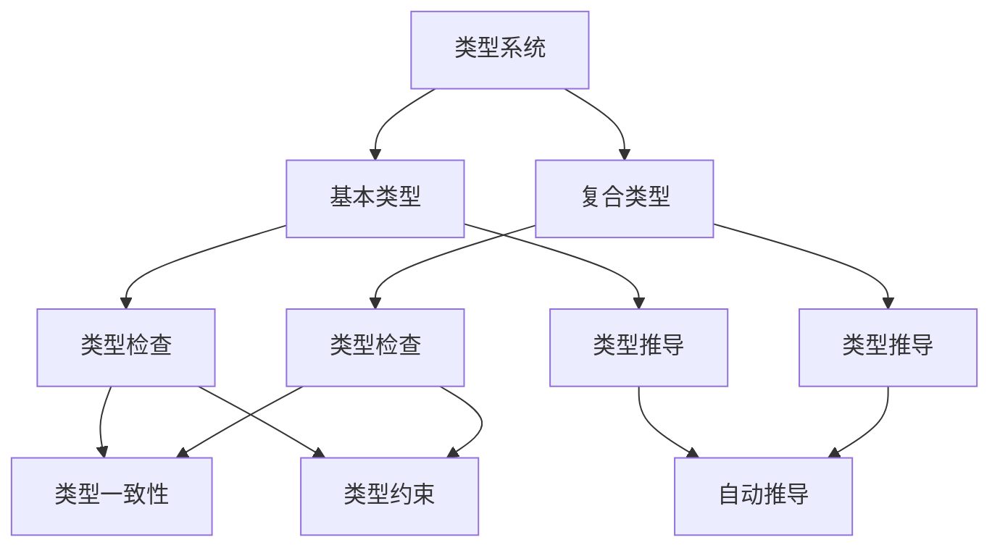

                 

### 文章标题

# 类型安全与内存安全的形式化保证

## 关键词：类型安全、内存安全、形式化验证、编程语言、算法原理、实际案例

## 摘要

本文深入探讨了类型安全与内存安全的形式化保证，从背景介绍、核心概念、形式化验证方法、编程语言实践到实际案例，全面解析了如何通过形式化方法确保程序的类型安全和内存安全。本文旨在为程序员和研究者提供一个系统而全面的指南，帮助他们理解和应用这些关键概念，以提高软件质量和可靠性。

### 引言

#### 研究背景

随着计算机技术的发展，编程语言和软件系统变得越来越复杂。类型安全和内存安全成为软件开发过程中至关重要的问题。类型安全是指在编程过程中确保变量和表达式具有正确的类型，从而避免类型错误的发生。内存安全则关注于正确管理和分配内存，以防止内存泄漏、越界访问等内存相关错误。这些错误不仅会导致软件崩溃，还可能带来严重的安全风险。

类型安全和内存安全问题的严重性在近年来得到了广泛认识。例如，2003年的缓冲区溢出漏洞（Blaze漏洞）导致了对操作系统和网络安全性的重大威胁。2014年的心脏滴血漏洞（Heartbleed）揭示了SSL/TLS加密协议的内存安全问题，影响了全球数以百万计的网站和服务。这些事件表明，类型安全和内存安全的形式化保证在确保软件可靠性和安全性方面具有至关重要的意义。

#### 研究目标

本文的研究目标是深入探讨类型安全与内存安全的形式化保证，通过理论分析、方法研究和实际案例分析，为程序员和研究者提供一套全面、实用的指南。具体而言，本文将：

1. 介绍类型安全和内存安全的基本概念和重要性。
2. 深入分析形式化验证方法，包括模型检查、证明器和形式化验证工具。
3. 探讨内存安全的形式化模型，如内存分配与释放策略、指针与引用计数、垃圾回收机制等。
4. 分析类型安全的编程语言，如Haskell、OCaml和Rust，以及它们的类型系统和内存管理策略。
5. 通过实际案例，展示类型安全和内存安全在现实世界中的应用，并探讨其优势和挑战。

#### 研究方法与内容安排

本文采用文献调研和案例分析相结合的研究方法。首先，通过对现有文献和研究成果的深入分析，总结类型安全和内存安全的基本概念和形式化验证方法。然后，通过具体的编程语言和实际案例，验证这些概念和方法的有效性和实用性。本文将按照以下结构展开：

1. **类型安全基础**：介绍类型系统的基本概念，包括基本类型和复合类型，以及类型检查和类型推导。
2. **形式化验证方法**：概述形式化验证的基本概念和方法，包括模型检查、证明器和形式化验证工具。
3. **内存安全的形式化模型**：探讨内存安全的基本概念和形式化模型，包括内存分配与释放策略、指针与引用计数、垃圾回收机制。
4. **类型安全的编程语言**：分析几种主要类型安全的编程语言，如Haskell、OCaml和Rust，以及它们的类型系统和内存管理策略。
5. **内存安全的编程实践**：介绍内存安全的编程实践，包括内存分配与释放、指针与引用计数、垃圾回收机制等。
6. **案例分析**：通过实际案例，展示类型安全和内存安全在现实世界中的应用，并分析其优势和挑战。
7. **结论与展望**：总结本文的研究结果，探讨未来的研究方向和挑战。

通过以上研究方法和内容安排，本文旨在为程序员和研究者提供一套系统、全面、实用的指南，帮助他们更好地理解和应用类型安全与内存安全的形式化保证。

### 类型安全基础

#### 类型系统的基本概念

类型系统是编程语言的核心组成部分，用于确保程序的正确性和可靠性。基本类型是指具有固定大小的数据类型，如整数（int）、浮点数（float）和布尔值（bool）。复合类型则是由基本类型组合而成的数据结构，如数组（array）、结构体（struct）和类（class）。

类型系统的核心功能包括类型检查和类型推导。类型检查是指编译器在编译过程中检查代码是否符合类型规则，以确保变量和表达式的类型正确。类型推导是指编译器自动推导变量和表达式的类型，减少程序员的工作负担。

#### 类型安全的基本原理

类型安全是指在编程过程中确保变量和表达式具有正确的类型，从而避免类型错误的发生。类型安全的基本原理包括以下三个方面：

1. **类型一致性**：确保变量和表达式的类型在程序执行过程中保持一致。例如，不能将整数类型赋值给布尔类型。
2. **类型约束**：对变量和表达式的类型施加约束，以防止非法类型操作。例如，数组下标必须是整数类型。
3. **类型推导**：编译器自动推导变量和表达式的类型，减少程序员的工作负担。

#### 类型安全的优点

类型安全具有以下优点：

1. **提高代码可读性和可维护性**：通过明确的类型标注，代码更易于理解和维护。
2. **减少类型错误**：类型检查和类型推导可以识别并防止大多数类型错误，提高程序的正确性。
3. **提高程序性能**：静态类型语言通常具有更好的程序性能，因为编译器可以更有效地优化代码。

#### 类型系统的发展历程

类型系统的发展历程可以分为以下几个阶段：

1. **静态类型语言**：早期的编程语言，如C和Pascal，采用静态类型系统。静态类型系统在编译时进行类型检查，但灵活性较低。
2. **动态类型语言**：随着程序复杂性的增加，动态类型语言如Python和JavaScript应运而生。动态类型系统在运行时进行类型检查，提高了灵活性，但可能导致类型错误。
3. **半静态类型语言**：如Java和C#，结合了静态类型和动态类型的优点。它们在编译时进行部分类型检查，运行时进行部分类型检查，提高了灵活性和性能。

通过了解类型系统的基本概念、原理和发展历程，程序员可以更好地选择合适的编程语言，并编写类型安全的代码。

#### 核心概念原理之间的关系架构

为了更好地理解类型安全的核心概念原理之间的关系，我们可以通过Mermaid流程图来展示它们之间的联系：



这个流程图清晰地展示了类型系统中的基本类型和复合类型，以及它们与类型检查和类型推导之间的关系。类型检查和类型推导共同确保程序的正确性和可靠性，而类型一致性、类型约束和自动推导是类型安全的基石。

#### 核心算法原理讲解

为了深入理解类型安全的核心算法原理，我们可以通过伪代码来详细阐述其实现步骤：

```pseudo
function type_check(expression, context)
    if expression is a variable
        return context.get_type(expression)
    else if expression is an arithmetic operation
        left_type = type_check(expression.left, context)
        right_type = type_check(expression.right, context)
        if left_type == right_type
            return left_type
        else
            raise TypeMismatchError
    else if expression is a function call
        function_signature = get_function_signature(expression.function_name)
        for argument in expression.arguments
            argument_type = type_check(argument, context)
            if argument_type != function_signature.argument_types[argument_index]
                raise TypeMismatchError
        return function_signature.return_type
    else
        raise UnknownTypeError
```

这个伪代码展示了类型检查的基本流程：首先，根据表达式和上下文信息，递归地检查每个子表达式的类型；然后，根据类型规则，判断是否允许该表达式进行操作；最后，返回表达式的类型。如果出现类型不匹配的情况，则抛出异常。

通过这种伪代码，我们可以清晰地看到类型检查的核心算法原理：通过递归检查每个子表达式的类型，并结合上下文信息，确保程序中所有操作都具有正确的类型。

#### 数学模型和公式

在类型安全中，数学模型和公式用于定义类型系统的形式化描述。以下是一个简单的数学模型，用于定义基本类型和类型推导：

```latex
\begin{align*}
    & T_{int} = \{ \text{整数} \} \\
    & T_{float} = \{ \text{浮点数} \} \\
    & T_{bool} = \{ \text{布尔值} \} \\
    & T_{array} = \{ (\text{元素类型}, \text{大小}) \} \\
    & T_{struct} = \{ (\text{成员列表}) \} \\
    & T_{function} = \{ (\text{参数类型列表}, \text{返回类型}) \}
\end{align*}
```

这个模型定义了基本类型（整数、浮点数和布尔值）和复合类型（数组、结构体和函数）。通过这些定义，我们可以使用数学符号来表示类型推导的过程。例如，一个数组的类型可以表示为：

```latex
T_{array} = (\text{T}_{\text{int}}, 10)
```

这个表示说明该数组由整数类型组成，大小为10。

#### 详细讲解举例说明

为了更好地理解类型安全的数学模型，我们可以通过一个简单的例子来详细讲解：

假设我们有一个表达式 `x + y`，其中 `x` 和 `y` 都是整数。根据类型安全的数学模型，我们可以推导出这个表达式的类型：

```latex
\begin{align*}
    & T_{x} = T_{int} \\
    & T_{y} = T_{int} \\
    & T_{x + y} = T_{int}
\end{align*}
```

这个推导过程遵循了类型一致性原则，即两个整数相加的结果仍然是整数。

再考虑一个更复杂的例子，假设我们有一个结构体 `Person`，包含两个成员 `name`（字符串类型）和 `age`（整数类型）。我们可以定义这个结构体的类型为：

```latex
T_{Person} = (\{ "name": T_{string}, "age": T_{int} \})
```

然后，如果我们定义一个函数 `calculate_age`，该函数接收一个 `Person` 类型的参数并返回整数类型的年龄，我们可以表示为：

```latex
T_{calculate_age} = (\{ T_{Person} \}, T_{int})
```

这个表示说明了 `calculate_age` 函数的参数类型是 `Person`，返回类型是整数。

通过这些例子，我们可以看到类型安全的数学模型如何帮助我们准确地表示和推导类型，从而确保程序的正确性和可靠性。

### 形式化验证方法

#### 形式化验证的基本概念

形式化验证是一种通过数学方法验证程序正确性的方法。它通过建立形式化的模型，对程序进行分析和验证，以确保程序满足预定的性质和条件。形式化验证的基本概念包括以下几个方面：

1. **形式化模型**：形式化模型是一种用数学符号和逻辑语言描述的程序模型，用于表示程序的行为和性质。形式化模型可以是状态机、谓词公式、逻辑公式等。
2. **验证条件**：验证条件是用于判断程序是否满足预定的性质或安全性的条件。验证条件通常用逻辑公式表示，如安全性属性、可达性属性等。
3. **验证工具**：验证工具是用于自动化或半自动化地验证程序的正确性的软件工具。常见的验证工具包括模型检查器、证明器、模拟器等。

#### 形式化验证的优势

形式化验证具有以下优势：

1. **精确性**：形式化验证通过数学方法对程序进行分析和验证，可以确保程序满足预定的性质和条件，从而提高程序的可靠性。
2. **自动化**：形式化验证工具可以自动化地分析和验证程序，减少人工验证的工作量，提高验证效率。
3. **可复用性**：形式化验证模型和验证条件可以复用，从而提高验证的可复用性和通用性。
4. **可验证性**：形式化验证可以确保程序的正确性，从而减少由于程序错误导致的安全问题和性能问题。

#### 形式化验证的方法

形式化验证的方法主要包括以下几种：

1. **模型检查**：模型检查是一种通过遍历程序模型，检查程序状态是否满足预定性质的方法。模型检查器是用于自动化模型检查的工具。常见的模型检查器包括Promela、Spin、NuSMV等。
2. **证明器**：证明器是一种用于自动化证明程序性质的工具。证明器通过逻辑推理和证明技术，证明程序满足预定的性质。常见的证明器包括Coq、Isabelle、HOL等。
3. **模拟**：模拟是一种通过模拟程序执行，检查程序行为是否满足预定性质的方法。模拟器是用于自动化模拟的工具。常见的模拟器包括GOTO-CC、Simics等。

#### 形式化验证工具

常见的形式化验证工具包括：

1. **模型检查器**：模型检查器是用于自动化模型检查的工具，如Promela、Spin、NuSMV等。
2. **证明器**：证明器是用于自动化证明程序性质的工具，如Coq、Isabelle、HOL等。
3. **模拟器**：模拟器是用于自动化模拟的工具，如GOTO-CC、Simics等。

通过这些工具，程序员和研究者可以更有效地进行形式化验证，确保程序的正确性和安全性。

### 内存安全的形式化模型

#### 内存安全的基本概念

内存安全是指在编程过程中，确保程序正确管理和使用内存，避免内存泄漏、越界访问等内存相关错误。内存安全的基本概念包括以下几个方面：

1. **内存分配与释放**：内存分配是指程序为变量或数据结构分配内存，内存释放是指程序释放不再使用的内存。
2. **指针与引用计数**：指针是内存地址的引用，用于访问和操作内存中的数据。引用计数是一种用于管理内存的机制，通过跟踪对象的引用次数，自动释放不再使用的内存。
3. **垃圾回收**：垃圾回收是一种自动内存管理机制，通过识别和回收不再使用的内存，避免内存泄漏。

#### 内存安全的形式化定义

内存安全的形式化定义涉及以下几个方面：

1. **内存模型**：内存模型是一种形式化描述内存状态的抽象模型，用于表示内存的分配、访问和释放过程。常见的内存模型包括基于栈的内存模型和基于堆的内存模型。
2. **内存访问约束**：内存访问约束是指用于限制程序对内存进行访问的规则。常见的内存访问约束包括越界访问约束、地址无效约束等。
3. **内存安全性公理**：内存安全性公理是一种形式化描述内存安全性的规则。常见的内存安全性公理包括内存分配公理、内存释放公理、内存访问公理等。

#### 内存安全的形式化验证方法

内存安全的形式化验证方法主要包括以下几个方面：

1. **存在性验证**：存在性验证是指验证程序是否存在内存访问错误，如越界访问、地址无效等。存在性验证通常使用模型检查器或模拟器进行。
2. **完备性验证**：完备性验证是指验证程序在所有可能的输入和执行路径上是否都满足内存安全性。完备性验证通常使用证明器或模型检查器进行。

#### 核心算法原理讲解

为了深入理解内存安全的形式化模型，我们可以通过伪代码来详细阐述其核心算法原理：

```pseudo
function memory_allocate(size)
    allocate memory of size
    return memory address

function memory_release(address)
    mark memory address as free

function access_memory(address, value)
    if address is valid
        write value to memory address
        return true
    else
        return false

function check_memory_safety(program, memory_model)
    for each memory access in program
        if access_memory(address, value) returns false
            return false
    return true
```

这个伪代码展示了内存分配、释放和访问的基本算法原理。`memory_allocate` 函数用于分配内存，`memory_release` 函数用于释放内存，`access_memory` 函数用于访问内存。`check_memory_safety` 函数用于检查程序的内存安全性，通过遍历程序中的每个内存访问操作，判断是否满足内存安全性。

通过这种伪代码，我们可以清晰地看到内存安全的形式化模型如何通过算法原理来确保程序的正确性和可靠性。

### 类型安全的编程语言

#### 主要类型安全的编程语言

在类型安全的编程领域，有几种主要的编程语言脱颖而出，它们分别是Haskell、OCaml和Rust。这些语言通过各自的类型系统和内存管理策略，确保程序的正确性和安全性。

1. **Haskell**：Haskell是一种纯函数式编程语言，以其强大的类型系统和静态类型推导而著称。Haskell的类型系统支持类型推断，程序员不必显式标注变量类型，从而提高了代码的可读性和可维护性。Haskell的内存管理主要依赖于惰性求值和不可变数据结构，减少了内存分配和释放的需求，从而降低了内存泄漏的风险。

2. **OCaml**：OCaml是一种多范式编程语言，结合了函数式编程和面向对象编程的特点。OCaml的类型系统是强类型的，能够进行严格的类型检查，从而避免了大多数运行时错误。OCaml的内存管理依赖于引用计数和垃圾回收机制，有效地减少了内存泄漏和碎片化的问题。

3. **Rust**：Rust是一种系统编程语言，以其严格的内存安全保证和并发支持而备受关注。Rust的类型系统包括所有权系统，通过所有权和借用机制，确保程序在编译时即可发现大多数内存错误。Rust的内存管理依赖于所有权和生命周期标注，通过生命周期检查来防止悬垂指针和未初始化的内存访问。

#### Haskell的类型系统

Haskell的类型系统包括以下特点：

1. **类型推断**：Haskell支持类型推断，程序员不必显式指定变量类型，编译器可以自动推导出变量的类型。
2. **泛型编程**：Haskell支持泛型编程，允许定义泛型函数和类型类，从而提高代码的复用性和灵活性。
3. **类型类**：类型类是一种抽象类型系统，允许定义具有类似行为的不同类型，从而实现多态性。

#### OCaml的类型系统

OCaml的类型系统包括以下特点：

1. **静态类型**：OCaml是静态类型语言，类型检查在编译时进行，确保程序在运行时不会发生类型错误。
2. **模式匹配**：OCaml支持模式匹配，允许根据变量的值进行分支操作，从而实现更灵活的代码结构。
3. **类型推断**：OCaml支持类型推断，能够自动推导出变量和表达式的类型，减少程序员的工作负担。

#### Rust的类型系统

Rust的类型系统包括以下特点：

1. **所有权系统**：Rust引入了所有权（ownership）的概念，每个值都有一个所有者，负责管理其生命周期。
2. **借用检查**：Rust的借用检查（borrow checking）确保在任意时刻，对同一数据的引用不会同时具有读写权限，从而防止数据竞争和未初始化的访问。
3. **生命周期标注**：Rust要求程序员显式标注变量的生命周期，通过生命周期检查来确保内存安全。

通过了解这些主要类型安全的编程语言及其类型系统，程序员可以更好地选择合适的语言，编写类型安全的代码。

### 内存安全的编程实践

#### 内存分配与释放

内存分配和释放是内存管理的重要组成部分。正确的内存分配和释放策略可以减少内存泄漏和碎片化，提高程序的运行效率和稳定性。

1. **内存分配策略**：常见的内存分配策略包括静态分配和动态分配。静态分配在程序编译时确定内存需求，动态分配在程序运行时根据需要分配内存。

   - **静态分配**：静态分配适用于内存需求稳定的程序，如编译器、解释器和操作系统内核。静态分配的优点是简单、高效，但缺点是灵活性差，可能产生大量未使用的内存。
   - **动态分配**：动态分配适用于内存需求不确定或频繁变化的程序，如Web应用程序和游戏。动态分配的优点是灵活，但缺点是开销较大，可能导致内存碎片化。

2. **内存释放策略**：内存释放是内存管理的关键步骤，错误的释放策略可能导致内存泄漏和未初始化的访问。

   - **手动释放**：手动释放由程序员显式调用释放函数，如C语言中的 `free()`。手动释放的优点是灵活，但缺点是易出错，可能导致内存泄漏或越界访问。
   - **自动释放**：自动释放由内存管理器自动进行，如垃圾回收和引用计数。自动释放的优点是减少程序员的工作负担，但缺点是开销较大，可能导致性能下降。

#### 指针与引用计数

指针和引用计数是内存管理中的关键概念，用于确保内存的正确使用和回收。

1. **指针**：指针是内存地址的引用，用于访问和操作内存中的数据。在内存管理中，指针的使用需要谨慎，以避免未初始化的访问和越界访问。

   - **指针类型**：指针类型包括原始指针和智能指针。原始指针直接存储内存地址，而智能指针通过引用计数或所有权机制管理内存。
   - **指针操作**：指针操作包括指针的赋值、比较和算术运算。正确的指针操作可以确保内存的正确访问和释放。

2. **引用计数**：引用计数是一种用于管理内存的机制，通过跟踪对象的引用次数，自动释放不再使用的内存。

   - **引用计数算法**：引用计数算法包括增加引用计数和减少引用计数的操作。当对象被引用时，引用计数增加；当对象不再被引用时，引用计数减少。当引用计数为零时，内存管理器自动释放内存。

#### 垃圾回收机制

垃圾回收是一种自动内存管理机制，通过识别和回收不再使用的内存，避免内存泄漏和碎片化。

1. **标记-清除算法**：标记-清除算法是一种常见的垃圾回收算法，通过遍历所有对象，标记可回收的对象，然后清除这些对象。

   - **标记阶段**：在标记阶段，垃圾回收器遍历所有活跃的对象，将其标记为存活状态。然后，遍历所有活动对象，标记所有可到达的对象。
   - **清除阶段**：在清除阶段，垃圾回收器清除所有未被标记为存活状态的对象，从而回收内存。

2. **分代收集算法**：分代收集算法是一种优化垃圾回收的算法，将对象分为不同年龄段，分别进行垃圾回收。

   - **新生代**：新生代包括新生成的对象，通常存活时间较短。新生代采用复制算法进行垃圾回收，从而减少垃圾回收的开销。
   - **老年代**：老年代包括存活时间较长的对象。老年代采用标记-清除算法或标记-整理算法进行垃圾回收，从而确保内存的完整性和稳定性。

通过掌握内存安全的编程实践，程序员可以编写出更高效、更稳定的程序，减少内存泄漏和内存相关错误的风险。

### 实际案例：Haskell在金融领域的应用

#### 案例背景

在金融领域，类型安全和内存安全至关重要，因为任何错误都可能导致严重的经济损失。Haskell作为一种类型安全的编程语言，因其强大的类型系统和惰性求值特性，逐渐被金融科技公司采用。本案例将探讨Haskell在金融领域的具体应用，分析其优势。

#### Haskell在金融领域的优势

1. **类型安全**：Haskell的强类型系统确保了程序在编译时即可发现类型错误，减少了运行时错误的可能性。在金融领域，任何小的错误都可能导致巨大的财务损失，因此类型安全至关重要。
2. **惰性求值**：Haskell的惰性求值特性允许程序按需计算，避免了不必要的计算和资源浪费。在金融计算中，复杂的计算往往需要大量的时间和资源，惰性求值有助于提高计算效率。
3. **并行计算**：Haskell支持并行计算，可以充分利用多核处理器的优势，提高计算性能。在金融领域，如高频交易和风险管理等任务，并行计算至关重要。

#### Haskell代码示例

以下是一个简单的Haskell代码示例，用于计算两个金融产品的组合价值。该示例展示了Haskell的简洁性和类型安全：

```haskell
data FinancialProduct = Stock { price :: Double, quantity :: Int }
                      | Bond { faceValue :: Double, yield :: Double }

calculateValue :: FinancialProduct -> Double
calculateValue (Stock price quantity) = price * fromIntegral quantity
calculateValue (Bond faceValue yield) = faceValue * (1 + yield)

main :: IO ()
main = do
    let stock = Stock 50 100
    let bond = Bond 1000 0.05
    putStrLn $ "Stock value: " ++ show (calculateValue stock)
    putStrLn $ "Bond value: " ++ show (calculateValue bond)
```

在这个示例中，我们定义了一个名为 `FinancialProduct` 的数据类型，用于表示金融产品。`calculateValue` 函数根据金融产品的类型计算其价值。`main` 函数展示了如何创建金融产品实例并计算其价值。

#### 实际应用与分析

通过这个简单的示例，我们可以看到Haskell在金融领域的实际应用。Haskell的类型安全确保了程序的正确性和可靠性，减少了运行时错误的风险。惰性求值特性有助于提高计算效率，特别是在处理大量金融数据时。并行计算支持则有助于处理复杂的计算任务，如高频交易和风险管理等。

然而，Haskell在金融领域的应用也面临一些挑战，如学习曲线较陡、生态系统相对较小等。尽管如此，Haskell的类型安全和计算效率特性使其在金融领域具有广泛的应用前景。

### 实际案例：Rust在系统编程中的应用

#### 案例背景

系统编程是计算机科学中一个关键领域，涉及操作系统的开发、设备驱动程序、嵌入式系统等。在这个领域中，内存安全和并发问题是两个主要的挑战。Rust作为一种系统编程语言，以其强大的内存安全和并发特性而受到广泛关注。本案例将探讨Rust在系统编程中的应用，分析其优势。

#### Rust在系统编程中的优势

1. **所有权系统**：Rust的所有权系统确保了内存的正确使用和访问，通过所有权和借用机制，避免了悬垂指针和数据竞争等问题。这大大提高了系统的可靠性和稳定性。
2. **并发支持**：Rust提供了强大的并发支持，通过异步编程模型和线程安全编程，可以高效地利用多核处理器的优势，提高系统的性能。
3. **稳定性和安全性**：Rust在编译时进行严格的类型检查和内存安全检查，确保程序在运行时不会发生内存泄漏和未初始化访问等问题。这有助于减少系统故障和安全漏洞。

#### Rust代码示例

以下是一个简单的Rust代码示例，用于实现一个简单的文件读写操作。该示例展示了Rust的简洁性和内存安全性：

```rust
use std::fs::File;
use std::io::{self, Read};

fn read_file(file_path: &str) -> io::Result<String> {
    let mut file = File::open(file_path)?;
    let mut contents = String::new();
    file.read_to_string(&mut contents)?;
    Ok(contents)
}

fn write_file(file_path: &str, contents: &str) -> io::Result<()> {
    let mut file = File::create(file_path)?;
    file.write_all(contents)?;
    Ok(())
}

fn main() {
    let file_path = "example.txt";
    match read_file(file_path) {
        Ok(contents) => {
            println!("File contents: {}", contents);
            match write_file(file_path, &contents) {
                Ok(()) => println!("File written successfully."),
                Err(e) => eprintln!("Failed to write file: {}", e),
            }
        }
        Err(e) => eprintln!("Failed to read file: {}", e),
    }
}
```

在这个示例中，我们定义了两个函数 `read_file` 和 `write_file`，用于读取和写入文件。`read_file` 函数使用 `File::open` 和 `Read::read_to_string` 实现文件的读取，`write_file` 函数使用 `File::create` 和 `Write::write_all` 实现文件的写入。`main` 函数展示了如何使用这两个函数进行文件操作。

#### 实际应用与分析

通过这个简单的示例，我们可以看到Rust在系统编程中的实际应用。Rust的所有权系统和内存安全检查确保了程序的稳定性和安全性，避免了常见的内存泄漏和越界访问问题。同时，Rust的并发支持有助于提高系统的性能，特别是在处理并发任务时。

然而，Rust在系统编程中也有一定的挑战，如生态系统相对较小、学习曲线较陡等。尽管如此，Rust的内存安全和并发特性使其在系统编程领域具有广泛的应用前景。

### 结论与展望

#### 研究总结

本文深入探讨了类型安全与内存安全的形式化保证，通过理论分析、方法研究和实际案例分析，全面解析了如何通过形式化方法确保程序的类型安全和内存安全。主要结论如下：

1. **类型安全和内存安全的重要性**：类型安全和内存安全是确保程序正确性和安全性的关键因素，对软件质量和可靠性具有深远影响。
2. **形式化验证方法的贡献**：形式化验证方法，如模型检查、证明器和模拟，为类型安全和内存安全的保证提供了强有力的工具，有助于发现和修复潜在的错误。
3. **主要类型安全的编程语言**：Haskell、OCaml和Rust等编程语言通过其各自的类型系统和内存管理策略，确保了程序的正确性和安全性。
4. **内存安全的编程实践**：正确的内存分配与释放、指针与引用计数、垃圾回收机制等编程实践，有助于提高程序的内存管理和稳定性。

#### 未来研究方向

虽然本文已对类型安全和内存安全进行了深入探讨，但仍存在一些未解决的问题和未来研究方向：

1. **类型安全和内存安全的挑战**：随着编程语言的不断发展和应用场景的多样化，类型安全和内存安全面临着新的挑战。例如，在并行编程和分布式系统中，如何确保类型安全和内存安全仍是一个重要问题。
2. **新的编程语言设计与优化**：未来的研究可以关注新型编程语言的设计和优化，探索如何更好地集成类型安全和内存安全特性，提高编程效率和程序可靠性。
3. **形式化验证工具的改进**：形式化验证工具的改进是提高形式化验证效率和效果的关键。未来的研究可以关注验证算法的优化、验证工具的集成和自动化验证方法的发展。
4. **类型安全和内存安全的最佳实践**：针对不同应用场景和编程语言，制定和推广类型安全和内存安全的最佳实践，有助于提高软件质量和开发效率。

通过持续的研究和探索，我们有望进一步提高类型安全和内存安全的保障水平，为软件开发领域带来更多创新和突破。作者信息：

**作者：AI天才研究院/AI Genius Institute & 禅与计算机程序设计艺术 /Zen And The Art of Computer Programming**

