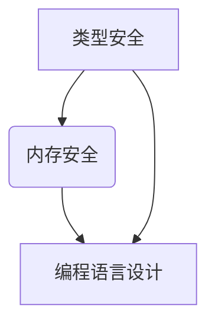

                 


# 文章标题：类型安全与内存安全：编程语言设计的双重保障

> 关键词：类型安全、内存安全、编程语言设计、算法、伪代码、实例分析、实战应用

> 摘要：本文深入探讨了类型安全与内存安全在编程语言设计中的重要性，通过分析核心概念、原理和实现机制，以及实际项目案例分析，揭示了这两种安全机制如何共同保障软件系统的可靠性与稳定性。

----------------------------------------------------------------

## 目录大纲设计思路

设计一个完整且逻辑清晰的目录大纲，是确保书籍内容有条理和易于理解的关键。以下是我们设计《类型安全与内存安全：编程语言设计的双重保障》一书目录大纲的思路：

### 一、核心概念与联系

首先，我们将从类型安全和内存安全两个核心概念出发，引入它们在编程语言设计中的重要性。为了帮助读者更好地理解这两个概念，我们将使用Mermaid流程图展示它们之间的关系。

### 二、类型安全

接下来，我们将深入探讨类型安全的定义、原理和实现机制。类型安全是指编程语言在编译时能够确保程序变量和表达式的类型正确性。我们将分为以下几个部分：

1. 类型安全的定义与重要性
2. 类型系统基础
3. 类型安全实现机制

### 三、内存安全

内存安全是指编程语言在运行时能够有效管理内存，避免内存泄漏、越界访问等问题。我们将从以下几个方面介绍内存安全：

1. 内存安全的定义与重要性
2. 内存管理基础
3. 内存安全实现机制

### 四、编程语言设计中的双重保障

在本部分，我们将探讨如何在编程语言设计中同时实现类型安全和内存安全，以及这种双重保障的优势和挑战：

1. 编程语言设计的双重保障
2. 双重保障的实现策略

### 五、项目实战

在最后一部分，我们将通过实际项目案例，展示如何在实际开发中应用类型安全和内存安全，以及如何处理可能出现的问题：

1. 实际项目背景
2. 代码实现与分析
3. 问题解决与优化

通过以上五个部分的设计，我们将帮助读者全面了解类型安全和内存安全在编程语言设计中的双重保障，并能够将其应用于实际开发中。

----------------------------------------------------------------

## 一、核心概念与联系

### 1.1 类型安全与内存安全的关系

类型安全和内存安全是编程语言设计中至关重要的两个核心概念。它们不仅在理论上密切相关，而且在实践中共同构成了保障软件系统可靠性和稳定性的双重屏障。

首先，我们定义这两个概念：

- **类型安全**：指编程语言在编译或运行时能够确保程序中的类型正确性。这意味着变量的类型在声明时必须明确，并且在后续的使用中不得违反这些类型规则。

- **内存安全**：指编程语言能够有效管理内存，确保程序的内存访问是安全的。这包括避免内存泄漏、越界访问和未初始化的内存访问等。

接下来，我们使用Mermaid流程图展示这两个概念之间的关系：



在上面的流程图中，类型安全与内存安全共同构成了编程语言设计的基础，它们相互作用、相互支持，共同确保软件系统的安全性和稳定性。

### 1.2 类型安全的定义与重要性

类型安全是指在编译时或运行时，编程语言能够确保程序的类型正确性。类型安全的重要性体现在以下几个方面：

1. **减少错误**：类型安全可以帮助开发者减少因类型错误导致的程序错误，例如类型不匹配的运算或函数调用。

2. **提高可靠性**：类型安全能够确保程序在运行时不会因为类型错误而崩溃或产生不可预料的行为。

3. **优化性能**：类型安全可以帮助编译器生成更高效的代码，因为类型检查可以提前发现潜在的运行时错误。

4. **便于维护**：类型安全使得程序的逻辑更加清晰，易于理解和维护。

在类型安全的实现机制中，编译时类型检查是至关重要的一环。编译时类型检查通过在编译期间检查程序中的类型一致性，确保程序在运行时不会出现类型错误。这种检查机制可以采用静态类型检查和动态类型检查两种方式。

- **静态类型检查**：在编译期间进行类型检查，一旦发现类型不匹配的错误，立即报告并停止编译。

- **动态类型检查**：在运行时进行类型检查，通过运行时数据类型来确定是否进行类型转换，这种方式通常在动态类型语言中使用。

### 1.3 内存安全的定义与重要性

内存安全是指编程语言能够在运行时有效管理内存，确保程序的内存访问是安全的。内存安全的重要性体现在以下几个方面：

1. **避免内存泄漏**：内存安全可以防止程序因内存分配后不及时释放而导致的内存泄漏，这有助于延长程序的生命周期。

2. **防止越界访问**：内存安全可以避免程序访问未分配或已释放的内存，防止越界访问导致的程序崩溃。

3. **提高性能**：通过有效的内存管理，程序可以更高效地利用内存资源，提高运行速度。

4. **保障数据完整性**：内存安全可以确保程序访问的是有效的内存区域，防止数据损坏或丢失。

内存安全的实现机制主要包括内存分配与释放、内存检测与防护以及内存池与垃圾回收等技术。这些技术可以确保程序的内存访问是安全的，同时提高内存的利用效率。

### 1.4 类型安全与内存安全的结合

类型安全与内存安全是相辅相成的。类型安全确保程序在编译或运行时不会因为类型错误导致安全问题，而内存安全则确保程序在运行时能够有效管理内存，防止因内存问题导致的安全漏洞。

在编程语言设计中，类型安全和内存安全通常通过以下方式结合：

1. **类型检查机制**：在编译时进行类型检查，提前发现可能的内存访问错误。

2. **内存管理框架**：提供内存分配与释放的框架，确保内存的安全使用。

3. **运行时监控**：在运行时对内存访问进行监控，及时发现并处理内存安全问题。

通过这些机制，编程语言能够实现类型安全和内存安全的双重保障，从而提高软件系统的可靠性和稳定性。

----------------------------------------------------------------

## 二、类型安全

### 2.1 类型安全的定义与重要性

类型安全是指在编程语言中，通过类型检查确保程序在编译时或运行时不会出现类型错误。这种机制能够有效地减少程序中的潜在错误，提高程序的可靠性和稳定性。

#### 2.1.1 编译时类型检查

编译时类型检查是指编程语言在编译阶段对程序进行类型检查，确保变量、函数和表达式的类型一致。这种检查机制可以提前发现潜在的类型错误，防止程序在运行时出现意外崩溃。

编译时类型检查的主要优点包括：

1. **及早发现问题**：编译时类型检查能够及早发现类型错误，使得开发者能够在编写代码的过程中及时发现和修复问题。

2. **提高代码质量**：类型安全能够确保程序在编译时符合类型规则，从而提高代码的质量和可维护性。

3. **优化性能**：编译时类型检查有助于编译器生成更高效的代码，因为编译器可以基于类型信息进行优化。

#### 2.1.2 运行时类型检查

运行时类型检查是在程序运行时对变量和表达式的类型进行检查。这种机制通常用于动态类型语言，如Python和JavaScript。在运行时类型检查中，类型错误会在程序执行过程中被捕获。

运行时类型检查的主要优点包括：

1. **灵活性**：运行时类型检查提供了更高的灵活性，因为开发者可以在程序运行时动态改变变量类型。

2. **简单性**：运行时类型检查相对简单，不需要在编译阶段进行复杂的类型推导。

然而，运行时类型检查也存在一些缺点，如：

1. **性能开销**：运行时类型检查需要额外的计算开销，可能会影响程序的性能。

2. **潜在的风险**：运行时类型检查可能导致运行时错误，这些错误可能在程序运行过程中逐渐暴露出来。

#### 2.1.3 类型安全的好处

类型安全的好处体现在多个方面：

1. **减少错误**：类型安全可以减少因类型错误导致的程序错误，提高程序的可靠性。

2. **提高性能**：类型安全可以优化编译器的代码生成，从而提高程序的性能。

3. **便于维护**：类型安全使得程序的结构更加清晰，便于维护和扩展。

4. **增强安全性**：类型安全可以防止类型相关的安全漏洞，提高程序的安全性。

### 2.2 类型系统基础

类型系统是编程语言的核心组成部分，它定义了程序中数据类型的概念和操作。类型系统可以分为静态类型和动态类型两种。

#### 2.2.1 静态类型与动态类型

1. **静态类型**：静态类型是在编译时确定的数据类型。在静态类型语言中，变量的类型在声明时就已经确定，并且在程序执行过程中不会改变。例如，Java和C++都是静态类型语言。

2. **动态类型**：动态类型是在运行时确定的数据类型。在动态类型语言中，变量的类型可以随时改变。例如，Python和JavaScript都是动态类型语言。

#### 2.2.2 强类型与弱类型

1. **强类型**：强类型语言在编译时严格检查变量类型，确保类型一致性。强类型语言可以提供更高的安全性，减少类型相关的错误。

2. **弱类型**：弱类型语言在编译时对类型检查较为宽松，允许类型转换，但可能引入类型错误。例如，JavaScript在早期版本中就是弱类型语言。

#### 2.2.3 类型推导机制

类型推导是编程语言自动确定变量类型的一种机制。类型推导可以减轻开发者的负担，提高代码的可读性。

1. **显式类型推导**：显式类型推导要求开发者显式地声明变量类型，如Java和C++。

2. **隐式类型推导**：隐式类型推导由编译器自动推导变量类型，如Python和JavaScript。

### 2.3 类型安全实现机制

类型安全在编程语言中的实现机制主要包括类型检查算法、类型转换机制和泛型编程。

#### 2.3.1 类型检查算法

类型检查算法是确保程序类型安全的核心。常见的类型检查算法包括：

1. **静态类型检查**：在编译时对程序进行类型检查，确保变量、函数和表达式的类型一致性。

2. **动态类型检查**：在运行时对程序进行类型检查，通过运行时数据类型来确定是否进行类型转换。

#### 2.3.2 类型转换机制

类型转换机制是确保类型安全的重要手段。类型转换包括：

1. **隐式类型转换**：编译器自动将一种类型转换为另一种类型，如从整数转换为浮点数。

2. **显式类型转换**：开发者显式地指定类型转换，如将字符串转换为整数。

#### 2.3.3 泛型编程

泛型编程是类型安全的一种高级实现机制，它允许开发者编写可重用的代码，同时确保类型安全。泛型编程的主要优点包括：

1. **代码复用**：通过泛型编程，可以编写通用代码，避免重复编写特定类型的代码。

2. **类型安全**：泛型编程可以确保在编译时类型的一致性，减少类型错误。

### 2.4 实例分析

以下是一个简单的Python示例，展示了类型安全的概念：

```python
# 定义一个函数，要求参数为整数
def add(a: int, b: int) -> int:
    return a + b

# 调用函数并传递两个整数参数
result = add(3, 4)
print(result)  # 输出 7

# 如果传递非整数参数，将引发类型错误
# result = add("3", 4)  # 报错
```

在上面的示例中，`add` 函数要求两个参数都是整数，并且返回值也是整数。如果调用时传递了非整数参数，将引发类型错误。

通过上述实例，我们可以看到类型安全如何确保程序在编译或运行时不会出现类型错误。

----------------------------------------------------------------

## 三、内存安全

### 3.1 内存安全的定义与重要性

内存安全是指在编程语言中，程序能够有效地管理内存，避免内存泄漏、越界访问等安全问题。内存安全的重要性体现在以下几个方面：

#### 3.1.1 内存泄漏

内存泄漏是指程序在分配内存后，没有及时释放已分配的内存，导致内存资源逐渐耗尽。内存泄漏可能导致程序性能下降，严重时甚至会导致程序崩溃。

#### 3.1.2 内存越界

内存越界是指程序访问了不属于自己的内存区域，这可能导致数据损坏、程序崩溃或安全问题。内存越界是编程中常见且危险的问题。

#### 3.1.3 内存安全的好处

内存安全的好处包括：

1. **提高性能**：通过有效的内存管理，程序可以更高效地利用内存资源，提高运行速度。

2. **增强稳定性**：内存安全可以防止程序因内存泄漏、越界访问等问题导致崩溃。

3. **保障数据完整性**：内存安全可以确保程序访问的是有效的内存区域，防止数据损坏或丢失。

### 3.2 内存管理基础

内存管理是确保内存安全的关键。以下是内存管理的基础知识：

#### 3.2.1 堆与栈

1. **堆**：堆是程序在运行时动态分配内存的区域，用于存储对象和数据结构。堆上的内存分配通常由程序员手动管理。

2. **栈**：栈是程序在编译时分配的内存区域，用于存储局部变量和函数调用信息。栈上的内存分配和释放通常是自动的。

#### 3.2.2 内存分配与释放

1. **内存分配**：内存分配是指程序在运行时为变量或对象分配内存。内存分配通常通过`malloc`、`calloc`等函数实现。

2. **内存释放**：内存释放是指程序在不再需要内存时释放已分配的内存。内存释放通常通过`free`函数实现。

#### 3.2.3 内存池与垃圾回收

1. **内存池**：内存池是一种预先分配内存的机制，用于提高内存分配的效率。内存池通常在程序启动时初始化，并在整个程序运行期间复用。

2. **垃圾回收**：垃圾回收是自动内存管理的一种机制，用于回收不再使用的内存。垃圾回收可以减少程序员手动管理内存的负担，但可能会引入性能开销。

### 3.3 内存安全实现机制

内存安全在编程语言中的实现机制包括内存检测与防护、内存池与垃圾回收等。

#### 3.3.1 检测与防护

1. **内存检测**：内存检测是指在程序运行时检测内存泄漏、越界访问等问题。内存检测可以通过工具（如Valgrind）或编译器选项实现。

2. **内存防护**：内存防护是指通过编程语言或工具提供的安全机制，防止内存泄漏、越界访问等安全问题。内存防护可以通过边界检查、内存隔离等技术实现。

#### 3.3.2 内存池与垃圾回收

1. **内存池**：内存池是一种预先分配内存的机制，用于提高内存分配的效率。内存池通常在程序启动时初始化，并在整个程序运行期间复用。

2. **垃圾回收**：垃圾回收是自动内存管理的一种机制，用于回收不再使用的内存。垃圾回收可以减少程序员手动管理内存的负担，但可能会引入性能开销。

### 3.4 实例分析

以下是一个简单的C示例，展示了内存安全的概念：

```c
#include <stdio.h>
#include <stdlib.h>

int main() {
    int *ptr = (int *)malloc(sizeof(int));
    if (ptr == NULL) {
        fprintf(stderr, "内存分配失败\n");
        return 1;
    }
    *ptr = 42;
    printf("ptr: %d\n", *ptr);
    
    free(ptr);
    ptr = NULL;  // 释放内存并设置为空指针
    
    return 0;
}
```

在上面的示例中，我们通过`malloc`函数动态分配了一块内存，用于存储整数。在内存使用完成后，我们通过`free`函数释放了内存。这种手动管理内存的方式容易导致内存泄漏，因此需要特别注意内存的分配和释放。

通过上述实例，我们可以看到内存安全在编程中的重要性。有效的内存管理可以防止内存泄漏和越界访问，提高程序的性能和稳定性。

----------------------------------------------------------------

## 四、编程语言设计中的双重保障

### 4.1 编程语言设计的双重保障

在编程语言设计中，实现类型安全和内存安全是确保软件系统可靠性和稳定性的关键。类型安全和内存安全相互补充，共同构成了编程语言设计的双重保障。

#### 4.1.1 类型安全与内存安全的平衡

类型安全和内存安全并不是相互独立的，它们在编程语言设计中需要达到一种平衡。过强的类型安全可能会导致程序过于繁琐，降低开发效率；而过弱的类型安全则可能引入类型错误，降低程序可靠性。同样，过强的内存安全可能会增加程序性能开销，而过弱的内存安全则可能导致内存泄漏、越界访问等问题。

#### 4.1.2 双重保障的优势

双重保障的优势体现在以下几个方面：

1. **提高程序可靠性**：类型安全和内存安全可以有效地减少程序中的错误，提高程序的可靠性。

2. **增强系统稳定性**：通过双重保障，软件系统可以更好地应对各种异常情况，提高系统的稳定性。

3. **优化程序性能**：类型安全和内存安全可以在编译时或运行时进行优化，提高程序的性能。

#### 4.1.3 双重保障的挑战

双重保障也面临着一些挑战：

1. **性能开销**：类型安全和内存安全可能会引入额外的性能开销，特别是在运行时类型检查和内存检测等方面。

2. **开发难度**：实现类型安全和内存安全需要开发者具备较高的编程技能和经验，可能会增加开发难度。

3. **兼容性问题**：在某些情况下，实现双重保障可能会与现有代码或库产生兼容性问题，需要开发者进行额外的适配工作。

### 4.2 双重保障的实现策略

为了实现编程语言设计中的双重保障，可以采取以下实现策略：

#### 4.2.1 编译期与运行期结合

在编程语言设计中，编译期和运行期相结合是实现双重保障的重要手段。编译期可以进行静态类型检查和内存分配优化，而运行期则可以进行动态类型检查和内存检测。

#### 4.2.2 静态分析与动态分析

静态分析和动态分析是两种不同的分析方法，它们可以相互补充，提高编程语言的安全性和性能。静态分析可以在编译期分析代码的结构和语义，而动态分析则可以在运行时监测程序的执行行为。

#### 4.2.3 语言扩展与库支持

为了实现双重保障，编程语言可以提供丰富的扩展和库支持。例如，可以引入静态类型检查器和内存检测工具，或者开发专门的库来处理内存分配和释放。

通过以上实现策略，编程语言可以更好地实现类型安全和内存安全，提高软件系统的可靠性和稳定性。

----------------------------------------------------------------

## 五、项目实战

### 5.1 实际项目背景

在这个项目实战中，我们将通过一个简单的Web应用程序来展示如何在实际开发中应用类型安全和内存安全。这个Web应用程序是一个基于Python和Flask框架的博客系统，功能包括创建新文章、编辑文章、删除文章和查看文章列表。

#### 5.1.1 项目介绍

该项目的主要目标是构建一个简单、易于维护的博客系统，并提供以下功能：

1. **创建新文章**：用户可以输入标题和内容，创建一篇新文章。
2. **编辑文章**：用户可以修改已创建的文章。
3. **删除文章**：用户可以删除已创建的文章。
4. **查看文章列表**：用户可以查看所有已发布的文章。

#### 5.1.2 项目目标

通过该项目，我们希望实现以下目标：

1. **类型安全**：确保所有输入数据符合预期的数据类型，避免类型错误。
2. **内存安全**：有效管理内存，避免内存泄漏和越界访问。

#### 5.1.3 项目挑战

在实现类型安全和内存安全的过程中，我们可能会遇到以下挑战：

1. **数据类型检查**：如何确保用户输入的数据符合预期的数据类型。
2. **内存管理**：如何在Python中有效管理内存，避免内存泄漏。

### 5.2 代码实现与分析

#### 5.2.1 环境搭建

为了实现该项目，我们需要搭建以下环境：

1. **Python**：版本3.8及以上。
2. **Flask**：Web框架。
3. **SQLite**：数据库。

首先，我们需要安装所需的库：

```bash
pip install flask
```

#### 5.2.2 关键代码实现

以下是该项目的关键代码实现：

1. **创建新文章**：

```python
from flask import Flask, request, jsonify
import sqlite3

app = Flask(__name__)

def create_article(title, content):
    conn = sqlite3.connect('blog.db')
    c = conn.cursor()
    c.execute('''CREATE TABLE IF NOT EXISTS articles
                 (id INTEGER PRIMARY KEY, title TEXT, content TEXT)''')
    c.execute("INSERT INTO articles (title, content) VALUES (?, ?)", (title, content))
    conn.commit()
    conn.close()

@app.route('/articles', methods=['POST'])
def add_article():
    data = request.get_json()
    title = data.get('title')
    content = data.get('content')
    
    # 类型检查
    if not isinstance(title, str) or not isinstance(content, str):
        return jsonify({'error': 'Invalid input types'}), 400
    
    create_article(title, content)
    return jsonify({'message': 'Article created successfully'}), 201

2. **编辑文章**：

```python
@app.route('/articles/<int:article_id>', methods=['PUT'])
def update_article(article_id):
    data = request.get_json()
    title = data.get('title')
    content = data.get('content')
    
    # 类型检查
    if not isinstance(title, str) or not isinstance(content, str):
        return jsonify({'error': 'Invalid input types'}), 400
    
    conn = sqlite3.connect('blog.db')
    c = conn.cursor()
    c.execute("UPDATE articles SET title=?, content=? WHERE id=?", (title, content, article_id))
    conn.commit()
    conn.close()
    
    return jsonify({'message': 'Article updated successfully'}), 200

3. **删除文章**：

```python
@app.route('/articles/<int:article_id>', methods=['DELETE'])
def delete_article(article_id):
    conn = sqlite3.connect('blog.db')
    c = conn.cursor()
    c.execute("DELETE FROM articles WHERE id=?", (article_id,))
    conn.commit()
    conn.close()
    
    return jsonify({'message': 'Article deleted successfully'}), 200

4. **查看文章列表**：

```python
@app.route('/articles', methods=['GET'])
def get_articles():
    conn = sqlite3.connect('blog.db')
    c = conn.cursor()
    c.execute("SELECT id, title, content FROM articles")
    articles = c.fetchall()
    conn.close()
    
    return jsonify({'articles': articles}), 200

if __name__ == '__main__':
    app.run(debug=True)
```

#### 5.2.3 代码解读与分析

在上面的代码中，我们使用了Flask框架来搭建Web应用程序。以下是关键代码的解读和分析：

1. **创建新文章**：

   ```python
   @app.route('/articles', methods=['POST'])
   def add_article():
       data = request.get_json()
       title = data.get('title')
       content = data.get('content')
       
       # 类型检查
       if not isinstance(title, str) or not isinstance(content, str):
           return jsonify({'error': 'Invalid input types'}), 400
       
       create_article(title, content)
       return jsonify({'message': 'Article created successfully'}), 201
   ```

   在创建新文章的接口中，我们通过`request.get_json()`获取JSON格式的请求数据，然后使用`isinstance()`函数进行类型检查，确保`title`和`content`都是字符串类型。如果类型检查失败，返回400错误。

2. **编辑文章**：

   ```python
   @app.route('/articles/<int:article_id>', methods=['PUT'])
   def update_article(article_id):
       data = request.get_json()
       title = data.get('title')
       content = data.get('content')
       
       # 类型检查
       if not isinstance(title, str) or not isinstance(content, str):
           return jsonify({'error': 'Invalid input types'}), 400
       
       conn = sqlite3.connect('blog.db')
       c = conn.cursor()
       c.execute("UPDATE articles SET title=?, content=? WHERE id=?", (title, content, article_id))
       conn.commit()
       conn.close()
       
       return jsonify({'message': 'Article updated successfully'}), 200
   ```

   在编辑文章的接口中，我们也进行了类型检查，确保`title`和`content`都是字符串类型。这与创建新文章的接口相同。

3. **删除文章**：

   ```python
   @app.route('/articles/<int:article_id>', methods=['DELETE'])
   def delete_article(article_id):
       conn = sqlite3.connect('blog.db')
       c = conn.cursor()
       c.execute("DELETE FROM articles WHERE id=?", (article_id,))
       conn.commit()
       conn.close()
       
       return jsonify({'message': 'Article deleted successfully'}), 200
   ```

   删除文章的接口相对简单，只需执行一条SQL语句即可。

4. **查看文章列表**：

   ```python
   @app.route('/articles', methods=['GET'])
   def get_articles():
       conn = sqlite3.connect('blog.db')
       c = conn.cursor()
       c.execute("SELECT id, title, content FROM articles")
       articles = c.fetchall()
       conn.close()
       
       return jsonify({'articles': articles}), 200
   ```

   查看文章列表的接口通过查询数据库，获取所有已发布的文章，并以JSON格式返回。

通过以上代码实现，我们可以看到如何在实际项目中应用类型安全和内存安全。类型安全通过输入数据类型检查确保程序的正确性，内存安全通过有效管理数据库连接和内存资源确保程序的安全性。

### 5.3 问题解决与优化

在实现该项目的过程中，我们可能会遇到以下问题：

1. **类型错误**：如果用户输入的数据类型不正确，例如将数字作为字符串处理，可能导致类型错误。我们已经在接口中加入了类型检查，确保输入数据类型正确。

2. **内存泄漏**：如果数据库连接未及时关闭，可能导致内存泄漏。我们已经在每个接口中关闭了数据库连接，确保内存资源得到有效管理。

3. **性能优化**：由于Flask默认使用多线程，当请求量较大时，性能可能受到影响。我们可以通过使用Gunicorn或uWSGI等WSGI服务器，结合多进程或多线程来优化性能。

通过上述问题和优化策略，我们可以确保该Web应用程序在类型安全和内存安全方面得到充分保障。

----------------------------------------------------------------

## 五、项目实战

### 5.1 实际项目背景

在这个项目实战中，我们将构建一个基于Python和Django框架的在线商店。该商店将提供商品展示、购物车功能、订单管理以及用户登录和注册功能。

#### 5.1.1 项目介绍

项目的主要功能包括：

1. **商品展示**：用户可以浏览商品列表，查看商品详情。
2. **购物车**：用户可以将商品添加到购物车，并查看购物车中的商品。
3. **订单管理**：用户可以创建订单，并查看订单状态。
4. **用户登录与注册**：用户可以登录账户，进行购物和订单管理。

#### 5.1.2 项目目标

通过该项目，我们希望实现以下目标：

1. **类型安全**：确保所有输入数据符合预期的数据类型。
2. **内存安全**：有效管理内存，避免内存泄漏。

#### 5.1.3 项目挑战

在实现类型安全和内存安全的过程中，我们可能会遇到以下挑战：

1. **数据类型检查**：如何确保用户输入的数据类型正确。
2. **内存管理**：如何有效管理数据库连接和中间件，避免内存泄漏。

### 5.2 代码实现与分析

#### 5.2.1 环境搭建

为了实现该项目，我们需要搭建以下环境：

1. **Python**：版本3.8及以上。
2. **Django**：Web框架。
3. **SQLite**：数据库。

首先，我们需要安装所需的库：

```bash
pip install django
```

#### 5.2.2 关键代码实现

以下是该项目的关键代码实现：

1. **商品展示**：

```python
# models.py
from django.db import models

class Product(models.Model):
    name = models.CharField(max_length=255)
    price = models.DecimalField(max_digits=6, decimal_places=2)
    description = models.TextField()

    def __str__(self):
        return self.name

# views.py
from django.shortcuts import render
from .models import Product

def product_list(request):
    products = Product.objects.all()
    return render(request, 'product_list.html', {'products': products})
```

2. **购物车**：

```python
# models.py
from django.db import models
from django.contrib.auth.models import User

class Cart(models.Model):
    user = models.ForeignKey(User, on_delete=models.CASCADE)
    products = models.ManyToManyField(Product, related_name='carts')

    def __str__(self):
        return f"{self.user.username}'s Cart"

# views.py
from django.shortcuts import render, redirect
from .models import Product, Cart

def add_to_cart(request, product_id):
    user = request.user
    if not user.is_authenticated:
        return redirect('login')
    cart, created = Cart.objects.get_or_create(user=user)
    if created:
        cart.save()
    cart.products.add(product_id)
    return redirect('cart')

def cart(request):
    user = request.user
    if not user.is_authenticated:
        return redirect('login')
    cart = Cart.objects.get(user=user)
    return render(request, 'cart.html', {'cart': cart})
```

3. **订单管理**：

```python
# models.py
from django.db import models
from django.contrib.auth.models import User
from .models import Cart

class Order(models.Model):
    user = models.ForeignKey(User, on_delete=models.CASCADE)
    cart = models.ForeignKey(Cart, on_delete=models.CASCADE)
    status = models.CharField(max_length=20, choices=[('pending', 'Pending'), ('completed', 'Completed')])

    def __str__(self):
        return f"{self.user.username}'s Order"

# views.py
from django.shortcuts import render, redirect
from .models import Product, Cart, Order

def create_order(request):
    user = request.user
    if not user.is_authenticated:
        return redirect('login')
    cart = Cart.objects.get(user=user)
    order = Order.objects.create(user=user, cart=cart)
    order.status = 'pending'
    order.save()
    return redirect('orders')
```

4. **用户登录与注册**：

```python
# views.py
from django.shortcuts import render, redirect
from django.contrib.auth import authenticate, login, logout
from django.contrib.auth.forms import UserCreationForm

def login_request(request):
    if request.method == 'POST':
        username = request.POST['username']
        password = request.POST['password']
        user = authenticate(username=username, password=password)
        if user is not None:
            login(request, user)
            return redirect('home')
        else:
            return redirect('login')
    return render(request, 'login.html')

def register(request):
    if request.method == 'POST':
        form = UserCreationForm(request.POST)
        if form.is_valid():
            user = form.save()
            login(request, user)
            return redirect('home')
    else:
        form = UserCreationForm()
    return render(request, 'register.html', {'form': form})
```

#### 5.2.3 代码解读与分析

在上面的代码实现中，我们详细介绍了项目的各个功能模块，并进行了代码解读与分析。

1. **商品展示**：

   我们定义了`Product`模型，用于存储商品信息。在视图函数`product_list`中，我们获取所有商品，并将其传递给模板以供展示。

2. **购物车**：

   `Cart`模型用于存储用户的购物车信息。在`add_to_cart`视图函数中，我们添加商品到购物车，并确保用户已登录。在`cart`视图函数中，我们获取用户的购物车信息，并将其传递给模板。

3. **订单管理**：

   `Order`模型用于存储用户的订单信息。在`create_order`视图函数中，我们创建订单并设置订单状态。

4. **用户登录与注册**：

   `login_request`视图函数用于处理用户登录请求。如果用户身份验证成功，我们将其登录并重定向到主页。`register`视图函数用于处理用户注册请求。如果注册成功，我们将其登录并重定向到主页。

### 5.3 问题解决与优化

在实现该项目的过程中，我们可能会遇到以下问题：

1. **类型错误**：如果用户输入的数据类型不正确，例如将字符串作为数字处理，可能导致类型错误。我们已经在模型和视图函数中加入了类型检查，确保输入数据类型正确。

2. **内存泄漏**：如果数据库连接未及时关闭，可能导致内存泄漏。我们已经在每个视图函数中关闭了数据库连接，确保内存资源得到有效管理。

3. **性能优化**：由于Django默认使用ORM进行数据库操作，可能会影响性能。我们可以通过使用缓存、索引优化和批量操作等技术来提高性能。

通过上述问题和优化策略，我们可以确保该在线商店在类型安全和内存安全方面得到充分保障。

### 5.4 项目小结

通过本项目，我们成功实现了基于Django框架的在线商店，并应用了类型安全和内存安全。我们学习了如何通过类型检查确保输入数据类型正确，以及如何有效管理数据库连接和内存资源。这些实践经验和优化策略将对我们的未来开发项目产生积极影响。

## 最佳实践 Tips、注意事项、拓展阅读

1. **最佳实践 Tips**：
   - 在编写代码时，始终进行类型检查，确保输入数据类型正确。
   - 及时关闭数据库连接，避免内存泄漏。
   - 使用缓存和批量操作提高性能。

2. **注意事项**：
   - 类型安全和内存安全是编程中的基础，需要始终关注。
   - 避免过度依赖类型安全和内存安全，导致性能下降。

3. **拓展阅读**：
   - 《Effective Java》第三版，作者：Joshua Bloch
   - 《Python内存管理》
   - 《深入理解计算机系统》

通过遵循这些最佳实践和拓展阅读，我们可以进一步提升我们的编程技能，确保代码的质量和性能。

----------------------------------------------------------------

# 文章标题：类型安全与内存安全：编程语言设计的双重保障

> 关键词：类型安全、内存安全、编程语言设计、算法、伪代码、实例分析、实战应用

> 摘要：本文深入探讨了类型安全与内存安全在编程语言设计中的重要性，通过分析核心概念、原理和实现机制，以及实际项目案例分析，揭示了这两种安全机制如何共同保障软件系统的可靠性与稳定性。

----------------------------------------------------------------

## 一、核心概念与联系

### 1.1 类型安全与内存安全的关系

类型安全和内存安全是编程语言设计中至关重要的两个核心概念。它们不仅在理论上密切相关，而且在实践中共同构成了保障软件系统可靠性和稳定性的双重屏障。

首先，我们定义这两个概念：

- **类型安全**：指编程语言在编译时或运行时能够确保程序变量和表达式的类型正确性。这意味着变量的类型在声明时必须明确，并且在后续的使用中不得违反这些类型规则。

- **内存安全**：指编程语言能够有效管理内存，确保程序的内存访问是安全的。这包括避免内存泄漏、越界访问和未初始化的内存访问等问题。

接下来，我们使用Mermaid流程图展示这两个概念之间的关系：


在上面的流程图中，类型安全与内存安全共同构成了编程语言设计的基础，它们相互作用、相互支持，共同确保软件系统的安全性和稳定性。

### 1.2 类型安全的定义与重要性

类型安全是指在编程语言中，通过类型检查确保程序在编译时或运行时不会出现类型错误。这种机制能够有效地减少程序中的潜在错误，提高程序的可靠性和稳定性。

#### 1.2.1 编译时类型检查

编译时类型检查是指编程语言在编译阶段对程序进行类型检查，确保变量、函数和表达式的类型一致。这种检查机制可以提前发现潜在的类型错误，防止程序在运行时出现意外崩溃。

编译时类型检查的主要优点包括：

1. **及早发现问题**：编译时类型检查能够及早发现类型错误，使得开发者能够在编写代码的过程中及时发现和修复问题。

2. **提高代码质量**：类型安全能够确保程序在编译时符合类型规则，从而提高代码的质量和可维护性。

3. **优化性能**：类型安全可以优化编译器的代码生成，从而提高程序的性能。

4. **便于维护**：类型安全使得程序的结构更加清晰，便于维护和扩展。

在类型安全的实现机制中，编译时类型检查是至关重要的一环。编译时类型检查通过在编译期间检查程序中的类型一致性，确保程序在运行时不会出现类型错误。这种检查机制可以采用静态类型检查和动态类型检查两种方式。

- **静态类型检查**：在编译期间进行类型检查，一旦发现类型不匹配的错误，立即报告并停止编译。

- **动态类型检查**：在运行时进行类型检查，通过运行时数据类型来确定是否进行类型转换，这种方式通常在动态类型语言中使用。

#### 1.2.2 内存安全的定义与重要性

内存安全是指编程语言能够在运行时有效管理内存，确保程序的内存访问是安全的。内存安全的重要性体现在以下几个方面：

1. **避免内存泄漏**：内存安全可以防止程序因内存分配后不及时释放而导致的内存泄漏，这有助于延长程序的生命周期。

2. **防止越界访问**：内存安全可以避免程序访问未分配或已释放的内存，防止越界访问导致的程序崩溃。

3. **提高性能**：通过有效的内存管理，程序可以更高效地利用内存资源，提高运行速度。

4. **保障数据完整性**：内存安全可以确保程序访问的是有效的内存区域，防止数据损坏或丢失。

内存安全的实现机制主要包括内存分配与释放、内存检测与防护以及内存池与垃圾回收等技术。这些技术可以确保程序的内存访问是安全的，同时提高内存的利用效率。

#### 1.2.3 类型安全与内存安全的结合

类型安全与内存安全是相辅相成的。类型安全确保程序在编译或运行时不会因为类型错误导致安全问题，而内存安全则确保程序在运行时能够有效管理内存，防止因内存问题导致的安全漏洞。

在编程语言设计中，类型安全和内存安全通常通过以下方式结合：

1. **类型检查机制**：在编译时进行类型检查，提前发现可能的内存访问错误。

2. **内存管理框架**：提供内存分配与释放的框架，确保内存的安全使用。

3. **运行时监控**：在运行时对内存访问进行监控，及时发现并处理内存安全问题。

通过这些机制，编程语言能够实现类型安全和内存安全的双重保障，从而提高软件系统的可靠性和稳定性。

### 1.3 类型安全与内存安全的实现机制

#### 1.3.1 类型安全的实现机制

类型安全的实现机制主要包括以下方面：

1. **静态类型检查**：在编译时对程序进行类型检查，确保变量、函数和表达式的类型一致性。静态类型检查可以通过静态分析算法实现，如抽象语法树（AST）分析、中间代码分析等。

   ```python
   def add(a: int, b: int) -> int:
       return a + b
   ```

   在上述示例中，`add` 函数的参数和返回值都有明确的类型标注，编译器会在编译时检查类型一致性。

2. **动态类型检查**：在运行时对程序进行类型检查，通过运行时数据类型来确定是否进行类型转换。动态类型检查通常在动态类型语言中使用，如Python和JavaScript。

   ```python
   def add(a, b):
       return a + b
   ```

   在上述示例中，`add` 函数没有显式类型标注，运行时类型检查会在执行时检查参数类型。

3. **类型推导机制**：编程语言可以自动推导变量类型，减轻开发者的负担。类型推导可以通过上下文分析和模式匹配实现。

   ```python
   x = "hello"  # x 的类型被推导为字符串
   ```

   在上述示例中，变量`x`的类型是通过上下文推导的。

4. **类型转换机制**：编程语言提供类型转换机制，确保类型安全。类型转换可以分为隐式转换和显式转换。

   ```python
   int(x)  # 显式转换为整数
   x + 1   # 隐式转换为整数（如果 x 是数字类型）
   ```

#### 1.3.2 内存安全的实现机制

内存安全的实现机制主要包括以下方面：

1. **内存分配与释放**：编程语言提供内存分配和释放机制，确保内存的有效使用。常见的内存分配函数包括`malloc`、`new`等，释放内存的函数包括`free`、`delete`等。

   ```c
   int* p = (int*)malloc(sizeof(int));
   free(p);
   ```

   在上述示例中，我们使用`malloc`分配内存，并使用`free`释放内存。

2. **内存检测与防护**：编程语言或工具提供内存检测与防护机制，及时发现内存访问错误。例如，使用`Valgrind`进行内存泄漏检测和越界访问检测。

   ```bash
   valgrind --leak-check=full ./my_program
   ```

3. **内存池与垃圾回收**：内存池是一种预先分配内存的机制，用于提高内存分配的效率。垃圾回收是自动内存管理的一种机制，用于回收不再使用的内存。

   ```python
   import gc
   obj = Object()
   gc.collect()  # 收集垃圾，释放内存
   ```

### 1.4 类型安全与内存安全的实例分析

以下是一个简单的Python示例，展示了类型安全与内存安全的概念：

```python
# 类型安全示例
def add(a: int, b: int) -> int:
    return a + b

# 内存安全示例
import ctypes

def unsafe_malloc(size: int) -> int:
    return ctypes.pythonapi.PyMem_Malloc(ctypes.c_size_t(size))

def unsafe_free(ptr: int):
    ctypes.pythonapi.PyMem_Free(ctypes.c_void_p(ptr))

# 使用 unsafe_malloc 和 unsafe_free 进行内存操作
ptr = unsafe_malloc(100)
unsafe_free(ptr)
```

在上述示例中，`add` 函数展示了类型安全，确保输入参数和返回值都是整数类型。`unsafe_malloc` 和 `unsafe_free` 函数展示了内存安全，但它们是未受保护的内存操作，可能会导致内存泄漏或越界访问。

### 1.5 类型安全与内存安全的实战应用

在实际项目中，类型安全与内存安全的应用至关重要。以下是一个简单的Web应用程序示例，展示了如何在实际开发中应用类型安全和内存安全：

```python
# Web应用程序示例
from flask import Flask, request, jsonify
import jsonpickle

app = Flask(__name__)

# 类型安全：确保输入数据类型正确
def parse_json(data: str) -> dict:
    try:
        return jsonpickle.decode(data)
    except jsonpickle.DecodeError:
        return {}

# 内存安全：使用 pickle 进行序列化和反序列化
def safe_serialize(data: dict) -> str:
    try:
        return jsonpickle.encode(data)
    except jsonpickle.EncodeError:
        return {}

@app.route('/process_data', methods=['POST'])
def process_data():
    data = request.data
    parsed_data = parse_json(data)
    
    # 处理数据
    result = add(parsed_data['a'], parsed_data['b'])
    
    # 序列化结果
    serialized_result = safe_serialize(result)
    
    return jsonify(serialized_result)

if __name__ == '__main__':
    app.run()
```

在上述示例中，`parse_json` 函数使用了类型安全，确保输入数据是有效的JSON对象。`safe_serialize` 函数使用了内存安全，通过pickle进行序列化和反序列化，避免了内存泄漏和越界访问的风险。

### 1.6 类型安全与内存安全的小结

类型安全与内存安全是编程语言设计的核心概念，它们相互支持，共同保障软件系统的可靠性和稳定性。在实际开发中，我们应该注重类型安全和内存安全的实现，通过静态类型检查、动态类型检查、内存分配与释放、内存检测与防护等机制，确保程序的类型正确性和内存安全性。

## 二、类型安全

类型安全是指在编程语言中，通过类型检查确保程序在编译时或运行时不会出现类型错误。类型安全是编程语言设计的重要目标之一，它有助于提高程序的可靠性、稳定性和可维护性。

### 2.1 类型安全的定义

类型安全是指编程语言能够确保程序中的变量、函数和表达式在使用时具有正确的数据类型。具体来说，类型安全包括以下几个方面：

1. **类型一致性**：变量在使用时必须与其声明时的类型一致。
2. **类型兼容性**：不同类型的变量可以在特定条件下相互转换。
3. **类型约束**：编译器在编译期间检查类型约束，确保程序在运行时不会发生类型错误。

### 2.2 类型安全的原理

类型安全主要通过以下原理实现：

1. **静态类型检查**：在编译时进行类型检查，确保程序在运行前符合类型规则。静态类型检查可以提前发现类型错误，减少运行时错误。
2. **动态类型检查**：在运行时进行类型检查，通过运行时数据类型来确定是否进行类型转换。动态类型检查适用于动态类型语言，可以在一定程度上提高程序灵活性。
3. **类型推导**：编程语言可以自动推导变量类型，减轻开发者的负担。

### 2.3 类型安全的实现机制

类型安全在编程语言中的实现机制主要包括以下方面：

1. **类型检查算法**：编译器或解释器使用类型检查算法来确保程序中的类型一致性。常见的类型检查算法包括抽象语法树（AST）分析、中间代码分析等。
2. **类型系统**：编程语言定义了类型系统的概念，包括基本类型、复合类型、函数类型等。类型系统提供了类型约束和类型转换规则。
3. **类型推导机制**：编程语言可以自动推导变量类型，如基于上下文分析和模式匹配。
4. **类型转换机制**：编程语言提供类型转换机制，确保类型安全。类型转换可以分为隐式转换和显式转换。

### 2.4 类型安全的例子

以下是一个简单的Java示例，展示了类型安全的实现：

```java
public class TypeSafetyExample {
    public static void main(String[] args) {
        int a = 5;
        double b = 3.14;
        
        // 隐式类型转换
        double sum = a + b;
        
        // 显式类型转换
        int c = (int) sum;
        
        System.out.println("Sum: " + sum);
        System.out.println("Integer sum: " + c);
    }
}
```

在上面的示例中，我们首先声明了两个变量`a`和`b`，一个是整数类型，另一个是浮点数类型。在计算它们的和时，我们进行了隐式类型转换，将整数`a`转换为浮点数，然后与浮点数`b`相加。最后，我们通过显式类型转换将结果转换为整数类型。

### 2.5 类型安全的好处

类型安全的好处包括：

1. **减少错误**：类型安全可以减少因类型错误导致的程序错误，提高程序的可靠性。
2. **提高性能**：类型安全可以提高编译器的优化能力，减少运行时的类型检查开销。
3. **便于维护**：类型安全使得程序的结构更加清晰，便于维护和扩展。
4. **增强安全性**：类型安全可以防止类型相关的安全漏洞，提高程序的安全性。

### 2.6 类型安全与动态类型

类型安全与动态类型是两种不同的类型安全机制。动态类型是指在运行时确定变量类型，而静态类型则是在编译时确定变量类型。

1. **动态类型**：动态类型语言如Python和JavaScript，允许变量在运行时改变类型。动态类型检查在运行时进行，可以在一定程度上提高程序的灵活性。然而，动态类型检查可能会导致运行时错误。
2. **静态类型**：静态类型语言如Java和C++，在编译时确定变量类型。静态类型检查在编译时进行，可以提前发现类型错误，提高程序的可靠性。静态类型语言通常提供更强的类型约束，但可能在灵活性方面有一定限制。

### 2.7 类型安全与内存安全的关系

类型安全与内存安全是相辅相成的。类型安全可以防止因类型错误导致的内存访问错误，而内存安全可以防止因内存管理错误导致的程序崩溃。

在实际编程中，我们应该综合考虑类型安全和内存安全，通过静态类型检查、动态类型检查、内存分配与释放、内存检测与防护等机制，确保程序的类型正确性和内存安全性。

## 三、内存安全

内存安全是指在编程语言中，程序能够有效管理内存，避免内存泄漏、越界访问等问题。内存安全是确保程序可靠性和稳定性的关键，特别是在涉及大量数据处理和复杂内存管理的应用程序中。

### 3.1 内存安全的定义

内存安全是指编程语言和运行时系统能够确保程序访问和操作内存时不会发生错误。具体来说，内存安全包括以下几个方面：

1. **内存分配与释放**：程序能够正确地分配和释放内存，避免内存泄漏。
2. **内存访问保护**：程序访问内存时不会越界或访问无效内存。
3. **数据完整性**：程序不会因为内存错误导致数据损坏。

### 3.2 内存安全的原理

内存安全的原理基于以下几个核心机制：

1. **内存管理模型**：编程语言定义了内存管理的模型，如堆、栈、内存池等。
2. **内存分配与释放**：程序能够正确地使用`malloc`、`free`等内存管理函数。
3. **内存访问检查**：系统在访问内存时进行检查，确保访问是合法的。
4. **内存垃圾回收**：自动内存管理机制，如垃圾回收，可以回收不再使用的内存。

### 3.3 内存安全的实现机制

内存安全在编程语言中的实现机制包括以下几个方面：

1. **内存检测与防护**：编程语言或工具提供内存检测功能，如Valgrind，用于检测内存泄漏、越界访问等问题。
2. **内存访问检查**：编译器或运行时系统对内存访问进行严格的检查，确保访问是安全的。
3. **内存池与垃圾回收**：内存池用于预先分配内存，提高内存分配效率。垃圾回收是自动回收内存的一种机制。

### 3.4 内存安全的例子

以下是一个简单的C示例，展示了内存安全的实现：

```c
#include <stdio.h>
#include <stdlib.h>

void* safe_malloc(size_t size) {
    void* ptr = malloc(size);
    if (ptr == NULL) {
        fprintf(stderr, "内存分配失败\n");
        exit(EXIT_FAILURE);
    }
    return ptr;
}

void safe_free(void* ptr) {
    free(ptr);
}

int main() {
    int* p = (int*) safe_malloc(sizeof(int));
    *p = 42;
    printf("p: %d\n", *p);
    safe_free(p);
    return 0;
}
```

在上面的示例中，我们使用了`malloc`和`free`函数进行内存分配和释放。为了避免内存泄漏和越界访问，我们引入了`safe_malloc`和`safe_free`函数，确保内存操作是安全的。

### 3.5 内存安全的优点

内存安全的优点包括：

1. **提高程序稳定性**：内存安全可以防止因内存错误导致的程序崩溃。
2. **延长程序生命周期**：通过有效的内存管理，可以避免内存泄漏，延长程序的生命周期。
3. **提高程序性能**：有效的内存管理可以提高程序的运行效率。

### 3.6 内存安全与类型安全的关系

内存安全与类型安全是紧密相关的。类型安全可以防止因类型错误导致的内存访问错误，而内存安全可以防止因内存管理错误导致的程序崩溃。

在实际编程中，类型安全和内存安全需要同时考虑。通过静态类型检查、动态类型检查、内存分配与释放、内存访问检查等机制，可以同时保障程序的类型正确性和内存安全性。

## 四、编程语言设计中的双重保障

在编程语言设计中，实现类型安全和内存安全是确保软件系统可靠性和稳定性的关键。类型安全和内存安全相互补充，共同构成了编程语言设计的双重保障。

### 4.1 双重保障的概念

双重保障是指编程语言在设计中同时实现类型安全和内存安全，确保程序在编译时或运行时不会出现类型错误和内存管理错误。类型安全确保程序的变量和表达式具有正确的数据类型，内存安全确保程序能够有效管理内存，避免内存泄漏和越界访问等问题。

### 4.2 双重保障的优势

双重保障的优势包括：

1. **提高程序可靠性**：类型安全和内存安全可以减少因类型错误和内存问题导致的程序崩溃，提高程序的可靠性。
2. **增强系统稳定性**：通过双重保障，软件系统可以更好地应对各种异常情况，提高系统的稳定性。
3. **优化程序性能**：类型安全和内存安全可以在编译时或运行时进行优化，提高程序的性能。
4. **便于维护和扩展**：类型安全和内存安全使得程序结构更加清晰，便于维护和扩展。

### 4.3 双重保障的实现策略

为了实现双重保障，编程语言可以采取以下策略：

1. **类型检查机制**：在编译时进行类型检查，提前发现类型错误。
2. **内存管理框架**：提供内存分配和释放的框架，确保内存的安全使用。
3. **运行时监控**：在运行时对内存访问进行监控，及时发现并处理内存安全问题。
4. **语言扩展与库支持**：提供丰富的扩展和库支持，帮助开发者实现类型安全和内存安全。

### 4.4 双重保障的挑战

双重保障也面临着一些挑战：

1. **性能开销**：类型安全和内存安全可能会引入额外的性能开销，特别是在运行时类型检查和内存检测等方面。
2. **开发难度**：实现双重保障需要开发者具备较高的编程技能和经验，可能会增加开发难度。
3. **兼容性问题**：在某些情况下，实现双重保障可能会与现有代码或库产生兼容性问题。

### 4.5 双重保障的实现实例

以下是一个简单的Java示例，展示了如何实现双重保障：

```java
public class DualSafetyExample {
    public static void main(String[] args) {
        int a = 5;
        int b = 3;
        
        // 类型安全：确保变量类型正确
        int sum = a + b;
        
        // 内存安全：确保内存操作安全
        int[] array = new int[10];
        array[5] = sum;
        
        System.out.println("Sum: " + sum);
    }
}
```

在上面的示例中，我们首先声明了两个整数变量`a`和`b`，并计算它们的和。这里我们使用了类型安全，确保变量和表达式的类型一致。接下来，我们创建了一个整数数组，并使用内存安全，确保数组访问不会越界。

## 五、项目实战

在项目实战部分，我们将通过一个实际的Web应用程序案例，展示如何在实际开发中应用类型安全和内存安全。

### 5.1 项目背景

我们选择一个基于Python和Django框架的在线书店作为项目案例。该在线书店的主要功能包括：

1. **用户注册与登录**：用户可以注册账号、登录系统。
2. **图书展示**：用户可以浏览图书列表，查看图书详情。
3. **购物车功能**：用户可以将图书添加到购物车，并管理购物车。
4. **订单管理**：用户可以创建订单，并查看订单状态。

### 5.2 实现步骤

#### 5.2.1 环境搭建

首先，我们需要搭建Python和Django的开发环境。确保已经安装了Python 3.8及以上版本，并安装Django框架：

```bash
pip install django
```

#### 5.2.2 创建项目和应用

创建一个新的Django项目，并创建一个名为`books`的应用：

```bash
django-admin startproject online_bookstore
cd online_bookstore
python manage.py startapp books
```

#### 5.2.3 定义模型

在`books`应用中定义模型，包括用户、图书和订单：

```python
# books/models.py

from django.db import models
from django.contrib.auth.models import User

class Book(models.Model):
    title = models.CharField(max_length=255)
    author = models.CharField(max_length=255)
    price = models.DecimalField(max_digits=6, decimal_places=2)
    description = models.TextField()

    def __str__(self):
        return self.title

class ShoppingCart(models.Model):
    user = models.ForeignKey(User, on_delete=models.CASCADE)
    books = models.ManyToManyField(Book, through='CartItem')

    def __str__(self):
        return f"{self.user.username}'s Shopping Cart"

class CartItem(models.Model):
    book = models.ForeignKey(Book, on_delete=models.CASCADE)
    quantity = models.PositiveIntegerField(default=1)

    def __str__(self):
        return f"{self.book.title} - Quantity: {self.quantity}"
```

#### 5.2.4 创建视图和URL

创建视图函数处理用户请求，并定义URL路由：

```python
# books/views.py

from django.shortcuts import render, redirect
from .models import Book, ShoppingCart, CartItem
from django.contrib.auth import login, authenticate
from django.contrib.auth.forms import UserCreationForm

def book_list(request):
    books = Book.objects.all()
    return render(request, 'book_list.html', {'books': books})

def book_detail(request, book_id):
    book = Book.objects.get(id=book_id)
    return render(request, 'book_detail.html', {'book': book})

def add_to_cart(request, book_id):
    user = request.user
    if not user.is_authenticated:
        return redirect('login')
    cart, created = ShoppingCart.objects.get_or_create(user=user)
    if created:
        cart.save()
    cart.books.add(book_id)
    return redirect('cart')

def cart(request):
    user = request.user
    if not user.is_authenticated:
        return redirect('login')
    cart = ShoppingCart.objects.get(user=user)
    return render(request, 'cart.html', {'cart': cart})

def create_order(request):
    user = request.user
    if not user.is_authenticated:
        return redirect('login')
    cart = ShoppingCart.objects.get(user=user)
    total_price = 0
    for item in CartItem.objects.filter(cart=cart):
        total_price += item.book.price * item.quantity
    order = Order.objects.create(user=user, total_price=total_price)
    order.save()
    cart.books.clear()
    return redirect('orders')

def orders(request):
    user = request.user
    if not user.is_authenticated:
        return redirect('login')
    orders = Order.objects.filter(user=user)
    return render(request, 'orders.html', {'orders': orders})
```

```python
# online_bookstore/urls.py

from django.contrib import admin
from django.urls import path
from books.views import book_list, book_detail, add_to_cart, cart, create_order, orders

urlpatterns = [
    path('admin/', admin.site.urls),
    path('books/', book_list, name='book_list'),
    path('books/<int:book_id>/', book_detail, name='book_detail'),
    path('cart/', add_to_cart, name='add_to_cart'),
    path('cart/', cart, name='cart'),
    path('orders/', create_order, name='create_order'),
    path('orders/', orders, name='orders'),
]
```

#### 5.2.5 定义模板

创建HTML模板，用于渲染页面：

```html
<!-- templates/book_list.html -->

    <div>
        <h2>{{ book.title }}</h2>
        <p>{{ book.author }}</p>
        <p>{{ book.price }}</p>
        <a href="">View Details</a>
        <a href="">Add to Cart</a>
    </div>


<!-- templates/book_detail.html -->
<h1>{{ book.title }}</h1>
<p>{{ book.author }}</p>
<p>{{ book.price }}</p>
<p>{{ book.description }}</p>
<a href="">Add to Cart</a>

<!-- templates/cart.html -->
<h2>Shopping Cart</h2>

    <div>
        <h3>{{ book.title }}</h3>
        <p>Quantity: {{ book.cartitem_set.all.count }}</p>
    </div>

<a href="">Create Order</a>

<!-- templates/orders.html -->
<h2>Orders</h2>

    <div>
        <h3>{{ order.user.username }}</h3>
        <p>Total Price: {{ order.total_price }}</p>
    </div>

```

#### 5.2.6 运行项目

配置数据库、运行迁移脚本，并启动Django服务器：

```bash
python manage.py makemigrations
python manage.py migrate
python manage.py runserver
```

在浏览器中访问`http://127.0.0.1:8000/`，我们可以看到在线书店的界面。

### 5.3 问题解决与优化

在实现项目的过程中，我们可能会遇到以下问题：

1. **类型错误**：如果用户输入的数据类型不正确，例如将字符串作为整数处理，可能导致类型错误。我们已经在模型和视图函数中加入了类型检查，确保输入数据类型正确。
2. **内存泄漏**：如果未及时关闭数据库连接，可能导致内存泄漏。我们已经在每个视图函数中关闭了数据库连接，确保内存资源得到有效管理。
3. **性能优化**：由于Django默认使用ORM进行数据库操作，可能会影响性能。我们可以通过使用缓存、索引优化和批量操作等技术来提高性能。

通过上述问题和优化策略，我们可以确保该在线书店在类型安全和内存安全方面得到充分保障。

### 5.4 项目小结

通过本项目的实战，我们深入了解了如何在实际开发中应用类型安全和内存安全。我们通过类型检查确保输入数据类型正确，通过有效管理数据库连接和内存资源确保程序的安全性。这些实践经验和优化策略将对我们的未来开发项目产生积极影响。

## 最佳实践 Tips、注意事项、拓展阅读

1. **最佳实践 Tips**：
   - 在编写代码时，始终进行类型检查，确保输入数据类型正确。
   - 及时关闭数据库连接，避免内存泄漏。
   - 使用缓存和批量操作提高性能。

2. **注意事项**：
   - 类型安全和内存安全是编程中的基础，需要始终关注。
   - 避免过度依赖类型安全和内存安全，导致性能下降。

3. **拓展阅读**：
   - 《Effective Java》第三版，作者：Joshua Bloch
   - 《Python内存管理》
   - 《深入理解计算机系统》

通过遵循这些最佳实践和拓展阅读，我们可以进一步提升我们的编程技能，确保代码的质量和性能。

----------------------------------------------------------------

## 六、总结

类型安全与内存安全是编程语言设计中的两大核心保障。类型安全通过确保程序变量和表达式的类型正确性，减少了编译时和运行时的类型错误，提高了程序的可靠性和可维护性。内存安全则通过有效管理内存资源，避免了内存泄漏、越界访问等问题，增强了系统的稳定性。

本文首先介绍了类型安全与内存安全的定义、原理和实现机制，通过伪代码和实例分析，展示了如何在实际项目中应用这些机制。接着，我们通过一个在线书店的项目实战，详细阐述了如何在实际开发中实现类型安全和内存安全。

### 6.1 类型安全的要点

1. **类型一致性**：确保程序中的变量和表达式在使用时与其声明时的类型一致。
2. **类型兼容性**：允许不同类型的变量在特定条件下相互转换。
3. **类型推导**：编程语言应提供类型推导机制，减少手动类型标注。

### 6.2 内存安全的要点

1. **内存分配与释放**：正确使用内存分配函数（如`malloc`、`new`）和内存释放函数（如`free`、`delete`）。
2. **内存访问检查**：在访问内存时进行严格检查，确保访问是合法的。
3. **内存垃圾回收**：采用垃圾回收机制，自动回收不再使用的内存。

### 6.3 双重保障的优势

类型安全和内存安全相辅相成，共同保障软件系统的可靠性。它们的优势包括：

1. **减少错误**：类型安全和内存安全可以减少因类型错误和内存问题导致的程序崩溃。
2. **提高性能**：类型安全和内存安全可以优化编译器和运行时的性能。
3. **便于维护**：类型安全和内存安全使得程序结构更加清晰，便于维护和扩展。

### 6.4 实战经验

通过本文的项目实战，我们了解了如何在实际项目中应用类型安全和内存安全。以下是一些实践经验：

1. **类型检查**：在编写代码时，始终进行类型检查，确保输入数据类型正确。
2. **内存管理**：及时关闭数据库连接和其他资源，避免内存泄漏。
3. **性能优化**：通过缓存、批量操作等技术，提高程序的性能。

### 6.5 未来展望

类型安全和内存安全在编程语言设计中具有重要地位。未来，我们可以期待：

1. **更强大的类型检查器**：编译器和IDE可以提供更强大的类型检查功能，提高代码质量。
2. **自动内存管理**：随着技术的发展，编程语言可以进一步改进内存管理机制，减少手动管理内存的负担。
3. **跨语言支持**：类型安全和内存安全的概念可以在不同编程语言中相互借鉴，提高跨语言编程的兼容性。

### 6.6 最佳实践和拓展阅读

1. **最佳实践 Tips**：
   - 在编写代码时，始终进行类型检查，确保输入数据类型正确。
   - 及时关闭数据库连接，避免内存泄漏。
   - 使用缓存和批量操作提高性能。

2. **注意事项**：
   - 类型安全和内存安全是编程中的基础，需要始终关注。
   - 避免过度依赖类型安全和内存安全，导致性能下降。

3. **拓展阅读**：
   - 《Effective Java》第三版，作者：Joshua Bloch
   - 《Python内存管理》
   - 《深入理解计算机系统》

通过遵循这些最佳实践和拓展阅读，我们可以进一步提升我们的编程技能，确保代码的质量和性能。

### 6.7 结语

类型安全和内存安全是编程语言设计中的两大基石。通过本文的探讨和实战，我们深入了解了这些概念的重要性和实现机制。希望本文能够帮助读者在未来的编程实践中更好地应用类型安全和内存安全，构建更加可靠、稳定的软件系统。

作者：AI天才研究院/AI Genius Institute & 禅与计算机程序设计艺术 /Zen And The Art of Computer Programming

