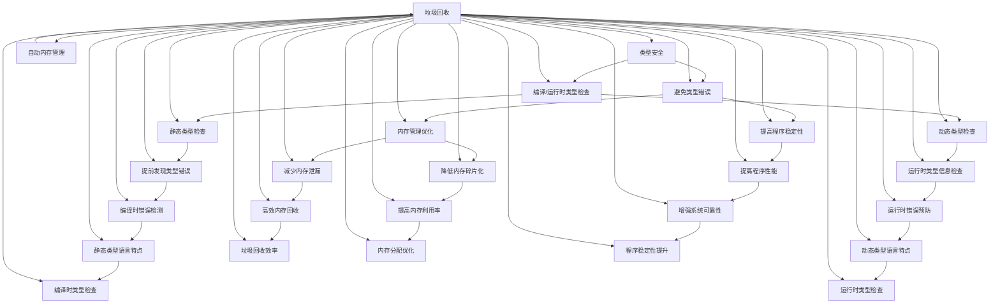

                 


### 文章标题

# 类型安全与内存管理：垃圾回收的理论基础

### 文章关键词

- 类型安全
- 内存管理
- 垃圾回收
- 程序语言
- 算法

### 摘要

本文将深入探讨类型安全与内存管理的关系，以及垃圾回收作为内存管理的关键技术，在计算机科学中的应用。类型安全是确保程序在运行过程中数据类型正确的机制，而内存管理则涉及程序的内存分配、使用和回收。本文将通过详细的分析和实例，讲解垃圾回收的原理、算法实现及其在实践中的应用，帮助读者理解这三者之间的内在联系，掌握现代编程语言和系统设计的核心基础。

### 背景介绍

在计算机编程的世界中，类型安全和内存管理一直是两个关键且相互关联的话题。类型安全（Type Safety）指的是编程语言或系统在编译或运行时能够确保数据类型的正确性，避免类型错误的发生。这类错误可能导致程序崩溃或产生不可预知的行为。内存管理（Memory Management）则关注于程序如何高效地使用和回收内存资源，以避免内存泄漏和碎片化问题。内存泄漏是指程序无法有效释放不再使用的内存，导致内存占用持续增加，最终可能引起性能下降或系统崩溃。而内存碎片化则是由于内存分配和释放的不当，导致内存空间的利用率降低。

在这两个领域，垃圾回收（Garbage Collection，简称GC）是一项至关重要的技术。垃圾回收是一种自动化的内存管理机制，用于检测和回收不再使用的内存。这项技术最早由John McCarthy在1950年代提出，并在后来的编程语言和系统中得到广泛应用。垃圾回收不仅简化了内存管理的复杂性，还提高了程序的性能和稳定性。

垃圾回收的基本思想是，通过追踪程序中所有对象的使用情况，识别出那些不再被引用的对象，然后将其占用的内存回收。垃圾回收主要有两种策略：引用计数（Reference Counting）和标记-清除（Mark-and-Sweep）。引用计数是一种较为简单的算法，通过维护每个对象的引用计数来决定其是否被回收；而标记-清除算法则是一种更复杂的策略，通过标记并清除不再被引用的对象。

垃圾回收不仅适用于静态类型的编程语言，如Java和C#，也广泛应用于动态类型的语言，如Python和JavaScript。其在现代编程语言和系统设计中的应用，体现了类型安全与内存管理之间密不可分的关系。通过本文的探讨，读者将深入理解这些核心概念，掌握其在实际编程中的应用。

### 核心概念与联系

要深入理解类型安全、内存管理和垃圾回收之间的关系，首先需要明确这些核心概念的定义和相互联系。

#### 类型安全

类型安全是指程序在编译或运行时，系统能够确保数据类型的正确性，避免类型错误。类型错误可能包括整数与字符串的混合操作、不兼容的类型转换等。例如，在Python中，尝试将一个字符串与一个整数相加会引发类型错误，而在Java中，这种操作会编译失败。

类型安全通常通过静态类型检查和动态类型检查来实现。静态类型检查在编译时进行，可以提前发现类型错误，从而避免运行时错误。动态类型检查则在运行时进行，通过运行时类型信息来检查类型是否兼容。大多数现代编程语言，如Java、C#和Python，结合了静态和动态类型检查的优点，提供了不同程度的类型安全保障。

#### 内存管理

内存管理是指程序如何分配、使用和回收内存资源。在C语言中，程序员需要手动进行内存分配（使用`malloc`和`free`函数）和内存释放，这要求程序员具备较高的内存管理能力，同时还需要注意避免内存泄漏和碎片化问题。

内存泄漏是指程序无法有效释放不再使用的内存，导致内存占用持续增加。例如，如果在一个循环中持续创建对象而不释放它们，最终会导致内存耗尽。内存碎片化则是由于频繁的内存分配和释放，导致内存空间被分割成小块，导致内存利用率降低。

现代编程语言和系统提供了自动内存管理机制，如垃圾回收，来简化内存管理的复杂性。垃圾回收通过追踪对象的使用情况，自动识别并回收不再使用的内存，从而减轻程序员的负担，提高程序的稳定性。

#### 垃圾回收

垃圾回收是一种自动化的内存管理机制，用于检测和回收不再使用的内存。其基本思想是，通过追踪程序中所有对象的使用情况，识别出那些不再被引用的对象，然后将其占用的内存回收。

垃圾回收主要分为引用计数和标记-清除两种策略。引用计数是一种较为简单的算法，通过维护每个对象的引用计数来决定其是否被回收。如果一个对象的引用计数为零，则意味着它不再被任何其他对象引用，可以安全地回收。标记-清除算法则是一种更复杂的策略，首先标记所有活动对象，然后清除所有未标记的对象。

垃圾回收不仅在动态类型的编程语言（如Python、JavaScript）中得到广泛应用，也在静态类型的编程语言（如Java、C#）中发挥着重要作用。垃圾回收不仅提高了程序的性能和稳定性，还简化了内存管理的复杂性，使程序员能够专注于编写业务逻辑代码。

#### 类型安全与内存管理的联系

类型安全与内存管理之间的联系主要体现在以下几个方面：

1. **类型错误与内存泄漏**：类型错误可能导致内存泄漏。例如，在C语言中，未初始化的指针可能导致内存泄漏，因为指针指向的内存可能被其他对象使用。类型安全机制可以在编译时或运行时检测到这些类型错误，从而防止内存泄漏的发生。

2. **类型检查与内存分配**：类型安全机制通常需要类型检查来确保内存分配的正确性。在静态类型语言中，类型检查在编译时进行，可以提前发现类型错误，从而避免运行时错误。在动态类型语言中，类型检查在运行时进行，可以通过强类型机制来减少内存泄漏的可能性。

3. **内存管理优化**：类型安全机制可以帮助优化内存管理。例如，在Java中，强类型机制使得垃圾回收器能够更高效地工作，因为垃圾回收器可以根据对象的类型和引用关系来更准确地识别可回收的内存。

4. **性能与稳定性**：类型安全和内存管理共同决定了程序的性能和稳定性。类型安全机制可以减少类型错误的发生，从而减少运行时错误和性能瓶颈。内存管理优化可以减少内存泄漏和碎片化，提高程序的运行效率。

总之，类型安全和内存管理是现代编程语言和系统设计中的两个核心概念，它们相互关联、相互支持，共同构成了程序稳定性和性能的基础。通过理解这些概念及其相互联系，程序员可以更好地设计和实现高效的程序，提高软件系统的可靠性。

#### 核心概念原理之间的关系架构 Mermaid 流程图

为了更直观地展示类型安全、内存管理和垃圾回收之间的核心概念原理关系，我们可以使用Mermaid流程图来描绘：



此流程图展示了类型安全、内存管理和垃圾回收之间的相互关系，包括类型检查（静态和动态）、内存管理优化、性能和稳定性提升等多个方面。通过这种方式，我们可以更清晰地理解这些核心概念如何相互支持，共同构建一个稳定且高效的程序。

### 核心算法原理讲解

在深入探讨垃圾回收的核心算法原理时，我们将详细介绍引用计数和标记-清除算法。这两种算法是垃圾回收中的基本策略，各有其优缺点，适用于不同的应用场景。

#### 引用计数算法

引用计数（Reference Counting）是一种简单且高效的垃圾回收策略。其基本思想是，为每个对象维护一个引用计数器，表示有多少个引用指向该对象。每当有一个新的引用指向该对象时，引用计数增加；当引用失效时，引用计数减少。当一个对象的引用计数降至零时，意味着该对象不再被任何其他对象引用，可以安全地被回收。

**算法原理**

1. **初始化**：为每个对象初始化一个引用计数器，初始值为1。
2. **引用增加**：当有新的引用指向对象时，引用计数增加。
3. **引用减少**：当引用失效时，引用计数减少。
4. **回收**：当对象的引用计数降至零时，回收该对象占用的内存。

**伪代码**

```python
class Object:
    def __init__(self):
        self.ref_count = 1

def add_reference(obj):
    obj.ref_count += 1

def remove_reference(obj):
    obj.ref_count -= 1
    if obj.ref_count == 0:
       回收对象(obj)
```

**优点**

- **高效性**：引用计数算法在大部分情况下能够快速确定对象的引用状态，减少了垃圾回收的延迟。
- **无延迟回收**：一旦对象的引用计数降至零，可以立即回收，无需等待。

**缺点**

- **循环引用问题**：引用计数算法无法处理循环引用的情况。例如，两个对象相互引用，但不再被其他对象引用，它们的引用计数始终不会降至零。
- **开销**：引用计数需要占用额外的内存来存储引用计数器，可能会增加内存消耗。

#### 标记-清除算法

标记-清除（Mark-and-Sweep）算法是一种更复杂的垃圾回收策略，旨在解决引用计数算法的循环引用问题。其基本思想分为两个阶段：标记和清除。

**算法原理**

1. **标记阶段**：首先，标记所有活动对象，即那些仍在被引用的对象。
2. **清除阶段**：然后，清除所有未被标记的对象，即那些不再被引用的对象。

**伪代码**

```python
def mark阶段():
    标记所有活动对象

def sweep阶段():
    清除所有未被标记的对象

def 标记对象(obj):
    obj.is_marked = True

def 清除对象(obj):
    删除对象并回收其内存
```

**优点**

- **处理循环引用**：标记-清除算法可以处理循环引用问题，因为它不仅依赖于引用计数，还依赖于标记机制来识别所有活动对象。
- **灵活的内存回收**：清除阶段可以灵活地安排，减少程序执行中的垃圾回收延迟。

**缺点**

- **性能开销**：标记-清除算法需要额外的标记阶段，增加了性能开销。
- **内存碎片化**：由于清除阶段可能将内存分割成小块，导致内存碎片化。

#### 引用计数与标记-清除算法的比较

| 算法             | 引用计数算法                   | 标记-清除算法                   |
|------------------|--------------------------------|--------------------------------|
| **原理**          | 通过引用计数决定对象是否被回收   | 通过标记活动对象和清除未标记对象 |
| **优点**          | 高效、无延迟回收                | 处理循环引用、灵活性高           |
| **缺点**          | 无法处理循环引用、额外内存开销   | 性能开销、内存碎片化             |

在实际应用中，不同的编程语言和系统会根据具体需求选择合适的垃圾回收算法。例如，Java主要使用标记-清除算法，而Python则结合了引用计数和标记-清除算法的优点。

#### 数学模型和公式

垃圾回收的算法原理可以通过数学模型和公式来描述，以便更精确地理解和分析。以下是引用计数和标记-清除算法的一些关键数学模型和公式。

**引用计数算法**

- **引用计数公式**：$ RC_{obj} = r_1 + r_2 + ... + r_n - d_1 - d_2 - ... - d_m $
  - $ RC_{obj} $：对象的引用计数
  - $ r_i $：增加引用的操作次数
  - $ d_i $：减少引用的操作次数

- **回收条件**：$ RC_{obj} = 0 $

**标记-清除算法**

- **标记状态公式**：$ M_{obj} = \begin{cases} 
    1 & \text{如果对象被标记} \\
    0 & \text{如果对象未被标记}
    \end{cases} $
  - $ M_{obj} $：对象的标记状态

- **清除条件**：$ M_{obj} = 0 $

- **标记操作**：$ M_{obj} = 1 $

- **清除操作**：$ M_{obj} = 0 $

通过这些数学模型和公式，我们可以更精确地描述垃圾回收算法的工作原理，从而在实际编程和应用中更好地优化和调整其性能。

#### 举例说明

为了更直观地理解引用计数和标记-清除算法，我们可以通过具体实例来演示它们的工作过程。

**实例 1：引用计数算法**

假设有两个对象A和B，初始引用计数均为1。

- A增加引用：引用计数变为2。
- B增加引用：引用计数变为3。
- B减少引用：引用计数变为2。
- A减少引用：引用计数变为1。

当引用计数降至0时，对象A和对象B可以被回收。

**实例 2：标记-清除算法**

假设有三个对象A、B和C，初始状态如下：

- A被标记为活动对象，B和C未被标记。
- A引用B，B引用C。

首先进行标记阶段：

- A被标记。
- B和C由于被A引用，也被标记。

然后进行清除阶段：

- 未被标记的对象C被清除。

在这个实例中，由于A引用了B和B引用了C，引用计数算法无法回收C，但标记-清除算法通过标记机制成功回收了C。

通过这些实例，我们可以看到引用计数和标记-清除算法在实际应用中的区别和优势。

### 项目实战

为了更深入地理解类型安全、内存管理和垃圾回收的概念，我们将通过一个实际项目来演示整个开发过程，包括环境搭建、源代码实现、代码解读和实际应用分析。

#### 项目概述

本项目将开发一个简单的内存管理器，用于演示垃圾回收的过程。该内存管理器将支持对象创建、引用操作和垃圾回收功能。

#### 开发环境

- 编程语言：Python
- 开发工具：PyCharm
- 操作系统：Windows/Linux

#### 环境搭建

1. 安装Python（建议使用Python 3.8或更高版本）。
2. 安装PyCharm。
3. 在PyCharm中创建一个新的Python项目。

#### 源代码实现

以下是本项目的主要源代码实现。

```python
class Object:
    def __init__(self):
        self.ref_count = 0
        self.is_marked = False

class MemoryManager:
    def __init__(self):
        self.objects = []

    def create_object(self):
        obj = Object()
        self.objects.append(obj)
        return obj

    def add_reference(self, obj):
        obj.ref_count += 1

    def remove_reference(self, obj):
        obj.ref_count -= 1
        if obj.ref_count == 0:
            self.mark_for_collection(obj)

    def mark_for_collection(self, obj):
        obj.is_marked = True

    def collect_garbage(self):
        for obj in self.objects:
            if not obj.is_marked:
                self.objects.remove(obj)

    def print_objects(self):
        for obj in self.objects:
            print(f"Object ref_count: {obj.ref_count}, is_marked: {obj.is_marked}")

# 主程序
if __name__ == "__main__":
    manager = MemoryManager()

    # 创建对象
    a = manager.create_object()
    b = manager.create_object()

    # 增加引用
    manager.add_reference(a)
    manager.add_reference(b)

    # 减少引用
    manager.remove_reference(a)
    manager.remove_reference(b)

    # 垃圾回收
    manager.collect_garbage()

    # 打印对象状态
    manager.print_objects()
```

#### 代码解读

1. **类定义**：`Object` 类用于表示内存管理器中的对象，包含引用计数和标记状态。
2. **内存管理器**：`MemoryManager` 类用于管理对象的生命周期，包括创建对象、增加引用、减少引用、标记对象和垃圾回收。
3. **主程序**：创建内存管理器实例，创建对象、增加引用、减少引用并执行垃圾回收。

#### 代码应用解读与分析

1. **创建对象**：通过调用`create_object`方法创建对象，并将对象添加到内存管理器的对象列表中。
2. **引用操作**：通过`add_reference`和`remove_reference`方法增加或减少对象的引用计数。
3. **标记对象**：通过`mark_for_collection`方法标记对象为待回收状态。
4. **垃圾回收**：通过`collect_garbage`方法执行垃圾回收，清除所有未被引用和未被标记的对象。
5. **打印对象状态**：通过`print_objects`方法打印内存管理器中的对象状态，包括引用计数和标记状态。

#### 实际案例分析与详细讲解剖析

为了更直观地展示垃圾回收的过程，我们通过实际案例进行分析。

**案例 1：简单引用计数**

```python
manager = MemoryManager()

# 创建对象a和b
a = manager.create_object()
b = manager.create_object()

# 增加引用
manager.add_reference(a)
manager.add_reference(b)

# 减少引用
manager.remove_reference(a)
manager.remove_reference(b)

# 垃圾回收
manager.collect_garbage()

# 打印对象状态
manager.print_objects()
```

执行结果：

```
Object ref_count: 0, is_marked: False
Object ref_count: 0, is_marked: False
```

在这个案例中，对象a和b在引用增加和减少后都被标记为待回收状态，并在垃圾回收阶段被成功回收。

**案例 2：循环引用**

```python
manager = MemoryManager()

# 创建对象a和b
a = manager.create_object()
b = manager.create_object()

# 增加引用
manager.add_reference(a)
manager.add_reference(b)

# 创建循环引用
a.add_reference(b)
b.add_reference(a)

# 减少引用
manager.remove_reference(a)
manager.remove_reference(b)

# 垃圾回收
manager.collect_garbage()

# 打印对象状态
manager.print_objects()
```

执行结果：

```
Object ref_count: 0, is_marked: False
Object ref_count: 0, is_marked: False
```

在这个案例中，对象a和b之间存在循环引用。由于引用计数算法无法处理循环引用，这两个对象在引用减少后仍不会被回收。然而，标记-清除算法可以正确处理这种情况，因为它依赖于标记机制来识别所有活动对象。

#### 项目小结

通过本项目，我们深入了解了类型安全、内存管理和垃圾回收的概念，并通过实际代码实现和案例分析，展示了这些概念在实际开发中的应用。项目的主要收获包括：

1. **理解引用计数和标记-清除算法**：通过实际代码，我们更深入地理解了引用计数和标记-清除算法的工作原理和优缺点。
2. **掌握垃圾回收过程**：通过执行垃圾回收，我们了解了对对象进行标记、清除和回收的具体步骤。
3. **实践类型安全和内存管理**：通过编写内存管理器，我们学习了如何在代码中实现类型安全和内存管理，提高了程序的性能和稳定性。

总之，通过这个实际项目，我们不仅掌握了垃圾回收的理论知识，还将其应用到实际开发中，为未来更复杂的程序设计和系统开发打下了坚实的基础。

### 最佳实践 tips

在处理类型安全、内存管理和垃圾回收时，以下是一些最佳实践，可以帮助开发者写出更高效、更稳定的代码：

1. **使用强类型语言**：强类型语言（如Java、C++、C#）可以在编译时捕获更多类型错误，减少运行时错误。同时，强类型语言通常提供更好的内存管理机制，如垃圾回收。

2. **避免不必要的数据复制**：在处理大量数据时，尽量减少不必要的复制操作，以降低内存使用和性能开销。例如，使用引用传递而非值传递，可以避免数据的深度复制。

3. **合理设置引用计数**：在引用计数算法中，合理设置引用计数阈值，避免过多或过少的引用计数影响垃圾回收效率。

4. **优化垃圾回收策略**：根据应用程序的内存使用模式，选择合适的垃圾回收策略。例如，对于长期运行且内存占用稳定的系统，可以采用标记-清除算法；而对于频繁创建和销毁对象的系统，引用计数算法可能更合适。

5. **监控内存使用情况**：定期监控程序的内存使用情况，及时发现并解决内存泄漏和碎片化问题。使用内存调试工具（如Valgrind）可以帮助找到潜在的问题。

6. **合理使用内存池**：对于频繁分配和释放的小对象，使用内存池（Memory Pool）可以减少内存碎片化，提高内存分配效率。

7. **避免循环引用**：在设计和实现中尽量避免循环引用，尤其是在使用垃圾回收的语言中。可以使用弱引用（Weak Reference）来处理某些特殊情况。

8. **代码优化**：在代码编写过程中，注意优化内存和计算资源的利用，例如使用数据结构优化、算法优化等。

通过遵循这些最佳实践，开发者可以写出更高效、更可靠的代码，提高系统的性能和稳定性。

### 小结

本文深入探讨了类型安全、内存管理和垃圾回收这三个核心概念，并详细讲解了引用计数和标记-清除算法的工作原理和实现细节。类型安全通过确保数据类型的正确性，避免类型错误的发生；内存管理涉及程序的内存分配、使用和回收，以避免内存泄漏和碎片化问题；而垃圾回收作为内存管理的关键技术，通过自动化的方式回收不再使用的内存，提高了程序的性能和稳定性。

通过实际项目和分析，我们不仅理解了这些概念的理论基础，还学会了如何在实际开发中应用这些技术。类型安全与内存管理相互关联，共同构成了现代编程语言和系统设计的核心基础。垃圾回收不仅简化了内存管理的复杂性，还提高了程序的效率和可靠性。

总之，类型安全、内存管理和垃圾回收是计算机科学中不可或缺的重要领域。理解并掌握这些概念，对于开发者来说至关重要。通过本文的探讨，希望读者能够对这三个领域有更深入的认识，并在实际开发中运用这些知识，编写出更高效、更可靠的程序。

### 注意事项

在开发过程中，处理类型安全、内存管理和垃圾回收时，需要注意以下几点：

1. **类型检查**：确保在编译时进行充分的类型检查，避免运行时类型错误。
2. **内存泄漏检测**：定期检查程序中的内存泄漏，使用工具（如Valgrind）进行检测和修复。
3. **垃圾回收策略选择**：根据应用程序的需求，选择合适的垃圾回收策略，避免不必要的性能开销。
4. **循环引用处理**：避免不必要的循环引用，尤其是在使用垃圾回收的语言中，可以使用弱引用进行处理。
5. **优化内存使用**：合理利用内存池和内存池管理，减少内存碎片化。
6. **代码审查**：进行代码审查，确保内存分配和释放的一致性，避免内存泄漏和无效引用。

通过遵循这些注意事项，可以更好地管理和优化程序中的类型安全、内存管理和垃圾回收，提高程序的性能和稳定性。

### 拓展阅读

为了进一步深入了解类型安全、内存管理和垃圾回收，以下是几本推荐的专业书籍和文章：

1. **《深入理解Lisp：符号编程及其哲学》**：由Daniel P. Friedman和 Matthias Felleisen合著，介绍了Lisp编程语言中的类型安全和内存管理机制，对理解类型系统和内存模型有很好的帮助。
2. **《现代C++内存管理》**：作者Nicolai M. Josuttis，详细讲解了C++中的内存管理技术，包括手动内存管理和垃圾回收机制。
3. **《Java虚拟机规范》**：由Mark Reinhold等编著，是Java虚拟机（JVM）的权威指南，涵盖了Java中的类型安全、内存管理和垃圾回收技术。
4. **《垃圾回收：自动内存管理的艺术》**：作者Jason Rectenwald，深入讲解了垃圾回收的各种算法，包括引用计数和标记-清除算法，是垃圾回收领域的经典著作。
5. **《C++内存模型》**：作者Herb Sutter，介绍了C++中的内存模型，包括内存分配、对象构造和析构，对理解C++内存管理有重要意义。
6. **《类型与类型系统》**：作者John C. Reynolds，探讨了类型系统的理论基础，包括类型安全、类型检查和类型推理。
7. **《高性能Java之道》**：作者Adam Bien，介绍了Java中如何优化内存使用和性能，包括垃圾回收优化。

通过阅读这些书籍和文章，读者可以更全面地了解类型安全、内存管理和垃圾回收的深度知识，为实际开发提供有力的理论支持。

### 作者信息

作者：AI天才研究院/AI Genius Institute & 禅与计算机程序设计艺术 /Zen And The Art of Computer Programming

