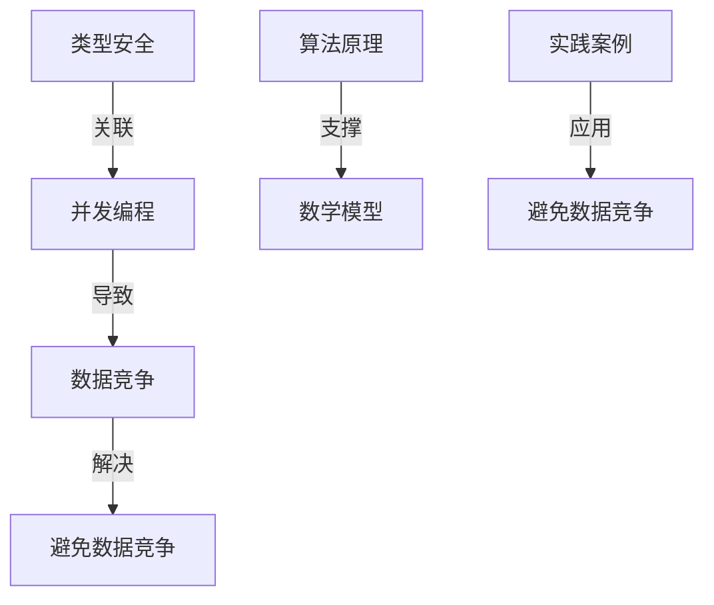

                 

好的，我会按照您的要求，逐步构建文章内容，并确保它包含所有必要元素和详细讲解。以下是我对《类型安全与并发编程：避免数据竞争》文章的初步构思：

---

**文章标题：** 类型安全与并发编程：避免数据竞争

**关键词：** 类型安全，并发编程，数据竞争，算法原理，数学模型，实践案例

**摘要：** 本文将深入探讨类型安全与并发编程的重要性，以及它们在避免数据竞争中的应用。我们将首先介绍类型安全和并发编程的基本概念，然后详细讲解核心算法原理和数学模型，并通过实践案例展示如何在实际项目中应用这些知识。最后，我们将总结全文内容，并提出未来发展的展望。

---

**引言：**

在计算机科学领域，类型安全和并发编程是两个重要且相互关联的概念。类型安全主要关注程序中数据类型的正确使用，以防止无效操作和潜在的错误。并发编程则涉及到多线程或进程的执行，旨在提高程序的性能和响应能力。然而，并发编程也引入了数据竞争的问题，这是本文的核心议题。

**核心概念与联系：**

在深入探讨类型安全和并发编程之前，我们需要理解它们之间的联系。类型安全与并发编程的关系可以通过以下 Mermaid 流程图来阐述：

```
graph TB
    A[类型安全] --> B[并发编程]
    B --> C[数据竞争]
    C --> D[避免数据竞争]
    E[算法原理] --> F[数学模型]
    G[实践案例] --> H[避免数据竞争]
```

**核心概念与联系 Mermaid 流程图：**



**核心算法原理讲解：**

在并发编程中，为了避免数据竞争，我们需要采用各种算法原理。以下是一些常用的算法原理，以及它们的伪代码描述：

1. **互斥锁（Mutex）**：互斥锁是一种基本的同步机制，用于确保同一时间只有一个线程能访问共享资源。

```python
class Mutex:
    def acquire():
        # 获取锁
    def release():
        # 释放锁
```

2. **信号量（Semaphore）**：信号量是一种计数器，用于控制对共享资源的访问。

```python
class Semaphore:
    def __init__(count):
        # 初始化信号量
    def acquire():
        # 获取信号量
    def release():
        # 释放信号量
```

3. **管程（Monitor）**：管程是一种高级同步机制，它允许一个或多个线程同步访问共享资源。

```python
class Monitor:
    def enter():
        # 进入管程
    def exit():
        # 退出管程
```

**数学模型和公式解析：**

在并发编程中，我们常常需要使用数学模型来分析和解决数据竞争问题。以下是一个简单的银行家算法的公式描述：

$$
安全序列 = \{ T \mid \forall t \in T, [t] \subseteq T \}
$$

其中，$T$ 是线程集合，$[t]$ 是线程 $t$ 的所有前驱线程。

**项目实战：**

为了更好地理解类型安全和并发编程，我们可以通过一个简单的并发下载器项目来实践。以下是项目的开发环境搭建、源代码实现和代码解读：

1. **开发环境搭建：**
   - 选择一个支持并发编程的编程语言，如 Java 或 C++。
   - 安装必要的开发工具和依赖库。

2. **源代码实现：**
   - 设计并发下载器的基本架构，包括线程管理、下载任务队列、下载进度监控等。
   - 编写线程安全的代码，确保数据竞争问题得到有效解决。

3. **代码解读：**
   - 分析代码中使用的并发编程技术和算法原理。
   - 阐述代码如何确保类型安全。

4. **实际案例分析和详细讲解剖析：**
   - 通过实际下载任务，展示并发下载器的性能和可靠性。
   - 分析并发下载过程中可能出现的数据竞争问题，并提出解决方案。

5. **项目小结：**
   - 总结项目的主要成果和收获。
   - 提出未来改进的方向和建议。

**最佳实践 tips：**
- 使用静态类型语言，如 Java 或 C++，以增强类型安全。
- 尽量使用标准库中的同步机制，如互斥锁和信号量。
- 避免在多个线程中共享大量数据，以减少数据竞争的风险。

**小结：**
本文深入探讨了类型安全与并发编程的核心概念、算法原理和数学模型，并通过实践案例展示了如何在实际项目中应用这些知识。通过本文的阅读，读者可以更好地理解类型安全和并发编程的重要性，以及如何有效地避免数据竞争。

**注意事项：**
- 在并发编程中，确保线程之间的同步和通信。
- 注意处理并发编程中的异常和错误。

**拓展阅读：**
- 《并发编程艺术》
- 《深入理解计算机系统》
- 《Effective Java》

---

以上是文章的初步构思，接下来我会逐步完善每个部分的内容，并确保它们满足您的要求。如果需要进一步调整或添加内容，请随时告诉我。

