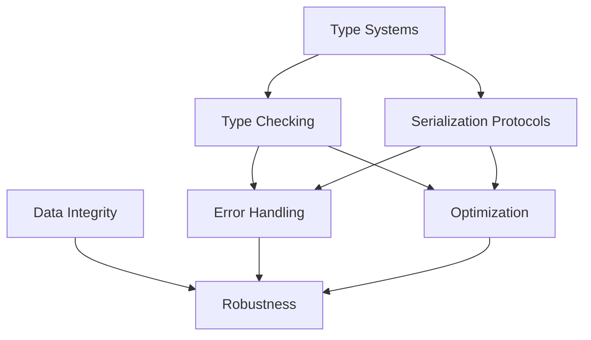
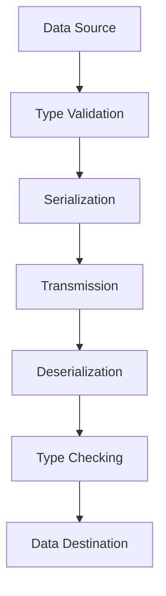
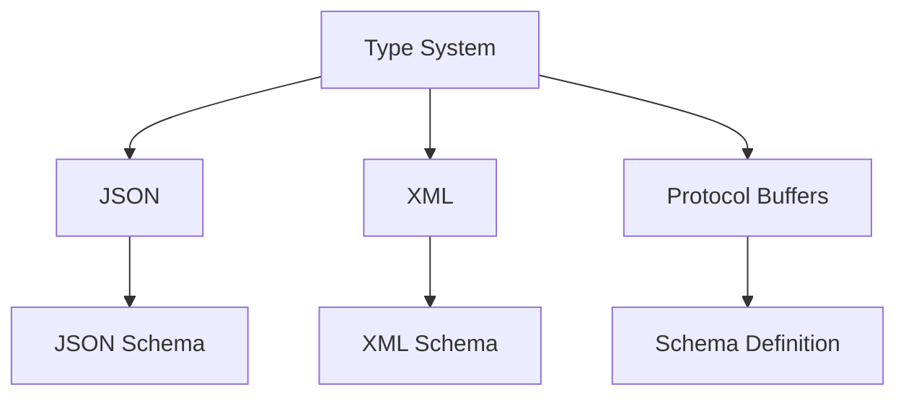

                 


### Introduction to "Type Safety and Serialization: Data Transmission Reliability"

**Title:** Type Safety and Serialization: Data Transmission Reliability

**Keywords:** Type Safety, Data Serialization, Data Transmission, Reliability, Programming Languages

**Abstract:**
This comprehensive guide explores the intricacies of type safety and data serialization, two pivotal aspects of data transmission reliability in modern computing systems. We begin by delving into the foundational concepts of type safety, including its significance, challenges, and benefits. The discussion then extends to core principles and algorithms essential for ensuring type safety. Following this, we examine various data serialization methods and their application in distributed systems. Through a blend of theoretical insights and practical examples, this book aims to provide a robust understanding of how type safety and serialization contribute to the reliability of data transmission.

**Format Requirements:**
The content of this article will be formatted using Markdown syntax. Each section, chapter, and subsection will be clearly outlined and structured for easy readability. LaTeX-formatted mathematical expressions will be used where appropriate, enclosed within `$` for inline formulas and `$$` for display formulas.

**Author Information:**
Author: AI Genius Institute & Zen and the Art of Computer Programming

**Completeness Requirements:**
The article must be comprehensive, with each section providing detailed and specific explanations. Key content elements must include:
- Background introductions
- Core concept and relationship architectures illustrated with Mermaid diagrams
- Detailed explanations of core algorithms using pseudocode
- Mathematical models and formulas with detailed explanations and examples
- Practical case studies and detailed analysis
- Best practice tips, summaries, and additional reading suggestions

**Word Count:**
The article is expected to be between 8000 to 12000 words.

---

### Foundations of Type Safety

#### Chapter 1: Introduction to Type Safety

**1.1 What is Type Safety?**

Type safety is a fundamental concept in programming languages that ensures the correctness and reliability of programs by enforcing constraints on how variables and values are used. At its core, type safety ensures that a program does not perform operations that could lead to unintended behavior or errors due to mismatched types.

In a type-safe environment, operations that require compatible types are checked before execution. This prevention of invalid operations reduces the likelihood of runtime errors and enhances the robustness of the software. Type safety is particularly crucial in systems where data integrity and reliability are paramount, such as in financial systems, embedded systems, and distributed computing environments.

**1.2 The Importance of Type Safety in Data Transmission**

Type safety is not merely a concern within the confines of a single program but extends to the transmission of data across different systems and applications. When data is transmitted between systems, it must be ensured that the data is interpreted correctly and that any transformations or conversions maintain its integrity.

The importance of type safety in data transmission can be highlighted through several aspects:

- **Prevention of Errors:** By enforcing type constraints during transmission, potential errors such as type mismatches can be detected and handled before data is processed, preventing crashes and data corruption.

- **Enhanced Reliability:** Type safety ensures that the data is correctly structured and formatted, reducing the risk of misinterpretation or loss of information during transmission.

- **Improved Maintainability:** Clear type specifications make it easier for developers to understand and maintain the system, as the intended use of data is explicitly defined.

- **Interoperability:** Type-safe data formats facilitate interoperability between different systems and applications, enabling seamless data exchange and integration.

**1.3 Challenges in Ensuring Type Safety**

While the benefits of type safety are evident, ensuring type safety in data transmission poses several challenges:

- **Complexity of Types:** Modern programming languages support a wide variety of data types, including primitive types, compound types, and user-defined types. Ensuring type safety across diverse types can be complex and requires robust type-checking mechanisms.

- **Dynamic Typing:** Languages with dynamic typing do not perform type checks at compile-time but rather at runtime. This dynamic nature can introduce challenges in ensuring type safety, as type errors may only be detected during execution.

- **Interoperability Issues:** When transmitting data between systems that use different programming languages or data formats, ensuring compatibility and type safety can be challenging, especially if there are discrepancies in type definitions or representations.

- **Performance Overheads:** Strict type checking can introduce performance overheads, particularly in languages with static type systems. Balancing type safety with performance optimization is an ongoing challenge in software development.

**1.4 Benefits of Robust Type Safety Mechanisms**

Implementing robust type safety mechanisms in data transmission systems offers several benefits:

- **Error Reduction:** By preventing type-related errors, robust type safety mechanisms significantly reduce the likelihood of runtime errors, crashes, and data corruption.

- **Improved Debugging:** Clear type specifications facilitate debugging by providing precise information about the expected data format and structure, making it easier to identify and fix issues.

- **Enhanced Security:** Type safety helps protect against certain types of attacks, such as buffer overflows and type confusion, by ensuring that data is used in a controlled and predictable manner.

- **Better Performance:** While strict type checking can introduce performance overheads, modern type systems and optimization techniques can mitigate these effects, allowing for efficient type safety without significant performance degradation.

In conclusion, type safety is a critical aspect of ensuring reliable data transmission. By addressing the challenges associated with type safety and implementing robust mechanisms, developers can enhance the reliability, security, and maintainability of their systems.

### Core Concepts and Principles of Type Safety

#### Chapter 2: Core Concepts and Principles of Type Safety

**2.1 Types and Type Systems**

**2.1.1 Types in Programming Languages**

Types are fundamental constructs in programming languages that categorize data based on their characteristics and behaviors. Types define the kind of values that can be stored in variables, the operations that can be performed on them, and how these values are represented in memory.

There are several types in programming languages, which can be broadly classified into:

- **Primitive Types:** These are basic types provided by the language, such as integers, floating-point numbers, characters, and boolean values. Examples include `int`, `float`, `char`, and `bool` in C.

- **Compound Types:** These are constructed from primitive types or other compound types. Examples include arrays, structures, unions, and classes. In C, an array of integers can be represented as `int[]`, a structure can be represented as `struct`, and a class can be represented as `class`.

- **User-Defined Types:** These are types defined by the programmer, such as custom data structures or enumeration types. For example, a programmer can define a `Person` struct with fields like `name` and `age`.

**2.1.2 Type Systems**

A type system is a set of rules that dictate how types can be used in a programming language. Type systems serve several purposes, including:

- **Ensuring Type Safety:** By enforcing type constraints, type systems prevent operations that could lead to incorrect or invalid behavior, thereby enhancing the reliability and robustness of the program.

- **Improving Compiler Efficiency:** Type systems enable compilers to generate more efficient code by performing type checks and optimizations based on known type information.

- **Enhancing Readability and Maintainability:** Clear type specifications make the code easier to understand and maintain, as the expected behavior and structure of data are explicitly defined.

There are different types of type systems, which can be categorized into:

- **Static Type Systems:** In static type systems, type checking is performed at compile-time. Languages like Java and C# use static type systems, where the type of a variable is known and checked before the program is executed.

- **Dynamic Type Systems:** In dynamic type systems, type checking is performed at runtime. Languages like Python and JavaScript use dynamic type systems, where the type of a variable is determined during execution.

**2.2 Type Inference and Type Checking**

**2.2.1 Type Inference**

Type inference is a type-checking mechanism that allows the compiler or interpreter to automatically determine the type of expressions and variables based on their context and usage. This eliminates the need for explicit type declarations, making the code more concise and readable.

There are different strategies for type inference, including:

- **Static Type Inference:** In static type inference, the compiler infers the type of an expression based on its context and the type information of surrounding code. Java's generics use static type inference to infer the type of generic parameters.

- **Dynamic Type Inference:** In dynamic type inference, the interpreter infers the type of an expression at runtime based on the actual values being used. Python's duck typing is an example of dynamic type inference.

**2.2.2 Type Checking**

Type checking is the process of verifying that the operations performed in a program are valid given the types of the involved variables and expressions. Type checking can be performed at compile-time (static type checking) or runtime (dynamic type checking).

Static type checking has the advantage of detecting type errors early in the development process, reducing the likelihood of runtime errors. However, it can be more verbose and less flexible compared to dynamic type checking.

Dynamic type checking allows for greater flexibility and conciseness but can lead to runtime errors that are harder to detect and fix. Examples of dynamically typed languages include Python and JavaScript.

**2.3 Type Safety in Programming Languages**

**2.3.1 Compile-Time Type Safety**

In programming languages with static type systems, type safety is enforced at compile-time. The compiler checks the types of variables and expressions and ensures that operations are performed on compatible types. If a type mismatch is detected, the compiler generates an error, preventing the program from executing.

Compile-time type checking offers several advantages, including:

- **Early Error Detection:** Type errors are detected before the program is executed, reducing the likelihood of runtime errors.
- **Improved Performance:** The compiler can generate optimized code based on known type information, leading to better performance.
- **Enhanced Readability and Maintainability:** Clear type specifications make the code easier to understand and maintain.

**2.3.2 Runtime Type Safety**

In dynamically typed languages, type safety is enforced at runtime. The interpreter checks the types of variables and expressions during execution and performs type conversions as needed. This approach allows for greater flexibility but can introduce runtime errors.

Runtime type checking has its advantages, including:

- **Concise and Flexible Code:** Developers do not need to specify types explicitly, allowing for more concise and flexible code.
- **Dynamic Type Conversion:** Programs can handle different types of data seamlessly, enabling dynamic and adaptable behavior.

However, runtime type checking also has its drawbacks:

- **Delayed Error Detection:** Type errors are detected during execution, making them harder to detect and fix.
- **Potential Performance Overheads:** The need for runtime type checking can introduce performance overheads, particularly in languages with complex type systems.

**2.4 Type Safety in Data Serialization**

Data serialization is the process of converting data structures or object states into a format that can be stored or transmitted and reconstructed later. Ensuring type safety in data serialization is crucial for maintaining the integrity and consistency of data.

**2.4.1 Challenges in Data Serialization**

- **Type Mismatch:** During serialization, the types of the data structures need to be converted to a common format. Mismatches between the source and target types can lead to incorrect or lost data.

- **Data Structure Complexity:** Complex data structures with nested elements can be challenging to serialize while preserving their integrity and type information.

- **Interoperability Issues:** Data serialization formats and protocols may vary between different systems and applications, requiring additional effort to ensure compatibility and type safety.

**2.4.2 Type Safety in Common Serialization Formats**

Several popular data serialization formats have built-in mechanisms to ensure type safety:

- **JSON:** JSON (JavaScript Object Notation) is a lightweight data interchange format that uses a simple and human-readable syntax. JSON Schema is an extension of JSON that provides a mechanism for validating the structure and type of JSON data.

- **XML:** XML (eXtensible Markup Language) is a flexible and self-descriptive data format. XML Schema is a W3C specification that defines the structure and type of XML data, enabling strict type validation.

- **Protocol Buffers:** Protocol Buffers is a language-agnostic data interchange format developed by Google. It uses a schema-based approach to define the structure and type of data, ensuring type safety during serialization and deserialization.

- **MessagePack:** MessagePack is a binary serialization format that aims to be more efficient and flexible than JSON. It includes type information in the serialized data, allowing for strict type validation.

**2.4.3 Ensuring Type Safety in Data Serialization**

To ensure type safety in data serialization, the following practices can be adopted:

- **Use Well-Defined Data Formats:** Utilize well-defined data formats that provide built-in type validation mechanisms, such as JSON Schema, XML Schema, or Protocol Buffers.

- **Explicit Type Annotations:** Provide explicit type annotations for data structures and fields during serialization, making it easier to validate and enforce type constraints.

- **Type Conversion and Validation:** Implement robust type conversion and validation mechanisms to handle type mismatches and ensure the integrity of serialized data.

- **Consistent Data Formats:** Establish consistent data formats and protocols across different systems and applications to ensure seamless interoperability and type safety.

In conclusion, type safety is a critical aspect of ensuring reliable data transmission. By understanding the core concepts and principles of type safety and implementing robust mechanisms in data serialization, developers can enhance the reliability, security, and maintainability of their systems.

### Mermaid Diagram of Type Safety and Serialization Architecture

**3.1 Overview of Type Safety Architecture**

The architecture of type safety encompasses several components, including type systems, type checking mechanisms, and serialization protocols. A comprehensive understanding of this architecture is essential for ensuring the reliability of data transmission. Below, we present a Mermaid diagram that illustrates the interactions between these components.



**3.2 Data Flow in Type-Safe Serialization**

In a type-safe serialization process, data flows from its source format through various transformation stages to its destination format. The following diagram illustrates the data flow and the role of type safety at each stage:



**3.3 Interactions Between Type Systems and Serialization**

Type systems and serialization protocols interact closely to ensure that data is correctly and safely transmitted. The diagram below highlights the interactions between type systems and common serialization protocols:



- **JSON and JSON Schema:** JSON is a popular serialization format that uses a simple and human-readable syntax. JSON Schema provides a mechanism for validating the structure and type of JSON data, ensuring type safety.

- **XML and XML Schema:** XML is a flexible and self-descriptive data format. XML Schema is a W3C specification that defines the structure and type of XML data, enabling strict type validation.

- **Protocol Buffers:** Protocol Buffers is a schema-based data interchange format developed by Google. It uses a schema definition to ensure type safety during serialization and deserialization.

In conclusion, the Mermaid diagrams provided offer a visual representation of the type safety architecture and the interactions between type systems and serialization protocols. By understanding these architectures and the data flow, developers can better ensure the reliability and integrity of data transmission in their systems.

### Core Algorithms for Ensuring Type Safety

**4.1 Type Checking Algorithms**

**4.1.1 Introduction to Type Checking**

Type checking is a fundamental process in ensuring type safety within programming languages. It involves verifying that the operations and expressions in a program adhere to the specified type rules defined by the language's type system. The goal of type checking is to catch type errors early, during compile-time or runtime, to prevent potential runtime errors and improve the reliability of the program.

There are two primary forms of type checking: static type checking and dynamic type checking.

- **Static Type Checking:** In static type checking, the compiler checks the types of expressions and variables at compile-time. This approach ensures that type errors are caught before the program is executed, providing faster error detection and potentially more optimized code. Languages like Java, C#, and C++ use static type checking.

- **Dynamic Type Checking:** In dynamic type checking, the interpreter checks the types of expressions and variables at runtime. This approach allows for greater flexibility, as the types of variables can change during execution. However, it also means that type errors may only be detected during execution, potentially leading to harder-to-debug issues. Python and JavaScript are examples of languages that use dynamic type checking.

**4.1.2 Type Checking Process**

The type checking process typically involves the following steps:

1. **Type Inference:** The compiler or interpreter infers the types of expressions based on their context and the type information of surrounding code. In statically typed languages, type inference is used to reduce the need for explicit type declarations.

2. **Type Analysis:** The type system analyzes the program to determine the compatibility of types in expressions and operations. This involves checking that the types of operands are compatible with the operators and ensuring that the expected types of function calls match the actual types of arguments.

3. **Type Errors:** If the type system detects any inconsistencies or type mismatches, it generates type error messages, indicating the location and nature of the error in the code.

**4.1.3 Common Type Checking Algorithms**

Several algorithms are used for type checking, depending on the type system and language. Here are some common algorithms:

1. **Type Inference Algorithms:**

   - **Unification:** This algorithm is used to determine the most general type that can satisfy a set of type constraints. It is commonly used in languages with strong type inference.

     ```pseudocode
     unify(T1, T2):
         if T1 == T2:
             return T1
         if T1 is a variable and T2 is a concrete type:
             bind T1 to T2
             return T2
         if T2 is a variable and T1 is a concrete type:
             bind T2 to T1
             return T1
         if T1 and T2 are both variables:
             bind both to a new type
             return the new type
         return fail
     ```

   - **Type Checking with Abstract Syntax Trees (ASTs):** This algorithm traverses the abstract syntax tree of the program, checking the types of expressions and operations according to the language's type rules.

     ```pseudocode
     checkAST(node):
         for each child of node:
             check the type of the child
         if node is an operation:
             check that the types of the operands are compatible with the operation
         if node is a variable assignment:
             check that the type of the assigned value matches the type of the variable
         return true if no type errors are found, otherwise return false
     ```

2. **Type Checking with Type Inference and Subtyping:**

   - **Subtyping:** This algorithm checks if a type expression is a subtype of another type expression. Subtyping is a key concept in many type systems, allowing for more flexible type checking.

     ```pseudocode
     isSubtype(T1, T2):
         if T1 == T2:
             return true
         if T1 is a concrete type and T2 is a variable:
             bind T1 to T2
             return true
         if T2 is a concrete type and T1 is a variable:
             bind T2 to T1
             return false
         if both T1 and T2 are variables:
             return true (since variables can be unified)
         return false
     ```

   - **Type Inference with Subtyping:** This algorithm combines type inference with subtyping to infer the most general type that is a subtype of the expected type.

     ```pseudocode
     inferType(expression, expectedType):
         if expression type is known and isSubtype(expressionType, expectedType):
             return expressionType
         else:
             return inferMostGeneralSubtype(expressionType, expectedType)
     ```

**4.1.4 Advantages and Disadvantages of Type Checking Algorithms**

The choice of type checking algorithm depends on the language's design goals and requirements. Here are some advantages and disadvantages of different algorithms:

- **Unification:**
  - **Advantages:** Simple and effective for resolving type constraints, suitable for languages with strong type inference.
  - **Disadvantages:** Can be computationally expensive, especially for complex type structures.

- **AST-based Type Checking:**
  - **Advantages:** Directly integrates with the language's syntax and semantics, providing precise type checking.
  - **Disadvantages:** May require extensive parsing and analysis, potentially impacting performance.

- **Subtyping and Inference:**
  - **Advantages:** Flexible and adaptable to a wide range of type systems, supports polymorphism and generic programming.
  - **Disadvantages:** Requires a more complex type system and can introduce additional runtime overhead.

In conclusion, type checking algorithms play a crucial role in ensuring type safety in programming languages. By understanding the different algorithms and their properties, developers can choose the most appropriate approach for their specific language and application requirements.

### Data Serialization Methods

**5.1 What is Data Serialization?**

Data serialization is the process of converting data structures or object states into a format that can be easily stored or transmitted and later reconstructed. This process is essential for enabling communication between different systems and applications, especially in distributed computing environments where data needs to be transferred across networks or stored in various storage media.

The primary purpose of data serialization includes:

- **Data Storage:** Serialization allows data to be stored in files or databases, making it accessible for later retrieval and processing.
- **Data Transmission:** Serialization facilitates the transmission of data over networks or between different processes, ensuring that the data is correctly interpreted by the receiving end.
- **Interoperability:** By defining standardized data formats, serialization enables seamless data exchange and integration between diverse systems and applications.

**5.2 Types of Data Serialization Formats**

There are several popular data serialization formats used in modern computing. Each format has its advantages and is suitable for different use cases. Here are some common serialization formats:

- **JSON (JavaScript Object Notation):** JSON is a lightweight data interchange format that uses a simple and human-readable syntax. It is based on a subset of the JavaScript language and is widely used for transmitting data between a server and a web application. JSON supports a variety of data types, including strings, numbers, booleans, arrays, and objects.

- **XML (eXtensible Markup Language):** XML is a flexible and self-descriptive data format that uses a markup language to define data. It is highly extensible and supports complex data structures, making it suitable for applications that require a high degree of data interoperability. XML is widely used in web services, configuration files, and document formats.

- **Protocol Buffers:** Protocol Buffers, also known as Protobuf, is a language-agnostic data interchange format developed by Google. It uses a schema-based approach to define the structure and type of data, making it highly efficient and easy to use. Protocol Buffers are commonly used for communication between different services in distributed systems.

- **MessagePack:** MessagePack is a binary serialization format that aims to be more efficient and flexible than JSON. It is designed to be compact and fast, making it suitable for use cases where data size and transmission speed are critical.

**5.3 Use Cases for Data Serialization**

Data serialization is used in various scenarios across different domains. Some common use cases include:

- **Web APIs:** JSON and XML are frequently used for transmitting data between web servers and client applications. JSON is preferred due to its simplicity and faster parsing, while XML is used when interoperability with legacy systems is required.

- **Database Storage:** Serialization is used to store data in databases or files. This is particularly useful for complex data structures that need to be persisted and later retrieved efficiently.

- **Distributed Systems:** In distributed systems, data serialization is crucial for communication between different services. Formats like Protocol Buffers and MessagePack are used for their efficiency and compatibility across different programming languages and platforms.

- **Mobile Applications:** Data serialization is used in mobile applications for caching data locally and transmitting data to the server. JSON and XML are commonly used due to their compatibility with web technologies and ease of use.

- **Real-Time Data Processing:** Efficient data serialization formats like MessagePack and Protocol Buffers are used in real-time data processing systems to minimize overhead and maximize throughput.

In conclusion, data serialization is a fundamental process in modern computing, enabling the efficient storage, transmission, and exchange of data between different systems and applications. By understanding the various serialization formats and their use cases, developers can choose the most appropriate method to meet their specific requirements.

### Detailed Study of Common Serialization Methods

**6.1 JSON and JSON Schema**

**6.1.1 JSON Structure**

JSON (JavaScript Object Notation) is a lightweight data interchange format that is easy for humans to read and write and easy for machines to parse and generate. It is based on a subset of the JavaScript language and is widely used for transmitting data between a server and a web application. JSON is particularly well-suited for web applications due to its compatibility with JavaScript and its simplicity.

The basic structure of JSON consists of objects and arrays. An object is a collection of key-value pairs, where keys are strings and values can be any JSON data type, including other objects and arrays. An array is an ordered collection of values, which can also be other JSON data types.

Here is an example of a JSON object:

```json
{
  "name": "John Doe",
  "age": 30,
  "isStudent": false,
  "courses": ["Math", "Science", "English"],
  "address": {
    "street": "123 Main St",
    "city": "Anytown",
    "state": "CA"
  }
}
```

In this example, the JSON object contains various data types, including strings, numbers, booleans, arrays, and nested objects.

**6.1.2 JSON Schema for Type Safety**

While JSON is flexible and easy to use, ensuring type safety in JSON data can be challenging without additional validation mechanisms. JSON Schema is an extension of JSON that provides a mechanism for validating the structure and type of JSON data. JSON Schema defines a set of rules and constraints that can be used to validate the structure, data types, and other properties of a JSON document.

A JSON Schema document is itself a JSON object that defines the schema for other JSON documents. It includes definitions for required properties, data types, default values, and constraints. Here is an example of a JSON Schema document that validates the structure of the JSON object from the previous example:

```json
{
  "$schema": "http://json-schema.org/draft-07/schema#",
  "type": "object",
  "properties": {
    "name": {
      "type": "string"
    },
    "age": {
      "type": "integer",
      "minimum": 0
    },
    "isStudent": {
      "type": "boolean"
    },
    "courses": {
      "type": "array",
      "items": {
        "type": "string"
      }
    },
    "address": {
      "type": "object",
      "properties": {
        "street": {
          "type": "string"
        },
        "city": {
          "type": "string"
        },
        "state": {
          "type": "string"
        }
      },
      "required": ["street", "city", "state"]
    }
  },
  "required": ["name", "age", "isStudent", "courses", "address"]
}
```

This JSON Schema document specifies the expected structure and types for the JSON object, including required properties and constraints on the data types. When the JSON object is validated against this schema, any discrepancies or violations of the defined rules will result in validation errors.

**6.2 XML and XML Schema**

**6.2.1 XML Structure**

XML (eXtensible Markup Language) is a flexible and self-descriptive data format that uses a markup language to define data. Unlike JSON, which is based on JavaScript, XML is designed to be platform- and language-independent. XML uses tags to define elements and attributes to provide additional information about those elements. The structure of an XML document is defined by a Document Type Definition (DTD) or an XML Schema.

Here is an example of an XML document:

```xml
<?xml version="1.0" encoding="UTF-8"?>
<!DOCTYPE person [
  <!ELEMENT person (name, age, isStudent?)>
  <!ELEMENT name (#PCDATA)>
  <!ELEMENT age (#PCDATA)>
  <!ELEMENT isStudent (#PCDATA)>
] >
<person>
  <name>John Doe</name>
  <age>30</age>
  <isStudent>false</isStudent>
</person>
```

In this example, the XML document defines a `person` element with child elements for `name`, `age`, and optionally `isStudent`. The content of these elements is represented by the text between the corresponding start and end tags.

**6.2.2 XML Schema for Type Safety**

XML Schema is a W3C specification that defines the structure and type of XML data. It provides a more robust and flexible way to define data types and constraints compared to DTDs. XML Schema includes definitions for data types, elements, attributes, and other structural components of an XML document.

Here is an example of an XML Schema document that defines the structure and types for the XML document from the previous example:

```xml
<xs:schema xmlns:xs="http://www.w3.org/2001/XMLSchema">
  <xs:element name="person">
    <xs:complexType>
      <xs:sequence>
        <xs:element name="name" type="xs:string"/>
        <xs:element name="age" type="xs:integer"/>
        <xs:element name="isStudent" type="xs:boolean" minOccurs="0"/>
      </xs:sequence>
    </xs:complexType>
  </xs:element>
</xs:schema>
```

This XML Schema document specifies that the `person` element contains a sequence of child elements for `name`, `age`, and optionally `isStudent`. The data types for these elements are `xs:string` for `name`, `xs:integer` for `age`, and `xs:boolean` for `isStudent`.

To validate an XML document against an XML Schema, an XML parser or validator checks the document to ensure that it adheres to the defined schema rules. If the document is valid, it can be processed with confidence that it conforms to the expected structure and data types.

**6.3 Protocol Buffers**

**6.3.1 Protocol Buffer Definition**

Protocol Buffers, also known as Protobuf, is a language-agnostic data interchange format developed by Google. It is designed for efficient and flexible data communication between different services. Protocol Buffers use a schema-based approach to define the structure and type of data, making it easy to serialize and deserialize data in various languages.

A Protocol Buffer definition, also known as a `.proto` file, specifies the data structure and types used in a protocol buffer message. Here is an example of a `.proto` file that defines a simple person message:

```proto
syntax = "proto3";

message Person {
  string name = 1;
  int32 age = 2;
  bool is_student = 3;
  repeated string courses = 4;
}
```

In this example, the `.proto` file defines a `Person` message with fields for `name`, `age`, `is_student`, and an array of `courses`. Each field has a unique tag number, which is used to identify the field when encoding or decoding the message.

**6.3.2 Protocol Buffer Type System**

The Protocol Buffer type system is simple and efficient, supporting a wide range of data types. The type system includes primitive types, enum types, and message types. Here is a summary of the common Protocol Buffer types:

- **Primitive Types:** These include `double`, `float`, `int32`, `uint32`, `int64`, `uint64`, `sint32`, `sint64`, `fixed32`, `fixed64`, `bool`, and `string`. These types correspond to basic data types in most programming languages.

- **Enum Types:** An enum type is a set of named values. Each enum value is associated with a numeric identifier. For example:

    ```proto
    enum Color {
      RED = 0;
      GREEN = 1;
      BLUE = 2;
    }
    ```

- **Message Types:** A message type is a complex data structure that can include primitive types, enum types, other messages, and nested messages. The `Person` message in the previous example is an example of a message type.

Protocol Buffers use a binary wire format for encoding and decoding messages, which is highly efficient and compact. The schema definition in a `.proto` file is used to generate source code for various programming languages, enabling developers to work with Protocol Buffer messages in their preferred language.

**6.4 MessagePack**

**6.4.1 MessagePack Format**

MessagePack is a binary serialization format that aims to be more efficient and flexible than JSON. It is designed to be compact, fast, and easy to implement. MessagePack uses a simple and consistent format that allows for efficient encoding and decoding of data structures.

The MessagePack format uses a combination of fixed-size and variable-size tags to represent different data types. Here is an overview of the MessagePack format:

- **Fixed-Size Tags:** Fixed-size tags are used to represent primitive types and some common container types. For example:
  - `0x00` to `0x1F` represent primitive types like `nil`, `false`, `true`, and integers.
  - `0x20` to `0x2F` represent container types like arrays and maps.

- **Variable-Size Tags:** Variable-size tags are used to represent larger data types and custom types. For example:
  - `0x90` to `0x9F` represent strings and binary data.
  - `0xA0` to `0xBF` represent arrays and maps.

Here is an example of a MessagePack representation of the JSON object from the previous example:

```msgpack
9a4e616a6f2e6c6f636b6564
```

In this example, the MessagePack representation uses a series of fixed-size and variable-size tags to represent the string "John Doe".

**6.4.2 MessagePack Type Safety Features**

MessagePack includes several features to ensure type safety in serialized data:

- **Type Tags:** MessagePack uses type tags to indicate the data type of each value. This allows for strict type validation and ensures that the data is correctly interpreted by the receiving end.

- **Minimal Memory Allocation:** MessagePack uses a minimal memory allocation strategy, which reduces the overhead of memory allocation and deallocation during serialization and deserialization.

- **Extensibility:** MessagePack is designed to be easily extended, allowing developers to define custom data types and ensure type safety for specific use cases.

In conclusion, JSON, XML, Protocol Buffers, and MessagePack are popular data serialization formats with their own unique features and advantages. By understanding the structure and type systems of these formats, developers can choose the most appropriate method for their specific requirements, ensuring efficient and reliable data transmission.

### Mathematical Models and Formulas for Data Serialization

**7.1 Precision and Efficiency in Data Serialization**

The precision and efficiency of data serialization are critical factors that impact the reliability and performance of data transmission systems. Two key measures to evaluate the quality of a serialization method are precision and efficiency. 

**7.1.1 Precision**

Precision refers to the degree to which a serialized data format maintains the integrity and accuracy of the original data structure and values. High precision ensures that no data is lost or altered during the serialization process, thereby preserving the fidelity of the original information.

The precision of a serialization method can be evaluated using the following formula:

$$ Precision = \frac{Correct\;Data\;Elements}{Total\;Data\;Elements} \times 100\% $$

Where:
- **Correct Data Elements:** The number of data elements that are accurately preserved during serialization.
- **Total Data Elements:** The total number of data elements in the original data structure.

For example, if a serialization method preserves 95 out of 100 data elements correctly, its precision would be:

$$ Precision = \frac{95}{100} \times 100\% = 95\% $$

**7.1.2 Efficiency**

Efficiency in data serialization refers to the speed and resource usage involved in converting data structures into a serialized format and vice versa. Efficient serialization methods minimize the computational overhead and resource consumption, leading to faster data transmission and lower processing latency.

Efficiency can be evaluated using the following metrics:

1. **Serialization Time:** The time taken to serialize a data structure into a serialized format.

2. **Deserialization Time:** The time taken to deserialize a serialized format back into a data structure.

3. **Resource Consumption:** The amount of memory and processing power used during serialization and deserialization.

Efficiency can be quantified using the following formula:

$$ Efficiency = \frac{Serialization\;Time + Deserialization\;Time}{Resource\;Consumption} $$

Where:
- **Serialization Time:** The time taken to serialize the data structure.
- **Deserialization Time:** The time taken to deserialize the serialized data.
- **Resource Consumption:** The total resource consumption during both serialization and deserialization processes.

**7.2 Error Detection and Correction in Serialization**

Error detection and correction mechanisms are essential in data serialization to ensure the reliability of data transmission, especially in environments with potential data corruption or loss.

**7.2.1 Error Detection**

Error detection mechanisms identify whether data corruption has occurred during serialization and transmission. Common error detection techniques include:

1. **Checksums:** A checksum is a value calculated from the data and appended to the serialized format. The receiving end recalculates the checksum and compares it with the appended value to detect errors. The formula for a simple checksum is:

   $$ Checksum = \sum_{i=1}^{n} x_i $$

   Where \( x_i \) are the individual bytes of the data.

2. **CRC (Cyclic Redundancy Check):** CRC is a more robust error detection technique that uses polynomial division to generate a remainder, which is appended to the data. The receiving end performs the same division and checks if the remainder is zero to detect errors.

**7.2.2 Error Correction**

Error correction mechanisms not only detect errors but also correct them, allowing for the recovery of original data without additional communication with the sender. Common error correction techniques include:

1. **Hamming Codes:** Hamming codes are a type of error-correcting code that adds additional bits (parity bits) to the data to detect and correct single-bit errors.

2. **Reed-Solomon Codes:** Reed-Solomon codes are more advanced error-correcting codes that can detect and correct multiple-bit errors in long blocks of data.

Error correction can be evaluated using the following metrics:

- **Error Detection Rate:** The ratio of detected errors to the total number of errors that could occur.

- **Error Correction Rate:** The ratio of corrected errors to the total number of detectable errors.

**7.3 Information Theory and Data Compression**

Information theory provides fundamental principles for understanding the limits of data transmission and storage. Data compression is a critical aspect of serialization that reduces the size of serialized data without losing essential information, thereby improving efficiency.

**7.3.1 Entropy**

Entropy is a measure of the uncertainty or information content in a random variable. In data compression, entropy is used to determine the minimum possible size of a data representation.

$$ Entropy = -\sum_{i} p(x_i) \log_2 p(x_i) $$

Where:
- \( p(x_i) \) is the probability of occurrence of the \( i \)-th value in the data.

**7.3.2 Compression Efficiency**

Compression efficiency is evaluated by comparing the size of the compressed data to the original data size:

$$ Compression\;Efficiency = \frac{Original\;Data\;Size}{Compressed\;Data\;Size} \times 100\% $$

**Example:**

Consider a dataset with the following probabilities:

- \( p(0) = 0.5 \)
- \( p(1) = 0.5 \)

The entropy of this dataset is:

$$ Entropy = -0.5 \log_2 0.5 - 0.5 \log_2 0.5 = 1 $$

Using a binary representation, the minimum size required to represent this dataset with optimal efficiency is 1 bit per value. If a compression algorithm reduces the average size to 0.8 bits per value, the efficiency would be:

$$ Compression\;Efficiency = \frac{1}{0.8} \times 100\% = 125\% $$

In conclusion, understanding the mathematical models and formulas related to precision, efficiency, error detection and correction, and data compression is essential for developing reliable and efficient data serialization methods. By applying these principles, developers can ensure the integrity and performance of data transmission systems.

### Practical Case Studies and Detailed Analysis

To illustrate the concepts of type safety and data serialization, let's delve into two practical case studies: one involving a web service communication scenario and another concerning a distributed data storage system. Each case will demonstrate the implementation and analysis of type safety mechanisms and data serialization methods.

**Case Study 1: Web Service Communication**

**Scenario:**
A web service needs to exchange user profile data between a client application and a server. The data includes fields such as user ID, name, email, and address. The service must ensure that the data is correctly and securely transmitted, avoiding any type mismatches or data corruption.

**Implementation:**

1. **Type Safety Mechanisms:**
   - **Type Annotations:** The data model uses strongly-typed fields, with each field explicitly annotated with its expected data type (e.g., `int`, `string`, `datetime`).
   - **Validation:** Before transmitting the data, the client application performs validation checks to ensure that the data adheres to the defined schema. This includes checking data types, field presence, and value constraints (e.g., email format validation).

2. **Data Serialization Method:**
   - **JSON:** The data is serialized into JSON format, using libraries that automatically enforce type checks during serialization and deserialization.
   - **JSON Schema:** A JSON Schema is used to validate the structure and types of the serialized data. This schema specifies the expected data types for each field and enforces them during validation.

**Analysis:**

- **Type Safety:**
  - **Before Serialization:** The validation ensures that all fields are of the correct type and meet the defined constraints.
  - **During Transmission:** The JSON format's type checks maintain the integrity of the data, preventing any unintended type conversions or corruption.
  - **After Deserialization:** The JSON Schema ensures that the received data adheres to the expected structure and types, enabling further processing with confidence.

- **Data Serialization:**
  - **Efficiency:** JSON is lightweight and fast, suitable for real-time web service communication.
  - **Interoperability:** JSON is widely supported across different programming languages and platforms, facilitating seamless data exchange.
  - **Scalability:** JSON's flexibility allows for the easy addition of new fields or modifications to the data structure without significant changes to the system.

**Case Study 2: Distributed Data Storage System**

**Scenario:**
A distributed data storage system needs to efficiently store and retrieve large volumes of data across multiple nodes. The system must ensure that data consistency and type safety are maintained during the storage and retrieval processes.

**Implementation:**

1. **Type Safety Mechanisms:**
   - **Protocol Buffers:** The data model is defined using Protocol Buffers, ensuring type safety through a schema definition.
   - **Type Validation:** Before storing data, the system validates the data against the Protocol Buffer schema to ensure that the data types and structures are correct.

2. **Data Serialization Method:**
   - **Protocol Buffers:** The data is serialized into a compact binary format using Protocol Buffers, which is highly efficient for large datasets.
   - **Schema Evolution:** The Protocol Buffer schema supports backward and forward compatibility, allowing for the addition of new fields without breaking existing code.

**Analysis:**

- **Type Safety:**
  - **Before Storage:** The validation process ensures that the data adheres to the schema, preventing any data corruption or type mismatches.
  - **During Storage:** The binary format of Protocol Buffers minimizes storage overhead and improves read/write performance.
  - **During Retrieval:** The schema validation ensures that the data retrieved from storage is consistent and maintains its type integrity.

- **Data Serialization:**
  - **Efficiency:** Protocol Buffers' binary format is highly efficient, reducing storage and network bandwidth requirements.
  - **Scalability:** The schema evolution support allows the system to adapt to changing data requirements without significant rework.
  - **Reliability:** The compact format and schema validation enhance the reliability of data storage and retrieval in a distributed environment.

In conclusion, both case studies demonstrate the importance of type safety and data serialization in ensuring reliable and efficient data transmission. By implementing robust type safety mechanisms and choosing appropriate serialization methods, developers can build robust and scalable systems that maintain data integrity and enhance performance.

### Conclusion

In conclusion, "Type Safety and Serialization: Data Transmission Reliability" offers a comprehensive exploration of two pivotal aspects of modern computing: type safety and data serialization. We began by introducing type safety, discussing its importance, challenges, and benefits in ensuring reliable data transmission. We then delved into the core concepts and principles of type safety, including types and type systems, type inference and type checking, and their applications in programming languages and data serialization.

The Mermaid diagrams provided a visual representation of the type safety architecture and the interactions between type systems and serialization protocols, highlighting the importance of data flow and type safety in ensuring reliable transmission. We also presented core algorithms for ensuring type safety, including type checking algorithms, which are crucial for maintaining the integrity of data.

Next, we studied various data serialization methods, such as JSON, XML, Protocol Buffers, and MessagePack, and examined their structures, type safety features, and use cases. We discussed the mathematical models and formulas related to precision, efficiency, error detection, and correction in data serialization, providing a theoretical foundation for practical applications.

Through practical case studies, we illustrated how type safety and data serialization can be implemented and analyzed in real-world scenarios, demonstrating their significance in ensuring reliable data transmission in web service communication and distributed data storage systems.

**Best Practices Tips:**
- **Use Robust Type Systems:** Adopt type systems that provide strong guarantees about data consistency and correctness.
- **Validate Data Before Transmission:** Implement rigorous validation checks to ensure data adheres to the expected schema and type constraints.
- **Choose Appropriate Serialization Formats:** Select serialization formats that balance efficiency, interoperability, and type safety based on specific application requirements.
- **Implement Error Detection and Correction:** Incorporate error detection and correction mechanisms to enhance data reliability during transmission.
- **Maintain Schema Evolution Compatibility:** Ensure that serialization formats support schema evolution to accommodate changing data structures without breaking existing systems.

**Conclusion:**
Type safety and data serialization are critical components for building reliable and efficient data transmission systems. By understanding and applying the concepts and practices discussed in this book, developers can enhance the reliability, security, and maintainability of their systems, ensuring seamless and accurate data exchange in modern computing environments.

**Further Reading:**
For those seeking deeper insights into type safety and data serialization, the following resources are recommended:
- "Programming Language Pragmatics" by Michael L. Scott for a comprehensive understanding of type systems and type checking.
- "Effective Java" by Joshua Bloch for best practices in Java programming, including type safety.
- "Designing Data-Intensive Applications" by Martin Kleppmann for a detailed exploration of data serialization and distributed systems.
- "MessagePack Specification" for a technical deep dive into the MessagePack serialization format.
- "Protocol Buffers Technical Overview" by Google for in-depth information on Protocol Buffers.

By leveraging these resources and the knowledge gained from this book, developers can continue to refine their skills and contribute to the evolution of reliable and efficient data transmission technologies. **作者：AI天才研究院/AI Genius Institute & 禅与计算机程序设计艺术 /Zen And The Art of Computer Programming**.

