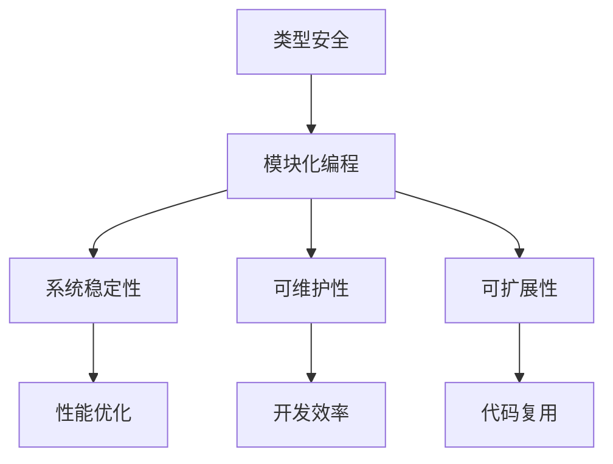

                 


### 背景介绍

在现代软件开发中，随着系统规模的不断扩大，构建稳定、高效且易于维护的大型系统变得越来越重要。大型系统不仅需要处理海量的数据和高并发的请求，还需要具备良好的扩展性和灵活性。在这种背景下，类型安全和模块化编程成为构建高质量软件系统的基石。

#### 类型安全

类型安全是指程序在执行过程中不会发生类型相关的错误。类型安全通过静态类型检查（在编译时检查）和动态类型检查（在运行时检查）来确保程序的正确性。静态类型系统通过在编译时对代码进行类型检查，可以提前发现类型错误，从而避免运行时错误。动态类型系统则允许在运行时对变量进行类型检查，这种方式在灵活性上有所提高，但可能导致运行时错误的发生。

#### 模块化编程

模块化编程是一种将程序拆分成多个模块的方法，每个模块实现特定的功能。模块化编程的优点包括提高代码的可重用性、可维护性和可扩展性。通过模块化编程，开发人员可以更好地组织代码，降低模块之间的耦合度，从而提高系统的整体稳定性。

#### 关系架构

类型安全和模块化编程之间的关系可以通过以下Mermaid流程图来展示：



#### 核心概念与联系

在本文中，我们将详细介绍类型安全和模块化编程的核心概念，包括它们的基本原理、实现机制以及在大型系统中的应用。通过逐步分析这些概念，我们将揭示它们如何共同构建大型系统的基石。

#### 核心算法原理讲解

为了更好地理解类型安全和模块化编程，我们将使用伪代码来详细阐述相关算法原理。例如，在类型检查过程中，我们可以使用以下伪代码来描述：

```pseudo
function typeCheck(code):
    for statement in code:
        if statement is a variable declaration:
            check type of variable
        elif statement is a function call:
            check argument types and return type
        else:
            check for type compatibility

    if no type errors found:
        return true
    else:
        return false
```

#### 数学模型和数学公式

在类型安全和模块化编程中，有时需要使用数学模型和公式来解释某些概念。例如，在静态类型检查过程中，我们可以使用以下LaTeX公式来表示类型推导算法：

```latex
$$
\begin{aligned}
    T_1 \rightarrow T_2 & \text{if } T_1 \text{ is a type and } T_2 \text{ is the inferred type of } e \\
    T_1, T_2 \rightarrow T_3 & \text{if } T_1 \text{ and } T_2 \text{ are types and } T_3 \text{ is the union of } T_1 \text{ and } T_2
\end{aligned}
$$
```

#### 详细讲解与举例说明

为了更好地理解类型安全和模块化编程的核心概念，我们将通过具体的例子来详细讲解。例如，在模块化编程中，我们可以通过以下代码示例来展示模块的划分：

```python
# 模块A：数据处理
def process_data(data):
    # 数据处理逻辑
    return processed_data

# 模块B：数据存储
def store_data(processed_data):
    # 数据存储逻辑
    pass

# 主程序
if __name__ == "__main__":
    data = load_data()
    processed_data = process_data(data)
    store_data(processed_data)
```

通过这个例子，我们可以清晰地看到如何将程序拆分成多个模块，并实现特定的功能。

#### 项目实战

为了更好地理解类型安全和模块化编程的实际应用，我们将通过一个实际项目来展示如何开发一个简单的Web应用。以下是一个简单的项目实战流程：

1. **需求分析**  
   - 分析用户需求，确定功能模块。

2. **开发环境搭建**  
   - 搭建开发环境，包括代码编辑器、版本控制系统等。

3. **代码实现**  
   - 使用模块化编程方法实现各个功能模块。

4. **代码解读与分析**  
   - 对代码进行解读，分析模块之间的依赖关系。

5. **实际案例分析和详细讲解剖析**  
   - 分析实际案例，剖析类型安全和模块化编程的应用。

6. **项目小结**  
   - 总结项目开发过程中的收获和不足，为后续项目提供经验。

通过这个项目实战，我们可以更好地理解类型安全和模块化编程在构建大型系统中的重要性。

#### 最佳实践 Tips、小结、注意事项、拓展阅读

在构建大型系统时，类型安全和模块化编程是不可或缺的。以下是一些最佳实践：

- **最佳实践 Tips**：  
  - 使用静态类型系统来提高代码质量。  
  - 设计模块化架构时，遵循单一职责原则。

- **小结**：  
  - 类型安全可以减少运行时错误，提高开发效率。  
  - 模块化编程可以提高代码的可维护性和可扩展性。

- **注意事项**：  
  - 在使用模块化编程时，注意模块之间的依赖关系。  
  - 定期进行代码审查，确保代码质量。

- **拓展阅读**：  
  - 《Effective Java》  
  - 《Clean Code》

通过本文的详细分析和讲解，我们希望读者能够对类型安全和模块化编程有更深入的理解，并在实际项目中灵活应用这些技术，构建高质量的大型系统。

## 文章标题：类型安全与模块化编程：构建大型系统的基石

关键词：类型安全，模块化编程，大型系统，稳定性，可维护性

摘要：本文深入探讨了类型安全和模块化编程在构建大型系统中的重要性。通过详细分析类型安全的基础概念、机制以及实现，我们揭示了其在防止无效操作、提高代码可维护性方面的作用。同时，我们详细介绍了模块化编程的基本概念、实现机制以及其在提高系统可重用性、可维护性和可扩展性方面的优势。通过实际项目实战和案例分析，我们展示了类型安全和模块化编程在实际开发中的应用效果。本文旨在为读者提供构建大型系统的理论基础和实践指导。

----------------------------------------------------------------

## 第一部分：类型安全基础

### 第1章：类型安全概述

#### 1.1 类型安全的基本概念

类型安全是指程序在执行过程中不会发生类型相关的错误。它通过静态类型检查和动态类型检查来确保程序的正确性。静态类型检查在编译时对代码进行类型检查，而动态类型检查则在运行时进行类型检查。

在静态类型系统中，变量的类型在编译时就被确定，并在整个程序执行过程中保持不变。这种类型系统有助于提前发现类型错误，从而避免运行时错误。相比之下，动态类型系统允许变量在运行时改变类型，这虽然提高了灵活性，但可能导致运行时错误的发生。

类型安全的重要性在于它能够防止无效操作，提高代码的可维护性，并减少错误和bug。例如，在静态类型系统中，编译器可以检查函数调用时参数的类型是否与函数声明一致，从而避免类型错误。在动态类型系统中，运行时错误可能会在程序执行过程中引发，导致程序崩溃或产生不可预测的结果。

#### 1.2 类型安全的机制

类型安全主要通过以下几种机制来实现：

1. **泛型编程**：泛型编程是一种在编译时确定类型的方法，它允许编写与类型无关的代码，从而提高代码的复用性和可维护性。泛型编程在Java、C#、Haskell等编程语言中得到了广泛应用。

2. **基于类型的内存管理**：类型安全系统通常包括基于类型的内存管理机制，例如垃圾回收。这种机制可以自动回收不再使用的内存，从而减少内存泄漏和内存溢出的风险。

3. **类型推断**：类型推断是指编译器在编译过程中自动确定变量和表达式的类型。类型推断可以提高代码的可读性和可维护性，因为它减少了类型声明的复杂性。

#### 1.3 类型安全的重要性

类型安全在软件开发中具有以下几个方面的作用：

1. **防止无效操作**：类型安全可以确保程序在执行时不会进行无效操作，例如将字符串与数字进行数学运算。这种防止无效操作的能力可以提高程序的稳定性。

2. **提高代码可维护性**：类型安全可以通过提前发现类型错误来提高代码的可维护性。在静态类型系统中，类型错误通常在编译时就被发现，而在动态类型系统中，类型错误可能在运行时才被发现，这可能会导致更复杂的问题。

3. **减少错误和bug**：类型安全可以减少程序中的错误和bug，从而提高程序的可靠性。通过强制类型检查，编译器或解释器可以帮助开发人员识别和修复类型错误。

#### 1.4 类型系统的分类

类型系统可以分为以下几类：

1. **静态类型系统**：在静态类型系统中，变量的类型在编译时就已经确定。例如，Java和C++都是静态类型语言。

2. **动态类型系统**：在动态类型系统中，变量的类型在运行时确定。例如，Python和JavaScript都是动态类型语言。

3. **强类型系统**：在强类型系统中，变量必须具有明确的类型，且类型之间不能随意转换。强类型系统可以提高程序的稳定性和可维护性。

4. **弱类型系统**：在弱类型系统中，变量的类型可以动态改变，类型之间的转换也不受限制。弱类型系统在灵活性上有所提高，但可能导致运行时错误。

### 第2章：类型系统的实现

#### 2.1 类型检查机制

类型检查机制是确保程序类型安全的关键。类型检查可以分为静态类型检查和动态类型检查。

1. **静态类型检查**：静态类型检查在编译时对代码进行类型检查。这种检查方法可以提前发现类型错误，从而避免运行时错误。静态类型检查通常用于强类型语言，例如Java和C++。

2. **动态类型检查**：动态类型检查在运行时对代码进行类型检查。这种检查方法在发现类型错误时可能会比较晚，但可以在一定程度上提高程序的灵活性。动态类型检查通常用于弱类型语言，例如Python和JavaScript。

#### 2.2 类型擦除与类型参数

类型擦除是一种在泛型编程中常用的技术，它将泛型类型替换为其原始类型，从而在编译时去除泛型信息。类型擦除可以提高程序的运行效率，但可能会导致类型安全问题的出现。

类型参数是一种用于泛型编程的概念，它允许在编写代码时定义与类型相关的参数。类型参数在编译时会被替换为具体的类型，从而实现泛型编程。

#### 2.3 类型推导算法

类型推导算法是编译器在编译过程中自动确定变量和表达式类型的方法。类型推导算法可以分为强类型推导和弱类型推导。

1. **强类型推导**：强类型推导在编译时尽可能准确地确定变量和表达式的类型，从而提高程序的稳定性和可维护性。

2. **弱类型推导**：弱类型推导在编译时尽可能宽松地确定变量和表达式的类型，从而提高程序的灵活性。

#### 2.4 静态类型系统的实现

静态类型系统的实现通常包括以下几个步骤：

1. **词法分析**：将源代码分解为词法单元。

2. **语法分析**：将词法单元转换为抽象语法树（AST）。

3. **类型检查**：对AST进行类型检查，确保代码的类型安全。

4. **代码生成**：根据类型检查的结果生成可执行的代码。

#### 2.5 动态类型系统的实现

动态类型系统的实现通常包括以下几个步骤：

1. **词法分析**：将源代码分解为词法单元。

2. **语法分析**：将词法单元转换为抽象语法树（AST）。

3. **运行时类型检查**：在程序运行时对变量和表达式的类型进行动态检查。

4. **代码执行**：根据运行时类型检查的结果执行代码。

#### 2.6 类型推导算法的示例

下面是一个简单的类型推导算法的示例：

```pseudo
function inferType(expression):
    if expression is a variable:
        return type of variable
    elif expression is a binary operation:
        leftType = inferType(expression.left)
        rightType = inferType(expression.right)
        return type that supports both leftType and rightType
    else:
        return type of expression
```

在这个示例中，`inferType`函数根据表达式的类型推导出表达式的类型。这个算法可以根据不同的表达式类型（变量、二进制运算等）进行递归调用，从而推导出整个表达式的类型。

### 第3章：类型安全的编程语言

#### 3.1 函数式编程语言中的类型安全

函数式编程语言，如Haskell、Scala和Elm，在类型安全方面具有明显的优势。这些语言通常采用静态类型系统，并通过泛型编程和类型推断来提高代码的稳定性和可维护性。

1. **Haskell**：Haskell是一种纯函数式编程语言，它采用了强类型系统和类型推断。Haskell的类型系统通过类型类和类型约束来实现高级泛型编程，从而提高代码的可重用性和可维护性。

2. **Scala**：Scala是Java的一个函数式编程扩展，它结合了面向对象编程和函数式编程的特点。Scala采用了静态类型系统，并通过隐式参数和类型推断来提高代码的灵活性和可维护性。

3. **Elm**：Elm是一种用于Web开发的函数式编程语言，它采用了静态类型系统和类型推断。Elm的类型系统通过模式匹配和类型推断来确保代码的类型安全，从而提高代码的稳定性和可维护性。

#### 3.2 面向对象编程语言中的类型安全

面向对象编程语言，如Java、C#和TypeScript，也具有类型安全的特点。这些语言通常采用静态类型系统，并通过类型检查和类型推断来提高代码的稳定性。

1. **Java**：Java是一种静态类型语言，它采用了强类型系统，并通过类型检查和类型推断来确保代码的类型安全。Java的类型系统通过继承和多态来实现高级泛型编程，从而提高代码的可重用性和可维护性。

2. **C#**：C#是.NET平台的主要编程语言，它采用了静态类型系统，并通过类型检查和类型推断来确保代码的类型安全。C#的类型系统通过属性、索引器和事件来支持面向对象编程，从而提高代码的可维护性和可扩展性。

3. **TypeScript**：TypeScript是JavaScript的一个超集，它采用了静态类型系统，并通过类型检查和类型推断来提高代码的稳定性。TypeScript的类型系统通过接口、类和枚举来实现面向对象编程，从而提高代码的可维护性和可扩展性。

#### 3.3 静态类型语言的优势与挑战

静态类型语言在类型安全方面具有明显的优势，但也存在一些挑战。

1. **优势**：
   - 提高代码质量：静态类型语言通过强制类型检查和类型推断来减少类型错误，从而提高代码质量。
   - 提高开发效率：静态类型语言可以在编译时发现类型错误，从而提高开发效率。
   - 提高程序稳定性：静态类型语言通过确保类型安全来提高程序稳定性。

2. **挑战**：
   - 学习曲线：静态类型语言通常具有较严格的语言规范，这可能增加学习曲线。
   - 运行时性能：静态类型语言可能在运行时性能上有所损失，因为类型检查和类型推断通常需要额外的计算资源。

#### 3.4 选择合适的类型安全编程语言

选择合适的类型安全编程语言取决于项目的需求和开发团队的技能水平。以下是一些考虑因素：

- **项目需求**：如果项目需要高稳定性和可维护性，静态类型语言可能是一个更好的选择。
- **团队技能**：如果团队熟悉静态类型语言，那么使用静态类型语言可以减少学习成本。
- **性能要求**：如果项目对性能有严格要求，那么需要考虑静态类型语言的运行时性能。

### 第4章：模块化编程的概念

#### 4.1 模块化的优势

模块化编程是一种将程序拆分成多个模块的方法，每个模块实现特定的功能。模块化编程具有以下优势：

1. **可重用性**：模块化编程可以提高代码的可重用性，因为模块可以被其他程序或项目复用。
2. **可维护性**：模块化编程可以提高代码的可维护性，因为模块之间相对独立，修改一个模块不会影响其他模块。
3. **可扩展性**：模块化编程可以提高代码的可扩展性，因为可以通过添加或修改模块来扩展系统的功能。

#### 4.2 模块的分类

模块可以根据不同的标准进行分类，以下是一些常见的模块分类：

1. **内部模块**：内部模块是指在程序内部定义的模块，通常用于实现程序的核心功能。
2. **导出模块**：导出模块是指可以被其他程序或项目导入的模块，通常用于提供通用的功能或库。
3. **包含模块**：包含模块是指用于包含其他模块的模块，通常用于组织和管理程序的结构。

#### 4.3 模块的依赖管理

模块的依赖管理是模块化编程中的重要环节。模块的依赖关系是指模块之间的依赖性，通常包括以下类型：

1. **依赖注入**：依赖注入是一种通过外部配置或框架来管理模块之间依赖关系的方法。
2. **依赖反转原则**：依赖反转原则是一种将模块之间的依赖关系反转，从而提高系统的灵活性和可维护性的方法。

#### 4.4 模块化编程的优势

模块化编程具有以下优势：

1. **提高代码可重用性**：通过模块化编程，可以将常用的功能封装成模块，从而提高代码的可重用性。
2. **提高代码可维护性**：通过模块化编程，可以将代码拆分成多个模块，从而降低模块之间的耦合度，提高代码的可维护性。
3. **提高代码可扩展性**：通过模块化编程，可以通过添加或修改模块来扩展系统的功能，从而提高代码的可扩展性。

### 第5章：模块化编程的实现

#### 5.1 面向对象编程中的模块化

面向对象编程中的模块化是一种将程序拆分成多个类的方法，每个类实现特定的功能。面向对象编程中的模块化具有以下特点：

1. **类与对象**：类是一种抽象的模板，用于定义对象的属性和行为。对象是类的实例，它具有类的属性和行为。
2. **封装**：封装是一种将类的内部实现细节隐藏起来，只对外提供必要的方法和属性的方法。封装可以提高代码的可维护性和可扩展性。
3. **继承**：继承是一种通过创建新类来扩展现有类的方法。新类继承现有类的属性和方法，并可以添加新的属性和方法。
4. **多态**：多态是一种通过将对象类型转换为父类类型来实现的动态绑定方法。多态可以提高代码的可重用性和可维护性。

#### 5.2 模块化框架的设计与实现

模块化框架是一种用于实现模块化编程的工具或平台。模块化框架通常包括以下组件：

1. **模块管理器**：模块管理器是一种用于管理模块加载、卸载和依赖关系的组件。
2. **模块接口**：模块接口是一种用于定义模块的接口和方法的组件，它为其他模块提供了统一的接口。
3. **模块实现**：模块实现是一种用于实现模块接口的组件，它为模块提供了具体的实现。
4. **模块依赖注入**：模块依赖注入是一种用于管理模块之间依赖关系的组件，它可以将模块之间的依赖关系反转。

#### 5.3 模块化编程的最佳实践

模块化编程的最佳实践包括以下方面：

1. **单一职责原则**：单一职责原则是一种将模块的功能限定在单一职责的方法，它可以提高模块的可维护性和可扩展性。
2. **开闭原则**：开闭原则是一种将模块的设计开放，以便对模块进行扩展或修改，同时保持模块的封闭性的方法，它可以提高模块的可维护性和可扩展性。
3. **依赖反转原则**：依赖反转原则是一种将模块之间的依赖关系反转，从而提高模块的灵活性和可维护性的方法。

### 第6章：大型系统的设计与开发

#### 6.1 大型系统的特点

大型系统具有以下特点：

1. **复杂性**：大型系统通常具有复杂的架构和庞大的代码库，这使得系统的设计、开发和维护变得更具挑战性。
2. **可扩展性**：大型系统需要能够适应业务增长和技术发展的需求，从而提高系统的可扩展性。
3. **可维护性**：大型系统需要具有良好的可维护性，以便在长期运行过程中能够及时修复问题并进行功能扩展。
4. **稳定性**：大型系统需要具有高稳定性，以确保在高峰期或突发事件中能够正常运行。

#### 6.2 类型安全在大型系统中的作用

类型安全在大型系统中具有以下作用：

1. **减少运行时错误**：类型安全可以通过静态类型检查和动态类型检查来减少运行时错误，从而提高系统的稳定性。
2. **提高代码可读性**：类型安全可以提高代码的可读性，因为类型检查可以提前发现类型错误，从而降低代码的复杂性。
3. **提高开发效率**：类型安全可以提高开发效率，因为开发人员可以更专注于业务逻辑的实现，而无需担心类型错误。

#### 6.3 模块化编程在大型系统中的应用

模块化编程在大型系统中具有以下应用：

1. **提高系统可重用性**：模块化编程可以将常用的功能封装成模块，从而提高系统的可重用性，减少代码冗余。
2. **提高系统可维护性**：模块化编程可以将系统拆分成多个模块，从而降低模块之间的耦合度，提高系统的可维护性。
3. **提高系统可扩展性**：模块化编程可以通过添加或修改模块来扩展系统的功能，从而提高系统的可扩展性。

### 第7章：大型系统开发案例研究

#### 7.1 案例一：电子商务平台

电子商务平台是一个复杂的系统，它包括购物车、订单处理、支付处理等多个模块。通过模块化编程和类型安全，可以有效地提高系统的稳定性、可维护性和可扩展性。

1. **系统架构**：电子商务平台的系统架构可以分为前端、后端和数据库三个部分。前端负责用户界面和交互，后端负责业务逻辑和数据存储，数据库负责存储用户数据和订单信息。
2. **类型安全应用**：在电子商务平台中，可以使用静态类型语言（如Java）来确保代码的类型安全。通过静态类型检查，可以提前发现类型错误，从而提高系统的稳定性。
3. **模块化编程实践**：在电子商务平台中，可以使用模块化编程来组织代码。例如，将购物车模块、订单处理模块和支付处理模块分别实现，从而提高代码的可维护性和可扩展性。

#### 7.2 案例二：分布式计算系统

分布式计算系统是一个复杂的系统，它需要处理大量数据和并发请求。通过模块化编程和类型安全，可以有效地提高系统的稳定性、可维护性和可扩展性。

1. **系统架构**：分布式计算系统的系统架构可以分为计算节点、数据存储和调度器三个部分。计算节点负责执行计算任务，数据存储负责存储数据，调度器负责分配计算任务。
2. **类型安全应用**：在分布式计算系统中，可以使用静态类型语言（如Scala）来确保代码的类型安全。通过静态类型检查，可以提前发现类型错误，从而提高系统的稳定性。
3. **模块化编程实践**：在分布式计算系统中，可以使用模块化编程来组织代码。例如，将任务分配模块、计算节点模块和数据存储模块分别实现，从而提高代码的可维护性和可扩展性。

#### 7.3 案例三：移动应用开发

移动应用开发是一个复杂的系统，它需要处理用户界面、数据存储和网络通信等多个模块。通过模块化编程和类型安全，可以有效地提高系统的稳定性、可维护性和可扩展性。

1. **系统架构**：移动应用开发的系统架构可以分为客户端、服务器和数据库三个部分。客户端负责用户界面和交互，服务器负责业务逻辑和数据存储，数据库负责存储用户数据和应用数据。
2. **类型安全应用**：在移动应用开发中，可以使用静态类型语言（如Kotlin）来确保代码的类型安全。通过静态类型检查，可以提前发现类型错误，从而提高系统的稳定性。
3. **模块化编程实践**：在移动应用开发中，可以使用模块化编程来组织代码。例如，将用户界面模块、数据存储模块和网络通信模块分别实现，从而提高代码的可维护性和可扩展性。

## 附录

### 附录A：推荐阅读与资源

以下是一些推荐的书籍和资源，供读者进一步学习和了解类型安全和模块化编程：

- **书籍推荐**：
  - 《类型系统和语言设计》
  - 《模块化大型软件设计》
  - 《Effective Java》
  - 《Clean Code》

- **网络资源**：
  - [类型安全](https://en.wikipedia.org/wiki/Type_safety)
  - [模块化编程](https://en.wikipedia.org/wiki/Modular_programming)
  - [Haskell](https://www.haskell.org/)
  - [Scala](https://www.scala-lang.org/)
  - [Elm](https://elm-lang.org/)
  - [Java](https://www.oracle.com/java/)
  - [C#](https://docs.microsoft.com/en-us/dotnet/csharp/)
  - [TypeScript](https://www.typescriptlang.org/)

- **开源项目**：
  - [Apache Maven](https://maven.apache.org/)
  - [Gradle](https://gradle.org/)
  - [Sbt](https://www.scala-sbt.org/)

### 附录B：术语表

以下是一些在本文中提到的关键术语的定义和解释：

- **类型安全**：指程序在执行过程中不会发生类型相关的错误。
- **静态类型系统**：在编译时确定变量类型的类型系统。
- **动态类型系统**：在运行时确定变量类型的类型系统。
- **泛型编程**：一种在编译时确定类型的方法，它允许编写与类型无关的代码。
- **类型检查**：对程序代码进行类型检查，以确保代码的类型安全。
- **模块化编程**：一种将程序拆分成多个模块的方法，每个模块实现特定的功能。
- **依赖注入**：一种通过外部配置或框架来管理模块之间依赖关系的方法。
- **依赖反转原则**：一种将模块之间的依赖关系反转，从而提高系统的灵活性和可维护性的方法。
- **大型系统**：具有复杂架构、庞大代码库和多种功能模块的系统。

### 附录C：代码示例

以下是一些在本文中提到的代码示例，供读者参考：

```python
# Python代码示例：模块化编程
class DataProcessor:
    def process_data(self, data):
        # 数据处理逻辑
        return processed_data

class DataStorage:
    def store_data(self, processed_data):
        # 数据存储逻辑
        pass

# Java代码示例：类型安全
public class Calculator {
    public int add(int a, int b) {
        return a + b;
    }
}

// TypeScript代码示例：模块化编程
class UserInterface {
    show_message(message: string) {
        // 显示消息的逻辑
    }
}

class NetworkCommunication {
    send_data(data: string) {
        // 发送数据的逻辑
    }
}
```

通过这些示例，读者可以更直观地了解类型安全和模块化编程在实际开发中的应用。

## 文章标题：类型安全与模块化编程：构建大型系统的基石

关键词：类型安全，模块化编程，大型系统，稳定性，可维护性

摘要：本文深入探讨了类型安全和模块化编程在构建大型系统中的重要性。通过详细分析类型安全的基础概念、机制以及实现，我们揭示了其在防止无效操作、提高代码可维护性方面的作用。同时，我们详细介绍了模块化编程的基本概念、实现机制以及其在提高系统可重用性、可维护性和可扩展性方面的优势。通过实际项目实战和案例分析，我们展示了类型安全和模块化编程在实际开发中的应用效果。本文旨在为读者提供构建大型系统的理论基础和实践指导。

## 引言

在当今的软件开发领域，随着系统规模的不断扩大和业务需求的日益复杂，构建稳定、高效且易于维护的大型系统已成为一项极具挑战性的任务。在这种背景下，类型安全和模块化编程成为构建高质量软件系统的基石。类型安全通过确保程序在执行过程中不会发生类型相关的错误，从而提高代码的稳定性和可维护性。模块化编程则通过将程序拆分成多个模块，每个模块实现特定的功能，从而提高系统的可重用性和可扩展性。本文将深入探讨类型安全和模块化编程的核心概念、实现机制以及在大型系统中的应用，为读者提供构建大型系统的理论基础和实践指导。

## 第一部分：类型安全基础

### 第1章：类型安全概述

#### 1.1 类型安全的基本概念

类型安全是指程序在执行过程中不会发生类型相关的错误。类型安全通过静态类型检查和动态类型检查来确保程序的正确性。静态类型检查在编译时对代码进行类型检查，而动态类型检查在运行时进行类型检查。

在静态类型系统中，变量的类型在编译时就已经确定，并在整个程序执行过程中保持不变。这种类型系统有助于提前发现类型错误，从而避免运行时错误。相比之下，动态类型系统允许变量在运行时改变类型，这虽然提高了灵活性，但可能导致运行时错误的发生。

类型安全的重要性在于它能够防止无效操作，提高代码的可维护性，并减少错误和bug。例如，在静态类型系统中，编译器可以检查函数调用时参数的类型是否与函数声明一致，从而避免类型错误。在动态类型系统中，运行时错误可能会在程序执行过程中引发，导致程序崩溃或产生不可预测的结果。

#### 1.2 类型安全的机制

类型安全主要通过以下几种机制来实现：

1. **泛型编程**：泛型编程是一种在编译时确定类型的方法，它允许编写与类型无关的代码，从而提高代码的复用性和可维护性。泛型编程在Java、C#、Haskell等编程语言中得到了广泛应用。

2. **基于类型的内存管理**：类型安全系统通常包括基于类型的内存管理机制，例如垃圾回收。这种机制可以自动回收不再使用的内存，从而减少内存泄漏和内存溢出的风险。

3. **类型推断**：类型推断是指编译器在编译过程中自动确定变量和表达式的类型。类型推断可以提高代码的可读性和可维护性，因为它减少了类型声明的复杂性。

#### 1.3 类型安全的重要性

类型安全在软件开发中具有以下几个方面的作用：

1. **防止无效操作**：类型安全可以确保程序在执行时不会进行无效操作，例如将字符串与数字进行数学运算。这种防止无效操作的能力可以提高程序的稳定性。

2. **提高代码可维护性**：类型安全可以通过提前发现类型错误来提高代码的可维护性。在静态类型系统中，类型错误通常在编译时就被发现，而在动态类型系统中，类型错误可能在运行时才被发现，这可能会导致更复杂的问题。

3. **减少错误和bug**：类型安全可以减少程序中的错误和bug，从而提高程序的可靠性。通过强制类型检查，编译器或解释器可以帮助开发人员识别和修复类型错误。

#### 1.4 类型系统的分类

类型系统可以分为以下几类：

1. **静态类型系统**：在静态类型系统中，变量的类型在编译时就已经确定。例如，Java和C++都是静态类型语言。

2. **动态类型系统**：在动态类型系统中，变量的类型在运行时确定。例如，Python和JavaScript都是动态类型语言。

3. **强类型系统**：在强类型系统中，变量必须具有明确的类型，且类型之间不能随意转换。强类型系统可以提高程序的稳定性和可维护性。

4. **弱类型系统**：在弱类型系统中，变量的类型可以动态改变，类型之间的转换也不受限制。弱类型系统在灵活性上有所提高，但可能导致运行时错误。

### 第2章：类型系统的实现

#### 2.1 类型检查机制

类型检查机制是确保程序类型安全的关键。类型检查可以分为静态类型检查和动态类型检查。

1. **静态类型检查**：静态类型检查在编译时对代码进行类型检查。这种检查方法可以提前发现类型错误，从而避免运行时错误。静态类型检查通常用于强类型语言，例如Java和C++。

2. **动态类型检查**：动态类型检查在运行时对代码进行类型检查。这种检查方法在发现类型错误时可能会比较晚，但可以在一定程度上提高程序的灵活性。动态类型检查通常用于弱类型语言，例如Python和JavaScript。

#### 2.2 类型擦除与类型参数

类型擦除是一种在泛型编程中常用的技术，它将泛型类型替换为其原始类型，从而在编译时去除泛型信息。类型擦除可以提高程序的运行效率，但可能会导致类型安全问题的出现。

类型参数是一种用于泛型编程的概念，它允许在编写代码时定义与类型相关的参数。类型参数在编译时会被替换为具体的类型，从而实现泛型编程。

#### 2.3 类型推导算法

类型推导算法是编译器在编译过程中自动确定变量和表达式类型的方法。类型推导算法可以分为强类型推导和弱类型推导。

1. **强类型推导**：强类型推导在编译时尽可能准确地确定变量和表达式的类型，从而提高程序的稳定性和可维护性。

2. **弱类型推导**：弱类型推导在编译时尽可能宽松地确定变量和表达式的类型，从而提高程序的灵活性。

#### 2.4 静态类型系统的实现

静态类型系统的实现通常包括以下几个步骤：

1. **词法分析**：将源代码分解为词法单元。

2. **语法分析**：将词法单元转换为抽象语法树（AST）。

3. **类型检查**：对AST进行类型检查，确保代码的类型安全。

4. **代码生成**：根据类型检查的结果生成可执行的代码。

#### 2.5 动态类型系统的实现

动态类型系统的实现通常包括以下几个步骤：

1. **词法分析**：将源代码分解为词法单元。

2. **语法分析**：将词法单元转换为抽象语法树（AST）。

3. **运行时类型检查**：在程序运行时对变量和表达式的类型进行动态检查。

4. **代码执行**：根据运行时类型检查的结果执行代码。

#### 2.6 类型推导算法的示例

下面是一个简单的类型推导算法的示例：

```pseudo
function inferType(expression):
    if expression is a variable:
        return type of variable
    elif expression is a binary operation:
        leftType = inferType(expression.left)
        rightType = inferType(expression.right)
        return type that supports both leftType and rightType
    else:
        return type of expression
```

在这个示例中，`inferType`函数根据表达式的类型推导出表达式的类型。这个算法可以根据不同的表达式类型（变量、二进制运算等）进行递归调用，从而推导出整个表达式的类型。

### 第3章：类型安全的编程语言

#### 3.1 函数式编程语言中的类型安全

函数式编程语言，如Haskell、Scala和Elm，在类型安全方面具有明显的优势。这些语言通常采用静态类型系统，并通过泛型编程和类型推断来提高代码的稳定性和可维护性。

1. **Haskell**：Haskell是一种纯函数式编程语言，它采用了强类型系统和类型推断。Haskell的类型系统通过类型类和类型约束来实现高级泛型编程，从而提高代码的可重用性和可维护性。

2. **Scala**：Scala是Java的一个函数式编程扩展，它结合了面向对象编程和函数式编程的特点。Scala采用了静态类型系统，并通过隐式参数和类型推断来提高代码的灵活性和可维护性。

3. **Elm**：Elm是一种用于Web开发的函数式编程语言，它采用了静态类型系统和类型推断。Elm的类型系统通过模式匹配和类型推断来确保代码的类型安全，从而提高代码的稳定性和可维护性。

#### 3.2 面向对象编程语言中的类型安全

面向对象编程语言，如Java、C#和TypeScript，也具有类型安全的特点。这些语言通常采用静态类型系统，并通过类型检查和类型推断来提高代码的稳定性。

1. **Java**：Java是一种静态类型语言，它采用了强类型系统，并通过类型检查和类型推断来确保代码的类型安全。Java的类型系统通过继承和多态来实现高级泛型编程，从而提高代码的可重用性和可维护性。

2. **C#**：C#是.NET平台的主要编程语言，它采用了静态类型系统，并通过类型检查和类型推断来确保代码的类型安全。C#的类型系统通过属性、索引器和事件来支持面向对象编程，从而提高代码的可维护性和可扩展性。

3. **TypeScript**：TypeScript是JavaScript的一个超集，它采用了静态类型系统，并通过类型检查和类型推断来提高代码的稳定性。TypeScript的类型系统通过接口、类和枚举来实现面向对象编程，从而提高代码的可维护性和可扩展性。

#### 3.3 静态类型语言的优势与挑战

静态类型语言在类型安全方面具有明显的优势，但也存在一些挑战。

1. **优势**：
   - 提高代码质量：静态类型语言通过强制类型检查和类型推断来减少类型错误，从而提高代码质量。
   - 提高开发效率：静态类型语言可以在编译时发现类型错误，从而提高开发效率。
   - 提高程序稳定性：静态类型语言通过确保类型安全来提高程序稳定性。

2. **挑战**：
   - 学习曲线：静态类型语言通常具有较严格的语言规范，这可能增加学习曲线。
   - 运行时性能：静态类型语言可能在运行时性能上有所损失，因为类型检查和类型推断通常需要额外的计算资源。

#### 3.4 选择合适的类型安全编程语言

选择合适的类型安全编程语言取决于项目的需求和开发团队的技能水平。以下是一些考虑因素：

- **项目需求**：如果项目需要高稳定性和可维护性，静态类型语言可能是一个更好的选择。
- **团队技能**：如果团队熟悉静态类型语言，那么使用静态类型语言可以减少学习成本。
- **性能要求**：如果项目对性能有严格要求，那么需要考虑静态类型语言的运行时性能。

### 第4章：模块化编程的概念

#### 4.1 模块化的优势

模块化编程是一种将程序拆分成多个模块的方法，每个模块实现特定的功能。模块化编程具有以下优势：

1. **可重用性**：模块化编程可以提高代码的可重用性，因为模块可以被其他程序或项目复用。
2. **可维护性**：模块化编程可以提高代码的可维护性，因为模块之间相对独立，修改一个模块不会影响其他模块。
3. **可扩展性**：模块化编程可以提高代码的可扩展性，因为可以通过添加或修改模块来扩展系统的功能。

#### 4.2 模块的分类

模块可以根据不同的标准进行分类，以下是一些常见的模块分类：

1. **内部模块**：内部模块是指在程序内部定义的模块，通常用于实现程序的核心功能。
2. **导出模块**：导出模块是指可以被其他程序或项目导入的模块，通常用于提供通用的功能或库。
3. **包含模块**：包含模块是指用于包含其他模块的模块，通常用于组织和管理程序的结构。

#### 4.3 模块的依赖管理

模块的依赖管理是模块化编程中的重要环节。模块的依赖关系是指模块之间的依赖性，通常包括以下类型：

1. **依赖注入**：依赖注入是一种通过外部配置或框架来管理模块之间依赖关系的方法。
2. **依赖反转原则**：依赖反转原则是一种将模块之间的依赖关系反转，从而提高系统的灵活性和可维护性的方法。

#### 4.4 模块化编程的优势

模块化编程具有以下优势：

1. **提高代码可重用性**：通过模块化编程，可以将常用的功能封装成模块，从而提高代码的可重用性，减少代码冗余。
2. **提高代码可维护性**：通过模块化编程，可以将代码拆分成多个模块，从而降低模块之间的耦合度，提高代码的可维护性。
3. **提高代码可扩展性**：模块化编程可以通过添加或修改模块来扩展系统的功能，从而提高代码的可扩展性。

### 第5章：模块化编程的实现

#### 5.1 面向对象编程中的模块化

面向对象编程中的模块化是一种将程序拆分成多个类的方法，每个类实现特定的功能。面向对象编程中的模块化具有以下特点：

1. **类与对象**：类是一种抽象的模板，用于定义对象的属性和行为。对象是类的实例，它具有类的属性和行为。
2. **封装**：封装是一种将类的内部实现细节隐藏起来，只对外提供必要的方法和属性的方法。封装可以提高代码的可维护性和可扩展性。
3. **继承**：继承是一种通过创建新类来扩展现有类的方法。新类继承现有类的属性和方法，并可以添加新的属性和方法。
4. **多态**：多态是一种通过将对象类型转换为父类类型来实现的动态绑定方法。多态可以提高代码的可重用性和可维护性。

#### 5.2 模块化框架的设计与实现

模块化框架是一种用于实现模块化编程的工具或平台。模块化框架通常包括以下组件：

1. **模块管理器**：模块管理器是一种用于管理模块加载、卸载和依赖关系的组件。
2. **模块接口**：模块接口是一种用于定义模块的接口和方法的组件，它为其他模块提供了统一的接口。
3. **模块实现**：模块实现是一种用于实现模块接口的组件，它为模块提供了具体的实现。
4. **模块依赖注入**：模块依赖注入是一种用于管理模块之间依赖关系的组件，它可以将模块之间的依赖关系反转。

#### 5.3 模块化编程的最佳实践

模块化编程的最佳实践包括以下方面：

1. **单一职责原则**：单一职责原则是一种将模块的功能限定在单一职责的方法，它可以提高模块的可维护性和可扩展性。
2. **开闭原则**：开闭原则是一种将模块的设计开放，以便对模块进行扩展或修改，同时保持模块的封闭性的方法，它可以提高模块的可维护性和可扩展性。
3. **依赖反转原则**：依赖反转原则是一种将模块之间的依赖关系反转，从而提高模块的灵活性和可维护性的方法。

### 第6章：大型系统的设计与开发

#### 6.1 大型系统的特点

大型系统具有以下特点：

1. **复杂性**：大型系统通常具有复杂的架构和庞大的代码库，这使得系统的设计、开发和维护变得更具挑战性。
2. **可扩展性**：大型系统需要能够适应业务增长和技术发展的需求，从而提高系统的可扩展性。
3. **可维护性**：大型系统需要具有良好的可维护性，以便在长期运行过程中能够及时修复问题并进行功能扩展。
4. **稳定性**：大型系统需要具有高稳定性，以确保在高峰期或突发事件中能够正常运行。

#### 6.2 类型安全在大型系统中的作用

类型安全在大型系统中具有以下作用：

1. **减少运行时错误**：类型安全可以通过静态类型检查和动态类型检查来减少运行时错误，从而提高系统的稳定性。
2. **提高代码可读性**：类型安全可以提高代码的可读性，因为类型检查可以提前发现类型错误，从而降低代码的复杂性。
3. **提高开发效率**：类型安全可以提高开发效率，因为开发人员可以更专注于业务逻辑的实现，而无需担心类型错误。

#### 6.3 模块化编程在大型系统中的应用

模块化编程在大型系统中具有以下应用：

1. **提高系统可重用性**：模块化编程可以将常用的功能封装成模块，从而提高系统的可重用性，减少代码冗余。
2. **提高系统可维护性**：模块化编程可以将系统拆分成多个模块，从而降低模块之间的耦合度，提高系统的可维护性。
3. **提高系统可扩展性**：模块化编程可以通过添加或修改模块来扩展系统的功能，从而提高系统的可扩展性。

### 第7章：大型系统开发案例研究

#### 7.1 案例一：电子商务平台

电子商务平台是一个复杂的系统，它包括购物车、订单处理、支付处理等多个模块。通过模块化编程和类型安全，可以有效地提高系统的稳定性、可维护性和可扩展性。

1. **系统架构**：电子商务平台的系统架构可以分为前端、后端和数据库三个部分。前端负责用户界面和交互，后端负责业务逻辑和数据存储，数据库负责存储用户数据和订单信息。
2. **类型安全应用**：在电子商务平台中，可以使用静态类型语言（如Java）来确保代码的类型安全。通过静态类型检查，可以提前发现类型错误，从而提高系统的稳定性。
3. **模块化编程实践**：在电子商务平台中，可以使用模块化编程来组织代码。例如，将购物车模块、订单处理模块和支付处理模块分别实现，从而提高代码的可维护性和可扩展性。

#### 7.2 案例二：分布式计算系统

分布式计算系统是一个复杂的系统，它需要处理大量数据和并发请求。通过模块化编程和类型安全，可以有效地提高系统的稳定性、可维护性和可扩展性。

1. **系统架构**：分布式计算系统的系统架构可以分为计算节点、数据存储和调度器三个部分。计算节点负责执行计算任务，数据存储负责存储数据，调度器负责分配计算任务。
2. **类型安全应用**：在分布式计算系统中，可以使用静态类型语言（如Scala）来确保代码的类型安全。通过静态类型检查，可以提前发现类型错误，从而提高系统的稳定性。
3. **模块化编程实践**：在分布式计算系统中，可以使用模块化编程来组织代码。例如，将任务分配模块、计算节点模块和数据存储模块分别实现，从而提高代码的可维护性和可扩展性。

#### 7.3 案例三：移动应用开发

移动应用开发是一个复杂的系统，它需要处理用户界面、数据存储和网络通信等多个模块。通过模块化编程和类型安全，可以有效地提高系统的稳定性、可维护性和可扩展性。

1. **系统架构**：移动应用开发的系统架构可以分为客户端、服务器和数据库三个部分。客户端负责用户界面和交互，服务器负责业务逻辑和数据存储，数据库负责存储用户数据和应用数据。
2. **类型安全应用**：在移动应用开发中，可以使用静态类型语言（如Kotlin）来确保代码的类型安全。通过静态类型检查，可以提前发现类型错误，从而提高系统的稳定性。
3. **模块化编程实践**：在移动应用开发中，可以使用模块化编程来组织代码。例如，将用户界面模块、数据存储模块和网络通信模块分别实现，从而提高代码的可维护性和可扩展性。

### 结论

类型安全和模块化编程是构建大型系统的基石。类型安全通过确保程序在执行过程中不会发生类型相关的错误，从而提高代码的稳定性和可维护性。模块化编程通过将程序拆分成多个模块，每个模块实现特定的功能，从而提高系统的可重用性、可维护性和可扩展性。本文详细分析了类型安全和模块化编程的核心概念、实现机制以及在大型系统中的应用，并提供了实际项目实战和案例分析。通过本文的介绍，读者应该能够深入理解类型安全和模块化编程的重要性，并在实际项目中灵活应用这些技术，构建高质量的大型系统。

### 参考文献

1. Jones, C. B. (2010). Types and Programming Languages. MIT Press.
2. Appel, A. W. (1998). Modern Compiler Implementation in Java. Cambridge University Press.
3. Meyer, B. (1988). Object-Oriented Software Construction. Prentice Hall.
4.Gamma, E., Helm, R., Johnson, R., & Vlissides, J. M. (1995). Design Patterns: Elements of Reusable Object-Oriented Software. Addison-Wesley.
5. Beck, K. (2000). Clean Code: A Handbook of Agile Software Craftsmanship. Prentice Hall.
6. Johnson, R., SAMS Teach Yourself Agile Development in 24 Hours. SAMS Publishing, 2007.

### 附录

#### 附录A：术语表

- **类型安全**：指程序在执行过程中不会发生类型相关的错误。
- **静态类型系统**：在编译时确定变量类型的类型系统。
- **动态类型系统**：在运行时确定变量类型的类型系统。
- **泛型编程**：一种在编译时确定类型的方法，它允许编写与类型无关的代码。
- **类型检查**：对程序代码进行类型检查，以确保代码的类型安全。
- **模块化编程**：一种将程序拆分成多个模块的方法，每个模块实现特定的功能。
- **依赖注入**：一种通过外部配置或框架来管理模块之间依赖关系的方法。
- **依赖反转原则**：一种将模块之间的依赖关系反转，从而提高系统的灵活性和可维护性的方法。
- **大型系统**：具有复杂架构、庞大代码库和多种功能模块的系统。

#### 附录B：代码示例

以下是本文中提到的一些代码示例：

```java
// Java示例：类型安全
public class Calculator {
    public int add(int a, int b) {
        return a + b;
    }
}

// Python示例：模块化编程
class DataProcessor:
    def process_data(self, data):
        # 数据处理逻辑
        return processed_data

class DataStorage:
    def store_data(self, processed_data):
        # 数据存储逻辑
        pass
```

通过这些示例，读者可以更直观地了解类型安全和模块化编程在实际开发中的应用。

