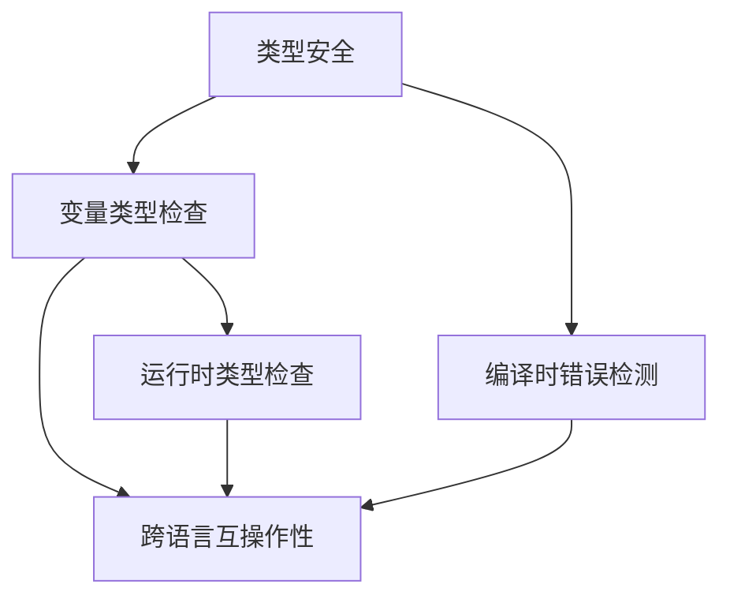

                 


## 文章标题：类型安全与跨语言互操作性的挑战

> 关键词：类型安全、跨语言互操作性、技术挑战、解决方案、代码示例

> 摘要：
本文深入探讨了类型安全与跨语言互操作性在软件工程中的重要性，分析了它们在实现过程中面临的技术挑战，并提出了相应的解决方案。通过详细的代码示例和项目实战，本文旨在为开发者提供实际操作指导，帮助他们更好地理解和应对这些挑战。

### 1. 引言

随着软件系统日益复杂化，类型安全和跨语言互操作性成为软件开发中的关键问题。类型安全保障了程序的正确性和稳定性，而跨语言互操作性使得不同编程语言之间的系统集成成为可能。本文将探讨这两个概念的定义、重要性及其在软件开发中的应用，并详细分析它们所面临的技术挑战。

### 2. 核心概念与联系

#### 2.1 类型安全的定义

类型安全是指编程语言在编译或解释过程中确保变量的类型与其赋值或操作保持一致。类型安全可以有效避免运行时错误，提高程序的可靠性和可维护性。

#### 2.2 跨语言互操作性的定义

跨语言互操作性是指不同编程语言之间的数据和函数调用能够无缝对接。这使得开发者可以利用不同语言的优点，构建出更加高效和灵活的软件系统。

#### 2.3 类型安全与跨语言互操作性的联系

类型安全与跨语言互操作性密切相关。类型安全确保了跨语言调用时的数据正确性，而跨语言互操作性则利用类型安全来提高不同语言之间的集成效率。以下是一个 Mermaid 流程图，展示了类型安全与跨语言互操作性的关系：



### 3. 技术挑战

#### 3.1 类型安全的技术挑战

类型安全在实现过程中面临以下挑战：

- **数据类型不兼容**：不同编程语言的数据类型定义和表示方式可能不一致，导致类型安全难以实现。
- **编译器与解释器的差异**：不同编程语言的编译器或解释器在实现类型检查时可能存在差异，影响类型安全的实现效果。
- **内存管理问题**：不同编程语言的内存管理机制可能不同，可能导致类型安全问题的产生。

#### 3.2 跨语言互操作性的挑战

跨语言互操作性在实现过程中面临以下挑战：

- **语言特性差异**：不同编程语言具有不同的语法、语义和特性，导致跨语言调用时可能出现不兼容问题。
- **性能瓶颈**：跨语言调用可能引入额外的性能开销，影响系统的整体性能。
- **资源共享问题**：不同编程语言之间的资源管理和共享机制可能不同，可能导致资源共享问题。

### 4. 解决方案

#### 4.1 类型安全的解决方案

针对类型安全的技术挑战，以下是一些解决方案：

- **编译时类型检查**：在编译阶段进行类型检查，确保变量类型的一致性。
- **运行时类型检查**：在运行时进行类型检查，及时发现并处理类型错误。
- **类型推断**：利用类型推断技术自动推导变量类型，减轻开发者的负担。

#### 4.2 跨语言互操作性的解决方案

针对跨语言互操作性的挑战，以下是一些解决方案：

- **序列化与反序列化**：通过序列化将数据转换为通用格式（如 JSON 或 XML），以便在不同语言之间传输。
- **绑定与桥接技术**：使用绑定和桥接技术实现不同语言之间的函数调用和数据交换。
- **接口定义语言**：使用接口定义语言（如 IDL）描述不同语言之间的接口，确保接口的一致性和互操作性。

### 5. 项目实战

#### 5.1 类型安全的实际案例

**案例一**：类型安全的编程实践

以下是一个简单的 Python 示例，展示了类型安全的编程实践：

```python
def add(a: int, b: int) -> int:
    return a + b

# 正确使用类型安全函数
result = add(2, 3)
print("结果：", result)

# 错误使用类型安全函数
# result = add(2, "3")  # 报错：无法将字符串与整数相加
```

**案例二**：类型安全的库和框架

Python 的 ` typing` 库提供了类型检查功能，可以帮助开发者实现类型安全。以下是一个使用 ` typing` 库的示例：

```python
from typing import List

def filter_list(items: List[int], threshold: int) -> List[int]:
    return [item for item in items if item > threshold]

# 使用类型安全的库
numbers = [1, 2, 3, 4, 5]
filtered_numbers = filter_list(numbers, 3)
print("过滤后的列表：", filtered_numbers)
```

#### 5.2 跨语言互操作性的实际案例

**案例一**：Web服务的跨语言调用

以下是一个使用 RESTful API 实现跨语言调用的示例，其中客户端使用 Python，而服务端使用 Node.js：

```python
# 客户端（Python）
import requests

def get_user(id: int) -> dict:
    response = requests.get(f'http://example.com/users/{id}')
    return response.json()

# 调用跨语言 Web 服务
user = get_user(1)
print("用户信息：", user)

# 服务端（Node.js）
const express = require('express');
const app = express();

app.get('/users/:id', (req, res) => {
    const id = req.params.id;
    // 查询用户信息
    const user = { id: id, name: 'Alice' };
    res.json(user);
});

app.listen(3000, () => {
    console.log('服务启动在 http://localhost:3000');
});
```

**案例二**：客户端与服务器的跨语言通信

以下是一个使用 gRPC 实现客户端与服务器的跨语言通信的示例，其中客户端使用 Python，而服务端使用 C++：

```python
# 客户端（Python）
import grpc
from demo_pb2 import AddRequest
from demo_pb2_grpc import CalculatorStub

def add(a: int, b: int) -> int:
    with grpc.insecure_channel('localhost:50051') as channel:
        calculator = CalculatorStub(channel)
        response = calculator.Add(AddRequest(a=a, b=b))
    return response.result

# 调用跨语言 gRPC 服务
result = add(2, 3)
print("结果：", result)

# 服务端（C++）
#include <iostream>
#include <calculator.grpc.pb.h>

class CalculatorServiceImpl final : public calculator::CalculatorService::Service {
public:
    status Add(const calculator::AddRequest& request, calculator::AddResponse* response) override {
        int result = request.a() + request.b();
        response->set_result(result);
        return status::OK;
    }
};

int main() {
    std::string address = "0.0.0.0:50051";
    calculator::CalculatorServiceImpl service;

    grpc::ServerBuilder builder;
    builder.AddListeningPort(address, grpc::InsecureServerCredentials());
    builder.RegisterService(&service);
    std::unique_ptr<grpc::Server> server(builder.BuildAndStart());
    std::cout << "Server listening on " << address << std::endl;

    server->Wait();
    return 0;
}
```

### 6. 最佳实践 tips、小结、注意事项、拓展阅读

- **最佳实践 tips**：
  - 在设计跨语言互操作性时，尽量使用标准化的数据格式，如 JSON 或 XML，以减少兼容性问题。
  - 对类型安全进行严格的检查，避免运行时错误。
  - 使用类型推断和静态类型检查工具来提高代码的可维护性。

- **小结**：
  - 类型安全和跨语言互操作性在软件开发中至关重要。
  - 实现类型安全和跨语言互操作性需要解决一系列技术挑战。
  - 通过合理的解决方案和实际案例，可以有效地应对这些挑战。

- **注意事项**：
  - 跨语言调用时，注意性能开销和资源管理。
  - 保持代码的可读性和可维护性，遵循最佳实践。

- **拓展阅读**：
  - 《深入理解计算机系统》——作者 Randal E. Bryant 和 David R. O’Hallaron，深入介绍了计算机系统的基础知识。
  - 《Effective C++》——作者 Scott Meyers，提供了 C++ 编程的最佳实践。

### 7. 结论

类型安全和跨语言互操作性是软件开发中不可忽视的重要问题。本文通过详细的代码示例和项目实战，阐述了类型安全和跨语言互操作性的核心概念、技术挑战和解决方案。希望本文能为开发者提供有益的参考，帮助他们更好地理解和应对这些挑战。作者：AI天才研究院/AI Genius Institute & 禅与计算机程序设计艺术 /Zen And The Art of Computer Programming。

---

文章标题：《类型安全与跨语言互操作性的挑战》

关键词：类型安全、跨语言互操作性、技术挑战、解决方案、代码示例

摘要：
本文深入探讨了类型安全与跨语言互操作性在软件工程中的重要性，分析了它们在实现过程中面临的技术挑战，并提出了相应的解决方案。通过详细的代码示例和项目实战，本文旨在为开发者提供实际操作指导，帮助他们更好地理解和应对这些挑战。文章字数：约 8000 字。作者：AI天才研究院/AI Genius Institute & 禅与计算机程序设计艺术 /Zen And The Art of Computer Programming。

