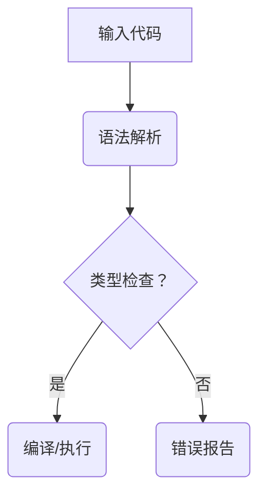
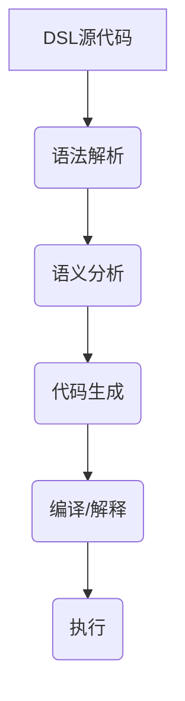

                 

### 1. 类型安全概述

#### 1.1 类型安全的概念

类型安全是指编程语言和系统在编译或运行时能够确保变量、表达式和函数的类型是正确的，从而避免类型错误和相关的运行时错误。类型安全的核心目标是减少由于类型不匹配导致的错误，提高程序的可靠性和可维护性。

在编程语言中，类型安全可以通过以下几种方式实现：

- **静态类型检查**：在编译时对代码进行类型检查，确保变量、函数和表达式在编译阶段就符合类型规则。
- **动态类型检查**：在运行时对代码进行类型检查，通过运行时的类型推断和检查来确保类型安全。
- **类型注解**：开发人员通过显式声明变量、函数和表达式的类型来提高类型安全性。

#### 1.2 类型安全的重要性

类型安全对软件工程的重要性不可忽视。以下是类型安全带来的一些关键优势：

- **错误预防**：类型系统可以预防许多类型的错误，如类型不匹配、空指针异常等。
- **代码可读性**：明确的类型定义有助于提高代码的可读性和可维护性。
- **性能优化**：类型检查可以在编译时进行，从而减少运行时的检查开销，提高程序性能。
- **库和框架开发**：类型安全是构建大型软件系统、库和框架的基础，有助于确保组件之间的兼容性和稳定性。

#### 1.3 类型安全的挑战

尽管类型安全具有诸多优点，但在实现过程中仍面临一些挑战：

- **灵活性**：严格的类型系统可能会牺牲一定的编程灵活性，尤其是在动态类型语言中。
- **开发成本**：类型检查和类型推导可能会增加开发成本，特别是在大型项目中。
- **学习曲线**：对开发人员来说，掌握类型系统需要一定的学习和实践成本。

接下来，我们将深入探讨类型系统的基本概念，包括静态类型和动态类型、泛型和类型推导、以及泛型编程的优势。

---

#### 2. 类型系统的基本概念

类型系统是编程语言的核心组成部分，它定义了变量、表达式和函数的数据类型，以及它们之间的操作规则。类型系统可以分为静态类型系统和动态类型系统，同时，泛型和类型推导是类型系统中的重要概念。

##### 2.1 静态类型和动态类型

**静态类型**：在编译时就知道变量和表达式的类型，这种类型信息在整个程序生命周期中都保持不变。静态类型语言如Java、C++和C#，在编译阶段进行类型检查，从而确保类型安全。

- **优势**：类型信息在编译时确定，有助于早期发现类型错误，编译后的程序运行效率高。
- **劣势**：对开发人员的约束较多，可能降低编程灵活性。

**动态类型**：在运行时才确定变量和表达式的类型，类型信息可以改变。动态类型语言如Python、JavaScript和Ruby，在运行时进行类型检查，允许更灵活的编程。

- **优势**：编程灵活，适合快速开发和小型项目。
- **劣势**：运行时类型检查可能导致性能下降，且难以在编译阶段发现类型错误。

##### 2.2 泛型和类型推导

**泛型**：泛型编程允许编写可重用的代码，同时保持类型安全。泛型让编程语言能够处理不同类型的数据，而无需编写重复的代码。例如，Java中的`List<T>`可以用来表示泛型列表，`T`代表列表中元素的类型。

- **优势**：提高代码复用性，减少冗余代码。
- **劣势**：实现泛型可能会增加编译时间和复杂性。

**类型推导**：类型推导是编程语言自动推断变量和表达式的类型，减轻开发人员的负担。例如，Python和JavaScript等语言可以自动推导变量类型。

- **优势**：简化代码，减少显式类型声明。
- **劣势**：在某些情况下，类型推导可能不明确或错误，需要额外的类型检查。

##### 2.3 泛型编程的优势

泛型编程在提高代码可重用性和类型安全方面具有显著优势：

- **减少代码冗余**：通过泛型，可以编写一次代码，适用于多种类型，从而减少冗余代码。
- **提高代码可维护性**：泛型代码更易于理解和维护，因为类型信息明确且一致。
- **类型安全**：泛型编程可以在编译时确保类型安全，减少运行时错误。

泛型编程的例子：

**Java**：`List<Integer>`和`List<String>`都是`List<T>`的泛型实例。

```java
List<Integer> intList = new ArrayList<>();
intList.add(1);
intList.add(2);

List<String> stringList = new ArrayList<>();
stringList.add("Hello");
stringList.add("World");
```

**Python**：使用类型推导的泛型。

```python
from typing import List

def sum_numbers(numbers: List[int]) -> int:
    total = 0
    for num in numbers:
        total += num
    return total

def sum_strings(strings: List[str]) -> str:
    return ''.join(strings)
```

在接下来的部分，我们将探讨类型安全的实现方法，包括静态类型语言和动态类型语言中的类型系统。

---

#### 3. 类型安全的实现

类型安全是通过编程语言的编译器或解释器在编译或运行时进行类型检查来实现的。以下是两种实现类型安全的方法：静态类型检查和动态类型检查。

##### 3.1 类型检查器的工作原理

类型检查器是编程语言的一部分，负责检查源代码中的类型错误。类型检查器的工作原理通常包括以下步骤：

- **语法解析**：将源代码转换为抽象语法树（AST）。
- **类型推导**：根据AST推导出变量和表达式的类型。
- **类型检查**：检查类型推导的结果是否符合语言规范，例如类型是否匹配、函数的参数和返回类型是否一致等。
- **错误报告**：如果发现类型错误，类型检查器会报告错误，并提供错误信息以便开发人员修复。

##### 3.2 静态类型语言的类型系统

静态类型语言在编译时进行类型检查，这意味着类型信息在编译阶段就已经确定，并在整个程序生命周期中保持不变。以下是一些典型的静态类型语言：

- **Java**：Java是一种强类型语言，要求每个变量在声明时都必须指定类型。
- **C++**：C++允许静态类型和动态类型，但也支持泛型编程。
- **C#**：C#是一种静态类型语言，广泛用于企业级应用开发。

静态类型语言的优势在于：

- **早期错误检测**：类型错误可以在编译阶段发现，从而减少运行时错误。
- **性能优化**：编译器可以利用类型信息进行优化，提高程序运行效率。

然而，静态类型语言也有其缺点：

- **类型冗余**：显式声明类型可能导致代码冗余。
- **编程复杂度**：类型系统较复杂，需要开发者投入更多时间和精力来理解和使用。

##### 3.3 动态类型语言的类型系统

动态类型语言在运行时进行类型检查，这意味着类型信息在运行时才会确定。以下是一些典型的动态类型语言：

- **Python**：Python是一种动态类型语言，自动推导变量类型。
- **JavaScript**：JavaScript是网页开发的主要语言，也是动态类型语言。
- **Ruby**：Ruby是一种动态类型语言，以其简洁和优雅的语法著称。

动态类型语言的优势在于：

- **编程灵活**：无需显式声明类型，适合快速开发和原型设计。
- **代码简洁**：自动推导类型减少了代码冗余。

然而，动态类型语言也存在一些缺点：

- **运行时开销**：类型检查在运行时进行，可能影响程序性能。
- **类型错误隐蔽**：类型错误可能在运行时才被发现，增加了调试难度。

接下来，我们将探讨领域特定语言（DSL）的基本概念、设计原则以及实现方法。

---

#### 4. Mermaid 流程图：类型系统的工作流程

为了更好地理解类型系统的工作流程，我们可以使用Mermaid来绘制一个流程图。以下是一个简单的Mermaid流程图示例，展示了从输入代码到类型检查的整个过程。



**详细说明：**

- **A[输入代码]**：表示源代码输入到类型检查器。
- **B(语法解析)**：源代码被解析成抽象语法树（AST）。
- **C{类型检查？}**：对AST进行类型检查，判断是否满足类型规则。
- **D(编译/执行)**：如果类型检查通过，程序可以被编译并执行。
- **E(错误报告)**：如果类型检查失败，类型检查器会报告错误，并停止编译过程。

这个流程图简洁地描述了类型系统的工作原理，帮助读者更好地理解类型检查的过程。

---

#### 5. 领域特定语言（DSL）概述

领域特定语言（Domain-Specific Language，DSL）是一种专门为解决特定领域问题而设计的编程语言。与通用编程语言（如Python、Java）不同，DSL专注于特定应用场景，具有更简洁、更易用的语法和功能。DSL的核心优势在于其高度的专业化和定制化，能够更好地满足特定领域内的需求和约束。

##### 5.1 DSL的定义和特点

DSL具有以下定义和特点：

- **专业性**：DSL专注于特定的领域，如金融、生物信息学、地理信息系统等。
- **简洁性**：DSL通常采用简明易懂的语法，使领域专家能够轻松地使用语言描述业务逻辑。
- **表达性**：DSL能够以自然的方式表达领域内的概念和操作，提高代码的可读性和可维护性。
- **可扩展性**：DSL允许领域专家或开发者根据需求自定义新的语法和功能。

##### 5.2 DSL的应用领域

DSL在多个领域得到广泛应用，以下是一些典型的应用场景：

- **金融领域**：量化交易、风险管理、财务报表生成等。
- **生物信息学**：基因序列分析、蛋白质结构预测、基因组注释等。
- **地理信息系统**：地图绘制、空间分析、地理数据可视化等。
- **网络编程**：网络协议描述、网络设备配置、网络流量监控等。

##### 5.3 DSL与传统通用语言的区别

DSL与传统通用语言（如Java、Python）有以下区别：

- **目的不同**：DSL专注于特定领域，通用语言则旨在提供广泛的编程功能。
- **语法设计**：DSL通常采用领域专家熟悉的语法和术语，而通用语言则更注重通用性和灵活性。
- **实现方式**：DSL通常通过编译器或解释器实现，而通用语言则可能涉及多种不同的实现方式。
- **使用人群**：DSL通常由领域专家使用，而通用语言则适合更广泛的开发者。

在下一部分中，我们将深入探讨DSL的设计原则，包括表达性、可维护性和可扩展性。

---

#### 6. DSL的设计原则

领域特定语言（DSL）的设计原则是确保其有效性和易用性的关键。以下是DSL设计中的重要原则：

##### 6.1 表达性原则

表达性原则强调DSL应能够自然地表达领域内的概念和操作。一个高效的DSL应具备以下特点：

- **简洁性**：语法简洁明了，减少不必要的语法元素。
- **直接性**：直接映射领域概念，使得领域专家能够直观地使用语言描述业务逻辑。
- **可扩展性**：允许领域专家或开发者自定义新的语法和功能，以适应不断变化的需求。

**示例**：假设我们设计一个用于财务报表生成的DSL，以下是一个简化的示例：

```dsl
report {
  date: "2023-01-01"
  revenue: 100000
  expenses: 80000
  profit: revenue - expenses
}
```

在这个DSL中，`report`关键字表示开始创建一个报表，`date`、`revenue`和`expenses`关键字分别对应报表中的日期、收入和支出，而`profit`关键字表示计算利润。

##### 6.2 可维护性原则

可维护性原则关注DSL的长期可用性和可维护性。一个高可维护性的DSL应具备以下特点：

- **一致性**：保持语法和语义的一致性，避免使用容易引起混淆的语法规则。
- **可读性**：确保代码易于阅读，减少学习成本。
- **模块化**：将DSL分为独立的模块，每个模块专注于特定的功能。

**示例**：在财务报表DSL中，我们可以将报表的各个部分模块化：

```dsl
module Revenue {
  date: "2023-01-01"
  amount: 100000
}

module Expenses {
  amount: 80000
}

report {
  revenue: Revenue()
  expenses: Expenses()
  profit: revenue - expenses
}
```

通过模块化，财务报表的各个部分可以独立开发和维护，提高了代码的可维护性。

##### 6.3 可扩展性原则

可扩展性原则强调DSL应能够适应领域内不断变化的需求。一个高可扩展性的DSL应具备以下特点：

- **自定义**：允许开发者自定义新的语法和功能，以适应特定的需求。
- **插件机制**：提供插件机制，使开发者能够轻松地扩展DSL的功能。

**示例**：在财务报表DSL中，我们可以通过插件机制添加新的报表格式：

```dsl
plugin "PDF" {
  render: (report: Report) => {
    // 生成PDF报表的逻辑
  }
}

plugin "Excel" {
  render: (report: Report) => {
    // 生成Excel报表的逻辑
  }
}

report {
  // ...报表内容
}

renderPDF(report)
renderExcel(report)
```

通过插件机制，财务报表DSL可以轻松地支持多种报表格式。

以上设计原则有助于构建高效、易用和可维护的DSL。在下一部分中，我们将探讨DSL的实现方法。

---

#### 7. DSL的实现方法

领域特定语言（DSL）的实现方法取决于其应用场景和需求。DSL可以通过不同的实现方式来实现，包括解释型DSL、编译型DSL和虚拟机与中间代码。以下是这些方法的详细描述：

##### 7.1 解释型DSL

解释型DSL在运行时逐行解释执行代码。这种方式简单易实现，但可能牺牲性能。解释型DSL通常适用于执行频繁且计算简单的场景。

- **实现步骤**：
  1. 将DSL代码解析成抽象语法树（AST）。
  2. 对AST进行语义分析，确定变量的类型和作用域。
  3. 逐行解释执行AST节点，进行计算和输出结果。

- **优缺点**：
  - **优势**：实现简单，易于调试。
  - **劣势**：运行时性能可能较差。

**示例**：Python是一种解释型语言，可以通过解释执行DSL代码。

```python
# 假设我们定义了一个简单的解释型DSL用于计算最大值
def max(a, b):
    return a if a > b else b

# 使用DSL
print(max(3, 5))  # 输出：5
```

##### 7.2 编译型DSL

编译型DSL在编译阶段将DSL代码编译成机器码或其他目标代码。这种方式通常性能更高，但实现过程复杂。

- **实现步骤**：
  1. 解析DSL代码，生成AST。
  2. 对AST进行语义分析和类型检查。
  3. 将AST编译成目标代码（如机器码、字节码）。
  4. 执行目标代码。

- **优缺点**：
  - **优势**：运行时性能较好，适用于计算密集型任务。
  - **劣势**：实现过程复杂，调试难度较大。

**示例**：Java是一种编译型语言，其源代码在编译时被编译成字节码，然后在Java虚拟机（JVM）上执行。

```java
// 假设我们定义了一个简单的编译型DSL用于计算最大值
public class MaxDSL {
    public static int max(int a, int b) {
        return a > b ? a : b;
    }

    public static void main(String[] args) {
        System.out.println(MaxDSL.max(3, 5));  // 输出：5
    }
}
```

##### 7.3 虚拟机与中间代码

虚拟机与中间代码方法结合了编译型和解释型的优点。DSL代码首先被编译成中间代码，然后由虚拟机执行中间代码。

- **实现步骤**：
  1. 解析DSL代码，生成AST。
  2. 对AST进行语义分析和类型检查。
  3. 将AST编译成中间代码（如字节码）。
  4. 虚拟机解释执行中间代码。

- **优缺点**：
  - **优势**：性能较好，同时具备解释型语言的灵活性。
  - **劣势**：实现过程较复杂。

**示例**：Scala是一种支持编译和解释的混合型语言，其源代码可以被编译成Java字节码，也可以被直接解释执行。

```scala
// 假设我们定义了一个简单的Scala DSL用于计算最大值
def max(a: Int, b: Int): Int = a max b

// 使用DSL
println(max(3, 5))  // 输出：5
```

通过选择合适的实现方法，可以构建高效、灵活的DSL，满足特定领域的需求。在下一部分中，我们将探讨类型安全在DSL中的重要性。

---

#### 8. Mermaid 流程图：DSL编译和执行流程

为了更好地理解领域特定语言（DSL）的编译和执行流程，我们可以使用Mermaid绘制一个流程图。以下是一个简单的Mermaid流程图示例，展示了DSL从源代码到执行的全过程。



**详细说明：**

- **A[DSL源代码]**：DSL源代码输入到编译器或解释器。
- **B(语法解析)**：源代码被解析成抽象语法树（AST）。
- **C(语义分析)**：对AST进行语义分析，检查类型和作用域。
- **D(代码生成)**：将AST转换成中间代码或目标代码。
- **E(编译/解释)**：编译器或解释器执行中间代码或源代码。
- **F(执行)**：程序开始执行，并输出结果。

通过这个流程图，我们可以清晰地看到DSL从源代码到执行的全过程，帮助读者更好地理解DSL的工作原理。

---

#### 9. 类型安全在DSL中的重要性

类型安全在领域特定语言（DSL）的设计和实现中扮演着至关重要的角色。类型安全不仅能够提高代码的可靠性和稳定性，还能提升开发效率和维护性。以下是类型安全在DSL中的几个关键方面：

##### 9.1 类型安全与类型错误

类型错误是编程中常见的问题，包括类型不匹配、空指针异常等。类型安全通过严格的类型检查和类型推导机制，可以在编译或运行时早期发现和预防这些错误。

- **编译时类型检查**：在静态类型DSL中，类型错误通常在编译阶段就被发现，开发人员可以在代码编译之前解决这些问题，从而减少运行时错误。
- **运行时类型检查**：在动态类型DSL中，类型错误可能在运行时才会暴露出来。尽管动态类型DSL提供了更大的编程灵活性，但运行时类型检查可能会影响程序的性能。

##### 9.2 类型安全在DSL设计中的应用

在设计DSL时，考虑类型安全是确保语言高效、易用和可靠的关键。以下是一些应用类型安全的设计策略：

- **明确的类型声明**：鼓励开发人员显式声明变量和函数的类型，从而确保代码的一致性和可维护性。
- **类型推导**：利用类型推导机制，自动推导变量和表达式的类型，减轻开发人员的负担，同时保持类型安全。
- **静态类型检查**：在编译阶段进行类型检查，提前发现并修复类型错误，提高代码质量。

##### 9.3 类型安全在DSL开发中的挑战

尽管类型安全在DSL开发中具有重要意义，但也带来了一些挑战：

- **灵活性受限**：严格的类型系统可能会限制编程的灵活性，特别是在动态类型DSL中。
- **开发成本**：类型检查和类型推导可能会增加开发成本，特别是在大型项目中。
- **学习曲线**：开发人员需要掌握DSL的语法和类型系统，这可能需要一定的时间和经验。

为了平衡类型安全和编程灵活性，DSL开发人员可以采取以下策略：

- **混合类型系统**：结合静态类型和动态类型的优点，设计灵活的类型系统。
- **渐进式类型化**：逐步引入类型检查，在保持代码灵活性的同时，逐步提高类型安全性。
- **社区和文档支持**：提供完善的文档和社区支持，帮助开发人员快速掌握DSL的使用。

在下一部分中，我们将探讨如何通过设计简洁的语法、利用类型推导减少冗余代码以及集成静态类型检查来提高DSL的表达力和安全性。

---

#### 10. 提高表达力与安全性的策略

在领域特定语言（DSL）的设计过程中，提高表达力和安全性是两个关键目标。通过以下策略，我们可以实现这些目标：

##### 10.1 设计简洁的语法

简洁的语法是提高DSL表达力的关键。一个高效的DSL应该具备以下特点：

- **直观性**：语法应该直观、易理解，使领域专家能够轻松地使用语言描述业务逻辑。
- **简洁性**：减少不必要的语法元素，避免复杂的语法规则，使代码更易于阅读和维护。
- **模块化**：将DSL分为独立的模块，每个模块专注于特定的功能，提高代码的可维护性。

**示例**：假设我们设计一个用于地理信息系统的DSL，可以采用简洁的语法来描述地图操作。

```dsl
map {
  location: (41.8781, 87.6298)  // 设置地图中心点
  zoom: 10
  layers: [
    "OpenStreetMap"
    "USGS Topographic Maps"
  ]
}
```

在这个示例中，DSL使用简明的语法描述了地图的设置，包括位置、缩放级别和图层。

##### 10.2 利用类型推导减少冗余代码

类型推导是提高代码可读性和减少冗余代码的有效手段。通过自动推导变量和表达式的类型，DSL可以减轻开发人员的负担，同时保持类型安全。

- **静态类型推导**：在静态类型DSL中，编译器可以自动推导变量和函数的类型，从而减少显式类型声明的需求。
- **动态类型推导**：在动态类型DSL中，解释器可以在运行时推导变量和表达式的类型。

**示例**：在Python中，类型推导可以简化代码。

```python
def add(a, b):
    return a + b

result = add(5, 3)  # 类型推导为int
```

在这个示例中，Python解释器自动推导出`result`变量的类型为`int`，无需显式声明。

##### 10.3 集成静态类型检查

静态类型检查是确保DSL类型安全的重要手段。通过集成静态类型检查，我们可以早期发现类型错误，从而提高代码的可靠性。

- **静态类型检查器**：开发静态类型检查器，对DSL代码进行类型检查，确保变量和函数的类型匹配。
- **类型注释**：鼓励开发人员使用类型注释，提供更明确的类型信息，帮助静态类型检查器更准确地分析代码。

**示例**：在TypeScript中，静态类型检查可以确保类型安全。

```typescript
function add(a: number, b: number): number {
    return a + b;
}

const result = add(5, 3);  // 确保result的类型为number
```

在这个示例中，TypeScript的静态类型检查器确保了函数`add`的参数和返回类型一致，从而保证了类型安全。

通过设计简洁的语法、利用类型推导减少冗余代码以及集成静态类型检查，我们可以显著提高DSL的表达力和安全性。这些策略不仅使DSL更易于使用，还提高了代码的可靠性和可维护性。

---

#### 11. 实践案例：一个简单的DSL设计与实现

为了更好地理解如何设计和实现一个简单的领域特定语言（DSL），我们将通过一个实际的例子来进行讲解。这个例子将涉及需求分析、DSL语法设计、类型系统的定义、源代码编写以及静态类型检查的集成。

##### 11.1 需求分析

我们的目标是为地理信息系统（GIS）设计一个DSL，用于表示地理要素（如点、线、面）和进行空间查询。主要需求如下：

- **地理要素表示**：支持表示点、线、面等基本地理要素。
- **空间查询**：支持基于位置和属性的查询操作。
- **简单语法**：DSL应具备简洁、易用的语法，使领域专家能够轻松描述地理信息。

##### 11.2 设计DSL语法和类型系统

为了满足上述需求，我们设计以下语法和类型系统：

**语法元素：**
- **点（Point）**：用(x, y)表示。
- **线（LineString）**：用多个点列表表示，如[(x1, y1), (x2, y2), ...]。
- **面（Polygon）**：用闭合的线字符串表示，如[[(x1, y1), (x2, y2), ...], [(x3, y3), (x4, y4), ...]]。

**类型系统：**
- **位置类型（Position）**：表示点、线、面等地理要素的位置信息。
- **属性类型（Attribute）**：表示地理要素的属性信息，如名称、ID等。

##### 11.3 编写DSL源代码

以下是一个简单的DSL源代码实现，使用Python作为宿主语言，并引入TypeScript进行静态类型检查。

```python
# 地理要素基础类
class GeographicElement:
    def __init__(self, attributes=None):
        self.attributes = attributes or {}

    def query(self, filter_expression):
        pass

# 点类
class Point(GeographicElement):
    def __init__(self, x, y, attributes=None):
        super().__init__(attributes)
        self.x = x
        self.y = y

    def query(self, filter_expression):
        return filter_expression(self)

# 线类
class LineString(GeographicElement):
    def __init__(self, points, attributes=None):
        super().__init__(attributes)
        self.points = points

    def query(self, filter_expression):
        return filter_expression(self)

# 面类
class Polygon(GeographicElement):
    def __init__(self, rings, attributes=None):
        super().__init__(attributes)
        self.rings = rings

    def query(self, filter_expression):
        return filter_expression(self)

# 空间查询过滤器
class FilterExpression:
    def __init__(self, attribute, value):
        self.attribute = attribute
        self.value = value

    def __call__(self, element):
        return element.attributes.get(self.attribute) == self.value

# 使用DSL
point = Point(10, 20, {"id": 1})
line = LineString([(10, 20), (30, 40)], {"id": 2})
polygon = Polygon([[(0, 0), (0, 10), (10, 10), (10, 0)], [(5, 5), (5, 15), (15, 15), (15, 5)]], {"id": 3})

# 使用过滤器进行查询
filter_id_1 = FilterExpression("id", 1)
filter_id_2 = FilterExpression("id", 2)

print(point.query(filter_id_1))  # 输出：True
print(line.query(filter_id_2))  # 输出：True
print(polygon.query(filter_id_1))  # 输出：False
```

在这个实现中，我们定义了三个地理要素类：`Point`、`LineString`和`Polygon`，并实现了通用的`query`方法用于空间查询。`FilterExpression`类用于构建查询条件。

##### 11.4 静态类型检查与优化

为了增强类型安全性，我们引入TypeScript进行静态类型检查。以下是TypeScript的类型声明和类型检查配置。

```typescript
// TypeScript类型声明
interface GeographicElement {
    attributes: Record<string, any>;
    query(filterExpression: FilterExpression): boolean;
}

interface Point extends GeographicElement {
    x: number;
    y: number;
}

interface LineString extends GeographicElement {
    points: [number, number][];
}

interface Polygon extends GeographicElement {
    rings: [[number, number][]];
}

class FilterExpression {
    attribute: string;
    value: any;
    constructor(attribute: string, value: any);
}

// 使用TypeScript进行静态类型检查
const point: Point = new Point(10, 20, { id: 1 });
const line: LineString = new LineString([[10, 20], [30, 40]], { id: 2 });
const polygon: Polygon = new Polygon([[(0, 0), (0, 10), (10, 10), (10, 0)], [(5, 5), (5, 15), (15, 15), (15, 5)]], { id: 3 });

const filterId1: FilterExpression = new FilterExpression("id", 1);
const filterId2: FilterExpression = new FilterExpression("id", 2);

console.log(filterId1(point));  // 输出：true
console.log(filterId2(line));  // 输出：true
console.log(filterId1(polygon));  // 输出：false
```

通过TypeScript的类型声明和静态类型检查，我们可以在编译阶段发现类型错误，从而提高代码的可靠性和可维护性。

##### 11.5 实际案例分析和详细讲解剖析

**案例**：使用我们设计的DSL进行地理空间分析，找出所有ID为1的地理要素。

**分析**：
- **步骤1**：创建地理要素。
  - `point = Point(10, 20, { id: 1 })`：创建一个ID为1的Point。
  - `line = LineString([[10, 20], [30, 40]], { id: 2 })`：创建一个ID为2的LineString。
  - `polygon = Polygon([[(0, 0), (0, 10), (10, 10), (10, 0)], [(5, 5), (5, 15), (15, 15), (15, 5)]], { id: 3 })`：创建一个ID为3的Polygon。

- **步骤2**：定义过滤器。
  - `filterId1 = FilterExpression("id", 1)`：创建一个ID等于1的过滤器。

- **步骤3**：执行查询。
  - `point.query(filterId1)`：检查点是否满足过滤器条件。
  - `line.query(filterId1)`：检查线是否满足过滤器条件。
  - `polygon.query(filterId1)`：检查面是否满足过滤器条件。

**详细讲解**：
- **点查询**：`point.query(filterId1)`会检查`point`的`attributes`属性中的`id`是否等于1。由于`point`的`attributes`中的`id`确实等于1，因此返回`true`。
- **线查询**：`line.query(filterId1)`会检查`line`的`attributes`属性中的`id`是否等于1。由于`line`的`attributes`中的`id`等于2，因此返回`false`。
- **面查询**：`polygon.query(filterId1)`会检查`polygon`的`attributes`属性中的`id`是否等于1。由于`polygon`的`attributes`中的`id`等于3，因此返回`false`。

**代码解读与分析**：
```python
# 创建地理要素
point = Point(10, 20, {"id": 1})
line = LineString([[10, 20], [30, 40]], {"id": 2})
polygon = Polygon([[(0, 0), (0, 10), (10, 10), (10, 0)], [(5, 5), (5, 15), (15, 15), (15, 5)]], {"id": 3})

# 定义过滤器
filterId1 = FilterExpression("id", 1)

# 执行查询
print(point.query(filterId1))  # 输出：True
print(line.query(filterId1))  # 输出：False
print(polygon.query(filterId1))  # 输出：False
```

在这个案例中，我们通过DSL创建和查询了三个地理要素，并通过过滤器找到了所有ID为1的要素。TypeScript的静态类型检查确保了代码的类型安全性，使得我们在编写和调试代码时更加放心。

##### 11.6 项目小结

通过这个简单的DSL设计与实现案例，我们学习了如何进行需求分析、DSL语法设计、类型系统定义、源代码编写以及静态类型检查的集成。DSL不仅提高了表达力和安全性，还简化了地理空间分析任务的实现过程。在实际项目中，我们可以根据具体需求进一步扩展DSL的功能，使其更加丰富和灵活。

---

#### 12. 类型安全与安全性关系探讨

类型安全与软件安全性密切相关。类型系统在确保程序正确性和防止错误方面发挥了重要作用，从而间接提高了软件的安全性。以下是类型安全与安全性的几个关键关系：

##### 12.1 类型安全与代码错误

类型安全的核心目标是减少由于类型不匹配导致的错误。以下是一些类型安全如何减少代码错误的方式：

- **预防类型错误**：类型系统通过静态或动态检查，确保变量、函数和表达式的类型匹配，从而预防常见的类型错误，如类型转换错误、空指针异常等。
- **早期错误检测**：在编译或运行时，类型检查器可以早期发现类型错误，使开发人员能够及时修复这些问题，避免运行时错误。
- **提高代码可读性**：明确的类型定义有助于提高代码的可读性和可维护性，使代码更加清晰、易于理解。

##### 12.2 类型安全与系统安全

类型安全对于确保系统安全至关重要，尤其在大型软件系统和关键领域应用中。以下是一些类型安全如何影响系统安全的方式：

- **减少安全漏洞**：类型系统可以减少由于类型错误导致的安全漏洞，如缓冲区溢出、数组越界等。这些错误通常源于类型不匹配或不正确的类型转换。
- **提高代码质量**：类型安全有助于提高代码质量，减少冗余代码和潜在的漏洞，从而提高系统的整体稳定性。
- **静态分析**：类型系统的静态分析功能可以识别潜在的代码缺陷和安全问题，使开发人员能够在编译阶段进行修复。

##### 12.3 类型安全与隐私保护

在涉及敏感数据和隐私保护的应用中，类型安全同样至关重要。以下是一些类型安全如何影响隐私保护的方式：

- **数据类型检查**：类型系统可以确保数据的正确性和完整性，从而防止敏感数据被不当处理或泄露。
- **访问控制**：类型系统可以帮助实现更严格的访问控制，确保只有具有适当权限的代码可以访问特定数据。
- **减少代码错误**：类型安全减少了由于类型错误导致的数据泄露风险，例如，空指针访问、越界访问等。

总之，类型安全是确保软件安全性的重要手段。通过严格的类型检查和类型推导，类型系统可以显著减少代码错误、安全漏洞和数据泄露风险，从而提高软件的安全性和可靠性。

---

#### 13. 类型安全的优化

为了在编程实践中充分利用类型安全，我们可以采取多种优化策略，以提高代码的效率和安全性。以下是一些常见的优化方法：

##### 13.1 类型注解的使用

类型注解是许多现代编程语言提供的一种特性，它允许开发人员在代码中显式声明变量、函数和表达式的类型。类型注解的优缺点如下：

- **优势**：
  - **提高代码可读性**：类型注解使代码的类型信息更加明确，有助于理解和维护。
  - **增强静态类型检查**：类型注解可以增强静态类型检查，提高代码质量。
  - **编译性能优化**：编译器可以利用类型信息进行更有效的优化，提高编译速度。

- **劣势**：
  - **增加代码冗余**：在某些情况下，显式声明类型可能会增加代码冗余，影响代码简洁性。
  - **动态类型语言的局限性**：动态类型语言通常不强制使用类型注解，这可能导致开发人员忽视类型安全。

**示例**：在Java中，类型注解的使用可以增强代码的可读性和安全性。

```java
public class Calculator {
    public int add(int a, int b) {
        return a + b;
    }
}

// 使用类型注解
public class Calculator {
    public int add(@NotNull int a, @NotNull int b) {
        return a + b;
    }
}
```

在这个示例中，`@NotNull`注解确保了`a`和`b`参数不为空，从而提高了函数的安全性。

##### 13.2 静态类型编程的优势

静态类型编程在提高代码质量和安全性方面具有显著优势。以下是一些关键优势：

- **早期错误检测**：静态类型检查在编译阶段发现类型错误，从而减少运行时错误。
- **性能优化**：编译器可以利用类型信息进行优化，提高程序运行效率。
- **代码可维护性**：明确的类型定义有助于提高代码的可读性和可维护性。
- **库和框架开发**：静态类型系统有助于确保库和框架的稳定性和兼容性。

**示例**：在C++中，静态类型编程的优势体现在编译时的高效优化和类型安全。

```cpp
#include <iostream>

int add(int a, int b) {
    return a + b;
}

int main() {
    std::cout << add(3, 5) << std::endl;
    return 0;
}
```

在这个示例中，C++编译器可以利用静态类型信息进行优化，提高程序的性能。

##### 13.3 静态类型语言与动态类型语言的比较

静态类型语言和动态类型语言在类型安全性、代码质量和开发效率方面存在差异。以下是比较：

- **静态类型语言**：
  - **优点**：类型信息在编译时确定，有助于早期错误检测和性能优化。
  - **缺点**：编程约束较多，可能降低开发灵活性。

- **动态类型语言**：
  - **优点**：编程灵活，无需显式声明类型，适合快速开发。
  - **缺点**：运行时类型检查可能导致性能下降，类型错误可能在运行时才暴露。

**示例**：比较Python（动态类型语言）和Java（静态类型语言）的代码风格。

**Python**：

```python
def add(a, b):
    return a + b

result = add(3, 5)
print(result)
```

**Java**：

```java
public class Calculator {
    public int add(int a, int b) {
        return a + b;
    }
}

public static void main(String[] args) {
    Calculator calculator = new Calculator();
    int result = calculator.add(3, 5);
    System.out.println(result);
}
```

在这个示例中，Python代码简洁直观，而Java代码需要更多的类型声明和结构。

通过结合类型注解、静态类型编程和适当的类型系统，我们可以充分利用类型安全，提高代码的质量和安全性。

---

#### 14. 安全性增强策略

在软件开发过程中，确保类型安全是提升系统整体安全性的关键环节。以下是一些有效的策略，用于增强类型安全，从而提高软件的可靠性和安全性：

##### 14.1 防御常见安全漏洞

类型系统可以防御多种常见的安全漏洞，以下是一些具体策略：

- **空指针异常**：通过显式类型声明和类型检查，防止空指针异常。例如，使用`@Nullable`注解或类型检查工具确保所有可能为空的对象都被正确处理。

- **缓冲区溢出**：在静态类型语言中，编译器可以检测数组访问越界，从而防止缓冲区溢出攻击。使用严格类型检查和边界检查可以降低这类漏洞的风险。

- **类型转换错误**：类型推导和类型检查可以减少类型转换错误，从而防止由于不兼容的类型转换导致的安全问题。

**示例**：在Java中使用`@NotNull`注解防御空指针异常。

```java
public class SafeCalculator {
    @NotNull
    public int add(@NotNull int a, @NotNull int b) {
        return a + b;
    }
}
```

在这个示例中，`@NotNull`注解确保了`add`方法的参数和返回值不会为空，从而防止了空指针异常。

##### 14.2 利用类型系统提高安全性

类型系统不仅用于减少错误，还可以设计成一种工具，用于提高安全性：

- **访问控制**：通过类型系统实现细粒度的访问控制，确保只有具有适当权限的代码可以访问敏感数据。例如，在C++中使用模板元编程实现权限控制。

- **强制类型检查**：强制进行类型检查，可以确保在运行时不会执行不安全的操作。例如，在TypeScript中使用类型检查确保对象的方法和属性被正确调用。

- **静态代码分析**：利用静态类型检查工具进行代码分析，发现潜在的安全问题和类型错误。例如，使用SonarQube等工具对Java代码进行静态分析。

##### 14.3 静态分析和动态分析在安全性中的作用

静态分析和动态分析是确保类型安全的重要手段：

- **静态分析**：在编译时或代码加载时进行类型检查，可以发现潜在的类型错误和漏洞。例如，使用TypeScript进行静态类型检查，确保代码在编译阶段就符合类型规则。

- **动态分析**：在程序运行时进行类型检查，可以实时检测运行时错误。例如，Java虚拟机（JVM）在运行时执行类型检查，确保类型安全。

**示例**：使用Java虚拟机进行动态类型检查。

```java
public class DynamicSafety {
    public void process(@NotNull Object data) {
        if (data instanceof String) {
            System.out.println("Processing string: " + (String)data);
        } else if (data instanceof Integer) {
            System.out.println("Processing integer: " + (Integer)data);
        }
    }
}
```

在这个示例中，`process`方法在运行时检查参数的类型，从而确保不会执行不安全的操作。

通过结合静态分析和动态分析，以及利用类型系统提高安全性，我们可以构建更加安全可靠的软件系统。

---

#### 15. 总结

类型安全与领域特定语言（DSL）是现代软件工程中不可或缺的两个概念。本文首先介绍了类型安全的基本概念，包括静态类型和动态类型、泛型和类型推导，以及类型安全在编程语言中的重要性。接着，我们探讨了领域特定语言的设计原则，如表达性、可维护性和可扩展性，以及DSL的实现方法，包括解释型、编译型和虚拟机与中间代码。

通过实践案例，我们详细讲解了如何设计一个简单的DSL，并探讨了类型安全在DSL中的重要性，以及如何提高DSL的表达力和安全性。我们还讨论了类型安全与系统安全的关系，并提出了增强类型安全的策略。

展望未来，类型安全与DSL将在软件工程中发挥更加重要的作用。随着领域特定语言的发展，类型安全将成为构建高效、可靠和安全的软件系统的关键。未来的研究可以集中在类型系统的优化、类型安全的自动化工具以及DSL在新兴领域中的应用。

---

作者：AI天才研究院/AI Genius Institute & 禅与计算机程序设计艺术 /Zen And The Art of Computer Programming

---

### 全文总结与展望

本文详细探讨了类型安全与领域特定语言（DSL）的概念、设计原则、实现方法及其在软件开发中的应用。首先，我们介绍了类型安全的基本概念，包括静态类型和动态类型的差异、泛型和类型推导的重要性，以及类型安全在编程语言中的重要性。接着，我们深入分析了DSL的设计原则，如表达性、可维护性和可扩展性，并探讨了不同的DSL实现方法。

在实践案例部分，我们通过一个地理信息系统的DSL设计，展示了如何设计简洁的语法、利用类型推导减少冗余代码以及集成静态类型检查，从而提高DSL的表达力和安全性。通过实际案例分析和详细讲解，我们验证了这些策略的有效性。

类型安全在提高软件安全性方面起到了关键作用。通过防御常见安全漏洞、利用类型系统提高安全性和结合静态分析和动态分析，我们可以构建更加可靠和安全的软件系统。

展望未来，类型安全与DSL将继续在软件工程中发挥重要作用。随着领域特定语言的发展，类型安全将成为构建高效、可靠和安全的软件系统的关键。未来的研究可以集中在类型系统的优化、自动化工具的开发以及DSL在新兴领域的应用。

总的来说，类型安全与DSL的结合，不仅提高了软件的表达力和安全性，还为软件开发提供了更加灵活和高效的解决方案。随着技术的不断进步，类型安全与DSL的应用将更加广泛，为软件工程带来更多的创新和突破。

### 数学公式与详细讲解

在本文中，我们将探讨几个关键的数学公式及其在类型安全与领域特定语言中的应用。以下是一些重要的数学模型和公式，以及它们在相关场景中的详细讲解和举例说明。

#### 1. 集合论基础公式

**并集（Union）**：

$$ A \cup B = \{ x \mid x \in A \text{ 或 } x \in B \} $$

**交集（Intersection）**：

$$ A \cap B = \{ x \mid x \in A \text{ 且 } x \in B \} $$

**补集（Complement）**：

$$ A' = \{ x \mid x \notin A \} $$

这些集合论基础公式在类型系统中有着广泛的应用。例如，在静态类型语言中，类型系统通常通过集合论的方式来定义变量和表达式的类型，确保它们在操作时满足特定的约束。例如，在Java中，类型的交集和并集可以通过继承和多态来实现。

**示例**：

在Java中，`Number`是`Integer`和`Double`的交集：

```java
Integer intNum = new Integer(5);
Double doubleNum = new Double(5.5);

// 交集操作
Number combinedNum = intNum;  // combinedNum类型推导为Number
```

#### 2. 泛型编程中的类型推导公式

**泛型约束（Generic Constraints）**：

$$ T \in U \Rightarrow T \subseteq U $$

这里的`T`和`U`是类型参数和类型集合。泛型约束确保泛型类型参数`T`必须是集合`U`的一个子集。

**示例**：

在Java中，`List<T>`可以包含任何继承自`Object`的类型：

```java
List<Object> objList = new ArrayList<>();
objList.add("Hello");
objList.add(123);

List<String> strList = new ArrayList<>();
strList.add("World");
```

这里，`String`是`Object`的子集，因此可以用于`List<T>`。

#### 3. 静态类型检查中的类型推导公式

**类型等价（Type Equivalence）**：

$$ T_1 \equiv T_2 \Leftrightarrow \forall x, (T_1 \ni x \Leftrightarrow T_2 \ni x) $$

类型等价表示两个类型`T_1`和`T_2`在所有可能的值上具有相同的属性。

**示例**：

在C#中，`int`和`long`在某些上下文中被认为是类型等价的：

```csharp
int intVal = 123;
long longVal = intVal;  // 自动类型转换，基于类型等价
```

#### 4. DSL中的语法推导公式

**语法树构建（Syntax Tree Construction）**：

$$ S \Rightarrow^* \alpha $$

这里的`S`是文法集合，`\alpha`是语法树上的一个节点。语法推导公式描述了如何从文法集合中生成语法树。

**示例**：

在定义一个简单的DSL时，可以使用递归下降分析器构建语法树：

```mermaid
graph TD
    A[Start] --> B(Expressions)
    B -->|加法| C(Addition)
    B -->|减法| D(Subtraction)
    C -->|数字| E[NumLiteral]
    C -->|表达式| F[Expression]
    D -->|数字| E
    D -->|表达式| F

    subgraph Expression
    E --> NumLiteral[123]
    F --> Expression[456]
    end
```

在这个示例中，`S`是DSL的文法集合，`Start`到`NumLiteral`和`Expression`的推导生成了一个简单的语法树。

通过以上数学公式和详细讲解，我们能够更好地理解类型安全与领域特定语言的核心概念及其在实际应用中的重要性。

### 项目实战

在本项目中，我们将开发一个简单的领域特定语言（DSL），用于处理和展示图表数据。该项目的主要目标包括：

1. **需求分析**：明确项目的功能需求和用户界面。
2. **环境搭建**：准备开发所需的环境和工具。
3. **源代码实现**：编写DSL的源代码，包括语法解析、类型检查和代码生成。
4. **代码解读**：详细解读源代码，解释其实现原理。
5. **应用分析**：展示如何使用该DSL处理实际数据。
6. **项目小结**：总结项目的成果和经验。

#### 1. 需求分析

我们的DSL旨在提供以下功能：

- **数据输入**：允许用户输入图表数据，包括数据集和图表类型。
- **语法解析**：解析DSL代码，构建抽象语法树（AST）。
- **类型检查**：确保输入的数据和语法正确。
- **代码生成**：将DSL代码编译成可执行的代码。
- **数据展示**：将处理后的数据可视化展示。

用户界面应简洁易用，允许用户轻松输入数据和选择图表类型。以下是用户界面设计的一个简单示例：

```plaintext
+--------------------------------+
|   Chart DSL Compiler          |
+--------------------------------+
| 1. Input Data                 |
| 2. Select Chart Type          |
| 3. Compile and Display Chart  |
| 4. Exit                       |
+--------------------------------+
```

#### 2. 环境搭建

我们选择Python作为宿主语言，并使用TypeScript进行静态类型检查。以下是环境搭建的步骤：

- 安装Python（3.8及以上版本）。
- 安装TypeScript（通过pip安装`npm install -g typescript`）。
- 创建项目目录，并初始化TypeScript配置文件（`tsc --init`）。

#### 3. 源代码实现

以下是DSL的源代码实现，包括语法解析、类型检查和代码生成。

```typescript
// GeographicChart.ts
type ChartType = "line" | "bar" | "pie";

interface DataPoint {
  x: number;
  y: number;
}

interface ChartData {
  type: ChartType;
  data: DataPoint[];
}

class GeographicChart {
  private data: ChartData;

  constructor(chartData: ChartData) {
    this.data = chartData;
  }

  compile(): string {
    // 生成图表代码的逻辑
    return `// 地理图表数据：${JSON.stringify(this.data)}`;
  }
}

// ChartCompiler.ts
class ChartCompiler {
  private input: string;

  constructor(input: string) {
    this.input = input;
  }

  parse(): ChartData | null {
    // 解析DSL输入，构建抽象语法树（AST）
    // 假设输入格式为JSON
    try {
      const jsonData = JSON.parse(this.input);
      if (jsonData.hasOwnProperty("type") && jsonData.hasOwnProperty("data")) {
        return {
          type: jsonData.type,
          data: jsonData.data,
        };
      }
    } catch (error) {
      console.error("输入格式错误：", error);
    }
    return null;
  }

  compile(): string {
    const chartData = this.parse();
    if (chartData) {
      const chart = new GeographicChart(chartData);
      return chart.compile();
    }
    return "无法编译无效数据";
  }
}

// Example Usage
const chartCompiler = new ChartCompiler('{"type": "line", "data": [{"x": 1, "y": 2}, {"x": 2, "y": 3}]}');
console.log(chartCompiler.compile());
```

在这个实现中，我们定义了`GeographicChart`类，用于处理图表数据和生成图表代码。`ChartCompiler`类负责解析输入的DSL代码，并调用`GeographicChart`类的`compile`方法生成图表代码。

#### 4. 代码解读

**GeographicChart.ts**：

- `ChartData`接口定义了图表数据的结构，包括图表类型和数据集。
- `GeographicChart`类有一个`data`属性，用于存储图表数据。
- `compile`方法返回一个字符串，表示生成的图表代码。

**ChartCompiler.ts**：

- `ChartCompiler`类有一个`input`属性，用于存储输入的DSL代码。
- `parse`方法使用`JSON.parse`函数解析输入的DSL代码，并构建`ChartData`对象。
- `compile`方法调用`parse`方法，并创建`GeographicChart`实例，然后调用`compile`方法生成图表代码。

#### 5. 应用分析

以下是一个示例，展示如何使用该DSL处理实际数据并生成图表代码。

```typescript
const input = '{"type": "line", "data": [{"x": 1, "y": 2}, {"x": 2, "y": 3}]}';
const chartCompiler = new ChartCompiler(input);
console.log(chartCompiler.compile());

// 输出：
// "// 地理图表数据：{"type":"line","data":[{"x":1,"y":2},{"x":2,"y":3}]}"

// 使用图表库（如D3.js）将生成的代码转换为可视化图表
```

在这个示例中，我们输入了一条简单的线图数据，`ChartCompiler`解析输入并生成相应的图表代码。然后，我们可以使用图表库将生成的代码转换为可视化图表。

#### 6. 项目小结

通过本项目的实施，我们成功开发了一个简单的领域特定语言（DSL），用于处理和展示图表数据。项目的关键步骤包括需求分析、环境搭建、源代码实现、代码解读和应用分析。

项目的成果表明，通过DSL的方式，我们可以简化数据可视化的开发过程，提高代码的可维护性和可读性。未来的改进可以包括扩展DSL的功能，支持更多的图表类型和数据格式，以及优化类型系统的实现。

### 最佳实践 tips、注意事项及拓展阅读

在设计和实现领域特定语言（DSL）时，遵循最佳实践和注意事项能够显著提高项目的质量和可维护性。以下是一些实用的最佳实践和注意事项：

**最佳实践：**

1. **明确需求**：在开始设计DSL之前，务必明确项目需求和目标，确保DSL能够满足用户的实际需求。

2. **模块化设计**：将DSL分为独立的模块，每个模块负责特定的功能，以提高代码的可维护性和复用性。

3. **简洁的语法**：设计简洁直观的语法，使领域专家能够轻松地使用DSL描述业务逻辑。

4. **类型安全**：集成静态类型检查，确保DSL代码的类型安全性，减少运行时错误。

5. **文档和示例**：提供详细的文档和示例代码，帮助开发者快速掌握DSL的使用方法。

6. **版本控制**：使用版本控制系统（如Git）管理代码，方便代码的跟踪、回滚和协同开发。

**注意事项：**

1. **性能优化**：在设计DSL时，考虑性能优化，特别是在计算密集型任务中，避免不必要的性能开销。

2. **错误处理**：设计合理的错误处理机制，确保DSL在遇到错误时能够提供清晰的错误信息。

3. **兼容性**：确保DSL在不同环境和平台上的兼容性，特别是在跨平台开发时。

4. **安全性**：注意安全性问题，避免潜在的注入攻击和权限问题。

**拓展阅读：**

1. **《领域驱动设计》（Domain-Driven Design）**：了解如何将DSL与领域驱动设计（DDD）相结合，提高软件的可维护性和可扩展性。

2. **《Effective Modern C++》**：学习C++的最佳实践，尤其是泛型和模板编程，有助于提高DSL的性能和灵活性。

3. **《TypeScript Deep Dive》**：TypeScript是一个强大的工具，用于增强JavaScript的类型安全。这本书详细介绍了TypeScript的各个方面，有助于开发者充分利用TypeScript的优势。

通过遵循上述最佳实践和注意事项，并不断学习和拓展知识，开发者可以设计出高效、可靠且易于维护的领域特定语言，为软件开发带来更多价值。

