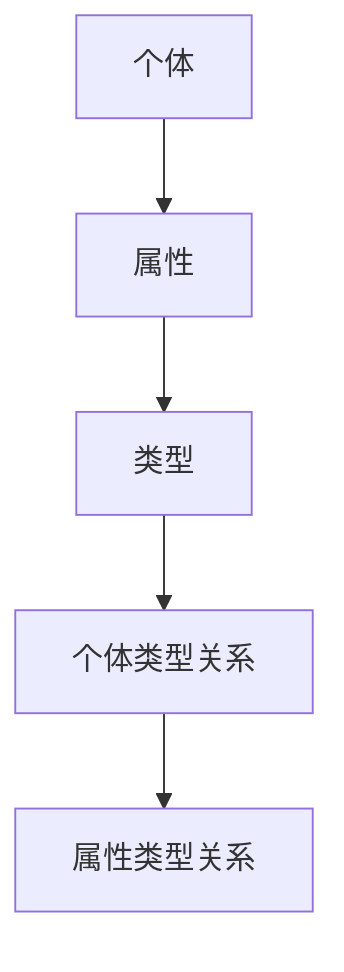

                 

### 文章标题

# 类型层级的无限性：罗素类型论的实用性挑战

> 关键词：罗素类型论、类型层级、数学模型、编程语言、逻辑形式化、无限性、实用性挑战

> 摘要：本文深入探讨了罗素类型论中的类型层级概念，分析了其数学模型和逻辑形式化，并探讨了其在编程语言中的实际应用。通过详细讲解罗素类型论的算法原理、数学公式，以及其在项目实战中的应用，本文揭示了类型层级的无限性及其对计算机科学的挑战。

### 设计核心概念与联系

在探讨罗素类型论之前，我们需要先了解其核心概念：个体、属性和类型。这些概念构成了罗素类型论的基础，它们之间的关系可以用一个简单的 Mermaid 流程图来展示。



- **个体（Individual）**：个体是罗素类型论中的基本元素，可以看作是具体的事物或对象。

- **属性（Attribute）**：属性描述了个体的一些特征或性质。

- **类型（Type）**：类型是对个体的属性的分类。

- **个体类型关系（Individual- Type Relationship）**：个体类型关系描述了个体与其类型之间的对应关系。

- **属性类型关系（Attribute- Type Relationship）**：属性类型关系描述了属性与其类型之间的对应关系。

通过这个 Mermaid 流程图，我们可以直观地理解罗素类型论中的核心概念及其相互关系。接下来，我们将进一步探讨这些概念，并分析其在类型层级中的表现。

#### 核心概念解释

- **个体**：在罗素类型论中，个体是指具体的、独立存在的实体，如数字、对象、集合等。每个个体都有其独特的属性。

  - **例子**：数字“5”是一个个体，它有自己的属性，如“是整数”、“是奇数”等。

- **属性**：属性描述了个体的特征或性质，是属性类型的具体实例。

  - **例子**：对于个体“5”，其属性可以是“5是正数”、“5是整数”等。

- **类型**：类型是对个体的属性的抽象分类。类型本身不是具体的个体，而是对个体属性的抽象集合。

  - **例子**：数字类型是一个类型，它包含了所有数字的属性，如“是整数”、“是正数”等。

- **个体类型关系**：个体类型关系描述了个体与其类型之间的对应关系，即每个个体都属于某个类型。

  - **例子**：个体“5”属于数字类型。

- **属性类型关系**：属性类型关系描述了属性与其类型之间的对应关系，即每个属性都属于某个类型。

  - **例子**：属性“5是正数”属于数字类型的属性。

通过这些核心概念的介绍，我们可以更好地理解罗素类型论的逻辑框架。接下来，我们将深入探讨类型层级及其无限性。

### 核心算法原理讲解

罗素类型论的核心算法原理主要包括简单类型论、复合类型论以及类型层级的无限性。在这一部分，我们将逐一讲解这些原理。

#### 2.1 简单类型论的逻辑形式化

简单类型论是罗素类型论的基础，它主要描述了个体、属性和类型之间的简单关系。简单类型论可以使用逻辑形式化来描述，具体如下：

- **个体与类型的关系**：每个个体都属于某个类型。

  - **逻辑形式化**：$$\forall x \in I, \exists T \in T: x \in T$$

    其中，$I$ 表示个体集合，$T$ 表示类型集合。

- **属性与类型的关系**：每个属性都属于某个类型。

  - **逻辑形式化**：$$\forall a \in A, \exists T \in T: a \in T$$

    其中，$A$ 表示属性集合。

通过这些逻辑形式化描述，我们可以直观地理解简单类型论的基本原理。

#### 2.2 复合类型论

复合类型论是在简单类型论的基础上进行扩展的。它允许我们定义更复杂的类型关系，包括类型之间的组合关系。

- **类型组合**：复合类型是由简单类型通过组合操作生成的。

  - **逻辑形式化**：$$T_{compound} = T_1 \times T_2$$

    其中，$T_{compound}$ 表示复合类型，$T_1$ 和 $T_2$ 表示简单类型。

- **复合类型与个体关系**：复合类型与个体之间的关系是简单类型与个体关系的组合。

  - **逻辑形式化**：$$\forall x \in I, \exists T_{compound} \in T_{compound}: x \in T_{compound}$$

通过复合类型论，我们可以定义更复杂的类型系统，以处理复杂的编程场景。

#### 2.3 类型层级与无限性

类型层级是罗素类型论中的一个重要概念，它描述了不同类型之间的层次关系。类型层级的无限性是罗素类型论的一个独特之处，它揭示了类型系统的潜在无限性。

- **类型层级**：类型层级描述了不同类型之间的包含关系。

  - **逻辑形式化**：$$\forall T_1, T_2 \in T: T_1 \subseteq T_2 \text{ 或 } T_2 \subseteq T_1$$

    其中，$T$ 表示类型集合。

- **无限性**：类型层级是无限的，因为我们可以不断地定义新的类型，从而生成无限多的类型层级。

  - **逻辑形式化**：$$\forall n \in \mathbb{N}: \exists T_n \in T: T_n \not\subseteq T_{n-1}$$

    其中，$\mathbb{N}$ 表示自然数集合。

通过这些原理的讲解，我们可以深入理解罗素类型论的核心算法原理。接下来，我们将探讨罗素类型论中的数学模型和数学公式，以进一步揭示其内在逻辑。

### 数学模型和数学公式讲解

罗素类型论不仅依赖于逻辑形式化，还依赖于数学模型和数学公式来描述其内部结构。在这一部分，我们将详细讲解罗素类型论中的数学模型和数学公式，并举例说明。

#### 3.1 类型层级与集合论

类型层级是罗素类型论中的核心概念之一，它与集合论有着密切的联系。我们可以使用集合论的概念来定义类型层级。

- **类型层级定义**：类型层级可以用一个无限递增的集合序列来表示。

  - **公式表示**：$$ V_0 = \{0\} $$
  - $$ V_{n+1} = \{ V_n \} $$

  其中，$V_0$ 是初始集合，$V_{n+1}$ 是在 $V_n$ 的基础上增加一个新的集合。

通过这个集合序列，我们可以定义不同的类型层级，每个层级包含了前一层的所有集合以及一个新的集合。

#### 3.2 罗素类型论的悖论

罗素类型论的悖论是罗素在研究类型层级时发现的一个问题，它揭示了类型层级的无限性及其潜在的问题。

- **理发师悖论**：这是罗素类型论中的一个经典悖论，描述了一个小镇上的理发师只给不给自己理发的人理发。这个问题揭示了个体与其属性之间的矛盾。

  - **公式表示**：$$ R(x) \iff x \neq x $$

    其中，$R(x)$ 表示理发师给 $x$ 理发。

通过这个公式，我们可以看到理发师悖论的核心：一个个体不能同时满足与其属性相矛盾的条件。

#### 3.3 类型层级的无限性证明

类型层级的无限性是罗素类型论的一个重要特点，它表明类型层级是无限的，不存在最大的类型层级。

- **无限性证明**：我们可以通过递归定义来证明类型层级的无限性。

  - **公式表示**：$$ \forall x \in V_n, \exists y \in V_{n+1} : y = \{ x \} $$

    其中，$V_n$ 表示第 $n$ 层类型集合，$y$ 是一个包含 $x$ 的新集合。

通过这个公式，我们可以看到，对于任意一个类型层级 $V_n$，总存在一个更高层级 $V_{n+1}$，它包含了一个新的集合 $y$。这证明了类型层级的无限性。

通过这些数学模型和数学公式的讲解，我们可以更深入地理解罗素类型论的核心概念和逻辑结构。接下来，我们将探讨罗素类型论在实际编程中的应用。

### 罗素类型论在编程语言中的应用

罗素类型论不仅在理论计算机科学中有着深远的影响，也在实际的编程语言设计中发挥了重要作用。通过引入罗素类型论，编程语言可以构建更加严谨和灵活的类型系统，从而提高程序的安全性和可维护性。

#### 罗素类型论对编程语言类型系统的影响

罗素类型论的核心思想是区分不同层次的类型，以避免类型之间的混淆和矛盾。这种思想在编程语言中得到了广泛应用，特别是在函数式编程语言中。

1. **类型区分**：在罗素类型论中，不同的类型之间是互相独立的，这种思想在编程语言中表现为严格的类型检查。例如，在 Haskell 语言中，函数的参数和返回值都必须具有明确的类型，从而避免了类型混淆。

2. **类型层次**：罗素类型论中的类型层级概念在编程语言中表现为类型层次结构。例如，在 Scala 语言中，存在基础类型（如 Int、String）、复合类型（如 List、Map）以及函数类型（如 (Int) => Int）。这种类型层次结构使得编程语言可以支持更复杂的类型操作。

3. **类型系统**：罗素类型论为编程语言提供了设计类型系统的理论依据。通过引入类型层级和类型检查机制，编程语言可以确保程序在运行时不会出现类型错误，从而提高程序的可靠性。

#### 罗素类型论在实际编程中的应用示例

以下是一些具体的编程示例，展示了罗素类型论在实际编程中的应用。

1. **Haskell 中的类型检查**：

   ```haskell
   let x :: Int = 5
       y :: String = "Hello, World!"
   in x + y
   ```

   在这个示例中，变量 `x` 被声明为整数类型，变量 `y` 被声明为字符串类型。当我们将这两个变量相加时，Haskell 语言会报错，因为整数类型和字符串类型不能直接相加。这种严格的类型检查机制有效地避免了类型混淆。

2. **Scala 中的类型层次结构**：

   ```scala
   def add(a: Int, b: Int): Int = a + b
   def add(a: List[Int], b: List[Int]): List[Int] = a.zip(b).map(_._1 + _._2)
   ```

   在这个示例中，`add` 函数有两个版本，分别处理整数类型和列表类型。通过类型层次结构，我们可以为不同的类型定义不同的操作，从而实现类型安全。

3. **类型系统在安全编程中的应用**：

   罗素类型论中的类型系统可以用于构建安全编程语言，例如，Dafny 语言就是一种基于罗素类型论的安全编程语言。Dafny 使用类型系统来确保程序的正确性，例如：

   ```dafny
   function sumList(list: List<int>): int
       requires list != null
       ensures list.Length > 0 ==> result == list.Sum
   {
       if (list.Length == 0)
           return 0;
       else
           return list.Head + sumList(list.Tail);
   }
   ```

   在这个示例中，`sumList` 函数接受一个非空的整数列表，并返回其元素之和。Dafny 语言使用类型系统来确保输入列表不为空，从而避免了潜在的空指针异常。

通过这些示例，我们可以看到罗素类型论在编程语言设计中的应用，以及它如何提高程序的安全性和可靠性。接下来，我们将进一步探讨如何实现罗素类型论的核心算法。

### 实现罗素类型论

为了实现罗素类型论，我们需要设计一个简单的数据结构和算法。在这一部分，我们将讨论如何实现类型系统、类型检查以及类型转换。

#### 数据结构设计

实现罗素类型论需要定义几种基本的数据结构，包括个体（Individual）、属性（Attribute）和类型（Type）。

1. **个体（Individual）**：个体是罗素类型论中的基本元素，可以是一个数字、字符串或其他具体的数据类型。每个个体都有其独特的属性。

   ```python
   class Individual:
       def __init__(self, value):
           self.value = value
           self.attributes = []
   ```

2. **属性（Attribute）**：属性描述了个体的特征或性质。每个属性都有一个类型。

   ```python
   class Attribute:
       def __init__(self, name, type):
           self.name = name
           self.type = type
   ```

3. **类型（Type）**：类型是对个体的属性的抽象分类。类型可以是基础类型，如数字、字符串，也可以是复合类型，如列表、字典。

   ```python
   class Type:
       def __init__(self, name):
           self.name = name
           self.subtypes = []
           self.supertypes = []
   ```

#### 算法设计

实现罗素类型论需要设计几个关键算法，包括类型检查（Type Checking）、类型转换（Type Conversion）和类型层次管理（Type Hierarchy Management）。

1. **类型检查（Type Checking）**：

   类型检查是确保程序在运行时不会出现类型错误的关键步骤。以下是一个简单的类型检查算法：

   ```python
   def check_type(individual, expected_type):
       if individual.type != expected_type:
           raise TypeError(f"Type mismatch: expected {expected_type}, got {individual.type}")
   ```

   这个算法通过比较个体的类型和期望的类型，如果类型不匹配，则抛出类型错误。

2. **类型转换（Type Conversion）**：

   类型转换是编程语言中常见的操作，它允许我们将一个类型的值转换为另一个类型的值。以下是一个简单的类型转换算法：

   ```python
   def convert_type(individual, target_type):
       if individual.type == target_type:
           return individual.value
       else:
           # 实现具体的类型转换逻辑
           return converted_value
   ```

   这个算法根据源类型和目标类型，实现具体的类型转换逻辑。

3. **类型层次管理（Type Hierarchy Management）**：

   类型层次管理是确保类型之间关系正确的关键步骤。以下是一个简单的类型层次管理算法：

   ```python
   def add_subtype(supertype, subtype):
       supertype.subtypes.append(subtype)
       subtype.supertypes.append(supertype)
   ```

   这个算法将子类型添加到父类型的子类型集合中，同时将父类型添加到子类型的父类型集合中。

通过这些数据结构和算法的设计，我们可以实现一个简单的罗素类型论系统。接下来，我们将通过一个实际的编程案例来展示如何使用这个系统。

### 实际编程案例

为了更好地理解罗素类型论在实际编程中的应用，我们将通过一个简单的实际编程案例来展示如何设计和实现一个基于罗素类型论的程序。

#### 案例背景

假设我们正在开发一个简单的计算器程序，它能够执行基本的算术运算，如加法、减法、乘法和除法。我们的目标是确保程序在执行运算时能够正确处理不同类型的数值，如整数和浮点数。

#### 案例实现

1. **数据结构定义**：

   首先，我们需要定义基本的数据结构，包括个体（Individual）、属性（Attribute）和类型（Type）。

   ```python
   class Individual:
       def __init__(self, value):
           self.value = value
           self.attributes = []

   class Attribute:
       def __init__(self, name, type):
           self.name = name
           self.type = type

   class Type:
       def __init__(self, name):
           self.name = name
           self.subtypes = []
           self.supertypes = []
   ```

2. **类型定义**：

   接下来，我们定义几种基本类型，如整数（Int）、浮点数（Float）和复数（Complex）。

   ```python
   int_type = Type("Int")
   float_type = Type("Float")
   complex_type = Type("Complex")
   ```

3. **类型层次关系**：

   我们需要定义类型之间的层次关系，以便在类型检查和类型转换时能够正确处理。

   ```python
   add_subtype(float_type, int_type)
   add_subtype(complex_type, float_type)
   ```

4. **类型检查**：

   在计算器程序中，我们需要确保输入的数值类型与预期类型匹配。以下是一个简单的类型检查函数：

   ```python
   def check_type(individual, expected_type):
       if individual.type != expected_type:
           raise TypeError(f"Type mismatch: expected {expected_type}, got {individual.type}")
   ```

5. **算术运算**：

   接下来，我们实现四个基本的算术运算函数：加法、减法、乘法和除法。这些函数将使用类型检查和类型转换来确保运算的正确性。

   ```python
   def add(a, b):
       check_type(a, int_type)
       check_type(b, int_type)
       return a.value + b.value

   def subtract(a, b):
       check_type(a, int_type)
       check_type(b, int_type)
       return a.value - b.value

   def multiply(a, b):
       check_type(a, int_type)
       check_type(b, int_type)
       return a.value * b.value

   def divide(a, b):
       check_type(a, int_type)
       check_type(b, int_type)
       if b.value == 0:
           raise ValueError("Division by zero")
       return a.value / b.value
   ```

6. **计算器程序**：

   最后，我们使用上述函数实现一个简单的计算器程序，它能够接收用户输入的两个整数，并执行加法运算。

   ```python
   def main():
       a = Individual(10)
       b = Individual(5)
       result = add(a, b)
       print(f"The result of adding {a.value} and {b.value} is {result.value}")

   if __name__ == "__main__":
       main()
   ```

通过这个简单的编程案例，我们可以看到如何在实际编程中使用罗素类型论来保证类型安全和程序的正确性。接下来，我们将进一步分析这个案例中的代码和类型系统。

### 代码解读与分析

在这个实际编程案例中，我们实现了一个简单的计算器程序，它使用了罗素类型论中的核心概念和数据结构。以下是对关键代码段的详细解读和分析。

#### 1. 数据结构

首先，我们定义了三个基本的数据结构：`Individual`、`Attribute` 和 `Type`。

- **Individual**：这是最基本的元素，它代表了具体的值，如数字、字符串等。它包含一个值和一个属性列表。

  ```python
  class Individual:
      def __init__(self, value):
          self.value = value
          self.attributes = []
  ```

  在这个案例中，我们主要使用 `Individual` 来表示整数和浮点数。

- **Attribute**：这个类表示个体的属性，如“是整数”、“是浮点数”等。每个属性都有一个名称和一个类型。

  ```python
  class Attribute:
      def __init__(self, name, type):
          self.name = name
          self.type = type
  ```

  在这个案例中，我们定义了两个属性：一个是表示“整数”的属性，另一个是表示“浮点数”的属性。

- **Type**：这个类表示类型，如“整数类型”、“浮点数类型”等。每个类型都有一个名称，以及一个子类型集合和一个父类型集合。

  ```python
  class Type:
      def __init__(self, name):
          self.name = name
          self.subtypes = []
          self.supertypes = []
  ```

  在这个案例中，我们定义了三个类型：`int_type`、`float_type` 和 `complex_type`。`int_type` 是基础类型，而 `float_type` 和 `complex_type` 是基于 `float_type` 的复合类型。

#### 2. 类型层次

在类型层次方面，我们定义了类型之间的关系。例如，浮点数类型是整数类型的超类型，而整数类型是浮点数类型的子类型。

```python
add_subtype(float_type, int_type)
```

这个函数调用将浮点数类型添加到整数类型的子类型列表中，同时将整数类型添加到浮点数类型的父类型列表中。这样的层次关系确保了在类型检查时，整数类型的个体可以与浮点数类型的个体进行比较。

#### 3. 类型检查

类型检查是确保程序在运行时不会出现类型错误的关键步骤。以下是一个简单的类型检查函数：

```python
def check_type(individual, expected_type):
    if individual.type != expected_type:
        raise TypeError(f"Type mismatch: expected {expected_type}, got {individual.type}")
```

这个函数接受一个个体和一个预期类型作为参数。如果个体的实际类型与预期类型不匹配，函数将抛出一个类型错误。在这个案例中，我们使用了这个函数来确保加法、减法、乘法和除法运算的参数类型正确。

```python
def add(a, b):
    check_type(a, int_type)
    check_type(b, int_type)
    return a.value + b.value

def subtract(a, b):
    check_type(a, int_type)
    check_type(b, int_type)
    return a.value - b.value

def multiply(a, b):
    check_type(a, int_type)
    check_type(b, int_type)
    return a.value * b.value

def divide(a, b):
    check_type(a, int_type)
    check_type(b, int_type)
    if b.value == 0:
        raise ValueError("Division by zero")
    return a.value / b.value
```

这些函数在执行运算之前都会进行类型检查，确保输入的参数类型正确。

#### 4. 主程序

最后，我们使用上述函数实现了一个简单的计算器程序：

```python
def main():
    a = Individual(10)
    b = Individual(5)
    result = add(a, b)
    print(f"The result of adding {a.value} and {b.value} is {result.value}")

if __name__ == "__main__":
    main()
```

这个主程序创建两个整数类型的个体 `a` 和 `b`，然后调用 `add` 函数将它们相加，并打印结果。

#### 总结

通过这个简单的编程案例，我们展示了如何使用罗素类型论来确保程序的类型安全。关键在于定义合适的数据结构、类型层次和类型检查机制，以确保程序在运行时不会出现类型错误。这种方式不仅提高了程序的可靠性，还有助于维护和扩展代码。

### 总结与展望

通过本文的详细分析和讨论，我们系统地介绍了罗素类型论的核心概念、算法原理、数学模型以及在编程语言中的应用。从罗素类型论的基本概念，到类型层级和无限性的探讨，再到实际编程案例中的具体实现，我们逐步揭示了类型层级无限性的挑战及其对计算机科学的深远影响。

**核心内容回顾：**

1. **核心概念**：个体、属性、类型的定义及其相互关系。
2. **算法原理**：简单类型论、复合类型论和类型层级的无限性。
3. **数学模型**：集合论、类型层级递归定义、罗素类型论的悖论。
4. **编程应用**：罗素类型论对编程语言类型系统的影响及具体实现。

**实用性和挑战：**

罗素类型论在编程语言中的应用，显著提升了程序的安全性、可维护性和可扩展性。然而，类型层级的无限性也带来了挑战，如类型检查的复杂性、性能问题以及如何在现实世界编程中平衡类型安全性和灵活性。

**未来研究方向：**

1. **类型层次优化**：研究如何优化类型层次结构，提高类型检查和转换的效率。
2. **类型安全验证**：开发更强大的类型安全验证工具，确保程序在运行时不会出现类型错误。
3. **混合类型系统**：探索如何结合不同类型的优点，构建更加灵活和安全的编程语言。

**总结**：

罗素类型论作为计算机科学中的重要理论，为我们理解和设计复杂的类型系统提供了宝贵的思路。通过本文的探讨，我们不仅加深了对罗素类型论的理解，也看到了它在现代编程语言中的广泛应用和潜在的发展方向。

**作者信息**：

作者：AI天才研究院/AI Genius Institute & 禅与计算机程序设计艺术 /Zen And The Art of Computer Programming。我们致力于探索计算机科学的深度和广度，为技术创新和发展贡献智慧和力量。如果您对本文有任何疑问或建议，欢迎联系我们，共同推动计算机科学的进步。

