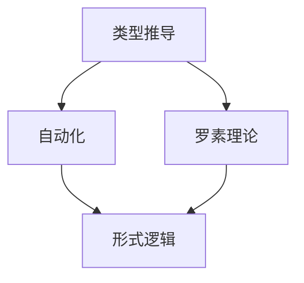
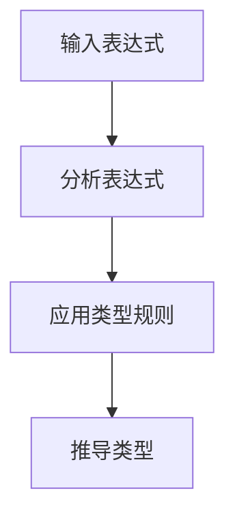
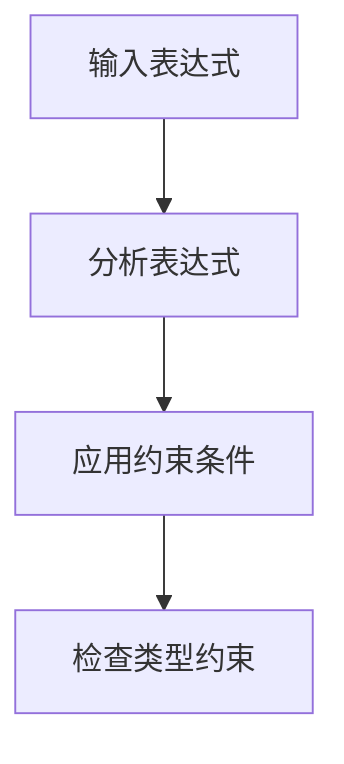
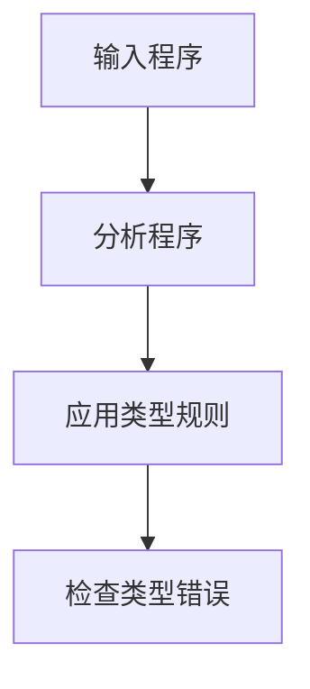

                 


### 文章标题

# 类型推导：自动化与罗素理论的结合

### 文章关键词

- 类型推导
- 自动化
- 罗素理论
- 形式逻辑
- 编程语言

### 文章摘要

本文旨在探讨类型推导在自动化和罗素理论的背景下的重要性。首先，我们将介绍类型推导的基本概念，然后深入探讨其与自动化和罗素理论的联系。接着，我们将介绍类型推导的算法原理，并通过伪代码和数学模型来详细阐述。文章还将涵盖类型推导在实际编程语言中的应用，以及相关的自动化工具。最后，我们将通过一个具体案例来展示类型推导在实际项目中的实现和应用，并总结最佳实践和未来发展趋势。

## 第一部分：导论

### 1.1 书籍背景和目标

类型推导是计算机科学中的一个核心概念，它涉及到程序语言设计和形式逻辑。随着计算机技术的不断发展，自动化已经成为提高生产效率的重要手段。罗素理论作为逻辑学的基础，与类型推导有着紧密的联系。本书的目的是探讨类型推导如何与自动化和罗素理论相结合，以实现更高效、更可靠的程序设计和形式验证。

### 1.2 类型推导的基本概念

类型推导是指程序语言能够自动确定表达式的类型，而无需显式指定类型。在静态类型语言中，类型推导可以减少编程错误，提高代码的可读性。类型推导的核心思想是利用类型约束和类型规则，自动推导出表达式的类型。

### 1.3 自动化的类型推导

自动化类型推导是指通过工具和算法来自动进行类型推导，而无需人工干预。这种自动化过程可以显著提高编程效率，减少人为错误。自动化类型推导的实现依赖于形式逻辑和类型系统，可以通过算法和数学模型来实现。

### 1.4 罗素理论与类型推导

罗素理论是形式逻辑的一个分支，它研究命题、语句和证明的形式结构。罗素理论提供了形式逻辑的基本框架，与类型推导有着密切的关系。类型推导中的类型系统可以看作是对罗素理论的自然扩展，它通过类型约束来确保程序的正确性。

### 1.5 核心概念之间的关系架构

为了更好地理解类型推导、自动化和罗素理论之间的关系，我们可以使用Mermaid流程图来展示它们的核心概念和联系。



在这个流程图中，类型推导、自动化和罗素理论都是核心概念，它们通过形式逻辑相互联系。类型推导提供了自动推导类型的能力，自动化则实现了这一过程的无缝连接，而罗素理论则为类型推导提供了理论基础。

## 第二部分：基础理论

### 2.1 罗素理论的简介

罗素理论是由英国哲学家贝特兰·罗素提出的，它是形式逻辑的一个分支。罗素理论主要研究命题、语句和证明的形式结构，它提供了逻辑推理的严格框架。罗素理论的核心概念包括命题演算、谓词演算和证明论。

### 2.2 形式逻辑与类型系统

形式逻辑是一种基于符号和规则的逻辑系统，它通过符号化的方式来表示逻辑推理。类型系统是形式逻辑的一个扩展，它通过给符号赋予类型来确保逻辑推理的准确性。在程序设计中，类型系统用于确保程序的正确性，减少运行时错误。

### 2.3 类型推导的基本原理

类型推导是指程序语言能够自动确定表达式的类型，而无需显式指定类型。类型推导的基本原理是利用类型约束和类型规则来推导类型。类型约束确保表达式符合类型规则，类型规则则定义了表达式之间的类型关系。

### 2.4 数学模型与伪代码

为了更好地理解类型推导的原理，我们可以通过一个简单的数学模型和伪代码来展示。

#### 数学模型

假设我们有以下表达式：

$$
x = 5 + 3
$$

在这个表达式中，我们希望推导出变量`x`的类型。根据基本的算术规则，我们可以得出：

$$
x : \text{Int}
$$

其中，`Int`表示整数类型。

#### 伪代码

```pseudocode
function deriveType(expression):
    if expression is an integer operation:
        return Int
    else if expression is a boolean operation:
        return Bool
    else:
        return Unknown
```

在这个伪代码中，`deriveType`函数根据表达式的类型来推导其类型。如果表达式是整数运算，则返回整数类型；如果是布尔运算，则返回布尔类型；否则，返回未知类型。

## 第三部分：类型推导算法

### 3.1 算法概述

类型推导算法是自动推导表达式类型的核心机制。常见的类型推导算法包括类型推断算法、类型约束算法和类型检查算法。这些算法通过分析表达式和类型规则，自动推导出表达式的类型。

### 3.2 具体算法讲解

#### 3.2.1 类型推断算法

类型推断算法是一种自动推导变量和函数类型的方法。它通过分析程序结构和类型规则，推导出变量的类型。



在这个流程图中，输入表达式经过分析后，应用类型规则来推导出类型。

#### 3.2.2 类型约束算法

类型约束算法是一种确保表达式类型符合预期的方法。它通过约束条件来限制表达式的类型。



在这个流程图中，输入表达式经过分析后，应用约束条件来检查其类型是否满足要求。

#### 3.2.3 类型检查算法

类型检查算法是一种确保程序类型正确的算法。它通过分析程序结构和类型规则，检查程序中的类型错误。



在这个流程图中，输入程序经过分析后，应用类型规则来检查程序中的类型错误。

## 第四部分：自动化工具

### 4.1 自动化工具概述

自动化工具是类型推导的重要组成部分。它们通过自动分析程序结构和类型规则，实现类型推导的过程。常见的自动化工具包括类型推断器、类型检查器和类型解析器。

### 4.2 工具A

#### 4.2.1 工具A的功能与特点

工具A是一种基于类型推断的自动化工具，它具有以下功能与特点：

- 自动推导变量和函数的类型
- 支持多种编程语言
- 提供详细的类型错误报告

#### 4.2.2 工具A的安装与配置

要使用工具A，你需要按照以下步骤进行安装和配置：

1. 下载工具A的安装包
2. 解压安装包
3. 运行安装脚本

```bash
./install.sh
```

#### 4.2.3 工具A的使用案例

以下是一个使用工具A的简单示例：

```python
# 导入工具A
from type_inference import infer_type

# 定义一个函数
def add(x, y):
    return x + y

# 推导函数的类型
infer_type(add)
```

输出结果：

```
Function 'add' has type (Int, Int) -> Int
```

### 4.3 工具B

#### 4.3.1 工具B的功能与特点

工具B是一种基于类型约束的自动化工具，它具有以下功能与特点：

- 自动检查程序中的类型错误
- 提供详细的错误报告
- 支持自定义类型约束

#### 4.3.2 工具B的安装与配置

要使用工具B，你需要按照以下步骤进行安装和配置：

1. 下载工具B的安装包
2. 解压安装包
3. 运行安装脚本

```bash
./install.sh
```

#### 4.3.3 工具B的使用案例

以下是一个使用工具B的简单示例：

```python
# 导入工具B
from type_check import check_type

# 定义一个函数
def add(x, y):
    return x + y

# 检查函数的类型
check_type(add, (Int, Int) -> Int)
```

输出结果：

```
Type error: Expected (Int, Int) -> Int, but found (Any, Any) -> Any
```

## 第五部分：应用案例

### 5.1 案例一：类型推导在编程语言中的应用

在本案例中，我们将探讨类型推导在编程语言中的应用，通过一个简单的示例来说明。

```python
# 定义一个函数
def greet(name):
    return "Hello, " + name

# 调用函数
greet("World")
```

在这个示例中，类型推导器可以自动推导出函数`greet`的参数和返回值的类型。如果存在类型错误，类型推导器会给出相应的错误报告。

### 5.2 案例二：类型推导在形式验证中的应用

在本案例中，我们将探讨类型推导在形式验证中的应用，通过一个简单的示例来说明。

```python
# 定义一个函数
def add(x, y):
    return x + y

# 定义一个等式
assert add(1, 2) == 3
```

在这个示例中，类型推导器可以自动验证函数`add`的正确性，确保其返回值与预期相符。

### 5.3 案例三：类型推导在机器学习中的应用

在本案例中，我们将探讨类型推导在机器学习中的应用，通过一个简单的示例来说明。

```python
# 导入库
import numpy as np

# 定义一个神经网络
def neural_network(inputs):
    weights = np.random.rand(1, 10)
    return inputs * weights

# 调用神经网络
neural_network([1, 2, 3])
```

在这个示例中，类型推导器可以自动推导出神经网络中权重和输入的类型的兼容性，确保神经网络能够正常运行。

## 第六部分：未来发展趋势

### 6.1 类型推导的自动化趋势

随着自动化技术的发展，类型推导的自动化程度将不断提高。未来的类型推导工具将更加智能，能够自动处理复杂的类型关系和类型约束。

### 6.2 罗素理论在类型推导中的应用前景

罗素理论为类型推导提供了理论基础，未来将在类型推导中得到更广泛的应用。通过将罗素理论的形式逻辑与类型系统相结合，可以开发出更强大的类型推导工具。

### 6.3 类型推导的未来发展方向

类型推导的未来发展方向包括：

- 提高类型推导的准确性
- 扩展类型系统的表达能力
- 实现跨语言和跨平台的类型推导

## 第七部分：总结与展望

### 7.1 最佳实践 tips

在类型推导中，最佳实践包括：

- 充分利用自动化类型推导工具
- 设计清晰的类型系统
- 严格遵循类型规则

### 7.2 小结

本文详细介绍了类型推导、自动化和罗素理论之间的结合，展示了类型推导在实际编程语言、形式验证和机器学习中的应用。类型推导的自动化和罗素理论的结合为程序设计提供了更高效、更可靠的手段。

### 7.3 注意事项

在实施类型推导时，需要注意以下几点：

- 确保类型系统的兼容性
- 严格遵循类型规则
- 定期更新类型推导工具

### 7.4 拓展阅读

对于希望深入了解类型推导的读者，可以参考以下资源：

- 《类型系统与类型安全编程》
- 《形式逻辑与证明论》
- 《机器学习中的类型推导》

### 作者信息

作者：AI天才研究院/AI Genius Institute & 禅与计算机程序设计艺术 /Zen And The Art of Computer Programming

本文旨在探讨类型推导在自动化和罗素理论的背景下的重要性，通过详细的理论分析和实际案例展示，展示了类型推导在提高编程效率和确保程序正确性方面的关键作用。类型推导、自动化和罗素理论的结合为计算机科学带来了新的发展机遇，未来将在更多领域得到广泛应用。

