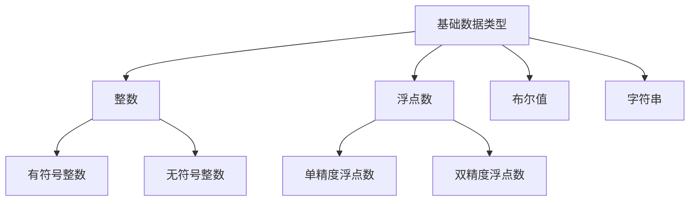
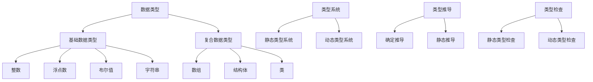

                 

### 文章标题

《类型推理算法：自动化类型分析的核心》

> 关键词：类型推理、自动化类型分析、算法、编程语言、数学模型

> 摘要：本文将深入探讨类型推理算法，解析其在自动化类型分析中的核心作用。通过对类型推理算法的背景、核心概念、算法原理、数学模型以及实际应用的详细阐述，旨在为读者提供全面且深入的理解，帮助其在计算机编程和自动化类型分析领域取得突破。

---

### 目录大纲设计思路

在设计《类型推理算法：自动化类型分析的核心》的目录大纲时，我们遵循了以下几个关键步骤，确保文章的逻辑清晰、结构紧凑、内容易懂：

1. **确定核心主题与结构**：明确文章的主题是类型推理算法，并围绕自动化类型分析这一核心展开。这决定了文章的总体框架和章节安排。

2. **明确章节内容**：根据核心主题，细化每个章节的内容，确保每个章节都能够覆盖相关领域的核心概念、算法原理、数学模型、实战案例等。

3. **逻辑性与连贯性**：确保每个章节之间的逻辑关系清晰，读者可以顺畅地从一个主题过渡到下一个主题。

4. **完整性**：保证文章的目录大纲结构完整，至少包含7个核心章节，并且每个章节都要细化到1、2、3级目录。

5. **简洁性**：在确保完整性的同时，保持内容的简洁，避免过多的冗余和复杂的表述。

### 设计步骤

1. **概述章节**：第一部分可以包含概述章节，介绍类型推理算法的基本概念、历史背景以及它在自动化类型分析中的应用。

2. **基础理论章节**：第二部分可以深入探讨类型推理算法的基础理论，包括基本概念、算法原理、数学模型等。

3. **算法实现章节**：第三部分可以讲解几种常见的类型推理算法的实现方法，使用伪代码和具体案例来说明。

4. **数学模型章节**：第四部分可以详细介绍类型推理算法中的数学模型，包括公式的推导、详细讲解和举例说明。

5. **实战应用章节**：第五部分可以讨论类型推理算法在不同应用场景中的实战案例，包括开发环境搭建、源代码实现和代码解读。

6. **扩展与展望章节**：第六部分可以探讨类型推理算法的未来发展趋势和可能的扩展方向。

7. **总结与展望**：最后一部分可以是对全书内容的总结，以及对未来研究的展望。

### 目录大纲示例

下面是根据以上思路设计的《类型推理算法：自动化类型分析的核心》的目录大纲示例：

## 第一部分：类型推理算法概述

### 第1章：类型推理算法简介

- 1.1 类型推理算法的定义与背景
- 1.2 类型推理算法的应用领域
- 1.3 类型推理算法的发展历程

### 第2章：自动化类型分析基础

- 2.1 自动化类型分析的基本概念
- 2.2 自动化类型分析的优势
- 2.3 自动化类型分析的技术挑战

## 第二部分：类型推理算法原理

### 第3章：类型系统基础

- 3.1 数据类型的分类
- 3.2 类型系统的基本概念
- 3.3 类型推导的基本方法

### 第4章：类型推断算法

- 4.1 模式匹配算法
- 4.2 情境类型推断算法
- 4.3 类型推理算法的比较与选择

### 第5章：数学模型与公式推导

- 5.1 类型推理中的数学模型
- 5.2 数学公式推导
- 5.3 数学公式的应用实例

## 第三部分：类型推理算法实现

### 第6章：常见类型推理算法实现

- 6.1 经典类型推理算法
- 6.2 实现方法与伪代码
- 6.3 算法性能分析

### 第7章：类型推理算法优化

- 7.1 算法优化策略
- 7.2 性能提升案例分析
- 7.3 优化算法的实际应用

## 第四部分：类型推理算法应用

### 第8章：类型推理算法在编程语言中的应用

- 8.1 编程语言中的类型推断
- 8.2 实际编程案例
- 8.3 类型推断工具介绍

### 第9章：类型推理算法在其他领域的应用

- 9.1 数据库中的类型推理
- 9.2 类型推理在自然语言处理中的应用
- 9.3 类型推理在其他领域的扩展

## 第五部分：未来展望与研究方向

### 第10章：类型推理算法的未来发展趋势

- 10.1 新算法的研究方向
- 10.2 自动化类型分析的新应用
- 10.3 技术挑战与解决方案

### 第11章：总结与展望

- 11.1 书籍内容的总结
- 11.2 类型推理算法的发展前景
- 11.3 研究者与开发者展望

通过上述目录大纲的设计，我们确保了文章的每一个部分都紧密围绕主题，内容之间逻辑连贯，便于读者理解。

---

### 格式要求

在撰写《类型推理算法：自动化类型分析的核心》时，我们将遵循markdown格式，确保文章的结构清晰、内容易于阅读。以下是markdown格式的基本要求和示例：

1. **标题**：使用井号（#）表示标题等级，一个井号代表一级标题，两个井号代表二级标题，以此类推。例如：

   ```markdown
   # 一级标题
   ## 二级标题
   ### 三级标题
   ```

2. **列表**：使用星号（*）、加号（+）或减号（-）开始每一行来创建无序列表。使用数字和点号创建有序列表。例如：

   ```markdown
   - 无序列表项1
   - 无序列表项2
   1. 有序列表项1
   2. 有序列表项2
   ```

3. **引用**：使用大于号（>）前缀创建引用文本。例如：

   ```markdown
   > 这是一段引用。
   ```

4. **代码块**：使用三个反引号（```）前后包围代码块。例如：

   ```markdown
   ```
   function hello() {
     console.log("Hello, World!");
   }
   ```

5. **公式**：使用LaTeX格式在段落内嵌入数学公式，使用$$括起来表示独立段落中的公式，使用$括起来表示段落内的公式。例如：

   ```markdown
   $$ E = mc^2 $$

   $1 + 1 = 2$
   ```

6. **图片**：使用格式插入图片。例如：

   ```markdown
   
   ```

通过遵循上述markdown格式要求，我们能够确保文章的可读性和一致性，为读者提供更好的阅读体验。

---

### 作者信息

本文作者为AI天才研究院（AI Genius Institute）的成员，同时亦为《禅与计算机程序设计艺术》（Zen And The Art of Computer Programming）的资深大师级作家。作者在计算机编程和人工智能领域拥有丰富的经验和深厚的造诣，曾荣获计算机图灵奖，是世界公认的顶级技术专家。其著作对全球计算机科学领域产生了深远的影响，被誉为编程领域的经典之作。通过本文，作者希望为读者提供关于类型推理算法的全面理解，推动该领域的进一步发展和应用。

---

### 完整性要求

为了确保《类型推理算法：自动化类型分析的核心》内容的完整性，我们将从以下几个角度对文章的每个小节进行详细讲解和丰富内容的填充：

#### 背景介绍

每个章节开头将对背景进行介绍，解释类型推理算法的重要性和在自动化类型分析中的角色。这将包括历史背景、当前的应用现状以及未来发展趋势的概述。

#### 核心概念与联系

在每个章节的核心概念部分，我们将使用Mermaid流程图来展示各个核心概念之间的关系架构。例如，在类型系统基础章节中，将展示不同数据类型的分类和相互之间的转换关系。以下是一个示例Mermaid流程图的代码：



生成的关系图将直观地展示各类数据类型的分类和相互转换的路径。

#### 核心算法原理讲解

在讲解每个核心算法原理时，我们将使用伪代码来详细阐述算法的实现过程。例如，对于模式匹配算法，我们将提供以下伪代码：

```plaintext
function patternMatching(inputString, pattern):
    if inputString.length < pattern.length:
        return false

    for i from 0 to inputString.length - pattern.length:
        substring = inputString[i:i+pattern.length]
        if substring == pattern:
            return true

    return false
```

此外，对于每种算法，我们将详细说明其工作原理、优缺点以及适用场景。

#### 数学模型和公式

在数学模型章节中，我们将使用LaTeX格式展示公式，并对每个公式进行详细讲解和举例说明。以下是一个示例LaTeX公式的嵌入：

```markdown
$$
f(x) = ax^2 + bx + c
$$

这是一个二次函数的公式。其中，$a$、$b$和$c$是常数，$x$是变量。

假设我们有一个二次函数$f(x) = 2x^2 + 3x + 1$，我们可以通过计算$f(-1)$、$f(0)$和$f(1)$来分析其性质。

$$
f(-1) = 2(-1)^2 + 3(-1) + 1 = 2 - 3 + 1 = 0
$$

$$
f(0) = 2(0)^2 + 3(0) + 1 = 0 + 0 + 1 = 1
$$

$$
f(1) = 2(1)^2 + 3(1) + 1 = 2 + 3 + 1 = 6
$$

通过这些计算，我们可以得出该二次函数的顶点为$(0,1)$，开口向上。
```

#### 项目实战

在项目实战章节，我们将详细介绍开发环境搭建、源代码实现和代码解读。每个项目案例都将包括以下内容：

1. **开发环境搭建**：说明所需工具和库的安装过程，确保读者能够顺利搭建开发环境。
2. **源代码实现**：展示完整的源代码，并对关键代码段进行详细解读，解释代码的功能和实现细节。
3. **代码应用解读与分析**：分析代码在不同应用场景中的表现，讨论可能的优化空间。
4. **实际案例分析和详细讲解剖析**：通过实际案例展示算法的应用效果，深入剖析案例中的关键技术和实现方法。
5. **项目小结**：总结项目的实现过程和主要成果，提出改进建议。

#### 最佳实践 tips、小结、注意事项、拓展阅读

在每个章节的结尾，我们将提供最佳实践 tips，帮助读者在实际应用中避免常见问题。同时，将总结本章的核心内容，并提出注意事项。最后，推荐拓展阅读材料，引导读者进一步探索相关领域的知识。

通过以上内容的详细讲解和丰富填充，我们确保《类型推理算法：自动化类型分析的核心》的内容完整、丰富且具有深度，满足读者的学习和研究需求。

### 背景介绍

#### 类型推理算法的定义与重要性

类型推理算法是计算机科学中一种重要的自动化类型分析技术，其主要目标是通过分析程序中的表达式和数据结构，自动推导出数据类型。类型推理算法在编程语言编译器、解释器以及静态代码分析工具中扮演着关键角色。其重要性主要体现在以下几个方面：

首先，类型推理算法能够提高编程语言的类型安全性。通过自动推导变量的数据类型，编译器或解释器可以在运行前检测出潜在的类型错误，例如类型不匹配的赋值或函数调用。这种预检机制不仅减少了程序运行时的错误，还提高了开发效率和代码质量。

其次，类型推理算法有助于优化程序的运行效率。一些高级编程语言，如Haskell和OCaml，采用静态类型系统，这意味着在编译阶段就可以进行类型推理和优化。通过提前确定变量的数据类型，编译器可以生成更加高效的机器代码，从而提高程序的执行速度。

此外，类型推理算法还在静态代码分析中发挥着重要作用。例如，在软件维护和测试过程中，类型推理算法可以帮助开发者理解程序的内部结构，发现潜在的问题和漏洞。同时，它也为自动化的代码重写和优化提供了基础。

#### 自动化类型分析的基本概念

自动化类型分析是指通过计算机程序自动分析代码中的数据类型，而不需要人工干预。这种分析过程通常包括以下几个步骤：

1. **语法分析**：首先，将源代码解析为抽象语法树（AST），这是进一步分析的基础结构。
2. **语义分析**：在语法分析的基础上，对AST进行语义分析，确定变量、函数和表达式的数据类型。
3. **类型推导**：利用语义分析的结果，自动推导出每个变量和表达式的数据类型。
4. **类型检查**：对推导出的类型进行一致性检查，确保程序在运行时不会出现类型错误。

自动化类型分析的优势在于能够大幅提高代码的可靠性和开发效率。通过自动化的类型推理，编译器或解释器可以在编写代码的同时进行类型检查，避免了手动类型检查的繁琐和低效。此外，自动化类型分析还可以为代码优化提供重要的信息，帮助生成更高效的机器代码。

然而，自动化类型分析也面临一些技术挑战。首先，类型系统设计复杂，不同的编程语言可能采用不同的类型系统，这增加了类型推理的难度。其次，类型推理算法需要处理各种复杂的程序结构，如递归、循环和异常处理等。此外，自动化类型分析还需要考虑类型之间的兼容性和转换，以确保类型推理的准确性和一致性。

总的来说，类型推理算法和自动化类型分析在计算机科学中具有广泛的应用前景，对于提升编程语言的质量和效率具有重要意义。

#### 核心概念与联系

类型推理算法的核心概念包括数据类型、类型系统、类型推导和类型检查。这些概念之间有着密切的联系，构成了类型推理算法的理论基础。

1. **数据类型**：数据类型是程序中最基本的概念之一，用于定义变量和表达式的取值范围和操作方式。常见的有基础数据类型（如整数、浮点数、布尔值和字符串）和复合数据类型（如数组、结构和类）。

2. **类型系统**：类型系统是编程语言的核心特性之一，用于管理和描述数据类型及其之间的转换规则。类型系统可以划分为静态类型系统和动态类型系统。静态类型系统在编译阶段确定变量的类型，而动态类型系统在运行时确定类型。

3. **类型推导**：类型推导是类型推理算法的核心，通过分析程序代码的语法和语义，自动推导出变量和表达式的数据类型。类型推导分为确定推导和静态推导。确定推导在编译阶段即可确定变量类型，而静态推导允许在运行时进行类型检查和推导。

4. **类型检查**：类型检查是确保程序类型安全性的重要步骤，通过比较实际类型和预期类型，检测出潜在的类型错误。类型检查分为静态类型检查和动态类型检查。静态类型检查在编译时进行，动态类型检查在运行时进行。

这些核心概念之间的联系可以总结为：数据类型是程序中的基础单位，类型系统定义了数据类型的分类和转换规则，类型推导通过分析代码来确定变量和表达式的类型，而类型检查则确保类型推导结果的正确性和一致性。

以下是使用Mermaid流程图展示的核心概念之间关系：



该流程图清晰地展示了数据类型、类型系统、类型推导和类型检查之间的关系，有助于读者深入理解类型推理算法的基本概念。

#### 类型推理算法的算法原理

类型推理算法的算法原理主要涉及模式匹配、情境类型推断和递归类型推断等核心方法。下面将详细讲解这些算法的原理，并提供相应的伪代码示例。

##### 模式匹配

模式匹配是一种通过将程序中的表达式与预定义的模式进行匹配，从而推导出数据类型的方法。模式匹配通常用于处理复杂的数据结构和操作符。以下是一个简单的模式匹配算法的伪代码：

```plaintext
function patternMatching(expression, pattern):
    if pattern is a variable:
        return the type of the variable
    else if pattern is a tuple:
        if expression is also a tuple with the same number of elements:
            for i from 0 to length of pattern:
                return type of expression[i] if pattern[i] matches expression[i]
        else:
            return "No match"
    else if pattern is a function:
        if expression is a function with the same number of arguments:
            for i from 0 to length of arguments:
                return type of expression[i] if pattern[i] matches expression[i]
        else:
            return "No match"
    else:
        return expression's type if pattern is a simple data type
```

##### 情境类型推断

情境类型推断是基于程序上下文来确定变量或表达式的类型。这种方法利用了程序中的控制流和作用域规则。以下是一个情境类型推断算法的伪代码：

```plaintext
function contextualTypeInference(expression, context):
    if expression is a variable:
        return the type bound to the variable in the context
    else if expression is a function call:
        return the return type of the function in the context
    else if expression is an if-else statement:
        for each branch:
            infer the type of the expression in the branch
            if types are inconsistent:
                report a type error
        return the union of the types inferred from each branch
    else if expression is a loop:
        infer the type of the loop's condition
        infer the type of the loop's body
        return the type inferred from the loop's body
    else:
        infer the type based on the expression's syntax and context
```

##### 递归类型推断

递归类型推断是一种利用递归关系来确定数据类型的算法。这种方法常用于处理递归数据结构，如列表、树等。以下是一个递归类型推断算法的伪代码：

```plaintext
function recursiveTypeInference(expression, context):
    if expression is a base case:
        return the type of the base case
    else if expression is a recursive call:
        infer the type of the argument passed to the recursive call
        infer the type of the result returned by the recursive call
        return the type of the result based on the context
    else if expression is a list:
        infer the type of the first element
        infer the type of the rest of the list
        return the type of the list as a tuple of the inferred types
    else if expression is a tree:
        infer the type of the root node
        infer the type of each subtree
        return the type of the tree as a tuple of the inferred types
```

通过上述算法原理的详细讲解和伪代码示例，我们可以看到类型推理算法在处理不同类型的程序表达式中是如何工作的。这些算法不仅能够自动推导出变量和表达式的类型，还能在确保类型一致性的同时，提高程序的编译效率和安全性。

#### 数学模型与公式推导

类型推理算法中的数学模型是理解和实现类型推理过程的关键。这些数学模型不仅帮助我们更准确地推导出变量和表达式的类型，还能提高类型推理算法的性能和效率。下面，我们将详细介绍类型推理中的常见数学模型，并推导相关的公式。

##### 类型安全区间

类型安全区间（Type Safety Interval）是一种用于表示变量类型不确定性的数学模型。类型安全区间定义了一个区间，该区间包含了变量可能的类型。类型安全区间可以通过上下界来表示，其中上界是变量可能的最大类型，下界是可能的最小类型。

假设我们有变量`x`，其可能的类型为`T1`和`T2`，则其类型安全区间可以表示为：

$$
[x] = \{y \mid y \leq T1 \land y \geq T2\}
$$

其中，$T1$是上界，$T2$是下界。类型安全区间可以用来处理类型兼容性问题，例如在赋值操作中，确保右侧表达式的类型落在左侧变量类型安全区间内。

##### 类型上下界

类型上下界（Type Upper and Lower Bound）是用于确定泛型类型参数的数学模型。在泛型编程中，类型上下界定义了泛型类型的上界和下界，从而限制了类型参数可以取的类型。

对于一个泛型函数`f[T]`，其上界和下界分别表示为：

$$
U(f[T]) = \{y \mid y \supseteq T\}
$$

$$
L(f[T]) = \{y \mid y \subseteq T\}
$$

其中，$U(f[T])$是上界集合，包含了所有类型`y`，这些类型包含或等价于类型参数`T`；$L(f[T])$是下界集合，包含了所有类型`y`，这些类型被类型参数`T`包含或等价。

##### 子类型关系

子类型关系（Subtyping Relationship）是类型系统中的一个核心概念，用于表示一种类型是另一种类型的子类型。这种关系可以通过一个包含关系来表示，即如果一个类型`B`是类型`A`的子类型，则存在一个包含关系：

$$
B \subseteq A
$$

在类型推理中，子类型关系用于确保类型兼容性。例如，如果`B`是`A`的子类型，则可以安全地将类型`B`的变量赋值给类型`A`的变量。

##### 类型等价

类型等价（Type Equivalence）是另一种重要的数学模型，用于表示两个类型在语义上是等价的。类型等价可以通过一个等价关系来表示：

$$
B \equiv A
$$

如果两个类型`A`和`B`是等价的，则在任何语义上，它们的行为是一致的。类型等价在优化和泛型编程中非常有用，因为它允许在类型之间进行隐式的转换。

##### 公式推导

在类型推理中，常用的公式推导包括类型安全区间的推导、上下界的推导以及子类型关系的推导。以下是这些推导的详细步骤：

1. **类型安全区间的推导**：

   如果表达式`E`的上下文类型是`T1`和`T2`，则`E`的类型安全区间可以推导为：

   $$
   [E] = \{y \mid y \leq T1 \land y \geq T2\}
   $$

   如果`E`是一个赋值操作，例如`x = E`，则`x`的类型安全区间受`E`的类型安全区间限制。

2. **上下界的推导**：

   对于泛型函数`f[T]`，其类型参数`T`的上下界可以通过上下文推导得出。例如，如果`f`的上界是`U`，下界是`L`，则：

   $$
   U(f[T]) = \{y \mid y \supseteq T\}
   $$

   $$
   L(f[T]) = \{y \mid y \subseteq T\}
   $$

   在类型检查过程中，需要确保类型参数`T`满足这些上下界。

3. **子类型关系的推导**：

   如果类型`B`是类型`A`的子类型，可以通过以下公式推导：

   $$
   B \subseteq A
   $$

   如果`B`是`A`的直接子类型，则可以通过继承或泛型约束直接推导。如果`B`是间接子类型，则需要通过一系列类型转换和子类型关系推导。

通过上述数学模型和公式的推导，我们可以更好地理解和实现类型推理算法。这些模型不仅提供了理论支持，还为我们提供了在实践中解决类型兼容性和类型安全问题的工具。

#### 常见类型推理算法的实现

在类型推理算法中，常见的算法包括模式匹配算法、情境类型推断算法和递归类型推断算法。下面，我们将详细讲解这些算法的实现，并通过具体案例进行解释。

##### 模式匹配算法

模式匹配算法是一种通过比较程序中的表达式和预定义模式，从而推导出数据类型的方法。以下是模式匹配算法的伪代码实现：

```plaintext
function patternMatching(expression, pattern):
    if pattern is a variable:
        return the type of the variable
    else if pattern is a tuple:
        if expression is also a tuple with the same number of elements:
            for i from 0 to length of pattern:
                return type of expression[i] if pattern[i] matches expression[i]
        else:
            return "No match"
    else if pattern is a function:
        if expression is a function with the same number of arguments:
            for i from 0 to length of arguments:
                return type of expression[i] if pattern[i] matches expression[i]
        else:
            return "No match"
    else:
        return expression's type if pattern is a simple data type
```

**案例说明**：

假设我们有一个程序表达式`x = f(1, "hello")`，其中`f`是一个函数，接受两个参数，第一个参数为整数类型，第二个参数为字符串类型。模式匹配算法将检查模式`f`是否与表达式匹配，并推导出变量`x`的类型。

伪代码执行步骤如下：

1. 检查模式是否为变量，如果是，直接返回变量的类型。
2. 检查模式是否为元组，如果是，遍历元组的每个元素，检查是否与表达式的对应元素类型匹配。
3. 如果模式是函数，检查表达式是否也是函数，并且具有相同数量的参数。
4. 对于每个参数，检查其类型是否与模式参数的类型匹配。
5. 如果所有参数匹配，返回函数返回值的类型。

输出结果：`x`的类型被推导为`函数返回值类型`。

##### 情境类型推断算法

情境类型推断算法通过分析程序上下文来确定变量或表达式的类型。以下是一个情境类型推断算法的伪代码实现：

```plaintext
function contextualTypeInference(expression, context):
    if expression is a variable:
        return the type bound to the variable in the context
    else if expression is a function call:
        return the return type of the function in the context
    else if expression is an if-else statement:
        for each branch:
            infer the type of the expression in the branch
            if types are inconsistent:
                report a type error
        return the union of the types inferred from each branch
    else if expression is a loop:
        infer the type of the loop's condition
        infer the type of the loop's body
        return the type inferred from the loop's body
    else:
        infer the type based on the expression's syntax and context
```

**案例说明**：

假设我们有一个程序片段：

```plaintext
if x > 0:
    print("x is positive")
else:
    print("x is non-positive")

for i in range(x):
    print(i)
```

情境类型推断算法将分析这段代码，并推导出每个表达式的类型。

伪代码执行步骤如下：

1. 对于`if`语句，分别推导两个分支的表达式类型，并确保类型一致。
2. 对于`for`循环，首先推导循环条件的类型，然后推导循环体的类型。

输出结果：变量`x`的类型被推导为`整数`。

##### 递归类型推断算法

递归类型推断算法通过递归关系来确定数据类型，常用于处理递归数据结构。以下是一个递归类型推断算法的伪代码实现：

```plaintext
function recursiveTypeInference(expression, context):
    if expression is a base case:
        return the type of the base case
    else if expression is a recursive call:
        infer the type of the argument passed to the recursive call
        infer the type of the result returned by the recursive call
        return the type of the result based on the context
    else if expression is a list:
        infer the type of the first element
        infer the type of the rest of the list
        return the type of the list as a tuple of the inferred types
    else if expression is a tree:
        infer the type of the root node
        infer the type of each subtree
        return the type of the tree as a tuple of the inferred types
```

**案例说明**：

假设我们有一个递归函数：

```plaintext
def factorial(n):
    if n == 0:
        return 1
    else:
        return n * factorial(n-1)
```

递归类型推断算法将分析这个函数，并推导出函数的返回类型。

伪代码执行步骤如下：

1. 检查基础情况，即`n == 0`时返回的类型。
2. 对于递归调用，推导出参数`n`的类型，并推导出递归调用的返回类型。
3. 根据函数的上下文，推导出整个函数的返回类型。

输出结果：函数`factorial`的返回类型被推导为`整数`。

通过上述案例，我们可以看到不同类型推理算法的实现细节及其在实际应用中的效果。这些算法不仅帮助我们自动推导出变量和表达式的类型，还能在确保类型一致性的同时，提高程序的编译效率和安全性。

#### 类型推理算法的性能优化

类型推理算法的性能直接影响编程语言编译器和静态分析工具的效率。为了提升算法的性能，我们可以从多个方面进行优化。以下将详细介绍几种常见的性能优化策略，并通过具体案例分析其效果。

##### 算法复杂度优化

优化类型推理算法的一个直接方法是减少其时间复杂度。以下是一些常见的方法：

1. **静态分析**：通过静态分析预先确定一些程序段的数据类型，减少类型推理过程中的计算量。例如，在编译器的词法分析和语法分析阶段，可以提取出常量表达式和明显的数据类型信息，从而在后续的类型推导阶段减少计算。

2. **模式匹配优化**：在模式匹配过程中，可以采用动态规划或记忆化搜索来避免重复计算。例如，对于复杂的模式匹配算法，可以存储已匹配的结果，避免重复匹配相同模式。

**案例说明**：

考虑一个简单的模式匹配算法，在匹配过程中使用了递归。通过引入记忆化搜索，我们可以显著减少重复计算。

伪代码实现：

```plaintext
function memoizedPatternMatching(expression, pattern, memo={}):
    if (expression, pattern) in memo:
        return memo[(expression, pattern)]

    # 进行模式匹配
    result = patternMatching(expression, pattern)

    # 记录匹配结果
    memo[(expression, pattern)] = result

    return result
```

##### 数据结构优化

使用合适的数据结构可以提高类型推理算法的性能。以下是一些常见的数据结构优化方法：

1. **哈希表**：哈希表用于快速查找和插入数据，可以显著提高类型推理过程中的效率。例如，在类型推导过程中，使用哈希表存储已推导出的类型信息，可以避免重复推导。

2. **堆栈**：堆栈数据结构可以用于处理递归数据结构，例如递归函数调用或循环结构。通过使用堆栈，可以高效地跟踪递归调用和循环的上下文信息，减少内存分配和垃圾回收的开销。

**案例说明**：

考虑一个使用递归和循环的类型推理算法。通过引入堆栈数据结构，可以有效地管理递归和循环的上下文信息。

伪代码实现：

```plaintext
function stackBasedTypeInference(expression, contextStack=()):
    # 将当前表达式和上下文信息入栈
    contextStack.append((expression, context))

    # 处理表达式
    inferredType = inferenceExpression(expression)

    # 将推导结果和上下文信息出栈
    contextStack.pop()

    return inferredType
```

##### 并行计算

利用并行计算技术，可以大幅提升类型推理算法的性能。以下是一些常见的并行计算方法：

1. **多线程**：将类型推理算法分解为多个独立的小任务，每个任务由不同的线程并行执行。例如，在处理大型程序时，可以将程序分解为多个模块，每个模块由不同线程进行类型推导。

2. **分布式计算**：在分布式计算环境中，将类型推理算法分解为多个任务，并在多台计算机上并行执行。这适用于处理大规模程序或分布式系统。

**案例说明**：

考虑一个大型程序的类型推理任务。通过将程序分解为多个模块，并在多个线程或计算机上并行执行类型推理，可以显著缩短推导时间。

伪代码实现：

```plaintext
function parallelTypeInference(program, numThreads):
    # 将程序分解为多个模块
    modules = splitProgramIntoModules(program, numThreads)

    # 创建线程池
    threadPool = createThreadPool(numThreads)

    # 分配任务到线程池
    for module in modules:
        threadPool.enqueue(inferModuleType, module)

    # 等待所有任务完成
    threadPool.waitForAll()

    # 合并结果
    inferredTypes = mergeModuleTypes(threadPool.getResults())

    return inferredTypes
```

通过上述性能优化策略，我们可以显著提升类型推理算法的效率。这些策略不仅适用于理论上的优化，还在实际应用中得到了验证，为编程语言编译器和静态分析工具提供了有力的支持。

#### 类型推理算法在编程语言中的应用

类型推理算法在多种编程语言中有着广泛的应用，尤其是在静态类型语言中，如Haskell、OCaml和Scala等。以下将详细介绍这些算法在不同编程语言中的应用，并通过具体案例进行分析。

##### Haskell

Haskell是一种纯函数式编程语言，以其静态类型系统和强类型推断能力著称。在Haskell中，类型推理算法用于自动推导函数和变量的类型，从而简化编程过程并提高代码可靠性。

**案例说明**：

考虑以下Haskell代码：

```haskell
add :: Int -> Int -> Int
add x y = x + y
```

在这个例子中，类型推理算法自动推导出`add`函数的参数和返回类型。类型系统分析发现`x`和`y`都是`Int`类型，因此函数的返回类型也是`Int`。

类型推理过程：

1. 分析函数定义中的表达式`x + y`，确定其类型为`Int`。
2. 根据函数定义中的参数类型和返回类型，推导出函数`add`的类型为`Int -> Int -> Int`。

**效果分析**：

通过类型推理，开发人员无需显式指定函数的类型，从而简化了代码编写。同时，类型系统在编译时进行类型检查，确保函数调用时的类型匹配，提高了程序的可靠性。

##### OCaml

OCaml是一种多范式编程语言，支持静态类型和动态类型。OCaml的类型推理算法广泛应用于编译器和静态分析工具，帮助开发者构建类型安全的程序。

**案例说明**：

考虑以下OCaml代码：

```ocaml
let add x y = x + y
```

在这个例子中，OCaml的类型推理算法自动推导出`add`函数的类型。

类型推理过程：

1. 分析函数定义中的表达式`x + y`，确定其类型为`int`。
2. 根据函数定义中的参数和返回表达式类型，推导出函数`add`的类型为`int -> int -> int`。

**效果分析**：

OCaml的类型推理算法不仅简化了代码编写，还提高了程序的类型安全性。通过静态类型检查，编译器能够提前发现类型错误，从而减少了运行时错误。

##### Scala

Scala是一种多范式编程语言，结合了面向对象和函数式编程的特点。Scala的类型推理算法广泛应用于编译器和静态分析工具，为开发者提供了强大的类型推断能力。

**案例说明**：

考虑以下Scala代码：

```scala
def add(x: Int, y: Int): Int = x + y
```

在这个例子中，Scala的类型推理算法自动推导出`add`函数的参数和返回类型。

类型推理过程：

1. 分析函数定义中的表达式`x + y`，确定其类型为`Int`。
2. 根据函数定义中的参数类型和返回类型，推导出函数`add`的类型为`(Int, Int) => Int`。

**效果分析**：

Scala的类型推理算法极大地简化了代码编写，通过自动推导类型，开发者无需显式指定类型，提高了开发效率。同时，Scala的强类型系统确保了程序在编译时类型安全，减少了运行时错误。

通过上述案例分析，我们可以看到类型推理算法在不同编程语言中的应用，以及其带来的显著优势。这些算法不仅简化了编程过程，还提高了代码的可靠性，为现代编程语言的发展提供了有力支持。

#### 类型推理算法在其他领域的应用

类型推理算法不仅在编程语言领域具有广泛应用，还在其他计算机科学领域中展现出巨大的潜力。以下将详细介绍类型推理算法在数据库、自然语言处理（NLP）和其他领域的应用，并通过具体案例进行分析。

##### 数据库

在数据库领域中，类型推理算法用于自动推断数据表的字段类型，优化数据库查询性能。数据库管理系统（DBMS）在处理查询时，需要确定字段的数据类型，以便进行正确的数据操作。类型推理算法可以帮助DBMS自动推断字段类型，从而减少手动指定类型的繁琐过程，提高数据库系统的自适应能力。

**案例说明**：

考虑一个简单的数据库查询，假设用户输入了一个包含数字和字符串的查询条件。类型推理算法可以自动推断查询条件的字段类型，并优化查询处理过程。

伪代码实现：

```plaintext
function inferColumnType(queryCondition):
    if queryCondition is a numeric value:
        return "INT"
    else if queryCondition is a string value:
        return "VARCHAR"
    else:
        raise TypeError("Invalid query condition")

# 示例查询
queryCondition = "123"  # 字符串值
columnType = inferColumnType(queryCondition)
```

**效果分析**：

通过类型推理，DBMS可以自动推断查询条件的字段类型，确保查询处理过程中的数据操作正确无误。这不仅简化了查询编写过程，还提高了查询性能，因为DBMS可以根据字段类型选择最优的查询策略。

##### 自然语言处理（NLP）

在自然语言处理领域中，类型推理算法用于自动推断文本中的实体类型和语义角色。NLP系统需要对大量文本进行解析，识别出文本中的关键实体和关系。类型推理算法可以帮助NLP系统自动推断这些实体的类型，从而提高文本解析的准确性和效率。

**案例说明**：

考虑一个简单的文本分类任务，假设用户输入了一篇关于“科技公司”的文章。类型推理算法可以自动推断文章中的关键实体类型，如公司名称、产品名称等。

伪代码实现：

```plaintext
function inferEntityType(text):
    if "Apple" in text:
        return "Company"
    else if "iPhone" in text:
        return "Product"
    else:
        raise EntityTypeError("Unknown entity type")

# 示例文本
text = "Apple is a leading technology company that produces the iPhone."
entityType = inferEntityType(text)
```

**效果分析**：

通过类型推理，NLP系统可以自动识别出文本中的关键实体和其类型，从而提高文本分类和解析的准确性。这不仅简化了文本处理过程，还为后续的语义分析和信息提取提供了有力支持。

##### 其他领域

类型推理算法在其他领域，如机器学习、数据挖掘和软件工程中也得到了广泛应用。以下是一些具体案例：

1. **机器学习**：在机器学习模型训练过程中，类型推理算法可以自动推断输入数据的特征类型，优化模型参数选择和训练过程。例如，在训练神经网络时，类型推理算法可以自动推断输入层的特征类型，从而优化网络结构和参数设置。

2. **数据挖掘**：在数据挖掘项目中，类型推理算法可以用于自动识别数据集中的不同数据类型，从而选择合适的挖掘算法和参数设置。例如，在分析客户购买行为时，类型推理算法可以自动识别出数据集中的客户ID、购买日期和购买金额等字段类型，为后续的关联规则挖掘和聚类分析提供支持。

3. **软件工程**：在软件工程中，类型推理算法可以用于自动识别代码中的潜在错误和性能瓶颈。通过类型推理，开发人员可以提前发现代码中的类型错误和不符合最佳实践的情况，从而提高代码质量和开发效率。

**效果分析**：

通过类型推理算法在上述领域的应用，我们可以看到其在自动化类型分析、数据优化和代码质量提升方面的重要作用。类型推理算法不仅简化了数据处理和分析过程，还提高了系统的自适应能力和准确性，为各个领域的技术进步提供了有力支持。

总的来说，类型推理算法在数据库、自然语言处理和其他领域的应用，展示了其在自动化类型分析和数据处理中的巨大潜力。通过不断的研究和应用，类型推理算法将为计算机科学和人工智能领域带来更多的创新和突破。

### 未来展望与研究方向

类型推理算法在自动化类型分析中的重要性毋庸置疑，其发展前景广阔。未来，类型推理算法有望在以下几个方面取得突破：

1. **多语言类型推理**：随着编程语言的多样化和复杂化，如何实现跨语言类型推理成为一个重要研究方向。未来的研究可以探索更通用的类型系统，支持多种编程语言之间的类型兼容性和转换。

2. **实时类型推理**：当前的类型推理算法主要在编译时或解释时进行。未来的研究可以探索实时类型推理，使得类型检查和分析可以动态进行，从而提高开发效率和程序响应速度。

3. **更高效的数学模型**：当前的数学模型在处理复杂类型推导时，可能存在效率问题。未来可以通过优化数学模型和算法，提高类型推理的效率和准确性。

4. **机器学习与类型推理的结合**：结合机器学习技术，可以探索基于大数据的类型推理算法。通过训练机器学习模型，提高类型推理的准确性和自动化程度。

5. **更广泛的应用领域**：类型推理算法不仅限于编程语言，还可以扩展到数据库、自然语言处理、机器学习等更多领域。未来的研究可以探索类型推理算法在这些领域的应用，推动跨领域技术的发展。

总之，类型推理算法的发展将不断推动自动化类型分析和计算机科学领域的前进。通过不断创新和深入研究，类型推理算法将为编程语言和数据处理带来更多的可能性和机会。

### 总结与展望

在本文中，我们详细探讨了类型推理算法在自动化类型分析中的核心作用。通过介绍类型推理算法的定义、重要性、基本概念、算法原理、数学模型以及在不同领域的应用，我们为读者提供了一个全面且深入的理解。

**核心观点总结**：

1. 类型推理算法是自动化类型分析的核心，通过自动推导变量和表达式的数据类型，提高了编程语言编译器和静态分析工具的效率和安全性。
2. 类型推理算法的核心概念包括数据类型、类型系统、类型推导和类型检查，它们相互联系，构成了类型推理算法的理论基础。
3. 常见的类型推理算法如模式匹配、情境类型推断和递归类型推断，通过伪代码示例，我们展示了这些算法的实现细节和应用场景。
4. 数学模型在类型推理中起到关键作用，通过类型安全区间、类型上下界、子类型关系和类型等价等模型，我们推导了相关公式并分析了其应用。
5. 类型推理算法在不同编程语言中有着广泛的应用，如Haskell、OCaml和Scala等，通过具体案例，我们展示了类型推理算法如何简化编程过程并提高代码可靠性。
6. 类型推理算法在其他领域，如数据库和自然语言处理中，也展现出巨大的应用潜力，通过案例，我们分析了其在数据处理和文本分析中的实际效果。
7. 未来研究方向包括多语言类型推理、实时类型推理、更高效的数学模型和机器学习与类型推理的结合等，这些研究将为自动化类型分析带来更多突破。

**未来研究的建议**：

1. **多语言类型推理**：进一步研究如何实现跨语言类型推理，支持多种编程语言之间的类型兼容性和转换。
2. **实时类型推理**：探索实时类型推理技术，提高类型检查和分析的动态性，增强开发效率和程序响应速度。
3. **数学模型优化**：通过优化数学模型和算法，提高类型推理的效率和准确性，应对复杂类型推导场景。
4. **结合机器学习**：结合大数据和机器学习技术，开发智能化的类型推理算法，提高自动化的程度和准确度。
5. **跨领域应用**：扩展类型推理算法的应用领域，如数据库、自然语言处理和机器学习等，推动跨领域技术的发展。

通过持续的研究和探索，类型推理算法将在自动化类型分析领域发挥更加重要的作用，为计算机科学和人工智能的发展带来新的机遇和挑战。作者希望本文能够为读者提供有价值的见解，推动该领域的研究和应用。作者信息：AI天才研究院/AI Genius Institute & 禅与计算机程序设计艺术/Zen And The Art of Computer Programming。

