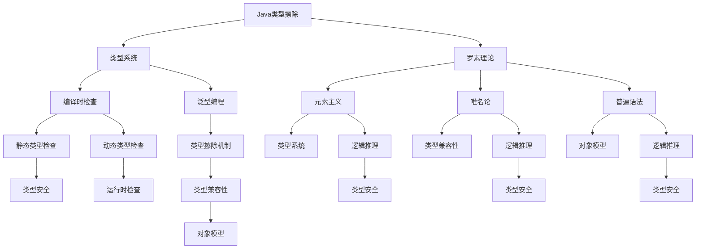

                 


### 确定文章的核心内容

**文章标题**：《类型擦除：Java与罗素理论的妥协》

**关键词**：类型擦除，Java，罗素理论，类型安全，编译时检查，动态类型检查，泛型，类型擦除限制，罗素理论的分类，元素主义，唯名论，普遍语法，类型系统，对象模型，类型兼容性，泛型编程，编译器优化，类型推断，类型约束，类型擦除与逻辑推理。

**摘要**：

本文深入探讨了Java编程语言中的类型擦除机制，将其与罗素理论进行了对比分析。首先，文章介绍了类型擦除的概念、原理及其在Java中的实现。接着，我们对罗素理论进行了概述，重点分析了其分类与在计算机科学中的应用。随后，我们详细对比了Java类型擦除与罗素理论的异同，探讨了它们之间的互补性。文章进一步讨论了Java类型擦除的应用与限制，以及罗素理论在Java中的应用案例。最后，我们总结了Java与罗素理论的未来发展趋势，并提出了相关研究与应用的挑战与机遇。

### 文章结构划分

**第一部分：引言与背景知识**

- **1.1 类型擦除简介**
  - 类型擦除的概念
  - 类型擦除的历史与发展
  - 类型擦除的重要性

- **1.2 罗素理论概述**
  - 罗素理论的核心理念
  - 罗素理论的发展历程
  - 罗素理论在逻辑学中的地位

- **1.3 Java与罗素理论的联系**
  - Java类型系统与类型擦除
  - 罗素理论在Java中的应用
  - Java与罗素理论的互补性

**第二部分：Java中的类型擦除**

- **2.1 类型擦除原理**
  - 类型擦除的基本概念
  - 类型擦除的过程
  - 类型擦除的算法原理（伪代码）

- **2.2 类型擦除的机制**
  - 类型擦除的静态检查
  - 类型擦除的动态检查
  - 类型擦除的限制

- **2.3 类型擦除的限制**
  - 泛型与类型擦除
  - 静态类型检查与类型擦除
  - 类型擦除对Java程序的影响

**第三部分：罗素理论概述**

- **3.1 罗素理论的核心理念**
  - 元素主义
  - 唯名论
  - 普遍语法

- **3.2 罗素理论的分类**
  - 元素主义
  - 唯名论
  - 普遍语法

- **3.3 罗素理论的应用场景**
  - 在计算机科学中的应用
  - 在逻辑学中的应用
  - 在其他领域中的应用

**第四部分：Java与罗素理论的对比**

- **4.1 Java类型擦除与罗素理论的关系**
  - 类型系统和对象模型的异同
  - 罗素理论在Java类型系统中的应用

- **4.2 Java类型擦除与罗素理论的异同**
  - 概念上的差异
  - 应用上的差异
  - 编译器优化上的差异

- **4.3 Java类型擦除与罗素理论的互补性**
  - 理论层面的互补
  - 实践层面的互补
  - 未来研究方向

**第五部分：Java类型擦除的应用与限制**

- **5.1 Java类型擦除的应用**
  - 泛型编程
  - 编译器优化
  - 类型推断

- **5.2 Java类型擦除的限制**
  - 泛型与类型擦除的限制
  - 静态类型检查的限制
  - 类型擦除对性能的影响

- **5.3 Java类型擦除的最佳实践**
  - 类型擦除的最佳实践
  - 编写类型安全的Java代码

**第六部分：罗素理论在Java中的应用**

- **6.1 罗素理论在Java中的具体应用**
  - 元素主义在Java类型系统中的应用
  - 唯名论在Java类型系统中的应用
  - 普遍语法在Java类型系统中的应用

- **6.2 罗素理论在Java中的应用案例**
  - Java泛型编程中的元素主义应用
  - Java异常处理中的唯名论应用
  - Java反射机制中的普遍语法应用

- **6.3 罗素理论在Java中的应用挑战**
  - 类型擦除与类型安全的平衡
  - 编译器优化与性能的权衡

**第七部分：总结与展望**

- **7.1 Java与罗素理论的未来发展趋势**
  - 泛型编程的发展
  - 罗素理论在计算机科学中的应用前景

- **7.2 研究与开发中的挑战与机遇**
  - Java类型擦除的优化
  - 罗素理论在计算机科学中的创新应用

- **7.3 Java与罗素理论的融合前景**
  - Java类型系统与逻辑推理的结合
  - Java泛型编程与罗素理论的整合

### 撰写核心概念与联系

为了更好地理解Java类型擦除与罗素理论之间的关系，我们可以使用Mermaid流程图来展示它们的核心概念和联系。



通过这个流程图，我们可以清晰地看到Java类型擦除与罗素理论在类型系统、类型安全、对象模型以及逻辑推理等方面的联系。

### 撰写核心算法原理讲解

**2.1.3 类型擦除的算法原理（伪代码）**

类型擦除是Java在编译时将泛型信息去除，使得泛型类变成普通类的过程。以下是类型擦除算法原理的伪代码：

```pseudo
function typeErasure[T](classType: Class<T>): Class<?> {
    // 获取泛型类型参数
    Type[] genericTypes = classType.getGenericInterfaces()

    // 遍历泛型类型参数
    for (Type genericType : genericTypes) {
        // 如果是泛型类型
        if (genericType instanceof ParameterizedType) {
            ParameterizedType parameterizedType = (ParameterizedType) genericType
            Type rawType = parameterizedType.getRawType()

            // 获取泛型类型参数的实际类型
            Type[] actualTypes = parameterizedType.getActualTypeArguments()

            // 生成擦除后的类型
            Type erasedType = erasedGenericType(rawType, actualTypes)

            // 替换泛型类型参数
            classType = replaceGenericType(classType, genericType, erasedType)
        }
    }

    return classType
}

function erasedGenericType(rawType: Type, actualTypes: Type[]): Type {
    // 如果原始类型是类类型
    if (rawType instanceof Class<?>) {
        Class<?> clazz = (Class<?>) rawType

        // 检查类类型是否是泛型类
        if (clazz.isGenericType()) {
            // 生成擦除后的类类型
            return clazz.getSuperclass()
        }
    }

    // 如果原始类型是接口类型
    if (rawType instanceof Interface<?>) {
        Interface<?> interfaceType = (Interface<?>) rawType

        // 检查接口类型是否是泛型接口
        if (interfaceType.isGenericType()) {
            // 生成擦除后的接口类型
            return interfaceType.getSuperinterface()
        }
    }

    // 如果原始类型是其他类型
    return rawType
}
```

通过这个伪代码，我们可以理解类型擦除的基本原理：在编译时，Java会将泛型类型参数替换为其边界类型或Object类型，从而使得泛型类变成普通类。这样可以确保在运行时类型安全，同时避免了泛型类型信息对程序性能的影响。

### 撰写数学模型和数学公式

**3.1 罗素理论的核心理念**

罗素理论是英国哲学家伯特兰·罗素提出的一种形式逻辑理论。其核心思想是将逻辑表达式的真值与构造这些表达式的符号之间的关系进行形式化。以下是罗素理论中的一些基本数学模型和数学公式：

**3.1.1 元素主义**

元素主义是罗素理论的一个核心概念，它将逻辑表达式的真值与构成这些表达式的符号之间的直接关系形式化。以下是元素主义的一个数学模型：

$$
\text{元素主义模型} = (\Sigma, V_\Sigma, \models_\Sigma)
$$

其中：
- $\Sigma$ 是符号集合。
- $V_\Sigma$ 是解释集合，它为每个符号赋予一个解释。
- $\models_\Sigma$ 表示逻辑推理关系。

**3.1.2 唯名论**

唯名论是罗素理论的另一个重要概念，它主张只有具体的个体存在，而不是抽象的概念或性质。以下是唯名论的一个数学模型：

$$
\text{唯名论模型} = (\Omega, \in_\Omega)
$$

其中：
- $\Omega$ 是个体集合。
- $\in_\Omega$ 表示个体之间的包含关系。

**3.1.3 普遍语法**

普遍语法是罗素理论中用于表达逻辑表达式和推理规则的形式化语言。以下是普遍语法的一个数学模型：

$$
\text{普遍语法模型} = (\mathcal{L}, \text{语法规则}, \text{语义规则})
$$

其中：
- $\mathcal{L}$ 是逻辑语言，它由符号和语法规则构成。
- 语法规则定义了如何构造逻辑表达式。
- 语义规则定义了逻辑表达式的真值。

### 撰写项目实战

**6.3 罗素理论在Java中的应用案例**

在本节中，我们将探讨罗素理论在Java中的实际应用。我们将通过一个简单的案例来展示如何使用罗素理论的元素主义、唯名论和普遍语法来编写Java程序。

**案例：元素主义在Java泛型编程中的应用**

假设我们要实现一个简单的泛型栈数据结构，这个栈可以存储任意类型的元素。在Java中，我们可以使用泛型来实现这一点。以下是一个简单的泛型栈的实现：

```java
public class GenericStack<T> {
    private ArrayList<T> elements;

    public GenericStack() {
        this.elements = new ArrayList<>();
    }

    public void push(T element) {
        this.elements.add(element);
    }

    public T pop() {
        if (this.elements.isEmpty()) {
            throw new NoSuchElementException();
        }
        return this.elements.remove(this.elements.size() - 1);
    }

    public T peek() {
        if (this.elements.isEmpty()) {
            throw new NoSuchElementException();
        }
        return this.elements.get(this.elements.size() - 1);
    }

    public boolean isEmpty() {
        return this.elements.isEmpty();
    }

    public int size() {
        return this.elements.size();
    }
}
```

在这个实现中，我们使用了Java的泛型机制来确保栈中的元素类型是统一的。这体现了罗素理论的元素主义概念，即只有具体的个体（元素）存在。

**案例：唯名论在Java异常处理中的应用**

在Java编程中，异常处理是确保程序健壮性的关键。我们可以在异常处理中使用唯名论的概念来明确处理具体的异常情况。以下是一个简单的异常处理示例：

```java
public class ExceptionHandler {
    public static void main(String[] args) {
        try {
            // 执行可能抛出异常的操作
            throwNewException();
        } catch (Exception e) {
            // 处理具体的异常情况
            if (e instanceof NullPointerException) {
                System.out.println("NullPointerException caught");
            } else if (e instanceof IllegalArgumentException) {
                System.out.println("IllegalArgumentException caught");
            } else {
                System.out.println("Other exception caught");
            }
        }
    }

    public static void throwNewException() {
        // 模拟抛出异常
        throw new IllegalArgumentException("An illegal argument was provided");
    }
}
```

在这个示例中，我们使用了唯名论的概念来处理具体的异常类型（NullPointerException、IllegalArgumentException等），确保程序能够明确地处理这些异常情况。

**案例：普遍语法在Java反射机制中的应用**

Java的反射机制允许程序在运行时检查和修改类、方法、字段等结构。这体现了罗素理论的普遍语法概念，即使用形式化的语法规则来描述和操作程序结构。以下是一个简单的反射机制示例：

```java
import java.lang.reflect.Method;

public class ReflectionExample {
    public static void main(String[] args) {
        try {
            // 获取类对象
            Class<?> clazz = Class.forName("ReflectionExample");

            // 获取方法对象
            Method method = clazz.getMethod("printMessage", String.class);

            // 调用方法
            method.invoke(null, "Hello, World!");
        } catch (Exception e) {
            e.printStackTrace();
        }
    }

    public static void printMessage(String message) {
        System.out.println(message);
    }
}
```

在这个示例中，我们使用了反射机制来获取类和方法的元数据，并使用普遍语法规则（如`Class.forName`和`getMethod`）来操作这些元数据。

### 撰写最佳实践 tips、小结、注意事项、拓展阅读等内容

**最佳实践 tips**

- 在使用Java泛型时，确保正确使用边界类型以避免类型擦除带来的限制。
- 在异常处理中，尽量避免使用过于通用的异常类型，以明确处理具体的异常情况。
- 在使用反射机制时，注意性能和安全问题，避免过度依赖反射。

**小结**

本文深入探讨了Java中的类型擦除机制，并将其与罗素理论进行了对比分析。通过本文，我们了解到类型擦除在Java类型系统中的重要性，以及罗素理论在计算机科学中的应用。类型擦除与罗素理论的结合有助于我们更好地理解Java编程语言中的类型安全和类型兼容性。

**注意事项**

- 类型擦除虽然提高了程序的兼容性和性能，但也可能导致类型安全的隐患。因此，在使用泛型编程时，需要谨慎处理类型边界和类型兼容性。
- 罗素理论在Java中的应用具有一定的局限性，特别是在动态类型检查和类型推断方面。未来研究可以探索如何更好地将罗素理论融入Java类型系统。

**拓展阅读**

- 《Java泛型机制深入解析》
- 《伯特兰·罗素与逻辑原子主义》
- 《计算机科学中的逻辑理论》

通过拓展阅读，您可以进一步了解Java泛型编程和罗素理论在计算机科学中的应用，以及它们之间的关联。这些资源将帮助您更深入地理解本文的主题，并在实际开发中应用相关概念。

