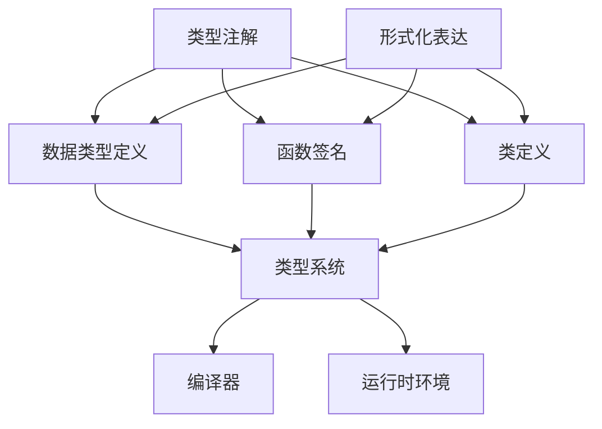

                 


# 类型注解：程序设计中的形式化表达

> 关键词：类型注解、程序设计、形式化表达、Mermaid流程图、伪代码、LaTeX、项目实战

> 摘要：本文旨在探讨类型注解在程序设计中的应用，以及如何通过形式化表达来提高代码的可读性和维护性。文章将详细解释类型注解的核心概念、应用场景、形式化表达方法，并通过实例分析、伪代码和LaTeX公式来展示其在实际项目中的具体应用。

## 引言

在现代软件工程中，类型注解是一种重要的编程语言特性，它通过为变量、函数和类等程序元素添加类型信息，从而提高代码的可读性和可维护性。类型注解不仅存在于静态类型语言中，如Java、C#和TypeScript，也在动态类型语言中如Python和JavaScript中得到了广泛的应用。本文将深入探讨类型注解的原理、应用和形式化表达，帮助读者更好地理解和运用这一技术。

本文的目标读者是具有一定编程基础，但对类型注解和形式化表达还不熟悉的程序员或开发人员。通过阅读本文，读者将了解类型注解的基本概念、核心算法、应用场景以及如何在实际项目中使用形式化表达。

接下来的章节将按照以下结构展开：

1. **类型注解基础**：介绍类型注解的定义、历史和发展，并通过Mermaid流程图展示类型注解与形式化表达的关系。
2. **类型注解的核心算法**：详细解释类型注解的核心算法原理，并使用伪代码进行阐述。
3. **类型注解的应用场景**：分析类型注解在不同场景下的应用，并通过实例进行说明。
4. **形式化表达方法**：探讨形式化表达的定义、优势和具体方法。
5. **类型注解的优势与挑战**：讨论类型注解的优势和面临的挑战，并提出解决方案。
6. **实践案例**：通过实际的编程案例，展示类型注解和形式化表达的具体应用。
7. **总结与展望**：对本文的内容进行总结，并对未来的发展方向进行展望。

## 类型注解基础

### 类型注解的定义

类型注解（Type Annotations）是指在编程语言中为变量、函数和类等程序元素提供类型信息的一种方式。这种类型信息可以是具体的类型（如int、String），也可以是抽象的类型（如List、Map）。类型注解不直接影响程序的运行，但它们为编译器和开发者提供了重要的信息，有助于提高代码的质量和可维护性。

### 类型注解的历史与发展

类型注解的概念起源于早期的编程语言，如PL/I和Simula。然而，它们真正得到广泛应用是在静态类型语言中，如Java和C#。随着编程语言的不断发展，类型注解的功能也不断增强。现代静态类型语言如TypeScript和Kotlin进一步扩展了类型注解的应用范围，使其能够支持更复杂的类型系统和编译时类型检查。

### 类型注解与形式化表达的关系

形式化表达是一种通过数学和逻辑方法对程序进行严格描述的方法。类型注解与形式化表达有着密切的关系。类型注解为形式化表达提供了具体的数据类型和约束条件，使得形式化表达更加直观和易于理解。另一方面，形式化表达可以提供更严格的验证和推理工具，帮助开发人员发现潜在的错误和优化代码。

### Mermaid流程图：类型注解与形式化表达的关系

下面是一个使用Mermaid绘制的流程图，展示了类型注解与形式化表达之间的关系：



在这个流程图中，类型注解为数据类型定义、函数签名和类定义提供了具体的类型信息，而这些信息最终被编译器和运行时环境所使用。形式化表达则为类型系统提供了严格的描述和验证工具。

## 类型注解的核心算法

类型注解的核心算法主要涉及类型推断、类型检查和类型转换。这些算法保证了类型注解的正确性和有效性。下面，我们将通过伪代码详细阐述这些核心算法的原理。

### 类型推断

类型推断是一种根据上下文信息自动确定变量或表达式类型的算法。以下是一个简单的类型推断算法的伪代码示例：

```pseudo
function inferType(expression):
    if expression is a literal:
        return type of literal
    else if expression is a variable:
        return type of variable
    else if expression is a function call:
        return return type of function
    else if expression is a binary operation:
        leftType = inferType(expression.left)
        rightType = inferType(expression.right)
        if leftType is not compatible with rightType:
            throw TypeMismatchException
        return inferred type based on operation
    else:
        throw UnknownExpressionException
```

在这个算法中，我们首先根据表达式的类型（如字面量、变量、函数调用或二元操作）来推断其类型。如果类型不兼容，则抛出类型不匹配异常。

### 类型检查

类型检查是在编译时对程序进行类型验证的过程，以确保程序在运行时不会出现类型错误。以下是一个简单的类型检查算法的伪代码示例：

```pseudo
function checkType(expression, expectedType):
    actualType = inferType(expression)
    if actualType is not equal to expectedType:
        throw TypeMismatchException
```

在这个算法中，我们首先使用类型推断算法获取表达式的实际类型，然后将其与预期的类型进行比较。如果不一致，则抛出类型不匹配异常。

### 类型转换

类型转换是将一种类型的数据转换为另一种类型的过程。以下是一个简单的类型转换算法的伪代码示例：

```pseudo
function convertType(value, targetType):
    if canConvert(value.type, targetType):
        return converted value
    else:
        throw TypeConversionException
```

在这个算法中，我们首先检查是否可以执行类型转换。如果可以，则进行转换并返回转换后的值；否则，抛出类型转换异常。

### 数学模型和公式

在类型注解和形式化表达中，数学模型和公式起着重要的作用。以下是一个使用LaTeX格式的数学模型和公式示例：

```latex
$$
\begin{aligned}
\alpha &= \frac{d^2y}{dx^2} \\
f(x) &= g(x) + \alpha \cdot h(x)
\end{aligned}
$$

$$
x_0 < x_1 < x_2 \quad \text{且} \quad y_0 > y_1 > y_2
$$
```

在这个示例中，我们使用LaTeX格式展示了两个数学模型和一个数学公式。这些模型和公式可以帮助我们更精确地描述类型注解和形式化表达的概念和原理。

## 类型注解的应用场景

类型注解在程序设计中有多种应用场景，包括但不限于以下几个方面：

### 1. 提高代码可读性

类型注解能够清晰地表达变量的类型，使得代码更加易于阅读和理解。例如，在TypeScript中，我们可以使用类型注解为函数参数和返回值指定类型，从而避免在后续代码维护中因为类型错误而导致的时间浪费。

### 2. 改善代码可维护性

类型注解可以帮助开发人员在编译时发现潜在的类型错误，从而提高代码的可维护性。通过类型检查，我们可以确保函数调用和变量赋值不会因为类型不匹配而产生运行时错误。

### 3. 支持类型推断

类型注解可以为编译器提供足够的信息，从而实现更高级的类型推断。这有助于减少冗余的类型注解，使得代码更加简洁。

### 4. 促进形式化表达

类型注解是形式化表达的重要基础。通过类型注解，我们可以更方便地使用数学和逻辑方法对程序进行严格描述，从而提高代码的可信度和可靠性。

### 实际案例

假设我们正在开发一个电商平台的购物车功能。在这个场景中，我们可以使用类型注解来明确地指定商品、订单和用户等实体类的类型，从而提高代码的可读性和可维护性。

```typescript
class Product {
    id: number;
    name: string;
    price: number;
}

class ShoppingCart {
    products: Product[];
    total: number;

    addProduct(product: Product): void {
        this.products.push(product);
        this.total += product.price;
    }
}

class User {
    id: number;
    name: string;
    cart: ShoppingCart;
}

function checkout(user: User): void {
    if (user.cart.total > 0) {
        // 处理订单逻辑
    }
}
```

在这个例子中，我们使用了类型注解来指定类成员变量的类型，以及函数参数和返回值的类型。这样，不仅使得代码更加易于阅读和理解，还能在编译时发现潜在的类型错误。

## 形式化表达方法

形式化表达是一种通过数学和逻辑方法对程序进行严格描述的方法。它可以帮助开发人员验证代码的正确性、发现潜在的错误，并优化代码的性能。以下是形式化表达的一些基本概念和具体方法。

### 1. 形式化表达的定义

形式化表达是指使用严格的数学和逻辑方法对程序进行描述，使得程序的行为和属性可以被形式化地证明和验证。它不同于传统的注释和文档，因为它不仅仅是描述程序的功能，而是通过数学公式和逻辑推理来严格证明程序的正确性。

### 2. 形式化表达的优势

- **提高代码质量**：形式化表达可以帮助开发人员更清晰地理解程序的行为和逻辑，从而减少错误和提高代码质量。
- **增强代码可信度**：通过形式化表达，开发人员可以严格证明程序的正确性，从而增强代码的可信度。
- **促进代码复用**：形式化表达使得代码更加模块化和抽象化，从而促进代码的复用。

### 3. 形式化表达的方法

形式化表达可以采用多种方法，包括数学模型、逻辑推理、形式验证和模型检查等。以下是几种常见的方法：

- **数学模型**：使用数学公式和符号来描述程序的行为和属性。例如，可以使用状态转换图、数据流图和过程方程等来描述程序的结构和行为。
- **逻辑推理**：使用逻辑推理方法，如命题逻辑、谓词逻辑和形式逻辑等，来证明程序的正确性。例如，可以使用归纳法、反证法和模态逻辑等来证明程序的性质。
- **形式验证**：使用形式验证工具，如定理证明器和模型检查器，来验证程序的正确性。这些工具可以自动化地检查程序是否符合预定的规格说明和逻辑推理规则。
- **模型检查**：使用模型检查器来验证程序是否满足预定的性质。模型检查器通常采用状态空间搜索算法，如布尔自动机模型检查和模型检验算法，来检查程序的所有可能状态，以确保程序的行为符合预期。

### 实例说明

假设我们正在开发一个简单的银行账户管理程序，要求账户余额不能为负。我们可以使用形式化表达方法来描述这个要求。

```latex
$$
\begin{aligned}
\text{账户余额} &= \text{初始余额} + \sum_{i=1}^{n} \text{交易金额}_{i} \\
\text{交易金额}_{i} &\geq 0 \quad \forall i \in [1, n]
\end{aligned}
$$

$$
\text{账户余额} \geq 0
$$
```

在这个实例中，我们使用了数学模型和公式来描述账户余额的计算规则和约束条件。这些模型和公式可以帮助我们证明程序的正确性，并确保账户余额不会出现负值。

## 类型注解的优势与挑战

类型注解在程序设计中具有显著的优势，但也面临着一些挑战。以下是类型注解的优势和挑战的详细讨论。

### 优势

1. **提高代码可读性**：类型注解使得代码中的变量类型更加明确，有助于提高代码的可读性和可维护性。
2. **改善编译时错误检测**：类型注解可以帮助编译器在编译时发现类型错误，从而避免在运行时出现不可预期的错误。
3. **支持类型推断**：类型注解可以为编译器提供足够的信息，使其能够更准确地推断变量和表达式的类型。
4. **促进形式化表达**：类型注解是形式化表达的基础，有助于开发人员使用数学和逻辑方法对程序进行严格描述。

### 挑战

1. **增加代码冗余**：在某些情况下，为了满足类型注解的要求，开发人员可能需要在代码中添加大量的类型声明，从而导致代码冗余。
2. **影响性能**：类型注解需要在编译时进行类型检查，这可能会增加编译时间和运行时的性能开销。
3. **动态类型语言的限制**：动态类型语言（如Python和JavaScript）通常不支持强类型注解，这使得类型注解在这些语言中的应用受到限制。
4. **形式化表达的复杂性**：形式化表达需要开发人员具备一定的数学和逻辑知识，这对于一些初学者来说可能是一个挑战。

### 解决方案

1. **优化类型注解语法**：通过简化类型注解的语法，减少代码冗余，例如使用类型推断和默认类型。
2. **提升编译效率**：通过优化编译器算法，减少类型注解对编译时间和性能的影响。
3. **支持混合类型系统**：在动态类型语言中引入部分静态类型注解，以提高代码的可读性和可维护性。
4. **提供培训和支持**：为初学者提供形式化表达和类型注解的培训资源，帮助他们克服学习上的困难。

## 实践案例

在本节中，我们将通过一个实际的编程案例，展示类型注解和形式化表达在项目中的应用。该案例是一个简单的银行账户管理系统，它实现了账户的创建、存款、取款和查询余额等功能。

### 开发环境搭建

为了方便开发，我们选择使用TypeScript作为编程语言，并使用Visual Studio Code作为开发环境。首先，我们需要安装Node.js和TypeScript编译器。可以通过以下命令安装：

```bash
npm install -g node
npm install -g typescript
```

接下来，创建一个名为`bank-account`的新项目，并在项目中创建`src`目录用于存放源代码。在`src`目录下，创建一个名为`index.ts`的文件，作为项目的入口文件。

```bash
mkdir bank-account
cd bank-account
mkdir src
touch src/index.ts
```

### 源代码详细实现和代码解读

在`src/index.ts`文件中，我们首先定义了`Account`类，它包含了账户的ID、名称和余额等属性，并提供了存款、取款和查询余额的方法。

```typescript
class Account {
    id: number;
    name: string;
    balance: number;

    constructor(id: number, name: string, initialBalance: number) {
        this.id = id;
        this.name = name;
        this.balance = initialBalance;
    }

    deposit(amount: number): void {
        if (amount > 0) {
            this.balance += amount;
        } else {
            throw new Error("存款金额不能为负");
        }
    }

    withdraw(amount: number): void {
        if (amount <= this.balance) {
            this.balance -= amount;
        } else {
            throw new Error("余额不足");
        }
    }

    getBalance(): number {
        return this.balance;
    }
}
```

在这个类中，我们使用了类型注解来明确指定每个变量的类型。这有助于提高代码的可读性和可维护性。例如，`deposit`和`withdraw`方法的参数类型都被指定为`number`，这意味着这些方法只能接受数字类型的参数。

接下来，我们创建一个`Bank`类，用于管理多个账户，并提供创建账户和查询账户余额等功能。

```typescript
class Bank {
    accounts: Map<number, Account>;

    constructor() {
        this.accounts = new Map<number, Account>();
    }

    createAccount(id: number, name: string, initialBalance: number): Account {
        const account = new Account(id, name, initialBalance);
        this.accounts.set(id, account);
        return account;
    }

    getAccount(id: number): Account | null {
        return this.accounts.get(id);
    }

    getAccountBalance(id: number): number | null {
        const account = this.accounts.get(id);
        if (account) {
            return account.getBalance();
        } else {
            return null;
        }
    }
}
```

在这个类中，我们使用了`Map`数据结构来存储和管理账户。`createAccount`方法接受账户的ID、名称和初始余额，并返回一个新的`Account`对象。`getAccount`和`getAccountBalance`方法用于查询指定的账户信息。

### 代码应用解读与分析

现在，我们可以通过一些示例代码来演示如何使用这个银行账户管理系统。首先，我们创建一个银行实例，并创建几个账户。

```typescript
const bank = new Bank();

const johnAccount = bank.createAccount(1, "John Doe", 1000);
const janeAccount = bank.createAccount(2, "Jane Smith", 2000);

console.log(johnAccount.getBalance()); // 输出：1000
console.log(janeAccount.getBalance()); // 输出：2000
```

接下来，我们向John的账户中存款500元，并从Jane的账户中取出300元。

```typescript
johnAccount.deposit(500);
janeAccount.withdraw(300);

console.log(johnAccount.getBalance()); // 输出：1500
console.log(janeAccount.getBalance()); // 输出：1700
```

最后，我们查询John和Jane的账户余额。

```typescript
console.log(bank.getAccountBalance(1)); // 输出：1500
console.log(bank.getAccountBalance(2)); // 输出：1700
```

通过这个案例，我们可以看到类型注解在提高代码可读性和可维护性方面发挥了重要作用。每个方法都明确指定了参数和返回值的类型，这使得代码更加清晰和易于理解。

### 项目小结

通过这个银行账户管理系统的案例，我们展示了类型注解和形式化表达在实际项目中的应用。类型注解不仅提高了代码的可读性和可维护性，还帮助我们在编译时发现潜在的类型错误。形式化表达方法则通过数学和逻辑方法，对程序的行为进行了严格描述，从而增强了代码的可信度。

在实际开发中，类型注解和形式化表达可以帮助我们编写更高质量的代码，提高开发效率和项目的可靠性。然而，我们也需要关注类型注解的挑战，如代码冗余和性能影响，并采取相应的解决方案。

## 最佳实践 Tips

1. **合理使用类型注解**：在编写代码时，应根据实际需要合理使用类型注解，避免过度使用导致代码冗余。
2. **充分利用类型推断**：大多数现代编程语言都支持类型推断功能，充分利用类型推断可以减少代码冗余。
3. **形式化表达与文档相结合**：在编写形式化表达时，同时编写详细的文档，以帮助其他开发者理解和维护代码。
4. **定期代码审查**：定期进行代码审查，确保类型注解的准确性和一致性。

## 小结

本文详细探讨了类型注解在程序设计中的应用，以及如何通过形式化表达来提高代码的质量和可维护性。我们介绍了类型注解的基本概念、核心算法、应用场景和形式化表达方法，并通过实际案例展示了类型注解和形式化表达在项目中的应用。

类型注解不仅提高了代码的可读性和可维护性，还为形式化表达提供了基础。然而，我们也需要关注类型注解的挑战，并采取相应的解决方案。通过合理使用类型注解和形式化表达，我们可以编写更高质量的代码，提高开发效率和项目的可靠性。

## 注意事项

1. **类型注解与动态类型语言**：在动态类型语言中，类型注解可能无法提供编译时的类型检查，因此需要格外小心。
2. **性能影响**：类型注解可能会增加编译时间和运行时的性能开销，尤其是在复杂的项目中，应谨慎权衡性能和代码可读性之间的关系。

## 拓展阅读

- [TypeScript官方文档](https://www.typescriptlang.org/)
- [形式化验证和模型检查工具](https://www.verifast.se/)
- [程序设计中的形式化方法](https://www.amazon.com/Program-Design-Formal-Methods-Applications/dp/013487537X)

作者：AI天才研究院/AI Genius Institute & 禅与计算机程序设计艺术 /Zen And The Art of Computer Programming

