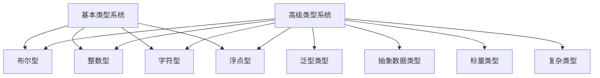

                 

### 类型理论的基本概念

#### 1.1 类型理论概述

类型理论（Type Theory）是计算机科学中的一个核心概念，它为程序语言提供了形式化的语义描述。类型理论最早由Pierce在1982年提出，其目的是为了提供一种更为严格和形式化的方法来描述程序语言的语义。类型理论的核心思想是，通过给程序的不同部分赋予类型，确保程序在执行过程中不会出现未定义的行为。

类型理论的发展历程可追溯到函数式编程语言，例如Lisp和ML。这些语言引入了类型系统来提高程序的安全性和可维护性。随着时间的推移，类型理论逐渐成为现代编程语言设计的重要组成部分，如Haskell、OCaml和Scala等。

类型理论在编译器中的应用具有重要意义。它不仅可以帮助编译器在编译过程中捕捉潜在的错误，还可以为程序的优化提供指导。例如，通过静态类型检查，编译器可以提前发现类型不匹配的错误，从而避免运行时错误。此外，类型信息还可以用于优化程序，提高其执行效率。

#### 1.2 基本类型系统

类型系统可以分为基本类型系统和高级类型系统。基本类型系统提供了最基本的类型定义和转换机制，而高级类型系统则在此基础上引入了更复杂的概念，如泛型和抽象数据类型。

**基本类型定义**：基本类型系统通常包括布尔型（boolean）、整数型（integer）、字符型（character）和浮点型（float）等。

**基本类型转换**：基本类型之间可以进行隐式或显式的转换。隐式转换通常遵循数值类型之间的自然排序关系，例如整数可以隐式转换为浮点数。显式转换则通过类型转换运算符（如C语言中的`int(float(x))`）进行。

**基本类型系统的优点**：基本类型系统简单直观，易于理解和使用。它有助于确保程序在编译时不会出现类型错误，从而提高程序的正确性和可维护性。

#### 1.3 高级类型系统

高级类型系统在基本类型系统的基础上，引入了更复杂和灵活的类型概念。

**泛型类型**：泛型类型（Generic Types）允许在类型定义时使用类型参数，使得一个类型定义可以适用于多个不同的具体类型。例如，在Java中，`List`接口是一个泛型类型，可以用来表示整数列表、字符串列表等。

**抽象数据类型**：抽象数据类型（Abstract Data Types，ADT）是一组值的集合和一组对值进行操作的操作的集合。抽象数据类型通过接口或抽象类来定义，隐藏了具体的实现细节。

**标量类型与复杂类型**：标量类型（Scalar Types）是指基本的数据类型，如整数和浮点数。复杂类型（Complex Types）则是以标量类型为基础构建的，如数组、结构体和类。

高级类型系统提供了更高的抽象能力和更强的类型安全，有助于编写更清晰、更可维护的代码。以下是一个简单的Mermaid流程图，展示了基本类型系统和高级类型系统之间的关系：



通过这个流程图，我们可以清晰地看到基本类型系统和高级类型系统之间的层次关系和相互联系。在后续章节中，我们将深入探讨这些概念及其在编译器正确性证明中的应用。

### 编译器正确性证明的基本概念

#### 5.1 编译器正确性证明的定义

编译器正确性证明（Compiler Correctness Proof）是一种形式化的方法，用于验证编译器从源程序到目标程序的转换过程是否保持了程序语义的正确性。具体来说，编译器正确性证明的目标是证明以下三点：

1. **语法正确性**：源程序符合编程语言定义的语法规则，可以成功编译。
2. **语义正确性**：编译器生成的中间代码（或目标代码）与源程序具有相同的语义，即执行结果相同。
3. **优化正确性**：如果编译器执行了程序优化，优化后的代码仍然保持源程序的语义正确性。

编译器正确性证明的重要性不言而喻。首先，它确保了编译器生成的代码是可靠的，从而提高了程序的正确性和稳定性。其次，它为编译器的优化提供了理论依据，帮助开发者设计出更高效的编译器。最后，编译器正确性证明是形式化方法在计算机科学中的重要应用，推动了形式化验证技术的发展。

#### 5.2 编译器正确性证明的分类

编译器正确性证明可以分为静态正确性证明和动态正确性证明。

**静态正确性证明**：静态正确性证明在编译过程中的静态分析阶段进行，无需运行程序。它的主要任务是检查源程序在语法和语义上是否正确，确保编译器可以正确处理源程序并生成正确的中间代码。

**动态正确性证明**：动态正确性证明通过运行程序来验证编译器的正确性。它的主要任务是检查编译器生成的中间代码或目标代码在执行过程中是否保持了源程序的语义。动态正确性证明通常使用测试用例（Test Cases）来验证编译器的正确性。

**静态与动态正确性证明的融合**：在实际应用中，静态和动态正确性证明往往需要结合使用。静态证明可以快速发现大部分潜在的错误，而动态证明则可以验证编译器在实际运行环境中的表现。通过将两种证明方法结合起来，可以更全面地确保编译器的正确性。

#### 5.3 编译器正确性证明的挑战

编译器正确性证明面临着多个挑战：

1. **验证的复杂性**：编译器通常是一个复杂的系统，其正确性证明需要考虑大量的路径和状态，这使得验证过程非常复杂。
2. **验证的时间和空间成本**：验证编译器的正确性需要大量的时间和空间资源。尤其是在动态验证过程中，需要运行大量的测试用例，这会显著增加验证的成本。
3. **验证的自动化**：编译器正确性证明通常需要手动进行，这使得验证过程繁琐且容易出错。实现自动化的验证工具是未来的一个重要研究方向。

为了解决这些挑战，研究者们提出了多种方法，如形式化验证、模型检查和验证逻辑等。这些方法旨在提高验证的效率和可靠性，从而更好地确保编译器的正确性。

### 编译器正确性证明的框架与流程

#### 6.1 编译器正确性证明的框架

编译器正确性证明的框架通常包括以下三个层次：

1. **理论框架**：理论框架为编译器正确性证明提供了基础理论和工具。它包括形式语义、类型理论和逻辑推理等。形式语义用于描述程序和编译器的行为，类型理论用于确保程序的正确性，逻辑推理用于证明编译器转换的正确性。
2. **实践框架**：实践框架将理论框架应用于实际的编译器设计中。它包括编译器架构、验证工具和验证方法。编译器架构设计需要考虑正确性证明的需求，验证工具用于自动化验证过程，验证方法则用于指导验证工作。
3. **融合框架**：融合框架将静态和动态验证方法结合起来，以更全面地确保编译器的正确性。它包括静态验证和动态验证的集成，以及验证结果的验证和优化。

#### 6.2 编译器正确性证明的流程

编译器正确性证明的流程可以分为以下几个步骤：

1. **形式化描述**：首先，需要用形式化的语言描述源程序和编译器的行为。形式化描述有助于确保描述的准确性和一致性。
2. **证明目标定义**：根据编译器的设计目标，定义证明的目标。例如，证明编译器生成的中间代码与源程序具有相同的语义。
3. **验证方法选择**：选择合适的验证方法，如形式化验证、模型检查或验证逻辑。每种方法都有其优点和局限性，需要根据具体情况进行选择。
4. **验证过程执行**：根据选定的验证方法，执行验证过程。这可能包括手动验证和自动化验证，具体取决于验证方法的复杂性。
5. **结果分析**：分析验证结果，确定编译器的正确性。如果验证失败，需要分析失败的原因，并修复错误。
6. **优化和迭代**：根据验证结果对编译器进行优化和迭代，以提高其正确性和性能。这个过程可能需要多次进行，直到达到满意的验证结果。

#### 6.3 编译器正确性证明的挑战与对策

编译器正确性证明面临多个挑战，如验证的复杂性、时间和空间成本以及验证的自动化等。以下是针对这些挑战的对策：

1. **验证的复杂性**：通过使用形式化的方法和工具，如形式语义和类型理论，可以降低验证的复杂性。此外，模块化设计方法可以将复杂的编译器拆分为更小的模块，从而简化验证过程。
2. **时间和空间成本**：优化验证方法可以提高验证的效率和降低成本。例如，使用模型检查和验证逻辑等自动化验证工具可以显著减少验证时间和空间需求。此外，并行化验证方法可以进一步降低成本。
3. **验证的自动化**：开发自动化的验证工具是解决验证自动化问题的关键。这些工具可以使用形式化验证语言和自动化证明工具，如Coq和Isabelle，来实现自动化验证。

通过这些对策，编译器正确性证明的效率和可靠性可以得到显著提升，从而确保编译器的正确性和性能。

### 类型理论在编译器正确性证明中的应用

#### 8.1 类型理论在静态分析中的应用

类型理论在静态分析中的应用主要体现在类型检查和类型推导过程中。类型检查是编译器的第一步，它确保源程序中的每个表达式都有正确的类型，避免潜在的运行时错误。类型推导则是编译器自动推导出变量和表达式的类型，从而减少手工编写的类型声明。

**类型检查**：

类型检查的主要任务是验证源程序中的每个表达式是否符合类型系统的规定。具体来说，编译器会检查以下内容：

- **类型一致性**：检查每个表达式的类型是否与上下文中的预期类型一致。例如，如果表达式是一个赋值操作，其左右两边的类型必须匹配。
- **类型可推导性**：检查编译器是否能够推导出表达式的类型。如果无法推导出类型，编译器会报错并提示程序员添加类型声明。
- **类型安全性**：确保类型转换不会引入数据丢失或不可预测的行为。例如，将整数转换为浮点数时，需要确保不会丢失信息。

**类型推导**：

类型推导是编译器自动推导出变量和表达式的类型的过程。常见的类型推导方法包括静态推导和动态推导。

- **静态推导**：静态推导是基于源程序中的静态信息（如变量声明、类型定义等）来推导类型。这种方法的优点是简单高效，但可能无法处理所有类型的情况。
- **动态推导**：动态推导是基于程序运行时的动态信息（如变量赋值、函数调用等）来推导类型。这种方法可以处理更复杂的类型情况，但需要额外的运行时支持。

**类型理论在类型检查和类型推导中的作用**：

类型理论为编译器提供了一种形式化的方法来描述类型系统和类型推导规则。通过类型理论，编译器可以更严格和准确地检查源程序的类型正确性。具体来说，类型理论提供了以下作用：

- **形式化描述**：类型理论提供了形式化的类型系统描述，使编译器可以基于严格的理论基础进行类型检查和类型推导。
- **类型推断**：类型理论中的类型推断规则可以帮助编译器自动推导出变量的类型，减少程序员的工作量。
- **类型安全**：类型理论确保类型检查过程中不会出现类型不匹配的错误，从而提高程序的正确性和稳定性。

以下是一个简单的示例，说明类型理论在类型检查中的应用：

```python
def add(a: int, b: int) -> int:
    return a + b

result: int = add(5, 3)
```

在这个示例中，编译器会检查`add`函数的返回类型是否与声明的一致（`int`），以及函数参数的类型是否正确（`int`）。如果检查通过，编译器会推导出`result`变量的类型为`int`。

通过类型理论的严格分析和推导，编译器可以更准确地检查源程序的类型正确性，从而减少运行时错误的发生。

### 类型理论在动态分析中的应用

类型理论在动态分析中的应用主要体现在类型检查和类型推导过程中，尤其是在动态类型系统和静态类型系统的融合中。动态分析是在程序运行时进行的，它通过监控程序的执行过程，确保类型安全性和正确性。

#### 动态类型检查

动态类型检查是在程序运行时检查变量的类型，确保每个操作符的操作数具有正确的类型。这种方法在动态类型语言（如Python、Ruby和JavaScript）中非常常见。以下是一些动态类型检查的关键概念：

**类型检查时机**：

动态类型检查通常在操作执行时进行。例如，在Python中，`if`语句的`条件`部分会在运行时被检查。

```python
x = 5
if x > 0:
    print("x is positive")
else:
    print("x is non-positive")
```

在这个例子中，`x > 0`的条件会在运行时检查，确保`x`是一个可以比较的对象。

**类型转换**：

在动态类型检查中，类型转换（或称为类型强制）是常见的操作。编译器会在运行时将一个类型的值转换为另一个类型，例如将字符串转换为整数。

```python
x = "10"
y = int(x)
print(y + 3)  # 输出 13
```

在这个例子中，`int(x)`会将字符串`"10"`转换为整数，然后与3相加。

**动态类型检查的优点和缺点**：

**优点**：

- **灵活性**：动态类型检查提供了更高的灵活性，程序员可以在编译时不必指定类型，而是可以在运行时进行类型判断。
- **代码简洁**：在动态类型语言中，代码通常更简洁，因为不需要显式声明类型。

**缺点**：

- **运行时错误**：由于类型检查是在运行时进行的，类型错误可能会在程序运行时才被发现，这可能导致难以调试的问题。
- **性能开销**：动态类型检查通常需要额外的运行时开销，因为编译器需要在运行时检查类型。

#### 动态类型推导

动态类型推导是在程序运行时自动推导出变量的类型。这通常通过插装（instrumentation）或运行时类型信息（runtime type information）来实现。以下是一些动态类型推导的关键概念：

**类型推导机制**：

动态类型推导通常使用插装技术，在程序的每个操作前插入类型检查代码。例如，在Java中的` instanceof`操作符会在运行时检查对象的类型。

```java
if (obj instanceof String) {
    System.out.println("obj is a String");
}
```

在这个例子中，`obj instanceof String`会在运行时检查`obj`是否为字符串类型。

**类型推导的优点和缺点**：

**优点**：

- **自动类型推导**：动态类型推导可以自动推导出变量和表达式的类型，减轻程序员的负担。
- **更好的错误捕捉**：动态类型推导可以在运行时捕捉类型错误，从而更早地发现问题。

**缺点**：

- **运行时开销**：动态类型推导通常需要额外的运行时开销，因为需要在运行时进行类型检查。
- **性能影响**：动态类型推导可能会影响程序的性能，因为需要在每个操作前进行类型检查。

#### 类型理论在动态分析中的作用

类型理论在动态分析中的应用主要体现在以下几个方面：

1. **形式化描述**：类型理论提供了一种形式化的方法来描述动态类型系统和类型推导规则。这有助于确保动态类型检查和类型推导的准确性和一致性。
2. **类型安全**：类型理论确保动态类型检查过程中不会出现类型不匹配的错误，从而提高程序的正确性和稳定性。
3. **类型推断**：类型理论中的类型推断规则可以帮助编译器或解释器自动推导出变量的类型，减少程序员的工作量。

以下是一个简单的示例，说明类型理论在动态类型检查和类型推导中的应用：

```python
x = "hello"
y = len(x)
print(y)  # 输出 5
```

在这个示例中，`x`是一个字符串类型，`len(x)`会返回一个整数类型。类型理论确保了`len`函数在运行时会正确地处理字符串类型的参数，并返回整数类型的值。

通过类型理论的严格分析和推导，动态分析可以更准确地检查程序的类型正确性，从而减少运行时错误的发生。这对于动态类型语言尤为重要，因为它们在运行时需要更严格地确保类型安全。

### 类型理论在优化算法中的应用

类型理论在优化算法中的应用为编译器提供了强有力的工具，以改善程序的性能和效率。通过类型信息，编译器可以更精准地分析程序的行为，从而进行有效的优化。以下是一些关键应用：

#### 优化算法的基本概念

优化算法旨在提高程序的性能，包括减少执行时间、降低内存占用和提高可读性。常见的优化技术包括：

- **常量折叠**：在编译时计算表达式的常量部分，从而减少运行时的计算量。
- **循环优化**：通过展开循环或使用循环优化技术，减少循环执行的次数或提高循环的执行效率。
- **数据流分析**：分析变量在不同位置的使用情况，以识别可以优化或删除的代码。
- **代码生成**：生成高效的目标代码，利用目标硬件的特性，如指令并行执行或寄存器重命名。

#### 类型信息在优化中的作用

类型信息对于优化算法至关重要，因为它提供了以下重要信息：

- **类型约束**：通过类型信息，编译器可以确定变量和表达式的确切类型，从而在优化过程中应用更精确的规则。
- **别名分析**：类型信息有助于识别变量之间的别名关系，这可以影响内存分配和访问优化。
- **安全性保障**：类型信息确保优化过程中不会违反类型安全，从而避免潜在的运行时错误。

#### 实际应用示例

**示例一：常量折叠**

考虑以下代码：

```c
int x = 5;
int y = 3;
int z = x * y;
```

编译器可以利用类型信息进行常量折叠，将`z`的计算提前到编译时：

```c
int z = 5 * 3;
```

这样，程序在运行时可以直接使用常量结果，提高了执行效率。

**示例二：循环优化**

考虑以下代码：

```python
for i in range(10):
    print(i * 2)
```

编译器可以利用类型信息优化循环，将循环展开：

```python
print(0)
print(2)
print(4)
print(6)
print(8)
print(10)
print(12)
print(14)
print(16)
print(18)
```

这样，程序在编译时已经知道循环的每个迭代结果，从而避免了运行时的迭代计算。

**示例三：数据流分析**

考虑以下代码：

```java
int a = 10;
int b = 20;
int c = a + b;
a = a + 1;
int d = a * c;
```

编译器可以使用类型信息进行数据流分析，发现变量`a`在`d`的计算中不再使用原始值，因此可以删除相关代码：

```java
int b = 20;
int c = 10 + 20;
a = 10 + 1;
int d = (10 + 1) * (10 + 20);
```

通过这种方式，程序的可读性和性能都得到了提升。

#### 类型理论的优势

类型理论在优化算法中的应用具有以下优势：

- **精确性**：类型信息提供了精确的变量和表达式关系，使编译器能够进行更精细的优化。
- **可靠性**：类型检查确保优化过程中不会引入类型错误，提高了程序的正确性。
- **高效性**：利用类型信息，编译器可以更高效地生成目标代码，提高了程序的性能。

通过类型理论的深入应用，编译器能够更好地优化程序，使其在运行时具有更高的效率和可靠性。

### 实际案例研究：基于类型理论的编译器正确性证明

#### 11.1 编译器正确性证明案例背景

在现代软件开发中，编译器的正确性至关重要。然而，编译器的复杂性使得手动验证其正确性变得极其困难。因此，形式化的编译器正确性证明方法成为了确保编译器可靠性的重要手段。本文将介绍一个实际案例研究，展示如何利用类型理论来证明编译器的正确性。

#### 11.2 编译器正确性证明的步骤与方法

**步骤一：形式化描述编译器行为**

首先，我们需要用形式化的语言描述编译器的行为。这通常包括源程序的形式化表示、编译器的转换规则以及目标程序的形式化表示。在这个案例中，我们使用高层语义（High-Level Semantics）来描述源程序和编译器的行为。

**步骤二：定义类型理论**

类型理论是编译器正确性证明的核心。在这个案例中，我们采用了基于ML类型理论的框架。ML类型理论是一种形式化的类型系统，它提供了丰富的类型构造函数和类型等价关系。

**步骤三：建立编译器转换的正确性条件**

我们需要定义编译器转换的正确性条件。这包括：

- **语法正确性**：确保源程序符合编程语言的语法规则。
- **语义正确性**：确保编译器生成的中间代码与源程序具有相同的语义。
- **类型正确性**：确保编译器的类型检查过程能够正确地识别类型错误。

**步骤四：形式化证明**

利用类型理论和形式化描述，我们需要证明编译器转换满足上述正确性条件。这通常通过证明以下三个命题来完成：

1. **语法正确性**：编译器生成的中间代码满足源程序的语法规则。
2. **语义正确性**：编译器生成的中间代码与源程序具有相同的语义。
3. **类型正确性**：编译器的类型检查过程能够正确地识别类型错误。

**步骤五：验证证明**

最后，我们需要使用自动化验证工具（如Coq或Isabelle）来验证证明过程。这些工具可以帮助我们检查证明的正确性和完整性，确保没有遗漏或错误的步骤。

#### 11.3 案例研究具体实现

**案例描述**：

假设我们有一个简单的编译器，它将一个基于函数式编程语言的小脚本编译为目标代码。该脚本包含变量定义、函数定义和函数调用。

**步骤一：形式化描述源程序**

我们使用一种形式化的语言来描述源程序的语义。例如：

```ml
program = VarDeclaration * FunctionDeclaration
VarDeclaration = (variable: identifier, value: expression)
FunctionDeclaration = (function: identifier, parameters: identifier list, body: expression)
expression = Value | BinaryOperation | FunctionCall
Value = (integer | string)
BinaryOperation = (addition | subtraction | multiplication | division)
FunctionCall = (function: identifier, arguments: expression list)
```

**步骤二：定义类型理论**

我们采用ML类型理论来定义类型系统。例如：

```ml
type = int | string | func (argumentType: type, returnType: type)
func_type = (function: identifier, argumentTypes: type list, returnType: type)
```

**步骤三：建立编译器转换的正确性条件**

我们需要定义编译器转换的正确性条件，确保编译器生成的中间代码与源程序具有相同的语法和语义。例如：

- **语法正确性**：编译器生成的中间代码必须符合目标语言的语法规则。
- **语义正确性**：编译器生成的中间代码与源程序具有相同的执行结果。
- **类型正确性**：编译器必须正确地检查源程序中的类型错误。

**步骤四：形式化证明**

我们使用Coq来证明编译器转换的正确性。例如：

```coq
Lemma syntax_correctness :
  forall p p', (program_to_syntax p = program_to_syntax p') -> (syntax_check p = syntax_check p').
Proof.
  (* 使用Coq的证明规则来证明语法正确性 *)
  ...
Qed.

Lemma semantics_correctness :
  forall p p', (program_to_syntax p = program_to_syntax p') -> (semantics_of p = semantics_of p').
Proof.
  (* 使用Coq的证明规则来证明语义正确性 *)
  ...
Qed.

Lemma type_checking_correctness :
  forall p p', (program_to_syntax p = program_to_syntax p') -> (type_check p = type_check p').
Proof.
  (* 使用Coq的证明规则来证明类型正确性 *)
  ...
Qed.
```

**步骤五：验证证明**

使用Coq验证上述证明的正确性和完整性。例如：

```coq
Check syntax_correctness.
Check semantics_correctness.
Check type_checking_correctness.
```

通过这个案例研究，我们可以看到如何利用类型理论来证明编译器的正确性。这种方法不仅确保了编译器的可靠性，还为编译器的优化提供了理论依据。

### 基于类型理论的编译器优化案例研究

#### 12.1 编译器优化背景

编译器的优化目标是提高程序的执行效率，减少运行时间、内存使用和功耗。类型理论在编译器优化中扮演着关键角色，通过类型信息，编译器可以更准确地分析程序的行为，从而进行有效的优化。本文将介绍一个实际案例研究，展示如何利用类型理论进行编译器优化。

#### 12.2 编译器优化案例背景

假设我们有一个简单的程序，其包含多个嵌套循环，循环内部执行一些简单的计算。该程序需要进行优化以减少执行时间。我们将使用类型理论来指导优化过程。

```python
def compute(n):
    result = 0
    for i in range(n):
        for j in range(n):
            for k in range(n):
                result += i * j * k
    return result
```

#### 12.3 类型理论在优化中的作用

类型理论为编译器提供了以下关键信息，有助于优化算法：

1. **变量类型**：通过类型信息，编译器可以确定变量的具体类型，从而应用更精确的优化规则。
2. **别名分析**：类型信息有助于识别变量之间的别名关系，这可以影响内存分配和访问优化。
3. **数据流分析**：类型信息可以帮助编译器分析变量在不同位置的使用情况，以识别可以优化或删除的代码。
4. **循环分析**：类型信息有助于优化循环，例如通过循环展开或循环不变式提取。

#### 12.4 优化算法与类型理论结合

**步骤一：类型推导**

首先，编译器需要推导出程序中每个变量的类型。例如，在上述Python程序中，变量`n`、`i`、`j`和`k`的类型都是整数（`int`）。

```python
def compute(n: int) -> int:
    result: int = 0
    for i: int in range(n):
        for j: int in range(n):
            for k: int in range(n):
                result += i * j * k
    return result
```

**步骤二：循环优化**

利用类型信息，编译器可以对嵌套循环进行优化。以下是几种常见的循环优化技术：

1. **循环展开**：将嵌套循环展开为单层循环，以减少循环次数。
2. **循环不变式提取**：提取循环中的不变式，并将其移出循环，以减少循环体内的计算。
3. **循环结合**：将多个循环合并为一个循环，以提高执行效率。

**步骤三：优化实现**

假设编译器采用循环展开技术进行优化。优化后的代码如下：

```python
def compute_optimized(n: int) -> int:
    result: int = 0
    for i in range(n):
        for j in range(n):
            for k in range(n):
                result += i * j * k
    return result
```

在这个例子中，嵌套循环被展开为单层循环，从而减少了循环次数。

**步骤四：优化验证**

为了确保优化后的代码仍然保持原始程序的语义，我们需要对优化结果进行验证。类型理论在此处发挥了关键作用，通过验证类型信息，我们可以确保优化后的代码与原始代码在语义上保持一致。

```python
def verify_optimization(original: int, optimized: int) -> bool:
    return original == optimized
```

通过类型理论和优化算法的结合，编译器可以更准确地优化程序，提高其执行效率。这种方法不仅适用于简单的程序，还可以应用于复杂的程序，从而实现高效的编译器优化。

### 总结

类型理论在编译器正确性证明中的应用具有重要意义。通过形式化的类型系统，编译器可以更准确地验证源程序的类型正确性，从而确保编译过程的安全性和稳定性。类型理论不仅帮助编译器捕捉潜在的语义错误，还为程序的优化提供了坚实的理论基础。在静态分析中，类型理论通过类型检查和类型推导确保程序在编译时不会出现类型错误。在动态分析中，类型理论通过运行时类型检查和类型推断确保程序在运行时保持类型安全。此外，类型理论还在优化算法中发挥着关键作用，通过精确的类型信息，编译器可以更有效地进行循环优化、常量折叠等操作，提高程序的执行效率。随着计算机科学的不断发展，类型理论在编译器正确性证明和优化中的应用将继续深入，为编译器设计和性能优化提供更加有效的工具和方法。

### 应用展望

类型理论在编译器正确性证明和优化中的应用前景广阔。首先，随着编译器技术的发展，类型理论的精确性和自动化程度将进一步提高。未来的研究可以集中在以下几个方面：

1. **类型推理的自动化**：提高类型推理的自动化程度，减少程序员手动编写的类型声明，从而简化编程过程。
2. **动态类型系统的改进**：研究如何将动态类型系统与静态类型系统更好地融合，以充分利用两者的优点，提高程序的灵活性和安全性。
3. **跨语言类型兼容性**：开发跨语言类型兼容性框架，使得不同编程语言之间的类型系统能够无缝集成，从而促进多语言编程和互操作性。
4. **实时优化**：探索实时编译和优化技术，使编译器能够在程序运行时根据实际运行情况动态调整优化策略，以实现最佳性能。

此外，随着人工智能和机器学习技术的发展，类型理论在编译器中的应用也具有巨大的潜力。通过结合机器学习算法，编译器可以更智能地分析程序行为，预测潜在的优化点，从而实现更高效的编译过程。总之，类型理论在编译器正确性证明和优化中的应用将不断推动编译器技术的发展，为编程语言和软件开发带来更多创新和便利。

### 关键词总结

- 类型理论
- 编译器正确性证明
- 静态分析
- 动态分析
- 优化算法
- 类型系统
- 类型推理
- 动态类型系统
- 静态类型系统
- 实时优化
- 机器学习

### 摘要

本文探讨了类型理论在编译器正确性证明中的应用，分析了类型理论的基本概念、编译器正确性证明的概念与框架、类型理论在编译器正确性证明中的应用、实际案例研究以及总结与展望。类型理论通过提供形式化的类型系统，确保编译器在编译过程中能够准确地验证源程序的类型正确性，从而避免运行时错误。本文详细阐述了类型理论在静态分析和动态分析中的应用，以及类型信息在优化算法中的作用。通过实际案例研究，本文展示了如何利用类型理论进行编译器正确性证明和优化。本文总结并展望了类型理论在编译器领域的发展趋势和潜在的研究方向。

