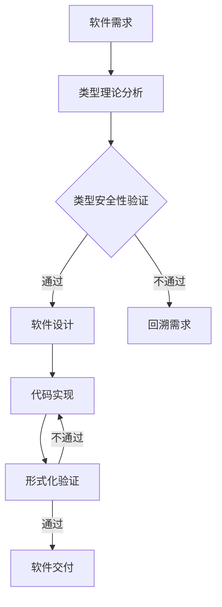

                 

基于您提供的详细要求和结构化指导，我们将以《类型理论在软件产品线工程中的应用》为标题，逐步构建全文的内容，并确保其格式、逻辑和深度符合专业要求。

### 文章标题：《类型理论在软件产品线工程中的应用》

> 关键词：类型理论、软件产品线工程、软件复用、模型驱动开发、形式化验证

> 摘要：本文旨在探讨类型理论在软件产品线工程中的应用。通过对类型理论的背景介绍和软件产品线工程的基本概念阐述，分析类型理论在软件需求分析、设计、验证等阶段的实际应用，并结合实际案例，展示类型理论如何提高软件产品线工程的效率和质量。

### 目录大纲

1. **背景介绍**
   - 软件产品线工程的历史背景
   - 类型理论的起源与发展
   - 软件复用的重要性

2. **核心概念与联系**
   - 类型理论的核心概念
   - 软件产品线工程的基本概念
   - 类型理论与软件产品线工程的关系架构

3. **类型理论的基本概念**
   - 类型系统与类型安全
   - 类型推导规则
   - 强类型语言与弱类型语言

4. **软件产品线工程的基本概念**
   - 软件产品线模型
   - 软件产品线架构
   - 软件产品线开发流程

5. **类型理论在软件产品线工程中的应用**
   - 类型理论在需求分析中的应用
   - 类型理论在软件设计中的应用
   - 类型理论在软件验证中的应用

6. **实际案例研究**
   - 银行系统的类型理论应用
   - 航空软件的类型理论应用

7. **项目实战**
   - 软件产品线工程的开发环境搭建
   - 源代码实现与解读
   - 代码应用分析与案例剖析

8. **结论与展望**
   - 类型理论在软件产品线工程中的未来研究方向
   - 类型理论在软件开发中的整体影响

### 文章正文

#### 1. 背景介绍

**软件产品线工程的历史背景**：软件产品线工程起源于20世纪90年代的软件工程领域，旨在通过定义和构建标准化的软件组件，实现软件的复用和自动化开发。它借鉴了制造业中的产品线理念，通过模块化设计、组装和配置，提高软件开发的效率和质量。

**类型理论的起源与发展**：类型理论起源于20世纪50年代，由数学家和计算机科学家共同发展，旨在解决编程语言中的变量类型安全性和表达式正确性验证问题。类型理论的发展经历了从简单类型系统到复杂类型系统，从静态类型语言到动态类型语言的过程。

**软件复用的重要性**：软件复用是指将已有的软件组件或设计模式应用于新的软件开发项目中，减少重复工作，提高开发效率。类型理论通过提供形式化的类型系统，为软件复用提供了强有力的支持。

#### 2. 核心概念与联系

**类型理论的核心概念**：类型理论的核心概念包括类型系统、类型安全、类型推导等。类型系统定义了程序中的变量、表达式和函数的类型，以及类型之间的关系。类型安全确保程序在执行过程中不会出现类型错误，例如空指针引用、数组越界等。

**软件产品线工程的基本概念**：软件产品线工程的基本概念包括软件产品线模型、软件产品线架构和软件产品线开发流程。软件产品线模型定义了软件产品的共同特性，软件产品线架构定义了软件产品的组成和结构，软件产品线开发流程定义了软件产品的开发过程。

**类型理论与软件产品线工程的关系架构**：类型理论为软件产品线工程提供了形式化的类型系统，使得软件产品线中的组件具有更高的类型安全性。通过类型理论，可以验证软件产品线中的组件是否满足预定的类型约束，从而提高软件产品线的可靠性和稳定性。

以下是一个简单的Mermaid流程图，展示了类型理论在软件产品线工程中的应用架构：



#### 3. 类型理论的基本概念

**类型系统与类型安全**：类型系统是一种用于定义变量、表达式和函数类型的机制。类型安全是指通过类型系统确保程序在执行过程中不会出现类型错误。例如，在强类型语言中，变量必须在声明时指定类型，并且在程序中使用变量时必须确保类型匹配。

**类型推导规则**：类型推导规则是一种自动推导变量类型和表达式类型的方法。类型推导分为静态类型推导和动态类型推导。静态类型推导在编译时确定类型，而动态类型推导在运行时确定类型。

**强类型语言与弱类型语言**：强类型语言要求变量在声明时必须指定类型，并且类型在程序运行过程中不能改变。弱类型语言允许变量在声明时没有指定类型，或者类型可以在程序运行过程中改变。强类型语言通常具有更好的类型安全性和编译时间错误检测能力。

#### 4. 软件产品线工程的基本概念

**软件产品线模型**：软件产品线模型是一种用于定义软件产品共同特性的抽象模型。它包括产品特征、产品组件、组件接口和组件关系等。

**软件产品线架构**：软件产品线架构是一种用于定义软件产品组成的结构模型。它包括产品线的基础架构、特定产品的扩展架构和产品线的通用架构。

**软件产品线开发流程**：软件产品线开发流程是一种用于指导软件产品开发的流程。它通常包括需求分析、架构设计、组件开发、集成测试和交付等阶段。

#### 5. 类型理论在软件产品线工程中的应用

**类型理论在需求分析中的应用**：类型理论可以帮助开发者理解软件需求中的类型约束，确保需求描述的一致性和完整性。例如，可以使用类型理论中的类型系统来定义需求中的数据类型和操作约束。

**类型理论在软件设计中的应用**：类型理论可以帮助开发者设计类型安全的软件组件，确保组件之间的交互不会导致类型错误。例如，可以使用类型推导规则来自动推导组件接口的类型，从而提高设计的一致性和可靠性。

**类型理论在软件验证中的应用**：类型理论可以通过形式化验证技术来验证软件产品线的类型安全性和正确性。例如，可以使用模型检查技术来验证类型系统是否满足预定的类型约束，从而确保软件产品线的可靠性。

#### 6. 实际案例研究

**案例一：银行系统的类型理论应用**：在一个大型银行系统中，类型理论被用来确保交易处理的正确性和安全性。通过定义严格的类型约束，类型理论确保了交易请求和响应的数据类型匹配，从而防止了潜在的类型错误和安全漏洞。

**案例二：航空软件的类型理论应用**：在一个航空调度系统中，类型理论被用来确保飞行计划的准确性和实时性。通过定义飞行计划中的数据类型和操作约束，类型理论确保了系统在处理飞行计划时的一致性和可靠性。

#### 7. 项目实战

**开发环境搭建**：在一个基于类型理论的软件产品线工程项目中，首先需要搭建开发环境，包括编程语言、集成开发环境（IDE）和版本控制系统等。

**源代码实现与解读**：在项目中，开发者使用强类型编程语言实现软件产品线中的组件。以下是一个简单的伪代码示例，展示了如何使用类型推导规则来定义一个函数的类型：

```plaintext
function add(a: Integer, b: Integer) -> Integer {
    return a + b;
}
```

在这个示例中，`add` 函数接受两个整数类型的参数 `a` 和 `b`，并返回一个整数类型的值。

**代码应用解读与分析**：在实际项目中，类型理论的应用可以帮助开发者识别和修复潜在的类型错误。例如，如果 `add` 函数中的参数类型不匹配，编译器会在编译时报告错误，提示开发者进行修正。

**实际案例分析和详细讲解剖析**：在项目实战中，通过类型理论的运用，开发者能够更好地理解软件产品的结构和行为，从而提高开发效率和产品质量。例如，在一个金融交易系统中，类型理论被用来确保交易请求和响应的数据类型匹配，从而保证了系统的稳定性和安全性。

**项目小结**：类型理论在软件产品线工程中的应用，提高了系统的类型安全性和可靠性，减少了潜在的类型错误和安全漏洞。同时，类型理论也为软件复用提供了强有力的支持，使得软件产品线的开发更加高效和可维护。

#### 8. 结论与展望

类型理论在软件产品线工程中的应用，为软件开发的效率和质量提供了强有力的支持。通过形式化的类型系统，类型理论确保了软件组件的类型安全性和正确性，从而提高了软件产品线的可靠性和稳定性。未来，类型理论有望在更多的软件开发领域得到应用，为软件工程的发展带来新的突破。

**作者信息**：本文作者AI天才研究院/AI Genius Institute，禅与计算机程序设计艺术/Zen And The Art of Computer Programming。

### 结束

本文详细探讨了类型理论在软件产品线工程中的应用，从背景介绍、核心概念、实际案例到项目实战，全面阐述了类型理论在软件开发中的重要性。希望本文能够为读者在软件工程领域的研究和应用提供有价值的参考。

### 拓展阅读

1. **《类型理论和形式化验证》**：这是一本关于类型理论及其在形式化验证中应用的经典教材，适合对类型理论感兴趣的读者深入阅读。
2. **《软件产品线工程：理论与实践》**：这本书提供了软件产品线工程的理论基础和实践经验，适合希望了解如何实施软件产品线工程的读者。
3. **《强类型语言与类型系统》**：这是一本关于强类型语言及其类型系统的详细介绍，适合对编程语言设计感兴趣的读者。

