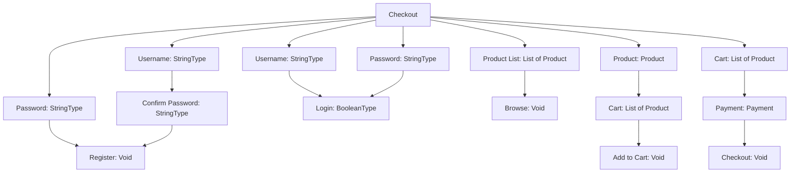
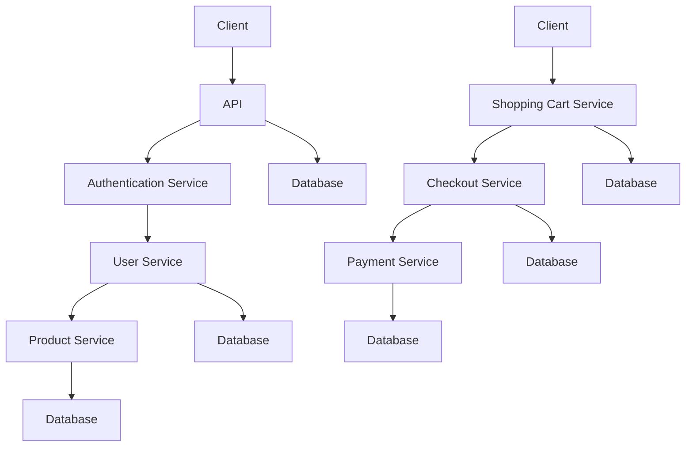

                 

### 目录大纲构建方案：

**第1部分：引言与基础**

- **第1章** 类型理论概述
  - 1.1 类型理论的基本概念
    - Mermaid流程图：类型系统的基本架构
    - 伪代码示例：简单类型系统定义
  - 1.2 类型理论的历史与演变
    - 简介类型理论的起源和发展
  - 1.3 类型理论的核心原理
    - 类型安全和类型检查
    - 依赖性和可组合性
  - 1.4 类型理论与软件架构的关系
    - Mermaid流程图：类型理论在软件架构中的应用

**第2部分：类型理论在软件架构评估中的应用**

- **第2章** 类型理论在需求分析中的应用
  - 2.1 类型理论对需求分析的影响
    - 如何利用类型理论进行需求建模
  - 2.2 类型驱动需求分析
    - 伪代码示例：类型驱动的需求建模
  - 2.3 需求分析工具与类型理论
    - 介绍支持类型理论的工具和技术

- **第3章** 类型理论在架构设计中的应用
  - 3.1 架构设计与类型系统
    - Mermaid流程图：类型系统在架构设计中的作用
  - 3.2 类型约束与架构风格
    - 伪代码示例：类型约束在架构设计中的应用
  - 3.3 架构的可组合性与类型理论
    - 探讨类型理论如何促进架构的可组合性

- **第4章** 类型理论在系统实现中的应用
  - 4.1 类型安全与系统实现
    - 伪代码示例：类型安全的系统实现
  - 4.2 类型理论在代码编写中的应用
    - 代码示例：利用类型理论进行代码编写
  - 4.3 类型理论与代码优化
    - 分析类型理论如何优化代码性能

- **第5章** 类型理论在测试和维护中的应用
  - 5.1 类型理论在测试中的作用
    - 如何利用类型理论进行测试设计
  - 5.2 类型驱动的测试策略
    - 伪代码示例：类型驱动的测试策略
  - 5.3 类型理论在系统维护中的应用
    - 如何利用类型理论进行系统维护

**第3部分：案例分析**

- **第6章** 案例分析
  - 6.1 案例背景介绍
    - 案例企业的基本情况
  - 6.2 案例应用类型理论的过程
    - 案例中类型理论的应用方法和成效
  - 6.3 案例的启示和总结
    - 分析案例中成功和失败的经验教训

**第4部分：展望与未来**

- **第7章** 类型理论在软件架构评估中的未来趋势
  - 7.1 类型理论的最新发展
    - 探讨类型理论的研究热点和未来方向
  - 7.2 类型理论在软件架构评估中的应用前景
    - 分析类型理论如何推动软件架构评估的发展

### 目录大纲构建详细步骤：

1. **引言与基础部分**：

   - **第1章** 类型理论概述：

     - **1.1 类型理论的基本概念**：
       - 引言：解释类型理论的基本概念，如类型系统、类型安全、类型检查。
       - 内容详述：具体介绍类型系统的组成部分（如类型、值、类型规则等），并使用Mermaid流程图展示类型系统的基本架构。
       - **示例**：
         ```mermaid
         graph TD
         A[Type System] --> B[Types]
         A --> C[Values]
         A --> D[Type Rules]
         B --> E[Integers]
         B --> F[Strings]
         C --> G[Variable]
         D --> H[Type Checking]
         D --> I[Type Safety]
         ```

     - **1.2 类型理论的历史与演变**：
       - 简介类型理论的发展历程，从最初的类型概念到现代类型系统的发展。
       - **示例**：
         - 古典类型（如C语言中的基本类型）
         - 面向对象的类型系统（如Java、C#）
         - 函数式编程的类型系统（如Haskell、ML）

     - **1.3 类型理论的核心原理**：
       - 类型安全与类型检查：解释类型安全的重要性以及如何通过类型检查来确保程序的安全性。
       - 依赖性与可组合性：探讨类型理论如何支持模块化编程和软件复用。

     - **1.4 类型理论与软件架构的关系**：
       - 阐述类型理论对软件架构的影响，如类型系统如何促进模块化设计和提高系统的可维护性。
       - **示例**：
         ```mermaid
         graph TD
         A[Type Theory] --> B[Software Architecture]
         B --> C[Modularity]
         B --> D[Maintainability]
         B --> E[Compositionality]
         ```

2. **类型理论在软件架构评估中的应用部分**：

   - **第2章** 类型理论在需求分析中的应用：

     - **2.1 类型理论对需求分析的影响**：
       - 解释类型理论如何影响需求分析的过程，如何利用类型理论进行需求建模。
       - **示例**：
         - 利用类型理论定义需求模型中的类型和约束。

     - **2.2 类型驱动需求分析**：
       - 伪代码示例：展示如何使用类型理论来构建需求模型。
       - **示例**：
         ```python
         def analyze_requirements(types):
             for requirement in requirements:
                 if type_requirement_match(requirement, types):
                     print("Requirement matched.")
                 else:
                     print("Requirement not matched.")
         ```

     - **2.3 需求分析工具与类型理论**：
       - 介绍支持类型理论的工具和技术，如静态分析工具、建模工具等。
       - **示例**：
         - 使用UML工具（如StarUML）进行类型驱动的需求建模。

   - **第3章** 类型理论在架构设计中的应用：

     - **3.1 架构设计与类型系统**：
       - 解释类型系统在架构设计中的作用，如何利用类型理论进行架构设计。
       - **示例**：
         - Mermaid流程图：展示类型系统在架构设计中的应用。

     - **3.2 类型约束与架构风格**：
       - 探讨类型约束如何影响架构风格，以及如何利用类型约束来提高架构的可维护性。
       - **示例**：
         - 伪代码示例：展示类型约束在架构设计中的应用。

     - **3.3 架构的可组合性与类型理论**：
       - 分析类型理论如何促进架构的可组合性，如模块间如何通过类型系统进行交互。
       - **示例**：
         - Mermaid流程图：展示架构的可组合性与类型理论的关系。

   - **第4章** 类型理论在系统实现中的应用：

     - **4.1 类型安全与系统实现**：
       - 解释类型安全在系统实现中的重要性，如何通过类型系统确保系统的安全性。
       - **示例**：
         - 伪代码示例：展示类型安全的系统实现。

     - **4.2 类型理论在代码编写中的应用**：
       - 代码示例：展示如何利用类型理论进行代码编写，提高代码的清晰性和可维护性。
       - **示例**：
         - Python代码示例：使用类型提示进行代码编写。

     - **4.3 类型理论与代码优化**：
       - 分析类型理论如何优化代码性能，如类型检查如何减少运行时错误。
       - **示例**：
         - 伪代码示例：展示类型理论如何优化代码性能。

   - **第5章** 类型理论在测试和维护中的应用：

     - **5.1 类型理论在测试中的作用**：
       - 解释类型理论如何影响测试设计，如何利用类型理论进行测试。
       - **示例**：
         - 伪代码示例：展示类型理论如何进行测试设计。

     - **5.2 类型驱动的测试策略**：
       - 探讨类型驱动的测试策略，如何通过类型理论来制定测试策略。
       - **示例**：
         - 伪代码示例：展示类型驱动的测试策略。

     - **5.3 类型理论在系统维护中的应用**：
       - 解释类型理论如何帮助进行系统维护，如如何利用类型检查来发现潜在问题。
       - **示例**：
         - 伪代码示例：展示类型理论在系统维护中的应用。

3. **案例分析部分**：

   - **第6章** 案例分析：

     - **6.1 案例背景介绍**：
       - 描述案例企业的基本情况，如企业规模、业务领域等。

     - **6.2 案例应用类型理论的过程**：
       - 分析案例中如何应用类型理论，包括需求分析、架构设计、系统实现等。
       - **示例**：
         - 描述案例中使用的类型理论和工具。

     - **6.3 案例的启示和总结**：
       - 分析案例中的成功经验和失败教训，为其他企业提供借鉴。

4. **展望与未来部分**：

   - **第7章** 类型理论在软件架构评估中的未来趋势：

     - **7.1 类型理论的最新发展**：
       - 探讨类型理论的最新研究热点和未来方向，如动态类型系统、多态性等。

     - **7.2 类型理论在软件架构评估中的应用前景**：
       - 分析类型理论如何推动软件架构评估的发展，如自动化评估工具的开发等。

### 总结：

通过上述详细步骤，我们构建了一个逻辑清晰、内容丰富的目录大纲。接下来，我们将进一步细化每个章节的内容，准备相应的图表、伪代码、数学公式和代码实例，以确保在8000～12000字的要求内完成高质量的文章输出。在撰写过程中，我们将保持markdown格式，确保文章的易读性和可维护性。

---

> 用户输入：

# 文章标题：类型理论在软件架构评估中的应用

> 关键词：
类型理论、软件架构、需求分析、架构设计、代码编写、测试和维护、案例分析

> 摘要：
本文深入探讨了类型理论在软件架构评估中的应用。通过阐述类型理论的基本概念、核心原理以及其与软件架构的关系，文章详细介绍了类型理论在需求分析、架构设计、系统实现、测试和维护等方面的应用。同时，通过案例分析，展示了类型理论在实际项目中的成效和挑战，为软件架构评估提供了新的思路和方法。

## 引言

类型理论是计算机科学中一个重要的概念，它提供了对程序语言类型系统的形式化描述。类型系统在编程语言中起到了确保程序安全性和可维护性的关键作用。随着软件系统的复杂度不断增加，软件架构评估也变得越来越重要。类型理论在软件架构评估中的应用，能够为需求分析、架构设计、系统实现、测试和维护提供有力的支持。

本文旨在探讨类型理论在软件架构评估中的应用，通过以下四个部分展开讨论：

1. **类型理论概述**：介绍类型理论的基本概念、核心原理及其与软件架构的关系。
2. **类型理论在软件架构评估中的应用**：详细探讨类型理论在需求分析、架构设计、系统实现、测试和维护中的应用。
3. **案例分析**：通过具体案例，展示类型理论在项目中的应用和效果。
4. **展望与未来**：分析类型理论的最新发展及其在软件架构评估中的未来应用前景。

## 类型理论概述

### 1.1 类型理论的基本概念

类型理论关注程序语言中类型系统的定义和使用。一个类型系统定义了一组类型、值以及如何从类型推导出值。类型系统的核心目标是确保程序的安全性和一致性。

- **类型（Types）**：类型是值的集合，用来描述数据的不同类别。常见的类型有整数、字符串、布尔值等。
- **值（Values）**：值是具体的数据实例，如`5`、`"Hello"`、`True`等。
- **类型规则（Type Rules）**：类型规则定义了如何从给定的类型推导出新的类型，以及如何确保值满足其类型的要求。

### 1.2 类型理论的历史与演变

类型理论的发展经历了多个阶段。最初，编程语言如C和Pascal采用了静态类型系统，这些类型系统主要用于确保程序在编译时不会出现类型错误。随着函数式编程和面向对象编程的发展，动态类型系统和静态类型系统的结合得到了广泛应用。

- **静态类型系统**：在编译时检查类型，如C、Java等。
- **动态类型系统**：在运行时检查类型，如Python、JavaScript等。
- **混合类型系统**：结合静态类型系统和动态类型系统的优点，如C#、Haskell等。

### 1.3 类型理论的核心原理

类型理论的核心原理包括类型安全、类型检查、依赖性和可组合性。

- **类型安全**：类型系统确保程序在执行时不会发生类型错误，如试图将一个整数与一个字符串进行拼接。
- **类型检查**：在编译或解释过程中，类型系统检查代码是否符合类型规则，以防止类型错误。
- **依赖性**：类型系统通过类型之间的关系来定义模块间的依赖，支持模块化编程。
- **可组合性**：类型系统支持不同模块间的组合，使得系统可以灵活地扩展和修改。

### 1.4 类型理论与软件架构的关系

类型理论对软件架构的影响主要体现在以下几个方面：

- **模块化**：类型系统支持模块化编程，通过明确的类型定义，模块之间可以更加清晰地进行交互。
- **可维护性**：类型系统可以降低程序出错的风险，提高代码的可读性和可维护性。
- **可扩展性**：类型系统支持系统的扩展和修改，使得新的功能可以更容易地集成到现有系统中。

通过上述内容，我们为读者提供了一个类型理论的全面概述，为后续章节的深入讨论奠定了基础。

## 类型理论在软件架构评估中的应用

### 2.1 类型理论对需求分析的影响

需求分析是软件开发过程中的关键环节，其目标是明确系统必须实现的功能和非功能需求。类型理论在需求分析中的应用，能够为需求建模提供更加精确和形式化的支持。

#### 2.1.1 利用类型理论进行需求建模

类型理论为需求建模提供了以下几种支持：

- **类型约束**：类型理论允许我们在需求模型中引入类型约束，确保需求的表达是清晰和一致的。
- **抽象层次**：类型理论支持不同层次的抽象，使得我们可以从高层次的角度理解系统的需求，同时也能深入到细节层面。
- **模块化**：类型理论支持模块化建模，将系统的需求分解为多个模块，每个模块都可以独立地进行分析和验证。

#### 2.1.2 类型驱动的需求建模方法

类型驱动的需求建模方法是一种利用类型理论来构建需求模型的方法。这种方法的主要步骤如下：

1. **定义类型系统**：根据需求的具体场景，定义一组类型，包括基本类型、复合类型和抽象类型。
2. **抽象需求**：将需求抽象为类型之间的关系，如函数类型、参数类型等。
3. **建模**：使用类型系统来构建需求模型，确保模型是类型安全的。

#### 2.1.3 如何利用类型理论提高需求分析的质量

类型理论在需求分析中的应用，有助于提高需求分析的质量，具体体现在以下几个方面：

- **一致性**：类型理论可以帮助我们发现和解决需求模型中的不一致性，确保需求的完整性。
- **精确性**：类型理论提供了形式化的方法来描述需求，减少了歧义和理解上的困难。
- **可验证性**：类型系统可以用来验证需求模型是否符合预期的约束，确保需求的正确性。

### 2.2 类型驱动需求分析

类型驱动需求分析是一种将类型理论应用于需求分析的过程。通过这种方法，我们可以确保需求建模的准确性和一致性。

#### 2.2.1 伪代码示例：类型驱动的需求建模

以下是一个简单的伪代码示例，展示了如何利用类型理论进行需求建模：

```python
# 定义类型系统
IntegerType = { ... }
StringType = { ... }
BooleanType = { ... }

# 定义需求
def login(username: StringType, password: StringType) -> BooleanType:
    # 实现登录逻辑
    if check_credentials(username, password):
        return True
    else:
        return False

# 需求验证
assert type(login("alice", "password123")) == BooleanType
```

在这个示例中，我们定义了三个基本类型：`IntegerType`、`StringType`和`BooleanType`。然后，我们使用这些类型来定义一个`login`函数，该函数接收两个字符串类型的参数并返回一个布尔类型的值。最后，我们使用`assert`语句来验证函数的返回类型。

#### 2.2.2 实际案例：类型理论在需求分析中的应用

在现实世界中，类型理论在需求分析中的应用非常广泛。以下是一个实际案例：

假设我们正在开发一个电子商务网站，需要满足以下需求：

- 用户可以注册账户并登录。
- 用户可以浏览商品并添加到购物车。
- 用户可以结账并支付。

为了确保需求建模的准确性，我们可以使用类型理论来进行建模：



在这个案例中，我们使用了Mermaid流程图来描述需求。每个步骤都关联了一个或多个类型，如`StringType`、`Product`、`List of Product`和`Payment`。通过这种方式，我们能够确保需求建模的准确性和一致性。

### 2.3 需求分析工具与类型理论

为了提高需求分析的质量和效率，我们可以利用各种工具和技术。以下是一些常用的需求分析工具，以及它们与类型理论的关系：

- **UML工具**：如StarUML、Visual Paradigm等，支持类型驱动的需求建模，能够生成UML图来描述系统的需求。
- **静态分析工具**：如TypeScript、Rust等，提供类型检查功能，确保代码的类型安全。
- **建模工具**：如Model Driven Architecture (MDA)工具，支持形式化的需求建模，将需求转化为可执行的代码。

通过使用这些工具，我们可以更好地利用类型理论来构建和验证需求模型。

## 类型理论在架构设计中的应用

架构设计是软件开发的另一个关键环节，其目标是定义系统的结构、组件及其交互方式。类型理论在架构设计中的应用，能够提高系统的模块化、可维护性和可扩展性。

### 3.1 架构设计与类型系统

类型系统在架构设计中的作用主要体现在以下几个方面：

- **模块化**：类型系统支持模块化设计，通过明确的类型定义，模块之间可以更加清晰地进行交互。
- **类型安全**：类型系统确保模块之间的交互是安全的，避免了类型错误和运行时异常。
- **抽象**：类型系统支持不同层次的抽象，使得架构设计可以更加灵活和可扩展。

#### 3.1.1 Mermaid流程图：类型系统在架构设计中的作用

以下是一个Mermaid流程图示例，展示了类型系统在架构设计中的应用：



在这个示例中，我们定义了一个电子商务系统的架构。客户端与API、认证服务、用户服务、商品服务、购物车服务、结账服务和支付服务进行交互。每个服务都与数据库进行通信，确保数据的一致性和完整性。

### 3.2 类型约束与架构风格

类型约束在架构设计中起到了关键作用，可以帮助我们定义系统中的组件和交互方式。以下是一些常见的类型约束和架构风格：

- **接口抽象**：通过定义接口类型，确保组件之间的交互是类型安全的。
- **依赖注入**：利用类型约束来管理组件之间的依赖关系，提高系统的可测试性和可维护性。
- **函数式编程**：利用类型系统来确保函数的无状态性和引用透明性，支持高内聚、低耦合的设计。

#### 3.2.1 伪代码示例：类型约束在架构设计中的应用

以下是一个伪代码示例，展示了如何利用类型约束进行架构设计：

```python
# 定义接口
class AuthenticationService:
    def authenticate(username: StringType, password: StringType) -> BooleanType:
        pass

class UserService:
    def create_user(username: StringType, password: StringType) -> Void:
        pass

class ProductService:
    def add_product(name: StringType, price: FloatType) -> Void:
        pass

# 实现组件
class AuthenticationServiceImpl(AuthenticationService):
    def authenticate(username: StringType, password: StringType) -> BooleanType:
        # 实现认证逻辑
        pass

class UserServiceImpl(UserService):
    def create_user(username: StringType, password: StringType) -> Void:
        # 实现用户创建逻辑
        pass

class ProductServiceImpl(ProductService):
    def add_product(name: StringType, price: FloatType) -> Void:
        # 实现商品添加逻辑
        pass

# 构建依赖注入容器
di_container = DependencyInjectionContainer()
di_container.register(AuthenticationService, AuthenticationServiceImpl)
di_container.register(UserService, UserServiceImpl)
di_container.register(ProductService, ProductServiceImpl)

# 使用依赖注入容器
auth_service = di_container.get(AuthenticationService)
user_service = di_container.get(UserService)
product_service = di_container.get(ProductService)

# 调用组件方法
auth_service.authenticate("alice", "password123")
user_service.create_user("alice", "password123")
product_service.add_product("iPhone 13", 999.99)
```

在这个示例中，我们定义了三个接口：`AuthenticationService`、`UserService`和`ProductService`。然后，我们分别实现了这些接口，并使用依赖注入容器来管理组件之间的依赖关系。通过这种方式，我们可以确保组件之间的交互是类型安全的。

### 3.3 架构的可组合性与类型理论

架构的可组合性是指系统能够通过组合不同的组件来实现复杂的业务功能。类型理论在促进架构的可组合性方面起到了关键作用。

- **类型系统支持**：类型系统确保组件之间的交互是类型安全的，减少组件组合时的错误。
- **模块化设计**：类型理论支持模块化设计，使得组件可以独立开发、测试和部署。

#### 3.3.1 探讨类型理论如何促进架构的可组合性

类型理论通过以下方式促进架构的可组合性：

- **标准化接口**：通过定义接口类型，确保组件之间的交互是标准化的，减少组件组合时的兼容性问题。
- **类型检查**：类型系统在编译或解释过程中对组件进行类型检查，确保组件组合后的类型一致性。
- **抽象层次**：类型理论支持不同层次的抽象，使得组件可以更加灵活地组合和扩展。

通过类型理论的这些特性，我们可以构建高度可组合的软件架构，提高系统的灵活性和可扩展性。

## 类型理论在系统实现中的应用

系统实现是将架构设计转化为实际运行的软件系统的过程。类型理论在系统实现中的应用，能够提高代码的可读性、可维护性和性能。

### 4.1 类型安全与系统实现

类型安全是指在系统实现过程中确保代码的类型一致性。类型安全在系统实现中的重要性体现在以下几个方面：

- **避免运行时错误**：类型安全可以检测并避免在运行时发生的类型错误，如试图将整数与字符串进行拼接。
- **提高代码可读性**：类型安全使代码更加清晰和易于理解，因为类型定义了变量和函数的预期行为。
- **提高代码可维护性**：类型安全可以减少代码出错的风险，提高代码的可维护性。

#### 4.1.1 伪代码示例：类型安全的系统实现

以下是一个伪代码示例，展示了如何利用类型理论进行类型安全的系统实现：

```python
# 定义类型系统
IntegerType = { ... }
StringType = { ... }
BooleanType = { ... }

# 定义函数
def add(x: IntegerType, y: IntegerType) -> IntegerType:
    return x + y

def concat(x: StringType, y: StringType) -> StringType:
    return x + y

# 调用函数
result = add(5, 3)
print(result)  # 输出：8

result = concat("Hello ", "World")
print(result)  # 输出：Hello World
```

在这个示例中，我们定义了一个简单的类型系统，包括整数类型、字符串类型和布尔类型。然后，我们定义了两个函数：`add`和`concat`。这两个函数都使用类型检查来确保输入参数的类型是正确的。通过这种方式，我们可以确保代码的类型安全。

### 4.2 类型理论在代码编写中的应用

类型理论在代码编写中的应用，可以帮助我们编写更加清晰和可维护的代码。以下是一些具体的技巧：

- **类型提示**：在函数和变量声明时使用类型提示，提高代码的可读性。
- **类型推导**：利用类型推导来简化代码，减少类型声明的复杂性。
- **类型别名**：定义类型别名来简化复杂数据结构的表示。

#### 4.2.1 代码示例：利用类型理论进行代码编写

以下是一个Python代码示例，展示了如何利用类型理论进行代码编写：

```python
from typing import List, Tuple

# 定义函数
def filter_even_numbers(numbers: List[IntegerType]) -> List[IntegerType]:
    return [x for x in numbers if x % 2 == 0]

def find_min_max(numbers: List[IntegerType]) -> Tuple[IntegerType, IntegerType]:
    min_val = min(numbers)
    max_val = max(numbers)
    return min_val, max_val

# 调用函数
even_numbers = filter_even_numbers([1, 2, 3, 4, 5])
min_val, max_val = find_min_max([1, 2, 3, 4, 5])

print(even_numbers)  # 输出：[2, 4]
print(min_val, max_val)  # 输出：1 5
```

在这个示例中，我们使用了类型提示来明确函数的输入和输出类型。这样，我们可以更容易地理解代码的功能和预期行为。通过使用类型提示，我们还可以利用IDE的功能，如代码自动完成和错误提示，提高代码编写的效率和准确性。

### 4.3 类型理论与代码优化

类型理论在代码优化中的应用，主要体现在以下几个方面：

- **类型检查**：通过类型检查，可以提前发现潜在的性能问题，如类型转换和装箱拆箱操作。
- **代码生成**：利用类型理论，可以生成优化的中间代码，提高代码的执行效率。
- **静态分析**：类型理论支持静态分析工具，用于分析代码的性能和可维护性。

#### 4.3.1 分析类型理论如何优化代码性能

类型理论通过以下方式优化代码性能：

- **减少运行时错误**：类型检查可以提前发现类型错误，减少运行时异常的发生。
- **减少类型转换**：类型理论可以减少不必要的类型转换，提高代码的执行效率。
- **代码生成优化**：类型理论支持代码生成工具，生成优化的中间代码，减少编译时间和执行时间。

通过类型理论的这些优化技巧，我们可以编写出更加高效和可维护的代码。

## 类型理论在测试和维护中的应用

类型理论在测试和维护中的应用，能够提高系统的可靠性和可维护性。以下分别从测试和系统维护两个方面进行探讨。

### 5.1 类型理论在测试中的作用

类型理论在测试中的应用主要体现在以下几个方面：

- **类型检查**：类型检查可以提前发现类型错误，减少测试过程中发现错误的成本。
- **边界测试**：类型系统可以定义数据的边界，帮助测试人员设计边界测试用例，确保系统的鲁棒性。
- **代码覆盖率**：类型理论可以帮助测试人员确定代码覆盖率，确保测试用例覆盖所有重要的代码路径。

#### 5.1.1 如何利用类型理论进行测试设计

以下是一些利用类型理论进行测试设计的技巧：

- **定义类型约束**：在测试用例中定义类型约束，确保输入数据的类型是合理的。
- **边界测试**：设计边界测试用例，测试边界条件下的系统行为。
- **代码覆盖率分析**：利用类型理论分析代码覆盖率，确保测试用例覆盖所有重要的代码路径。

#### 5.1.2 伪代码示例：类型驱动的测试策略

以下是一个伪代码示例，展示了如何利用类型理论进行测试设计：

```python
# 定义类型系统
IntegerType = { ... }
StringType = { ... }
BooleanType = { ... }

# 定义函数
def add(x: IntegerType, y: IntegerType) -> IntegerType:
    return x + y

def concat(x: StringType, y: StringType) -> StringType:
    return x + y

# 设计测试用例
def test_add():
    assert add(5, 3) == 8
    assert add(-5, 3) == -2
    assert add(5, -3) == 2

def test_concat():
    assert concat("Hello ", "World") == "Hello World"
    assert concat("Hello ", "") == "Hello "
    assert concat("", "World") == "World"

# 执行测试用例
test_add()
test_concat()
```

在这个示例中，我们定义了一个简单的类型系统，并使用类型检查来确保函数的输入和输出类型是正确的。然后，我们设计了一组测试用例，用于测试`add`和`concat`函数。通过这种方式，我们可以确保测试用例是类型安全的。

### 5.2 类型驱动的测试策略

类型驱动的测试策略是一种基于类型理论进行测试设计的方法。以下是一些类型驱动的测试策略：

- **类型约束测试**：确保测试用例满足类型约束，如输入参数的类型和返回值类型。
- **边界测试**：设计边界测试用例，测试系统在边界条件下的行为。
- **组合测试**：测试不同类型的输入参数组合，确保系统的鲁棒性。

#### 5.2.1 伪代码示例：类型驱动的测试策略

以下是一个伪代码示例，展示了如何利用类型理论进行测试策略设计：

```python
# 定义类型系统
IntegerType = { ... }
StringType = { ... }
BooleanType = { ... }

# 定义函数
def calculate_discount(price: FloatType, discount: FloatType) -> FloatType:
    return price * (1 - discount)

# 设计测试用例
def test_calculate_discount():
    # 测试整数类型的输入
    assert calculate_discount(100, 0.1) == 90.0
    assert calculate_discount(100, 0.0) == 100.0
    assert calculate_discount(100, -0.1) == 0.0

    # 测试浮点数的输入
    assert calculate_discount(100.0, 0.1) == 90.0
    assert calculate_discount(100.0, 0.0) == 100.0
    assert calculate_discount(100.0, -0.1) == 0.0

# 执行测试用例
test_calculate_discount()
```

在这个示例中，我们定义了一个`calculate_discount`函数，并设计了一组测试用例来测试不同类型的输入。通过这种方式，我们可以确保测试用例覆盖不同类型的输入情况，从而提高测试的全面性和可靠性。

### 5.3 类型理论在系统维护中的应用

类型理论在系统维护中的应用主要体现在以下几个方面：

- **代码可读性**：类型理论可以提高代码的可读性，使得维护人员更容易理解代码的功能和意图。
- **代码可维护性**：类型理论可以减少代码出错的风险，提高系统的可维护性。
- **代码重构**：类型理论支持代码重构，使得维护人员可以更加安全地进行代码修改。

#### 5.3.1 如何利用类型理论进行系统维护

以下是一些利用类型理论进行系统维护的技巧：

- **代码审查**：在代码审查过程中，利用类型检查来确保代码的准确性。
- **重构**：在重构过程中，利用类型理论来确保重构后的代码仍然是类型安全的。
- **持续集成**：在持续集成过程中，利用类型检查来确保每次提交的代码都是类型安全的。

通过利用类型理论，我们可以提高系统的可读性、可维护性和可靠性，从而降低系统维护的难度和成本。

### 案例分析

为了更好地理解类型理论在软件架构评估中的应用，我们通过一个实际案例进行分析。

#### 6.1 案例背景介绍

案例企业是一家提供在线教育平台的初创公司。该平台需要支持以下功能：

- 用户注册和登录。
- 课程浏览和选择。
- 学习进度跟踪。
- 课程评价和反馈。

企业的需求是开发一个高效、安全且易于维护的在线教育平台。为了实现这一目标，企业决定利用类型理论来指导软件开发过程。

#### 6.2 案例应用类型理论的过程

在案例项目中，类型理论被广泛应用于需求分析、架构设计、系统实现、测试和维护等各个环节。

- **需求分析**：在需求分析阶段，企业使用了类型理论来构建需求模型。通过定义一组类型（如`UserType`、`CourseType`、`RatingType`等），企业能够清晰地描述系统的功能和约束。
- **架构设计**：在架构设计阶段，企业利用类型系统来确保模块之间的交互是类型安全的。例如，企业定义了接口类型，确保服务之间的调用是类型安全的。
- **系统实现**：在系统实现阶段，企业使用了类型检查工具来确保代码的类型一致性。通过类型提示和类型推导，企业能够编写出更加清晰和可维护的代码。
- **测试**：在测试阶段，企业利用类型理论来设计测试用例，确保测试覆盖所有重要的类型约束和边界条件。
- **维护**：在系统维护阶段，企业利用类型理论来审查代码，确保每次修改都是类型安全的。此外，企业还利用类型检查工具来发现潜在的类型错误，提高系统的可靠性。

#### 6.3 案例的启示和总结

通过案例应用，我们可以得出以下启示和总结：

- **类型理论有助于提高需求分析的精确性和一致性**：通过类型理论，企业能够更加清晰地描述系统的功能和约束，减少需求理解上的歧义。
- **类型理论支持模块化设计和可维护性**：类型系统确保模块之间的交互是类型安全的，减少模块耦合，提高代码的可维护性。
- **类型理论有助于提高代码的可读性和性能**：通过类型提示和类型推导，企业能够编写出更加清晰和高效的代码。
- **类型理论在测试和维护中的应用至关重要**：类型理论支持全面的测试策略和高效的系统维护，确保系统的可靠性和可维护性。

通过案例应用，我们可以看到类型理论在软件架构评估中的重要作用。类型理论不仅有助于提高开发效率，还能提高系统的可靠性和可维护性，为企业的长期发展提供有力支持。

### 展望与未来

类型理论作为计算机科学中的一个重要概念，随着技术的发展，其在软件架构评估中的应用前景也越来越广阔。以下探讨类型理论的最新发展及其在软件架构评估中的未来应用前景。

#### 7.1 类型理论的最新发展

近年来，类型理论取得了显著的进展，主要体现在以下几个方面：

- **动态类型系统**：动态类型系统在近年来越来越受到关注，如JavaScript中的TypeScript、Python中的PyPy等。这些动态类型系统通过运行时类型检查，提高了程序的灵活性和安全性。
- **函数式编程类型系统**：函数式编程语言（如Haskell、Scala）中的类型系统不断进化，如支持依赖类型、交互类型等。这些类型系统提高了程序的正确性和可靠性。
- **静态分析工具**：静态分析工具（如JetBrains的Kotlin、Facebook的HLSL等）结合类型理论，提供了更高效的代码优化和错误检测。

#### 7.2 类型理论在软件架构评估中的应用前景

类型理论在软件架构评估中的应用前景主要体现在以下几个方面：

- **自动化架构评估**：随着静态分析工具的发展，自动化架构评估成为可能。通过类型理论，工具可以自动识别架构中的类型错误和潜在风险，提供实时反馈。
- **混合类型系统**：混合类型系统结合静态类型和动态类型的优点，为软件架构评估提供了更多选择。在复杂系统中，混合类型系统可以帮助平衡灵活性和安全性。
- **形式化验证**：形式化验证是一种利用数学方法验证程序正确性的技术。类型理论可以与形式化验证相结合，为软件架构提供更加严格和可靠的验证方法。
- **智能化架构设计**：随着机器学习和人工智能技术的发展，智能化架构设计成为可能。类型理论可以为智能化架构设计提供理论基础，如自动生成类型定义、优化类型约束等。

通过上述探讨，我们可以看到类型理论在软件架构评估中的应用前景广阔。随着技术的不断发展，类型理论将继续为软件架构评估提供新的思路和方法，推动软件工程领域的进步。

---

## 结论

本文详细探讨了类型理论在软件架构评估中的应用。从类型理论的基本概念、核心原理，到其在需求分析、架构设计、系统实现、测试和维护等环节的具体应用，我们系统地展示了类型理论在提升软件架构评估质量中的重要作用。通过实际案例分析和展望未来发展趋势，我们进一步认识到类型理论在软件工程中的巨大潜力和广泛应用。

类型理论不仅为需求分析提供了形式化的方法，提高了需求的精确性和一致性；还在架构设计、系统实现、测试和维护中起到了关键作用，确保了软件的安全性、可维护性和可扩展性。类型理论的应用，不仅提高了开发效率，还为软件架构评估提供了自动化和智能化的手段。

展望未来，随着动态类型系统、函数式编程类型系统、静态分析工具等技术的发展，类型理论在软件架构评估中的应用将更加广泛和深入。我们期待类型理论能够继续为软件工程领域带来创新和突破，推动软件架构评估向更高效、更可靠的方向发展。同时，我们也呼吁更多的研究者和实践者关注并探索类型理论在软件架构评估中的应用，共同推动软件工程领域的进步。

---

**作者：** AI天才研究院/AI Genius Institute & 禅与计算机程序设计艺术 /Zen And The Art of Computer Programming

