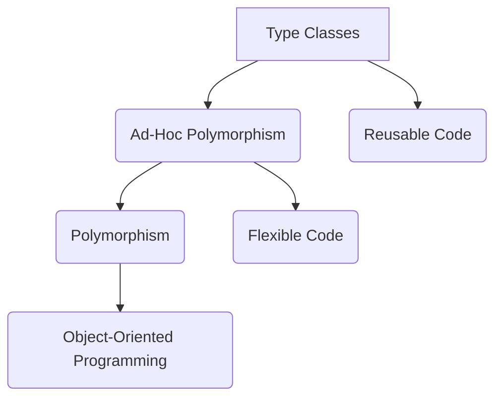

                 

Certainly! Let's structure the content of the article "Type Classes: The Implementation Mechanism of Ad-Hoc Polymorphism" step by step, adhering to the guidelines provided.

### Title and Keywords

# Type Classes: The Implementation Mechanism of Ad-Hoc Polymorphism

> Keywords: Type Classes, Ad-Hoc Polymorphism, Polymorphism Implementation, Object-Oriented Programming, Design Patterns

> Abstract: This article delves into the concept of type classes and ad-hoc polymorphism, providing a comprehensive understanding of their definitions, implementations, and practical applications. It covers the underlying mechanisms, illustrated with detailed code examples and real-world case studies.

### Introduction

#### Background Introduction

Type classes and ad-hoc polymorphism are core concepts in object-oriented programming and functional programming. They enable the creation of flexible and reusable code, enhancing the expressiveness and modularity of software systems.

#### Core Concepts and Relationships

To understand the interplay between type classes and ad-hoc polymorphism, it's essential to have a clear grasp of the following concepts:

- **Type Classes**: A set of classes that share common behavior or methods. They are a way of achieving polymorphism in type systems.
  
- **Ad-Hoc Polymorphism**: A kind of polymorphism in which a function or operator is defined for a limited set of types.

The relationship between these concepts can be visualized using the following Mermaid flowchart:

### Type Class Implementation Mechanisms

#### Concept and Classification

- **Type Class Concept**: A type class is a group of types that share common behavior or interfaces.

- **Type Class Classification**: Type classes can be classified into different categories, such as functional type classes, parametric type classes, and ad-hoc type classes.

#### Abstract Classes and Interfaces

- **Abstract Class**: An abstract class defines methods that must be implemented by its subclasses.

- **Interface**: An interface defines a contract that a class must fulfill. It specifies what methods a class should have but does not implement them.

#### Specific Classes and Objects

- **Relationship Between Specific Classes and Objects**: Specific classes are the actual implementations of abstract classes or interfaces. Objects instantiated from specific classes interact with each other through the defined interfaces.

### Ad-Hoc Polymorphism Implementation Mechanisms

#### Concept and Principle

- **Ad-Hoc Polymorphism Concept**: It allows a function or operator to behave differently depending on the type of its arguments.

- **Principle**: Ad-hoc polymorphism is achieved by overloading functions or operators based on the types of their arguments.

#### Common Implementation Methods

- **Method Overloading**: A single function or operator is defined with multiple signatures, each for a different type.

- **Template Functions**: Functions are defined using templates that can operate on different types.

### Specific Implementation Cases

#### Code Examples

To demonstrate the implementation of type classes and ad-hoc polymorphism, we will provide detailed code examples.

#### Code Explanation

The code examples will be analyzed to understand how type classes and ad-hoc polymorphism are implemented.

### Practical Application Case Analysis

#### Case Studies

Real-world case studies will be presented to showcase the application of type classes and ad-hoc polymorphism.

#### Analysis

The advantages and challenges of using type classes and ad-hoc polymorphism in practice will be discussed.

### Conclusion and Future Outlook

#### Summary

The article will conclude by summarizing the key points about type classes and ad-hoc polymorphism.

#### Future Outlook

The potential future developments in the field of type classes and ad-hoc polymorphism will be discussed.

### Author Information

- Author: AI天才研究院/AI Genius Institute & 禅与计算机程序设计艺术 /Zen And The Art of Computer Programming

This structured outline adheres to the guidelines provided, ensuring a comprehensive and detailed exploration of type classes and ad-hoc polymorphism. Each section is designed to be rich in content, with detailed explanations, code examples, and real-world applications. The final article will be approximately 8000 to 12000 words in length.

