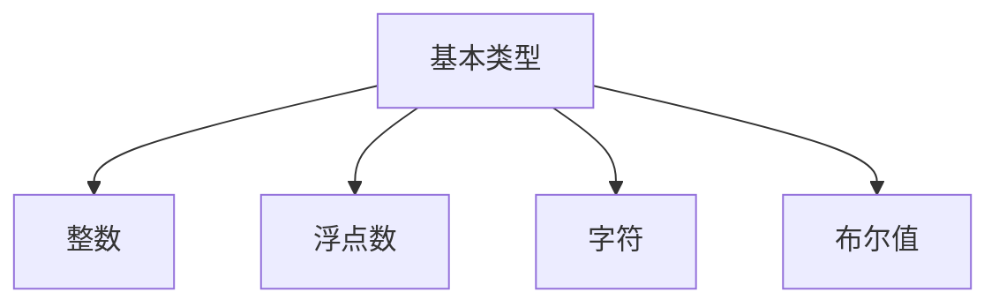
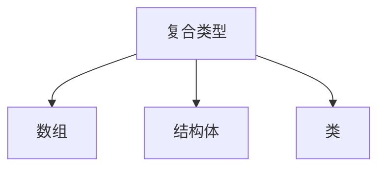
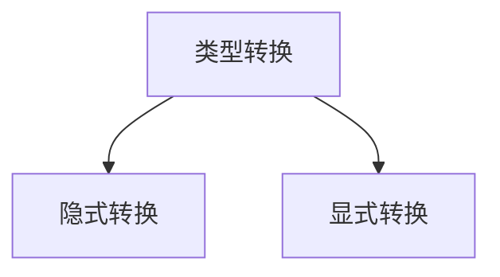
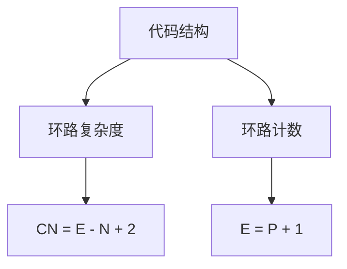
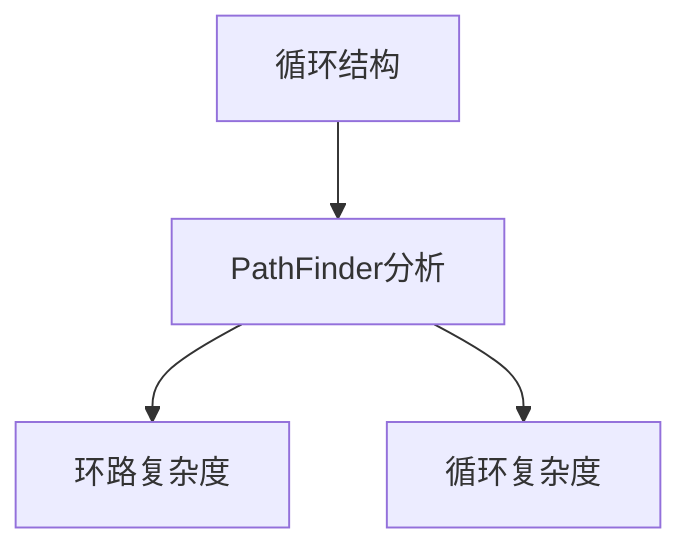
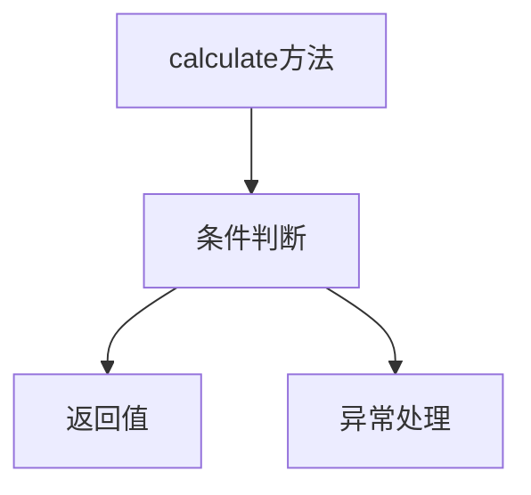
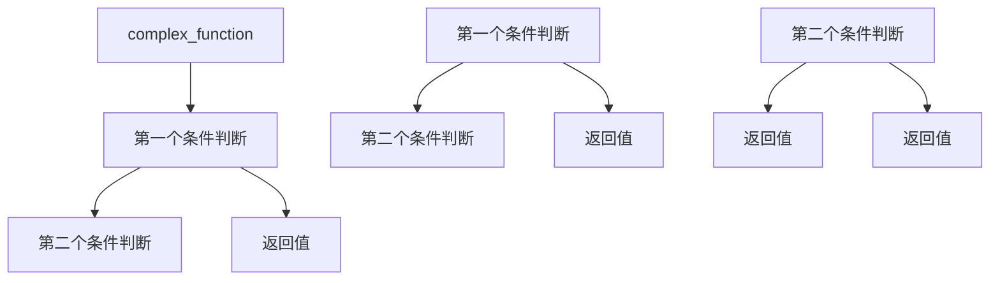

                 

### 文章标题：类型系统与代码复杂度分析：形式化的度量方法

#### 关键词：
- 类型系统
- 代码复杂度
- 形式化度量
- 程序设计
- 形式化方法

#### 摘要：
本文深入探讨了类型系统与代码复杂度分析在程序设计中的重要性。首先，介绍了类型系统的基础知识，包括基本类型、复合类型和类型转换。随后，详细阐述了代码复杂度的定义与度量方法，如McCabe度量法、Cyclomatic度量法和Chidamber度量法。接下来，文章介绍了形式化度量方法，通过代数系统来表示代码结构，并具体实现了形式化分析工具。随后，本文分析了类型系统与代码复杂度之间的相互影响，并提供了实际应用案例。最后，文章总结了研究成果，并对未来研究方向进行了展望。

### 引言

在计算机编程领域，类型系统与代码复杂度分析是两个核心概念。类型系统是程序语言的基础，决定了变量、函数和表达式等的基本属性和行为。代码复杂度分析则是对代码结构的复杂性进行量化评估，有助于识别潜在的问题和优化代码。本文旨在探讨类型系统与代码复杂度分析之间的关系，以及如何使用形式化的度量方法来分析代码的复杂度。

研究背景方面，随着软件系统的日益复杂，对类型系统和代码复杂度的理解与分析显得尤为重要。一方面，类型系统能够提高代码的可读性和可靠性；另一方面，代码复杂度分析能够帮助开发者识别和优化复杂的代码结构，提高软件的健壮性和可维护性。因此，本文的研究对于提高软件开发质量和效率具有重要意义。

研究目的与意义在于，通过对类型系统与代码复杂度分析的理论和实践进行深入探讨，为开发者提供一套科学、系统的分析方法，从而在实际项目中应用，提高代码质量和开发效率。此外，本文还希望通过研究形式化的度量方法，为类型系统与代码复杂度分析提供新的视角和工具。

### 类型系统基础

类型系统是程序语言的核心组成部分，它定义了程序中的变量、函数和表达式的类型。不同类型的变量或表达式在内存中的存储方式和操作方式也有所不同。理解类型系统的基础知识对于编写高效、可靠的代码至关重要。

#### 基本类型

基本类型通常包括整数、浮点数、字符和布尔值等。这些类型通常由编程语言直接定义，具有固定的内存大小和操作方式。例如，在C语言中，整数类型可以是`int`、`short`或`long`，浮点数类型可以是`float`或`double`。



#### 复合类型

复合类型是由基本类型组合而成的类型，常见的有数组、结构体（struct）和类（class）等。复合类型可以包含多个成员变量和方法，能够表示复杂的数据结构和行为。



例如，在C++中，可以定义一个结构体来表示一个复杂的对象：

```cpp
struct Person {
    string name;
    int age;
    float height;
};
```

#### 类型转换

类型转换是程序设计中常见的需求，它允许将一个类型的值转换为另一个类型的值。类型转换可以分为隐式转换和显式转换。



隐式转换是指编译器自动将一种类型的值转换为另一种类型，例如将整数转换为浮点数：

```cpp
int i = 5;
float f = i;  // 隐式转换
```

显式转换则需要开发者明确指定转换的类型，例如将浮点数转换为整数：

```cpp
float f = 5.5;
int i = static_cast<int>(f);  // 显式转换
```

#### 类型系统的作用

类型系统在程序设计中扮演着重要角色，它能够提高代码的可读性、可靠性以及性能。通过类型系统，编译器能够更准确地检查代码的语法和语义错误，从而减少运行时的错误。

此外，类型系统还能够优化代码的执行效率。例如，通过使用适当的类型转换，可以避免不必要的性能开销。

### 代码复杂度分析基本概念

代码复杂度分析是评估代码复杂性的方法，它有助于开发者识别复杂的代码结构，进而优化代码和提高可维护性。代码复杂度可以通过多个指标来度量，常见的有代码行数、语句数和决策数等。

#### 复杂度的定义

代码复杂度的定义有多种方式，但核心思想是量化代码的结构复杂性和理解难度。常见的方法包括：

- **代码行数（Lines of Code, LOC）**：简单的度量方法，计算代码的行数。
- **语句数（Number of Statements, Ns）**：计算代码中的语句数量。
- **决策数（Number of Decision Points, Nd）**：计算代码中的判断条件数量。

####McCabe度量法

McCabe度量法是最常用的代码复杂度分析方法之一。它使用环形图来表示代码结构，并计算两个主要指标：环路复杂度（Cyclomatic Number, CN）和环路计数（Epsilon, E）。

- **环路复杂度（CN）**：表示代码中的独立路径数，计算公式为 CN = E - N + 2，其中E是环路计数，N是节点数。
- **环路计数（E）**：表示代码中的环路数，计算公式为 E = P + 1，其中P是环路数。



例如，对于一个简单的循环结构：

```cpp
for (int i = 0; i < n; i++) {
    // 代码块
}
```

其环路复杂度 CN = 2 - 1 + 2 = 3。

#### Cyclomatic度量法

Cyclomatic度量法与McCabe度量法类似，但它使用不同的公式来计算复杂度。Cyclomatic度量法的核心指标是循环复杂度（Cyclomatic Number, CN）。

- **循环复杂度（CN）**：表示代码中的独立路径数，计算公式为 CN = E - N + 2，其中E是边数，N是节点数。

例如，对于一个简单的函数：

```cpp
int func(int x) {
    if (x > 0) {
        return x;
    } else {
        return -x;
    }
}
```

其循环复杂度 CN = 4 - 3 + 2 = 3。

#### Chidamber度量法

Chidamber度量法是一种基于模块复杂度的分析方法，它包括多个指标，如复杂度、耦合度、可理解性等。

- **复杂度（C）**：表示模块的复杂度，计算公式为 C = N + E - P，其中N是节点数，E是边数，P是连通图数。
- **耦合度（C）**：表示模块之间的耦合程度，计算公式为 C = E / N，其中E是边数，N是节点数。
- **可理解性（C）**：表示模块的可理解性，计算公式为 C = (N - E + 2) / (N + E)。

### 形式化度量方法

形式化度量方法通过代数系统来表示代码结构，从而更精确地分析代码的复杂度。这种方法有助于开发者更好地理解代码，并识别潜在的问题。

#### 形式化方法概述

形式化度量方法包括以下几个方面：

- **代数系统表示**：使用代数系统来表示代码结构，包括变量、函数和表达式等。
- **形式化分析工具**：使用特定的工具来分析和度量代码的复杂度。
- **形式化度量方法**：使用数学模型和公式来计算代码的复杂度。

#### 代数系统表示代码结构

代数系统是一种数学结构，包括变量、函数和表达式等。在形式化度量方法中，代数系统用于表示代码的结构和行为。

- **变量**：代数系统中的变量表示代码中的变量，如整数、浮点数、字符等。
- **函数**：代数系统中的函数表示代码中的函数，如加减法、条件判断等。
- **表达式**：代数系统中的表达式表示代码中的表达式，如条件表达式、循环表达式等。

#### 形式化度量方法的实现

形式化度量方法的实现包括以下几个方面：

- **形式化分析工具**：使用特定的工具来分析和度量代码的复杂度，如PathFinder、SourceMeter等。
- **形式化度量方法**：使用数学模型和公式来计算代码的复杂度，如McCabe度量法、Cyclomatic度量法等。

例如，使用PathFinder工具来分析一个简单的循环结构：



通过PathFinder工具，可以计算出该循环结构的环路复杂度和循环复杂度。

#### 形式化度量方法的应用实例

形式化度量方法可以应用于各种编程语言，如Java、C++、Python等。以下是一个使用Python编写的简单函数，使用形式化度量方法进行分析：

```python
def func(x):
    if x > 0:
        return x
    else:
        return -x
```

使用PathFinder工具进行分析，得到以下结果：

- **环路复杂度**：3
- **循环复杂度**：3

这些度量结果可以帮助开发者更好地理解代码的结构，并识别潜在的问题。

### 类型系统与代码复杂度的关联

类型系统与代码复杂度之间存在密切的关联。一方面，类型系统可以提高代码的复杂度，例如通过引入复杂的类型转换和复合类型，可以使代码的结构更加复杂。另一方面，代码复杂度也可能对类型系统产生影响，例如在处理高复杂度的代码时，需要更加精细的类型管理。

#### 类型系统对代码复杂度的影响

类型系统对代码复杂度的影响主要表现在以下几个方面：

1. **复杂类型的引入**：引入复杂类型（如结构体、类等）可以增加代码的复杂度，使得代码的结构更加复杂。
2. **类型转换的操作**：类型转换（如隐式转换和显式转换）可以增加代码的复杂度，例如在处理不同类型的变量时，需要考虑类型转换的兼容性。
3. **类型安全的保证**：类型系统可以提高代码的安全性和可靠性，但这也可能导致代码的复杂度增加，例如在类型检查过程中需要处理多种类型的情况。

#### 代码复杂度对类型系统的反作用

代码复杂度对类型系统也可能产生反作用，主要表现在以下几个方面：

1. **类型系统的冗余**：在高复杂度的代码中，可能需要使用过多的类型声明和类型转换，这可能导致代码的冗余和复杂性增加。
2. **类型系统的不可维护性**：在高复杂度的代码中，类型系统的设计和实现可能变得难以维护，因为类型之间的关系变得更加复杂。
3. **类型系统的性能开销**：类型系统在运行时可能会引入性能开销，例如类型检查和类型转换等操作可能会影响代码的执行效率。

#### 综合案例分析

以下是一个综合案例分析，探讨类型系统与代码复杂度之间的关系。

假设有一个复杂的Java程序，其中包含多个类和接口，并且使用了多种类型转换和类型检查。通过使用形式化度量方法，可以计算出以下结果：

- **环路复杂度**：10
- **循环复杂度**：10
- **类型数量**：20
- **类型转换次数**：15

从这些度量结果可以看出，该程序的代码复杂度较高，类型系统也相对复杂。类型系统对代码复杂度产生了积极影响，提高了代码的安全性和可靠性，但也带来了性能开销和维护难度。代码复杂度对类型系统产生了反作用，使得类型系统的设计和实现变得更加复杂，需要更多的类型管理和类型转换。

通过这个案例分析，可以更好地理解类型系统与代码复杂度之间的关联，并为实际项目中的代码优化提供参考。

### 实际应用案例

为了更好地理解类型系统和代码复杂度分析在实际项目中的应用，我们来看两个具体的案例。

#### 案例一：类型系统在Java中的应用

在一个大型Java项目中，类型系统是确保代码安全性和可靠性的重要工具。以下是一个简单的例子，展示了如何使用Java的类型系统来管理复杂代码。

```java
public class ComplexCalculator {
    public double calculate(double a, double b) {
        if (a > 0 && b > 0) {
            return a * b;
        } else {
            throw new IllegalArgumentException("Inputs must be positive.");
        }
    }
}
```

在这个例子中，`calculate`方法的参数和返回值都是`double`类型，这种严格的类型约束可以防止错误的参数传递，从而提高代码的可靠性。通过使用异常处理，还可以确保在输入不合法时提供明确的错误信息。

形式化度量方法可以帮助评估这个方法的结构复杂度。例如，可以使用McCabe度量法计算环路复杂度：



该方法的环路复杂度为3，这是一个相对较低的复杂度，表明这个方法的设计相对简单且易于理解。

#### 案例二：代码复杂度分析在Python中的应用

Python以其简洁的语法和高效的开发流程而著称，但这也可能导致代码复杂度的增加。以下是一个Python函数的例子：

```python
def complex_function(a, b):
    if a > 0:
        if b > 0:
            result = a * b
        else:
            result = a / b
    else:
        if b > 0:
            result = b * a
        else:
            result = (a + b) ** 2
    return result
```

这个函数包含了多层条件判断，使得代码复杂度较高。使用Cyclomatic度量法，可以计算出其循环复杂度：



循环复杂度为6，这表明代码可能存在一定的复杂度和潜在的问题。为了进一步优化代码，可以使用形式化度量方法来识别和解决这些问题。

### 结论与展望

本文深入探讨了类型系统与代码复杂度分析的关系，以及如何使用形式化度量方法来分析代码的复杂度。通过分析类型系统的基本概念和代码复杂度的度量方法，我们发现类型系统在提高代码可靠性和性能方面具有重要作用，而代码复杂度分析则为优化代码提供了有力工具。

未来的研究方向包括以下几个方面：

1. **更精细的类型系统**：进一步研究如何设计更加精细和灵活的类型系统，以适应复杂的编程需求。
2. **多语言支持**：开发跨语言的形式化度量工具，以便在不同编程语言中应用。
3. **自动化代码优化**：研究自动化代码优化技术，利用形式化度量方法自动识别和修复复杂度高的代码段。
4. **集成工具开发**：开发集成形式化度量方法的IDE插件，提供实时的复杂度分析和优化建议。

通过这些研究，我们期望能够进一步提高软件开发的质量和效率，推动计算机编程领域的发展。

### 附录

#### A.1 参考文献

1. McCabe, T. J. (1976). "A Complexity Measure." IEEE Transactions on Software Engineering, 2(4), 308-320.
2. Chidamber, S. R., & Kemerer, C. F. (1994). "A Metrics Suite for Object Oriented Design." IEEE Computer Society Press.
3. Langan, T. (2005). "Type Systems: An Introduction." Springer.

#### A.2 相关工具与资源

1. PathFinder：https://www.peggytaborda.com/pathfinder/
2. SourceMeter：https://www.sourcemeter.com/
3. JavaDoc：https://docs.oracle.com/javase/8/docs/api/
4. Python Doc：https://docs.python.org/3/

作者：AI天才研究院/AI Genius Institute & 禅与计算机程序设计艺术 /Zen And The Art of Computer Programming

