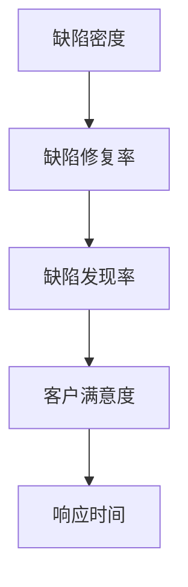
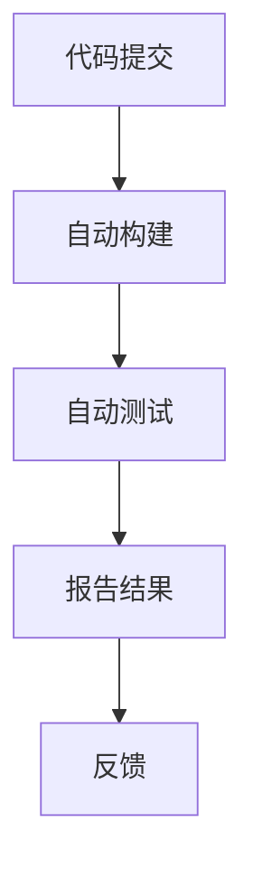
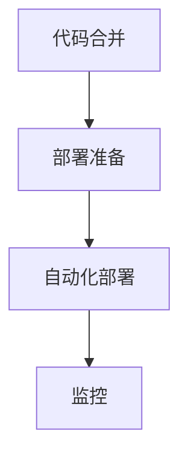

                 

### 文章标题

# 类型系统与代码审查：形式化的质量控制

类型系统是编程语言的核心组成部分，它为代码提供了丰富的语义信息和结构化框架。代码审查则是对代码质量进行监控和提升的关键手段。随着软件开发复杂度的不断增加，如何有效地利用类型系统和代码审查进行形式化的质量控制，成为了软件工程领域的重要研究方向。本文将深入探讨类型系统和代码审查的基本概念、原理及其在形式化质量控制中的应用，通过具体实例和分析，为开发者提供一套系统性的解决方案。

## 关键词

- 类型系统
- 代码审查
- 形式化质量控制
- 静态类型
- 动态类型
- 形式化方法
- 质量度量
- 持续集成

## 摘要

本文旨在探讨类型系统与代码审查在软件质量保证中的关键作用。首先，通过回顾类型系统的基本概念和类型检查、类型推断等核心机制，介绍类型系统的两大阵营——静态类型系统和动态类型系统。接着，深入讨论代码审查的定义、类型及其过程，并分析自动化代码审查工具的优劣。在此基础上，本文将详细阐述形式化代码审查的概念、优势与挑战，以及常见形式化方法工具的运用。最后，通过质量保证的概述、质量度量方法以及持续集成和持续部署的实践，为开发者提供一套全面的质量控制框架。本文期望为读者揭示类型系统和代码审查在软件工程中的实际应用价值，并为未来研究方向提供参考。

### 目录大纲

## 第一部分：类型系统基础

## 第1章：类型系统的概述
### 1.1 类型系统的定义和作用
### 1.2 类型系统的历史发展
### 1.3 类型系统在现代编程语言中的地位

## 第2章：类型系统的基本概念
### 2.1 基本数据类型
### 2.2 复杂数据类型
### 2.3 类型检查与类型推断

## 第3章：静态类型系统
### 3.1 静态类型系统的优点
### 3.2 静态类型系统的实现
### 3.3 常见的静态类型编程语言

## 第4章：动态类型系统
### 4.1 动态类型系统的特点
### 4.2 动态类型系统的实现
### 4.3 常见的动态类型编程语言

## 第5章：类型系统在形式化方法中的应用
### 5.1 形式化方法的概述
### 5.2 形式化方法与类型系统的关系
### 5.3 常见的形式化方法工具

## 第二部分：代码审查

## 第6章：代码审查的基本概念
### 6.1 代码审查的定义和作用
### 6.2 代码审查的类型
### 6.3 代码审查的过程

## 第7章：代码审查的工具和技术
### 7.1 自动化代码审查工具
### 7.2 代码审查板
### 7.3 实践中的代码审查技巧

## 第8章：形式化代码审查
### 8.1 形式化代码审查的定义和原理
### 8.2 形式化代码审查的优势和挑战
### 8.3 常见的形式化代码审查工具

## 第三部分：质量保证

## 第9章：质量保证的概述
### 9.1 质量保证的定义和目标
### 9.2 质量保证的方法和过程
### 9.3 质量保证与代码审查的关系

## 第10章：质量度量
### 10.1 质量度量的概念和指标
### 10.2 质量度量的方法和技术
### 10.3 质量度量的实践案例

## 第11章：持续集成和持续部署
### 11.1 持续集成的概念和流程
### 11.2 持续部署的概念和流程
### 11.3 持续集成和持续部署的优势和实践

## 第12章：总结与展望
### 12.1 类型系统与代码审查的关系
### 12.2 形式化质量控制的未来发展趋势
### 12.3 对开发者的建议

## 附录
### A.1 常见类型系统的比较
### A.2 常见代码审查工具的比较
### A.3 形式化质量控制工具的比较

### 背景介绍

在现代软件开发中，代码质量和软件可靠性成为开发者和维护者面临的重大挑战。随着软件系统的复杂度不断增加，代码质量的管理和保障变得尤为重要。传统的代码审查方法依赖于人类的经验和直觉，尽管在一定程度上能够发现潜在的问题，但其效率和质量受到很大的限制。为了解决这一问题，形式化的质量控制方法逐渐受到关注。

形式化的质量控制方法通过引入严格的数学模型和形式化工具，对代码进行结构化分析，从而提高代码质量和可靠性。其中，类型系统和代码审查是形式化质量控制的重要组成部分。类型系统为代码提供了丰富的类型信息，有助于预防类型错误和提升代码的可读性。而代码审查则通过系统化的检查和评估，发现代码中的潜在问题，确保代码的正确性和健壮性。

本文将首先介绍类型系统的基本概念和分类，详细分析静态类型系统和动态类型系统的特点及其适用场景。接着，将探讨代码审查的定义、类型和过程，分析自动化代码审查工具的优劣。在此基础上，本文将深入讨论形式化代码审查的概念、优势与挑战，介绍常见的形式化方法工具。随后，通过质量保证的概述和质量度量方法，为开发者提供一套全面的质量控制框架。最后，本文将总结类型系统与代码审查的关系，探讨形式化质量控制的未来发展趋势，并提出对开发者的建议。

### 类型系统概述

类型系统是编程语言的核心组成部分，它为代码提供了丰富的语义信息和结构化框架，是确保程序正确性和可维护性的关键因素。在编程中，类型系统不仅定义了变量的数据结构，还规定了操作这些数据的规则和限制。类型系统的主要作用包括以下几个方面：

1. **错误检测**：类型系统可以在编译或运行时检测类型错误，例如将整数与字符串进行混合操作。通过类型检查，可以提前发现和纠正这些错误，避免程序在运行时崩溃。

2. **代码优化**：类型信息有助于编译器进行代码优化，如常量折叠、循环展开等。类型系统提供了足够的信息，使得编译器能够生成更高效的机器代码。

3. **代码可读性**：明确的类型定义提高了代码的可读性和可理解性，使开发者更容易理解和维护代码。

4. **模块化与抽象**：类型系统支持模块化和抽象，使得开发者可以定义复杂的抽象数据类型和接口，从而简化代码结构，提高代码复用性。

#### 历史发展

类型系统的概念可以追溯到早期编程语言。在20世纪50年代和60年代，编程语言如FORTRAN和COBOL开始引入简单的数据类型和类型检查机制。随着编程语言的不断发展，类型系统也在不断进化。

1. **早期类型系统**：早期的编程语言如PL/I和ALGOL68引入了更复杂的类型系统，包括结构化类型和抽象数据类型。这些语言开始支持类型检查和类型推断，提高了代码的可靠性和可维护性。

2. **动态类型系统**：20世纪80年代，面向对象的编程语言如Smalltalk和Self引入了动态类型系统。动态类型系统在运行时进行类型检查，使得程序更灵活，但也引入了类型错误的可能性。

3. **静态类型系统**：随着函数式编程语言如Haskell和ML的发展，静态类型系统得到了广泛关注。静态类型系统在编译时进行类型检查，确保程序的类型安全，提高了代码的可靠性。

4. **现代类型系统**：现代编程语言如Java、C#和TypeScript结合了静态和动态类型系统的优点，提供了更丰富的类型系统和类型推断机制，使得开发者能够更高效地编写和维护代码。

#### 现代编程语言中的地位

在现代编程语言中，类型系统扮演着至关重要的角色。以下是几种现代编程语言中类型系统的特点：

1. **Java**：Java是一种静态类型语言，其类型系统确保了程序的类型安全。Java支持基本数据类型、类和接口等复杂类型，提供了强大的类型检查机制。

2. **C#**：C#同样是一种静态类型语言，其类型系统与Java相似，但也引入了泛型编程，提供了更丰富的类型抽象和代码复用。

3. **TypeScript**：TypeScript是JavaScript的一个超集，它引入了静态类型系统，使得JavaScript代码能够享受类型安全带来的优势。TypeScript通过类型推断和类型检查，提高了代码的可靠性和可维护性。

4. **Haskell**：Haskell是一种纯函数式编程语言，其类型系统非常强大，支持类型类和存在类型等高级特性。Haskell的类型系统在编译时确保了类型安全和程序的正确性。

5. **Python**：Python是一种动态类型语言，其类型系统相对简单，但提供了动态类型检查和类型推断。Python的类型系统在运行时进行类型检查，这使得Python代码具有很高的灵活性和易用性。

类型系统在现代编程语言中的重要性不言而喻。它不仅确保了程序的类型安全，还提高了代码的可读性和可维护性。通过合理地设计和使用类型系统，开发者可以更高效地编写和维护复杂的软件系统。

#### 类型系统的基本概念

类型系统是编程语言的核心组成部分，它通过定义数据类型和操作规则，确保代码的正确性和可靠性。在深入探讨静态类型系统和动态类型系统之前，我们先来介绍类型系统的基本概念。

##### 基本数据类型

基本数据类型是编程语言中最基础的数据类型，它们通常包括整数（Integer）、浮点数（Floating-point）、布尔值（Boolean）、字符串（String）等。不同编程语言的基本数据类型可能有所不同，但它们通常都具有以下特点：

1. **固定大小**：基本数据类型通常具有固定的大小，例如一个整数通常占用32位或64位空间。
2. **不可变性**：基本数据类型是不可变的，即一旦创建，其值不能被修改。
3. **操作规则**：每种基本数据类型都有特定的操作规则，例如整数可以进行加、减、乘、除等运算。

基本数据类型是构建复杂数据结构的基础。在许多编程语言中，基本数据类型还可以通过组合或封装形成更复杂的数据类型，如结构体、类等。

##### 复杂数据类型

复杂数据类型是由基本数据类型组合或封装而成的，它们通常具有更丰富的功能和更复杂的操作规则。常见的复杂数据类型包括：

1. **数组（Array）**：数组是一种线性数据结构，它由一组相同类型的数据元素组成。数组支持随机访问，使得查找和访问元素非常高效。数组通常通过索引进行访问，索引是从0开始的整数。

2. **列表（List）**：列表是一种灵活的数据结构，它由一系列元素组成，元素可以是不同的类型。列表支持插入、删除和更新操作，使得它在处理动态数据时非常灵活。常见的列表实现包括链表、栈和队列等。

3. **映射（Map）**：映射是一种关联数组，它将键（Key）与值（Value）进行映射。映射通过键来访问值，这使得查找和更新操作非常高效。映射通常支持键的存在性检查、键值对添加和删除等操作。

4. **结构体（Struct）**：结构体是一种复合数据类型，它将多个基本数据类型组合成一个单一的实体。结构体常用于定义复杂的实体和对象，例如在C语言中定义的结构体可以包含多个整型、浮点型等成员变量。

5. **类（Class）**：类是一种面向对象编程中的复杂数据类型，它定义了一组属性和方法，用于封装数据和操作。类通过实例化生成对象，使得数据和行为紧密结合起来。类支持继承、多态等面向对象特性，大大提高了代码的可复用性和可维护性。

##### 类型检查与类型推断

类型检查（Type Checking）是编译器或解释器对程序中的类型一致性进行检查的过程。类型检查通常分为静态类型检查和动态类型检查。

1. **静态类型检查**：静态类型检查在编译时进行，编译器根据程序代码中的类型声明和类型规则，检查变量、函数等是否符合类型要求。静态类型检查可以提前发现类型错误，例如类型不匹配、未声明的变量等，从而提高程序的可靠性。

2. **动态类型检查**：动态类型检查在运行时进行，解释器根据程序执行时的实际类型信息进行检查。动态类型检查提供了更大的灵活性，但可能引入类型错误，需要开发者额外注意类型安全。

类型推断（Type Inference）是编译器根据程序上下文信息，自动推断变量、函数等类型的过程。类型推断可以减少代码中的显式类型声明，提高代码的可读性和简洁性。

类型检查和类型推断是类型系统的核心机制，它们确保程序中的操作符合类型规则，从而提高程序的可靠性和可维护性。

通过以上对基本数据类型、复杂数据类型以及类型检查和类型推断的介绍，我们可以更好地理解类型系统的基本概念。接下来，我们将进一步探讨静态类型系统和动态类型系统的特点和区别。

#### 静态类型系统

静态类型系统是一种在程序编译时进行类型检查的机制，它要求开发者明确声明变量的类型。静态类型系统的优点包括：

1. **早期错误检测**：由于类型检查在编译时进行，可以提前发现类型错误，如未声明的变量、类型不匹配等，从而减少程序在运行时发生错误的可能性。

2. **更好的性能优化**：静态类型系统为编译器提供了丰富的类型信息，使得编译器能够进行更高效的代码生成和优化。例如，编译器可以提前知道变量的数据类型，从而进行常量折叠、循环展开等优化。

3. **更严格的类型约束**：静态类型系统要求开发者明确声明变量的类型，这有助于防止类型错误，提高代码的健壮性和可靠性。

静态类型系统的实现通常依赖于类型检查器（Type Checker），它对程序中的表达式、函数和变量进行类型分析。类型检查器通过以下步骤实现类型检查：

1. **类型推断**：类型检查器首先尝试从程序代码中推断出变量的类型。这通常基于变量的声明、赋值和函数调用等上下文信息。

2. **类型匹配**：类型检查器接着检查变量、函数调用和表达式是否满足类型要求。如果存在类型不匹配的情况，类型检查器会报错并提示开发者。

3. **类型记录**：类型检查器将检查结果记录在程序符号表中，为后续的代码生成和优化提供类型信息。

常见的静态类型编程语言包括：

1. **Haskell**：Haskell是一种纯函数式编程语言，它具有强大的静态类型系统，支持类型类和多态等高级特性。Haskell的类型系统在编译时确保程序的类型安全，提供了良好的编译时错误检测。

2. **OCaml**：OCaml是一种多范式编程语言，它结合了面向对象、函数式编程和逻辑编程的特点。OCaml的静态类型系统提供了严格的类型检查和类型推断机制，有助于提高代码的可靠性和可维护性。

3. **C++**：C++是一种多范式编程语言，它支持面向对象、过程式和泛型编程。C++的静态类型系统使得开发者可以灵活地使用各种编程范式，同时确保程序的正确性和性能。

静态类型系统在保证程序正确性和性能方面具有显著优势，但同时也可能增加开发者的负担，因为需要明确声明所有变量的类型。然而，随着类型推断和静态分析工具的发展，静态类型系统的使用逐渐变得简便和高效。

#### 动态类型系统

动态类型系统是一种在程序运行时进行类型检查的机制，它允许开发者不显式声明变量的类型。动态类型系统的优点包括：

1. **灵活性和简洁性**：动态类型系统允许开发者更灵活地编写代码，减少了类型声明的复杂性。这种灵活性特别适用于快速开发和原型设计。

2. **减少样板代码**：由于无需显式声明类型，动态类型系统可以减少样板代码，使得代码更加简洁和易于阅读。

3. **动态类型转换**：动态类型系统允许在运行时进行类型转换，这使得程序能够处理更广泛的数据类型和更复杂的数据结构。

动态类型系统的实现依赖于运行时类型检查器（Runtime Type Checker），它在程序运行过程中检查变量、函数调用和表达式的类型。动态类型检查通常包括以下步骤：

1. **类型绑定**：在程序运行时，动态类型系统为每个变量分配内存，并绑定其类型。这种绑定可以是静态的，也可以是动态的，取决于具体实现。

2. **类型检查**：运行时类型检查器在每次变量访问或函数调用时，检查变量和函数的类型是否匹配。如果类型不匹配，程序会抛出类型错误。

3. **类型转换**：动态类型系统提供了类型转换机制，允许在运行时将一种类型的数据转换为另一种类型。类型转换可以是隐式的，也可以是显式的。

常见的动态类型编程语言包括：

1. **Python**：Python是一种动态类型语言，它的类型系统在运行时进行类型检查。Python的类型推断机制相对简单，但足够强大，使得开发者能够轻松地编写高效的代码。

2. **JavaScript**：JavaScript是一种动态类型语言，广泛用于前端和后端开发。JavaScript的类型系统相对灵活，支持多种类型，包括数字、字符串、布尔值、数组、函数等。

3. **Ruby**：Ruby是一种动态类型语言，以其简洁的语法和强大的特性而著称。Ruby的类型系统在运行时进行类型检查，提供了丰富的动态类型转换机制。

动态类型系统在开发效率和灵活性方面具有显著优势，但可能降低程序的可读性和可靠性。由于类型检查在运行时进行，一些类型错误可能直到程序运行时才被发现，这需要开发者特别注意类型安全。然而，随着动态类型语言的不断发展和优化，这些缺点正在逐渐得到解决。

#### 类型系统在形式化方法中的应用

形式化方法是计算机科学中用于描述、验证和设计系统的一种严谨方法。形式化方法通过使用数学模型和严格的逻辑推理，确保系统的正确性和可靠性。类型系统作为形式化方法的重要组成部分，在系统建模、验证和测试中发挥着关键作用。

##### 形式化方法的概述

形式化方法是一种系统化的方法，它通过数学模型和逻辑推理来描述和验证计算机系统的行为。形式化方法的核心理念包括以下几个方面：

1. **形式化描述**：形式化方法使用精确的数学语言描述系统，避免了自然语言描述中的歧义和模糊性。形式化描述通常采用计算代数、形式语言和逻辑等工具。

2. **验证和验证**：形式化方法通过严格的推理和验证过程，确保系统满足预定的需求规格和设计约束。验证包括模型检查、定理证明和测试等手段。

3. **规范化和标准化**：形式化方法通过规范化文档和标准化的工具，提高了系统开发过程的可重复性和可追溯性。

形式化方法在许多领域有着广泛的应用，包括硬件设计、软件工程、安全系统和形式化验证等。

##### 形式化方法与类型系统的关系

类型系统在形式化方法中扮演着重要角色，它通过提供类型信息和约束，为系统建模和验证提供了坚实的基础。形式化方法与类型系统之间的关系可以概括为以下几点：

1. **类型安全**：形式化方法通过类型系统确保程序在运行时不会发生类型错误。类型安全是形式化方法的核心目标之一，它通过严格的类型约束和类型检查，防止不合法的操作和错误。

2. **抽象和模块化**：类型系统支持抽象和模块化，使得系统可以分解为更小、更易于管理和验证的模块。抽象和模块化有助于提高系统的可维护性和可扩展性。

3. **推理和证明**：形式化方法中的逻辑推理和定理证明依赖于类型系统的支持。类型信息可以用于推理程序的正确性和行为，从而简化验证过程。

##### 常见的形式化方法工具

以下是一些常见的形式化方法工具，它们在类型系统中的应用非常广泛：

1. **Coq**：Coq是一种互动式定理证明器，它支持形式化数学和逻辑编程。Coq提供了丰富的类型系统，支持构造性证明和类型检查。

2. **Isabelle**：Isabelle是一种形式化验证环境，它支持多种逻辑和形式化方法。Isabelle的定理证明器基于类型系统，能够验证程序的正确性和性质。

3. **KeY**：KeY是一种基于B方法的形式化验证工具，它用于验证嵌入式系统的行为。KeY利用类型系统进行模型检查和定理证明，确保系统满足规格说明和约束。

4. **TLA+**：TLA+（Temporal Logic of Actions plus）是一种用于系统建模和验证的形式化方法。TLA+使用一种简化的线性时间逻辑，结合类型系统，描述系统的行为和状态转换。

类型系统在形式化方法中的应用，不仅提高了系统的类型安全性和可靠性，还简化了系统建模和验证的过程。通过形式化方法和类型系统的结合，开发者可以更精确地描述系统的行为，并确保其正确性和一致性。

#### 代码审查的基本概念

代码审查（Code Review）是软件工程中用于评估代码质量和可靠性的关键手段。它通过系统化的检查和评估，发现代码中的潜在问题，确保代码的正确性和可维护性。代码审查不仅包括对代码本身的审查，还涉及代码设计、注释、文档等多个方面。

##### 定义和作用

代码审查的定义可以简单概括为：开发者之间对代码进行评估和讨论的过程。代码审查的主要作用包括：

1. **错误检测**：代码审查有助于发现代码中的语法错误、逻辑错误和潜在缺陷，从而提前修复，避免程序在运行时出现意外错误。

2. **质量提升**：通过代码审查，开发者可以学习最佳实践和规范，提高代码的可读性、可维护性和可扩展性。

3. **知识传递**：代码审查过程促进了团队成员之间的知识传递和经验分享，有助于提高整体开发水平。

4. **规范遵守**：代码审查确保代码遵循项目的设计规范、编程标准和代码风格指南，保持代码的一致性和规范性。

##### 类型

代码审查可以分为多种类型，根据审查的深度和目的不同，可以分为以下几种：

1. **形式审查**：形式审查主要关注代码的格式和风格，如命名规则、代码布局、注释完整性等。形式审查通常由工具自动完成，但也可以由开发人员进行手动检查。

2. **功能审查**：功能审查关注代码的功能实现是否正确，是否满足需求和设计规格。功能审查通常涉及代码逻辑、边界条件和异常处理等方面。

3. **安全审查**：安全审查旨在发现代码中的安全漏洞，如注入攻击、越权访问和缓冲区溢出等。安全审查通常需要具备专业安全知识的人员参与。

4. **性能审查**：性能审查关注代码的执行效率和性能优化，如算法选择、数据结构和资源使用等。性能审查有助于确保代码在资源有限的环境下能够高效运行。

5. **代码风格审查**：代码风格审查关注代码的编写风格和规范性，如代码可读性、可维护性和一致性。代码风格审查有助于保持代码的整体美观性和一致性。

##### 过程

代码审查的过程通常包括以下几个步骤：

1. **准备**：在开始代码审查之前，开发者需要准备好要审查的代码。这包括编写清晰的注释、遵循代码规范和编写全面的测试用例。

2. **分配**：代码审查通常由项目负责人或资深开发者分配给团队成员。分配时需要明确审查的目标和要求。

3. **审查**：审查过程中，审查人员逐行阅读代码，关注代码的语法、逻辑、安全性和性能等方面。审查可以通过人工检查，也可以借助自动化工具进行辅助。

4. **反馈**：审查结束后，审查人员需要向开发者提供详细的反馈。反馈应包括发现的问题、建议的改进措施和相关的参考资料。

5. **修正**：开发者根据审查反馈对代码进行修改，修复发现的问题。修改后的代码需要再次进行审查，确保问题已得到妥善解决。

6. **记录**：代码审查的结果需要记录在案，以便后续的跟踪和评估。记录应包括审查时间、审查人员、审查内容和反馈情况等。

通过代码审查，开发者可以及时发现和解决代码中的问题，提高代码的质量和可靠性，确保软件系统的稳定运行。代码审查不仅是一种质量控制手段，也是团队知识传递和经验积累的重要方式。

#### 代码审查的工具和技术

在现代软件开发过程中，代码审查是确保代码质量和安全性的重要手段。为了提高代码审查的效率和准确性，开发者们开发了多种代码审查工具和技术。以下将详细介绍几种常见的代码审查工具和技术，包括自动化代码审查工具、代码审查板以及实践中的代码审查技巧。

##### 自动化代码审查工具

自动化代码审查工具能够自动检测代码中的潜在问题，如语法错误、代码风格问题、安全漏洞等。这些工具通过规则库和静态分析技术实现，可以显著提高代码审查的效率和准确性。以下是几种常见的自动化代码审查工具：

1. **SonarQube**：SonarQube是一款开源的自动化代码审查平台，它支持多种编程语言，能够检测代码中的语法错误、潜在缺陷和代码风格问题。SonarQube提供了丰富的规则库，能够自定义规则和插件，满足不同项目的需求。

2. **Checkstyle**：Checkstyle是一款用于检查Java代码风格和复杂性的工具。它可以根据预定义的规则检查代码是否符合编码规范，如命名规则、括号使用和缩进等。Checkstyle通过插件机制支持多种编程语言。

3. **PMD**：PMD（Programming Mistake Detector）是一款开源的Java代码检查工具，它能够检测代码中的潜在问题，如未使用的变量、过长的方法、空代码块等。PMD提供了丰富的规则库，并支持自定义规则。

4. **FindBugs**：FindBugs是一款基于Java的自动化错误检测工具，它能够检测代码中的各种潜在问题，如空代码、未处理的异常、未使用的对象等。FindBugs通过静态代码分析技术实现，具有较高的准确性。

这些自动化代码审查工具不仅能够提高代码审查的效率，还能为开发者提供详细的错误报告和建议，帮助他们快速修复代码中的问题。

##### 代码审查板

代码审查板（Code Review Board，简称CRB）是一种集中管理和跟踪代码审查过程的工具。代码审查板通常具有以下功能：

1. **代码提交**：开发者将代码提交到代码审查板，触发审查流程。

2. **审查任务分配**：代码审查板允许项目负责人将审查任务分配给其他开发者，并设置审查的截止日期。

3. **审查反馈**：审查人员可以在代码审查板上提供详细的反馈，包括问题的描述、修改建议和相关文档链接。

4. **代码修改**：开发者根据审查反馈对代码进行修改，并在代码审查板上提交修改版本。

5. **审批流程**：代码审查板支持多级审批流程，确保代码经过充分的审查和验证。

常见的代码审查板工具包括：

1. **GitHub Pull Requests**：GitHub Pull Requests 是GitHub内置的代码审查工具，它支持代码的提交、审查和合并。开发者可以在Pull Requests中讨论代码更改，并提供详细的审查反馈。

2. **GitLab Merge Requests**：GitLab Merge Requests 与GitHub Pull Requests 功能类似，是GitLab内置的代码审查和合并工具。GitLab Merge Requests 支持多种编程语言的代码审查，并提供详细的审查历史记录。

3. **Gerrit**：Gerrit 是一款基于Git的代码审查工具，它支持代码的提交、审查和合并。Gerrit 具有高度的可定制性，支持多种插件和扩展，适用于大型项目和团队协作。

代码审查板不仅能够提高代码审查的效率和透明度，还能确保代码质量和一致性，降低项目风险。

##### 实践中的代码审查技巧

在实际代码审查过程中，为了提高审查效率和代码质量，开发者可以运用以下技巧：

1. **定期审查**：定期进行代码审查有助于保持代码的整洁和高质量。项目团队可以制定合理的审查周期，确保每个提交都经过审查。

2. **明确审查目标**：在开始审查前，明确审查的目标和要求，有助于审查人员集中精力发现关键问题。审查目标可以包括代码风格、功能实现、性能优化和安全性等。

3. **详细记录反馈**：在代码审查过程中，审查人员应详细记录发现的问题和建议，并提供具体的修改建议和参考资料。这有助于开发者快速理解和解决问题。

4. **及时沟通**：代码审查过程中，审查人员和开发者应保持良好的沟通，及时讨论和解决审查中遇到的问题。沟通可以通过邮件、即时消息或代码审查板进行。

5. **代码测试**：在代码审查过程中，确保代码经过充分的测试。测试用例应覆盖关键功能和边界条件，以确保代码的正确性和健壮性。

通过运用这些代码审查技巧，开发者可以更高效地进行代码审查，提高代码的质量和可靠性。

#### 形式化代码审查

形式化代码审查是一种通过数学模型和形式化方法对代码进行严格验证的代码审查方法。它旨在通过形式化的方法确保代码的正确性和安全性，从而提高软件质量。形式化代码审查不仅依赖于传统的代码审查流程，还引入了形式化的验证技术和工具。

##### 定义和原理

形式化代码审查的定义可以理解为：使用数学模型和形式化验证技术对代码进行审查，以确保代码满足预定的需求规格和设计约束。形式化代码审查的原理主要包括以下几个方面：

1. **形式化描述**：形式化代码审查要求对代码进行形式化的描述，即使用数学模型或形式化语言描述代码的行为和属性。形式化的描述使得代码的语义变得明确和精确，从而为验证提供了基础。

2. **验证技术**：形式化代码审查使用各种验证技术，如模型检查、定理证明和符号执行等，对代码进行验证。这些技术能够自动或半自动地检查代码的正确性和安全性，发现潜在的错误和缺陷。

3. **验证工具**：形式化代码审查依赖于专门的验证工具，这些工具能够处理形式化的描述，执行验证算法，并生成验证结果。常见的验证工具包括模型检查器、定理证明器和符号执行工具等。

##### 优势

形式化代码审查具有以下显著优势：

1. **严格的类型检查**：形式化代码审查通过严格的类型检查确保代码的类型安全，避免了类型错误和类型不匹配的问题。

2. **形式化的验证**：形式化代码审查使用形式化的方法对代码进行验证，能够发现传统代码审查难以发现的深层次的错误和缺陷。

3. **自动化的错误检测**：形式化代码审查工具能够自动检测代码中的错误和缺陷，提高审查效率和准确性，减少人工审查的工作量。

4. **代码的清晰性和可理解性**：形式化代码审查要求代码进行形式化的描述，这有助于提高代码的清晰性和可理解性，使代码更容易维护和扩展。

##### 挑战

尽管形式化代码审查具有显著优势，但在实际应用中也面临一些挑战：

1. **复杂性和难度**：形式化代码审查要求开发者具备一定的数学和形式化验证知识，这对开发者的技能要求较高。

2. **工具和资源依赖**：形式化代码审查依赖于专门的验证工具，这些工具可能需要大量的计算资源和时间，增加了开发和维护的成本。

3. **验证规模和范围**：形式化代码审查的规模和范围有限，无法涵盖所有可能的代码路径和组合，这可能导致一些潜在的错误和缺陷无法被检测到。

4. **维护和更新**：形式化代码审查工具和验证模型需要定期更新和维护，以适应新的编程语言和开发环境，这增加了开发者的工作负担。

##### 常见的形式化代码审查工具

以下是一些常见的形式化代码审查工具：

1. **Coq**：Coq 是一款基于交互式定理证明的验证工具，它支持形式化的描述和验证，适用于复杂的系统级代码。

2. **Isabelle**：Isabelle 是一款基于形式逻辑的定理证明器，它支持多种形式化方法和验证技术，适用于数学证明和系统验证。

3. **KEYS**：KEYS 是一款基于 B 方法的形式化验证工具，它用于验证嵌入式系统的行为，具有高可靠性和强表达能力。

4. **TLA+**：TLA+ 是一种用于系统建模和验证的时态逻辑，它通过形式化的描述和验证，确保系统的正确性和一致性。

形式化代码审查为软件质量保证提供了强有力的支持，通过严格的数学模型和形式化验证技术，能够显著提高代码的正确性和安全性。尽管面临一些挑战，但形式化代码审查的潜力巨大，未来有望在软件工程中得到更广泛的应用。

#### 质量保证概述

质量保证（Quality Assurance，简称QA）是软件工程中的一个关键环节，它旨在确保软件产品在开发过程中和发布后的所有阶段都满足预定的质量标准。质量保证的目标不仅仅是发现和修复代码中的错误，还包括提升软件的整体性能、可靠性和可维护性。以下从定义、目标和方法三个方面对质量保证进行概述。

##### 定义

质量保证可以定义为：通过一系列规范和流程，确保软件产品在开发过程中满足既定的质量标准，从而提高客户满意度和降低维护成本。质量保证不仅仅是技术活动，还包括管理活动，如流程优化、资源分配和风险管理。

质量保证通常涉及以下几个方面：

1. **需求管理**：确保软件需求被正确理解和记录，需求变更得到妥善管理。

2. **设计验证**：验证软件设计是否符合需求和规范，确保设计阶段的错误不会传递到实现阶段。

3. **代码审查**：通过代码审查发现和修复代码中的错误和缺陷，提高代码质量。

4. **测试**：设计并执行各种测试用例，确保软件功能、性能和安全性符合预期。

5. **部署和维护**：确保软件在部署后能够稳定运行，及时修复发现的问题和缺陷。

##### 目标

质量保证的主要目标包括以下几个方面：

1. **错误减少**：通过严格的代码审查和测试，减少软件中的错误和缺陷，提高软件的可靠性。

2. **性能优化**：通过性能测试和优化，确保软件在各种负载和环境下都能高效运行。

3. **客户满意度**：通过确保软件满足客户的需求和期望，提高客户满意度，增加市场份额。

4. **合规性**：确保软件符合相关的法规和标准，如ISO 9001、CMMI等。

5. **可维护性**：通过良好的设计和编码实践，提高软件的可维护性，降低长期维护成本。

##### 方法

质量保证的方法和过程包括以下几个步骤：

1. **需求分析**：与客户和利益相关者沟通，明确软件需求，并制定详细的需求文档。

2. **设计评审**：对软件设计进行评审，确保设计符合需求和技术规范。

3. **代码审查**：通过代码审查发现和修复代码中的错误和缺陷，确保代码质量和一致性。

4. **测试计划**：制定详细的测试计划，包括测试类型、测试用例设计、测试环境和测试资源等。

5. **测试执行**：执行测试计划中的各种测试用例，收集测试结果，并分析测试数据。

6. **缺陷管理**：记录和管理测试中发现的缺陷，确保所有缺陷都被跟踪和修复。

7. **部署和监控**：确保软件在部署后的稳定运行，并进行持续监控，及时发现和处理问题。

8. **持续改进**：通过定期回顾和总结质量保证过程中的问题和经验，不断改进质量保证方法和流程。

通过上述方法和过程，质量保证确保软件产品在开发、测试和部署的各个阶段都符合预定的质量标准，从而提高软件的整体质量和可靠性。

#### 质量度量

质量度量是软件质量保证的重要组成部分，它通过量化的指标和方法对软件产品的质量进行评估。质量度量不仅有助于识别和解决质量问题，还可以为项目管理提供关键数据支持。以下从概念、指标和方法三个方面详细探讨质量度量。

##### 概念

质量度量（Quality Measurement）是指通过量化的方式对软件产品的质量特性进行评估。质量度量不仅关注软件的功能性和性能，还包括可靠性、可维护性、安全性和用户满意度等多个方面。质量度量的目的是：

1. **识别问题**：通过量化的指标识别软件中的缺陷和不足，从而采取改进措施。
2. **改进过程**：为质量保证过程提供数据支持，帮助团队优化流程和方法。
3. **决策支持**：为项目管理决策提供数据依据，如资源分配、进度控制等。

##### 指标

质量度量涉及多个方面的指标，以下是一些常见的质量度量指标：

1. **缺陷密度**：缺陷密度是衡量软件质量的一个重要指标，通常定义为每千行代码中发现的缺陷数。缺陷密度可以反映代码的复杂度和维护难度。

   $$\text{缺陷密度} = \frac{\text{缺陷数}}{\text{代码行数}} \times 1000$$

2. **缺陷修复率**：缺陷修复率衡量团队在给定时间内修复缺陷的能力。缺陷修复率越高，说明团队对缺陷的处理能力越强。

   $$\text{缺陷修复率} = \frac{\text{已修复的缺陷数}}{\text{总缺陷数}} \times 100\%$$

3. **缺陷发现率**：缺陷发现率表示在测试过程中发现的缺陷占总缺陷数的比例，它反映了测试的全面性和有效性。

   $$\text{缺陷发现率} = \frac{\text{测试中发现的缺陷数}}{\text{总缺陷数}} \times 100\%$$

4. **客户满意度**：客户满意度是衡量软件产品质量的一个重要指标，可以通过用户调查、反馈等方式进行评估。

   $$\text{客户满意度} = \frac{\text{满意的客户数}}{\text{总客户数}} \times 100\%$$

5. **响应时间**：响应时间衡量团队对问题响应的速度，包括从问题报告到解决的时间。响应时间越短，说明团队对问题的处理能力越强。

   $$\text{响应时间} = \frac{\text{处理时间}}{\text{总问题数}}$$

##### 方法

质量度量方法包括数据收集、分析和报告三个主要步骤：

1. **数据收集**：通过自动化工具、人工审查和用户反馈等方式收集质量度量所需的数据。数据收集应确保数据的准确性和完整性。

2. **数据分析**：对收集到的数据进行整理和分析，使用统计方法、图表等工具展示分析结果。数据分析的目的是识别趋势、异常和潜在问题。

3. **报告**：编写质量度量报告，详细描述分析结果和结论。报告应包括关键指标、趋势图、异常情况和建议等。

以下是一个简单的示例：

通过上述示例，可以直观地展示质量度量的多个指标及其相互关系。例如，如果缺陷密度较高，可能需要审查代码审查和测试过程，以提高缺陷发现率；如果客户满意度较低，可能需要改进用户体验和功能设计。

通过质量度量，开发者可以全面了解软件产品的质量状况，及时识别和解决问题，持续改进质量。质量度量不仅为质量保证提供了数据支持，也为项目管理提供了决策依据，有助于实现高质量软件产品的交付。

#### 持续集成与持续部署

持续集成（Continuous Integration，CI）和持续部署（Continuous Deployment，CD）是现代软件开发中提高开发效率和软件质量的重要实践。通过CI和CD，开发者可以自动化代码集成和部署过程，确保软件的持续改进和可靠性。

##### 持续集成的概念和流程

持续集成是一种软件开发实践，通过自动化构建和测试，确保每次代码变更都能顺利集成到主分支中。CI的主要目标是：

1. **快速反馈**：通过自动化构建和测试，开发者可以快速得知自己的代码变更是否与其他代码兼容，并及时修复问题。
2. **减少集成成本**：频繁的集成可以减少代码库中的集成成本，避免大规模集成时的风险。
3. **提高代码质量**：持续集成有助于发现早期错误，减少累积的缺陷。

持续集成的流程通常包括以下步骤：

1. **代码提交**：开发者将代码提交到版本控制系统中。
2. **构建**：构建系统自动编译代码并生成可执行文件。
3. **测试**：运行一系列自动化测试，包括单元测试、集成测试和性能测试。
4. **报告**：将测试结果报告给开发者，包括成功和失败情况。
5. **反馈**：对于失败的构建，系统会通知相关开发者，并可能自动阻止代码提交。

以下是一个简单的CI流程图：

##### 持续部署的概念和流程

持续部署是一种自动化软件发布和部署的方法，通过自动化流程确保软件在各个环境中稳定运行。CD的主要目标是：

1. **快速发布**：通过自动化部署，可以快速将代码发布到生产环境，缩短发布周期。
2. **提高可靠性**：自动化部署可以减少人为错误，确保软件在各个环境中的稳定性和一致性。
3. **持续改进**：CD支持持续改进和反馈循环，使团队能够快速响应市场需求。

持续部署的流程通常包括以下步骤：

1. **代码合并**：将经过CI验证的代码合并到主分支。
2. **部署准备**：配置和生产环境相同的部署环境，包括服务器、数据库等。
3. **自动化部署**：通过脚本或部署工具自动化部署代码到生产环境。
4. **监控**：在部署后监控应用的性能和稳定性，确保其正常运行。

以下是一个简单的CD流程图：

##### 持续集成和持续部署的优势和实践

持续集成和持续部署带来了以下优势：

1. **快速反馈**：通过CI，开发者可以快速得知自己的代码变更是否符合预期，提高开发效率。
2. **减少风险**：CI和CD减少了代码集成和部署中的风险，确保代码质量和系统的稳定性。
3. **缩短发布周期**：通过自动化流程，可以快速将新功能和修复发布到生产环境，提高市场响应速度。
4. **持续改进**：CI和CD支持持续改进和反馈循环，使团队能够不断优化开发流程和软件质量。

为了实现CI和CD，开发者可以采取以下实践：

1. **自动化构建和测试**：使用CI工具（如Jenkins、GitLab CI）自动化构建和测试，确保每次提交都经过验证。
2. **配置管理**：使用配置管理工具（如Ansible、Puppet）自动化部署和管理环境配置。
3. **容器化**：使用容器化技术（如Docker）确保环境的一致性，简化部署过程。
4. **持续反馈**：定期收集用户反馈，快速响应和修复问题，持续改进软件质量。

通过持续集成和持续部署，开发者可以更高效地开发、测试和部署软件，提高代码质量和软件可靠性，缩短发布周期，实现持续改进和反馈循环。

#### 总结与展望

类型系统和代码审查作为软件工程中的关键工具，共同构建了软件质量保证的基石。类型系统通过提供丰富的类型信息，确保程序的正确性和性能；代码审查则通过系统化的检查和评估，发现并修复代码中的潜在问题，提高代码的可维护性和可靠性。形式化质量控制方法进一步将这些传统方法与严格的数学模型和形式化工具相结合，实现了更高层次的软件质量保障。

**类型系统与代码审查的关系**：

类型系统为代码审查提供了重要依据。静态类型系统在编译时进行类型检查，帮助编译器提前发现类型错误；动态类型系统则在运行时进行检查，确保程序在执行时类型安全。代码审查则利用类型系统的类型信息，更有效地识别和修复代码中的错误。类型系统的形式化描述和类型检查结果为形式化代码审查提供了坚实的基础，使得代码审查能够更深入、准确地验证代码的正确性。

**形式化质量控制的未来发展趋势**：

随着软件系统的复杂度和规模不断增加，形式化质量控制方法将变得更加重要。未来的发展趋势包括：

1. **形式化工具的普及**：随着形式化工具（如定理证明器、模型检查器）的成熟和普及，开发者将更方便地使用形式化方法进行代码审查和验证。

2. **跨语言的统一形式化框架**：开发统一的跨语言形式化框架，使得不同编程语言的支持更为便捷，提高形式化质量控制的普及率。

3. **人工智能与形式化质量控制的结合**：结合人工智能技术，如机器学习和自然语言处理，开发更智能的代码审查和验证工具，提高代码审查的效率和准确性。

4. **形式化方法的普及教育和培训**：加强形式化质量控制方法的普及教育和培训，提高开发者的形式化方法和工具使用能力。

**对开发者的建议**：

1. **掌握类型系统和代码审查**：深入理解类型系统的原理和应用，掌握静态类型系统和动态类型系统的区别。熟悉代码审查的基本概念和流程，善于利用代码审查工具提高代码质量。

2. **学习形式化方法**：了解形式化质量控制的基本原理和工具，尝试在项目中应用形式化方法进行代码审查和验证。

3. **持续学习和实践**：关注软件工程领域的最新进展，持续学习新技术和方法。通过实践项目，不断积累经验，提高软件质量保证能力。

类型系统与代码审查的结合，为软件质量保证提供了强大的支持。通过形式化质量控制方法，开发者可以更高效地识别和修复代码中的错误，确保软件系统的正确性和可靠性。未来的软件工程领域，形式化质量控制方法将发挥越来越重要的作用，为开发者提供更加便捷和高效的解决方案。

#### 附录

### A.1 常见类型系统的比较

在软件工程中，不同类型的编程语言和框架采用了不同的类型系统。以下是比较几种常见类型系统的表格：

| 类型系统 | 优点 | 缺点 | 适用场景 |
| --- | --- | --- | --- |
| 静态类型 | 类型安全，编译时错误检测，代码优化 | 需要显式类型声明，可能降低开发效率 | 大型项目，性能关键应用 |
| 动态类型 | 开发效率高，灵活性强 | 类型检查在运行时进行，可能降低性能 | 原型设计，快速开发 |
| 泛型类型 | 支持类型参数，提高代码复用性 | 需要复杂的类型推断机制 | 函数式编程，大型项目 |
| 强类型 | 确保变量类型一致，减少错误 | 可能限制代码灵活性 | 科学计算，数据密集型应用 |
| 弱类型 | 灵活性高，容易实现复杂操作 | 可能引入类型错误，降低代码可靠性 | 游戏开发，脚本语言 |

### A.2 常见代码审查工具的比较

多种代码审查工具提供了自动化和协作功能，帮助团队提高代码质量。以下是比较几种常见代码审查工具的表格：

| 工具 | 优点 | 缺点 | 适用场景 |
| --- | --- | --- | --- |
| SonarQube | 多语言支持，丰富的规则库，详细的报告 | 需要一定配置，资源消耗较大 | 大型项目和团队协作 |
| Checkstyle | 强调代码风格，易于配置，支持多种语言 | 主要关注代码风格，对功能性审查较弱 | 代码风格统一，中小型项目 |
| PMD | 强调代码质量，发现潜在的编程问题 | 资源消耗较大，规则较为简单 | 中小型项目 |
| FindBugs | 自动化错误检测，多语言支持 | 需要频繁更新规则库，可能误报 | 中小型项目和团队协作 |
| GitHub Pull Requests | 易于使用，集成良好 | 功能相对有限，自动化审查不足 | 开源项目和协作开发 |

### A.3 形式化质量控制工具的比较

形式化质量控制工具为代码审查和验证提供了强大的支持，以下是比较几种常见形式化质量控制工具的表格：

| 工具 | 优点 | 缺点 | 适用场景 |
| --- | --- | --- | --- |
| Coq | 强大的定理证明能力，形式化描述 | 学习曲线陡峭，资源消耗大 | 科学计算，形式化验证 |
| Isabelle | 支持多种逻辑，丰富的证明工具 | 学习难度较高，资源消耗大 | 理论计算机科学，复杂系统验证 |
| TLA+ | 简化的时态逻辑，易于理解 | 功能较为有限，适用范围有限 | 系统建模，协议验证 |
| KeY | 强大的模型检查能力，支持B方法 | 学习难度较高，需要专业培训 | 嵌入式系统，安全关键应用 |

这些工具的比较表格为开发者提供了选择合适的类型系统、代码审查工具和形式化质量控制工具的参考。开发者可以根据项目需求和团队实际情况，选择最合适的工具来提高代码质量和软件可靠性。

