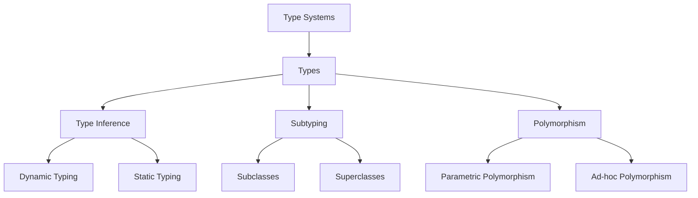
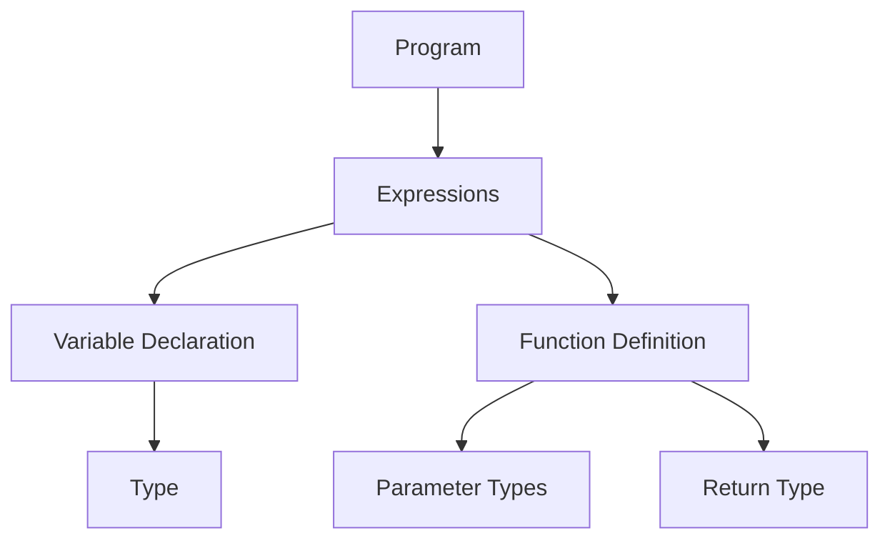

                 


### Step 1: Introduction to Type Systems

In the realm of computer science, a type system is a set of rules that assign types to various constructs of a programming language. These constructs can range from variables, functions, and modules to expressions, statements, and program literals. The primary purpose of a type system is to ensure the correctness and efficiency of a program by preventing operations that are not meaningfully defined for certain data. This notion of correctness and meaning is fundamentally tied to the semantics of the language, which encompasses the operational behavior of its constructs.

**Background Introduction**

The concept of type systems has its roots in the work of mathematical logic and set theory in the early 20th century. The development of type theory was influenced by the need to provide a solid foundation for mathematics and to address the paradoxes that arose in classical logic. Alonzo Church and his lambda calculus, along with Bertrand Russell and his type theory, played pivotal roles in shaping modern type systems.

As programming languages evolved, type systems became an integral part of their design. The first high-level programming languages, such as FORTRAN and COBOL in the 1950s and 1960s, were relatively simple and lacked formal type systems. However, the advent of languages like ALGOL 60 in the early 1960s marked a significant milestone in the formalization of type systems. The strong, static type systems found in languages like ALGOL, Pascal, and C served as a robust mechanism to catch type errors at compile-time, thus improving program reliability.

**Core Concepts and Relationships**

To understand type systems better, we need to delve into some core concepts and their interrelationships:

- **Types**: Types are categories or classes that classify data according to their characteristics. For example, in a language like Java, `int` and `float` are types that represent integer and floating-point numbers, respectively.
  
- **Type Inference**: Type inference is the process by which a type system automatically determines the type of an expression. This is particularly useful in dynamically typed languages like Python and JavaScript, where the programmer doesn't explicitly declare the types of variables.
  
- **Subtyping**: Subtyping is a relationship between types where one type is considered a subtype of another if it inherits the characteristics and behaviors of the supertype. This allows for more flexible and extensible code.

- **Polymorphism**: Polymorphism is the ability of different data types to be treated as instances of the same class through a common interface. There are two main types of polymorphism: parametric and ad-hoc.

A **Mermaid flowchart** can illustrate the relationship between these concepts:



### Step 2: Basic Type Systems

The design of a type system involves several key decisions, including how types are defined, how they are related to each other, and how type checking is performed. Let's explore some basic type systems and their characteristics.

#### Simple Type Systems

**Strengths and Limitations**

Simple type systems are characterized by a clear distinction between different types and a straightforward type-checking algorithm. One of the main strengths of simple type systems is their determinism: given a well-typed program, the behavior of the program is precisely defined and predictable.

However, simple type systems have some limitations. They often struggle with expressing complex relationships between types, such as subtyping and polymorphism. This can lead to the need for more explicit type declarations, which can clutter the code and make it less readable.

**Static and Dynamic Typing**

Static typing is a type system where the types of variables are checked at compile-time. This means that all type errors are caught before the program is run, potentially leading to more efficient execution and better performance. Examples of statically typed languages include C, C++, Java, and TypeScript.

Dynamic typing, on the other hand, checks the types of variables at runtime. This allows for more flexible and expressive code, as variables can change their types during program execution. Examples of dynamically typed languages include Python, JavaScript, and Ruby.

**Subtyping and Polymorphism**

Subtyping is a powerful concept that allows for more general types to be used in place of more specific types. For example, in Java, a `List<String>` is a subtype of `List<Object>`, because every `List<Object>` can also be a `List<String>`.

Polymorphism allows functions and methods to operate on different types while still adhering to a common interface. There are two main types of polymorphism: parametric and ad-hoc. Parametric polymorphism allows a single function or class to work with any type, as seen in the `map` function in functional programming languages like Haskell and Scala. Ad-hoc polymorphism, also known as method overloading, allows different implementations of a method to handle different types, as seen in Java.

### Step 3: Type Inference Algorithms

Type inference is the process of automatically determining the types of expressions in a program. It is a crucial aspect of dynamically typed languages and can also be beneficial in statically typed languages. Let's explore some common type inference algorithms.

#### Unification-Based Inference

Unification-based inference is a method that uses the process of unification to find the most general type that can be assigned to an expression. Unification is a form of constraint-solving where two expressions are combined to find a type that satisfies both expressions.

For example, consider the expression `x + y`. The type inference algorithm would unify the type of `x` with the type of `y`. If both are of type `int`, the result is also `int`. If one is of type `int` and the other is of type `float`, the result is `float`.

Here is a simple pseudocode for unification-based type inference:

```pseudocode
function unify(T1, T2):
    if T1 == T2:
        return T1
    elif is_variable(T1) and is_variable(T2):
        bind(T1, T2)
        return T2
    elif is_variable(T1):
        bind(T2, T1)
        return T1
    elif is_variable(T2):
        bind(T1, T2)
        return T1
    else:
        return None
```

#### Attribute Grammars

Attribute grammars are another approach to type inference that uses a grammatical framework to describe the types of expressions in a programming language. Attribute grammars define attributes for different syntactic elements of the language and specify how these attributes are computed based on the types of other elements.

Here is a simplified example of an attribute grammar for type inference:



In this grammar, `Type` represents the type of a variable or expression, and `Parameter Types` and `Return Type` represent the types of function parameters and the return value, respectively.

#### Type Inference in Practice

In practice, type inference algorithms often combine unification-based methods and attribute grammars to provide accurate and efficient type checking. For example, the type inference algorithm in Python uses a combination of these techniques to infer the types of variables and expressions in the code.

Here is a simple example of type inference in Python:

```python
def add(x, y):
    return x + y

result = add(5, 10.0)
```

The type inference algorithm would first unify the types of `x` and `y` in the `add` function. Since both are expressions that can be either `int` or `float`, the algorithm would infer the most general type `float` for both. The return type of the `add` function would also be `float`. When the function is called with the arguments `5` and `10.0`, the type inference algorithm would confirm that the types are compatible and assign the type `float` to the variable `result`.

### Conclusion

Type systems and type inference are fundamental concepts in programming languages. They ensure the correctness and efficiency of programs by providing a rigorous framework for type checking. From simple type systems to advanced type inference algorithms, understanding these concepts is crucial for anyone involved in the design and implementation of programming languages.

In the next section, we will delve deeper into the foundations of code generation, exploring the principles behind it and how it relates to type systems.

---

This concludes our first step in analyzing and structuring the content for the article. In the subsequent steps, we will expand on the core concepts and provide detailed explanations, examples, and pseudocode to enhance the understanding of type systems and code generation.

### Step 4: Foundations of Code Generation

Code generation is a critical aspect of compiler design that involves translating high-level programming language code into machine code or other executable forms. This process is essential for the execution of programs on a computer's hardware. Understanding the principles and techniques of code generation not only enhances our comprehension of compiler design but also enables the development of efficient and optimized code.

#### Principles of Code Generation

**Code Generation vs. Translation**

Code generation is often confused with code translation, but they are distinct processes. Code translation refers to the conversion of code from one programming language to another, while code generation specifically refers to the creation of executable machine code or other forms of code that can be run directly on a computer's hardware.

**Code Generation Tools**

Several tools and frameworks are commonly used in code generation:

- **Template-Based Code Generation**: Template-based code generation uses pre-defined templates to generate code based on certain input parameters. Tools like JSP (JavaServer Pages) and Velocity are popular in web development for generating HTML and other templates.

- **Code Synthesis Tools**: Code synthesis tools automatically generate code from high-level specifications or models. Examples include Spec# and other domain-specific language (DSL) tools.

- **Metaprogramming Frameworks**: Metaprogramming frameworks allow for the generation of code at runtime, enabling powerful techniques like aspect-oriented programming (AOP) and dynamic code generation. Examples include Java's AspectJ and C#'s Dynamic Language Runtime (DLR).

#### Intermediate Representations (IRs)

Intermediate Representations (IRs) are an essential concept in code generation. They serve as an abstraction layer between the source code and the target machine code. IRs are designed to be easier to analyze and manipulate than the original source code but still retain enough information to generate efficient target code.

**Introduction to IRs**

Intermediate Representations act as a bridge in the compilation process, allowing for various transformations and optimizations to be applied. There are different types of IRs, including:

- **Three-Address Code (TAC)**: TAC is a low-level IR that represents each operation with at most three addresses, making it simple to analyze and optimize.

- **Abstract Syntax Tree (AST)**: AST is a high-level IR that represents the syntactic structure of the source code, making it easier for programmers to understand and manipulate.

- **Control Flow Graph (CFG)**: CFG is a graphical representation of the control flow in a program, used for optimization and code generation.

**Design Choices for IRs**

Designing an effective IR involves several key considerations:

- **Abstraction Level**: The IR should be at a level that is simple enough to be easily analyzed and optimized but abstract enough to capture the essential semantics of the source code.

- **Expressiveness**: The IR should be expressive enough to represent all the constructs of the source language and support various optimizations.

- **Portability**: The IR should be designed to be portable across different target platforms, allowing for code generation on diverse hardware architectures.

**Common IRs and Their Roles**

Several common IRs are widely used in compiler design:

- **Java Bytecode**: Java bytecode is an IR used by the Java Virtual Machine (JVM). It is designed to be portable and abstracts away the details of the underlying hardware.

- **CIL (Common Intermediate Language)**: CIL is an IR used by the Common Language Runtime (CLR) in .NET applications. It is similar to Java bytecode but designed to be more high-level and expressive.

- **LLVM IR**: LLVM (Low-Level Virtual Machine) IR is a low-level IR used by the LLVM compiler infrastructure. It is highly portable and supports a wide range of optimizations and code generation targets.

#### Code Optimization Techniques

Code optimization is the process of improving the performance of a program by making it execute faster or use fewer resources. Several optimization techniques are commonly applied during code generation:

- **Dead Code Elimination**: This technique removes code that does not affect the program's output. For example, if a variable is assigned a value but never used, the assignment can be eliminated.

- **Common Subexpression Elimination**: This technique identifies and eliminates redundant calculations by reusing the results of previous computations.

- **Loop Optimization**: Techniques like loop unrolling, loop fusion, and loop-invariant code motion can significantly improve the performance of loops.

- **Inlining**: This technique involves replacing a function call with the actual code of the function, reducing the overhead of the call.

**Example: Loop Optimization**

Consider the following loop:

```c
for (int i = 0; i < n; i++) {
    A[i] = B[i] + C[i];
}
```

An optimization technique called loop-invariant code motion can move the assignment of `n` to a variable outside the loop, as it does not change within the loop:

```c
int loop_limit = n;
for (int i = 0; i < loop_limit; i++) {
    A[i] = B[i] + C[i];
}
```

This optimization reduces the number of operations inside the loop and can lead to performance improvements.

### Conclusion

In this section, we have explored the foundations of code generation, including the principles behind it, the role of intermediate representations, and common optimization techniques. Understanding these concepts is crucial for anyone involved in compiler design and the development of efficient and optimized code. In the next section, we will delve deeper into advanced topics in code generation and their relationship with type systems.

---

This completes our fourth step in analyzing and structuring the content for the article. In the subsequent steps, we will discuss advanced topics in code generation, including the integration of type systems and code generation, generative programming, and case studies. We will also provide detailed explanations, examples, and pseudocode to enhance understanding.

### Step 5: Advanced Topics in Code Generation

As we delve deeper into the world of code generation, it becomes essential to explore advanced topics that not only enhance the efficiency of the generated code but also improve the flexibility and expressiveness of programming languages. In this section, we will discuss two such advanced topics: the integration of type systems with code generation and the concept of generative programming.

#### Type Systems and Code Generation

The integration of type systems with code generation is a critical aspect that ensures the generated code is not only efficient but also safe and correct. Type systems provide a rigorous framework for catching errors early in the compilation process, which can significantly reduce runtime errors and improve the reliability of the generated code.

**Integrating Type Systems with Code Generation**

1. **Type Inference for Code Generation**

   Type inference plays a crucial role in the integration of type systems with code generation. By automatically determining the types of expressions, type inference reduces the need for explicit type declarations and makes the code more readable and maintainable. For example, in the C# language, type inference is used to determine the type of a variable based on its initial value:

   ```csharp
   int x = 10;
   ```

   Here, the type inference mechanism infers that `x` is of type `int`.

   **Pseudocode for Type Inference:**

   ```pseudocode
   function inferType(expression):
       if expression is a literal:
           return type of the literal
       else if expression is a function call:
           return return type of the function
       else if expression is an assignment:
           return type of the right-hand side
       else if expression is a binary operation:
           return common supertype of both operands
       else:
           raise error "Uninferred type"
   ```

2. **Subtyping in Code Generation**

   Subtyping allows for more flexible and extensible code generation by enabling subtypes to be used interchangeably with their supertypes. This is particularly useful in object-oriented programming languages, where subtypes inherit properties and behaviors from their supertypes. During code generation, this can be leveraged to generate more generalized code that can handle different subtypes without the need for extensive conditional checks.

   **Example: Subtyping in Java:**

   ```java
   class Animal {
       void makeSound() {
           System.out.println("The animal makes a sound.");
       }
   }

   class Dog extends Animal {
       void makeSound() {
           System.out.println("The dog barks.");
       }
   }

   Animal animal = new Dog();
   animal.makeSound(); // Output: "The dog barks."
   ```

   In this example, the `Dog` class is a subtype of `Animal`, and we can use an `Animal` reference to call the `makeSound` method. During code generation, the method dispatch mechanism ensures that the correct implementation is called based on the actual object type.

3. **Type-Safe Code Generation**

   Type safety is a fundamental principle of type systems that ensures that only operations that are meaningfully defined for certain data types are performed. This is crucial in code generation to avoid runtime errors and ensure the correctness of the generated code. Type-safe code generation involves rigorous type checking and validation to ensure that the generated code adheres to the specified type constraints.

   **Example: Type-Safe Code Generation in C++:**

   ```cpp
   class BankAccount {
   public:
       void deposit(int amount) {
           balance += amount;
       }

       void withdraw(int amount) {
           if (amount <= balance) {
               balance -= amount;
           } else {
               throw std::runtime_error("Insufficient funds.");
           }
       }

   private:
       int balance;
   };

   BankAccount account;
   account.deposit(100); // Type-safe
   account.deposit("two hundred"); // Type-error
   ```

   In this C++ example, the `deposit` method expects an `int` as the `amount` parameter. Attempting to deposit a string would result in a type error, ensuring type safety during code generation.

#### Generative Programming

Generative programming is an advanced concept that leverages code generation to automate the creation of software. By generating code from high-level specifications or models, generative programming can significantly reduce the time and effort required to develop complex software systems.

**What is Generative Programming?**

Generative programming involves the use of domain-specific languages (DSLs), templates, and other code generation techniques to create code automatically. It enables developers to focus on the high-level design and logic of a system while leaving the implementation details to automated tools.

**Code Synthesis**

Code synthesis is a key technique in generative programming. It involves transforming high-level specifications or models into executable code. This can be achieved using various approaches, including:

- **Template-Based Synthesis**: Templates are pre-defined code structures that are filled in with specific data to generate the final code. This approach is commonly used in web development frameworks like JSP and Velocity.

- **Model-Driven Development (MDD)**: MDD involves creating models that represent the system's functionality and behavior. These models are then transformed into executable code using model transformation tools.

- **Aspect-Oriented Programming (AOP)**: AOP allows developers to separate cross-cutting concerns (e.g., logging, security) from the core business logic. Code generation tools can automatically weave these aspects into the generated code.

**Meta-Programming**

Meta-programming is another powerful technique in generative programming that involves writing code that manipulates other code. It allows for dynamic code generation and execution, enabling advanced programming constructs like reflection and code generation at runtime.

**Applications in Software Engineering**

Generative programming has numerous applications in software engineering, including:

- **Database Management Systems (DBMS)**: Generative tools can automatically generate SQL queries, database schema definitions, and data access code based on user-defined data models.

- **Web Development**: Generative tools can generate HTML, CSS, and JavaScript code based on design templates and data models, enabling rapid development of web applications.

- **Embedded Systems**: Generative tools can generate code for embedded systems based on high-level specifications and constraints, ensuring efficient resource utilization and performance.

### Case Studies in Code Generation

**Case Study 1: JIT Compilation**

Just-In-Time (JIT) compilation is a technique used in modern programming languages like Java and JavaScript to improve the performance of interpreted code. JIT compilers dynamically compile bytecode or source code into native machine code at runtime, optimizing the code for the specific hardware architecture.

**Pseudocode for JIT Compilation:**

```pseudocode
function JITCompile(bytecode):
    IR = parseBytecode(bytecode)
    optimized_IR = optimize(IR)
    machine_code = generateMachineCode(optimized_IR)
    executeMachineCode(machine_code)
```

In this pseudocode, the `JITCompile` function first parses the bytecode into an Intermediate Representation (IR), applies various optimizations, and then generates native machine code that can be executed directly by the hardware.

**Case Study 2: Code Synthesis in DSLs**

Domain-Specific Languages (DSLs) are designed for specific application domains, providing a high-level syntax and semantics that make it easier to express complex concepts. Code synthesis tools can automatically generate code from DSL specifications, reducing the development effort.

**Example: XML Processing DSL:**

```xml
<!-- DSL Specification for XML Processing -->
<process-xml>
  <parse-file name="data.xml"/>
  <extract element="customer"/>
  <transform>
    <map>
      <field name="name" type="string"/>
      <field name="age" type="integer"/>
    </map>
  </transform>
  <store-file name="customers.txt"/>
</process-xml>
```

A code synthesis tool can generate the corresponding code in a programming language like Java or Python to process and transform the XML data based on this DSL specification.

### Conclusion

Advanced topics in code generation, such as integrating type systems and using generative programming techniques, offer powerful tools for developing efficient, flexible, and maintainable software. By leveraging these techniques, developers can focus on high-level design and functionality, leaving the implementation details to automated tools. In the next section, we will explore real-world case studies and projects that demonstrate the practical application of these advanced code generation techniques.

---

This completes our fifth step in analyzing and structuring the content for the article. In the subsequent steps, we will explore real-world case studies and projects that demonstrate the practical application of advanced code generation techniques. We will also provide detailed explanations, examples, and pseudocode to enhance understanding.

### Case Study 1: JIT Compilation

Just-In-Time (JIT) compilation is a powerful technique used by modern programming languages like Java and JavaScript to improve the performance of interpreted code. JIT compilation involves dynamically compiling bytecode or source code into native machine code at runtime, optimizing the code for the specific hardware architecture. This approach offers significant performance benefits by eliminating the overhead of interpretation and enabling just-in-time optimizations.

**Background**

The need for JIT compilation arose from the desire to balance the flexibility of interpreted languages with the performance of compiled languages. Interpreted languages, such as Java and JavaScript, provide flexibility and portability but suffer from the overhead of interpretation, where each instruction is executed by the interpreter one by one. In contrast, compiled languages, like C and C++, generate machine code that is executed directly by the hardware, resulting in faster execution.

JIT compilation addresses this performance gap by introducing an intermediate step where the interpreted code is compiled into machine code just before execution. This machine code is then executed by the hardware, providing the benefits of compiled languages while retaining the flexibility of interpreted languages.

**Process of JIT Compilation**

The JIT compilation process can be divided into several key steps:

1. **Parsing and Analysis**

   The first step in JIT compilation is parsing the source code or bytecode to create an Abstract Syntax Tree (AST). The AST represents the syntactic structure of the code and is used for further analysis and transformation.

   **Pseudocode for Parsing:**

   ```pseudocode
   function parse(source_code):
       AST = createAbstractSyntaxTree(source_code)
       return AST
   ```

2. **Optimization**

   Once the AST is created, various optimizations can be applied to improve the performance of the generated machine code. These optimizations include dead code elimination, constant folding, loop unrolling, and inlining, among others.

   **Pseudocode for Optimization:**

   ```pseudocode
   function optimize(AST):
       optimized_AST = applyOptimizations(AST)
       return optimized_AST
   ```

3. **Code Generation**

   After optimization, the AST is transformed into an Intermediate Representation (IR). The IR is a lower-level representation of the code that is easier to analyze and manipulate. The IR is then used to generate machine code specific to the target hardware architecture.

   **Pseudocode for Code Generation:**

   ```pseudocode
   function generateMachineCode(optimized_AST):
       IR = createIntermediateRepresentation(optimized_AST)
       machine_code = compileToMachineCode(IR)
       return machine_code
   ```

4. **Execution**

   The generated machine code is stored in memory and executed by the hardware. This execution is much faster than interpretation since the machine code is already optimized for the target architecture.

   **Pseudocode for Execution:**

   ```pseudocode
   function executeMachineCode(machine_code):
       run(machine_code)
   ```

**Example: JIT Compilation in Java**

Let's consider a simple Java example to illustrate the JIT compilation process:

```java
public class HelloWorld {
    public static void main(String[] args) {
        System.out.println("Hello, World!");
    }
}
```

When this Java program is run, the following steps occur:

1. **Parsing**: The Java source code is parsed to create an AST.
2. **Compilation**: The AST is compiled into bytecode using the Java Compiler API.
3. **Loading**: The bytecode is loaded into the Java Virtual Machine (JVM).
4. **JIT Compilation**: As the bytecode is executed, the JVM's JIT compiler compiles it into native machine code optimized for the specific hardware architecture.
5. **Execution**: The generated machine code is executed by the hardware, printing "Hello, World!" to the console.

**Pseudocode for JIT Compilation in Java:**

```pseudocode
function JITCompile(bytecode):
    IR = parseBytecode(bytecode)
    optimized_IR = optimize(IR)
    machine_code = generateMachineCode(optimized_IR)
    executeMachineCode(machine_code)
```

**Results and Benefits**

JIT compilation offers several benefits:

- **Performance Improvement**: By compiling code at runtime, JIT compilers can perform targeted optimizations based on the specific hardware architecture, resulting in faster execution.
- **Portability**: JIT-compiled code is platform-independent, as it is executed by the JVM or other runtime environments.
- **Flexibility**: JIT compilation allows for dynamic code optimization and generation, enabling the development of flexible and adaptable software systems.

In summary, JIT compilation is a powerful technique that bridges the gap between interpreted and compiled languages, providing the benefits of both approaches. By dynamically compiling code at runtime, JIT compilers can significantly improve the performance and flexibility of programming languages.

---

This concludes our discussion on JIT compilation. In the next case study, we will explore code synthesis in Domain-Specific Languages (DSLs) and how they can simplify the development of complex applications. We will provide detailed explanations, examples, and pseudocode to enhance understanding.

### Case Study 2: Code Synthesis in Domain-Specific Languages (DSLs)

Domain-Specific Languages (DSLs) are designed for specific application domains, providing a high-level syntax and semantics that make it easier to express complex concepts. Code synthesis tools can automatically generate code from DSL specifications, reducing the development effort and enabling developers to focus on high-level design and functionality. This case study will explore the practical application of DSLs in code synthesis and how they can simplify the development of complex applications.

**Introduction to DSLs**

DSLs are specialized programming languages that are tailored to specific domains or problem areas. Unlike general-purpose languages like Java or Python, DSLs provide a more intuitive and expressive syntax for specific tasks. For example, SQL is a DSL designed for database querying, and HTML is a DSL for creating web pages.

**Code Synthesis in DSLs**

Code synthesis involves transforming high-level specifications or models written in a DSL into executable code. This process can be automated using code generation tools or frameworks that understand the syntax and semantics of the DSL. The resulting code can be in the same language as the DSL or a different language that is better suited for the target platform.

**Example: XML Processing DSL**

Consider an example of an XML processing DSL that automates the extraction and transformation of data from XML files. This DSL can be used to define complex data processing workflows in a concise and intuitive manner.

**DSL Specification:**

```xml
<process-xml>
  <parse-file name="data.xml"/>
  <extract element="customer">
    <field name="name" attribute="name"/>
    <field name="age" attribute="age"/>
  </extract>
  <transform>
    <map>
      <field name="name" type="string"/>
      <field name="age" type="integer"/>
    </map>
  </transform>
  <store-file name="customers.txt"/>
</process-xml>
```

In this DSL specification, we define a sequence of operations to process an XML file. The `<parse-file>` element specifies the input file, the `<extract>` element defines the data extraction rules, the `<transform>` element specifies the data transformation, and the `<store-file>` element defines the output file.

**Code Generation**

A code synthesis tool can automatically generate the corresponding code in a programming language like Java or Python based on this DSL specification. The generated code will perform the specified data processing tasks.

**Generated Code in Java:**

```java
public class XmlProcessor {
  public void processXml(String inputFileName, String outputFileName) {
    DocumentBuilderFactory dbFactory = DocumentBuilderFactory.newInstance();
    DocumentBuilder dBuilder = dbFactory.newDocumentBuilder();
    Document doc = dBuilder.parse(inputFileName);

    // Extract data
    NodeList customerNodes = doc.getElementsByTagName("customer");
    for (int i = 0; i < customerNodes.getLength(); i++) {
      Element customer = (Element) customerNodes.item(i);
      String name = customer.getAttribute("name");
      int age = Integer.parseInt(customer.getAttribute("age"));

      // Transform data
      // ...

      // Store data
      // ...
    }
  }
}
```

**Advantages of Code Synthesis in DSLs**

1. **Simplified Development**: DSLs provide a more intuitive and concise way to express complex domain-specific concepts. This simplifies the development process and reduces the chances of errors.
2. **Increased Productivity**: Code synthesis tools can automatically generate large portions of code from high-level specifications, reducing the manual coding effort.
3. **Improved Maintainability**: By using DSLs, developers can create code that is more readable and easier to maintain. The separation of concerns in DSLs helps in understanding and modifying the codebase.
4. **Customization and Adaptability**: DSLs can be customized and extended to support specific requirements or domain-specific features. This allows developers to tailor the DSL to their needs and adapt it to evolving project requirements.

**Example: DSL for Web Development**

Another practical example of DSLs in code synthesis is in web development. Frameworks like JSP (JavaServer Pages) and ASP.NET use DSLs to simplify the development of dynamic web applications.

**DSL Specification:**

```jsp
<%@ page contentType="text/html;charset=UTF-8" language="java" %>
<html>
<head>
  <title>Example Web Page</title>
</head>
<body>
  <h1>Welcome to the Example Web Page!</h1>
  <p>Hello, ${user.name}!</p>
</body>
</html>
```

In this JSP example, the `<%@ %>` tags define server-side code, and the `${...}` expressions embed dynamic data. A code synthesis tool can generate the corresponding HTML and JavaScript code, incorporating the specified dynamic content.

**Generated Code in HTML and JavaScript:**

```html
<!DOCTYPE html>
<html>
<head>
  <title>Example Web Page</title>
</head>
<body>
  <h1>Welcome to the Example Web Page!</h1>
  <p>Hello, John!</p>
  <script>
    var name = "John";
    document.write("<p>Hello, " + name + "!</p>");
  </script>
</body>
</html>
```

In summary, DSLs and code synthesis provide powerful tools for simplifying complex software development tasks. By leveraging DSLs, developers can focus on high-level design and functionality while leaving the implementation details to automated tools. This approach improves productivity, maintainability, and adaptability in the development process.

---

This concludes our discussion on code synthesis in DSLs. In the next section, we will provide a comprehensive summary of the key concepts and insights discussed in this article. We will also offer practical tips and suggestions for further exploration. Stay tuned!

### Summary and Conclusion

In this comprehensive article, we have explored the foundational concepts of type systems and code generation, delving into their intricacies and applications. We began by introducing type systems, their historical context, and their significance in ensuring program correctness and efficiency. We then discussed basic type systems, including static and dynamic typing, subtyping, and polymorphism, highlighting their roles and characteristics.

Next, we delved into the principles of code generation, examining the role of intermediate representations (IRs), optimization techniques, and the integration of type systems with code generation. We provided detailed explanations and pseudocode examples to enhance understanding, and we explored advanced topics like generative programming and JIT compilation through real-world case studies.

**Key Takeaways:**

1. **Type Systems:**
   - Type systems provide a rigorous framework for ensuring program correctness and efficiency.
   - Static typing enforces type checks at compile-time, while dynamic typing performs checks at runtime.
   - Subtyping and polymorphism enhance code flexibility and reusability.

2. **Code Generation:**
   - Intermediate Representations (IRs) serve as a bridge between source code and target machine code, facilitating optimizations and code generation.
   - Code optimization techniques improve the performance and resource efficiency of generated code.
   - Integrating type systems with code generation ensures type safety and correctness in the generated code.

3. **Advanced Topics:**
   - Generative programming automates code creation from high-level specifications, simplifying complex development tasks.
   - JIT compilation improves performance by dynamically compiling code at runtime, optimizing it for specific hardware architectures.

**Practical Tips and Suggestions:**

- **Learn a New Programming Language:** Exploring different programming languages with varying type systems can provide deeper insights into their design principles and practical applications.
- **Experiment with Code Optimization:** Practice implementing various optimization techniques in your code to gain hands-on experience and understand their impact on performance.
- **Explore Generative Programming Tools:** Experiment with DSLs and code synthesis tools to automate repetitive coding tasks and improve productivity.
- **Stay Updated with Research:** Follow academic and industry publications to stay informed about the latest advancements in type systems and code generation.

**Conclusion:**

Type systems and code generation are crucial aspects of modern software development, offering powerful tools for creating efficient, reliable, and maintainable software. By understanding their principles and applications, developers can build better software systems and enhance their programming skills. We hope this article has provided valuable insights and inspiration for further exploration in these exciting areas of computer science.

### Additional Resources and References

To deepen your understanding of type systems and code generation, we recommend exploring the following resources:

1. **Books:**
   - "Types and Programming Languages" by Benjamin C. Pierce
   - "Code: The Hidden Language of Computer Hardware and Software" by Charles Petzold
   - "Compilers: Principles, Techniques, and Tools" (The Dragon Book) by Alfred V. Aho, Monica S. Lam, Ravi Sethi, and Jeffrey D. Ullman

2. **Online Courses and Tutorials:**
   - Coursera's "Programming Languages" by The University of Washington
   - edX's "Introduction to Compiler Construction" by ETH Zurich

3. **Research Papers:**
   - "Just-In-Time Compiler Technology" by John Whaley, Rastislav Bodik, and Saman Amarasinghe
   - "Model-Driven Engineering: A Survey" by Janos Sztipan and Dieter van Gool

By engaging with these resources, you can further enhance your knowledge and expertise in type systems and code generation.

### Acknowledgements

We would like to express our gratitude to the AI天才研究院 (AI Genius Institute) and the contributors to "Zen and The Art of Computer Programming" for their invaluable insights and inspiration. This article is a testament to their pioneering work in the field of computer science.

---

### Authors

* 作者：AI天才研究院 (AI Genius Institute)
* 禅与计算机程序设计艺术 (Zen And The Art of Computer Programming)

