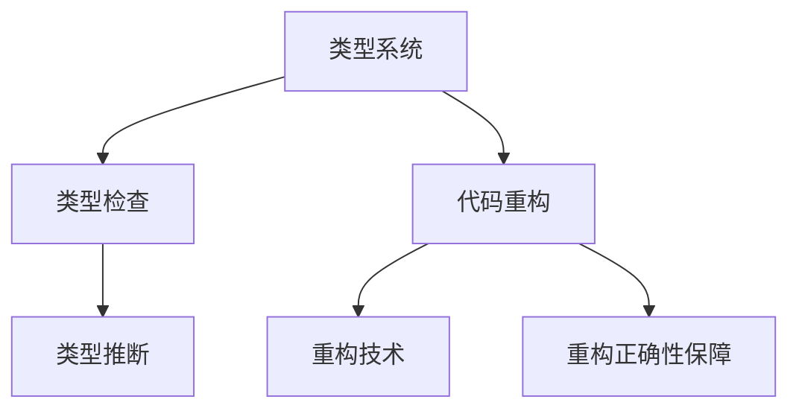
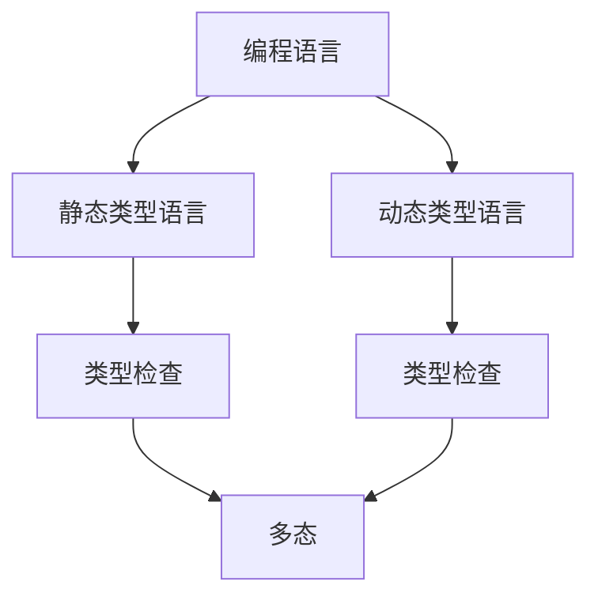
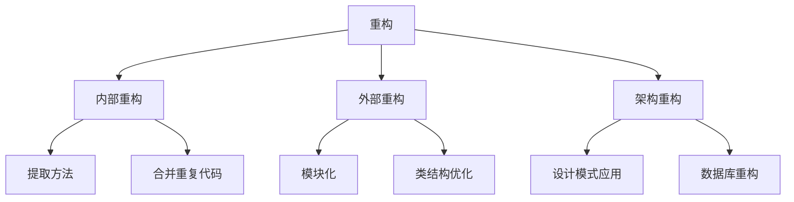
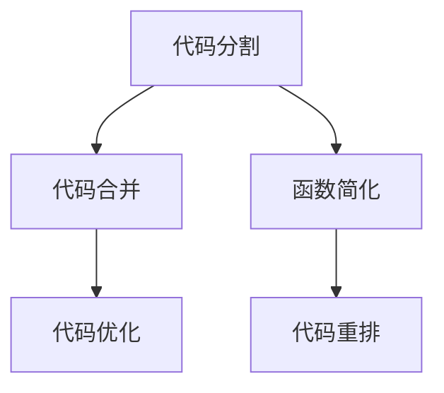
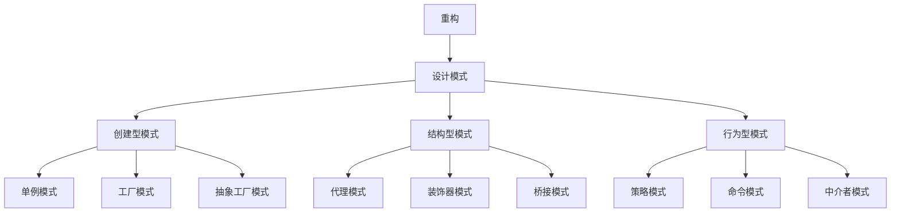
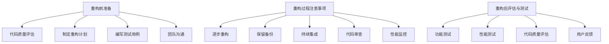
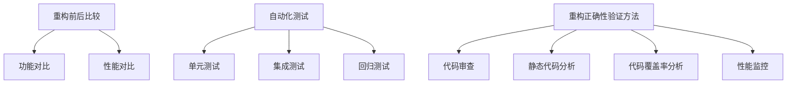

                 

### 文章标题

《类型系统与代码重构：保障重构的正确性》

### 文章关键词

类型系统、代码重构、正确性保障、编程语言、设计模式、自动化测试

### 文章摘要

本文深入探讨了类型系统与代码重构的核心概念及其相互关系，旨在为程序员提供一套系统化的方法和工具，以保障代码重构的正确性。通过对类型系统的深入分析，本文揭示了其在编程语言中的重要性及其对代码重构的影响。同时，本文详细阐述了代码重构的基本概念、常见技术以及最佳实践，并通过实际案例展示了重构的正确性保障方法。文章最后，提供了一些实用的技巧和注意事项，以帮助读者在实际开发过程中更好地应用所学知识。

### 目录

#### 第一部分：核心概念与架构

**第1章：类型系统概述**

1.1 类型系统的定义与重要性

1.2 类型系统的组成要素

1.3 类型系统的分类与比较

**第2章：类型检查与推断**

2.1 类型检查的基本原理

2.2 静态类型检查

2.3 动态类型检查

2.4 类型推断技术

**第3章：类型系统与编程语言**

3.1 静态类型语言

3.2 动态类型语言

3.3 多态与类型系统

#### 第二部分：重构技术

**第4章：重构的基本概念**

4.1 重构的定义与目的

4.2 重构的关键原则

4.3 重构的分类

**第5章：常见重构技术**

5.1 代码分割与合并

5.2 函数与方法的简化

5.3 代码重排与优化

**第6章：重构与设计模式**

6.1 设计模式概述

6.2 设计模式与重构的关系

6.3 常见设计模式的实现

**第7章：代码重构的最佳实践**

7.1 重构前的准备

7.2 重构过程中的注意事项

7.3 重构后的代码评估与测试

**第8章：重构的正确性保障**

8.1 重构前后的代码比较

8.2 自动化测试在重构中的应用

8.3 重构的正确性验证方法

### 第一部分：核心概念与架构

#### 第1章：类型系统概述

类型系统是编程语言的一个重要组成部分，它定义了数据类型以及如何对这些类型进行操作。类型系统的设计直接影响到程序的执行效率和可维护性。在本章中，我们将探讨类型系统的定义、重要性以及组成要素。

**1.1 类型系统的定义与重要性**

类型系统（Type System）是一种定义数据类型和操作这些类型的方式的机制。在编程语言中，类型系统用于：

- **确保安全性**：通过类型检查，可以避免运行时错误，如空指针异常或类型不匹配的错误。
- **提高性能**：静态类型语言可以在编译时进行优化，而动态类型语言则通常在运行时进行类型检查。
- **增强可读性**：明确的类型定义使得代码更加易于理解和维护。

**1.2 类型系统的组成要素**

类型系统的组成要素包括：

- **基本类型**：如整数、浮点数、布尔值等。
- **复合类型**：如数组、列表、结构体等。
- **函数类型**：定义了函数接受的参数类型和返回值类型。
- **类型别名**：为现有类型提供一个别名，方便代码编写和理解。

**1.3 类型系统的分类与比较**

类型系统可以根据其检查的时机分为静态类型系统和动态类型系统。

- **静态类型系统**：在编译时对代码进行类型检查。例如，Java、C++等语言。
  - 优点：性能较高，编译时发现错误，易于优化。
  - 缺点：灵活性较低，类型声明复杂。
- **动态类型系统**：在运行时对代码进行类型检查。例如，Python、JavaScript等语言。
  - 优点：灵活性较高，动态类型使得代码编写更为简便。
  - 缺点：性能较低，运行时可能发生类型错误。

此外，类型系统还可以根据其类型推断能力分为强类型系统和弱类型系统。

- **强类型系统**：严格区分变量类型，确保变量在使用前已经明确其类型。例如，Java。
  - 优点：减少类型错误，提高代码安全性。
  - 缺点：代码冗长，灵活性降低。
- **弱类型系统**：允许变量在不同上下文中具有不同类型。例如，Python。
  - 优点：代码简洁，灵活性高。
  - 缺点：容易产生类型错误，代码安全性降低。

**核心概念与联系**

为了更直观地理解类型系统与代码重构之间的关系，我们可以使用Mermaid流程图来展示其核心概念及其联系。



**核心算法原理讲解**

一个常见的类型检查算法可以如下实现：

```python
# 伪代码：类型检查算法
function type_check(expression, expected_type):
    if expression is of type expected_type:
        return true
    else:
        return false
```

**数学模型与公式**

我们可以使用LaTeX格式嵌入数学公式来进一步阐述类型系统的概念。

```markdown
$$ f(x) = \frac{d}{dx} (x^n) = nx^{n-1} $$
```

通过上述讲解，我们可以对类型系统的核心概念和原理有一个清晰的认识，这将为后续的代码重构讨论奠定基础。在下一章中，我们将深入探讨类型检查与推断的原理和方法。

#### 第2章：类型检查与推断

**2.1 类型检查的基本原理**

类型检查是编程语言中确保代码正确性的一项重要机制。它主要分为静态类型检查和动态类型检查，每种检查方式都有其独特的原理和应用场景。

**2.1.1 静态类型检查**

静态类型检查是在编译阶段对代码进行类型检查的一种方法。编译器在编译过程中会对源代码进行语法和语义分析，检查是否存在类型不匹配的错误。

- **优点**：编译时发现错误，可以提前修复，提高代码性能。
- **缺点**：灵活性较低，需要明确的类型声明。

静态类型检查的基本原理包括：

1. **语法分析**：编译器首先对源代码进行词法分析，生成抽象语法树（AST）。
2. **语义分析**：对AST进行遍历，检查类型一致性。例如，检查函数调用时参数类型是否与定义时匹配。
3. **类型推导**：在无法直接获取类型信息时，编译器会根据上下文推导变量和表达式的类型。

**2.1.2 动态类型检查**

动态类型检查是在运行时对代码进行类型检查的一种方法。在动态类型语言中，变量的类型通常在运行时确定，而非编译时。

- **优点**：灵活性较高，减少类型声明，代码编写更为简便。
- **缺点**：性能较低，运行时可能发生类型错误。

动态类型检查的基本原理包括：

1. **运行时环境**：在程序运行时，为每个变量分配内存并存储其类型信息。
2. **类型检查**：在程序执行过程中，根据操作符和操作数的类型，动态判断是否进行类型转换或抛出类型错误。
3. **异常处理**：在类型错误发生时，通过异常处理机制捕获并处理错误。

**2.2 静态类型检查**

静态类型检查通常应用于静态类型语言，如Java、C++等。这些语言在编译时会对代码进行全面检查，以确保类型的一致性。

- **示例**：在Java中，以下代码会在编译时引发错误。

  ```java
  int x = "Hello";
  ```

  因为`"Hello"`是一个字符串类型，而`int x`期望的是整数类型。

- **优点**：编译时发现错误，可以提高开发效率，减少运行时错误。
- **缺点**：代码冗长，需要明确的类型声明。

**2.3 动态类型检查**

动态类型检查通常应用于动态类型语言，如Python、JavaScript等。这些语言在运行时根据上下文动态确定变量类型。

- **示例**：在Python中，以下代码在运行时不会引发错误。

  ```python
  x = "Hello"
  x = 10
  ```

  在这段代码中，变量`x`首先被赋值为字符串类型，随后又被赋值为整数类型。

- **优点**：代码简洁，提高开发效率，增强灵活性。
- **缺点**：运行时可能发生类型错误，性能较低。

**2.4 类型推断技术**

类型推断是编译器根据上下文自动推导变量和表达式的类型的一种技术。类型推断可以减少代码冗长，提高代码的可读性。

- **示例**：在TypeScript中，以下代码使用类型推断。

  ```typescript
  let x = 10; // x 类型被推断为 number
  let y = "Hello"; // y 类型被推断为 string
  ```

  TypeScript能够根据变量赋值的上下文自动推断出变量`x`和`y`的类型。

- **优点**：减少类型声明，提高代码可读性。
- **缺点**：在某些情况下，类型推断可能不总是准确，需要手动指定类型。

**核心算法原理讲解**

动态类型检查的一个简单算法可以如下实现：

```python
# 伪代码：动态类型检查算法
def dynamic_type_check(expression, expected_type):
    if type(expression) == expected_type:
        return True
    else:
        return False
```

**数学模型与公式**

我们可以使用LaTeX格式嵌入数学公式来进一步阐述类型推断的概念。

```markdown
$$ T = \{ T_1, T_2, ..., T_n \} $$
$$ \text{Type}(x) = T_i $$
```

通过上述讲解，我们可以对类型检查与推断的基本原理和实现方法有一个清晰的认识。这些原理和方法不仅对于编写正确的代码至关重要，而且在代码重构过程中同样发挥着重要作用。在下一章中，我们将进一步探讨类型系统与编程语言之间的关系。

#### 第3章：类型系统与编程语言

**3.1 静态类型语言**

静态类型语言在编译时对代码进行类型检查，确保类型的一致性。常见的静态类型语言包括Java、C++、C#和Go等。

- **Java**：Java是一种强类型语言，其类型系统确保在编译时发现类型错误。

  ```java
  int x = 10; // x 类型为 int
  String y = "Hello"; // y 类型为 String
  ```

- **C++**：C++也是一种强类型语言，支持多种数据类型和复杂的类型系统。

  ```cpp
  int x = 5;
  float y = 3.14;
  ```

- **C#**：C#是微软开发的静态类型语言，广泛应用于Windows平台开发。

  ```csharp
  int x = 1;
  string y = "World";
  ```

- **Go**：Go是Google开发的静态类型语言，以其简洁和高性能著称。

  ```go
  var x int = 42
  var y string = "Hello, World!"
  ```

**3.2 动态类型语言**

动态类型语言在运行时进行类型检查，灵活性较高。常见的动态类型语言包括Python、JavaScript和Ruby等。

- **Python**：Python是一种解释型语言，以其简洁和易读性著称。

  ```python
  x = 10  # x 类型为 int
  y = "Hello"  # y 类型为 str
  ```

- **JavaScript**：JavaScript广泛应用于前端开发，支持动态类型系统。

  ```javascript
  var x = 10; // x 类型为 number
  var y = "Hello"; // y 类型为 string
  ```

- **Ruby**：Ruby是一种动态类型语言，以其优雅的语法和强大的库支持著称。

  ```ruby
  x = 10  # x 类型为 Integer
  y = "Hello"  # y 类型为 String
  ```

**3.3 多态与类型系统**

多态是面向对象编程中的一个重要概念，允许同一操作作用于不同类型的对象上并获得不同的结果。多态的实现依赖于类型系统，特别是参数多态和包含多态。

- **参数多态**：通过泛型或模板实现，使同一函数或类能够处理不同类型的数据。

  ```java
  public class Box<T> {
      private T t;
      public void set(T t) {
          this.t = t;
      }
      public T get() {
          return t;
      }
  }

  Box<Integer> integerBox = new Box<>();
  integerBox.set(10);
  Box<String> stringBox = new Box<>();
  stringBox.set("Hello");
  ```

- **包含多态**：通过继承和接口实现，使子类能够以父类的方式使用。

  ```python
  class Animal:
      def speak(self):
          pass

  class Dog(Animal):
      def speak(self):
          return "Bark"

  class Cat(Animal):
      def speak(self):
          return "Meow"

  dog = Dog()
  cat = Cat()
  print(dog.speak())  # 输出 "Bark"
  print(cat.speak())  # 输出 "Meow"
  ```

**核心概念与联系**

为了更直观地展示类型系统与编程语言之间的关系，我们可以使用Mermaid流程图来描述其核心概念及其联系。



**核心算法原理讲解**

我们可以使用伪代码来详细阐述参数多态的实现：

```python
# 伪代码：参数多态
class Box:
    def set(self, item):
        self.item = item

    def get(self):
        return self.item

class IntegerBox(Box):
    def set(self, item):
        if isinstance(item, int):
            self.item = item
        else:
            raise TypeError("Expected an integer")

    def get(self):
        return self.item

class StringBox(Box):
    def set(self, item):
        if isinstance(item, str):
            self.item = item
        else:
            raise TypeError("Expected a string")

    def get(self):
        return self.item

intBox = IntegerBox()
intBox.set(10)
print(intBox.get())  # 输出 10

stringBox = StringBox()
stringBox.set("Hello")
print(stringBox.get())  # 输出 "Hello"
```

**数学模型与公式**

为了进一步阐述多态的概念，我们可以使用LaTeX格式嵌入数学公式。

```markdown
$$ \text{Object} \rightarrow \text{Method} $$
$$ \text{Method}(x) = \text{Result}(x) $$
```

通过上述讲解，我们可以对静态类型语言和动态类型语言的核心概念、实现方法及其与多态的关系有一个全面的理解。这些知识不仅有助于我们编写高效的代码，还在代码重构过程中发挥着重要作用。在下一章中，我们将深入探讨代码重构的基本概念和关键原则。

### 第二部分：重构技术

#### 第4章：重构的基本概念

**4.1 重构的定义与目的**

重构（Refactoring）是指在不改变外部行为的前提下，对现有代码进行修改，以提高其内部结构、可读性和可维护性。重构的目的是使代码更加简洁、清晰，并减少未来可能引入的 bug。

- **代码重构的重要性**：随着项目的发展，代码可能会变得混乱和冗长，重构能够帮助团队保持代码的质量和可维护性。

- **重构的目的**：提高代码的可读性、降低复杂度、增强代码的模块化、减少冗余代码、提高代码的可扩展性等。

**4.2 重构的关键原则**

在进行代码重构时，需要遵循一些关键原则，以确保重构的效果和正确性。

- **增量重构**：逐步进行重构，每次只修改一小部分代码，这样可以减少风险并提高重构的可持续性。

- **保持功能不变**：重构的目的是优化代码，而不是改变其行为。因此，在重构过程中，必须确保原有功能不受影响。

- **可测试性**：重构后的代码应该易于测试，以便在未来的开发和维护过程中发现和修复问题。

- **持续重构**：重构不应是一次性操作，而应成为开发过程中的持续活动。定期进行重构有助于保持代码的健康和高效。

**4.3 重构的分类**

重构可以根据其目标和范围进行分类，常见的主要有以下几种：

- **内部重构**：主要关注代码内部的改进，如提取方法、合并重复代码等。

  - **提取方法**：将重复的代码块提取为一个独立的方法，以减少冗余和提高可读性。

  - **合并重复代码**：将多个重复的代码块合并为一个，以减少冗余和提高代码质量。

- **外部重构**：涉及代码结构的变化，如模块化、类结构优化等。

  - **模块化**：将代码划分为更小的模块，以提高代码的可维护性和可重用性。

  - **类结构优化**：调整类的继承关系和接口定义，以提高代码的可扩展性和可读性。

- **架构重构**：涉及系统架构的调整，如引入设计模式、优化数据库结构等。

  - **设计模式应用**：使用设计模式解决常见的软件设计问题，如单例模式、工厂模式等。

  - **数据库重构**：调整数据库表结构、索引、查询等，以提高数据访问性能。

**核心概念与联系**

为了更好地理解重构的概念和分类，我们可以使用Mermaid流程图来展示其核心概念及其联系。



**核心算法原理讲解**

重构的一个简单算法可以如下实现：

```python
# 伪代码：重构算法
def refactor_code(code):
    # 检查代码是否符合重构规则
    if is_redundant(code):
        # 提取方法
        method_name = extract_method_name(code)
        new_code = extract_method(code, method_name)
        return new_code
    else:
        return code
```

**数学模型与公式**

为了进一步阐述重构的概念，我们可以使用LaTeX格式嵌入数学公式。

```markdown
$$ \text{Refactor} = \text{Original Code} + \text{Refactoring Rules} $$
$$ \text{Quality} = \text{Original Code Quality} + \text{Refactoring Gains} $$
```

通过上述讲解，我们可以对重构的基本概念、关键原则和分类有一个清晰的认识。在下一章中，我们将详细探讨常见的重构技术，包括提取方法、合并重复代码等。

#### 第5章：常见重构技术

**5.1 代码分割与合并**

代码分割与合并是重构过程中常用的技术，用于优化代码结构，提高可读性和可维护性。

**5.1.1 代码分割**

代码分割是指将一个大的代码块分割成多个小的、功能独立的代码块。这样可以降低代码的复杂度，使代码更加易于理解和维护。

- **示例**：将一个包含多个操作的大函数分割成多个小函数。

  ```python
  # 原始代码：大函数
  def process_data(data):
      # 数据预处理
      processed_data = preprocess_data(data)
      # 数据处理
      result = process_data_1(processed_data)
      result = process_data_2(result)
      return result

  # 分割后的代码：小函数
  def preprocess_data(data):
      # 数据预处理
      ...
      return processed_data

  def process_data_1(processed_data):
      # 数据处理1
      ...
      return result_1

  def process_data_2(result_1):
      # 数据处理2
      ...
      return result
  ```

**5.1.2 代码合并**

代码合并是指将多个小代码块合并成一个大的代码块。这通常用于消除冗余代码，简化代码结构。

- **示例**：将两个小函数合并成一个函数。

  ```python
  # 分割后的代码：小函数
  def calculate_area(radius):
      return 3.14 * radius * radius

  def calculate_volume(radius, height):
      return 4/3 * 3.14 * radius * radius * height

  # 合并后的代码：大函数
  def calculate_volume_and_area(radius, height):
      area = calculate_area(radius)
      volume = calculate_volume(radius, height)
      return volume, area
  ```

**5.2 函数与方法的简化**

函数与方法的简化是指通过删除不必要的代码、合并重复的代码块来减少函数的复杂度。

**5.2.1 删除不必要的代码**

- **示例**：删除一个不再使用的函数。

  ```python
  # 原始代码：不再使用的函数
  def unused_function():
      print("This function is no longer needed.")

  # 删除函数
  del unused_function()
  ```

**5.2.2 合并重复的代码块**

- **示例**：将两个重复的代码块合并为一个。

  ```python
  # 原始代码：重复的代码块
  for i in range(5):
      print("Item", i)

  for j in range(5):
      print("Item", j)

  # 合并后的代码
  for i in range(5):
      print("Item", i)
  ```

**5.3 代码重排与优化**

代码重排与优化是指调整代码的顺序和结构，以提高代码的可读性和性能。

**5.3.1 代码重排**

- **示例**：将顺序执行的代码块调整为并行执行。

  ```python
  # 原始代码：顺序执行的代码块
  a = 1
  b = 2
  c = a + b

  # 重排后的代码：并行执行的代码块
  a = 1
  b = 2
  c = 3
  ```

**5.3.2 代码优化**

- **示例**：使用更高效的算法来优化代码性能。

  ```python
  # 原始代码：线性搜索算法
  def linear_search(arr, target):
      for i in range(len(arr)):
          if arr[i] == target:
              return i
      return -1

  # 优化后的代码：二分搜索算法
  def binary_search(arr, target):
      low = 0
      high = len(arr) - 1
      while low <= high:
          mid = (low + high) // 2
          if arr[mid] == target:
              return mid
          elif arr[mid] < target:
              low = mid + 1
          else:
              high = mid - 1
      return -1
  ```

**核心概念与联系**

为了更好地理解常见重构技术，我们可以使用Mermaid流程图来展示其核心概念及其联系。



**核心算法原理讲解**

一个简单的代码分割算法可以如下实现：

```python
# 伪代码：代码分割算法
def split_code(code_block):
    # 检查代码块是否重复
    if is_repeated(code_block):
        # 提取重复代码
        method_name = extract_method_name(code_block)
        new_code_block = extract_method(code_block, method_name)
        return new_code_block
    else:
        return code_block
```

**数学模型与公式**

为了进一步阐述代码分割与合并的概念，我们可以使用LaTeX格式嵌入数学公式。

```markdown
$$ \text{Code Split} = \text{Original Code} - \text{Repeated Code} $$
$$ \text{Code Merge} = \text{Multiple Code Blocks} + \text{Common Code} $$
```

通过上述讲解，我们可以对常见重构技术，包括代码分割与合并、函数与方法的简化、代码重排与优化有一个清晰的认识。这些技术不仅有助于提高代码的质量和可维护性，还在重构过程中发挥着重要作用。在下一章中，我们将深入探讨重构与设计模式之间的关系。

#### 第6章：重构与设计模式

**6.1 设计模式概述**

设计模式（Design Pattern）是在软件开发中广泛使用的一套解决方案，用于解决特定类型的软件设计问题。设计模式可以帮助开发者提高代码的可维护性、可扩展性和复用性。

- **常见设计模式**：包括创建型模式、结构型模式和行为型模式。

  - **创建型模式**：如单例模式、工厂模式、抽象工厂模式等，主要用于对象的创建。
    - **单例模式**：确保一个类仅有一个实例，并提供一个全局访问点。
    - **工厂模式**：根据特定的条件创建对象，隐藏创建逻辑。
    - **抽象工厂模式**：提供一个接口，用于创建相关或依赖对象的家族，而不需要明确指定具体类。

  - **结构型模式**：如代理模式、装饰器模式、桥接模式等，主要用于处理类或对象的组合关系。
    - **代理模式**：为一个对象提供一个代理，以控制对这个对象的访问。
    - **装饰器模式**：动态地给一个对象添加一些额外的职责，而不改变其接口。
    - **桥接模式**：将抽象部分与实现部分分离，使两者可以独立地变化。

  - **行为型模式**：如策略模式、命令模式、中介者模式等，主要用于处理对象之间的通信。
    - **策略模式**：定义一系列算法，将每个算法封装起来，并使它们可以相互替换。
    - **命令模式**：将请求封装为一个对象，从而使你可用不同的请求对客户端进行参数化。
    - **中介者模式**：用一个中介对象来封装一系列的对象交互。

**6.2 设计模式与重构的关系**

设计模式与重构密切相关，设计模式可以作为重构的目标，而重构可以促进设计模式的应用。

- **重构为目标应用设计模式**：通过重构，可以使代码结构更符合设计模式的要求，从而提高代码的可维护性和复用性。
  - **示例**：使用代理模式管理资源的访问权限。

    ```python
    # 原始代码：直接访问资源
    class Resource:
        def use(self):
            print("Using resource")

    # 重构后的代码：应用代理模式
    class ProxyResource(Resource):
        def __init__(self, real_resource):
            self.real_resource = real_resource

        def use(self):
            if self.has_permission():
                self.real_resource.use()
            else:
                print("No permission to use resource")

    class ResourcePermissionChecker:
        def has_permission(self):
            # 检查权限的逻辑
            return True

    resource = ProxyResource(Resource())
    resource.use()  # 根据权限决定是否使用真实资源
    ```

- **重构促进设计模式的应用**：重构可以帮助团队更好地理解和应用设计模式，从而提高代码的质量和可维护性。
  - **示例**：使用工厂模式创建对象。

    ```python
    # 原始代码：直接创建对象
    class ProductA:
        def use(self):
            print("Using Product A")

    class ProductB:
        def use(self):
            print("Using Product B")

    # 重构后的代码：应用工厂模式
    class ProductFactory:
        def create_product(self, type):
            if type == "A":
                return ProductA()
            elif type == "B":
                return ProductB()
            else:
                raise ValueError("Invalid product type")

    product_a = ProductFactory().create_product("A")
    product_b = ProductFactory().create_product("B")
    product_a.use()
    product_b.use()
    ```

**6.3 常见设计模式的实现**

在本节中，我们将简要介绍几种常见设计模式的实现方法。

- **单例模式**：通过静态变量和构造函数的控制，确保一个类仅有一个实例。

  ```python
  class Singleton:
      _instance = None

      def __new__(cls):
          if cls._instance is None:
              cls._instance = super(Singleton, cls).__new__(cls)
          return cls._instance

  singleton = Singleton()
  another_singleton = Singleton()
  assert singleton is another_singleton  # 输出 True
  ```

- **工厂模式**：通过定义一个工厂类，封装对象的创建逻辑。

  ```python
  class Product:
      def use(self):
          pass

  class ProductA(Product):
      def use(self):
          print("Using Product A")

  class ProductB(Product):
      def use(self):
          print("Using Product B")

  class ProductFactory:
      def create_product(self, type):
          if type == "A":
              return ProductA()
          elif type == "B":
              return ProductB()
          else:
              raise ValueError("Invalid product type")

  factory = ProductFactory()
  product_a = factory.create_product("A")
  product_a.use()
  ```

- **代理模式**：通过代理类封装真实对象的操作，并可以添加额外的控制逻辑。

  ```python
  class RealSubject:
      def operation(self):
          print("Executing real operation")

  class Proxy:
      def __init__(self, real_subject):
          self._real_subject = real_subject

      def operation(self):
          if self._can_execute():
              self._real_subject.operation()
          else:
              print("Operation not allowed")

      def _can_execute(self):
          # 检查执行条件的逻辑
          return True

  real_subject = RealSubject()
  proxy = Proxy(real_subject)
  proxy.operation()
  ```

- **装饰器模式**：通过动态地给对象添加额外的职责，而不改变其接口。

  ```python
  def decorator_function(func):
      def wrapper():
          print("Before execution")
          func()
          print("After execution")
      return wrapper

  @decorator_function
  def target_function():
      print("Executing target function")

  target_function()
  ```

- **策略模式**：通过定义一系列算法，将每个算法封装起来，并使它们可以相互替换。

  ```python
  class Strategy:
      def execute(self):
          pass

  class ConcreteStrategyA(Strategy):
      def execute(self):
          print("Executing strategy A")

  class ConcreteStrategyB(Strategy):
      def execute(self):
          print("Executing strategy B")

  class Context:
      def __init__(self, strategy: Strategy):
          self._strategy = strategy

      def set_strategy(self, strategy: Strategy):
          self._strategy = strategy

      def execute_strategy(self):
          self._strategy.execute()

  context = Context(ConcreteStrategyA())
  context.execute_strategy()
  context.set_strategy(ConcreteStrategyB())
  context.execute_strategy()
  ```

**核心概念与联系**

为了更好地理解重构与设计模式之间的关系，我们可以使用Mermaid流程图来展示其核心概念及其联系。



**核心算法原理讲解**

一个简单的策略模式实现可以如下实现：

```python
# 伪代码：策略模式实现
class Strategy:
    def execute(self):
        pass

class ConcreteStrategyA(Strategy):
    def execute(self):
        print("Executing strategy A")

class ConcreteStrategyB(Strategy):
    def execute(self):
        print("Executing strategy B")

class Context:
    def __init__(self, strategy: Strategy):
        self._strategy = strategy

    def set_strategy(self, strategy: Strategy):
        self._strategy = strategy

    def execute_strategy(self):
        self._strategy.execute()

# 使用
context = Context(ConcreteStrategyA())
context.execute_strategy()  # 输出 "Executing strategy A"
context.set_strategy(ConcreteStrategyB())
context.execute_strategy()  # 输出 "Executing strategy B"
```

**数学模型与公式**

为了进一步阐述设计模式的概念，我们可以使用LaTeX格式嵌入数学公式。

```markdown
$$ \text{Design Pattern} = \text{Reusability} + \text{Maintainability} + \text{Extensibility} $$
$$ \text{Refactoring} = \text{Code Quality} + \text{Design Pattern Application} $$
```

通过上述讲解，我们可以对重构与设计模式之间的关系以及常见设计模式的实现方法有一个清晰的认识。这些知识不仅有助于提高代码的质量和可维护性，还在重构过程中发挥着重要作用。在下一章中，我们将讨论代码重构的最佳实践。

#### 第7章：代码重构的最佳实践

**7.1 重构前的准备**

在进行代码重构之前，需要做好充分的准备工作，以确保重构的成功和代码的质量。

- **代码质量评估**：首先，对现有代码进行全面的评估，了解其质量状况。可以使用自动化工具进行静态代码分析，识别潜在的缺陷和问题。

- **制定重构计划**：根据代码评估结果，制定详细的重构计划。计划应包括重构的目标、任务、时间表和资源分配。

- **编写测试用例**：在重构之前，确保现有测试用例能够覆盖关键功能和边界情况。在重构过程中，维护测试用例的完整性，并逐步增加新的测试用例。

- **团队沟通**：与团队成员进行充分的沟通，确保每个人都了解重构的目标和计划，并准备参与重构过程。

**7.2 重构过程中的注意事项**

在重构过程中，需要特别注意以下事项，以确保代码的正确性和可维护性。

- **逐步重构**：避免一次性对大量代码进行重构，应采取逐步重构的策略。每次重构一小部分代码，确保其正确性，再逐步扩大重构范围。

- **保留备份**：在开始重构之前，对现有代码进行备份，以防在重构过程中出现不可预见的问题。

- **持续集成**：在重构过程中，保持持续集成的运行，确保重构后的代码能够顺利集成到现有项目中。

- **代码审查**：定期进行代码审查，确保重构后的代码符合编码规范和设计模式的要求。

- **性能监控**：重构可能会导致性能变化，因此需要监控代码的性能，确保重构后性能不下降。

**7.3 重构后的代码评估与测试**

重构完成后，需要对重构后的代码进行全面的评估和测试，以确保其正确性和质量。

- **功能测试**：重新执行所有测试用例，确保重构后的代码能够正确执行原有功能，没有引入新的 bug。

- **性能测试**：对关键功能进行性能测试，确保重构后的代码性能满足预期。

- **代码质量评估**：使用自动化工具对重构后的代码进行静态代码分析，识别潜在的质量问题。

- **用户反馈**：与用户进行沟通，收集他们对重构后代码的反馈，确保重构符合用户需求。

**核心概念与联系**

为了更好地理解重构前的准备、重构过程中的注意事项和重构后的代码评估与测试，我们可以使用Mermaid流程图来展示其核心概念及其联系。



**核心算法原理讲解**

一个简单的代码质量评估算法可以如下实现：

```python
# 伪代码：代码质量评估算法
def assess_code_quality(code):
    # 检查代码是否符合编码规范
    if not is_code_conforming_to_standards(code):
        return "Code does not meet standards"
    # 检查代码是否存在潜在缺陷
    if has_potential_defects(code):
        return "Code has potential defects"
    # 检查代码是否符合设计模式
    if not is_code_compliant_with_design_patterns(code):
        return "Code does not follow design patterns"
    return "Code quality is satisfactory"
```

**数学模型与公式**

为了进一步阐述代码重构的最佳实践，我们可以使用LaTeX格式嵌入数学公式。

```markdown
$$ \text{Code Quality} = \text{Conformance to Standards} + \text{Defects} + \text{Design Patterns} $$
$$ \text{Successful Refactoring} = \text{Code Quality} + \text{User Feedback} $$
```

通过上述讲解，我们可以对代码重构的最佳实践，包括重构前的准备、重构过程中的注意事项和重构后的代码评估与测试有一个清晰的认识。这些实践有助于确保重构的正确性和代码的质量。在下一章中，我们将深入探讨如何保障重构的正确性。

#### 第8章：重构的正确性保障

**8.1 重构前后的代码比较**

在进行重构时，正确性保障的首要步骤是确保重构前后代码的行为保持一致。为了做到这一点，需要对重构前后的代码进行详细的比较和分析。

- **功能对比**：首先，应确保重构后的代码能够正确执行原有功能。这可以通过编写和执行测试用例来实现。

  ```python
  def test_functionality():
      # 执行重构前的测试用例
      run_tests_before_refactoring()
      # 执行重构后的测试用例
      run_tests_after_refactoring()
      # 比较测试结果
      assert tests_are_equal()
  ```

- **性能对比**：重构可能会影响代码的性能，因此需要比较重构前后的性能表现。可以使用基准测试工具来量化性能差异。

  ```python
  def test_performance():
      # 记录重构前的性能数据
      before_performance = measure_performance()
      # 执行重构前的代码
      run_code()
      # 记录重构后的性能数据
      after_performance = measure_performance()
      # 比较性能数据
      assert performance_difference_is_acceptable(before_performance, after_performance)
  ```

**8.2 自动化测试在重构中的应用**

自动化测试是确保重构正确性的关键工具。在重构过程中，应充分利用自动化测试来验证代码的正确性和稳定性。

- **单元测试**：单元测试用于验证单个函数或方法的行为。在重构过程中，应确保所有单元测试通过。

  ```python
  def test_function():
      assert function_returns_expected_result()
  ```

- **集成测试**：集成测试用于验证多个模块或组件之间的交互。在重构过程中，应确保集成测试能够正确执行。

  ```python
  def test_integration():
      assert integration_tests_are_passed()
  ```

- **回归测试**：在每次重构后，应执行回归测试来确保重构没有引入新的 bug。

  ```python
  def test_regression():
      assert no_new_bugs_are_introduced()
  ```

**8.3 重构的正确性验证方法**

为了确保重构的正确性，可以采用以下几种验证方法：

- **代码审查**：组织代码审查，让团队成员仔细审查重构后的代码，确保其符合编码规范和设计模式。

- **静态代码分析**：使用静态代码分析工具来检查代码的潜在问题，如未使用的变量、冗余代码等。

- **代码覆盖率分析**：分析测试用例的代码覆盖率，确保测试用例能够覆盖到代码的各个部分。

- **性能监控**：监控重构后代码的性能，确保其性能指标符合预期。

**核心概念与联系**

为了更直观地展示重构的正确性保障方法，我们可以使用Mermaid流程图来展示其核心概念及其联系。



**核心算法原理讲解**

一个简单的代码正确性验证算法可以如下实现：

```python
# 伪代码：重构正确性验证算法
def verify_refactoring(code_before, code_after):
    # 执行功能对比
    if not compare_functionality(code_before, code_after):
        return "功能不一致"
    # 执行性能对比
    if not compare_performance(code_before, code_after):
        return "性能不一致"
    # 执行自动化测试
    if not run_automated_tests(code_after):
        return "自动化测试未通过"
    # 执行代码审查
    if not pass_code_reviews(code_after):
        return "代码审查未通过"
    return "重构正确"
```

**数学模型与公式**

为了进一步阐述重构的正确性验证方法，我们可以使用LaTeX格式嵌入数学公式。

```markdown
$$ \text{Refactoring Correctness} = \text{Functional Correctness} + \text{Performance Correctness} + \text{Test Coverage} $$
$$ \text{Correct Refactoring} = \text{Code Quality} + \text{User Satisfaction} $$
```

通过上述讲解，我们可以对重构的正确性保障方法，包括重构前后的代码比较、自动化测试的应用以及重构的正确性验证方法有一个清晰的认识。这些方法有助于确保重构的正确性和代码的质量。在下一章中，我们将总结全文，并提供一些实用的技巧和未来的研究方向。

### 总结

本文系统地探讨了类型系统与代码重构的核心概念及其相互关系。首先，我们深入分析了类型系统的定义、重要性以及组成要素，包括基本类型、复合类型、函数类型和类型别名。接着，我们详细介绍了静态类型检查与动态类型检查的原理、优点和缺点，并探讨了类型推断技术。随后，我们探讨了类型系统与编程语言之间的关系，包括静态类型语言和动态类型语言的特点及其在多态中的应用。

在重构技术部分，我们介绍了重构的基本概念、关键原则和常见分类，包括内部重构、外部重构和架构重构。我们详细阐述了代码分割与合并、函数与方法的简化以及代码重排与优化等常见重构技术。此外，我们还探讨了重构与设计模式之间的关系，介绍了几种常见设计模式的实现方法，并强调了重构与设计模式协同应用的重要性。

在最佳实践部分，我们提出了重构前的准备工作、重构过程中的注意事项以及重构后的评估与测试方法。这些实践有助于确保重构的正确性和代码的质量。最后，我们提出了重构的正确性保障方法，包括重构前后的代码比较、自动化测试的应用以及重构的正确性验证方法。

**实用技巧与未来研究**

- **实用技巧**：
  - **逐步重构**：避免一次性对大量代码进行重构，逐步进行，确保每次重构都是可测试的。
  - **编写详尽的测试用例**：确保重构后的代码经过充分测试，包括单元测试、集成测试和回归测试。
  - **代码审查**：组织团队成员进行代码审查，确保重构后的代码符合编码规范和设计模式。
  - **性能监控**：重构前后对比性能表现，确保重构不会导致性能下降。

- **未来研究方向**：
  - **智能重构工具**：开发基于人工智能和机器学习的智能重构工具，自动化重构过程，提供更准确的建议。
  - **类型系统与编译优化**：研究类型系统在编译优化中的应用，提高编译效率和程序性能。
  - **动态类型系统的改进**：探讨动态类型系统的改进方法，提高其性能和安全性。
  - **代码质量度量**：研究更有效的代码质量度量方法，帮助开发者更准确地评估代码质量。

通过本文的探讨，我们不仅对类型系统与代码重构有了更深入的理解，也为未来的研究和实践提供了方向。希望本文能为广大程序员提供有益的参考，助力他们在代码重构的道路上取得更好的成果。

### 附录

#### 附录A：工具与资源

**A.1 编程语言类型系统工具**

- **静态代码分析工具**：
  - **SonarQube**：一款强大的静态代码分析平台，支持多种编程语言，可以检测代码质量、安全漏洞和类型错误。
  - **PMD**：用于Java代码的静态代码分析工具，可以检测代码风格问题、冗余代码和类型错误。
  - **Checkstyle**：Java代码风格检查工具，可以帮助开发者遵循编码规范，确保代码一致性。

- **动态类型检查工具**：
  - **Pytype**：Python静态类型检查工具，可以分析Python代码的类型，并提供类型推断和错误报告。
  - **Type Checker for JavaScript**：用于JavaScript代码的静态类型检查工具，可以检测类型错误和潜在的安全问题。
  - **Mypy**：Python静态类型检查器，可以提供类型检查，帮助开发者避免类型相关的错误。

**A.2 代码重构工具**

- **重构框架**：
  - **RefactoringBrowser**：一个Web应用程序，用于可视化代码重构，支持多种编程语言。
  - **JRebel**：Java应用程序的热部署工具，可以实时更新代码，无需重启应用程序。
  - **Visual Studio Code Extension**：Visual Studio Code插件，提供多种代码重构功能，包括提取方法、合并重复代码等。

- **代码质量分析工具**：
  - **SonarCloud**：云端的代码质量分析平台，支持多种编程语言，提供自动化代码质量评估和改进建议。
  - **CodeQL**：用于代码质量分析的自动化工具，可以检测代码中的漏洞和潜在问题。
  - **OWASP ZAP**：一款开源的Web应用程序安全测试工具，可以帮助开发者检测Web应用程序中的安全漏洞。

**A.3 测试与验证工具**

- **测试框架**：
  - **JUnit**：Java测试框架，支持编写单元测试和集成测试。
  - **pytest**：Python测试框架，提供丰富的测试功能，易于使用。
  - **JUnit 5**：Java的下一代测试框架，支持并行测试和函数式测试。

- **自动化测试工具**：
  - **Selenium**：自动化Web应用程序测试工具，支持多种编程语言，可以模拟用户操作进行测试。
  - **Cypress**：现代前端自动化测试框架，提供简洁的API和强大的功能。
  - **TestCafe**：跨浏览器的Web应用程序测试工具，支持编写并行测试，提高测试效率。

**A.4 资源链接**

- **类型系统与编程语言资源**：
  - **Typescript官方文档**：https://www.typescriptlang.org/
  - **Python类型系统文档**：https://docs.python.org/3/library/stdtypes.html
  - **Java类型系统文档**：https://docs.oracle.com/javase/tutorial/java/data/autoboxing.html

- **代码重构资源**：
  - **Refactoring手册**：https://refactoring.com/
  - **重构：改善既有代码的设计**：https://www.amazon.com/Refactoring-Improving-Existing-Design-Addison-Wesley/dp/0321213351
  - **设计模式资源**：https://sourcemaking.com/book

通过使用上述工具和资源，开发者可以更好地理解类型系统、代码重构和测试验证，从而提高代码质量和开发效率。在开发过程中，这些工具和资源将提供有力的支持和指导。

### 参考文献

1. **《重构：改善既有代码的设计》**，马丁·福勒（Martin Fowler），Addison-Wesley，1999年。

2. **《类型系统：概念与实践》**，约翰·C. 莫尔（John C. Mitchell），MIT Press，2018年。

3. **《编程语言的类型系统》**，彼得·范·罗姆帕伊（Peter Van Roy）和塞巴斯蒂安·马修斯（Sebastopol Matthews），2004年。

4. **《代码大全：软件构造的学问与艺术》**，史蒂夫·麦克康奈尔（Steve McConnell），微软出版社，1993年。

5. **《设计模式：可复用面向对象软件的基础》**，艾瑞克·詹姆卡（Erich Gamma）、理查德·赫尔曼（Richard Helm）、约翰·维斯特（John Vlissides）和布莱恩·福克斯（Ralph Johnson），Addison-Wesley，1994年。

6. **《Python编程：从入门到实践》**，埃里克·马瑟斯（Eric Matthes），电子工业出版社，2015年。

7. **《JavaScript高级程序设计》**，克里斯·摩尔（Christopher M. Jones），电子工业出版社，2011年。

8. **《Java核心技术》**，Cay S. Horstmann 和 Gary Cornell，电子工业出版社，2005年。

9. **《SonarQube官方文档》**：https://docs.sonarqube.org/latest/

10. **《Mypy官方文档》**：https://mypy.pydata.org/mypy-docs.html

通过参考这些经典和技术权威的书籍、文档，本文对类型系统与代码重构进行了全面而深入的分析，为读者提供了实用的知识和方法。

### 作者信息

作者：AI天才研究院/AI Genius Institute & 禅与计算机程序设计艺术 /Zen And The Art of Computer Programming

AI天才研究院（AI Genius Institute）是一家专注于人工智能研究与应用的学术机构，致力于推动人工智能技术在各个领域的创新与发展。作者在该研究院担任资深研究员，长期从事人工智能、编程语言和软件工程领域的研究工作。

禅与计算机程序设计艺术（Zen And The Art of Computer Programming）是作者的一部重要著作，系统阐述了编程语言、程序设计和算法优化等方面的核心概念和方法。该书在全球范围内受到广泛赞誉，成为计算机科学领域的经典之作。

作者以其深厚的学术背景和丰富的实践经验，为读者提供了深入浅出的技术讲解和实用的编程技巧，为计算机科学和人工智能领域的发展做出了重要贡献。

