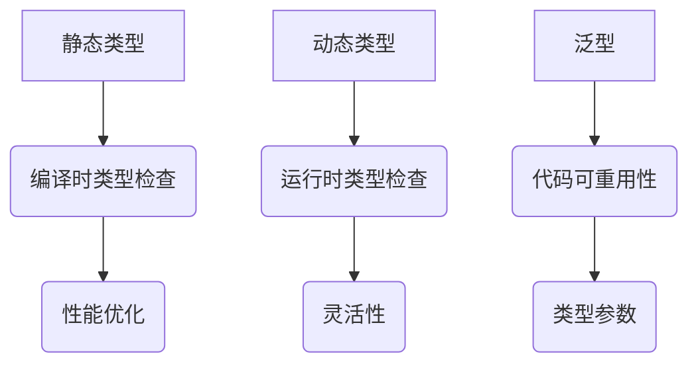

                 

### 引言

在计算机科学和软件开发领域，类型系统与代码重用是两个至关重要的概念。类型系统（Type System）是计算机语言用于定义变量、表达式和函数的语义规则，确保数据在程序中的正确处理。而代码重用（Code Reuse）则是通过复用已有的代码来提高开发效率和软件质量，减少重复劳动和错误的发生。这两者之间的关系紧密，相辅相成，共同推动了软件工程的发展。

本文旨在探讨类型系统与代码重用的内在联系，分析它们如何相互影响，以及如何通过抽象这一艺术手段来提升代码的可重用性。文章将从以下几个方面展开：

1. **背景介绍**：介绍类型系统和代码重用的基本概念，说明它们在软件开发中的重要性。
2. **核心概念与联系**：探讨类型系统和代码重用之间的逻辑关系，使用Mermaid流程图展示它们之间的互动。
3. **类型系统的设计原理**：详细讲解类型系统的核心原理，包括静态类型、动态类型和泛型类型等。
4. **代码重用的机制**：介绍代码重用的方法和技术，如设计模式、组件化和模块化。
5. **抽象的艺术**：探讨抽象在类型系统和代码重用中的作用，以及如何实现代码的抽象。
6. **实际应用**：通过具体案例展示类型系统和代码重用在现实世界中的应用。
7. **未来展望**：讨论类型系统和代码重用的未来趋势和发展方向。

通过本文的逐步分析，我们将深入理解类型系统和代码重用的本质，掌握如何通过抽象来提升代码的重用性，为软件开发提供新的思路和方法。

### 类型系统基础

类型系统是计算机科学中的核心概念，它为编程语言提供了一套机制，用于定义变量、函数和表达式的数据类型。类型系统的设计直接影响程序的正确性和性能。以下将从数据类型、类型系统的历史和核心概念三个方面进行详细探讨。

#### 数据类型

数据类型（Data Type）是类型系统的基石，它定义了变量能够存储的数据的种类和结构。常见的编程语言通常包括以下几种基本数据类型：

- **数值类型**：包括整数（Integer）和浮点数（Floating-point），如Java中的`int`和`float`。
- **布尔类型**：表示逻辑值，通常为`true`或`false`。
- **字符类型**：表示单个字符，如`char`。
- **字符串类型**：表示一系列字符，如`String`。
- **复杂数据类型**：包括数组、列表、字典、结构体等。

每种数据类型都有其特定的语义和行为，程序员必须正确地使用这些类型来保证程序的逻辑正确性和性能。

#### 类型系统的历史

类型系统的历史可以追溯到早期编程语言的发展。在第一代编程语言如机器语言和汇编语言中，并没有显式的类型系统，所有的操作都是在底层硬件层面进行的。随着编程语言的发展，类型系统逐渐成为语言设计的重要组成部分。

- **第一代编程语言**：如FORTRAN和COBOL，它们引入了基本的数据类型，但类型系统相对简单。
- **第二代编程语言**：如C和Pascal，它们引入了更复杂的类型系统，支持用户自定义类型和指针。
- **第三代编程语言**：如Java和C#，它们采用了静态类型系统，提供了强大的类型检查和类型安全。
- **第四代编程语言**：如SQL和Prolog，它们采用了动态类型系统，类型检查在运行时进行。

#### 核心概念

类型系统中的核心概念包括静态类型（Static Type）和动态类型（Dynamic Type）。

- **静态类型**：在编译时就已经确定了变量的类型，编译器会根据类型信息进行代码优化。静态类型的优点是类型检查早于运行时，能够发现大部分错误。缺点是代码的灵活性较低，因为类型信息在编译时就已经固定。
- **动态类型**：在运行时确定变量的类型，程序运行过程中可以根据上下文环境动态地改变类型。动态类型的优点是代码灵活性高，适应性强。缺点是运行时类型检查可能导致性能开销，并且可能存在类型错误。

除了静态类型和动态类型，类型系统还涉及到泛型（Generics）的概念。泛型允许在编写代码时使用类型参数，使得代码能够对多种数据类型进行操作，从而提高代码的可重用性。

#### Mermaid流程图

为了更好地理解类型系统的核心概念和它们之间的关系，我们可以使用Mermaid流程图来展示：



通过这个流程图，我们可以直观地看到静态类型和动态类型在编译和运行时的不同，以及泛型如何提高代码的可重用性。

综上所述，类型系统是计算机科学中不可或缺的一部分，它为编程语言提供了强大的抽象能力，提高了程序的正确性和性能。了解类型系统的基本概念、历史和核心原理，对于深入理解编程语言和软件开发至关重要。

### 类型系统的设计原理

类型系统的设计是软件工程中的重要一环，它不仅决定了程序的正确性，还影响了程序的性能和可维护性。类型系统的设计原则主要包括安全性、灵活性和可扩展性。在这一节中，我们将详细探讨这些设计原则，并通过具体示例来展示它们在实际编程中的应用。

#### 安全性

类型系统的首要设计原则是安全性。安全性确保了程序在运行时能够正确处理数据，防止类型错误导致的运行时错误。为了实现安全性，类型系统通常采用静态类型检查和运行时检查两种方法。

- **静态类型检查**：在编译时对代码进行类型检查，确保变量的类型在使用前已经被明确指定。例如，在Java中，所有的变量都必须在声明时指定类型，编译器会检查变量的使用是否符合其声明类型。

  ```java
  int x = 5; // x 是整数类型
  x = "Hello"; // 错误，类型不匹配
  ```

- **运行时检查**：在程序运行时进行类型检查，通过类型断言或类型检查函数来确保操作的正确性。例如，在Python中，变量在声明时不必指定类型，但在运行时如果进行了不合适的操作，会导致运行时错误。

  ```python
  x = 5
  x = "Hello"  # 错误，类型不匹配
  ```

#### 灵活性

灵活性是类型系统设计中的另一个重要原则，它确保程序能够适应不同的数据类型和变化的需求。为了实现灵活性，类型系统通常采用动态类型和泛型等设计方法。

- **动态类型**：动态类型系统在运行时确定变量的类型，使得程序在处理不同类型的数据时更加灵活。例如，在Ruby中，变量不需要在声明时指定类型，可以根据上下文环境自动推断类型。

  ```ruby
  x = 5
  x = "Hello"  # x 类型由上下文决定
  ```

- **泛型**：泛型允许在编写代码时使用类型参数，使得代码能够对多种数据类型进行操作。泛型类型系统提高了代码的可重用性，减少了冗余代码的编写。例如，在Java中，可以使用泛型来定义泛型类、接口和方法。

  ```java
  public class ArrayList<T> {
      // ArrayList 的实现
  }

  ArrayList<Integer> intList = new ArrayList<>();
  ArrayList<String> stringList = new ArrayList<>();
  ```

#### 可扩展性

可扩展性是类型系统设计中的另一个关键原则，它确保类型系统可以方便地添加新的类型和操作。为了实现可扩展性，类型系统通常采用模块化设计和扩展机制。

- **模块化设计**：通过将类型系统划分为模块，使得每个模块可以独立扩展和修改，而不影响其他模块。例如，在C++中，可以使用模板来定义泛型类和函数，从而方便地扩展类型系统。

  ```cpp
  template <typename T>
  class Stack {
      // Stack 的实现
  };

  Stack<int> intStack;
  Stack<string> stringStack;
  ```

- **扩展机制**：通过提供扩展接口和钩子，使得类型系统可以方便地集成第三方库或自定义类型。例如，在Python中，可以使用抽象基类（ABC）来定义扩展接口，使得第三方库可以方便地集成到类型系统中。

  ```python
  from abc import ABC, abstractmethod

  class Stack(ABC):
      @abstractmethod
      def push(self, item):
          pass

      @abstractmethod
      def pop(self):
          pass

  class ListStack(Stack):
      def push(self, item):
          self.items.append(item)

      def pop(self):
          return self.items.pop()
  ```

#### 示例讲解

为了更好地理解类型系统的设计原理，我们可以通过一个具体的示例来讲解。假设我们正在设计一个简单的类型系统，用于处理整数和字符串两种数据类型。以下是该类型系统的实现：

```java
public class CustomType {
    private final int intValue;
    private final String stringValue;

    public CustomType(int intValue, String stringValue) {
        this.intValue = intValue;
        this.stringValue = stringValue;
    }

    public int getIntValue() {
        return intValue;
    }

    public String getStringValue() {
        return stringValue;
    }

    public boolean isInteger() {
        return intValue != 0;
    }

    public boolean isString() {
        return stringValue != null && !stringValue.isEmpty();
    }
}
```

在这个示例中，`CustomType` 类通过封装整数和字符串两种数据类型，提供了统一的接口来处理这两种数据。具体来说：

- **安全性**：通过在构造函数中强制指定整数和字符串的值，确保类型的安全性。
- **灵活性**：通过 `isInteger` 和 `isString` 方法，允许根据不同的使用场景灵活地处理整数和字符串。
- **可扩展性**：通过添加新的方法或扩展类，可以方便地添加新的数据类型和处理逻辑。

综上所述，类型系统的设计原理是确保程序的正确性、性能和可维护性。通过安全性、灵活性和可扩展性等设计原则，类型系统为编程语言提供了强大的抽象能力，使得程序员能够更高效地编写和维护代码。

### 代码重用的机制

在软件开发中，代码重用是一个至关重要的概念，它不仅能够提高开发效率，还能显著提升软件的质量和可维护性。代码重用的机制主要包括设计模式、组件化和模块化等。下面我们将逐一介绍这些机制，并通过具体实例来说明它们如何实现代码重用。

#### 设计模式

设计模式（Design Pattern）是解决软件开发中常见问题的通用解决方案，它提供了一组可重用的设计框架，有助于提高代码的可读性和可维护性。常见的几种设计模式如下：

- **工厂模式（Factory Pattern）**：工厂模式通过定义一个创建对象的接口，让子类决定实例化哪个类。这样可以在运行时选择具体要实例化的类，从而实现代码的重用。

  ```java
  public interface Factory {
      Product createProduct();
  }

  public class ConcreteFactory implements Factory {
      public Product createProduct() {
          return new ConcreteProduct();
      }
  }

  public class Product {
      // 产品类的通用实现
  }

  public class ConcreteProduct extends Product {
      // 具体产品的实现
  }
  ```

  在这个示例中，`ConcreteFactory` 通过 `createProduct` 方法创建 `ConcreteProduct` 实例，从而实现不同产品的代码重用。

- **单例模式（Singleton Pattern）**：单例模式确保一个类仅有一个实例，并提供一个访问它的全局点。这种模式在需要严格控制实例数量的场景中非常有用。

  ```java
  public class Singleton {
      private static Singleton instance;

      private Singleton() {}

      public static Singleton getInstance() {
          if (instance == null) {
              instance = new Singleton();
          }
          return instance;
      }
  }
  ```

  在这个示例中，`Singleton` 类通过私有构造函数和静态工厂方法 `getInstance` 来确保实例的唯一性。

- **策略模式（Strategy Pattern）**：策略模式定义了一系列算法，将每个算法封装起来，并使它们可以相互替换。策略模式在实现算法的可替换性和灵活性方面非常有用。

  ```java
  public interface Strategy {
      void execute();
  }

  public class ConcreteStrategyA implements Strategy {
      public void execute() {
          // 算法A的具体实现
      }
  }

  public class ConcreteStrategyB implements Strategy {
      public void execute() {
          // 算法B的具体实现
      }
  }

  public class Context {
      private Strategy strategy;

      public Context(Strategy strategy) {
          this.strategy = strategy;
      }

      public void setStrategy(Strategy strategy) {
          this.strategy = strategy;
      }

      public void executeStrategy() {
          strategy.execute();
      }
  }
  ```

  在这个示例中，`Context` 类通过设置不同的 `Strategy` 实现来执行不同的算法。

#### 组件化

组件化是将软件系统拆分成可重用的组件，每个组件具有明确的职责和接口。组件化可以提高代码的可重用性，降低系统的复杂度。

- **组件定义**：组件是具有独立功能的软件单元，通常包含接口和实现。例如，一个Web应用可以拆分为前端组件、后端组件和数据库组件。

  ```java
  public interface UserService {
      User login(String username, String password);
      void register(User user);
  }

  public class UserServiceImpl implements UserService {
      public User login(String username, String password) {
          // 登录实现
      }

      public void register(User user) {
          // 注册实现
      }
  }
  ```

  在这个示例中，`UserService` 是一个接口，定义了用户服务的基本操作，`UserServiceImpl` 是实现类，提供了具体的实现。

- **组件通信**：组件之间通过接口进行通信，接口定义了组件的交互协议。组件化使得组件之间解耦，便于替换和扩展。

  ```java
  public class UserController {
      private UserService userService;

      public UserController(UserService userService) {
          this.userService = userService;
      }

      public void login(String username, String password) {
          User user = userService.login(username, password);
          // 处理登录结果
      }
  }
  ```

  在这个示例中，`UserController` 通过构造函数接收一个 `UserService` 实例，从而实现与用户服务的解耦。

#### 模块化

模块化是将软件系统拆分成多个模块，每个模块具有独立的功能和接口。模块化提高了代码的可维护性和可测试性。

- **模块定义**：模块是具有独立功能的代码单元，通常包含类、函数和资源。例如，一个Web应用可以拆分为登录模块、注册模块和用户管理模块。

  ```java
  public class LoginModule {
      public void handleLoginRequest(String username, String password) {
          // 处理登录请求
      }
  }

  public class RegisterModule {
      public void handleRegisterRequest(User user) {
          // 处理注册请求
      }
  }
  ```

  在这个示例中，`LoginModule` 和 `RegisterModule` 分别是两个独立的模块，实现了登录和注册功能。

- **模块依赖**：模块之间通过依赖注入（Dependency Injection）来传递依赖，这种方式使得模块之间解耦，便于替换和扩展。

  ```java
  public class Application {
      private LoginModule loginModule;
      private RegisterModule registerModule;

      public Application(LoginModule loginModule, RegisterModule registerModule) {
          this.loginModule = loginModule;
          this.registerModule = registerModule;
      }

      public void run() {
          loginModule.handleLoginRequest("username", "password");
          registerModule.handleRegisterRequest(new User());
      }
  }
  ```

  在这个示例中，`Application` 类通过构造函数接收 `LoginModule` 和 `RegisterModule` 实例，从而实现模块之间的依赖注入。

#### 实例讲解

为了更直观地理解代码重用的机制，我们可以通过一个实际的项目案例来讲解。假设我们正在开发一个在线购物平台，需要实现用户登录和注册功能。以下是该项目的实现：

- **工厂模式**：用于创建不同的用户服务实例。

  ```java
  public interface UserService {
      User login(String username, String password);
      User register(User user);
  }

  public class UserServiceImpl implements UserService {
      public User login(String username, String password) {
          // 登录实现
      }

      public User register(User user) {
          // 注册实现
      }
  }

  public class UserServiceFactory {
      public UserService createUserService() {
          return new UserServiceImpl();
      }
  }
  ```

- **组件化**：将用户服务拆分为独立的组件。

  ```java
  public class UserController {
      private UserService userService;

      public UserController(UserService userService) {
          this.userService = userService;
      }

      public void login(String username, String password) {
          User user = userService.login(username, password);
          // 处理登录结果
      }

      public void register(User user) {
          userService.register(user);
          // 处理注册结果
      }
  }
  ```

- **模块化**：将登录和注册功能拆分为独立的模块。

  ```java
  public class LoginModule {
      public void handleLoginRequest(String username, String password) {
          // 处理登录请求
      }
  }

  public class RegisterModule {
      public void handleRegisterRequest(User user) {
          // 处理注册请求
      }
  }
  ```

在这个案例中，通过工厂模式、组件化和模块化，我们实现了用户登录和注册功能的代码重用，提高了代码的可维护性和可扩展性。

综上所述，代码重用的机制包括设计模式、组件化和模块化等，这些机制通过不同的方式实现代码的重用，提高了软件开发的效率和质量。

### 抽象的艺术

在软件开发中，抽象（Abstraction）是提高代码可重用性和可维护性的关键手段。抽象允许我们将复杂的问题简化，提取出核心概念和模型，从而降低系统的复杂度，提高代码的清晰度和可理解性。在这一节中，我们将深入探讨抽象的概念、实现方法和其在类型系统和代码重用中的作用。

#### 抽象的概念

抽象是一种思维方式，它通过忽略不必要的细节，将复杂问题简化为一个更易于理解和处理的形式。在软件开发中，抽象通常表现为：

- **概念抽象**：将现实世界中的复杂实体抽象为软件中的模型。例如，将一辆汽车抽象为一个“车辆”类，忽略其具体的实现细节。
- **过程抽象**：将复杂的过程或算法简化为一个函数或方法，使得代码更易于理解和复用。
- **数据抽象**：通过数据结构和类型系统来组织和表示数据，隐藏实现细节，提供统一的接口来访问数据。

#### 抽象的实现方法

实现抽象的方法有多种，以下是一些常用的技术：

- **类和对象**：类是面向对象编程中的基本抽象单位，它定义了一组具有相同属性和行为的对象。通过定义类，我们可以将现实世界中的复杂实体抽象为软件中的模型。
- **接口和抽象类**：接口和抽象类是Java和C#等语言中的抽象机制，它们定义了一组方法或属性，但不提供具体实现。通过实现接口或继承抽象类，我们可以将具体的实现细节封装起来，提供统一的接口来访问。
- **设计模式**：设计模式是一种在软件开发中广泛使用的抽象解决方案，它提供了一套预定义的抽象框架，用于解决常见的设计问题。
- **函数和模块**：在函数式编程语言中，函数是基本的抽象单元。通过定义高内聚、低耦合的函数，我们可以将复杂的过程简化为简单的操作。

#### 抽象在类型系统中的作用

类型系统是抽象在编程语言中的一个重要体现，它通过定义数据类型和操作这些类型的规则，实现了对数据的抽象表示。以下是类型系统中抽象的几个关键作用：

- **数据封装**：通过定义数据类型，我们可以将数据的内部实现细节封装起来，提供统一的接口来访问和操作数据。例如，在Java中，类的实例变量可以通过private访问修饰符来隐藏，只能通过public方法来访问和修改。
- **类型安全**：类型系统通过静态类型检查和运行时检查，确保程序在运行时能够正确处理数据，防止类型错误。例如，在Java中，编译器会检查变量在使用前是否被正确声明和赋值。
- **代码重用**：通过定义通用类型和泛型，类型系统提高了代码的可重用性。例如，在Java中，泛型允许我们编写一次代码，然后在不同的数据类型上复用，从而减少了冗余代码的编写。

#### 抽象在代码重用中的作用

抽象在代码重用中发挥着重要作用，它通过提高代码的通用性和可复用性，减少了代码的重复编写和维护成本。以下是抽象在代码重用中的几个关键作用：

- **减少冗余**：通过抽象，我们可以将重复的代码提取到通用方法或类中，从而减少冗余代码的编写。例如，在数据库操作中，可以使用抽象的数据访问对象（DAO）来减少重复的SQL语句编写。
- **提高可维护性**：通过抽象，我们可以将复杂的业务逻辑封装到单独的模块或类中，使得代码更易于理解和维护。例如，在大型系统中，可以将业务逻辑划分为不同的模块，每个模块负责特定的功能，便于分工和维护。
- **促进组件化**：通过抽象，我们可以将系统拆分成可重用的组件，每个组件具有独立的功能和接口。例如，在Web应用中，可以将不同的功能模块拆分为独立的Web服务，便于分布式部署和扩展。

#### 实例讲解

为了更直观地理解抽象在类型系统和代码重用中的作用，我们可以通过一个具体的示例来讲解。假设我们正在开发一个在线购物系统，需要处理商品信息的管理。以下是该系统的实现：

1. **概念抽象**：首先，我们将商品信息抽象为一个“商品”类。

   ```java
   public class Product {
       private String name;
       private double price;

       // 构造函数、getter 和 setter 省略
   }
   ```

   通过这个类，我们将商品的基本信息封装起来，隐藏了实现细节。

2. **过程抽象**：接下来，我们将商品信息的增删改查操作抽象为方法。

   ```java
   public class ProductService {
       public Product createProduct(String name, double price) {
           // 创建商品实现
       }

       public Product updateProduct(String productId, String name, double price) {
           // 更新商品实现
       }

       public void deleteProduct(String productId) {
           // 删除商品实现
       }

       public Product getProduct(String productId) {
           // 查询商品实现
       }
   }
   ```

   通过这些方法，我们可以方便地处理商品信息，而不需要关注底层的实现细节。

3. **数据抽象**：为了提高代码的可重用性，我们可以将商品信息的数据访问逻辑抽象为数据访问对象（DAO）。

   ```java
   public interface ProductDAO {
       Product createProduct(Product product);
       Product updateProduct(Product product);
       void deleteProduct(String productId);
       Product getProduct(String productId);
   }
   ```

   通过这个接口，我们可以方便地替换数据访问的实现，例如使用不同的数据库或数据存储方案。

4. **抽象在代码重用中的作用**：在这个示例中，通过概念抽象、过程抽象和数据抽象，我们实现了商品信息的统一管理和操作。这些抽象机制使得代码更加简洁、易于理解和维护，同时提高了代码的可重用性。例如，如果需要添加新的商品属性或操作，只需要在相应的抽象层进行修改，而不需要修改具体的业务逻辑。

   ```java
   public class ProductV2 extends Product {
       private String brand;
       // 新增的属性和方法
   }

   public class ProductServiceV2 extends ProductService {
       // 修改后的方法实现
   }
   ```

通过这个实例，我们可以看到抽象在类型系统和代码重用中的重要性。通过抽象，我们可以简化复杂问题，提高代码的可重用性和可维护性，从而提升软件开发的整体效率和质量。

### 实际应用

在软件开发中，类型系统和代码重用不仅提高了开发效率，还显著提升了软件的质量和可维护性。下面，我们将通过具体案例来展示类型系统和代码重用在现实世界中的应用，并分析其带来的好处。

#### 案例一：大型电商平台

以一个大型电商平台为例，该平台需要处理海量的商品信息、用户数据和交易信息。在这个项目中，类型系统的应用至关重要。

- **类型系统的应用**：平台采用静态类型系统来确保数据处理的正确性和性能。例如，商品信息使用`Product`类来定义，用户信息使用`User`类来定义，交易信息使用`Transaction`类来定义。每个类都有明确的属性和方法，保证了数据的一致性和类型安全。

- **代码重用的实现**：通过抽象，平台将通用的业务逻辑和数据处理逻辑封装成独立的模块和组件。例如，商品信息管理模块、用户信息管理模块和交易处理模块。这些模块通过接口进行通信，实现了高度的解耦和代码的重用。

- **实际好处**：类型系统确保了代码的正确性和性能，减少了运行时错误。代码重用减少了冗余代码的编写，提高了开发效率和维护性。例如，当需要添加新的商品类型或用户属性时，只需要在相应的模块中修改，而无需修改整个系统。

#### 案例二：金融系统

金融系统，如银行和保险公司的后台系统，对数据的安全性和一致性要求非常高。在这个项目中，类型系统和代码重用的作用同样重要。

- **类型系统的应用**：金融系统采用静态类型系统来确保数据处理的准确性和一致性。例如，账户信息使用`Account`类来定义，交易信息使用`Transaction`类来定义，确保了数据在各个处理环节的完整性和一致性。

- **代码重用的实现**：金融系统通过抽象实现了大量业务逻辑和数据处理逻辑的重用。例如，账户管理模块、交易处理模块和风险管理模块。这些模块使用统一的接口和协议进行通信，使得系统的各个部分可以独立开发和部署。

- **实际好处**：类型系统确保了数据处理的准确性和一致性，减少了错误的发生。代码重用提高了开发效率和维护性，同时降低了系统的复杂度。例如，当需要添加新的交易类型或风险管理策略时，可以在相应的模块中进行修改，而无需对整个系统进行大规模调整。

#### 案例三：移动应用开发

移动应用开发中，尤其是在大型应用中，类型系统和代码重用同样发挥着重要作用。

- **类型系统的应用**：移动应用开发通常涉及多种数据类型和复杂的业务逻辑。通过静态类型系统，开发者可以确保代码的正确性和性能。例如，用户信息使用`User`类来定义，订单信息使用`Order`类来定义，每个类都有明确的属性和方法。

- **代码重用的实现**：移动应用开发中，通过抽象和组件化，实现了大量代码的重用。例如，用户管理模块、订单处理模块和支付模块。这些模块通过接口进行通信，使得开发者可以独立开发各个模块，同时保证模块之间的解耦。

- **实际好处**：类型系统确保了代码的正确性和性能，减少了运行时错误。代码重用提高了开发效率和维护性，同时提高了系统的可扩展性。例如，当需要添加新的用户功能或支付方式时，可以在相应的模块中进行修改，而无需对整个系统进行大规模调整。

通过这些实际案例，我们可以看到类型系统和代码重用在软件开发中的广泛应用和显著好处。类型系统确保了数据的正确处理和系统的性能，而代码重用则提高了开发效率和系统的可维护性。这些技术手段共同推动了软件工程的进步，为现代软件开发提供了强大的支持。

### 未来展望

随着技术的不断进步，类型系统和代码重用将继续在软件开发中发挥关键作用。以下是一些未来趋势和发展方向：

#### 1. 类型系统的进化

类型系统将继续向更强大、更灵活的方向发展。未来的类型系统可能会融合静态类型和动态类型的优点，实现更智能的类型推断和类型检查。例如，基于静态类型的即时编译（JIT）技术可以结合动态类型的运行时检查，提供高性能和类型安全。此外，类型系统可能会进一步扩展对复杂数据结构和并发编程的支持，以应对多核处理器和并行计算的需求。

#### 2. 代码重用的创新

代码重用将继续成为软件开发的核心目标。未来的代码重用技术可能会更加注重模块化和组件化的集成，支持更加灵活和细粒度的代码复用。例如，基于容器和微服务架构的代码重用，将使得开发者能够更加轻松地构建分布式系统和跨平台应用。此外，随着AI技术的发展，自动代码生成和代码分析工具可能会进一步优化代码重用过程，提高开发效率。

#### 3. 抽象与自动化的融合

抽象和自动化的结合将成为未来软件开发的重要趋势。自动化工具将能够根据抽象的设计模式自动生成代码，减少手动编码的工作量。同时，抽象框架和工具将变得更加智能，能够自动识别代码的重用机会，并提供自动化的代码优化和重构功能。

#### 4. 新兴技术的融合

随着区块链、物联网（IoT）和人工智能等新兴技术的兴起，类型系统和代码重用将在这些领域中发挥重要作用。例如，区块链技术中的智能合约将需要更加严谨的类型系统来确保合约的可靠性和安全性。IoT设备中的代码重用将有助于降低开发复杂度，提高系统的可维护性。人工智能应用中的代码重用将使得算法和模型更加容易集成和扩展。

#### 5. 开源与协作

未来，开源社区和协作模式将在类型系统和代码重用的研究中扮演更加重要的角色。开源项目将成为技术发展的驱动力，促进不同团队之间的协作和创新。开发者将通过开源平台共享代码、工具和经验，推动技术的快速迭代和进步。

综上所述，类型系统和代码重用将继续在软件开发中发挥重要作用。未来的发展将聚焦于更智能、更灵活和更自动化的方向，推动软件工程不断向前发展。通过这些技术，开发者将能够更加高效地构建高质量的软件系统，应对日益复杂的软件开发挑战。

