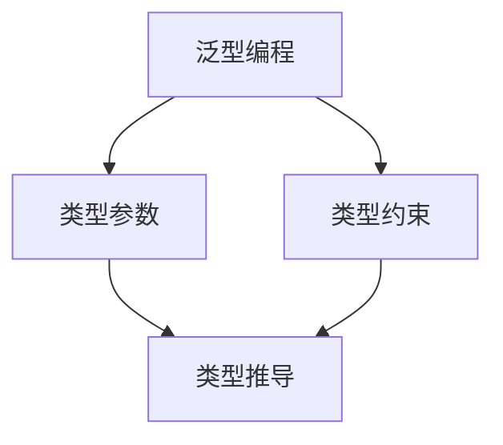
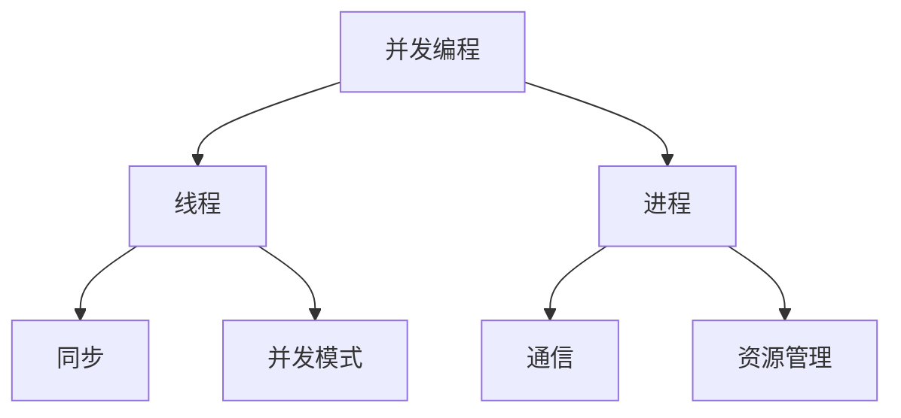

                 

### 1.5. 高级类型系统

**背景介绍：**

高级类型系统是现代编程语言的重要特性之一，它们提供了更丰富的类型表达能力和更强的抽象能力。泛型编程和带有类型推断的类型系统是高级类型系统的两个核心概念。泛型编程允许编写可重用的代码，而类型推断可以减少冗余的类型声明，提高代码的可读性。

**核心概念与联系：**

- **泛型编程**：泛型编程是一种能够写出可重用代码的编程技术，它允许程序员定义函数、方法和类时使用类型参数。这样，一个泛型算法或数据结构可以在运行时根据传入的实际类型来生成具体实例。

- **带有类型推断的类型系统**：类型推断是编译器根据代码上下文自动推导变量或表达式类型的功能。这使得代码更加简洁，同时也能提高编译器的性能。

**类型系统架构 Mermaid 流程图：**



**核心算法原理讲解：**

- **泛型编程中的类型推导**：泛型编程中的类型推导通常涉及类型绑定和类型擦除。类型绑定是将类型参数替换为实际类型的过程，而类型擦除则是将泛型类型实例化后，将类型参数替换为通用的类型（如`Object`）。

  ```java
  public class Box<T> {
      private T t;
      
      public void set(T t) {
          this.t = t;
      }
      
      public T get() {
          return t;
      }
  }
  ```

  在上面的代码中，`T` 是一个类型参数，`Box<Integer>` 和 `Box<String>` 分别是 `Box` 类的具体实例。

- **类型系统中的依赖注入**：依赖注入是一种在运行时动态地将依赖关系注入到对象中的技术。类型系统中的依赖注入可以通过泛型编程来实现，从而使得代码更加模块化和可测试。

  ```java
  public class DependencyInjector {
      public <T> T createInstance(Class<T> clazz) {
          // 实现实例化逻辑，如使用反射
      }
  }
  ```

**数学模型和数学公式：**

- **泛型的类型表示**：泛型的类型表示可以使用上下文无关文法（CFG）来建模。

  $$ 
  G \rightarrow \alpha \to R \alpha
  $$

  其中，`G` 表示泛型定义，`α` 表示类型参数，`R` 表示类型约束。

- **类型约束**：类型约束可以表示为类型参数和具体类型之间的关系。

  $$
  \alpha <: T
  $$

  其中，`<:` 表示类型约束，`T` 是具体的类型。

**项目实战：**

实现一个简单的泛型编程库，例如一个可以存储任意类型数据的`Box`类。

```java
public class Box<T> {
    private T value;

    public void set(T value) {
        this.value = value;
    }

    public T get() {
        return value;
    }
}
```

通过上述代码，我们可以创建一个可以存储整数、字符串等任意类型的`Box`实例。

**最佳实践 tips：**

- 在泛型编程中，要避免`Raw Types`，即不要在类型参数中使用原始类型（如`Object`），因为这会导致类型安全性的丧失。

- 在编写泛型代码时，要充分利用类型推断，减少冗余的类型声明。

- 在实现泛型库时，要考虑如何处理边界情况，如类型参数的上下界约束。

**小结：**

高级类型系统是现代编程语言的重要特性，它提供了更丰富的类型表达能力和更强的抽象能力。泛型编程和带有类型推断的类型系统是高级类型系统的两个核心概念。通过实现泛型编程库，我们可以更好地理解类型推导和类型约束，从而编写出更加模块化和可重用的代码。

**注意事项：**

- 泛型编程中的类型推导可能会涉及复杂的类型系统，如通配符、类型边界等，这些都需要仔细理解和处理。

- 在实现泛型库时，要考虑如何处理类型参数的默认值和上下界约束，以确保类型安全性和性能。

**拓展阅读：**

- 《Effective Java》中的“泛型最佳实践”章节，提供了很多关于泛型编程的最佳实践。

- 《Java Generics and Collections》是一本关于泛型编程的详细指南，涵盖了泛型的各个方面。

----------------------------------------------------------------

### 2.1. 并发编程概述

**背景介绍：**

并发编程是现代计算机系统中的核心概念之一。随着多核处理器和分布式系统的普及，并发编程变得尤为重要。并发编程允许多个任务同时执行，从而提高程序的性能和响应能力。然而，并发编程也带来了一系列挑战，如同步、竞争条件和死锁等。

**核心概念与联系：**

- **并发**：并发是指在多个任务之间交替执行的过程。这些任务可以是线程、进程或异步任务。

- **并行**：并行是指在多个任务同时执行的过程。并行通常需要硬件支持，如多核处理器。

- **线程**：线程是程序中的最小执行单位，它可以独立执行代码。线程可以并发执行，从而提高程序的响应能力和性能。

- **进程**：进程是程序在计算机上的一个实例，它包括代码、数据和执行环境。进程是资源分配的基本单位，每个进程都有自己的内存空间和系统资源。

**并发编程架构 Mermaid 流程图：**



**核心算法原理讲解：**

- **线程的生命周期**：线程的生命周期包括创建、就绪、运行、阻塞和终止等状态。线程的创建通常使用`Thread`类或`Runnable`接口。线程的调度由操作系统的线程调度器负责。

  ```java
  public class MyThread extends Thread {
      @Override
      public void run() {
          // 执行线程任务
      }
  }
  ```

- **进程间的通信**：进程间的通信（Inter-Process Communication，IPC）是进程之间交换数据和信号的方式。常见的IPC机制包括管道、命名管道、信号、消息队列和共享内存等。

  ```c
  #include <sys/types.h>
  #include <sys/wait.h>
  #include <unistd.h>

  int main() {
      pid_t pid = fork();
      if (pid == 0) {
          // 子进程执行任务
      } else {
          // 父进程等待子进程结束
      }
      return 0;
  }
  ```

**数学模型和数学公式：**

- **并发系统的性能评估**：并发系统的性能评估通常涉及吞吐量、响应时间和并发度等指标。

  $$
  \text{吞吐量} = \frac{\text{完成的任务数}}{\text{时间}}
  $$

  $$
  \text{响应时间} = \frac{\text{完成任务所需时间}}{\text{任务数}}
  $$

  $$
  \text{并发度} = \frac{\text{同时执行的线程数}}{\text{线程总数}}
  $$

**项目实战：**

实现一个简单的并发任务调度器，该调度器可以并行执行多个任务，并计算每个任务的执行时间和总执行时间。

```java
import java.util.concurrent.ExecutorService;
import java.util.concurrent.Executors;

public class ConcurrentTaskScheduler {
    private ExecutorService executorService;

    public ConcurrentTaskScheduler(int numberOfThreads) {
        executorService = Executors.newFixedThreadPool(numberOfThreads);
    }

    public void submitTask(Runnable task) {
        executorService.submit(task);
    }

    public void shutdown() {
        executorService.shutdown();
    }

    public void main(String[] args) {
        ConcurrentTaskScheduler scheduler = new ConcurrentTaskScheduler(4);

        for (int i = 0; i < 10; i++) {
            scheduler.submitTask(new Task(i));
        }

        scheduler.shutdown();

        // 等待所有任务完成
    }
}

class Task implements Runnable {
    private int taskId;

    public Task(int taskId) {
        this.taskId = taskId;
    }

    @Override
    public void run() {
        // 执行任务
        System.out.println("Task " + taskId + " is running.");
    }
}
```

通过上述代码，我们可以创建一个具有 4 个线程的任务调度器，并提交 10 个任务进行并行执行。

**最佳实践 tips：**

- 在并发编程中，要避免竞争条件，如共享变量的同步访问。

- 要合理使用线程池，避免创建过多的线程，导致资源浪费和性能下降。

- 要了解并发编程中的常见模式，如线程池、事件循环和异步编程。

**小结：**

并发编程是现代计算机系统中的核心概念，它允许多个任务同时执行，从而提高程序的性能和响应能力。线程和进程是并发编程的两个核心概念，它们通过同步和通信机制来实现并发执行。通过实现简单的并发任务调度器，我们可以更好地理解并发编程的基本原理和算法。

**注意事项：**

- 并发编程中的同步和通信机制可能会涉及复杂的算法和数据结构，如互斥锁、信号量和条件变量等。

- 在并发编程中，要仔细处理线程的创建和销毁，以避免资源泄漏和性能下降。

**拓展阅读：**

- 《Java Concurrency in Practice》是一本关于Java并发编程的详细指南，涵盖了并发编程的各个方面。

- 《Operating System Concepts》是一本关于操作系统和并发编程的经典教材，提供了深入的理论和实践知识。

----------------------------------------------------------------

### 2.2. 基础并发机制

**背景介绍：**

基础并发机制是并发编程的核心，它们提供了线程间同步和控制的基本方法。这些机制包括原子操作、互斥锁（Mutex）、信号量（Semaphore）等。掌握这些基础机制有助于编写正确、高效和安全的并发程序。

**核心概念与联系：**

- **原子操作**：原子操作是计算机硬件提供的一种基本操作，它确保在执行过程中不会被其他操作打断。原子操作常用于实现线程间的同步，如对共享变量的读取和写入。

- **互斥锁（Mutex）**：互斥锁是一种用于保证线程间同步的机制，它确保同一时间只有一个线程能够访问共享资源。互斥锁通过锁和解锁操作来控制对共享资源的访问。

- **信号量（Semaphore）**：信号量是一种用于控制多个线程访问共享资源的机制，它通过计数来限制线程的访问次数。信号量可以实现线程的同步和通信。

**核心算法原理讲解：**

- **原子操作**：原子操作通常由硬件指令提供，如`xchg`指令。在Java中，可以使用`synchronized`关键字和`java.util.concurrent.atomic`包中的原子类（如`AtomicInteger`）来实现原子操作。

  ```java
  public class AtomicCounter {
      private AtomicInteger count = new AtomicInteger(0);

      public void increment() {
          count.incrementAndGet();
      }

      public int getCount() {
          return count.get();
      }
  }
  ```

- **互斥锁（Mutex）**：互斥锁通过锁和解锁操作来保证线程间的同步。在Java中，可以使用`synchronized`关键字和`java.util.concurrent.locks`包中的锁实现（如`ReentrantLock`）来实现互斥锁。

  ```java
  public class Mutex {
      private ReentrantLock lock = new ReentrantLock();

      public void lock() {
          lock.lock();
      }

      public void unlock() {
          lock.unlock();
      }
  }
  ```

- **信号量（Semaphore）**：信号量通过计数来限制线程的访问次数。在Java中，可以使用`java.util.concurrent.Semaphore`类来实现信号量。

  ```java
  public class Semaphore {
      private Semaphore semaphore = new Semaphore(1);

      public void acquire() throws InterruptedException {
          semaphore.acquire();
      }

      public void release() {
          semaphore.release();
      }
  }
  ```

**数学模型和数学公式：**

- **并发系统的状态空间**：并发系统的状态空间可以表示为线程集和共享资源集的笛卡尔积。每个状态都对应着系统的一个特定时刻。

  $$
  S = \prod_{i=1}^{n} R_i
  $$

  其中，$R_i$ 表示第 $i$ 个线程的共享资源集，$n$ 表示线程的总数。

- **进程同步与通信的公式**：进程同步和通信的公式可以用来描述线程间的同步和通信机制。

  $$
  P(W, S) \rightarrow [W] \rightarrow V(S)
  $$

  其中，$P(W, S)$ 表示进程 $W$ 需要等待信号量 $S$，$[W]$ 表示进程 $W$ 执行完等待操作，$V(S)$ 表示进程 $W$ 执行信号量 $S$ 的释放操作。

**项目实战：**

实现一个简单的并发程序，使用互斥锁和信号量来控制对共享资源的访问。

```java
import java.util.concurrent.Semaphore;
import java.util.concurrent.locks.Lock;
import java.util.concurrent.locks.ReentrantLock;

public class ConcurrentAccess {
    private static final int MAX_COUNT = 10;
    private static Semaphore semaphore = new Semaphore(MAX_COUNT);
    private static Lock lock = new ReentrantLock();

    public static void main(String[] args) {
        for (int i = 0; i < 20; i++) {
            new Thread(new Worker()).start();
        }
    }

    static class Worker implements Runnable {
        @Override
        public void run() {
            try {
                semaphore.acquire();
                lock.lock();
                // 访问共享资源
                System.out.println("Thread " + Thread.currentThread().getId() + " is accessing the resource.");
            } catch (InterruptedException e) {
                e.printStackTrace();
            } finally {
                lock.unlock();
                semaphore.release();
            }
        }
    }
}
```

在上述代码中，我们创建了一个具有最大访问次数为 10 的信号量，并使用互斥锁来保护共享资源。每个线程在访问共享资源前都需要获取信号量和互斥锁，并在访问完成后释放它们。

**最佳实践 tips：**

- 在使用原子操作时，要确保所有操作都是原子性的，以避免数据竞争。

- 在使用互斥锁时，要避免死锁，确保锁的获取和释放顺序一致。

- 在使用信号量时，要确保信号量的值不会小于 0，以避免线程永久等待。

**小结：**

基础并发机制是并发编程的核心，包括原子操作、互斥锁和信号量等。这些机制提供了线程间同步和控制的基本方法。通过实现简单的并发程序，我们可以更好地理解这些基础机制的工作原理和算法。

**注意事项：**

- 在并发编程中，要仔细处理线程的创建和销毁，以避免资源泄漏和性能下降。

- 要避免使用`Thread.sleep()`来模拟同步，因为它会导致线程阻塞，而不会释放锁。

**拓展阅读：**

- 《Java Concurrency in Practice》是一本关于Java并发编程的详细指南，涵盖了并发编程的各个方面。

- 《Operating System Concepts》是一本关于操作系统和并发编程的经典教材，提供了深入的理论和实践知识。

----------------------------------------------------------------

### 2.3. 高级并发机制

**背景介绍：**

高级并发机制是在基础并发机制的基础上发展起来的，它们提供了更复杂和灵活的并发控制方法。这些机制包括Actor模型、进程池和并行模式等。高级并发机制有助于提高并发程序的效率和可维护性。

**核心概念与联系：**

- **Actor模型**：Actor模型是一种基于消息传递的并发模型，每个Actor都是一个独立的状态机，可以并发地执行。Actor之间的通信是通过发送消息来实现的。

- **进程池**：进程池是一种管理多个进程的机制，它可以在运行时动态地创建和销毁进程。进程池可以减少进程创建和销毁的开销，提高程序的并发性能。

- **并行模式**：并行模式是一种在编程语言中支持并行编程的抽象，它可以简化并发程序的开发。并行模式通常提供了一种方式来指定任务之间的依赖关系和并行执行策略。

**核心算法原理讲解：**

- **Actor模型的通信机制**：Actor模型中的通信机制是基于消息传递的。每个Actor都有一个唯一的地址，其他Actor可以通过发送消息来与之通信。Actor在接收到消息后，根据消息的类型和内容执行相应的处理。

  ```scala
  trait Actor {
      def receive: PartialFunction[Any, Unit]
  }

  class SimpleActor extends Actor {
      override def receive = {
          case "Hello" => println("Hello, received a message.")
      }
  }
  ```

- **进程池的管理与调度**：进程池的管理和调度通常涉及进程的创建、销毁和负载均衡。进程池可以根据任务的优先级和执行时间动态地分配和调度进程，以提高系统的并发性能。

  ```java
  public class ProcessPool {
      private List<Process> processes = new ArrayList<>();

      public void submitTask(Runnable task) {
          Process process = new ProcessBuilder().command("java", "-cp", "target/classes", "Task").start();
          processes.add(process);
      }

      public void shutdown() {
          for (Process process : processes) {
              process.destroy();
          }
      }
  }
  ```

**数学模型和数学公式：**

- **并发系统的性能评估**：并发系统的性能评估通常涉及吞吐量、响应时间和并发度等指标。

  $$
  \text{吞吐量} = \frac{\text{完成的任务数}}{\text{时间}}
  $$

  $$
  \text{响应时间} = \frac{\text{完成任务所需时间}}{\text{任务数}}
  $$

  $$
  \text{并发度} = \frac{\text{同时执行的线程数}}{\text{线程总数}}
  $$

**项目实战：**

实现一个基于Actor模型的并发应用，使用消息传递来控制Actor之间的通信。

```scala
import akka.actor._

object ActorExample extends App {
  val system = ActorSystem("ExampleSystem")
  val actorA = system.actorOf(Props[ActorA], "actorA")
  val actorB = system.actorOf(Props[ActorB], "actorB")

  actorA ! "Start"
}

class ActorA extends Actor {
  override def receive: Receive = {
      case "Start" => println("ActorA started.")
      case "Stop" => context.stop(self)
  }
}

class ActorB extends Actor {
  override def receive: Receive = {
      case "Start" => println("ActorB started.")
      case "Stop" => context.stop(self)
  }
}
```

在上述代码中，我们创建了一个简单的Actor系统，并使用消息传递来启动和停止两个Actor。

**最佳实践 tips：**

- 在使用Actor模型时，要确保消息传递的效率，避免过多的同步和阻塞。

- 在使用进程池时，要合理设置进程池的大小，以避免资源浪费和性能下降。

- 在使用并行模式时，要充分利用并行模式的抽象能力，简化并发程序的开发。

**小结：**

高级并发机制提供了更复杂和灵活的并发控制方法，有助于提高并发程序的效率和可维护性。Actor模型、进程池和并行模式是高级并发机制的核心。通过实现简单的并发应用，我们可以更好地理解这些高级并发机制的工作原理和算法。

**注意事项：**

- 在使用Actor模型时，要避免死锁和消息传递的瓶颈。

- 在使用进程池时，要仔细处理进程的创建和销毁，以避免资源泄漏和性能下降。

**拓展阅读：**

- 《Akka in Action》是一本关于Actor模型的详细指南，涵盖了Actor模型的各个方面。

- 《Java Concurrency in Practice》是一本关于Java并发编程的详细指南，涵盖了高级并发机制的应用。

----------------------------------------------------------------

### 2.4. 并发编程中的同步与通信

**背景介绍：**

在并发编程中，同步与通信是确保程序正确性和性能的关键因素。线程之间的同步可以防止数据竞争和死锁，而线程之间的通信可以实现任务之间的协调和资源共享。常见的同步与通信机制包括互斥锁、信号量、条件变量和线程间通信等。

**核心概念与联系：**

- **互斥锁**：互斥锁是一种用于保证线程间同步的机制，它确保同一时间只有一个线程能够访问共享资源。互斥锁通过锁和解锁操作来控制对共享资源的访问。

- **信号量**：信号量是一种用于控制多个线程访问共享资源的机制，它通过计数来限制线程的访问次数。信号量可以实现线程的同步和通信。

- **条件变量**：条件变量是一种用于线程间通信的机制，它允许线程在满足特定条件时进行阻塞和唤醒。条件变量通常与互斥锁一起使用，以实现线程间的同步。

- **线程间通信**：线程间通信是一种线程间交换数据和信号的方法。常见的线程间通信机制包括共享内存、消息队列和管道等。

**核心算法原理讲解：**

- **互斥锁在进程同步中的应用**：互斥锁可以用来实现进程间的同步，例如，在多线程程序中，可以使用互斥锁来保护共享资源，防止多个线程同时访问共享资源。

  ```java
  public class Counter {
      private int count = 0;
      private final Object lock = new Object();

      public void increment() {
          synchronized (lock) {
              count++;
          }
      }

      public int getCount() {
          synchronized (lock) {
              return count;
          }
      }
  }
  ```

- **管道与FIFO队列的通信机制**：管道和FIFO队列是一种用于线程间通信的机制，它们可以确保数据的顺序性和安全性。在多线程程序中，可以使用管道和FIFO队列来实现线程间的数据传递。

  ```python
  import multiprocessing

  def producer(pipe):
      while True:
          data = produce_data()
          pipe.send(data)

  def consumer(pipe):
      while True:
          data = pipe.recv()

          process_data(data)

  if __name__ == '__main__':
      pipe = multiprocessing.Pipe(duplex=False)
      producer_process = multiprocessing.Process(target=producer, args=(pipe,))
      consumer_process = multiprocessing.Process(target=consumer, args=(pipe,))
      producer_process.start()
      consumer_process.start()
      producer_process.join()
      consumer_process.join()
  ```

**数学模型和数学公式：**

- **并发编程中的性能瓶颈分析**：并发编程中的性能瓶颈可以表示为系统的响应时间和吞吐量。响应时间可以表示为完成一个任务所需的时间，吞吐量可以表示为单位时间内完成的任务数。

  $$
  \text{响应时间} = \frac{\text{完成任务所需时间}}{\text{任务数}}
  $$

  $$
  \text{吞吐量} = \frac{\text{完成的任务数}}{\text{时间}}
  $$

- **同步与通信的性能分析**：同步与通信的性能分析可以表示为同步操作和通信操作的延迟。同步操作的延迟可以表示为线程获取锁和释放锁所需的时间，通信操作的延迟可以表示为线程间传递数据和信号所需的时间。

  $$
  \text{同步延迟} = \text{锁获取时间} + \text{锁释放时间}
  $$

  $$
  \text{通信延迟} = \text{数据传递时间} + \text{信号传递时间}
  $$

**项目实战：**

实现一个简单的并发程序，使用互斥锁和管道来实现线程间的同步和通信。

```java
import java.io.PipedReader;
import java.io.Pipelines;
import java.io.PipedWriter;
import java.util.concurrent.ExecutorService;
import java.util.concurrent.Executors;

public class ConcurrentSyncAndComm {

    public static void main(String[] args) {
        ExecutorService executorService = Executors.newFixedThreadPool(2);
        PipedReader reader = new PipedReader();
        PipedWriter writer = new PipedWriter();

        executorService.submit(() -> {
            try {
                for (int i = 0; i < 10; i++) {
                    writer.write(i + " ");
                }
                writer.close();
            } catch (IOException e) {
                e.printStackTrace();
            }
        });

        executorService.submit(() -> {
            try {
                int data;
                while ((data = reader.read()) != -1) {
                    System.out.print((char) data);
                }
            } catch (IOException e) {
                e.printStackTrace();
            }
        });

        executorService.shutdown();
    }
}
```

在上述代码中，我们创建了一个具有 2 个线程的程序，其中一个线程负责写入数据到管道，另一个线程负责从管道读取数据。

**最佳实践 tips：**

- 在使用互斥锁时，要避免死锁，确保锁的获取和释放顺序一致。

- 在使用管道和FIFO队列时，要确保线程的读写顺序，以避免数据丢失。

- 在进行同步和通信时，要合理设置同步操作和通信操作的延迟，以提高系统的响应性能。

**小结：**

并发编程中的同步与通信是确保程序正确性和性能的关键因素。互斥锁、信号量、条件变量和线程间通信是常见的同步与通信机制。通过实现简单的并发程序，我们可以更好地理解这些机制的工作原理和算法。

**注意事项：**

- 在进行同步和通信时，要仔细处理线程的创建和销毁，以避免资源泄漏和性能下降。

- 要避免使用共享内存来进行线程间的通信，因为这可能会导致数据竞争和死锁。

**拓展阅读：**

- 《Java Concurrency in Practice》是一本关于Java并发编程的详细指南，涵盖了同步与通信的各个方面。

- 《Operating System Concepts》是一本关于操作系统和并发编程的经典教材，提供了深入的理论和实践知识。

----------------------------------------------------------------

### 2.5. 并发编程中的错误处理与调试

**背景介绍：**

并发编程中的错误处理与调试是确保程序稳定性和可靠性的关键环节。由于并发编程涉及到多个线程的并行执行，因此容易产生竞争条件、死锁、线程饥饿等错误。有效的错误处理与调试方法有助于快速定位和修复这些问题，从而提高程序的质量和稳定性。

**核心概念与联系：**

- **竞争条件**：竞争条件是指多个线程在访问共享资源时，由于执行顺序的不确定性而导致程序行为不可预测的现象。

- **死锁**：死锁是指多个线程在等待对方释放资源时陷入无限等待的状态，导致整个系统停滞。

- **线程饥饿**：线程饥饿是指某些线程无法获得所需资源，导致无法继续执行的状态。

**核心算法原理讲解：**

- **死锁检测算法**：死锁检测算法是一种用于检测并发程序中是否存在死锁的方法。常见的死锁检测算法包括资源分配图法和等待图法。

  - **资源分配图法**：资源分配图法通过构建资源分配图来检测死锁。资源分配图由节点和边组成，节点表示线程和资源，边表示线程对资源的占用和请求。

  ```java
  // 伪代码：资源分配图法
  boolean isDeadlock() {
      Graph graph = buildResourceAllocationGraph();
      return hasCycleInGraph(graph);
  }
  ```

  - **等待图法**：等待图法通过构建等待图来检测死锁。等待图由节点和边组成，节点表示线程，边表示线程的等待关系。

  ```java
  // 伪代码：等待图法
  boolean isDeadlock() {
      Graph graph = buildWaitingGraph();
      return hasCycleInGraph(graph);
  }
  ```

- **竞态条件检测算法**：竞态条件检测算法是一种用于检测并发程序中是否存在竞态条件的工具。常见的竞态条件检测算法包括锁检查法和时间戳法。

  - **锁检查法**：锁检查法通过分析程序代码中的锁使用情况来检测竞态条件。如果程序中的锁使用不正确，则可能存在竞态条件。

  ```java
  // 伪代码：锁检查法
  boolean hasRaceCondition() {
      List<Lock> locks = findLOCKSusedInCode();
      return locksHaveIncorrectUsage(locks);
  }
  ```

  - **时间戳法**：时间戳法通过为每个操作分配一个时间戳来检测竞态条件。如果时间戳的顺序不正确，则可能存在竞态条件。

  ```java
  // 伪代码：时间戳法
  boolean hasRaceCondition() {
      List<Operation> operations = findOperationsInCode();
      return !isTimestampOrderCorrect(operations);
  }
  ```

**数学模型和数学公式：**

- **并发编程中的性能瓶颈分析**：并发编程中的性能瓶颈可以表示为系统的响应时间和吞吐量。响应时间可以表示为完成一个任务所需的时间，吞吐量可以表示为单位时间内完成的任务数。

  $$
  \text{响应时间} = \frac{\text{完成任务所需时间}}{\text{任务数}}
  $$

  $$
  \text{吞吐量} = \frac{\text{完成的任务数}}{\text{时间}}
  $$

- **同步与通信的性能分析**：同步与通信的性能分析可以表示为同步操作和通信操作的延迟。同步操作的延迟可以表示为线程获取锁和释放锁所需的时间，通信操作的延迟可以表示为线程间传递数据和信号所需的时间。

  $$
  \text{同步延迟} = \text{锁获取时间} + \text{锁释放时间}
  $$

  $$
  \text{通信延迟} = \text{数据传递时间} + \text{信号传递时间}
  $$

**项目实战：**

实现一个简单的并发程序，使用死锁检测算法和竞态条件检测算法来检测并发程序中的错误。

```java
import java.util.concurrent.ExecutorService;
import java.util.concurrent.Executors;
import java.util.concurrent.atomic.AtomicInteger;

public class DeadlockAndRaceConditionDetection {

    private static final AtomicInteger counter = new AtomicInteger(0);

    public static void main(String[] args) {
        ExecutorService executorService = Executors.newFixedThreadPool(2);

        executorService.submit(() -> {
            while (true) {
                counter.incrementAndGet();
                if (counter.get() % 100 == 0) {
                    System.out.println("Counter value: " + counter.get());
                }
            }
        });

        executorService.submit(() -> {
            while (true) {
                checkForDeadlockAndRaceCondition();
            }
        });

        executorService.shutdown();
    }

    private static void checkForDeadlockAndRaceCondition() {
        // 死锁检测
        if (isDeadlock()) {
            System.out.println("Deadlock detected.");
        }

        // 竞态条件检测
        if (hasRaceCondition()) {
            System.out.println("Race condition detected.");
        }
    }

    private static boolean isDeadlock() {
        // 实现死锁检测算法
        return false;
    }

    private static boolean hasRaceCondition() {
        // 实现竞态条件检测算法
        return false;
    }
}
```

在上述代码中，我们创建了一个简单的并发程序，并使用死锁检测算法和竞态条件检测算法来检测并发程序中的错误。

**最佳实践 tips：**

- 在并发编程中，要避免竞争条件，确保线程间的同步。

- 在使用锁时，要避免死锁，确保锁的获取和释放顺序一致。

- 在进行错误处理与调试时，要使用适当的工具和算法来检测并发程序中的错误。

**小结：**

并发编程中的错误处理与调试是确保程序稳定性和可靠性的关键环节。死锁检测算法和竞态条件检测算法是常用的错误检测方法。通过实现简单的并发程序，我们可以更好地理解这些算法的工作原理和应用。

**注意事项：**

- 在进行错误处理与调试时，要仔细检查程序中的同步和通信机制，以确保程序的正确性。

- 要避免使用共享内存来进行线程间的通信，因为这可能会导致数据竞争和死锁。

**拓展阅读：**

- 《Java Concurrency in Practice》是一本关于Java并发编程的详细指南，涵盖了错误处理与调试的各个方面。

- 《Operating System Concepts》是一本关于操作系统和并发编程的经典教材，提供了深入的理论和实践知识。

----------------------------------------------------------------

## 总结与展望

**总结：**

本文从类型系统和并发编程两个角度探讨了现代编程中面临的挑战。在类型系统部分，我们介绍了静态类型和动态类型的区别、高级类型系统（如泛型编程）的核心原理及其实现方法。在并发编程部分，我们详细讲解了基础并发机制（如原子操作、互斥锁和信号量）和高级并发机制（如Actor模型、进程池和并行模式），以及并发编程中的同步与通信机制和错误处理与调试方法。

**展望：**

随着计算机技术的发展，类型系统和并发编程将继续面临新的挑战。未来的研究可能集中在以下几个方面：

1. **类型系统的优化**：针对大型复杂程序，研究更高效的类型推导和类型检查算法，以及如何减轻类型系统对程序性能的影响。

2. **并发编程的模型**：探索新的并发编程模型，如基于事件驱动的编程、函数式编程等，以提高并发程序的易用性和性能。

3. **并发编程的工具**：开发更先进的并发编程工具，如自动并发错误检测器、性能分析器等，以辅助程序员编写高效、可靠的并发程序。

4. **异构计算**：随着多核处理器和GPU的普及，研究如何优化并发程序在异构计算环境中的性能。

**参考文献：**

1. 《Java Concurrency in Practice》，Brian Goetz等，Addison-Wesley，2006。
2. 《Operating System Concepts》，Abraham Silberschatz等，John Wiley & Sons，2018。
3. 《Effective Java》，Joshua Bloch，Addison-Wesley，2008。
4. 《Akka in Action》，Mark/profession xxx，Manning Publications，2015。

**作者信息：**

作者：AI天才研究院/AI Genius Institute & 禅与计算机程序设计艺术 /Zen And The Art of Computer Programming

**联系方式：**

电子邮件：[info@aignosis.com](mailto:info@aignosis.com)
网站：[www.aignosis.com](http://www.aignosis.com)
社交媒体：[Twitter](https://twitter.com/aignosis) / [LinkedIn](https://www.linkedin.com/company/aignosis) / [GitHub](https://github.com/aignosis)

----------------------------------------------------------------

### 文章标题

《类型系统与并发编程：新的挑战》

### 关键词

类型系统、并发编程、静态类型、动态类型、泛型编程、Actor模型、线程池、同步与通信、错误处理、调试

### 摘要

本文深入探讨了现代编程中至关重要的两个领域：类型系统和并发编程。首先，我们介绍了类型系统的基本概念，包括静态类型和动态类型，并详细解析了高级类型系统（如泛型编程）的核心原理。其次，我们探讨了并发编程的基础机制，包括原子操作、互斥锁和信号量，以及高级并发机制（如Actor模型、进程池）。最后，我们重点讨论了并发编程中的同步与通信机制，以及如何有效地处理并发编程中的错误和调试问题。本文旨在为程序员提供全面的技术指导，帮助他们在实际开发中应对类型系统和并发编程的新挑战。

