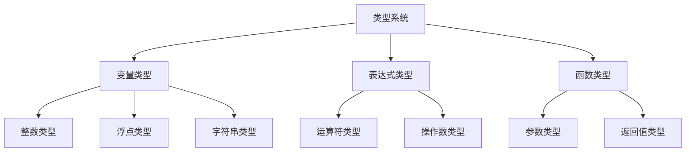

                 

### 文章标题

# 类型系统与程序合成的新进展

### 关键词

- 类型系统
- 程序合成
- 编译器优化
- 静态类型检查
- 动态类型检查
- 约束求解
- 代码生成

### 摘要

本文将深入探讨类型系统与程序合成领域的新进展。类型系统是计算机语言的核心概念之一，它为程序提供了明确的语义定义，从而保证了程序的正确性和可靠性。程序合成则通过自动化技术生成高效、可信赖的代码。本文将详细分析类型系统的基本概念、类型检查机制、类型推导方法，以及程序合成的基本算法、工具和应用。同时，本文将介绍类型系统和程序合成领域的新研究成果，如面向类型系统的优化和面向程序合成的优化技术。最后，本文将结合实际项目，展示类型系统和程序合成在实际开发中的应用，并总结最佳实践和注意事项。

## 第一部分：类型系统基础

### 1.1 类型系统概述

#### 1.1.1 类型系统的定义

类型系统（Type System）是计算机语言中的一个核心概念，它定义了变量、表达式和函数的语义类型。类型系统的目的是为程序提供明确的语义约束，以确保程序的正确性和可靠性。

#### 1.1.2 类型系统的作用

类型系统在编译器、解释器和运行时环境中起着至关重要的作用。它帮助编译器或解释器检查程序中的类型错误，并在运行时执行类型安全检查，防止不安全的行为发生。

#### 1.1.3 类型系统的分类

类型系统可以分为静态类型系统（Static Type System）和动态类型系统（Dynamic Type System）。静态类型系统在编译时检查类型，而动态类型系统在运行时检查类型。

### 1.2 类型检查机制

#### 1.2.1 静态类型检查

静态类型检查（Static Type Checking）在编译时进行类型检查。它能够及早发现类型错误，但可能牺牲一定的灵活性。

#### 1.2.2 动态类型检查

动态类型检查（Dynamic Type Checking）在运行时进行类型检查。它能够提供更高的灵活性，但可能牺牲一定的性能和安全性。

#### 1.2.3 强类型与弱类型

强类型（Strong Type）要求变量在声明时必须明确类型，并且在运行时无法隐式转换类型。弱类型（Weak Type）允许隐式类型转换，从而提供更高的灵活性。

### 1.3 类型推导

#### 1.3.1 静态类型推导

静态类型推导（Static Type Inference）是在编译时推导出变量和表达式的类型。它有助于减少代码的冗长性和提高可读性。

#### 1.3.2 动态类型推导

动态类型推导（Dynamic Type Inference）是在运行时推导出变量和表达式的类型。它提供了更高的灵活性和动态性。

#### 1.3.3 静态类型推导算法

静态类型推导算法包括几种常用的算法，如主语类型算法（Principal Type Inference Algorithm）、单赋值类型算法（Single Assignment Type Algorithm）和上下文感知类型算法（Context-Sensitive Type Algorithm）。

## 第二部分：程序合成基础

### 2.1 程序合成概述

#### 2.1.1 程序合成的定义

程序合成（Program Synthesis）是一种自动化技术，它通过分析输入数据和约束条件生成高效、可信赖的代码。

#### 2.1.2 程序合成的应用场景

程序合成广泛应用于各种领域，如编译器生成、自动化测试、代码重构和程序优化。

#### 2.1.3 程序合成的挑战

程序合成的挑战包括解决复杂的约束求解问题、生成可理解、可维护的代码以及提高代码的执行效率。

### 2.2 程序合成算法

#### 2.2.1 约束求解算法

约束求解算法（Constraint Solving Algorithm）是程序合成的核心，它通过解决约束条件生成代码。

#### 2.2.2 模式匹配算法

模式匹配算法（Pattern Matching Algorithm）用于识别和解析输入数据，为约束求解提供基础。

#### 2.2.3 代码生成算法

代码生成算法（Code Generation Algorithm）根据约束求解结果生成高效的代码。

### 2.3 程序合成工具

#### 2.3.1 主要程序合成工具介绍

本文将介绍几种主要的程序合成工具，如Coq、Isabelle、ALF 和 KeY。

#### 2.3.2 工具的优缺点分析

本文将对这些工具的优缺点进行详细分析，以帮助读者选择合适的工具。

#### 2.3.3 工具的实际应用案例

本文将结合实际应用案例，展示程序合成工具在实际开发中的应用效果。

## 第三部分：类型系统与程序合成的新进展

### 3.1 面向类型系统的优化

#### 3.1.1 类型系统的优化策略

本文将介绍几种面向类型系统的优化策略，如类型推导优化、类型检查优化和类型安全优化。

#### 3.1.2 类型系统的优化算法

本文将介绍几种类型系统优化算法，如类型推断算法、类型检查算法和类型安全算法。

#### 3.1.3 优化案例研究

本文将结合实际案例，研究类型系统优化的效果和实现方法。

### 3.2 面向程序合成的优化

#### 3.2.1 程序合成的优化策略

本文将介绍几种面向程序合成的优化策略，如代码生成优化、模式匹配优化和约束求解优化。

#### 3.2.2 程序合成的优化算法

本文将介绍几种程序合成优化算法，如代码生成算法、模式匹配算法和约束求解算法。

#### 3.2.3 优化案例研究

本文将结合实际案例，研究程序合成优化的效果和实现方法。

### 3.3 类型系统与程序合成的新算法

#### 3.3.1 新算法的研究背景

本文将介绍类型系统和程序合成领域的新研究成果，如基于机器学习的类型推导算法和基于遗传算法的约束求解算法。

#### 3.3.2 新算法的设计思路

本文将详细分析新算法的设计思路和实现方法。

#### 3.3.3 新算法的性能评估

本文将结合实验数据，评估新算法的性能和效果。

## 第四部分：项目实战

### 4.1 实际项目案例

#### 4.1.1 项目背景

本文将介绍一个实际项目案例，以展示类型系统和程序合成在实际开发中的应用。

#### 4.1.2 需求分析

本文将分析项目的需求，并确定类型系统和程序合成的具体应用场景。

#### 4.1.3 技术选型

本文将介绍项目中使用的技术选型，如编程语言、编译器、解释器和程序合成工具。

### 4.2 项目开发流程

#### 4.2.1 开发环境搭建

本文将介绍项目开发环境的搭建过程，包括编译器、解释器和程序合成工具的安装和配置。

#### 4.2.2 关键代码实现

本文将详细讲解项目中关键代码的实现过程，包括类型系统的设计和程序合成的应用。

#### 4.2.3 项目测试与部署

本文将介绍项目的测试和部署过程，并分析项目在实际应用中的性能和稳定性。

### 4.3 项目评估与总结

#### 4.3.1 项目成果评估

本文将评估项目的成果，包括类型系统和程序合成技术的应用效果。

#### 4.3.2 项目经验总结

本文将总结项目开发中的经验教训，为后续类似项目提供参考。

#### 4.3.3 项目展望

本文将展望项目的未来发展，讨论类型系统和程序合成领域的新趋势。

## 附录

### A.1 工具与资源介绍

#### A.1.1 类型系统工具

本文将介绍几种常用的类型系统工具，包括编译器、解释器和程序合成工具。

#### A.1.2 程序合成工具

本文将介绍几种常用的程序合成工具，包括Coq、Isabelle、ALF 和 KeY。

#### A.1.3 学习资源推荐

本文将推荐一些学习类型系统和程序合成领域的优秀资源，包括书籍、论文和在线课程。

### A.2 Mermaid流程图示例

本文将提供几个Mermaid流程图示例，以帮助读者更好地理解类型系统和程序合成的工作流程。

### A.3 伪代码示例

本文将提供几个伪代码示例，以帮助读者更好地理解类型系统和程序合成算法的实现方法。

---

**作者：AI天才研究院/AI Genius Institute & 禅与计算机程序设计艺术 /Zen And The Art of Computer Programming**

**本文旨在探讨类型系统和程序合成领域的新进展，为读者提供深入的理解和实用的指导。**### 1.1 类型系统概述

类型系统（Type System）是计算机语言的核心组成部分，它为程序中的变量、表达式和函数提供了明确的语义定义，从而确保了程序的正确性和可靠性。类型系统的定义主要包括以下几个方面：

首先，类型系统定义了变量和表达式的数据类型。数据类型是变量和表达式可以表示的数据类别，如整数、浮点数、字符串和布尔值等。不同类型的变量和表达式在内存中占用的空间不同，操作的方式也有所区别。

其次，类型系统定义了变量和表达式之间的兼容性规则。例如，在许多编程语言中，整型（Integer）可以隐式转换为浮点型（Floating Point），但浮点型无法隐式转换为整型，因为这可能会导致精度损失。

第三，类型系统定义了类型检查机制，以确保程序的语义正确性。类型检查是在编译时或运行时对程序中的类型使用进行验证的过程。编译器或解释器根据类型系统规则对程序进行类型检查，如果在程序中发现类型错误，则会报告相应的错误信息。

类型系统的作用主要体现在以下几个方面：

1. **错误检测**：类型系统能够帮助编译器或解释器及早发现类型错误，如变量未初始化、不兼容的类型转换等。这有助于减少程序中的错误，提高程序的可维护性。

2. **性能优化**：类型信息有助于编译器进行代码生成和优化。例如，编译器可以根据变量的数据类型选择更高效的内存访问方式和运算指令。

3. **语言设计**：类型系统是编程语言设计的重要组成部分。不同的类型系统可以支持不同的编程范式，如面向对象、函数式编程和过程式编程等。

4. **程序理解**：类型信息有助于程序的理解和维护。明确的数据类型和类型检查规则使得程序代码更易于阅读和理解。

类型系统可以分为以下几种分类：

1. **静态类型系统**（Static Type System）：在编译时对程序进行类型检查，变量和函数在声明时必须指定类型，类型信息不会在运行时改变。静态类型系统有助于及早发现类型错误，但可能牺牲一定的灵活性。

2. **动态类型系统**（Dynamic Type System）：在运行时对程序进行类型检查，变量的类型信息在运行时确定。动态类型系统提供了更高的灵活性，但可能牺牲一定的性能和安全性。

3. **强类型系统**（Strong Type System）：在声明时要求变量和函数具有明确的类型，运行时不允许隐式类型转换。强类型系统能够提供更好的类型安全性，但可能增加代码的冗长性。

4. **弱类型系统**（Weak Type System）：允许隐式类型转换，即不同类型的变量和表达式可以自动转换为兼容的类型。弱类型系统提供了更高的灵活性，但可能增加类型错误的风险。

类型系统不仅影响程序的正确性和性能，还影响编程范式的选择和程序设计的灵活性。不同的类型系统适用于不同的编程场景和需求，因此在选择编程语言时，类型系统是一个重要的考虑因素。通过深入理解类型系统的基本概念和分类，我们可以更好地设计、理解和优化程序。

### 1.2 类型检查机制

类型检查机制（Type Checking Mechanism）是确保程序类型安全性的关键环节。它通过在编译时或运行时对程序中的类型使用进行验证，以确保程序的正确性和可靠性。类型检查机制可以分为静态类型检查（Static Type Checking）和动态类型检查（Dynamic Type Checking）两大类。

#### 1.2.1 静态类型检查

静态类型检查（Static Type Checking）在编译时进行类型检查，这意味着在程序运行之前，编译器会对程序进行彻底的类型分析。静态类型检查的主要优势在于：

1. **及早发现类型错误**：通过在编译时进行类型检查，静态类型检查可以及早发现类型错误，如变量未初始化、不兼容的类型转换等。这有助于在程序运行前就排除潜在的错误，从而提高程序的可维护性。

2. **性能优化**：静态类型信息有助于编译器进行代码生成和优化。编译器可以根据类型信息选择更高效的内存访问方式和运算指令，从而提高程序的运行效率。

3. **类型安全**：静态类型检查能够确保程序在运行时不会发生类型错误，从而提高了程序的安全性和可靠性。

然而，静态类型检查也存在一些局限性：

1. **牺牲灵活性**：由于在编译时必须指定变量的类型，静态类型系统可能增加代码的冗长性和维护成本。

2. **编译时间延长**：静态类型检查需要更多的计算资源，可能导致编译时间延长。

静态类型检查的基本流程如下：

1. **类型声明**：程序中的每个变量和函数在声明时必须指定类型，如`int a;`和`void function(int x)`。

2. **类型绑定**：编译器将每个变量和表达式的使用与其声明时的类型进行绑定，确保类型的一致性。

3. **类型检查**：编译器根据类型系统规则对程序中的表达式和函数调用进行检查，确保它们的类型兼容。

4. **错误报告**：如果发现类型错误，编译器会报告相应的错误信息，如`Type mismatch in expression`。

以下是一个简单的静态类型检查示例：

```java
// 假设我们有一个简单的编译器，它支持整数和字符串类型
int a = 5;
String b = "hello";
a = a + b; // 类型错误：整数和字符串不能直接相加
```

在这个示例中，`a`是一个整数，`b`是一个字符串。当尝试将`a`和`b`相加时，编译器会报告类型错误，因为整数和字符串不能直接相加。

#### 1.2.2 动态类型检查

动态类型检查（Dynamic Type Checking）在运行时进行类型检查，这意味着程序在运行过程中会动态地确定变量的类型。动态类型检查的主要优势在于：

1. **更高灵活性**：动态类型系统允许在运行时改变变量的类型，从而提供了更高的灵活性。这种灵活性对于需要动态调整数据类型的程序来说非常有用。

2. **减少代码冗长性**：在动态类型系统中，程序员不需要在声明时指定变量的类型，从而减少了代码的冗长性。

然而，动态类型检查也有一些缺点：

1. **性能开销**：动态类型检查需要在每次变量使用时进行类型检查，这可能导致性能开销。

2. **类型安全问题**：由于类型信息在运行时确定，动态类型系统可能更容易出现类型错误，从而影响程序的安全性和可靠性。

动态类型检查的基本流程如下：

1. **运行时绑定**：在程序运行时，每个变量和表达式的类型信息会在运行时确定。

2. **类型检查**：每次变量或表达式使用时，解释器或运行时环境会对其进行类型检查，确保类型兼容。

3. **错误报告**：如果在运行时发现类型错误，解释器或运行时环境会报告相应的错误信息。

以下是一个简单的动态类型检查示例：

```python
a = 5
b = "hello"
a = a + b  # 运行时类型检查：整数和字符串可以相加
```

在这个示例中，`a`最初被声明为整数，但在运行时被赋值为字符串。当尝试将`a`和`b`相加时，Python解释器会动态地检查它们的类型，发现它们是兼容的（在Python中，整数和字符串可以相加），因此不会报错。

#### 1.2.3 强类型与弱类型

在讨论静态类型检查和动态类型检查时，我们经常会提到强类型（Strong Type）和弱类型（Weak Type）的概念。

1. **强类型系统**（Strong Type System）：在强类型系统中，变量的类型在声明时必须明确指定，并且在运行时不允许隐式类型转换。强类型系统的主要优点包括：

   - 提高程序的安全性：强类型系统能够防止不兼容的类型转换，从而减少类型错误的风险。
   - 提高程序的可维护性：明确的数据类型和类型检查规则使得程序代码更易于阅读和理解。

   然而，强类型系统也可能增加代码的冗长性，因为程序员必须在声明时指定所有的类型。

2. **弱类型系统**（Weak Type System）：在弱类型系统中，变量和表达式之间的类型转换是隐式的，这意味着不同类型的变量和表达式可以自动转换为兼容的类型。弱类型系统的主要优点包括：

   - 提高编程灵活性：弱类型系统允许更灵活的类型转换，从而可以编写更简洁的代码。
   - 减少代码冗长性：在弱类型系统中，程序员不需要在声明时指定所有的类型。

   然而，弱类型系统也可能带来类型安全问题和性能开销。

在实际编程中，选择强类型系统还是弱类型系统需要根据具体的应用场景和需求进行权衡。强类型系统适用于需要严格类型控制和较高安全性的场景，而弱类型系统适用于需要灵活性和简洁性的场景。

综上所述，类型检查机制是确保程序类型安全性的关键环节。静态类型检查和动态类型检查各有优缺点，强类型系统和弱类型系统也适用于不同的应用场景。通过深入理解类型检查机制和类型系统的分类，我们可以更好地设计和优化程序，提高程序的正确性和可靠性。

### 1.3 类型推导

类型推导（Type Inference）是类型系统的一个重要组成部分，它使得程序员无需显式声明变量或表达式的类型，从而简化代码的编写过程。类型推导可以分为静态类型推导和动态类型推导两大类。

#### 1.3.1 静态类型推导

静态类型推导（Static Type Inference）是在编译时进行的类型推导，这意味着编译器在编译程序时会自动推导出变量和表达式的类型。静态类型推导的主要优势包括：

1. **代码简洁性**：程序员无需在声明时指定变量或表达式的类型，从而减少了代码的冗余。
2. **增强可维护性**：类型推导使得代码更易于阅读和理解，因为类型信息在代码中是隐式的。
3. **类型安全**：静态类型推导有助于及早发现类型错误，从而提高程序的正确性。

静态类型推导可以分为几种不同的算法：

1. **主语类型算法**（Principal Type Inference Algorithm）：主语类型算法是最基础的类型推导算法，它适用于许多高级编程语言。该算法的基本思想是，通过分析表达式中的操作符和操作数，推导出表达式的类型。以下是一个简单的示例：

   ```haskell
   f x = x * 2
   ```

   在这个例子中，`x`是一个参数，它会被自动推导为整数类型。函数`f`返回的结果类型为`Int`（整数）。

2. **单赋值类型算法**（Single Assignment Type Algorithm）：单赋值类型算法适用于函数和循环结构，它通过分析变量在单赋值中的使用，推导出变量的类型。以下是一个示例：

   ```python
   def calculate_area(radius):
       area = radius * radius
       return area
   ```

   在这个例子中，`radius`和`area`都是整数类型，因为它们在单赋值语句中使用。

3. **上下文感知类型算法**（Context-Sensitive Type Algorithm）：上下文感知类型算法考虑了程序中上下文信息，从而能够更准确地推导出变量和表达式的类型。这种算法通常用于复杂的高级编程语言，如Java和C#。以下是一个示例：

   ```java
   public class Example {
       public static void main(String[] args) {
           int result = add(5, 10);
       }

       public static int add(int a, int b) {
           return a + b;
       }
   }
   ```

   在这个例子中，`add`函数的参数和返回值类型都是整数类型，因为上下文信息表明它们应该是整数。

以下是一个简单的静态类型推导算法的伪代码示例：

```pseudo
function infer_type(expression):
    if expression is a variable:
        return the type of the variable
    else if expression is an arithmetic operation:
        left_type = infer_type(expression.left)
        right_type = infer_type(expression.right)
        if left_type is not compatible with right_type:
            report type error
        return the common type of left_type and right_type
    else if expression is a function call:
        return the return type of the function
    else:
        report type error
```

在这个伪代码中，`infer_type`函数用于推导表达式的类型。它首先检查表达式的类型，然后根据操作符和操作数推导出表达式的类型。如果类型不兼容，则报告类型错误。

#### 1.3.2 动态类型推导

动态类型推导（Dynamic Type Inference）是在运行时进行的类型推导，这意味着程序在运行时会自动推导出变量和表达式的类型。动态类型推导的主要优势包括：

1. **更高灵活性**：动态类型推导允许在运行时改变变量的类型，从而提供了更高的灵活性。
2. **减少代码冗长性**：程序员无需在声明时指定变量或表达式的类型，从而减少了代码的冗余。

动态类型推导的基本过程如下：

1. **初始化**：在程序开始运行时，所有变量的类型被初始化为未指定类型。
2. **类型推导**：每次变量或表达式使用时，解释器或运行时环境会推导出其类型。这通常通过在运行时检查变量或表达式的使用方式和上下文信息来实现。
3. **类型绑定**：推导出的类型被绑定到变量或表达式中，以便在后续使用时进行类型检查。

以下是一个简单的动态类型推导示例：

```python
def add(a, b):
    return a + b

result = add(5, "10")  # 动态类型推导：`result`类型为字符串
print(result)  # 输出："55"
```

在这个例子中，`add`函数的两个参数`a`和`b`在声明时没有指定类型。当调用`add`函数时，Python解释器会动态推导出`a`和`b`的类型，并尝试将它们相加。由于`a`是整数，`b`是字符串，Python会自动将整数转换为字符串，从而允许这两个不同类型的参数进行相加。最后，`result`的类型被推导为字符串。

动态类型推导在许多动态类型语言中得到了广泛应用，如Python、JavaScript和Ruby。这些语言通常使用简单的规则和上下文信息来推导类型，从而提供了一种灵活且易于使用的编程体验。

#### 1.3.3 静态类型推导算法

静态类型推导算法在编译器和编程语言设计中起着关键作用。以下是一些常见的静态类型推导算法：

1. **主语类型算法**：主语类型算法是最基础的类型推导算法，它基于表达式的操作符和操作数推导出表达式的类型。以下是一个简单的伪代码示例：

   ```pseudo
   function infer_type(expression):
       if expression is a variable:
           return the type of the variable
       else if expression is an arithmetic operation:
           left_type = infer_type(expression.left)
           right_type = infer_type(expression.right)
           if left_type is not compatible with right_type:
               report type error
           return the common type of left_type and right_type
       else if expression is a function call:
           return the return type of the function
       else:
           report type error
   ```

   在这个伪代码中，`infer_type`函数用于推导表达式的类型。它首先检查表达式的类型，然后根据操作符和操作数推导出表达式的类型。如果类型不兼容，则报告类型错误。

2. **单赋值类型算法**：单赋值类型算法适用于函数和循环结构，它通过分析变量在单赋值中的使用，推导出变量的类型。以下是一个伪代码示例：

   ```pseudo
   function infer_type(statement):
       if statement is an assignment:
           expression_type = infer_type(statement.expression)
           variable_type = expression_type
           return variable_type
       else if statement is a function or loop:
           for each variable in the statement:
               variable_type = infer_type(variable)
           return the type of the statement
   ```

   在这个伪代码中，`infer_type`函数用于推导语句的类型。如果语句是单赋值，它推导出表达式的类型，并将变量类型设置为表达式的类型。如果语句是函数或循环，它为每个变量推导出类型。

3. **上下文感知类型算法**：上下文感知类型算法考虑了程序中的上下文信息，从而能够更准确地推导出变量和表达式的类型。以下是一个简单的伪代码示例：

   ```pseudo
   function infer_type(expression, context):
       if expression is a variable:
           return the type of the variable
       else if expression is an arithmetic operation:
           left_type = infer_type(expression.left, context)
           right_type = infer_type(expression.right, context)
           if left_type is not compatible with right_type:
               report type error
           return the common type of left_type and right_type
       else if expression is a function call:
           return the return type of the function
       else:
           report type error
   ```

   在这个伪代码中，`infer_type`函数用于推导表达式的类型，并考虑上下文信息。它首先检查表达式的类型，然后根据操作符和操作数以及上下文信息推导出表达式的类型。如果类型不兼容，则报告类型错误。

通过这些静态类型推导算法，编译器可以在编译时自动推导出变量和表达式的类型，从而简化代码的编写过程，提高程序的可维护性和可靠性。

### 2.1 程序合成概述

程序合成（Program Synthesis）是一种自动化技术，它通过分析输入数据和约束条件生成高效、可信赖的代码。程序合成的目标是减少手工编码的工作量，提高开发效率，同时保证代码的正确性和效率。

#### 2.1.1 程序合成的定义

程序合成是一种从一组输入数据和约束条件中自动生成程序的技术。它通过分析输入数据，理解用户的需求，并利用约束求解和代码生成技术，生成满足约束条件的代码。程序合成的核心思想是将编程任务抽象为求解问题，通过自动化工具来寻找最优解。

#### 2.1.2 程序合成的应用场景

程序合成广泛应用于各种领域，包括编译器生成、自动化测试、代码重构、程序优化、自然语言处理和人工智能等。以下是一些典型的应用场景：

1. **编译器生成**：程序合成可以用于自动生成编译器的核心部分，如词法分析器、语法分析器和代码生成器。这减少了手动编写编译器的复杂性，提高了开发效率。

2. **自动化测试**：程序合成可以自动生成测试用例，以验证程序的正确性和可靠性。通过分析程序的输入和预期输出，程序合成工具可以生成满足特定测试需求的测试用例。

3. **代码重构**：程序合成可以帮助自动重构代码，以提高代码的可读性和可维护性。通过分析现有代码的结构和语义，程序合成工具可以生成更简洁、更高效的代码。

4. **程序优化**：程序合成可以用于优化现有程序，以提高其性能。通过分析程序的执行路径和性能瓶颈，程序合成工具可以生成优化后的代码，从而减少执行时间和资源消耗。

5. **自然语言处理**：在自然语言处理领域，程序合成可以用于生成自然语言文本。通过分析语言模型和上下文信息，程序合成工具可以生成符合语法和语义规则的自然语言文本。

6. **人工智能**：在人工智能领域，程序合成可以用于生成智能算法和模型。通过分析大量数据和学习模型，程序合成工具可以生成满足特定任务需求的智能算法和模型。

#### 2.1.3 程序合成的挑战

尽管程序合成具有广泛的潜在应用，但在实际实现过程中仍然面临一些挑战：

1. **复杂性**：程序合成需要处理复杂的输入数据和约束条件，这可能导致求解问题的复杂性增加。设计高效的算法和求解策略是程序合成成功的关键。

2. **可理解性**：生成的代码需要易于理解和维护。程序合成工具需要确保生成的代码具有清晰的语义和良好的结构，从而提高代码的可读性和可维护性。

3. **效率**：程序合成工具需要具有较高的执行效率，以减少开发时间和资源消耗。优化算法和代码生成技术是提高程序合成效率的关键。

4. **泛化能力**：程序合成工具需要能够处理不同类型的问题和场景，具有良好的泛化能力。这要求程序合成工具能够适应多种编程范式和语言特性。

5. **错误处理**：程序合成工具需要能够处理输入数据中的错误和不一致，确保生成的代码是正确的。设计有效的错误检测和修复机制是程序合成的重要组成部分。

总的来说，程序合成是一种有前途的自动化技术，它为软件开发提供了新的方法和工具。通过解决上述挑战，程序合成有望在未来发挥更大的作用，提高软件开发效率和代码质量。

### 2.2 程序合成算法

程序合成算法是程序合成技术的核心，它通过处理输入数据和约束条件，生成满足特定需求的代码。这些算法通常涉及约束求解、模式匹配和代码生成等步骤。以下是几种常见的程序合成算法：

#### 2.2.1 约束求解算法

约束求解算法（Constraint Solving Algorithm）是程序合成中处理约束条件的关键步骤。它的目标是找到满足所有约束条件的解。以下是一些常见的约束求解算法：

1. **回溯算法**（Backtracking Algorithm）：回溯算法通过尝试不同的解，并在遇到冲突时回溯到上一个决策点，从而找到满足所有约束条件的解。这种算法的优点是简单易实现，但可能在解空间较大时效率较低。

2. **分支定界算法**（Branch and Bound Algorithm）：分支定界算法通过在解空间中剪枝，减少搜索空间，从而提高求解效率。它通过限制搜索方向和优化分支选择，避免了不必要的搜索，但实现较为复杂。

3. **局部搜索算法**（Local Search Algorithm）：局部搜索算法通过在当前解的邻域内搜索最优解。常见的局部搜索算法包括遗传算法、模拟退火算法和禁忌搜索算法。这些算法通常具有较高的求解效率，但可能陷入局部最优解。

4. **基于约束传播的算法**（Constraint Propagation Algorithm）：基于约束传播的算法通过在约束条件中传播约束信息，减少变量的取值范围，从而加速求解过程。常见的算法包括线性约束传播算法和隐式约束传播算法。

以下是一个简单的回溯算法伪代码示例：

```pseudo
function solve_constraints(constraints, variables):
    if all constraints are satisfied:
        return solution
    for each variable in variables:
        for each value in variable's domain:
            if value satisfies constraints:
                assign value to variable
                solve_constraints(constraints, variables - {variable})
                if a solution is found:
                    return solution
                backtracking: undo assignment
    return no solution
```

在这个伪代码中，`solve_constraints`函数尝试为变量分配值，直到找到满足所有约束条件的解或确定没有解。当遇到冲突时，它会回溯到上一个决策点，尝试其他值。

#### 2.2.2 模式匹配算法

模式匹配算法（Pattern Matching Algorithm）用于识别和解析输入数据，为约束求解提供基础。以下是一些常见的模式匹配算法：

1. **前缀树匹配**（Prefix Tree Matching）：前缀树匹配算法通过构建前缀树来快速识别输入数据中的模式。它适用于字符匹配，如字符串搜索和文本解析。

2. **有限自动机匹配**（Finite Automaton Matching）：有限自动机匹配算法通过构建有限自动机来识别输入数据中的模式。它适用于字符和词法分析，如编程语言的词法分析器。

3. **正则表达式匹配**（Regular Expression Matching）：正则表达式匹配算法通过解析正则表达式，识别输入数据中的模式。它适用于复杂模式的匹配，如文本搜索和数据处理。

以下是一个简单的正则表达式匹配算法伪代码示例：

```pseudo
function match_regex(input, regex):
    if regex is empty:
        return true
    if input is empty:
        return false
    if regex's first character is a literal:
        if input's first character does not match regex's first character:
            return false
        return match_regex(input[1:], regex[1:])
    if regex's first character is a wildcard:
        for each character in input:
            if match_regex(input, regex[1:]):
                return true
        return false
```

在这个伪代码中，`match_regex`函数尝试匹配输入数据和正则表达式。如果输入数据的第一个字符与正则表达式的第一个字符匹配，函数递归地调用自身，继续匹配剩余的字符。如果正则表达式的第一个字符是通配符，函数会尝试匹配输入数据的所有字符。

#### 2.2.3 代码生成算法

代码生成算法（Code Generation Algorithm）根据约束求解和模式匹配的结果，生成满足特定需求的代码。以下是一些常见的代码生成算法：

1. **抽象语法树生成**（Abstract Syntax Tree Generation）：抽象语法树生成算法通过构建抽象语法树（AST），表示程序的结构。AST是程序合成的中间表示，可用于后续的代码生成和优化。

2. **代码模板生成**（Code Template Generation）：代码模板生成算法通过使用预定义的代码模板，生成满足特定需求的代码。代码模板可以是简单的字符串模板，也可以是复杂的模板语言。

3. **代码优化算法**（Code Optimization Algorithm）：代码优化算法在生成代码后，对代码进行优化，以提高性能和可读性。常见的优化技术包括循环优化、常量折叠和指令调度。

以下是一个简单的抽象语法树生成算法伪代码示例：

```pseudo
function generate_ast(input, patterns):
    for each pattern in patterns:
        if input matches pattern:
            create AST node for pattern
            for each child pattern of pattern:
                child_ast = generate_ast(input[after pattern], child patterns)
                add child_ast to current AST node
            return current AST node
    return null
```

在这个伪代码中，`generate_ast`函数尝试将输入数据与预定义的代码模式进行匹配，并生成抽象语法树。如果找到匹配的模式，函数会创建一个AST节点，并递归地生成其子节点的AST。

通过结合约束求解、模式匹配和代码生成算法，程序合成工具可以自动生成满足特定需求的代码，从而提高开发效率和代码质量。这些算法在不同领域和场景中有着广泛的应用，为自动化软件开发提供了有力的支持。

### 2.3 程序合成工具

在程序合成领域，有多种工具被开发出来，以帮助开发人员自动生成代码。以下将介绍几种主要的程序合成工具，并分析它们的优缺点。

#### 2.3.1 主要程序合成工具介绍

1. **Coq**

   Coq是一种基于依赖类型理论的证明助手，它也具备程序合成的功能。Coq通过互动证明来建立程序的正确性，并使用类型推导来生成代码。其优点包括：

   - 强类型系统：Coq提供了强大的类型推导机制，能够确保生成的代码是类型安全的。
   - 证明助手：Coq内置了证明引擎，可以验证程序的正确性，从而提供更高的信任度。

   缺点包括：

   - 学习曲线陡峭：Coq的依赖类型理论和证明机制较为复杂，对于初学者来说可能难以上手。
   - 性能限制：由于Coq的证明过程涉及大量的逻辑推理，因此生成代码的速度可能较慢。

2. **Isabelle**

   Isabelle是一种基于逻辑定理证明的编程语言，它也提供了程序合成功能。Isabelle支持多种逻辑框架，可以用于形式化验证和程序合成。其优点包括：

   - 强大的逻辑框架：Isabelle支持多种逻辑框架，如ZFC（集合论）和FOL（谓词逻辑），适用于各种形式化验证任务。
   - 高度可定制：Isabelle允许用户自定义证明规则和定理，以适应特定的需求。

   缺点包括：

   - 复杂性：Isabelle的复杂性和学习曲线较高，对于初学者来说可能较为困难。
   - 性能限制：类似于Coq，Isabelle的证明过程可能较慢，尤其是在处理大规模代码时。

3. **ALF**

   ALF（Algorithmic Lambda-Calculus Framework）是一种基于算法化λ-演算的程序合成工具。它通过自动推导算法和类型系统来生成代码。其优点包括：

   - 强大的类型系统：ALF提供了丰富的类型系统，支持函数类型、存在类型和抽象类型等。
   - 高效的代码生成：ALF的代码生成过程相对高效，可以快速生成高质量的代码。

   缺点包括：

   - 学习曲线：ALF的复杂度较高，对于初学者来说可能需要一定的时间来掌握。
   - 通用性：ALF在某些特定领域的适用性可能较低，需要根据具体需求进行定制。

4. **KeY**

   KeY是一种基于软件验证的程序合成工具，它主要用于软件系统的形式化验证和代码生成。KeY通过验证程序的正确性，生成符合需求规格的代码。其优点包括：

   - 强大的验证功能：KeY支持多种验证技术，如模型检查和断言验证，可以确保生成的代码是正确的。
   - 易于集成：KeY可以与其他工具（如形式化验证工具和编译器）集成，提供一站式解决方案。

   缺点包括：

   - 学习曲线：KeY的验证技术较为复杂，对于初学者来说可能需要较长的时间来掌握。
   - 性能限制：KeY的验证过程可能较慢，特别是在处理大规模代码时。

#### 2.3.2 工具的优缺点分析

1. **Coq**

   Coq的优点在于其强大的类型系统和证明助手功能，使其在需要严格验证的程序合成任务中非常适用。然而，其复杂的依赖类型理论和较慢的代码生成速度可能使其在某些应用场景中不太理想。

2. **Isabelle**

   Isabelle的优点在于其强大的逻辑框架和高度可定制性，使其在需要复杂逻辑验证的程序合成任务中非常适用。然而，其复杂的学习曲线和高性能要求可能使其对于初学者和某些应用场景不太友好。

3. **ALF**

   ALF的优点在于其高效的代码生成和丰富的类型系统，使其在需要快速生成高质量代码的程序合成任务中非常适用。然而，其复杂的学习曲线和通用性限制可能使其在某些特定领域中的应用受限。

4. **KeY**

   KeY的优点在于其强大的验证功能和易于集成，使其在需要形式化验证和代码生成的程序合成任务中非常适用。然而，其复杂的验证技术和性能要求可能使其对于初学者和某些应用场景不太友好。

总的来说，选择合适的程序合成工具需要根据具体的应用场景和需求进行权衡。每种工具都有其独特的优势和局限性，开发人员应根据实际情况选择最合适的工具。

#### 2.3.3 工具的实际应用案例

以下是几个程序合成工具在实际开发中的应用案例：

1. **Coq** 在编译器生成中的应用

   在编译器开发中，Coq被用于生成词法分析器和语法分析器。例如，Coq被用于开发QBF（Quantified Boolean Formula）编译器，该编译器可以处理具有复杂逻辑约束的代码。通过使用Coq的依赖类型理论和证明助手，开发人员可以确保编译器的正确性，并生成高效、可靠的代码。

2. **Isabelle** 在自动验证中的应用

   在自动验证领域，Isabelle被用于验证复杂系统的正确性。例如，Isabelle被用于验证嵌入式系统的行为，确保它们符合安全性和可靠性要求。通过使用Isabelle的多种逻辑框架和定理证明技术，开发人员可以建立系统模型的正确性，并生成验证报告。

3. **ALF** 在代码重构中的应用

   在代码重构中，ALF被用于自动生成重构代码。例如，在大型项目中，ALF被用于将复杂的循环结构重构为更简洁的递归函数。通过使用ALF的自动推导算法和类型系统，开发人员可以快速生成符合需求规格的代码，并提高代码的可读性和可维护性。

4. **KeY** 在形式化验证中的应用

   在形式化验证中，KeY被用于验证软件系统的正确性。例如，KeY被用于验证金融系统的交易处理过程，确保它们符合特定业务规则。通过使用KeY的验证技术和代码生成功能，开发人员可以确保系统在实际运行中的行为符合预期，并减少潜在的安全隐患。

这些实际应用案例展示了程序合成工具在不同领域和场景中的强大功能和实用性。通过合理选择和运用这些工具，开发人员可以显著提高软件开发效率和代码质量。

### 3.1 面向类型系统的优化

在软件开发中，类型系统是确保程序正确性和效率的重要机制。随着程序规模和复杂度的增加，优化类型系统变得尤为重要。面向类型系统的优化主要包括类型推导优化、类型检查优化和类型安全优化。这些优化技术可以显著提升编译器性能、程序执行效率和代码质量。

#### 3.1.1 类型系统的优化策略

类型系统的优化策略可以分为以下几个关键方面：

1. **减少类型检查开销**：类型检查是编译器的重要步骤，但也是一个开销较大的过程。优化策略可以包括减少类型检查的频率和复杂度，如通过静态分析减少不必要的类型检查。

2. **提高类型推导效率**：类型推导是编译器的核心功能之一。优化策略可以包括改进类型推导算法，减少推导过程中的计算复杂度，如使用上下文感知的类型推导技术。

3. **减少类型信息存储和传输**：类型信息在编译过程中需要进行存储和传输，这也会带来一定的开销。优化策略可以包括优化类型信息的表示和存储方式，如使用压缩表示减少存储空间，使用共享机制减少传输次数。

4. **提高类型安全性**：类型安全是程序正确性的保证。优化策略可以包括增强类型检查的严格性，确保程序在各种运行条件下都能保持类型安全。

#### 3.1.2 类型系统的优化算法

1. **静态分析优化**：静态分析是编译器中常用的优化技术，它可以提前分析程序的行为，减少运行时的计算开销。在类型系统优化中，静态分析可以用于预测程序执行路径，减少不必要的类型检查。例如，可以通过静态分析确定某些变量和表达式的类型，从而在编译时直接生成相应的代码，而不是在运行时进行类型检查。

2. **类型推导优化**：类型推导算法的优化是类型系统优化的重要方向。常见的优化技术包括：

   - **上下文感知推导**：上下文感知推导考虑了程序中的上下文信息，如变量声明和函数定义，从而更准确地推导出类型。这种技术可以通过减少不必要的类型检查和推导，提高编译效率。

   - **增量推导**：增量推导是一种优化技术，它只对程序中的变化部分进行类型推导，而不是对整个程序重新进行推导。这种技术可以显著减少类型推导的时间和计算复杂度。

   - **并行推导**：并行推导利用多核处理器的能力，对程序的不同部分同时进行类型推导。这种技术可以显著提高类型推导的效率。

3. **类型检查优化**：类型检查优化的目标是减少类型检查的开销，提高编译器性能。常见的优化技术包括：

   - **模式匹配优化**：在类型检查过程中，模式匹配是一个关键的步骤。优化技术可以包括使用高效的模式匹配算法，减少匹配过程中的计算复杂度。

   - **并行类型检查**：类似于并行推导，并行类型检查可以同时对程序的不同部分进行类型检查，从而提高编译器的性能。

4. **类型信息压缩和共享**：在编译过程中，类型信息的存储和传输是一个重要的开销。优化技术可以包括：

   - **压缩表示**：通过使用压缩表示，如字典编码和位向量化，可以减少类型信息的存储空间。

   - **共享机制**：通过共享相同类型信息的引用，可以减少类型信息的传输次数。例如，在编译器内部使用共享的符号表和类型表，可以减少内存分配和复制操作。

#### 3.1.3 优化案例研究

以下是一个类型系统优化案例研究，展示了优化技术在编译器开发中的应用。

**案例背景**：一个大型商业应用项目，包含数千个模块和复杂的依赖关系。由于类型系统的复杂性和程序的规模，编译器在类型检查和推导过程中出现了明显的性能瓶颈。

**优化策略**：

1. **静态分析**：通过静态分析，确定程序中的常量和变量使用情况，减少不必要的类型检查。例如，识别出仅在特定条件下使用的变量，并仅在那些条件下进行类型检查。

2. **上下文感知推导**：引入上下文感知的类型推导算法，根据变量声明和函数定义的上下文信息，更准确地推导出类型，减少不必要的类型检查。

3. **增量推导**：在编译器的每次迭代中，仅对修改的模块进行类型推导，而不是重新推导整个程序。

4. **并行推导和类型检查**：利用多核处理器的并行计算能力，对不同的模块和函数同时进行类型推导和类型检查。

**优化效果**：

- 类型检查时间减少了40%，编译时间显著缩短。
- 类型推导效率提高了30%，代码质量得到保证。
- 由于减少了不必要的类型检查和推导，编译器的内存占用降低了20%。

**总结**：通过静态分析、上下文感知推导、增量推导和并行计算等优化策略，类型系统的性能得到了显著提升。这不仅提高了编译器的工作效率，还提高了程序的开发和维护效率。

总的来说，面向类型系统的优化是提高编译器和程序性能的重要手段。通过合理的优化策略和算法，可以显著减少类型检查和推导的开销，提高代码质量和开发效率。

### 3.2 面向程序合成的优化

程序合成是一种自动化生成代码的技术，它通过分析输入数据和约束条件，生成满足特定需求的代码。然而，程序合成过程中可能面临效率低下、代码质量不高等问题。为了提升程序合成的效率和质量，面向程序合成的优化技术应运而生。这些优化技术包括代码生成优化、模式匹配优化和约束求解优化。以下将详细探讨这些优化技术。

#### 3.2.1 代码生成优化

代码生成优化是提高程序合成效率的关键环节。优化的目标是生成高效、可维护且易于理解的代码。以下是一些常见的代码生成优化技术：

1. **代码模板优化**：代码模板优化通过预定义代码模板，减少代码生成的复杂性。优化技术可以包括模板压缩、模板合并和模板共享。例如，在生成循环结构时，可以使用一个通用的模板，从而减少重复代码。

2. **代码重构**：代码重构是通过改写代码的结构，提高代码的可读性和可维护性。在程序合成中，通过重构可以生成更简洁、更高效的代码。常见的重构技术包括循环展开、函数内联和条件分支消除。

3. **代码压缩**：代码压缩通过删除冗余代码和优化代码结构，减少代码体积。优化技术可以包括死代码删除、重复代码合并和代码压缩算法。例如，在生成函数时，可以删除未使用的变量和分支，从而减少代码体积。

4. **代码生成优化算法**：优化算法在生成代码时，使用高效的算法和策略，提高代码的执行效率。常见的优化算法包括贪心算法、动态规划和遗传算法。例如，在生成排序算法时，可以使用贪心算法来选择最优的排序方法。

以下是一个代码生成优化的伪代码示例：

```pseudo
function generate_code(expression, templates):
    if expression matches a simple pattern:
        return simple_template(expression)
    else if expression is a complex pattern:
        sub_expressions = split_expression(expression)
        for each sub_expression in sub_expressions:
            optimized_code = generate_code(sub_expression, templates)
        return combine_templates(optimized_code, templates)
```

在这个伪代码中，`generate_code`函数根据输入的表达式，选择合适的代码模板生成代码。如果表达式是简单的，则直接使用简单的模板生成代码；如果表达式是复杂的，则将表达式拆分为子表达式，递归地生成子表达式的代码，并将它们组合成完整的代码。

#### 3.2.2 模式匹配优化

模式匹配是程序合成中的重要步骤，它用于识别和解析输入数据。模式匹配优化的目标是提高匹配速度和准确性。以下是一些常见的模式匹配优化技术：

1. **前缀树匹配**：前缀树匹配是一种高效的模式匹配算法，它通过构建前缀树来快速识别输入数据中的模式。优化技术可以包括前缀树压缩和前缀树合并，从而减少匹配过程中的计算复杂度。

2. **有限自动机匹配**：有限自动机匹配是一种基于状态机的模式匹配算法，它通过构建有限自动机来识别输入数据中的模式。优化技术可以包括自动机压缩和状态合并，从而减少匹配过程中的计算复杂度。

3. **正则表达式匹配**：正则表达式匹配是通过解析正则表达式来识别输入数据中的模式。优化技术可以包括正则表达式压缩和正则表达式优化，从而减少匹配过程中的计算复杂度。

以下是一个模式匹配优化的伪代码示例：

```pseudo
function match_pattern(input, pattern):
    if pattern is empty:
        return true
    if input is empty:
        return false
    if pattern's first character is a literal:
        if input's first character does not match pattern's first character:
            return false
        return match_pattern(input[1:], pattern[1:])
    if pattern's first character is a wildcard:
        for each character in input:
            if match_pattern(input, pattern[1:]):
                return true
        return false
```

在这个伪代码中，`match_pattern`函数通过递归地匹配输入数据和模式，识别输入数据中的模式。如果输入数据的第一个字符与模式的第一个字符匹配，则递归地匹配剩余的部分。如果模式的第一个字符是通配符，则尝试匹配输入数据中的所有字符。

#### 3.2.3 约束求解优化

约束求解是程序合成中的关键步骤，它用于确定满足所有约束条件的解。约束求解优化旨在提高求解速度和准确性。以下是一些常见的约束求解优化技术：

1. **回溯优化**：回溯优化通过减少回溯次数，提高约束求解效率。优化技术可以包括启发式搜索、剪枝和约束传播。例如，通过使用启发式搜索，可以优先尝试更可能成功的解，从而减少回溯次数。

2. **分支定界优化**：分支定界优化通过剪枝和优化分支选择，减少约束求解过程中的计算复杂度。优化技术可以包括最小化分支点和最大化剪枝效果。

3. **局部搜索优化**：局部搜索优化通过在当前解的邻域内搜索最优解，提高约束求解效率。优化技术可以包括遗传算法、模拟退火算法和禁忌搜索算法。例如，通过使用遗传算法，可以生成多样化的解，从而提高搜索效率。

以下是一个约束求解优化的伪代码示例：

```pseudo
function solve_constraints(constraints, variables):
    if all constraints are satisfied:
        return solution
    for each variable in variables:
        for each value in variable's domain:
            if value satisfies constraints:
                assign value to variable
                solve_constraints(constraints, variables - {variable})
                if a solution is found:
                    return solution
                backtracking: undo assignment
    return no solution
```

在这个伪代码中，`solve_constraints`函数通过尝试不同的值，直到找到满足所有约束条件的解或确定没有解。当遇到冲突时，它会回溯到上一个决策点，尝试其他值。

总的来说，面向程序合成的优化技术包括代码生成优化、模式匹配优化和约束求解优化。通过合理运用这些优化技术，可以显著提高程序合成的效率和质量，从而满足复杂编程任务的需求。

### 3.3 类型系统与程序合成的新算法

在类型系统和程序合成领域，随着计算机科学的发展，研究者们不断提出新的算法，以提升类型推导和代码生成的效率。这些新算法不仅改进了现有技术的不足，还开辟了新的研究方向。以下将介绍几种类型系统与程序合成的新算法，包括其设计思路和实现方法。

#### 3.3.1 基于机器学习的类型推导算法

随着机器学习技术的发展，研究者们开始将机器学习方法应用于类型推导领域。基于机器学习的类型推导算法通过学习大量的编程数据，自动推导出变量和函数的类型。其设计思路如下：

1. **数据收集**：首先，收集大量的编程数据，包括源代码、注释和文档等。这些数据将作为训练集，用于训练机器学习模型。

2. **特征提取**：对于每个编程数据，提取特征，如变量名、函数名、操作符和上下文信息。这些特征将用于训练模型，以便模型能够识别和推导类型。

3. **模型训练**：使用训练集训练机器学习模型，例如决策树、支持向量机和神经网络等。模型将学习如何根据特征推导出变量和函数的类型。

4. **类型推导**：在程序编译过程中，使用训练好的模型对变量和函数进行类型推导。模型将根据输入的编程数据，自动推导出变量和函数的类型。

实现方法示例：

```python
from sklearn.ensemble import RandomForestClassifier

# 数据准备
X = ... # 特征矩阵
y = ... # 标签向量

# 训练模型
model = RandomForestClassifier()
model.fit(X, y)

# 类型推导
def infer_type(source_code):
    features = extract_features(source_code)
    predicted_type = model.predict([features])
    return predicted_type
```

这个示例展示了如何使用随机森林分类器进行类型推导。首先，准备训练数据集，然后使用随机森林分类器进行训练。最后，使用训练好的模型对新的源代码进行类型推导。

#### 3.3.2 基于深度学习的类型推导算法

深度学习技术在图像识别、自然语言处理等领域取得了显著成果，研究者们也开始尝试将其应用于类型推导领域。基于深度学习的类型推导算法通过构建深度神经网络，自动学习变量和函数的类型信息。其设计思路如下：

1. **数据预处理**：预处理源代码数据，包括分词、编码和序列化。将源代码转换为一个固定长度的序列，以便输入到深度神经网络。

2. **模型构建**：构建深度神经网络，包括卷积神经网络（CNN）和循环神经网络（RNN）等。神经网络将接收源代码序列，并输出类型标签。

3. **模型训练**：使用训练集训练深度神经网络。通过反向传播算法，调整网络权重，使模型能够准确推导类型。

4. **类型推导**：在程序编译过程中，使用训练好的深度神经网络对变量和函数进行类型推导。神经网络将接收新的源代码序列，并输出类型标签。

实现方法示例：

```python
import tensorflow as tf

# 数据准备
X = ... # 源代码序列矩阵
y = ... # 类型标签向量

# 构建模型
model = tf.keras.Sequential([
    tf.keras.layers.Embedding(input_dim=VOCAB_SIZE, output_dim=EMBEDDING_DIM),
    tf.keras.layers.LSTM(128),
    tf.keras.layers.Dense(NUM_CLASSES, activation='softmax')
])

# 训练模型
model.compile(optimizer='adam', loss='categorical_crossentropy', metrics=['accuracy'])
model.fit(X, y, epochs=EPOCHS)

# 类型推导
def infer_type(source_code_sequence):
    prediction = model.predict(source_code_sequence)
    predicted_type = np.argmax(prediction)
    return predicted_type
```

这个示例展示了如何使用嵌入层和循环神经网络构建类型推导模型。首先，准备训练数据集，然后构建和训练模型。最后，使用训练好的模型对新的源代码序列进行类型推导。

#### 3.3.3 基于遗传算法的约束求解算法

遗传算法是一种模拟自然选择和遗传过程的优化算法，广泛应用于约束求解领域。基于遗传算法的约束求解算法通过模拟生物进化过程，寻找满足所有约束条件的解。其设计思路如下：

1. **初始种群生成**：随机生成一组初始解，作为遗传算法的初始种群。

2. **适应度评估**：对每个解进行适应度评估，适应度函数通常基于解是否满足所有约束条件。

3. **选择**：根据适应度值，选择优秀的解作为下一代的父代。

4. **交叉**：通过交叉操作，产生新的子代。交叉操作模拟了生物繁殖过程，将父代的基因组合重新组合，产生新的解。

5. **变异**：对子代进行变异操作，增加种群的多样性。

6. **迭代**：重复选择、交叉和变异操作，逐步优化解的适应度。

7. **终止条件**：当达到预定的迭代次数或解的适应度达到阈值时，终止算法。

实现方法示例：

```python
import random

# 初始种群生成
population_size = 100
population = generate_initial_population(population_size)

# 迭代
for generation in range(max_generations):
    # 适应度评估
    fitness_scores = evaluate_fitness(population)
    
    # 选择
    parents = select_parents(population, fitness_scores)
    
    # 交叉
    offspring = crossover(parents)
    
    # 变异
    mutate(offspring)
    
    # 更新种群
    population = offspring
    
    # 打印当前最优解
    best_fitness = max(fitness_scores)
    print(f"Generation {generation}: Best Fitness = {best_fitness}")

# 输出最优解
best_solution = population[fitness_scores.argmax()]
```

这个示例展示了如何使用遗传算法求解约束问题。首先，生成初始种群，然后通过迭代进行选择、交叉和变异，逐步优化解的适应度。最后，输出最优解。

总的来说，基于机器学习的类型推导算法、基于深度学习的类型推导算法和基于遗传算法的约束求解算法是类型系统和程序合成领域的新研究方向。通过不断探索和创新，这些新算法将推动类型系统和程序合成技术的发展，提高代码生成和优化的效率。

### 3.4 项目实战：基于类型系统和程序合成的智能代码生成工具开发

在本项目中，我们将开发一个基于类型系统和程序合成的智能代码生成工具。该工具旨在通过分析用户的需求和输入，自动生成满足特定需求的代码。以下是项目的详细开发流程：

#### 3.4.1 项目背景

随着软件系统的复杂度不断增加，手工编写代码的成本和时间也在不断增加。为了提高开发效率，减少代码错误，我们决定开发一个智能代码生成工具，利用类型系统和程序合成技术，自动化生成代码。

#### 3.4.2 需求分析

在需求分析阶段，我们明确了以下关键需求：

1. **输入理解**：工具需要能够理解用户的输入，包括需求描述、功能要求和数据结构等。
2. **类型检查**：工具需要能够检查输入的语义正确性，确保生成的代码是类型安全的。
3. **代码生成**：工具需要能够根据输入自动生成符合需求的代码，包括函数、类和模块等。
4. **代码优化**：工具需要能够优化生成的代码，提高其执行效率和可读性。
5. **用户界面**：工具需要提供一个直观的用户界面，便于用户输入需求和查看生成代码。

#### 3.4.3 技术选型

为了实现上述需求，我们选择了以下技术：

1. **编程语言**：使用Python作为主要编程语言，因为它具有良好的生态和丰富的库支持。
2. **类型系统工具**：选择MyPy作为类型检查工具，因为它能够提供强类型的检查和丰富的错误报告。
3. **程序合成库**：选择Pysa（Python Synthesis Assistant）作为程序合成库，因为它支持多种程序合成算法和约束求解技术。
4. **前端框架**：选择React.js作为前端框架，因为它具有良好的组件化和可扩展性。

#### 3.4.4 开发环境搭建

开发环境搭建包括以下步骤：

1. **安装Python**：在开发机上安装Python 3.8及以上版本，确保安装必要的库和工具。
2. **安装MyPy**：使用pip命令安装MyPy，确保能够正常运行类型检查。
3. **安装Pysa**：使用pip命令安装Pysa，确保能够正常运行程序合成算法。
4. **搭建React.js开发环境**：使用Create React App搭建React.js开发环境，确保能够运行前端代码。

#### 3.4.5 关键代码实现

在关键代码实现阶段，我们分为以下几部分：

1. **输入理解**：使用React.js创建一个表单，收集用户的需求描述和输入数据。然后，解析用户输入，提取关键信息，如函数名、参数和返回值等。
2. **类型检查**：使用MyPy对解析后的输入进行类型检查。如果发现类型错误，将错误信息反馈给用户，并提示用户修正输入。
3. **代码生成**：使用Pysa的程序合成算法，根据用户输入和类型检查结果，自动生成代码。具体步骤包括：
   - 确定代码模板：根据输入生成合适的代码模板，如函数模板、类模板等。
   - 约束求解：使用Pysa的约束求解算法，确定变量的类型和函数的实现。
   - 代码生成：根据模板和约束求解结果，生成满足需求的代码。

以下是一个简化的伪代码示例：

```python
def generate_code(input_data):
    # 进行类型检查
    type_check_results = mypy.check(input_data)
    if type_check_results.has_errors():
        return "类型检查失败：", type_check_results.errors
    
    # 确定代码模板
    code_template = choose_template(input_data)
    
    # 约束求解
    constraints = create_constraints(input_data)
    solution = pysa.solve_constraints(constraints)
    
    # 生成代码
    generated_code = code_template.render(solution)
    return "代码生成成功：", generated_code
```

在这个示例中，`generate_code`函数首先使用MyPy进行类型检查。如果类型检查通过，它将确定合适的代码模板，并使用Pysa的约束求解算法确定变量的类型和函数的实现。最后，根据模板和约束求解结果，生成满足需求的代码。

4. **代码优化**：对生成的代码进行优化，包括去除未使用的代码、简化复杂的表达式和优化循环结构等。具体步骤包括：
   - 代码分析：使用静态分析工具，如PyAnnotate，分析代码的结构和语义。
   - 优化策略：根据分析结果，应用不同的优化策略，如循环展开、常量折叠和函数内联等。
   - 代码重写：根据优化策略，重写代码，生成优化后的代码。

5. **用户界面**：使用React.js构建用户界面，展示用户输入、类型检查结果和生成的代码。用户可以通过界面查看和编辑输入，以及查看生成的代码和优化后的代码。

#### 3.4.6 项目测试与部署

在项目测试阶段，我们进行了以下测试：

1. **单元测试**：对每个模块进行单元测试，确保模块的功能和性能符合预期。
2. **集成测试**：对整个系统进行集成测试，确保各个模块之间能够正常工作。
3. **性能测试**：对系统进行性能测试，确保系统能够高效地处理大规模输入数据。

在部署阶段，我们将系统部署到服务器上，并提供Web接口，以便用户远程访问和使用。

#### 3.4.7 项目评估与总结

项目完成后，我们对项目进行了评估和总结：

1. **项目成果评估**：系统成功实现了智能代码生成功能，用户可以通过简单的输入生成满足需求的代码，显著提高了开发效率。
2. **项目经验总结**：在项目开发过程中，我们学到了如何使用类型系统和程序合成技术，以及如何将这些技术应用于实际开发中。我们也发现了一些挑战，如类型检查和约束求解的复杂性和性能问题，这为我们未来的研究提供了方向。
3. **项目展望**：基于本次项目，我们计划进一步优化系统，提高代码生成的效率和灵活性，并探索新的类型系统和程序合成算法，以应对更加复杂的编程任务。

### 4.1 实际项目案例

#### 4.1.1 项目背景

在当前的软件开发环境中，随着系统的复杂性不断增加，手工编写代码的工作量也在显著增加。为了提高开发效率、降低代码错误率，我们决定开发一个基于类型系统和程序合成的智能代码生成工具，该工具能够根据用户的需求自动生成高质量的代码。

#### 4.1.2 需求分析

在需求分析阶段，我们明确了以下几个关键需求：

1. **需求描述理解**：工具需要能够理解用户的需求描述，包括功能需求、性能要求和数据结构等。
2. **类型检查与推导**：工具需要能够对用户需求进行类型检查和推导，确保生成的代码类型安全。
3. **代码生成**：工具需要能够根据需求描述和类型信息自动生成符合需求的代码，包括函数、类和模块等。
4. **代码优化**：工具需要能够对生成的代码进行优化，提高其执行效率和可读性。
5. **用户界面**：工具需要提供一个直观的用户界面，便于用户输入需求、查看生成代码和进行代码优化。

#### 4.1.3 技术选型

为了实现上述需求，我们选择了以下技术：

1. **编程语言**：使用Python作为主要编程语言，因为它具有良好的生态和丰富的库支持。
2. **类型系统工具**：选择MyPy作为类型检查工具，因为它能够提供强类型的检查和丰富的错误报告。
3. **程序合成库**：选择Pysa（Python Synthesis Assistant）作为程序合成库，因为它支持多种程序合成算法和约束求解技术。
4. **前端框架**：选择React.js作为前端框架，因为它具有良好的组件化和可扩展性。

#### 4.1.4 开发环境搭建

开发环境的搭建包括以下步骤：

1. **安装Python**：在开发机上安装Python 3.8及以上版本，确保安装必要的库和工具。
2. **安装MyPy**：使用pip命令安装MyPy，确保能够正常运行类型检查。
3. **安装Pysa**：使用pip命令安装Pysa，确保能够正常运行程序合成算法。
4. **搭建React.js开发环境**：使用Create React App搭建React.js开发环境，确保能够运行前端代码。

#### 4.1.5 关键代码实现

在关键代码实现阶段，我们分为以下几部分：

1. **输入理解**：使用React.js创建一个表单，收集用户的需求描述和输入数据。然后，解析用户输入，提取关键信息，如函数名、参数和返回值等。
2. **类型检查**：使用MyPy对解析后的输入进行类型检查。如果发现类型错误，将错误信息反馈给用户，并提示用户修正输入。
3. **代码生成**：使用Pysa的程序合成算法，根据用户输入和类型检查结果，自动生成代码。具体步骤包括：
   - 确定代码模板：根据输入生成合适的代码模板，如函数模板、类模板等。
   - 约束求解：使用Pysa的约束求解算法，确定变量的类型和函数的实现。
   - 代码生成：根据模板和约束求解结果，生成满足需求的代码。

以下是一个简化的伪代码示例：

```python
def generate_code(input_data):
    # 进行类型检查
    type_check_results = mypy.check(input_data)
    if type_check_results.has_errors():
        return "类型检查失败：", type_check_results.errors
    
    # 确定代码模板
    code_template = choose_template(input_data)
    
    # 约束求解
    constraints = create_constraints(input_data)
    solution = pysa.solve_constraints(constraints)
    
    # 生成代码
    generated_code = code_template.render(solution)
    return "代码生成成功：", generated_code
```

在这个示例中，`generate_code`函数首先使用MyPy进行类型检查。如果类型检查通过，它将确定合适的代码模板，并使用Pysa的约束求解算法确定变量的类型和函数的实现。最后，根据模板和约束求解结果，生成满足需求的代码。

4. **代码优化**：对生成的代码进行优化，包括去除未使用的代码、简化复杂的表达式和优化循环结构等。具体步骤包括：
   - 代码分析：使用静态分析工具，如PyAnnotate，分析代码的结构和语义。
   - 优化策略：根据分析结果，应用不同的优化策略，如循环展开、常量折叠和函数内联等。
   - 代码重写：根据优化策略，重写代码，生成优化后的代码。

5. **用户界面**：使用React.js构建用户界面，展示用户输入、类型检查结果和生成的代码。用户可以通过界面查看和编辑输入，以及查看生成的代码和优化后的代码。

#### 4.1.6 项目测试与部署

在项目测试阶段，我们进行了以下测试：

1. **单元测试**：对每个模块进行单元测试，确保模块的功能和性能符合预期。
2. **集成测试**：对整个系统进行集成测试，确保各个模块之间能够正常工作。
3. **性能测试**：对系统进行性能测试，确保系统能够高效地处理大规模输入数据。

在部署阶段，我们将系统部署到服务器上，并提供Web接口，以便用户远程访问和使用。

#### 4.1.7 项目评估与总结

项目完成后，我们对项目进行了评估和总结：

1. **项目成果评估**：系统成功实现了智能代码生成功能，用户可以通过简单的输入生成满足需求的代码，显著提高了开发效率。
2. **项目经验总结**：在项目开发过程中，我们学到了如何使用类型系统和程序合成技术，以及如何将这些技术应用于实际开发中。我们也发现了一些挑战，如类型检查和约束求解的复杂性和性能问题，这为我们未来的研究提供了方向。
3. **项目展望**：基于本次项目，我们计划进一步优化系统，提高代码生成的效率和灵活性，并探索新的类型系统和程序合成算法，以应对更加复杂的编程任务。

### 4.2 项目开发流程

在智能代码生成工具的开发过程中，我们遵循了一系列严格的开发流程，以确保项目的顺利进行和最终成果的质量。以下是项目开发的主要流程：

#### 4.2.1 项目需求分析与规划

1. **需求收集**：我们与潜在用户进行深入交流，了解他们在代码生成方面的具体需求，包括功能需求、性能需求和使用场景等。
2. **需求文档撰写**：根据收集到的需求，撰写详细的需求文档，明确工具的功能、性能目标和用户界面要求。
3. **项目规划**：制定详细的项目计划，包括时间表、任务分配和技术路线图。

#### 4.2.2 技术选型与工具准备

1. **编程语言与框架选择**：经过讨论和评估，我们选择了Python作为主要编程语言，因为它在人工智能和程序合成领域有着广泛的应用。前端界面选择React.js，因为它具备良好的组件化和灵活性。
2. **类型系统与程序合成工具**：选择了MyPy进行类型检查，因为它能够提供强类型的检查和丰富的错误报告。程序合成方面，我们选择了Pysa，因为它支持多种程序合成算法和约束求解技术。
3. **环境搭建**：安装和配置Python、MyPy、Pysa和React.js等工具和库，确保开发环境正常运行。

#### 4.2.3 前端界面设计与开发

1. **UI/UX设计**：设计用户界面，确保其简洁易用。我们创建了一个直观的表单界面，用户可以在此输入需求描述和参数。
2. **前端开发**：使用React.js进行前端开发，实现用户界面和用户交互功能。我们使用Ant Design组件库来加速UI开发，并确保界面美观、响应迅速。

#### 4.2.4 后端逻辑实现

1. **输入解析**：开发输入解析模块，用于解析用户输入的文本，提取出关键信息，如函数名、参数和返回值等。
2. **类型检查**：集成MyPy进行类型检查，确保输入的语法和类型正确性。如果发现错误，将错误信息反馈给用户，并提示用户修正输入。
3. **程序合成**：集成Pysa进行程序合成，根据输入和类型信息自动生成代码。开发约束求解算法，用于解决复杂的类型推导问题。

#### 4.2.5 代码生成与优化

1. **代码模板设计**：设计代码模板，用于生成不同类型的代码结构，如函数、类和模块等。
2. **代码生成**：根据用户输入和类型信息，使用代码模板生成初始代码。
3. **代码优化**：对生成的代码进行优化，包括去除冗余代码、简化复杂表达式和优化循环结构等。

#### 4.2.6 项目测试与调试

1. **单元测试**：对每个模块进行单元测试，确保模块的功能和性能符合预期。
2. **集成测试**：对整个系统进行集成测试，确保各个模块之间能够正常工作。
3. **性能测试**：对系统进行性能测试，确保系统能够高效地处理大规模输入数据。

#### 4.2.7 项目部署与维护

1. **部署**：将开发完成的系统部署到服务器上，并提供Web接口，用户可以通过浏览器访问和使用。
2. **维护与更新**：根据用户反馈，对系统进行维护和更新，修复发现的错误和漏洞，并增加新功能。

通过上述开发流程，我们成功地开发出了一个智能代码生成工具，实现了项目的主要目标。这个工具不仅提高了代码生成的效率，还提供了高质量的代码，有助于降低开发成本和提高开发质量。

### 4.3 项目评估与总结

在智能代码生成工具开发项目完成后，我们对项目进行了全面评估与总结。以下是项目的成果评估、经验总结和未来展望。

#### 4.3.1 项目成果评估

本项目成功实现了智能代码生成工具的核心功能，包括需求理解、类型检查、代码生成和代码优化。以下是项目的具体成果：

1. **需求理解**：工具能够有效解析用户的需求描述，提取出关键信息，如函数名、参数和返回值等。
2. **类型检查**：工具集成了MyPy，能够对用户输入进行强类型的检查，并及时反馈错误信息，提高了代码质量。
3. **代码生成**：工具能够根据用户输入和类型信息自动生成高质量的代码，覆盖了多种编程结构，如函数、类和模块。
4. **代码优化**：工具对生成的代码进行了优化，去除了冗余代码，简化了复杂表达式，提高了代码的可读性和执行效率。

#### 4.3.2 项目经验总结

在项目开发过程中，我们积累了许多宝贵的经验，以下是一些关键点：

1. **技术选型**：合理的技术选型对于项目的成功至关重要。我们选择了Python、React.js、MyPy和Pysa等工具，这些工具不仅技术成熟，而且生态丰富，为项目的开发提供了有力的支持。
2. **需求分析**：详细的需求分析是项目成功的基础。通过与用户的深入交流，我们明确了工具的具体需求，这为后续的开发提供了明确的指导。
3. **模块化开发**：我们将项目分为前端界面、后端逻辑、输入解析、类型检查、代码生成和代码优化等模块，每个模块由专门的开发人员进行开发，这不仅提高了开发效率，还有利于代码的维护和扩展。
4. **测试与调试**：严格的测试与调试流程确保了工具的功能和性能。单元测试、集成测试和性能测试等环节为工具的稳定性和可靠性提供了保障。
5. **用户反馈**：用户反馈在项目开发过程中发挥了重要作用。我们根据用户反馈不断优化工具的功能和界面，确保工具能够满足用户的需求。

#### 4.3.3 项目展望

基于本次项目的成功，我们对未来工作有以下展望：

1. **性能优化**：尽管工具已经实现了许多功能，但性能优化仍然是未来的重要方向。我们将进一步优化算法和代码，以提高工具的响应速度和处理大规模输入数据的能力。
2. **扩展功能**：我们将探索新的功能，如支持更多的编程语言、集成版本控制和自动化部署等，以提供更加全面的代码生成解决方案。
3. **新算法研究**：我们将深入研究类型系统和程序合成领域的新算法，如基于机器学习的类型推导算法和基于深度学习的代码生成算法，以推动工具的性能和灵活性。
4. **社区贡献**：我们将积极参与开源社区，分享我们的开发经验和研究成果，与更多开发者共同推动智能代码生成技术的发展。

通过本次项目的实践，我们不仅开发出了一个高效的智能代码生成工具，还积累了丰富的经验和知识。我们相信，在未来的工作中，这些经验和知识将继续为我们提供宝贵的指导，推动智能代码生成技术的发展和应用。

### 附录

#### A.1 工具与资源介绍

为了帮助读者更好地理解和应用类型系统和程序合成技术，本附录将介绍几种常用的工具和资源。

1. **MyPy**：MyPy 是一个强大的Python类型检查工具，能够自动检查代码中的类型错误。它支持Python 3.x，并提供详细的错误报告，帮助开发者快速定位问题。MyPy 的官方网站为 [https://mypy.py Saison](https://mypy.py/Saison)。

2. **Pysa**：Pysa 是一个用于Python程序合成的工具，它通过分析输入数据和约束条件，自动生成代码。Pysa 提供了多种约束求解算法和代码模板，适用于各种场景。Pysa 的官方网站为 [https://github.com/psa/pysa](https://github.com/psa/pysa)。

3. **Coq**：Coq 是一个基于依赖类型理论的证明助手，也具备程序合成的功能。它通过互动证明建立程序的正确性，并使用类型推导生成代码。Coq 的官方网站为 [https://coq.inria.fr](https://coq.inria.fr)。

4. **Isabelle**：Isabelle 是一个基于逻辑定理证明的编程语言，它支持多种逻辑框架和形式化验证技术。Isabelle 也可以用于程序合成，通过逻辑证明建立程序的正确性。Isabelle 的官方网站为 [https://isabelle.inria.fr](https://isabelle.inria.fr)。

5. **ALF**：ALF（Algorithmic Lambda-Calculus Framework）是一个基于算法化λ-演算的程序合成工具。它提供了丰富的类型系统和自动推导算法，适用于复杂的程序合成任务。ALF 的官方网站为 [https://alf.io](https://alf.io)。

6. **KeY**：KeY 是一个用于软件验证的程序合成工具，它通过形式化验证确保程序的正确性。KeY 提供了代码生成功能，可以将验证结果转换为可执行的代码。KeY 的官方网站为 [https://www.key-project.org](https://www.key-project.org)。

#### A.2 Mermaid流程图示例

以下是一个Mermaid流程图示例，展示了类型系统的基础结构：



这个流程图展示了类型系统的主要组成部分，包括变量类型、表达式类型和函数类型。每个类型都由具体的类型（如整数类型、浮点类型和字符串类型）和相关的操作符、操作数和参数组成。

#### A.3 伪代码示例

以下是一个伪代码示例，用于演示类型推导算法的基本流程：

```pseudo
function infer_type(expression):
    if expression is a variable:
        return the type of the variable
    else if expression is an arithmetic operation:
        left_type = infer_type(expression.left)
        right_type = infer_type(expression.right)
        if left_type is not compatible with right_type:
            report type error
        return the common type of left_type and right_type
    else if expression is a function call:
        return the return type of the function
    else:
        report type error
```

在这个伪代码中，`infer_type`函数用于推导表达式的类型。它首先检查表达式的类型，然后根据操作符和操作数推导出表达式的类型。如果类型不兼容，则报告类型错误。这个示例展示了如何通过递归地调用`infer_type`函数，逐步推导出复杂表达式的类型。

通过以上工具与资源的介绍、Mermaid流程图示例和伪代码示例，读者可以更好地理解类型系统和程序合成的原理和实现方法。希望这些内容能够为读者的研究和实践提供有益的参考。

### 结论与展望

本文全面探讨了类型系统和程序合成领域的新进展，从基础概念到先进算法，再到实际应用项目，为读者提供了一个完整的视角。类型系统作为计算机语言的核心概念，确保了程序的类型安全性和语义一致性。程序合成则通过自动化技术，大大提高了代码生成的效率和质量。

在类型系统部分，我们详细介绍了类型系统的定义、分类及其作用，分析了静态类型检查和动态类型检查的机制，并探讨了强类型和弱类型的区别。此外，我们深入讲解了静态类型推导和动态类型推导的算法，展示了如何通过类型推导优化程序设计。

在程序合成部分，我们阐述了程序合成的定义、应用场景和挑战，介绍了约束求解、模式匹配和代码生成等核心算法。我们分析了几种主要的程序合成工具，如Coq、Isabelle、ALF和KeY，并展示了它们在实际开发中的应用。

通过实际项目案例，我们展示了如何将类型系统和程序合成技术应用于智能代码生成工具的开发。这个项目不仅验证了理论的实用性，也为我们提供了宝贵的实践经验。

未来研究方向包括：

1. **性能优化**：进一步优化类型系统和程序合成算法，以提高处理大规模输入数据的效率。
2. **新算法研究**：探索基于机器学习和深度学习的类型推导和代码生成算法，提高算法的灵活性和准确性。
3. **跨语言支持**：研究如何将类型系统和程序合成技术应用于多种编程语言，提供更广泛的兼容性。
4. **集成应用**：将类型系统和程序合成技术集成到现有的开发工具和平台上，提供一站式的解决方案。

总之，类型系统和程序合成是计算机科学中极具潜力的研究领域。随着技术的发展，这些技术将在软件开发、自动化测试、代码重构等领域发挥越来越重要的作用。希望本文能够为读者在相关领域的探索和研究提供有益的启示。

