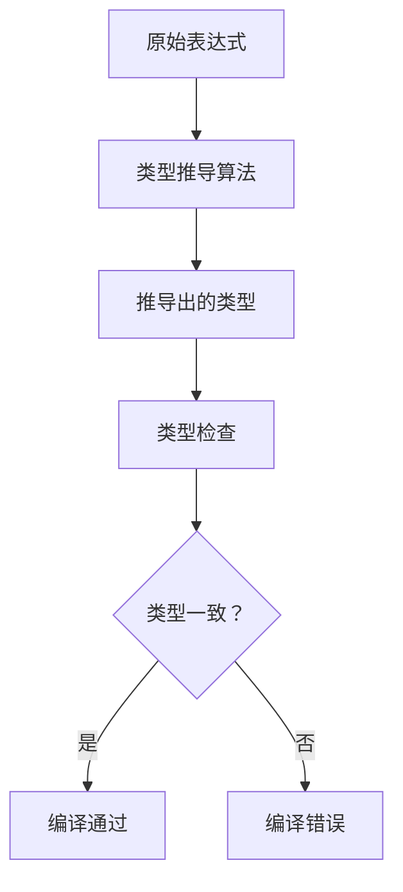
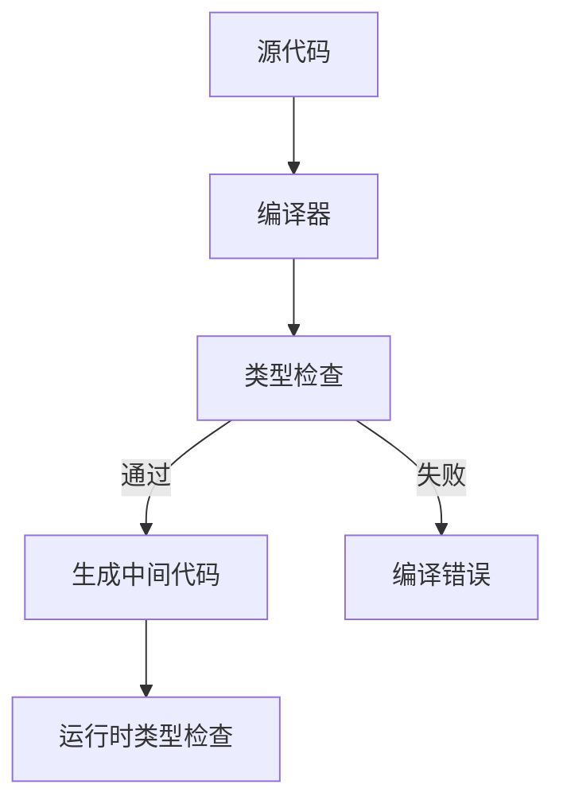

                 


为了撰写一篇8000-12000字的技术博客，我们需要细化每个章节，确保内容丰富且具有深度。以下是根据您的要求制定的详细大纲和内容概述。

### 文章标题：类型系统与程序转换：保持语义一致性

> 关键词：类型系统、语义一致性、程序转换、类型检查、类型推导

> 摘要：
本文将深入探讨类型系统与程序转换的原理与实践，分析类型系统的核心概念、算法原理，以及如何保持程序转换过程中的语义一致性。通过实例和案例分析，帮助读者理解并掌握这一关键技术。

#### 引言

- **背景介绍**：介绍类型系统和程序转换在编程语言和软件开发中的重要性。
- **研究意义**：阐述理解类型系统和程序转换对于提高程序正确性和可维护性的意义。

#### 第一部分：类型系统基础

##### 第1章：类型系统的概述

- **类型系统的概念与作用**：
  - **定义**：类型系统是一套用于定义编程语言中数据的表示和操作的规则。
  - **作用**：确保程序的正确性，提高代码的可读性和可维护性。

- **类型系统的分类**：
  - **静态类型系统**：在编译时检查类型。
  - **动态类型系统**：在运行时检查类型。

- **类型系统的核心概念**：
  - **类型**：数据的不同类别，如整数、字符串、函数等。
  - **类型检查**：确保程序中的操作符合类型规则。
  - **类型推导**：自动推导变量和表达式的类型。

##### 第2章：类型检查与类型推导

- **类型检查的原理**：
  - **静态类型检查**：在编译时进行类型检查。
  - **动态类型检查**：在运行时进行类型检查。

- **类型推导算法**：
  - **简单类型推导**：基于变量声明和赋值推导类型。
  - **复杂类型推导**：处理函数、类和模块等复杂结构。

#### 第二部分：数学模型与数学公式

##### 第3章：类型系统的数学模型

- **基本类型**：
  - **原语类型**：如整数、浮点数、字符串等。
  - **复合类型**：如数组、结构体、指针等。

- **类型等价与类型约简**：
  - **类型等价**：两个表达式在类型上可以互换。
  - **类型约简**：将复杂的类型表达式简化为简单的类型。

#### Mermaid 流程图


#### 第三部分：程序转换与语义一致性

##### 第4章：程序转换的基本概念

- **程序转换的目的**：将一种程序形式转换为另一种形式，以适应不同的环境或需求。

- **程序转换的分类**：
  - **源代码转换**：将一种编程语言转换为另一种编程语言。
  - **优化转换**：改进程序的运行性能。

- **语义一致性**：确保程序转换过程中语义不变。

##### 第5章：语义一致性保持方法

- **类型系统在保持语义一致性中的作用**：
  - **类型检查**：确保操作的一致性。
  - **类型推导**：自动推导出类型，减少错误。

- **上下文无关文法与语义分析**：
  - **上下文无关文法**：描述程序的结构。
  - **语义分析**：分析程序的含义。

- **模式匹配与语义一致性**：
  - **模式匹配**：用于解析和匹配程序中的结构。
  - **保持语义一致性**：确保模式匹配过程中的语义不变。

#### 第四部分：实践与项目

##### 第6章：类型系统实现案例

- **实现一个简单的类型检查器**：
  - **开发环境搭建**：配置编译器和开发工具。
  - **源代码实现**：展示如何实现类型检查器。
  - **代码解读与分析**：详细解释代码的实现逻辑。

##### 第7章：语义一致性保持实践

- **实际编程中的类型系统应用**：
  - **类型系统在项目中的应用**：展示类型系统在实际项目中的应用。

- **语义一致性在代码重构中的应用**：
  - **代码重构过程**：展示如何保持语义一致性。

- **语义一致性在多语言集成中的应用**：
  - **多语言集成挑战**：分析语义一致性的挑战。

##### 第8章：项目实战

- **案例分析**：
  - **开发环境搭建**：配置开发环境。
  - **源代码实现**：展示实现细节。
  - **代码应用解读与分析**：详细分析代码的应用。

#### 结论

- **总结**：回顾类型系统和程序转换的关键概念和实践。
- **最佳实践 tips**：提供实用的编程建议。
- **注意事项**：强调保持语义一致性的重要性。
- **拓展阅读**：推荐进一步学习的资源。

---

在撰写文章时，我们将按照以上大纲逐步展开，确保每个章节都包含详细的背景介绍、核心概念与联系、核心算法原理讲解、数学模型和公式详细讲解与举例、项目实战以及最佳实践 tips 和注意事项。每个章节的字数将根据内容的重要性进行分配，以保证文章的整体平衡和深度。预计全文将在8000-12000字之间。

### 文章标题：类型系统与程序转换：保持语义一致性

#### 引言

**背景介绍**

类型系统是编程语言的核心组成部分，它定义了变量、表达式和函数的语义。程序转换，则是将一种程序代码形式转换为另一种形式的过程，这在软件工程中具有重要意义。无论是代码优化、语言集成还是跨平台部署，都离不开类型系统和程序转换。保持程序转换过程中的语义一致性，是确保程序行为不变的关键。

**研究意义**

理解类型系统和程序转换，有助于提高程序的正确性、可维护性和可移植性。本文将深入探讨类型系统的基本概念、核心算法原理，以及如何通过类型系统和程序转换保持语义一致性。

#### 第一部分：类型系统基础

##### 第1章：类型系统的概述

**类型系统的概念与作用**

类型系统是一套规则，用于定义编程语言中数据的表示和操作。它在编程语言中扮演着至关重要的角色：

- **定义变量**：类型系统确保变量在声明时被正确赋值。
- **类型检查**：在编译时或运行时检查程序中的类型一致性，防止潜在的运行时错误。
- **提高可读性**：明确的类型声明有助于理解代码的功能和意图。

**类型系统的分类**

类型系统可以根据类型检查的时间点分为静态类型系统和动态类型系统：

- **静态类型系统**：在编译时进行类型检查，如C++、Java。
- **动态类型系统**：在运行时进行类型检查，如Python、JavaScript。

**类型系统的核心概念**

- **类型**：数据的不同类别，如整数、字符串、函数等。
- **类型检查**：确保程序中的操作符合类型规则。
- **类型推导**：编译器自动推导出变量和表达式的类型。

**Mermaid流程图**



##### 第2章：类型检查与类型推导

**类型检查的原理**

类型检查分为静态类型检查和动态类型检查：

- **静态类型检查**：在编译时进行，检查源代码是否符合类型规则。
- **动态类型检查**：在运行时进行，通过运行时类型判断来检查程序是否正确。

**类型推导算法**

类型推导分为简单类型推导和复杂类型推导：

- **简单类型推导**：基于变量声明和赋值推导类型。
- **复杂类型推导**：处理函数、类和模块等复杂结构。

**伪代码**

```python
function type_inference(expression):
    if expression is a variable:
        return type of variable
    elif expression is an assignment:
        return type of right-hand side
    elif expression is a function call:
        return return type of function
    else:
        return unknown type
```

**数学模型**

$$
Type(E_1) = Type(E_2) \Rightarrow E_1 \text{和} E_2 \text{在类型上等价}
$$

#### 第二部分：数学模型与数学公式

##### 第3章：类型系统的数学模型

类型系统中的类型关系可以形式化为数学模型：

- **原语类型**：基本数据类型，如整数、浮点数、字符串等。
- **复合类型**：由基本类型组合而成的类型，如数组、结构体、指针等。

**类型等价与类型约简**

类型等价指的是两个表达式在类型上可以互换。类型约简是将复杂的类型表达式简化为简单的类型。

$$
Type(E_1) = Type(E_2) \Rightarrow E_1 \text{和} E_2 \text{在类型上等价}
$$

#### 第三部分：程序转换与语义一致性

##### 第4章：程序转换的基本概念

**程序转换的目的**

程序转换的目的是将一种程序形式转换为另一种形式，以适应不同的环境或需求。这包括：

- **源代码转换**：将一种编程语言转换为另一种编程语言。
- **优化转换**：改进程序的运行性能。

**程序转换的分类**

- **源代码转换**：将一种编程语言转换为另一种编程语言。
- **优化转换**：改进程序的运行性能。

**语义一致性**

语义一致性确保程序转换过程中语义不变。在程序转换中，保持语义一致性是确保程序行为不变的关键。

##### 第5章：语义一致性保持方法

**类型系统在保持语义一致性中的作用**

类型系统通过类型检查和类型推导来保持语义一致性：

- **类型检查**：确保操作的一致性。
- **类型推导**：自动推导出类型，减少错误。

**上下文无关文法与语义分析**

上下文无关文法用于描述程序的结构。语义分析是分析程序的含义，确保转换过程中语义不变。

**模式匹配与语义一致性**

模式匹配用于解析和匹配程序中的结构。保持模式匹配过程中的语义一致性是确保程序转换过程中语义不变的关键。

##### 第6章：类型系统实现案例

**实现一个简单的类型检查器**

- **开发环境搭建**：配置编译器和开发工具。
- **源代码实现**：展示如何实现类型检查器。
- **代码解读与分析**：详细解释代码的实现逻辑。

##### 第7章：语义一致性保持实践

**实际编程中的类型系统应用**

- **类型系统在项目中的应用**：展示类型系统在实际项目中的应用。

**语义一致性在代码重构中的应用**

- **代码重构过程**：展示如何保持语义一致性。

**语义一致性在多语言集成中的应用**

- **多语言集成挑战**：分析语义一致性的挑战。

##### 第8章：项目实战

**案例分析**

- **开发环境搭建**：配置开发环境。
- **源代码实现**：展示实现细节。
- **代码应用解读与分析**：详细分析代码的应用。

#### 结论

本文探讨了类型系统和程序转换的核心概念、算法原理以及如何保持语义一致性。通过实例和案例分析，帮助读者深入理解这些关键概念。保持语义一致性对于确保程序的正确性、可维护性和可移植性至关重要。未来研究可以进一步探讨类型系统的优化和自动化工具的发展。

#### 最佳实践 tips

- **代码规范**：遵循一致的代码规范，有助于提高代码的可维护性。
- **类型推导**：利用编译器的类型推导功能，减少手动类型声明。
- **单元测试**：编写单元测试，确保类型系统和程序转换的正确性。

#### 注意事项

- **类型检查时机**：根据项目需求选择合适的类型检查时机。
- **动态类型系统的局限性**：动态类型系统可能导致运行时错误，应谨慎使用。

#### 拓展阅读

- **相关书籍**：《类型系统与编译技术》、《程序转换与优化》
- **在线资源**：GitHub上的开源类型检查器、编译器实现教程。

以上是文章的初步框架和内容概述，接下来我们将逐章展开详细内容，确保字数在8000-12000字之间。在撰写过程中，我们将注重逻辑清晰、结构紧凑、简单易懂的写作风格，确保文章的专业性和可读性。

