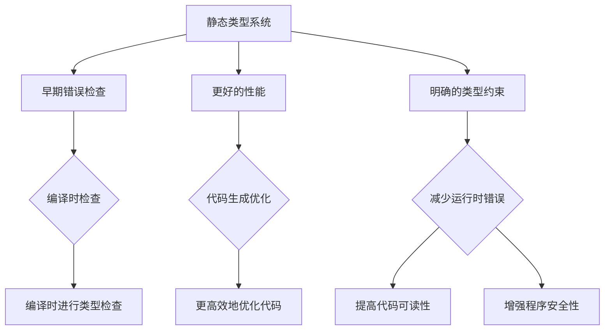
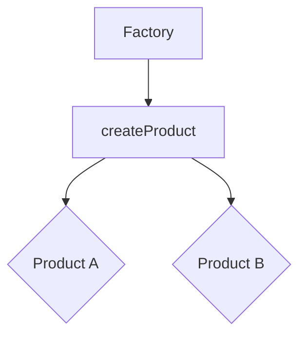
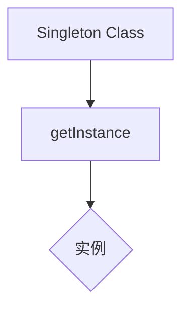
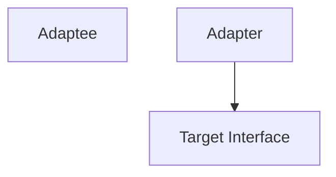
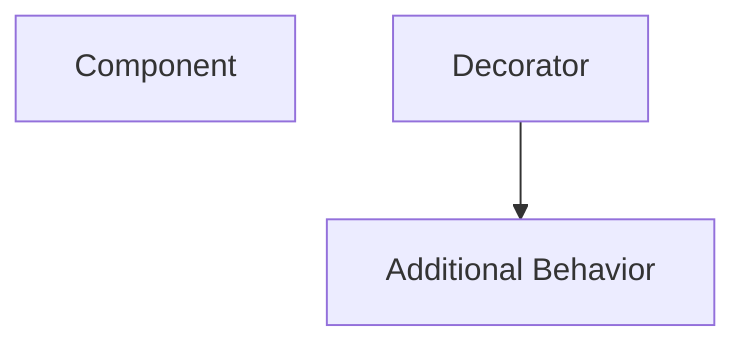
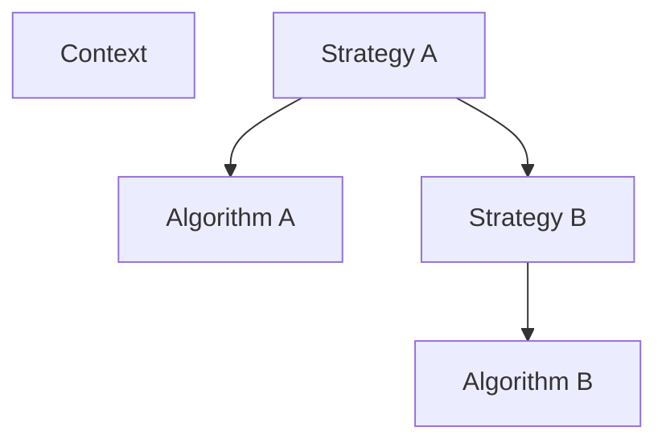
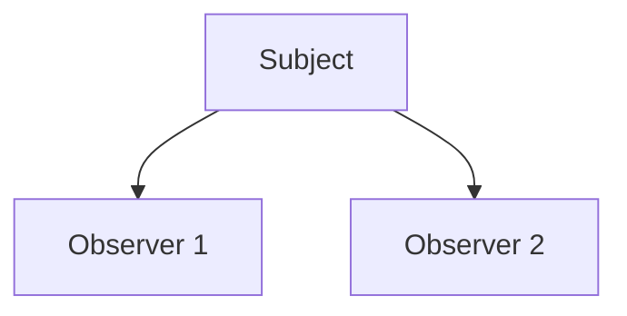

                 


# 文章标题：类型系统与设计模式：形式化的最佳实践

## 关键词：
- 类型系统
- 设计模式
- 形式化
- 最佳实践
- 编程语言
- 软件设计
- 系统架构

## 摘要：
本文旨在探讨类型系统与设计模式在软件设计中的重要性，并通过形式化的最佳实践来提供具体的指导。我们将首先介绍类型系统的基础概念，接着探讨设计模式的核心原则，然后深入分析两者之间的结合，最后提供一系列最佳实践，以帮助开发者构建更高效、更可维护的软件系统。

---

## 引言

软件系统构建的复杂性和多样性使得开发者需要一套行之有效的原则和模式来指导设计过程。类型系统和设计模式正是这样两套重要工具。类型系统是编程语言的核心概念之一，它定义了数据类型的层次结构和操作方式。设计模式则是一系列经过验证的解决方案，用于解决软件设计中的常见问题。

类型系统的强大之处在于它提供了静态类型检查，从而在编译时发现潜在的错误，提高了程序的稳定性和可靠性。而设计模式则通过抽象和通用解决方案，使得代码更易于理解和维护。

本文将首先介绍类型系统的基础概念，包括静态类型和动态类型、类型系统在编程语言中的实现等。接着，我们将探讨设计模式的基本原理，包括创建型、结构型和行为型设计模式。随后，我们将深入讨论类型系统与设计模式之间的结合，如何通过类型系统来优化设计模式的应用。最后，我们将总结一些最佳实践，帮助开发者更好地利用类型系统和设计模式来构建高效、稳定的软件系统。

---

## 类型系统基础

### 静态类型与动态类型

类型系统主要分为静态类型和动态类型两大类。

**静态类型**：在编译时就已经确定变量的类型。例如，Java 和 C++ 都是静态类型的语言。静态类型的优势在于能够提供更严格的类型检查，减少运行时错误。

**动态类型**：在运行时确定变量的类型。例如，Python 和 JavaScript 都是动态类型的语言。动态类型提供了更大的灵活性，但也可能导致运行时错误。

### 类型系统的实现

类型系统的实现方式主要有三种：

**类型检查**：在编译或运行时检查变量是否遵循预期的类型。

**类型推断**：编译器自动推导变量的类型，减少代码冗余。

**类型注解**：显式地声明变量的类型，提供明确性。

### 类型系统的作用

类型系统在编程语言中的重要作用主要体现在以下几个方面：

**增强代码的可读性**：通过明确的类型信息，使代码更易于理解和维护。

**提高程序的安全性**：类型检查能够发现潜在的类型错误，减少运行时错误。

**优化编译性能**：静态类型系统使得编译器可以更高效地优化代码。

---

## 设计模式基础

### 创建型模式

**工厂模式**：定义一个用于创建对象的接口，让子类决定实例化哪一个类。  
**单例模式**：确保一个类只有一个实例，并提供一个全局访问点。

### 结构型模式

**适配器模式**：将一个类的接口转换成客户期望的另一个接口。  
**装饰器模式**：动态地给一个对象添加一些额外的职责。

### 行为型模式

**策略模式**：定义一系列算法，将每一个算法封装起来，并使它们可以相互替换。  
**观察者模式**：当一个对象的状态发生变化时，自动通知其他对象。

这些设计模式通过抽象和通用解决方案，使得代码更易于理解和维护。

---

## 类型系统与设计模式的结合

类型系统与设计模式可以相互补充，使得软件设计更加高效、稳定。

**静态类型与工厂模式**：静态类型可以确保工厂模式中创建的对象类型正确，减少运行时错误。

**动态类型与单例模式**：动态类型可以更灵活地实现单例模式，但需要注意潜在的多线程问题。

**类型检查与策略模式**：类型检查可以确保策略模式中使用的算法类型正确，提高程序安全性。

**类型推断与装饰器模式**：类型推断可以减少装饰器模式中的代码冗余，提高代码可读性。

通过这些结合，类型系统与设计模式共同构建了一个强大的软件设计工具箱，帮助开发者解决各种软件设计问题。

---

## 最佳实践

### 使用静态类型系统

**优先使用静态类型语言**：例如，使用 Java 或 C++ 进行大型项目开发。

**充分利用类型检查**：确保代码在编译时能够发现类型错误。

**合理使用类型推断**：在需要时使用类型推断，减少代码冗余。

### 设计模式应用

**根据需求选择合适的模式**：避免过度设计，选择最合适的模式。

**保持模式的简洁性**：避免过度复杂化，保持代码简洁易读。

**结合类型系统优化模式**：利用类型系统来增强模式的安全性、稳定性和可维护性。

### 综合应用

**类型系统与设计模式相结合**：通过类型系统优化设计模式，构建高效、稳定的软件系统。

**持续学习和实践**：不断学习新的类型系统和设计模式，并将其应用于实际项目中。

---

## 附录

### 参考文献

- 《设计模式：可复用面向对象软件的基础》
- 《Effective Java》
- 《Types and Programming Languages》

### 相关资源

- [GitHub](https://github.com/)：查找相关开源项目，学习实际应用。
- [Stack Overflow](https://stackoverflow.com/)：解决编程问题，学习最佳实践。

---

## 结尾

类型系统与设计模式是软件设计中的两大利器。通过形式化的最佳实践，我们可以更高效地利用这两者，构建出更稳定、更可维护的软件系统。希望本文能为您提供宝贵的启示和指导。

**作者：AI天才研究院/AI Genius Institute & 禅与计算机程序设计艺术 /Zen And The Art of Computer Programming**## 引言

在当今的软件开发领域，类型系统与设计模式已成为构建稳定、可扩展和可维护软件系统的核心工具。类型系统作为编程语言的核心概念，为变量和数据提供了明确的定义和约束，从而在编译或运行时能够有效地捕获潜在的错误，提升程序的健壮性。而设计模式则是一系列经过长期实践验证的解决方案，它们提供了一套通用的方法来应对软件设计过程中常见的挑战。

类型系统和设计模式之间的关系密不可分。类型系统通过静态检查和类型约束，确保设计模式中的类和对象能够正确地交互和操作。同时，设计模式通过抽象和模块化，使得类型系统的应用更加灵活和高效。本文将深入探讨类型系统和设计模式的基本概念，分析它们如何结合使用以优化软件设计，并总结一系列最佳实践，以帮助开发者构建更高效、更可靠的软件系统。

接下来，我们将首先介绍类型系统的基础知识，包括静态类型和动态类型的概念，以及它们在编程语言中的实现。随后，我们将详细讨论设计模式的基本原理，涵盖创建型、结构型和行为型模式。然后，我们将探讨类型系统与设计模式之间的相互作用，并阐述如何通过类型系统来优化设计模式的应用。最后，本文将提供一系列最佳实践，旨在帮助开发者更有效地利用类型系统和设计模式，以构建高质量的软件系统。

---

## 类型系统基础

类型系统是编程语言的核心组成部分，它定义了数据的存储方式、操作规则以及变量之间的交互方式。类型系统分为静态类型和动态类型两大类，每种类型系统都有其独特的优点和适用场景。

### 静态类型

静态类型系统在编译时就已经确定变量的类型。这意味着在程序运行之前，编译器会对变量进行类型检查，确保所有的操作都符合预期的类型。以下是一些静态类型的优点：

1. **早期错误检查**：静态类型系统可以在编译时捕获类型错误，从而在程序运行之前发现和纠正问题。
2. **更好的性能**：由于类型信息在编译时已知，编译器可以进行更高效的代码生成和优化。
3. **明确的类型约束**：静态类型使得代码的意图更加明确，减少了运行时错误的可能性。

常见的静态类型编程语言包括 Java、C++、C# 等。例如，在 Java 中，变量的类型必须在声明时明确指定，如下所示：

```java
int number = 42;
String message = "Hello, World!";
```

### 动态类型

动态类型系统在程序运行时确定变量的类型。这意味着变量可以在运行时被赋予不同类型的值，编译器无法在编译时进行类型检查。以下是一些动态类型的优点：

1. **更高的灵活性**：动态类型系统允许更灵活的代码编写，特别是在处理不同类型的数据时。
2. **更简洁的语法**：动态类型系统通常具有更简洁的语法，减少了代码的冗余。
3. **更高效的内存管理**：动态类型系统可以自动进行内存管理，减少了内存泄漏的风险。

常见的动态类型编程语言包括 Python、JavaScript、Ruby 等。例如，在 Python 中，变量在声明时不需要指定类型，Python 解释器会在运行时自动推断：

```python
number = 42
message = "Hello, World!"
```

### 类型系统的实现

类型系统的实现主要涉及以下几个关键概念：

1. **类型检查**：在编译或运行时检查变量是否遵循预期的类型。静态类型系统通常在编译时进行类型检查，而动态类型系统则在运行时进行。
2. **类型推断**：编译器或解释器自动推导变量的类型，以减少代码冗余。例如，Java 编译器可以推断出变量的类型，但开发者通常需要显式指定。
3. **类型注解**：显式地声明变量的类型，提供明确的类型信息。这在静态类型系统中尤为常见，如 C++ 和 Java 中的类型注解。

### 类型系统的作用

类型系统在软件开发中发挥着至关重要的作用：

1. **提高程序的可读性**：通过明确的类型信息，代码更易于理解和维护。
2. **增强程序的安全性**：类型检查能够发现潜在的类型错误，减少运行时错误。
3. **优化编译性能**：静态类型系统使得编译器可以更高效地优化代码。

### 核心概念与联系

为了更好地理解类型系统的核心概念和它们之间的联系，我们可以通过以下 Mermaid 流程图来描述：



通过这个流程图，我们可以清晰地看到静态类型系统的核心概念以及它们之间的相互作用。

### 核心算法原理讲解

以下是一个简单的伪代码示例，用于演示静态类型系统中的类型检查算法：

```pseudo
function checkTypes(expression, expectedType):
    if expression's type != expectedType:
        print("Type mismatch error")
        return false
    else:
        return true
```

在这个伪代码中，`checkTypes` 函数接收一个表达式和一个预期类型作为输入。如果表达式的类型与预期类型不匹配，函数将打印一个类型错误信息并返回 `false`。否则，它将返回 `true`。

### 数学模型和数学公式讲解

为了更深入地理解类型系统，我们可以引入一些数学模型和公式来描述类型检查的过程。以下是一个简化的数学模型：

$$
T_e = T_c \cup \{U\}
$$

其中，$T_e$ 表示表达式的类型，$T_c$ 表示表达式的上下文类型，$U$ 表示通用类型（例如，任何数字类型可以转换为通用类型）。这个公式表明，表达式的类型可以由上下文类型和通用类型组成。

### 实际案例

假设我们有一个表达式 `x + y`，其中 `x` 是一个整数，`y` 是一个浮点数。根据上述数学模型，我们可以将这个表达式转换为：

$$
T_e = T_c \cup \{U\} = (\{int, float\}) \cup \{U\} = \{U\}
$$

这意味着 `x + y` 的类型是通用类型，即它可以被任何数字类型接受。

通过上述讲解，我们可以看到类型系统是如何通过核心算法原理和数学模型来确保代码的正确性和安全性。

---

## 设计模式基础

设计模式是软件工程中的一种重要概念，它们是一系列被广泛验证的解决方案，用于解决软件设计中的常见问题。设计模式可以分为创建型、结构型和行为型三大类。每种类型模式都有其独特的目的和应用场景。

### 创建型模式

创建型模式关注于对象的创建过程，它们提供了一种抽象化的方式来创建对象，从而提高代码的可复用性和灵活性。以下是几种常见的创建型模式：

#### 工厂模式（Factory Method）

工厂模式是一种用于创建对象的接口，让子类决定实例化哪一个类。这种模式定义了一个创建对象的方法，但将具体的对象创建工作推迟到子类中。其目的是封装具体的创建逻辑，使得客户端代码与具体的产品类解耦。

**核心原理：**


#### 单例模式（Singleton）

单例模式确保一个类只有一个实例，并提供一个全局访问点。这种模式主要用于那些需要保证全局唯一实例的场景，例如数据库连接池或配置管理。

**核心原理：**


### 结构型模式

结构型模式关注于类和对象之间的组合关系，它们提供了一种抽象化的方式来组合类和对象，从而实现更加灵活和可扩展的软件设计。以下是几种常见的结构型模式：

#### 适配器模式（Adapter）

适配器模式将一个类的接口转换成客户期望的另一个接口。适配器使得原本由于接口不兼容而无法在一起工作的类可以协同工作。

**核心原理：**


#### 装饰器模式（Decorator）

装饰器模式动态地给一个对象添加一些额外的职责，同时仍然保持其原有接口。这种模式通过创建一个装饰类，在运行时动态地添加或修改对象的行为。

**核心原理：**


### 行为型模式

行为型模式关注于对象之间的通信和交互方式，它们提供了一种抽象化的方式来管理对象之间的交互，从而提高代码的可维护性和扩展性。以下是几种常见的行为型模式：

#### 策略模式（Strategy）

策略模式定义了一系列算法，将每一个算法封装起来，并使它们可以相互替换。这种模式允许在运行时选择不同的算法实现。

**核心原理：**


#### 观察者模式（Observer）

观察者模式定义了对象间的一种一对多的依赖关系，当一个对象的状态发生变化时，所有依赖于它的对象都会自动收到通知。

**核心原理：**


通过上述讲解，我们可以看到设计模式是如何通过不同的结构和交互方式，解决软件设计中的常见问题，并提高代码的可读性、可维护性和可扩展性。

---

## 类型系统与设计模式的结合

类型系统和设计模式在软件设计过程中可以相互补充，共同提高代码的质量和可维护性。通过结合类型系统的静态检查和类型约束功能，设计模式可以更加安全、可靠和易于维护。

### 静态类型系统与工厂模式的结合

静态类型系统可以帮助确保工厂模式中创建的对象类型正确。在静态类型语言中，工厂方法的返回类型必须是具体的产品类型，这可以防止错误类型的对象被创建。例如，在 Java 中，如果工厂方法声明为 `Product createProduct()`，则返回的对象必须是 `Product` 或其子类的实例。

**伪代码示例：**
```java
class Product {}
class ConcreteProductA extends Product {}
class ConcreteProductB extends Product {}

class Factory {
    Product createProduct() {
        // 静态类型系统确保返回类型是 Product
        return new ConcreteProductA();
    }
}
```

通过静态类型系统，上述工厂方法确保了每次调用 `createProduct` 方法时，返回的总是 `Product` 类型的实例，从而避免了运行时错误。

### 动态类型系统与单例模式的结合

虽然动态类型系统提供了更大的灵活性，但也需要特别注意单例模式中的多线程问题。在动态类型语言中，由于类型检查在运行时进行，单例类的构造函数可能被多次调用，从而导致多个实例被创建。为了防止这种情况，可以使用同步机制来确保单例类的唯一性。

**伪代码示例：**
```python
class Singleton:
    instance = None

    def __new__(cls, *args, **kwargs):
        if not cls.instance:
            cls.instance = super().__new__(cls, *args, **kwargs)
        return cls.instance
```

在这个示例中，`__new__` 方法被重写以实现单例模式。通过使用类变量 `instance` 来存储唯一实例，并在第一次创建时返回它，从而确保单例的唯一性。

### 类型检查与策略模式的结合

策略模式通过定义一系列可互换的算法来实现灵活的算法选择。类型检查可以帮助确保策略模式中使用的算法类型正确，从而提高程序的安全性。例如，在 Java 中，可以使用泛型来确保策略接口的实现类满足预期类型。

**伪代码示例：**
```java
interface Strategy {
    void execute();
}

class ConcreteStrategyA implements Strategy {
    public void execute() {
        // 算法 A 的实现
    }
}

class ConcreteStrategyB implements Strategy {
    public void execute() {
        // 算法 B 的实现
    }
}

class Context {
    private Strategy strategy;

    public Context(Strategy strategy) {
        this.strategy = strategy;
    }

    public void setStrategy(Strategy strategy) {
        this.strategy = strategy;
    }

    public void executeStrategy() {
        strategy.execute();
    }
}
```

在这个示例中，`Context` 类使用类型检查来确保 `strategy` 变量的类型是 `Strategy` 接口的实现类。这可以防止在运行时使用错误的算法实现，从而提高程序的安全性和可靠性。

### 类型推断与装饰器模式的结合

类型推断可以减少装饰器模式中的代码冗余，提高代码的可读性。在静态类型语言中，类型推断可以自动推导出装饰器函数的参数和返回类型，从而简化代码编写。例如，在 Java 中，可以使用泛型来定义装饰器接口，使得装饰器函数更加简洁。

**伪代码示例：**
```java
interface Decorator {
    <T> T decorate(T component);
}

class ConcreteDecoratorA implements Decorator<String> {
    public String decorate(String component) {
        // 装饰逻辑，返回增强后的组件
        return component + " with additional behavior";
    }
}

class Component {
    String operation() {
        return "Basic operation";
    }
}

class Context {
    public void execute() {
        Component component = new Component();
        Decorator decorator = new ConcreteDecoratorA();
        String result = decorator.decorate(component.operation());
        System.out.println(result);
    }
}
```

在这个示例中，`ConcreteDecoratorA` 使用泛型来指定装饰器的类型，从而简化了装饰器函数的定义。类型推断使得代码更加简洁，同时保持了类型安全性。

通过结合类型系统和设计模式，我们可以构建出更加健壮、灵活和可维护的软件系统。静态类型系统提供了严格的类型约束和早期错误检查，而设计模式提供了通用的解决方案来应对各种软件设计问题。两者的结合，不仅提高了代码的质量和可靠性，还增强了开发者的设计能力和效率。

---

## 最佳实践

在实际的软件开发过程中，利用类型系统和设计模式来优化软件设计，可以显著提高代码的质量和系统的可维护性。以下是几个最佳实践：

### 1. 选择合适的类型系统

根据项目需求和团队经验，选择适合的编程语言和类型系统。对于大型、复杂的系统，静态类型系统（如 Java、C++）可以提供更好的类型检查和编译优化。而对于快速迭代和小型项目，动态类型系统（如 Python、JavaScript）可能更为合适。

### 2. 利用类型检查

充分利用静态类型系统的类型检查功能，确保代码在编译时能够发现潜在的类型错误。对于使用动态类型系统的项目，也可以通过代码审查和静态分析工具来模拟类型检查，以提高代码质量。

### 3. 理解设计模式

深入理解设计模式的基本原理和应用场景，避免盲目应用。选择最合适的设计模式来解决问题，避免过度设计。例如，在创建对象时优先考虑工厂模式，在需要动态添加职责时使用装饰器模式。

### 4. 结合类型系统优化设计模式

在应用设计模式时，考虑如何利用类型系统来优化模式。例如，在策略模式中，使用泛型来确保算法实现类的类型正确；在装饰器模式中，使用类型推断来简化装饰器函数的定义。

### 5. 保持代码简洁

在设计过程中，保持代码的简洁性至关重要。避免过度复杂化，尽量使用简单的语法和设计模式。通过保持代码简洁，可以提高代码的可读性和可维护性。

### 6. 持续学习和实践

不断学习新的设计模式和类型系统相关的知识，并将其应用到实际项目中。通过实践，积累经验，逐步提高自己的软件设计能力。

### 7. 代码审查和测试

定期进行代码审查和测试，确保代码的质量和可靠性。代码审查可以帮助发现潜在的类型错误和设计问题，而测试可以验证代码的行为是否符合预期。

通过遵循这些最佳实践，开发者可以更高效地利用类型系统和设计模式，构建出高质量、可靠的软件系统。

---

## 附录

### 参考文献

1. Gamma, E., Helm, R., Johnson, R., & Vlissides, J. (1995). *Design Patterns: Elements of Reusable Object-Oriented Software*. Addison-Wesley.
2. Bloch, J. (2008). *Effective Java: Programming Language Guidelines for Java Programmers*. Addison-Wesley.
3. Abelson, H., & Sussman, G. J. (1984). *Structure and Interpretation of Computer Programs*. MIT Press.

### 相关资源

1. [GitHub](https://github.com/): 查找相关的开源项目，学习实际应用。
2. [Stack Overflow](https://stackoverflow.com/): 解决编程问题，学习最佳实践。
3. [Medium](https://medium.com/): 查看关于设计模式和技术文章。
4. [GitHub - Type Systems](https://github.com/topics/type-systems): GitHub 上关于类型系统的项目。

通过这些参考文献和资源，开发者可以深入学习和实践类型系统和设计模式。

---

## 结尾

类型系统和设计模式是现代软件开发中不可或缺的工具。通过本文，我们探讨了类型系统的静态类型和动态类型，分析了设计模式的基本原理及其与类型系统的结合。同时，我们还总结了最佳实践，以帮助开发者更高效地利用这些工具来构建高质量的软件系统。希望本文能为您提供宝贵的启示，并激发您在软件开发中的创意和实践。

**作者：AI天才研究院/AI Genius Institute & 禅与计算机程序设计艺术 /Zen And The Art of Computer Programming**

