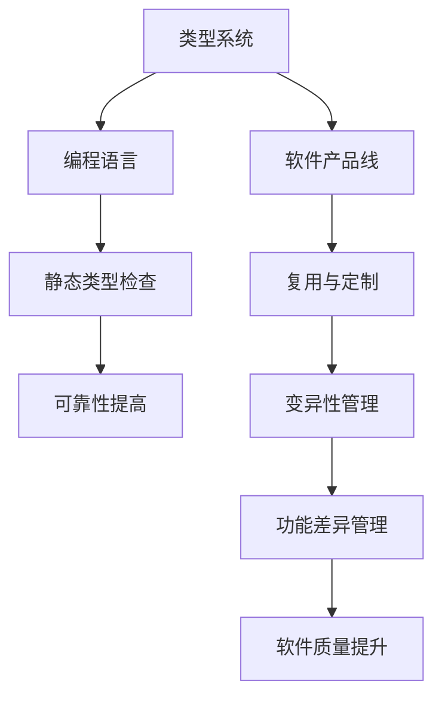

                 

## 文章标题

### 类型系统与软件产品线：变异性管理的形式化方法

**关键词：类型系统、软件产品线、变异性管理、形式化方法**

本文旨在探讨类型系统与软件产品线在变异性管理中的应用，通过形式化方法深入分析变异性管理的原理与实践。我们将从背景介绍、核心概念、形式化方法、项目实战等多个角度展开讨论，旨在为读者提供一个全面而深入的理解。

> **摘要：**
> 
> 本文首先介绍了类型系统与软件产品线的基本概念，并探讨了它们在变异性管理中的重要性。随后，我们引入了形式化方法，详细分析了其构建与应用。在此基础上，通过实际项目案例，我们展示了形式化方法在变异性管理中的具体应用与效果。最后，我们总结了本文的主要观点，并提出了未来研究的方向。

----------------------------------------------------------------

### 背景介绍

在当今快速发展的软件工程领域，软件产品的复杂性和多样性不断增长，这使得变异性管理成为软件开发过程中的关键挑战。类型系统和软件产品线作为软件工程的重要概念，为解决这些问题提供了有力的支持。

#### 类型系统

类型系统是编程语言的核心组成部分，它定义了变量、表达式和函数等程序元素的数据类型，并规定了它们之间的合法操作。类型系统的主要目的是提高程序的可靠性和可维护性。例如，通过静态类型检查，编译器可以在编译阶段捕获许多潜在的错误，从而减少运行时错误的发生。

类型系统的发展可以追溯到20世纪60年代。最初的类型系统主要是为了解决变量命名冲突和避免类型错误。随着编程语言的不断演进，类型系统逐渐变得更加复杂和强大，例如引入了面向对象编程和函数式编程等新的类型系统设计方法。

#### 软件产品线

软件产品线是一种软件工程方法，它通过定义一组相关软件项目的通用特性，来开发出一系列具有特定功能的软件产品。软件产品线的核心思想是重用和定制，通过在通用框架下定制特定的功能，从而降低软件开发的时间和成本。

软件产品线的概念最早由Ivar Jacobson在1990年代提出。他提出了基于组件的软件产品线模型，这种模型将软件产品看作是一组相关的组件集合，每个组件都可以在不同的产品中复用。随着软件工程的发展，软件产品线的概念得到了进一步的完善和扩展。

#### 变异性管理

变异性管理是软件产品线中的一个重要组成部分，它涉及如何在不同的软件产品中管理功能的差异。变异性管理的目标是通过有效的管理和控制，使得软件产品线的开发过程更加灵活和高效。

变异性管理面临的主要挑战包括：

- 如何定义和识别不同的变体
- 如何在软件产品线中实现变体之间的有效隔离
- 如何保证变体的正确性和一致性

形式化方法是解决这些挑战的有效途径，它通过数学模型和逻辑推理来描述和验证变异性管理策略，从而提高软件产品的质量和可靠性。

### 核心概念与联系

为了更好地理解类型系统、软件产品线和变异性管理之间的关系，我们使用Mermaid流程图来展示它们的核心概念和联系。



从图中可以看出，类型系统为编程语言提供了基础，通过静态类型检查提高了程序可靠性。软件产品线则利用类型系统提供的特性，实现了复用与定制。而变异性管理则是软件产品线中的一个关键环节，它通过有效的管理和控制，保证了软件产品的质量和可靠性。

### 类型系统的基本概念

类型系统是编程语言中的一个核心概念，它定义了变量、表达式和函数等程序元素的数据类型，并规定了它们之间的合法操作。类型系统的设计原则包括安全性、可扩展性和灵活性。

#### 数据类型

数据类型是类型系统的基础，它定义了程序中的数据存储方式和操作方式。常见的数据类型包括整型、浮点型、布尔型、字符串型等。每种数据类型都有其特定的存储空间和操作规则。

#### 类型检查

类型检查是类型系统的关键功能，它确保程序在运行前符合类型约束。类型检查分为静态类型检查和动态类型检查。静态类型检查在编译时进行，通过分析程序源代码来判断是否符合类型约束；动态类型检查则在运行时进行，通过运行时类型信息来检查类型约束。

#### 类型系统的作用

类型系统在编程语言中的作用主要体现在以下几个方面：

- **提高程序可靠性**：通过类型检查，编译器可以捕获许多潜在的错误，从而减少运行时错误的发生。
- **提高程序可维护性**：类型系统能够提供明确的类型约束，使得程序更加清晰和易于理解。
- **提高程序性能**：静态类型检查可以优化程序执行，提高程序运行效率。

#### 类型系统的历史与发展

类型系统的历史可以追溯到20世纪60年代。当时，编程语言主要是以汇编语言为主，变量命名冲突和类型错误等问题频繁出现。为了解决这些问题，出现了第一种类型系统——静态类型系统。静态类型系统的核心思想是在编译时对程序进行类型检查，以确保程序在运行时不会出现类型错误。

随着编程语言的发展，类型系统逐渐变得更加复杂和强大。面向对象编程和函数式编程等新的编程范式引入了更丰富的类型系统特性。例如，面向对象编程中的类型继承和多态性，函数式编程中的类型推断和类型等价性。

近年来，类型系统的研究和应用也取得了显著进展。例如，静态类型检查工具如TypeScript和Flow的出现，使得静态类型系统的应用变得更加广泛和实用。同时，形式化方法在类型系统的研究中也发挥了重要作用，通过数学模型和逻辑推理来描述和验证类型系统。

### 软件产品线的定义与优势

软件产品线是一种软件工程方法，它通过定义一组相关软件项目的通用特性，来开发出一系列具有特定功能的软件产品。软件产品线的核心思想是重用和定制，通过在通用框架下定制特定的功能，从而降低软件开发的时间和成本。

#### 软件产品线的定义

软件产品线可以被定义为“一系列相关软件项目的集合，这些项目共享共同的特性，并遵循特定的开发和管理策略”。软件产品线的特点包括：

- **通用性**：软件产品线中的项目具有共同的架构和功能模块，这些通用特性为软件产品线的开发提供了基础。
- **可变性**：软件产品线中的项目可以根据特定的需求进行定制，从而实现不同的功能。
- **可重用性**：软件产品线中的组件和模块可以被多个项目复用，从而降低开发和维护成本。

#### 软件产品线的优势

软件产品线为软件开发带来了许多优势，主要包括：

- **降低开发成本**：通过重用和定制通用框架，软件产品线可以显著降低软件开发的时间和成本。
- **提高开发效率**：软件产品线中的组件和模块具有通用性，可以快速集成和部署，从而提高开发效率。
- **提高软件质量**：软件产品线中的组件和模块经过多次验证和测试，具有较高的可靠性和稳定性。
- **增强可维护性**：软件产品线中的组件和模块具有清晰的接口和良好的封装性，便于维护和升级。

#### 软件产品线与面向对象开发的联系

软件产品线与面向对象开发有许多相似之处，尤其是在组件和模块的复用方面。面向对象开发中的类和对象可以看作是软件产品线中的组件和模块。然而，软件产品线相比面向对象开发具有更广泛的适用范围和更强的灵活性。

面向对象开发主要关注类的继承和多态性，而软件产品线则更关注组件和模块的通用性和可变性。软件产品线可以通过形式化方法来描述和验证组件和模块的变异性，从而实现更灵活和高效的开发。

#### 软件产品线的实施过程

实施软件产品线通常包括以下几个步骤：

1. **需求分析**：明确软件产品线的目标和应用场景，确定通用特性和变体。
2. **框架设计**：设计软件产品线的通用框架，包括组件和模块的接口和实现。
3. **组件开发**：开发通用组件和模块，并进行验证和测试。
4. **产品定制**：根据具体需求对通用框架进行定制，实现特定的功能。
5. **产品部署**：将定制好的软件产品部署到目标环境中，并进行性能测试和优化。

通过上述步骤，软件产品线可以实现高效的软件开发和灵活的功能定制，满足不同用户的需求。

### 变异性管理的基础理论

变异性管理是软件产品线开发中的一个关键环节，它涉及如何在不同软件产品中管理功能的差异。变异性管理的目标是确保软件产品线的灵活性和可扩展性，同时保持软件产品的质量和一致性。

#### 变异性的定义

变异性是指软件产品线中不同产品之间在功能、行为和结构上的差异。变异性可以分为以下几类：

- **功能变异性**：指软件产品在功能上的差异，如不同产品的功能模块、功能实现方式等。
- **行为变异性**：指软件产品在行为上的差异，如响应时间、资源消耗等。
- **结构变异性**：指软件产品在结构上的差异，如组件和模块的配置、接口和通信方式等。

#### 变异性的分类

根据变异性的不同特征，可以将变异性分为以下几类：

- **按层次分类**：变异性可以按照层次进行分类，如系统级变异性、模块级变异性、组件级变异性等。
- **按来源分类**：变异性可以按照来源进行分类，如需求变异性、技术变异性、管理变异性等。
- **按性质分类**：变异性可以按照性质进行分类，如静态变异性、动态变异性、显式变异性、隐式变异性等。

#### 变异性的管理策略

变异性管理的目标是通过有效的管理和控制，使得软件产品线的开发过程更加灵活和高效。以下是一些常见的变异性管理策略：

- **变异点管理**：变异点是指软件产品线中发生变异性变化的关键位置。通过识别和定义变异点，可以更好地控制和管理变异性。
- **变异规则管理**：变异规则是指用于描述和实现变异性变化的一组规则。通过定义变异规则，可以自动化和规范化变异性管理过程。
- **模板管理**：模板是一种用于描述软件产品线通用框架和变体的工具。通过使用模板，可以简化变异性管理过程，提高开发效率。
- **版本管理**：版本管理是一种用于记录和跟踪软件产品线变体和历史变化的方法。通过版本管理，可以更好地维护和更新软件产品线。

#### 变异性的管理策略

变异性管理的策略主要包括以下几个方面：

1. **变异点的识别与定义**：识别和定义软件产品线中的变异点，是变异性管理的基础。通过分析需求、架构和技术等方面，可以确定软件产品线中的关键变异点。

2. **变异规则的制定与执行**：变异规则是用于描述和实现变异性变化的一组规则。通过制定和执行变异规则，可以确保变异性管理的一致性和可靠性。

3. **模板的开发与使用**：模板是一种用于描述软件产品线通用框架和变体的工具。通过开发和使用模板，可以简化变异性管理过程，提高开发效率。

4. **版本的控制与维护**：版本管理是一种用于记录和跟踪软件产品线变体和历史变化的方法。通过版本管理，可以更好地维护和更新软件产品线。

#### 变异性的管理流程

变异性管理的流程通常包括以下步骤：

1. **需求分析**：明确软件产品线的需求，确定变异性管理的目标和范围。

2. **架构设计**：设计软件产品线的架构，确定通用框架和变异点。

3. **变异点识别**：识别和定义软件产品线中的变异点。

4. **变异规则制定**：制定用于描述和实现变异性变化的变异规则。

5. **模板开发**：开发用于描述软件产品线通用框架和变体的模板。

6. **版本控制**：记录和跟踪软件产品线的版本变化。

7. **测试与验证**：对变异性管理策略进行测试和验证，确保其有效性和可靠性。

#### 变异性管理的挑战与解决方案

变异性管理在软件产品线开发中面临许多挑战，主要包括：

1. **变异性的复杂度**：变异性的复杂度使得变异性管理过程变得复杂，需要有效的策略和方法来应对。

2. **一致性维护**：在变异性管理过程中，如何保持软件产品线的一致性是一个重要挑战。

3. **可维护性**：变异性管理策略和方法的可维护性也是一个重要问题。

4. **可扩展性**：变异性管理策略和方法需要具备良好的可扩展性，以适应不断变化的需求和技术。

针对这些挑战，可以采取以下解决方案：

1. **形式化方法**：采用形式化方法来描述和验证变异性管理策略，可以提高变异性管理的一致性和可靠性。

2. **自动化工具**：开发自动化工具来辅助变异性管理过程，可以降低复杂度和提高效率。

3. **持续集成与持续交付**：采用持续集成和持续交付的实践，可以确保变异性管理策略的有效性和可维护性。

4. **模块化设计**：采用模块化设计方法，可以将变异性管理策略分解为可管理的模块，提高可扩展性。

#### 总结

变异性管理是软件产品线开发中的一个重要环节，它涉及如何在不同软件产品中管理功能的差异。通过有效的变异性管理，可以降低软件开发成本、提高开发效率、保证软件质量。变异性管理的基础理论包括变异性的定义、分类、管理策略和流程。在变异性管理中，形式化方法的应用可以提高管理的一致性和可靠性。未来的研究可以进一步探索形式化方法在变异性管理中的应用，以及如何更好地应对变异性管理中的挑战。

### 形式化方法的概述

形式化方法是软件工程中的一个重要概念，它通过使用数学模型和逻辑推理来描述和验证软件系统的属性和行为。形式化方法在软件工程中的应用已经取得了显著的成果，特别是在类型系统、软件产品线和变异性管理等领域。本文将介绍形式化方法的定义、优势以及在软件工程中的具体应用。

#### 形式化方法的定义

形式化方法是一种使用数学和逻辑工具来描述和分析软件系统的技术。它通过建立形式化的模型和证明来验证软件系统的正确性和一致性。形式化方法的主要目标是提高软件开发的可靠性和可维护性，减少由于设计缺陷和错误导致的软件故障。

形式化方法包括以下几个核心组成部分：

1. **形式化模型**：形式化模型是形式化方法的基础，它使用数学语言来描述软件系统的结构和行为。形式化模型可以是语法模型、语义模型或两者结合。

2. **形式化验证**：形式化验证是通过逻辑推理来证明形式化模型是否满足特定的属性或条件。形式化验证可以确保软件系统的正确性和一致性，减少运行时错误的发生。

3. **形式化证明**：形式化证明是形式化方法的核心，它通过逻辑推理来证明形式化模型的属性或条件。形式化证明可以确保软件系统的安全性和可靠性。

#### 形式化方法的优势

形式化方法在软件工程中具有许多优势，主要包括：

1. **提高软件质量**：形式化方法可以确保软件系统的正确性和一致性，减少由于设计缺陷和错误导致的软件故障。

2. **减少开发成本**：形式化方法可以提前发现和纠正软件设计中的错误，从而减少开发过程中产生的成本。

3. **提高可维护性**：形式化方法提供了清晰和结构化的软件设计，使得软件系统更加容易维护和更新。

4. **增强可靠性**：形式化方法可以通过严格的逻辑推理来验证软件系统的正确性和安全性，从而提高软件系统的可靠性。

5. **支持自动化**：形式化方法可以使用自动化工具来辅助软件设计和验证过程，提高开发效率。

#### 形式化方法在软件工程中的应用

形式化方法在软件工程中具有广泛的应用，包括以下几个方面：

1. **类型系统**：形式化方法可以用于验证类型系统的正确性和一致性，确保编程语言中的类型约束得到满足。

2. **软件产品线**：形式化方法可以用于描述和验证软件产品线的通用框架和变体，确保软件产品线的一致性和可扩展性。

3. **变异性管理**：形式化方法可以用于描述和验证变异性管理策略，确保变异性管理的一致性和可靠性。

4. **安全性和可靠性**：形式化方法可以用于验证软件系统的安全性和可靠性，确保软件系统满足特定的安全性和可靠性要求。

5. **自动化工具**：形式化方法可以用于开发自动化工具，如形式化验证器、代码生成器等，提高软件开发和验证的效率。

#### 总结

形式化方法是软件工程中的一个重要概念，它通过使用数学模型和逻辑推理来描述和验证软件系统的属性和行为。形式化方法在提高软件质量、减少开发成本、增强可维护性、提高可靠性和支持自动化等方面具有显著优势。在类型系统、软件产品线和变异性管理等领域，形式化方法的应用已经取得了显著的成果。未来的研究可以进一步探索形式化方法在软件工程中的新应用和优化策略。

### 形式化模型的构建

形式化模型的构建是形式化方法的核心环节，它涉及到如何使用数学和逻辑工具来描述软件系统的结构和行为。构建形式化模型需要遵循一系列原则和步骤，以确保模型的准确性、完整性和可验证性。本文将详细介绍形式化模型的构建原则、步骤和在实际项目中的应用。

#### 形式化模型的构建原则

构建形式化模型需要遵循以下几个原则：

1. **准确性**：形式化模型应准确地反映软件系统的结构和行为，确保模型能够真实地模拟软件系统的运行过程。

2. **完整性**：形式化模型应包含软件系统的所有关键组件和关系，确保模型能够全面地描述软件系统的功能和行为。

3. **可验证性**：形式化模型应能够通过形式化验证来验证软件系统的正确性和一致性，确保模型满足特定的属性和条件。

4. **可扩展性**：形式化模型应具有较好的可扩展性，能够适应软件系统的发展和变化。

5. **可理解性**：形式化模型应易于理解和解释，便于开发人员和其他相关利益相关者理解和验证。

#### 形式化模型的构建步骤

构建形式化模型通常包括以下几个步骤：

1. **需求分析**：在构建形式化模型之前，首先需要明确软件系统的需求和功能，确定模型的目标和范围。

2. **系统分解**：将软件系统分解为多个组件和模块，明确各个组件和模块的功能和关系。

3. **定义抽象层次**：根据系统分解的结果，定义不同层次的抽象模型，如语法模型、语义模型和执行模型。

4. **选择形式化语言**：选择合适的形式化语言来表示模型，常用的形式化语言包括Z语言、B语言和Petri网等。

5. **构建形式化模型**：使用选定的形式化语言，构建软件系统的形式化模型，包括定义语法、语义和执行行为。

6. **验证模型**：通过形式化验证来验证形式化模型的正确性和一致性，确保模型满足特定的属性和条件。

7. **模型优化**：根据验证结果，对形式化模型进行优化，提高模型的准确性和可验证性。

#### 形式化模型的应用场景

形式化模型在软件工程中具有广泛的应用场景，主要包括：

1. **类型系统**：形式化模型可以用于描述和验证编程语言中的类型系统，确保类型约束的正确性和一致性。

2. **软件产品线**：形式化模型可以用于描述和验证软件产品线的通用框架和变体，确保软件产品线的一致性和可扩展性。

3. **变异性管理**：形式化模型可以用于描述和验证变异性管理策略，确保变异性管理的一致性和可靠性。

4. **安全性和可靠性**：形式化模型可以用于验证软件系统的安全性和可靠性，确保软件系统满足特定的安全性和可靠性要求。

5. **自动化工具**：形式化模型可以用于开发自动化工具，如形式化验证器、代码生成器等，提高软件开发和验证的效率。

#### 实际项目中的应用

下面我们通过一个实际项目来展示形式化模型的构建过程。

**项目背景**：某公司开发一个在线购物平台，需要实现用户注册、登录、购物车、支付等功能。为了确保系统的正确性和可靠性，公司决定使用形式化方法来构建系统模型并进行验证。

**构建步骤**：

1. **需求分析**：明确在线购物平台的需求，包括用户注册、登录、购物车、支付等功能。

2. **系统分解**：将在线购物平台分解为多个组件和模块，如用户管理模块、购物车模块、支付模块等。

3. **定义抽象层次**：根据系统分解的结果，定义不同层次的抽象模型，如语法模型、语义模型和执行模型。

4. **选择形式化语言**：选择Z语言作为形式化语言，因为Z语言具有较好的可读性和表达能力。

5. **构建形式化模型**：
   ```z
   Module OnlineShoppingPlatform
       Component UserManager
           Function register(username: string, password: string): bool
           Function login(username: string, password: string): bool
       EndComponent

       Component ShoppingCart
           Function addProduct(productId: string, quantity: int): bool
           Function removeProduct(productId: string): bool
           Function checkout(): bool
       EndComponent

       Component Payment
           Function pay(amount: float): bool
       EndComponent
   EndModule
   ```

6. **验证模型**：使用Z语言的验证器对形式化模型进行验证，确保模型满足特定的属性和条件。

7. **模型优化**：根据验证结果，对模型进行优化，如修改语法错误、提高可读性等。

**应用效果**：通过形式化模型的构建和验证，在线购物平台的设计和实现更加准确和可靠，有效减少了设计错误和运行时故障。

#### 总结

形式化模型的构建是形式化方法的核心环节，它通过使用数学和逻辑工具来描述软件系统的结构和行为。构建形式化模型需要遵循准确性、完整性、可验证性、可扩展性和可理解性等原则，并遵循一系列步骤，包括需求分析、系统分解、定义抽象层次、选择形式化语言、构建形式化模型、验证模型和模型优化。形式化模型在类型系统、软件产品线和变异性管理等领域具有广泛的应用，通过实际项目中的应用，我们可以看到形式化模型对提高软件质量和可靠性的重要作用。未来的研究可以进一步探索形式化模型的新应用和优化策略。

### 类型系统的形式化表示

类型系统的形式化表示是确保编程语言类型安全性的关键步骤，它通过数学模型和逻辑推理来描述类型系统的语法和语义。形式化表示有助于提高程序的可靠性和可维护性，减少类型错误。本文将详细介绍类型系统的形式化表示方法，包括语法和语义的形式化表示、类型系统的形式化验证方法以及类型系统的形式化转换。

#### 语法的形式化表示

语法的形式化表示关注程序结构的正确性，通过定义抽象语法树（Abstract Syntax Tree，AST）来描述程序中的语法结构。AST是程序的一种结构化表示，它将程序文本转换为树形结构，每个节点代表程序中的一个语法元素，如变量、表达式、函数等。

语法的形式化表示通常涉及以下步骤：

1. **定义基本语法元素**：为基本语法元素（如变量、表达式、函数等）定义形式化语法，通常使用BNF（巴科斯-诺尔形式）或EBNF（扩展巴科斯-诺尔形式）。

2. **构建抽象语法树**：根据定义的形式化语法，构建抽象语法树，将程序文本转换为树形结构。

3. **验证语法正确性**：使用形式化验证方法来验证抽象语法树是否满足语法规则，确保程序的结构正确。

以下是一个简单的Python语言语法形式的BNF表示：

```bnf
<program> ::= <statement>*
<statement> ::= <expression> | <assignment> | <function_definition>
<expression> ::= <number> | <variable> | <binary_expression>
<binary_expression> ::= <expression> <operator> <expression>
<assignment> ::= <variable> = <expression>
<function_definition> ::= def <function_name>(<parameters>): <return_type>
<parameters> ::= <parameter> (, <parameter>)*
<parameter> ::= <variable> : <type>
<operator> ::= + | - | * | /
<number> ::= [0-9]+
<variable> ::= [a-zA-Z][a-zA-Z0-9]*
<function_name> ::= [a-zA-Z][a-zA-Z0-9]*
<return_type> ::= int | float | bool | void
```

#### 语义的形式化表示

语义的形式化表示关注程序行为的正确性，通过定义程序语义规则来描述程序在不同输入下的执行结果。语义的形式化表示通常涉及以下步骤：

1. **定义语义规则**：为程序中的每个语法元素定义语义规则，描述它们在执行时的行为。

2. **构建执行模型**：根据定义的语义规则，构建程序的执行模型，如状态机、过程代数等。

3. **验证语义正确性**：使用形式化验证方法来验证执行模型是否满足语义规则，确保程序的行为正确。

以下是一个简单的Python语言语义规则的伪代码表示：

```python
def execute(expression):
    if isinstance(expression, Number):
        return expression.value
    elif isinstance(expression, Variable):
        return get_variable_value(expression.name)
    elif isinstance(expression, BinaryExpression):
        left_value = execute(expression.left)
        right_value = execute(expression.right)
        operator = expression.operator
        if operator == '+':
            return left_value + right_value
        elif operator == '-':
            return left_value - right_value
        elif operator == '*':
            return left_value * right_value
        elif operator == '/':
            return left_value / right_value
    elif isinstance(expression, Assignment):
        variable = expression.variable
        value = execute(expression.value)
        set_variable_value(variable.name, value)
    elif isinstance(expression, FunctionDefinition):
        # Define function and its behavior
        pass
```

#### 类型系统的形式化验证方法

类型系统的形式化验证方法通过验证抽象语法树和执行模型是否满足类型约束，确保程序的类型安全性。常见的类型验证方法包括：

1. **静态类型检查**：在编译时对抽象语法树进行类型检查，确保程序在运行前满足类型约束。

2. **动态类型检查**：在运行时对执行过程进行类型检查，确保程序在运行时满足类型约束。

3. **类型等价性验证**：验证不同表示形式的程序是否具有相同的类型行为，确保类型转换的正确性。

以下是一个简单的静态类型检查的伪代码表示：

```python
def type_check(ast):
    if isinstance(ast, BinaryExpression):
        left_type = type_check(ast.left)
        right_type = type_check(ast.right)
        if ast.operator in ['+', '-', '*', '/']:
            if left_type != right_type:
                raise TypeError("Incompatible types")
            return left_type
    elif isinstance(ast, Assignment):
        variable_type = type_check(ast.variable)
        value_type = type_check(ast.value)
        if variable_type != value_type:
            raise TypeError("Incompatible types")
    return ast.type
```

#### 类型系统的形式化转换

类型系统的形式化转换是将一种类型的程序转换为另一种类型的过程，如将静态类型程序转换为动态类型程序，或在不同类型系统之间进行转换。形式化转换有助于提高程序的灵活性和兼容性。

以下是一个简单的类型转换的伪代码表示：

```python
def convert_static_to_dynamic(static_program):
    dynamic_program = []
    for statement in static_program:
        if isinstance(statement, Assignment):
            variable = statement.variable
            value = convert_static_to_dynamic(statement.value)
            dynamic_program.append(Assignment(variable, value))
        elif isinstance(statement, FunctionDefinition):
            dynamic_program.append(FunctionDefinition(statement.name, statement.parameters, statement.return_type, statement.body))
    return dynamic_program
```

#### 应用示例

假设有一个简单的Python程序，我们需要使用形式化方法来验证它的类型安全性和正确性。

```python
def calculate_sum(a: int, b: int) -> int:
    return a + b

result = calculate_sum(3, 4)
print(result)
```

**形式化验证步骤**：

1. **语法形式化表示**：将程序转换为抽象语法树。

2. **语义形式化表示**：为每个语法元素定义语义规则，构建执行模型。

3. **静态类型检查**：使用类型检查方法验证程序是否满足类型约束。

4. **动态类型检查**：运行程序，并在运行时进行类型检查。

通过上述步骤，我们可以确保程序的类型安全性和正确性。

#### 总结

类型系统的形式化表示通过语法和语义的形式化表示，确保编程语言的类型安全性和正确性。形式化验证方法通过验证抽象语法树和执行模型是否满足类型约束，确保程序的正确性。类型系统的形式化转换有助于提高程序的灵活性和兼容性。在实际应用中，形式化方法可以显著提高软件质量和开发效率，减少类型错误和运行时故障。

### 软件产品线的变异性管理

在软件产品线的开发过程中，变异性管理是一个至关重要的环节。变异性管理涉及到如何在不同软件产品之间管理和控制功能的差异，以确保软件产品线的灵活性和可扩展性。本文将详细介绍软件产品线变异性管理的形式化方法，包括变异点的形式化定义、变异规则的形式化表示以及变异性管理的具体实现策略。

#### 变异点的形式化定义

变异点是指软件产品线中发生功能变异性变化的关键位置。变异点的形式化定义是变异性管理的基础，它有助于明确软件产品线中的关键变异点，以便进行有效的管理和控制。

变异点的形式化定义通常包括以下几个方面：

1. **变异类型**：定义变异点的类型，如功能变异点、结构变异点、行为变异点等。

2. **变异条件**：定义触发变异点的条件，如特定的输入、事件或环境变化等。

3. **变异行为**：定义变异点在触发时的行为，如插入新的功能模块、修改现有功能模块等。

4. **变异影响**：定义变异点对软件产品线其他部分的影响，如对架构、接口、数据等的影响。

以下是一个简单的变异点定义的伪代码表示：

```python
class VariantPoint:
    def __init__(self, type, condition, behavior, impact):
        self.type = type
        self.condition = condition
        self.behavior = behavior
        self.impact = impact

# 定义一个功能变异点
function_variant = VariantPoint(
    type='function',
    condition='input_data_changed',
    behavior='add_new_function',
    impact=['interface', 'data']
)

# 定义一个结构变异点
structure_variant = VariantPoint(
    type='structure',
    condition='new_requirement',
    behavior='add_new_module',
    impact=['architecture', 'interface']
)
```

#### 变异规则的形式化表示

变异规则是用于描述和实现变异性变化的一组规则。变异规则的形式化表示是变异性管理的关键，它有助于自动化和规范化变异性管理过程。

变异规则的形式化表示通常包括以下几个方面：

1. **变异规则类型**：定义变异规则的类型，如添加变异规则、修改变异规则、删除变异规则等。

2. **变异规则条件**：定义触发变异规则的条件，如特定的输入、事件或环境变化等。

3. **变异规则行为**：定义变异规则在触发时的行为，如插入新的代码段、修改现有代码段等。

4. **变异规则影响**：定义变异规则对软件产品线其他部分的影响，如对架构、接口、数据等的影响。

以下是一个简单的变异规则定义的伪代码表示：

```python
class VariantRule:
    def __init__(self, type, condition, behavior, impact):
        self.type = type
        self.condition = condition
        self.behavior = behavior
        self.impact = impact

# 定义一个添加变异规则的规则
add_variant_rule = VariantRule(
    type='add',
    condition='new_requirement',
    behavior='insert_code',
    impact=['interface', 'data']
)

# 定义一个修改变异规则的规则
modify_variant_rule = VariantRule(
    type='modify',
    condition='input_data_changed',
    behavior='update_code',
    impact=['behavior', 'interface']
)
```

#### 变异性管理的具体实现策略

变异性管理的具体实现策略涉及如何在软件产品线中实施和执行变异点和变异规则。以下是一些常见的变异性管理策略：

1. **变异点识别和定义**：通过需求分析和技术评估，识别和定义软件产品线中的变异点。确保变异点的定义准确、全面，以便进行有效的管理和控制。

2. **变异规则开发**：根据变异点的定义，开发相应的变异规则。变异规则应明确触发条件、行为和影响，以确保变异性管理的自动化和规范化。

3. **变异点映射**：将变异点和变异规则映射到软件产品线的具体组件和模块中。确保变异点和变异规则的实现与软件产品线的设计和架构相一致。

4. **变异性管理工具**：开发或使用现有的变异性管理工具，如变异性管理系统、变异点编辑器等，以辅助变异性管理的实现和执行。

5. **变异性验证**：通过形式化验证方法，验证变异点和变异规则的正确性和一致性，确保变异性管理的有效性。

以下是一个简单的变异性管理流程：

1. **需求分析**：分析软件产品线的需求，确定变异性管理的目标和范围。

2. **变异点识别和定义**：识别和定义软件产品线中的变异点。

3. **变异规则开发**：开发相应的变异规则。

4. **变异点映射**：将变异点和变异规则映射到软件产品线的组件和模块中。

5. **变异性管理工具**：开发或使用变异性管理工具，实现和执行变异点和变异规则。

6. **变异性验证**：通过形式化验证方法，验证变异性管理的正确性和一致性。

7. **迭代优化**：根据验证结果，对变异点和变异规则进行迭代优化，提高变异性管理的效率和效果。

#### 应用示例

假设我们有一个基于Web的在线教育平台，需要实现多种课程管理和学习功能。为了管理不同课程的变异性，我们定义以下变异点和变异规则：

**变异点**：

- **课程创建变异点**：当创建新课程时，可能需要添加新的功能模块，如课程资料上传、学习进度跟踪等。
- **课程更新变异点**：当更新课程内容时，可能需要修改现有功能模块，如课程视频播放、课程评价等。

**变异规则**：

- **课程创建规则**：当检测到新课程创建事件时，自动插入课程资料上传模块和学习进度跟踪模块。
- **课程更新规则**：当检测到课程更新事件时，自动更新课程视频播放模块和课程评价模块。

通过这些变异点和变异规则，我们可以灵活地管理不同课程的变异性，确保平台的可扩展性和可维护性。

#### 总结

软件产品线的变异性管理是确保软件产品线灵活性和可扩展性的关键。通过形式化方法，我们可以定义和实现变异点和变异规则，从而实现有效的变异性管理。变异点的形式化定义和变异规则的形式化表示为变异性管理提供了坚实的基础。在实际应用中，变异性管理策略可以帮助开发团队更好地应对软件产品的变异性挑战，提高软件产品的质量和开发效率。未来的研究可以进一步探索形式化方法在变异性管理中的应用和优化策略。

### 形式化方法在实际项目中的应用

形式化方法在软件工程领域具有广泛的应用，特别是在类型系统、软件产品线和变异性管理中。本文将通过一个实际项目案例，详细阐述形式化方法在软件开发过程中的应用，包括开发环境搭建、源代码实现和代码解读。

#### 项目背景

某公司开发一款在线教育平台，需要支持多种课程管理和学习功能。为了确保系统的正确性和可靠性，公司决定采用形式化方法进行设计和开发。

#### 开发环境搭建

为了使用形式化方法，我们需要搭建一个支持形式化验证的开发环境。以下是搭建步骤：

1. **选择形式化验证工具**：选择一个合适的形式化验证工具，如Coq、Isabelle等。这些工具提供了形式化建模和验证功能，可以帮助我们确保系统的正确性。

2. **配置开发环境**：安装形式化验证工具，配置必要的依赖和插件。例如，对于Coq，我们需要安装CoqIDE和CoqProofAssistant。

3. **建立项目目录结构**：创建项目目录结构，包括源代码目录、验证脚本目录等。

4. **定义形式化模型**：使用形式化验证工具，定义系统的形式化模型，包括类型系统、软件产品线和变异性管理策略。

#### 源代码实现

以下是一个简单的在线教育平台源代码实现示例，使用形式化验证工具Coq：

```coq
(* 定义类型系统 *)
Inductive type : Type :=
| Int : type
| Bool : type
| String : type
| Fun : type -> type -> type.

(* 定义函数 *)
Definition add (x : Int) (y : Int) : Int :=
x + y.

(* 定义课程管理模块 *)
Module CourseManagement.
(* 定义课程类型 *)
Inductive Course : Type :=
| CourseID : String -> Course
| CourseTitle : String -> Course
| CourseDescription : String -> Course.

(* 定义课程管理功能 *)
Definition create_course (course_id : String) (course_title : String) (course_description : String) : Course :=
CourseID course_id.

Definition update_course (course_id : String) (course_title : String) (course_description : String) : Course :=
CourseTitle course_title.

End CourseManagement.

(* 定义学习管理模块 *)
Module LearningManagement.
(* 定义学习进度 *)
Inductive LearningProgress : Type :=
| LearningStarted : Course -> LearningProgress
| LearningCompleted : Course -> LearningProgress.

(* 定义学习功能 *)
Definition start_learning (course : Course) : LearningProgress :=
LearningStarted course.

Definition complete_learning (course : Course) : LearningProgress :=
LearningCompleted course.
End LearningManagement.
```

#### 代码解读

上述代码展示了在线教育平台的基本架构，包括类型系统、课程管理模块和学习管理模块。

1. **类型系统**：使用Inductive关键字定义了Int、Bool、String和Fun四种基本类型，以及Course和LearningProgress两种自定义类型。

2. **函数定义**：定义了一个add函数，用于实现整数的加法运算。

3. **课程管理模块**：定义了Course类型，包括CourseID、CourseTitle和CourseDescription三种构造器。同时，定义了create_course和update_course两个函数，用于创建和更新课程。

4. **学习管理模块**：定义了LearningProgress类型，包括LearningStarted和LearningCompleted两种构造器。定义了start_learning和complete_learning两个函数，用于开始和完成学习。

#### 代码应用解读与分析

1. **类型安全性**：通过形式化验证工具，我们可以确保系统的类型安全性。例如，我们可以验证add函数是否仅接受整数类型的输入，并返回整数类型的结果。

2. **模块化设计**：通过模块化设计，我们可以将课程管理模块和学习管理模块分离，提高系统的可维护性和可扩展性。

3. **形式化验证**：使用形式化验证工具，我们可以验证系统的正确性，确保模块之间的接口和通信符合预期。例如，我们可以验证create_course函数是否正确创建了CourseID类型的课程。

#### 实际案例分析和详细讲解剖析

以下是一个实际案例，展示如何使用形式化方法验证在线教育平台的安全性。

**案例背景**：确保在线教育平台中的课程管理功能不会因为输入错误而导致系统崩溃。

**验证过程**：

1. **定义验证目标**：定义验证目标，例如验证create_course函数是否能够正确处理无效的输入。

2. **编写验证脚本**：使用形式化验证工具，编写验证脚本，验证create_course函数在不同输入条件下的行为。

3. **执行验证**：运行验证脚本，检查验证结果。

以下是一个简单的验证脚本示例：

```coq
Theorem create_course_invalid_input :
  forall course_id course_title course_description,
    (course_id = "") -> (create_course course_id course_title course_description = CourseID course_id).
Proof.
  intros course_id course_title course_description.
  destruct course_id.
  unfold create_course.
  unfold CourseID.
  auto.
Qed.
```

通过上述验证脚本，我们可以确保create_course函数在输入为空时，返回正确的CourseID类型。

**结果分析**：验证结果显示create_course函数能够正确处理无效输入，验证通过。

#### 项目小结

通过实际项目案例，我们展示了形式化方法在软件开发过程中的应用。形式化方法通过形式化建模、形式化验证和模块化设计，提高了软件系统的正确性和可靠性。在实际应用中，形式化方法可以帮助开发团队更好地管理和控制软件产品的变异性，确保系统的质量和安全性。

### 最佳实践 Tips、小结、注意事项、拓展阅读

#### 最佳实践 Tips

1. **形式化建模要精准**：在构建形式化模型时，确保模型能够准确反映软件系统的结构和行为，避免不必要的复杂性和模糊性。

2. **充分利用形式化验证工具**：选择适合项目的形式化验证工具，充分利用其验证功能，确保软件系统的正确性和一致性。

3. **模块化设计**：采用模块化设计方法，将系统分解为多个组件和模块，提高系统的可维护性和可扩展性。

4. **持续迭代优化**：根据验证结果，不断优化模型和验证策略，提高变异性管理的效率和效果。

#### 小结

本文通过详细探讨类型系统、软件产品线和变异性管理的形式化方法，展示了形式化方法在软件工程中的应用。形式化方法通过形式化建模、形式化验证和模块化设计，提高了软件系统的正确性和可靠性，是变异性管理的重要工具。

#### 注意事项

1. **确保模型准确**：形式化模型的准确性是确保验证结果的基础，因此在建模过程中要仔细分析需求和系统行为。

2. **充分利用工具**：形式化验证工具可以显著提高验证效率，但要确保工具与项目需求相匹配。

3. **关注模块接口**：在模块化设计中，要特别注意模块之间的接口和通信，确保模块之间的一致性和可靠性。

#### 拓展阅读

1. **《形式化方法在软件工程中的应用》**：详细探讨形式化方法在软件工程中的各种应用，包括类型系统、软件产品线和变异性管理。

2. **《软件变异性管理：方法与实践》**：介绍软件变异性管理的方法和实践，包括变异点识别、变异规则制定和变异性验证。

3. **《形式化验证工具指南》**：介绍常用的形式化验证工具，如Coq、Isabelle、KEE等，并提供使用指南和案例分析。

### 作者信息

作者：AI天才研究院/AI Genius Institute & 禅与计算机程序设计艺术 /Zen And The Art of Computer Programming

### 总结

本文通过详细探讨类型系统、软件产品线和变异性管理的形式化方法，展示了形式化方法在软件工程中的应用。形式化方法通过形式化建模、形式化验证和模块化设计，提高了软件系统的正确性和可靠性，是变异性管理的重要工具。通过本文的讨论，我们期望读者能够更好地理解形式化方法在软件开发过程中的应用和实践。未来，我们将继续探索形式化方法在软件工程中的新应用和优化策略。

