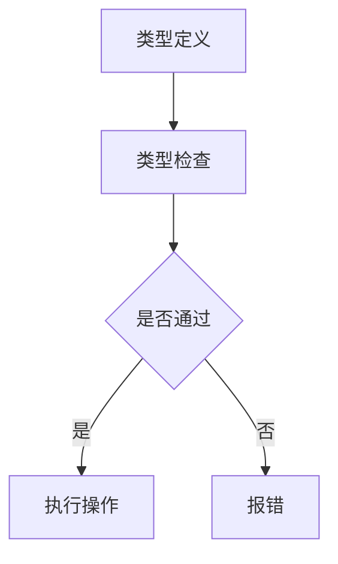
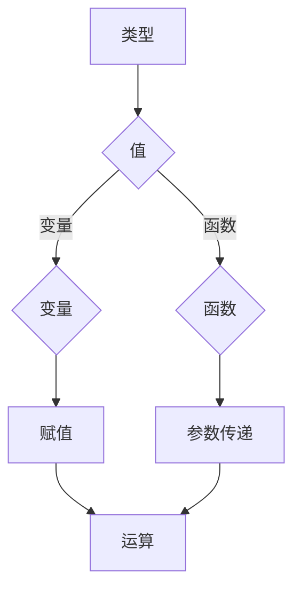
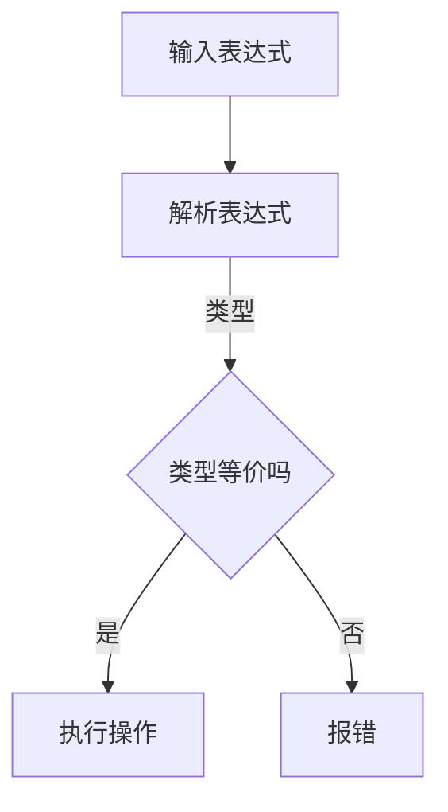
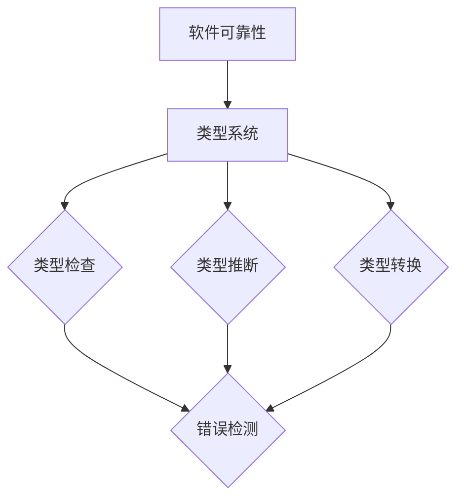

                 

### 文章标题：类型系统与软件可靠性：罗素的远见

> 关键词：类型系统、软件可靠性、罗素理论、数学模型、核心算法、实践应用、未来展望

> 摘要：本文旨在探讨类型系统在提升软件可靠性方面的重要性，并借鉴罗素的哲学观点，对类型系统进行深入剖析。通过介绍类型系统的基本概念、数学模型和核心算法，结合实际案例分析，本文展示了类型系统在软件可靠性保障中的关键作用，并提出了未来发展的展望。

### 引言

#### 类型系统的基本概念

类型系统是编程语言和软件系统中的一个核心概念，它定义了数据类型的规则和操作。类型系统的目的是为了确保程序的正确性和安全性，通过限制数据类型的操作，避免不合理的操作和潜在的错误。

#### 软件可靠性的定义与影响

软件可靠性是指软件在特定条件下，按照既定的需求和规格，能够持续、稳定、正确地执行任务的能力。软件可靠性对系统的稳定运行、用户满意度以及企业竞争力具有重要影响。

#### 罗素的理论贡献

英国哲学家、数学家和逻辑学家贝特兰·罗素（Bertrand Russell）在逻辑原子主义和数学基础理论研究中提出了许多重要观点，这些观点对计算机科学和类型系统的发展产生了深远影响。罗素对类型论（Type Theory）的贡献尤为突出，为现代类型系统的构建提供了理论依据。

#### 书籍结构与内容概述

本书将分为以下几个部分：

1. 引言：介绍类型系统和软件可靠性的背景、重要性以及罗素的理论贡献。
2. 类型系统的原理与数学模型：详细阐述类型系统的基本原理和数学模型。
3. 类型系统的核心算法：探讨类型系统的核心算法及其应用。
4. 类型系统与软件可靠性的关系：分析类型系统如何提升软件可靠性。
5. 类型系统在软件开发中的应用：展示类型系统在实际项目中的应用案例。
6. 总结与展望：总结全书内容，并对类型系统与软件可靠性的未来进行展望。

### 第一部分：类型系统的原理与数学模型

#### 1.1 类型系统的基本原理

类型系统通过定义数据的类型和操作规则，确保程序的正确性和安全性。类型系统的基本原理包括：

- 数据类型的定义：数据类型是数据的不同类别，如整数、浮点数、字符串等。
- 类型检查：在程序运行之前或运行时，检查操作是否合法，以防止类型错误。
- 类型推断：自动推导变量或表达式的类型，减少显式类型声明的需求。

#### 1.2 类型系统的数学模型

类型系统的数学模型基于集合论和逻辑学，通常使用范畴论的概念来描述。以下是一些常见的数学模型：

- **类型论（Type Theory）**：基于类型的层次结构和类型构造操作。
- **类型系统分类**：包括静态类型、动态类型、弱类型、强类型等。
- **类型等价**：定义类型之间的等价关系，确保类型兼容性。

#### 1.3 Mermaid流程图：类型系统的原理与架构

为了更直观地理解类型系统的原理与架构，我们可以使用Mermaid流程图来展示类型系统的工作流程。以下是一个简单的Mermaid流程图示例：



在这个示例中，类型定义后，通过类型检查来确定操作是否合法。如果通过类型检查，则执行操作；否则，报错。

#### 1.4 核心概念与联系

类型系统中的核心概念包括类型、值、变量、函数等。它们之间的联系可以用以下Mermaid流程图来表示：



在这个流程图中，类型定义了值的集合，值可以作为变量的赋值或函数的参数，最终参与运算。

### 第二部分：类型系统的核心算法

#### 2.1 类型系统的核心算法

类型系统的核心算法包括类型检查、类型推断、类型转换等。以下是一些常见的核心算法：

- **类型检查（Type Checking）**：在程序运行前或运行时，检查操作是否合法，以防止类型错误。
- **类型推断（Type Inference）**：自动推导变量或表达式的类型。
- **类型转换（Type Conversion）**：将一种类型的值转换为另一种类型。

#### 2.2 数学公式与详细讲解

在类型系统中，数学公式用于描述类型之间的关系和操作规则。以下是一个简单的类型检查公式的示例：

$$ type_{check}(e, T) = \begin{cases} 
\text{true} & \text{如果 } e \text{ 的类型为 } T \\ 
\text{false} & \text{否则}
\end{cases} $$

这个公式表示，如果表达式 \( e \) 的类型为 \( T \)，则类型检查为真；否则为假。

#### 2.3 算法原理图解与示例

为了更直观地理解类型系统的核心算法原理，我们可以使用Mermaid流程图和伪代码来展示。以下是一个类型检查算法的示例：



伪代码：

```python
def type_check(expression, expected_type):
    actual_type = parse_expression(expression)
    if actual_type == expected_type:
        return execute_operation()
    else:
        raise TypeError("类型错误：期望类型为 " + expected_type + "，实际类型为 " + actual_type)
```

在这个示例中，首先解析表达式，然后检查实际类型与期望类型是否等价。如果等价，则执行操作；否则，报错。

### 第三部分：类型系统与软件可靠性的关系

#### 3.1 类型系统与软件可靠性的联系

类型系统在提升软件可靠性方面具有重要作用。通过类型检查和类型推断，类型系统可以确保程序的正确性和安全性，减少因类型错误导致的软件缺陷。

- **类型检查**：通过在编译时检查类型错误，可以提前发现潜在的问题，提高软件的可靠性。
- **类型推断**：自动推导类型，减少显式类型声明的需求，降低人为错误的可能性。
- **类型兼容性**：确保不同类型的数据能够正确转换和操作，避免因类型不兼容导致的错误。

#### 3.2 实际案例分析

以下是一个实际案例，展示了类型系统在提升软件可靠性方面的作用：

**案例背景**：某电商平台的订单处理系统在一次促销活动中发生了大量订单处理错误，导致用户投诉增加。

**分析过程**：

1. **类型检查**：在编译时，类型检查发现订单处理代码中存在类型错误，如将字符串错误地转换为整数。
2. **类型推断**：在运行时，类型推断帮助开发人员发现和修复类型错误，确保订单处理过程的正确性。
3. **类型转换**：通过适当的类型转换，确保不同类型的数据能够正确转换和操作，避免因类型不兼容导致的错误。

**结论**：通过类型系统的应用，电商平台成功解决了订单处理错误问题，提升了系统的可靠性。

#### 3.3 类型系统与软件可靠性的关系架构

为了更直观地展示类型系统与软件可靠性的关系，我们可以使用Mermaid流程图来描述。以下是一个简单的架构示例：



在这个架构中，类型系统通过类型检查、类型推断和类型转换，帮助提升软件可靠性，并实现错误检测。

### 第四部分：类型系统在软件开发中的应用

#### 4.1 类型系统在软件开发中的应用场景

类型系统在软件开发中的应用非常广泛，包括以下场景：

- **编译时错误检测**：通过类型检查，提前发现潜在的类型错误。
- **动态类型推断**：自动推导变量和表达式的类型，提高开发效率。
- **类型兼容性**：确保不同类型的数据能够正确转换和操作。
- **编程语言设计**：类型系统是编程语言设计中的一个重要组成部分，影响语言的性能和易用性。

#### 4.2 项目实战

以下是一个类型系统在软件开发中的实际项目案例：

**项目背景**：某金融公司开发了一个在线交易系统，需要确保交易过程的准确性和安全性。

**开发环境搭建**：

1. **选择合适的编程语言**：选择支持强类型系统的编程语言，如Java或C#。
2. **配置编译器**：安装和配置编译器，确保类型检查功能正常。
3. **编写测试用例**：编写测试用例，验证类型检查和类型推断的正确性。

**源代码实现与解读**：

```java
// 订单类，定义订单的属性和方法
public class Order {
    private int id;
    private String customerName;
    private double amount;

    // 构造函数
    public Order(int id, String customerName, double amount) {
        this.id = id;
        this.customerName = customerName;
        this.amount = amount;
    }

    // 订单处理方法，执行交易操作
    public void processOrder() {
        // 类型检查：确保交易金额为正数
        if (amount <= 0) {
            throw new IllegalArgumentException("交易金额必须大于0");
        }
        // 订单处理逻辑
        System.out.println("订单ID：" + id + "，客户：" + customerName + "，交易金额：" + amount);
    }
}

// 主类，测试订单处理
public class Main {
    public static void main(String[] args) {
        // 创建订单对象
        Order order = new Order(1, "张三", 1000.0);
        // 处理订单
        order.processOrder();
    }
}
```

在这个示例中，我们定义了一个`Order`类，包含订单的属性和方法。在`processOrder`方法中，通过类型检查确保交易金额为正数，避免可能的错误。

#### 4.3 代码应用解读与分析

在这个案例中，类型系统发挥了重要作用：

- **类型检查**：在编译时，编译器会检查`amount`变量的类型是否为`double`，确保交易金额的准确性。
- **类型推断**：在运行时，类型推断帮助开发人员自动推导变量和表达式的类型，提高开发效率。
- **类型转换**：虽然在这个示例中没有显式地进行类型转换，但类型系统确保了不同类型的数据能够正确转换和操作。

通过类型系统的应用，在线交易系统确保了交易的准确性和安全性，提高了软件可靠性。

### 第五部分：总结与展望

#### 5.1 全书内容总结

本文从类型系统的基本概念、数学模型、核心算法、与软件可靠性的关系以及实际应用等方面，全面探讨了类型系统在软件可靠性保障中的关键作用。通过实际案例分析和项目实战，展示了类型系统在提升软件可靠性方面的显著效果。

#### 5.2 展望类型系统与软件可靠性的未来

随着软件系统规模的不断扩大和复杂性的增加，类型系统在软件可靠性保障中的地位愈发重要。未来，类型系统的研究和发展将聚焦于以下几个方面：

- **类型系统的优化**：提高类型检查和类型推断的效率，减少对开发人员的工作负担。
- **跨语言类型兼容性**：实现不同编程语言之间的类型兼容性，促进代码复用和模块化开发。
- **类型系统的智能化**：利用人工智能技术，提高类型推断的准确性和自动化程度。
- **类型系统在新兴领域的应用**：探索类型系统在区块链、物联网、人工智能等新兴领域的应用，提升系统可靠性。

#### 5.3 研究方向与建议

为了推动类型系统与软件可靠性的研究，我们提出以下研究方向和建议：

- **类型系统与人工智能结合**：研究类型系统在人工智能领域中的应用，提高智能系统的可靠性。
- **类型系统的形式化验证**：开展类型系统的形式化验证研究，确保类型系统的正确性和安全性。
- **类型系统的教学与实践**：加强类型系统在计算机科学教育中的应用，提高学生和开发人员的类型意识。

### 附录

#### 附录 A：类型系统相关工具与资源

- **类型检查工具**：如Eclipse、Visual Studio Code等集成开发环境。
- **类型推断工具**：如类型推断器、静态分析工具等。
- **类型系统学习资源**：如在线课程、书籍、论文等。

### 结束语

类型系统作为软件可靠性保障的重要手段，具有广泛的应用前景。通过本文的探讨，我们希望能为读者提供对类型系统与软件可靠性的深入理解，并激发对类型系统研究的兴趣。作者：AI天才研究院/AI Genius Institute & 禅与计算机程序设计艺术 /Zen And The Art of Computer Programming。

