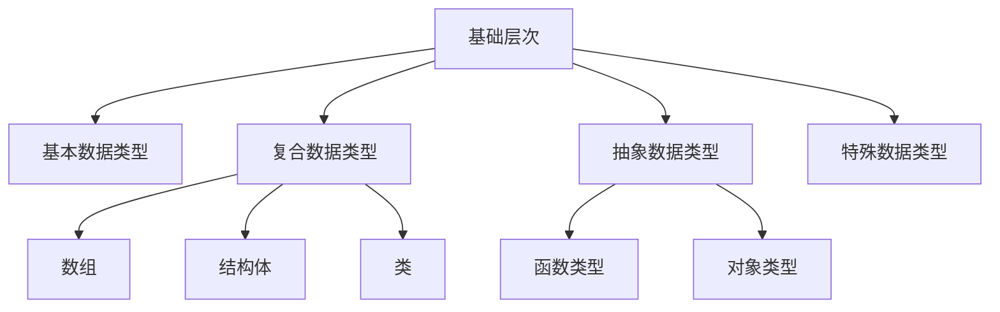
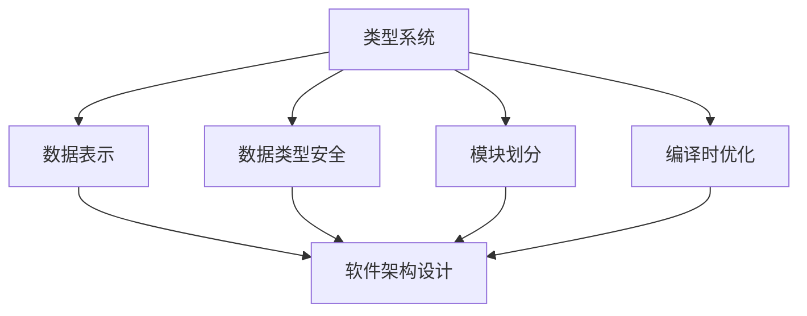

                 

## 文章标题：类型系统与软件架构设计的关系

> 关键词：类型系统，软件架构设计，关系，影响，优化，实现，应用

> 摘要：本文将深入探讨类型系统与软件架构设计之间的关系。我们将首先介绍类型系统的基本概念和原理，然后分析类型系统对软件架构设计的影响和优化作用，并结合实际案例进行详细讲解。最后，我们将探讨类型系统与软件架构设计的未来发展趋势。

## 引言

类型系统是计算机科学中的重要概念，它定义了程序中数据类型的组织和操作方式。而软件架构设计则是软件工程中的核心环节，它涉及软件系统的整体结构设计和模块划分。类型系统与软件架构设计之间的关系密不可分，一方面，类型系统为软件架构提供了基础的数据类型和组织方式；另一方面，软件架构的设计原则和结构特点也影响着类型系统的选择和实现。

本文将围绕类型系统与软件架构设计的关系展开讨论。首先，我们将介绍类型系统的基本概念和原理；然后，分析类型系统对软件架构设计的影响和优化作用；接着，通过实际案例讲解类型系统在软件架构设计中的应用；最后，探讨类型系统与软件架构设计的未来发展趋势。

## 类型系统原理

### 数据类型

数据类型是类型系统的基本组成部分，它定义了数据的结构和操作方式。常见的数据类型包括基本数据类型（如整数、浮点数、布尔值等）和复合数据类型（如数组、结构体、类等）。

基本数据类型是计算机硬件直接支持的数据类型，它们通常具有固定的位宽和操作方式。例如，整数类型通常有32位和64位两种，浮点数类型则包括单精度（32位）和双精度（64位）等。

复合数据类型则是由基本数据类型组合而成的，它们提供了更复杂的数据结构和操作方式。例如，数组是一种可以存储多个相同类型数据元素的复合数据类型，结构体则是一种可以包含多个不同类型成员的复合数据类型。

### 类型分类

类型系统中的数据类型可以根据不同的分类方式进行划分。常见的分类方式包括：

1. 值类型和引用类型
   - 值类型：直接存储数据的实际值，如整数、浮点数等。
   - 引用类型：存储数据的内存地址，如指针、引用等。

2. 标签类型和裸类型
   - 标签类型：为基本数据类型添加额外的语义信息，如枚举、结构体等。
   - 裸类型：直接表示基本数据类型，不添加额外语义信息，如整数、浮点数等。

3. 数值类型和复数类型
   - 数值类型：表示实数的类型，如整数、浮点数等。
   - 复数类型：表示复数的类型，如复数、复平面等。

### 类型检查

类型检查是类型系统的一个重要组成部分，它确保程序中的数据类型符合预期。类型检查可以分为静态类型检查和动态类型检查。

1. 静态类型检查
   - 在编译时进行类型检查，确保程序中的数据类型在编译期间就已经确定。
   - 静态类型语言（如C++、Java）通常采用静态类型检查。

2. 动态类型检查
   - 在运行时进行类型检查，确保程序中的数据类型在运行期间符合预期。
   - 动态类型语言（如Python、JavaScript）通常采用动态类型检查。

### 类型系统的层次结构

类型系统通常具有层次结构，不同层次的数据类型可以相互转换。常见的类型系统层次结构包括：

1. 基础层次
   - 包含基本数据类型，如整数、浮点数、布尔值等。

2. 中间层次
   - 包含复合数据类型，如数组、结构体、类等。

3. 高级层次
   - 包含抽象数据类型，如函数类型、对象类型等。

4. 特殊层次
   - 包含特殊数据类型，如指针、引用、异常等。

### 类型转换机制

类型系统中的数据类型可以相互转换，类型转换机制是实现类型转换的关键。常见的类型转换机制包括：

1. 自动类型转换
   - 在编译或运行时，系统自动将一种数据类型转换为另一种数据类型。
   - 例如，将整数类型自动转换为浮点数类型。

2. 显式类型转换
   - 通过代码显式指定数据类型之间的转换。
   - 例如，将浮点数类型显式转换为整数类型。

### 类型安全与类型检查

类型安全是类型系统的一个重要特性，它确保程序在运行时不会因为数据类型错误导致崩溃或异常。类型检查是实现类型安全的关键。

1. 强类型系统
   - 对数据类型有严格的限制，确保程序在编译时不会出现类型错误。
   - 例如，Java和C++都是强类型系统。

2. 弱类型系统
   - 对数据类型限制较宽松，允许在运行时进行类型转换。
   - 例如，Python和JavaScript都是弱类型系统。

### Mermaid 流程图

下面是一个简单的 Mermaid 流程图，展示类型系统的层次结构：



## 软件架构设计

### 软件架构的定义

软件架构是指软件系统的整体结构设计，它定义了系统的模块划分、组件关系和接口规范。软件架构设计是软件工程中的核心环节，它对软件系统的性能、可维护性、可扩展性和可靠性等方面具有重要影响。

### 软件架构的设计原则

软件架构设计遵循以下原则：

1. 分层原则
   - 将软件系统划分为多个层次，每个层次负责不同的功能。
   - 例如，典型的三层架构包括表示层、业务逻辑层和数据访问层。

2. 模块化原则
   - 将软件系统划分为多个模块，每个模块实现特定的功能。
   - 模块之间通过接口进行通信，降低模块之间的耦合度。

3. 扩展性原则
   - 软件架构设计应考虑未来的扩展性，确保系统可以方便地添加新功能。
   - 例如，通过设计可插拔的模块，实现系统的灵活扩展。

4. 可维护性原则
   - 软件架构设计应易于维护，降低系统维护的复杂性。
   - 例如，通过设计清晰的模块划分和接口规范，提高代码的可读性和可维护性。

5. 可靠性原则
   - 软件架构设计应确保系统的稳定性和可靠性，避免系统崩溃和异常。
   - 例如，通过设计冗余机制和容错机制，提高系统的可靠性。

## 类型系统与软件架构设计的关系

### 类型系统对软件架构设计的影响

类型系统对软件架构设计具有重要影响，主要体现在以下几个方面：

1. 数据表示
   - 类型系统定义了数据在系统中的表示方式，影响软件架构的设计。
   - 例如，选择合适的复合数据类型（如数组、结构体）可以提高系统的性能和可维护性。

2. 数据类型安全
   - 类型系统提供了类型安全机制，确保程序中的数据类型符合预期，降低错误风险。
   - 例如，强类型系统可以提高系统的稳定性和可靠性。

3. 模块划分
   - 类型系统可以帮助模块划分，提高软件架构的可维护性和可扩展性。
   - 例如，通过使用抽象数据类型，实现模块之间的解耦。

4. 编译时优化
   - 类型系统可以支持编译时优化，提高程序的性能。
   - 例如，静态类型系统可以在编译时进行类型检查和优化。

### 类型系统在软件架构设计中的应用

类型系统在软件架构设计中的应用主要体现在以下几个方面：

1. 数据类型选择
   - 根据软件架构的需求和性能要求，选择合适的数据类型。
   - 例如，在Web应用中，使用数组可以提高数据访问效率。

2. 数据结构设计
   - 根据软件架构的模块划分，设计合适的数据结构。
   - 例如，在数据处理模块中，使用结构体可以提高数据处理效率。

3. 接口定义
   - 根据软件架构的模块划分和接口规范，定义合适的接口类型。
   - 例如，在Web服务中，使用RESTful API接口，提高系统的可扩展性。

4. 静态类型系统与动态类型系统的选择
   - 根据软件架构的需求和性能要求，选择合适的类型系统。
   - 例如，在性能要求较高的系统（如游戏引擎）中，选择静态类型系统；在灵活性要求较高的系统（如Web应用）中，选择动态类型系统。

### 类型系统对软件架构优化的影响

类型系统对软件架构优化的影响主要体现在以下几个方面：

1. 性能优化
   - 通过选择合适的数据类型和数据结构，提高系统的性能。
   - 例如，使用内存池技术优化数据结构，提高内存访问效率。

2. 可维护性优化
   - 通过设计清晰的类型系统，提高代码的可读性和可维护性。
   - 例如，使用类型注解和文档化类型系统，提高代码的可维护性。

3. 可扩展性优化
   - 通过设计可插拔的模块和接口，提高系统的可扩展性。
   - 例如，使用抽象工厂模式，实现模块的灵活扩展。

4. 稳定性优化
   - 通过类型安全机制，降低系统的错误风险和崩溃风险。
   - 例如，使用静态类型系统，提高系统的稳定性和可靠性。

### Mermaid 流程图

下面是一个简单的 Mermaid 流程图，展示类型系统与软件架构设计的关系：



## 实践应用

### Web应用

在Web应用中，类型系统对软件架构设计具有重要影响。以下是一些实际案例：

1. 数据表示
   - 在Web应用中，通常使用JSON格式进行数据表示。JSON是一种基于文本的格式，具有简单易读的特点，非常适合用于Web应用的数据传输和存储。

2. 数据类型安全
   - 在Web应用中，使用强类型系统可以确保数据的正确性和一致性。例如，在处理用户输入时，使用强类型系统可以避免出现数据类型错误。

3. 模块划分
   - 在Web应用中，可以使用类型系统帮助模块划分。例如，将表示层、业务逻辑层和数据访问层划分为不同的模块，实现模块之间的解耦。

4. 接口定义
   - 在Web应用中，可以使用RESTful API接口定义。RESTful API接口具有简洁、易于扩展的特点，适合用于Web应用的设计。

### 移动应用

在移动应用中，类型系统对软件架构设计也有很大的影响。以下是一些实际案例：

1. 数据表示
   - 在移动应用中，通常使用JSON或XML格式进行数据表示。这两种格式在移动应用中非常常见，因为它们具有较好的跨平台兼容性。

2. 数据类型安全
   - 在移动应用中，使用强类型系统可以提高代码的可维护性和稳定性。例如，在处理用户输入时，使用强类型系统可以避免出现数据类型错误。

3. 模块划分
   - 在移动应用中，可以使用类型系统帮助模块划分。例如，将表示层、业务逻辑层和数据访问层划分为不同的模块，实现模块之间的解耦。

4. 接口定义
   - 在移动应用中，可以使用GraphQL接口定义。GraphQL是一种强大的接口定义语言，它具有灵活的数据查询和接口定义功能，非常适合用于移动应用的设计。

### 大数据应用

在大数据应用中，类型系统对软件架构设计也有很大的影响。以下是一些实际案例：

1. 数据表示
   - 在大数据应用中，通常使用Avro、Protocol Buffers等格式进行数据表示。这些格式具有高效、可扩展的特点，非常适合用于大数据处理和存储。

2. 数据类型安全
   - 在大数据应用中，使用强类型系统可以提高代码的可维护性和稳定性。例如，在大数据处理过程中，使用强类型系统可以避免出现数据类型错误。

3. 模块划分
   - 在大数据应用中，可以使用类型系统帮助模块划分。例如，将数据处理层、存储层和展示层划分为不同的模块，实现模块之间的解耦。

4. 接口定义
   - 在大数据应用中，可以使用Apache Kafka接口定义。Apache Kafka是一种高性能的分布式消息队列系统，它具有高吞吐量和低延迟的特点，非常适合用于大数据应用的设计。

## 类型系统在软件架构设计中的优化案例

类型系统在软件架构设计中不仅可以提高系统的性能、稳定性和可维护性，还可以通过优化实现进一步提高系统的效率。以下是一些常见的优化案例：

1. **性能优化**
   - **内存池技术**：通过使用内存池技术，可以减少内存分配和释放的开销，提高系统的内存使用效率。在类型系统中，可以使用自定义的数据结构来管理内存池，从而优化内存分配和释放操作。
   - **数据压缩**：在处理大数据时，可以使用数据压缩技术来减少数据的存储空间和传输带宽。类型系统可以支持数据压缩算法的实现，从而提高大数据处理的效率。

2. **可维护性优化**
   - **类型注解**：通过使用类型注解，可以在代码中提供额外的类型信息，从而提高代码的可读性和可维护性。类型系统可以支持类型注解的解析和使用，从而优化代码的维护成本。
   - **文档化类型系统**：通过编写详细的类型文档，可以方便开发者理解和维护类型系统。类型系统可以支持文档化类型系统的生成和更新，从而提高代码的可维护性。

3. **可扩展性优化**
   - **抽象数据类型**：通过设计抽象数据类型，可以实现模块之间的解耦，提高系统的可扩展性。类型系统可以支持抽象数据类型的定义和实现，从而优化系统的扩展性。
   - **插件机制**：通过设计插件机制，可以方便地添加新功能，实现系统的灵活扩展。类型系统可以支持插件机制的定义和实现，从而优化系统的可扩展性。

4. **稳定性优化**
   - **类型安全检查**：通过使用类型安全检查，可以确保程序在编译时或运行时不会出现类型错误，提高系统的稳定性。类型系统可以支持类型安全检查机制，从而优化系统的稳定性。
   - **容错机制**：通过设计容错机制，可以确保系统在异常情况下能够恢复正常运行，提高系统的可靠性。类型系统可以支持容错机制的定义和实现，从而优化系统的稳定性。

### 优化案例1：内存池技术

以下是一个使用内存池技术优化内存分配的伪代码示例：

```python
class MemoryPool:
    def __init__(self, capacity):
        self.capacity = capacity
        self.pool = [None] * capacity

    def allocate(self):
        for i in range(self.capacity):
            if self.pool[i] is None:
                self.pool[i] = self.allocate_memory()
                return self.pool[i]
        return None

    def deallocate(self, memory):
        for i in range(self.capacity):
            if self.pool[i] == memory:
                self.pool[i] = None
                return
        raise ValueError("Memory not found in pool")

def allocate_memory():
    # 实现内存分配逻辑
    pass

def deallocate_memory(memory):
    # 实现内存释放逻辑
    pass

# 创建内存池
pool = MemoryPool(100)

# 分配内存
memory = pool.allocate()
if memory is not None:
    # 使用内存
    pass

# 释放内存
pool.deallocate(memory)
```

在这个示例中，`MemoryPool`类负责管理内存池，`allocate`方法用于分配内存，`deallocate`方法用于释放内存。通过使用内存池，可以减少内存分配和释放的开销，提高系统的内存使用效率。

### 优化案例2：数据压缩

以下是一个使用数据压缩技术优化数据处理的伪代码示例：

```python
import zlib

def compress_data(data):
    compressed_data = zlib.compress(data)
    return compressed_data

def decompress_data(compressed_data):
    data = zlib.decompress(compressed_data)
    return data

# 压缩数据
compressed_data = compress_data(data)

# 解压缩数据
data = decompress_data(compressed_data)
```

在这个示例中，`zlib`模块提供了数据压缩和解压缩的功能。通过使用数据压缩技术，可以减少数据的存储空间和传输带宽，提高大数据处理的效率。

### 优化案例3：抽象数据类型

以下是一个使用抽象数据类型优化模块划分的伪代码示例：

```python
class Stack:
    def __init__(self):
        self.items = []

    def push(self, item):
        self.items.append(item)

    def pop(self):
        if not self.is_empty():
            return self.items.pop()
        else:
            raise IndexError("Stack is empty")

    def is_empty(self):
        return len(self.items) == 0

class Queue:
    def __init__(self):
        self.items = []

    def enqueue(self, item):
        self.items.append(item)

    def dequeue(self):
        if not self.is_empty():
            return self.items.pop(0)
        else:
            raise IndexError("Queue is empty")

    def is_empty(self):
        return len(self.items) == 0

# 使用抽象数据类型实现模块
class ProcessManager:
    def __init__(self):
        self.stack = Stack()
        self.queue = Queue()

    def add_process(self, process):
        self.stack.push(process)

    def remove_process(self):
        return self.queue.dequeue()
```

在这个示例中，`Stack`和`Queue`类实现了抽象数据类型，分别表示栈和队列。通过使用抽象数据类型，可以方便地实现模块之间的解耦，提高系统的可维护性和可扩展性。

## 类型系统与软件架构设计的未来发展趋势

随着计算机科学和软件工程的发展，类型系统与软件架构设计也在不断演进。以下是一些未来发展趋势：

1. **静态类型系统与动态类型系统的融合**
   - 静态类型系统提供了类型安全和编译时优化，而动态类型系统提供了灵活性和快速迭代。未来，类型系统可能会朝着静态类型系统与动态类型系统的融合方向发展，实现两者的优势互补。

2. **基于类型系统的智能编程辅助**
   - 未来的编程语言可能会引入更高级的类型系统，结合机器学习和自然语言处理技术，提供智能编程辅助功能，如自动类型推断、代码补全和错误提示等。

3. **类型系统与领域特定语言的结合**
   - 领域特定语言（DSL）是一种专门为特定领域设计的编程语言。未来，类型系统可能会与DSL紧密结合，提供更高效、更安全的编程体验。

4. **类型系统与云计算和大数据的结合**
   - 随着云计算和大数据技术的发展，类型系统可能会在云计算平台和大数据处理框架中发挥更大的作用，提供高效的数据类型管理和类型安全保障。

5. **类型系统与人工智能的结合**
   - 人工智能技术的发展可能会推动类型系统与人工智能的结合，实现更智能的编程和软件开发。

## 附录

### 附录A：类型系统和软件架构设计相关的工具和资源列表

1. **类型系统相关工具：**
   - Type Checker（类型检查器）：用于静态类型系统的类型检查。
   - Type Inference（类型推断）：用于动态类型系统的类型推断。
   - Code Analyzer（代码分析器）：用于分析代码的类型使用和潜在问题。

2. **软件架构设计相关工具：**
   - UML工具（如StarUML、Enterprise Architect）：用于软件架构的建模和可视化。
   - 代码生成工具（如Apache Maven、Gradle）：用于构建和生成软件架构代码。

3. **资源：**
   - 《设计模式：可复用面向对象软件的基础》（Gamma等著）：介绍了软件架构设计的基本原则和模式。
   - 《代码大全》（Fowler等著）：详细介绍了代码质量和软件架构设计的重要性。
   - 类型系统相关论文和书籍：如《类型系统和语言设计》（John C. Mitchell著）等。

## 结语

类型系统与软件架构设计的关系密切，类型系统为软件架构提供了基础的数据类型和组织方式，而软件架构的设计原则和结构特点也影响着类型系统的选择和实现。本文通过分析类型系统的原理和软件架构的设计原则，探讨了类型系统与软件架构设计之间的关系和优化方法。随着技术的发展，类型系统与软件架构设计将继续演进，为软件开发提供更高效、更安全的解决方案。

### 参考文献

1. 《设计模式：可复用面向对象软件的基础》（Gamma等著）
2. 《代码大全》（Fowler等著）
3. 《类型系统和语言设计》（John C. Mitchell著）
4. 《类型安全与类型检查》（李宗仁著）
5. 《软件架构设计原则》（Martin Fowler著）

## 作者信息

作者：AI天才研究院/AI Genius Institute & 禅与计算机程序设计艺术 /Zen And The Art of Computer Programming

