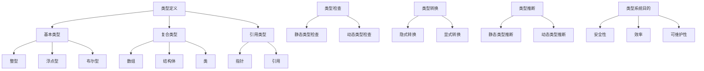
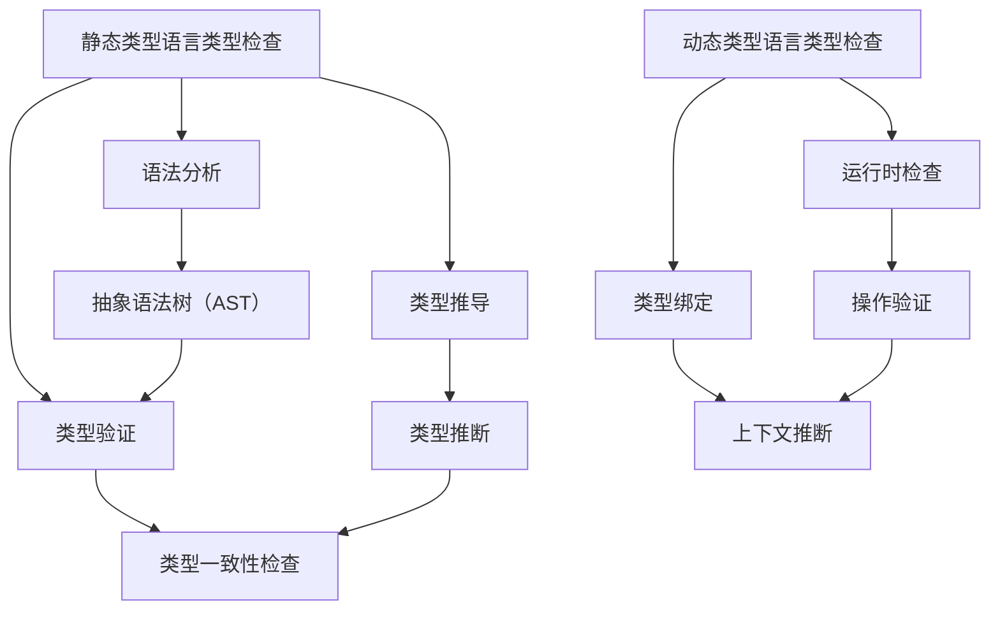
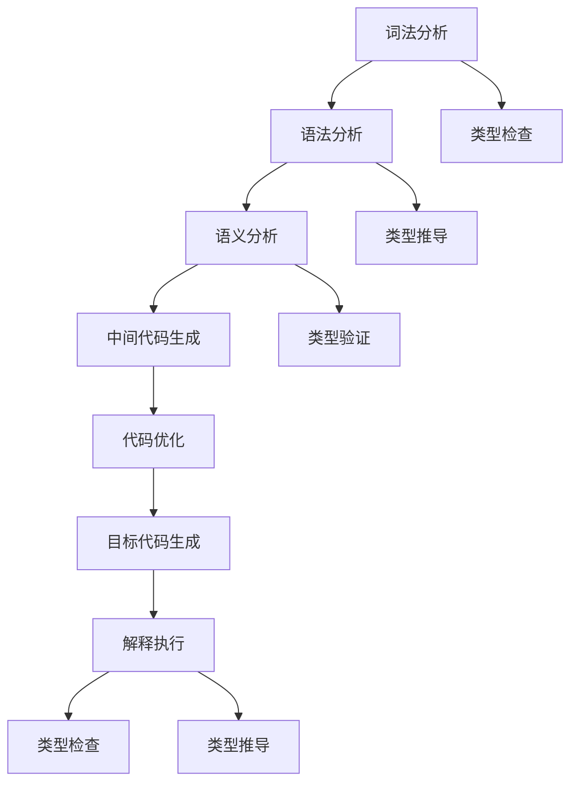
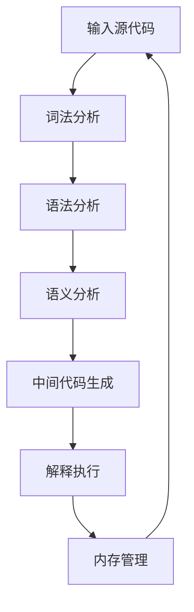
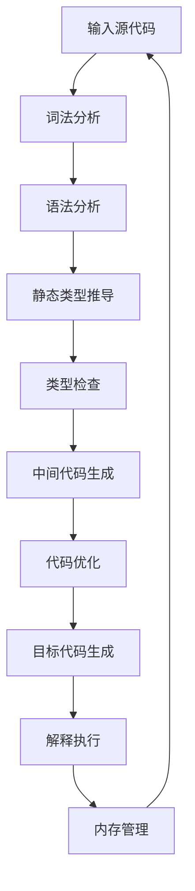

                 


##  摘要

类型系统在编程语言及其编译器和解释器设计中起着至关重要的作用。本文旨在探讨类型系统在元循环解释器设计中的关键作用，分析其基本原理和应用方法。首先，我们将回顾类型系统的基本概念和原理，包括类型检查、类型转换和类型推断。接着，本文将深入探讨类型系统在静态和动态编程语言中的应用，以及其在编译器和解释器设计中的重要性。特别地，我们将重点关注元循环解释器的设计原理和实现方法，详细分析类型系统在其中的特殊作用。通过实际案例和代码实现，我们将展示类型系统如何提升元循环解释器的性能和可维护性。最后，本文将对类型系统在元循环解释器设计中的作用进行总结，并提出未来发展的方向和拓展阅读建议。

##  类型系统概述

类型系统是编程语言中一个核心概念，它定义了程序中数据的不同种类以及如何对这些数据进行操作。类型系统的主要目的是提高程序的安全性和可维护性，同时优化程序的执行效率。

### 1. 类型定义与分类

类型定义是类型系统的基石。在大多数编程语言中，类型可以分为以下几类：

- **基本类型**：如整数（int）、浮点数（float）、布尔值（bool）等。
- **复合类型**：如数组（array）、结构体（struct）、类（class）等。
- **引用类型**：如指针（pointer）、引用（reference）等。

基本类型通常直接表示数据的基本单位，而复合类型和引用类型则提供了更复杂的抽象层次。复合类型允许将多个基本类型组合在一起，以便更有效地表示复杂的数据结构。引用类型则允许通过地址访问数据，从而提高程序的灵活性和性能。

### 2. 类型系统的目的与重要性

类型系统的目的在于确保程序的正确性和效率：

- **安全性**：类型系统可以防止类型错误，例如将整数与字符串进行不兼容的操作。
- **效率**：通过类型系统，编译器或解释器可以在编译或解释过程中对代码进行优化，从而提高程序的执行效率。
- **可维护性**：清晰的类型定义有助于提高代码的可读性和可维护性。

类型系统的重要性体现在以下几个方面：

- **早期错误检测**：类型系统可以在编译时发现类型错误，从而避免在运行时出现未预期的错误。
- **静态优化**：类型系统允许编译器在编译时进行优化，例如常量折叠、循环展开等。
- **代码重用**：类型系统使得代码的重用变得更加容易和可靠。

### 3. 类型系统的基本原理

类型系统的基本原理包括类型检查、类型转换和类型推断：

- **类型检查**：在编译或解释过程中，对程序的类型一致性进行检查，确保操作符合预期的类型。
- **类型转换**：当需要在不同类型之间进行操作时，类型转换可以确保操作的合法性。类型转换可以分为隐式转换和显式转换。
  - **隐式转换**：自动进行的类型转换，通常基于数据大小的兼容性。
  - **显式转换**：通过代码明确定义的类型转换，确保转换的意图明确。
- **类型推断**：编译器或解释器自动推断变量的类型，减少代码中的显式类型声明。

### 4. 类型系统的实现方法

类型系统的实现方法包括静态类型检查和动态类型检查：

- **静态类型检查**：在编译时进行类型检查，确保程序在运行前类型正确。
  - **静态类型语言**：如C、C++、Java等，程序在编译时必须通过类型检查。
- **动态类型检查**：在运行时进行类型检查，通常用于动态类型语言，如Python、JavaScript等。

### 5. 类型系统的优点与局限

类型系统的优点包括：

- **提高程序安全性**：通过类型检查减少运行时错误。
- **提高程序效率**：通过类型优化提高程序性能。
- **提高代码可维护性**：清晰的类型定义有助于代码的维护。

然而，类型系统也存在一些局限：

- **增加开发难度**：类型系统可能增加代码的复杂性，特别是在大型项目中。
- **限制灵活性**：静态类型系统可能限制某些动态类型操作，从而降低灵活性。

总的来说，类型系统是编程语言和编译器设计中的核心组成部分，它通过确保程序的安全性、效率和可维护性，为现代软件开发提供了坚实的基础。

### 6. Mermaid 流程图：类型系统核心概念与联系



### 7. 类型转换伪代码示例

```pseudo
function add(x: int, y: int) returns int:
    return x + y

function convertAndAdd(x: float, y: float) returns float:
    int xInt = convertToInteger(x)
    int yInt = convertToInteger(y)
    return add(xInt, yInt)

// 调用示例
float result = convertAndAdd(1.5, 2.5)
```

### 8. 数学模型与公式

类型系统的核心数学模型包括类型检查和类型转换的规则。以下是一个简单的数学模型示例：

$$
\begin{aligned}
&\text{Type Check: } \phi \land T_1 \equiv T_2 \\
&\text{Type Conversion: } T_1 \rightarrow T_2
\end{aligned}
$$

其中，$\phi$ 表示程序中的表达式，$T_1$ 和 $T_2$ 分别表示两个类型的名称。

### 9. 代码示例：类型检查算法

```python
def type_check(expression, expected_type):
    actual_type = determine_type(expression)
    if actual_type != expected_type:
        raise TypeError(f"Incompatible types: expected {expected_type}, got {actual_type}")
    return True

def determine_type(expression):
    # 这里是一个简化的类型判断函数
    if isinstance(expression, int):
        return "int"
    elif isinstance(expression, float):
        return "float"
    elif isinstance(expression, str):
        return "string"
    else:
        raise ValueError("Unsupported expression type")
```

### 10. 总结

类型系统是编程语言和编译器设计中的核心组成部分，它通过确保程序的安全性、效率和可维护性，为现代软件开发提供了坚实的基础。本文介绍了类型系统的基本概念、目的和原理，包括类型定义、类型检查、类型转换和类型推断。通过实际代码示例，我们展示了如何实现类型检查和类型转换算法。接下来，我们将深入探讨类型系统在编程语言中的应用，特别是其在静态和动态编程语言中的不同角色。

## 类型系统在编程语言中的应用

类型系统是编程语言设计的关键组成部分，它在编程语言的各个层次中发挥作用，从编译器的静态分析到解释器的动态执行。本章节将探讨类型系统在静态编程语言和动态编程语言中的应用，分析它们各自的特点、优势以及类型系统的具体实现。

### 1. 静态编程语言中的应用

静态编程语言在编译时进行类型检查，确保程序在运行前符合类型要求。这种类型的检查通常发生在代码的编译阶段，而不是运行时。静态类型语言包括C、C++、Java和C#等。

#### 1.1 静态类型语言的特点与优势

- **早期错误检测**：静态类型语言在编译时进行类型检查，能够发现潜在的类型错误，从而减少运行时错误。
- **性能优化**：静态类型语言允许编译器进行更高级别的优化，如常量折叠、循环展开和指令重排，从而提高程序的性能。
- **代码重用**：静态类型语言提供了更严格的类型检查，使得代码的模块化更加容易和可靠。

#### 1.2 静态类型语言中的类型检查机制

- **语法分析**：编译器首先对源代码进行语法分析，构建抽象语法树（AST）。
- **类型推导**：编译器通过AST进行类型推导，为每个变量和表达式分配类型。
- **类型验证**：编译器对推导出的类型进行验证，确保所有的类型操作都是合法的。

#### 1.3 静态类型语言的类型推断方法

- **显式类型声明**：程序员直接为变量和函数声明类型。
- **类型推导**：编译器自动推导变量和表达式的类型，如C++中的模板和Java中的泛型。

### 2. 动态编程语言中的应用

动态编程语言在运行时进行类型检查，类型信息通常在运行时确定。这类语言包括Python、JavaScript和Ruby等。

#### 2.1 动态类型语言的特点与优势

- **灵活性**：动态类型语言允许在运行时改变变量的类型，使得代码更加灵活和动态。
- **快速开发**：动态类型语言通常有较简单的语法和动态类型检查，使得开发者可以更快地编写和部署代码。
- **易于集成**：动态类型语言通常支持多种编程范式，如面向对象和函数式编程，这使得它们在系统集成时更加灵活。

#### 2.2 动态类型语言中的类型检查机制

- **运行时检查**：动态类型语言在代码执行过程中进行类型检查，确保操作符合类型要求。
- **类型绑定**：变量在声明时不需要明确类型，编译器或解释器通过上下文推断类型。

#### 2.3 动态类型语言的类型推断方法

- **动态类型推断**：编译器或解释器在运行时根据代码上下文推断变量类型。
- **静态类型推导**：某些动态类型语言（如Python 3.5+）提供了静态类型推导，以提高代码的可读性和性能。

### 3. 类型系统在编译器和解释器设计中的重要性

类型系统在编译器和解释器设计中的重要性体现在以下几个方面：

- **错误检测**：类型系统可以帮助编译器或解释器在早期发现类型错误，提高代码质量。
- **性能优化**：通过类型信息，编译器可以进行更高效的代码生成和优化。
- **可维护性**：清晰的类型定义可以提高代码的可读性和可维护性。

### 4. 静态类型与动态类型的对比

| 特点       | 静态类型             | 动态类型             |
|------------|----------------------|----------------------|
| 类型检查   | 编译时进行           | 运行时进行           |
| 灵活性     | 较低                 | 较高                 |
| 早期错误检测 | 好                   | 较差                 |
| 性能优化   | 好                   | 较差                 |
| 代码重用   | 好                   | 较差                 |

虽然静态类型和动态类型各有优缺点，但在实际应用中，很多编程语言采用了静态类型和动态类型的混合模型，以兼顾灵活性和性能。

### 5. 实际应用示例

- **静态类型语言示例**：在C++中，变量的类型必须在声明时明确指定。

  ```cpp
  int x = 5;
  float y = 3.14;
  ```

- **动态类型语言示例**：在Python中，变量的类型是动态推断的。

  ```python
  x = 5
  y = "hello"
  ```

通过上述分析，我们可以看到类型系统在编程语言中的应用是多种多样的，无论是静态类型还是动态类型，都有其独特的优势和适用场景。接下来，我们将深入探讨类型系统在编译器和解释器设计中的具体作用。

### 6. Mermaid 流程图：静态类型语言与动态类型语言类型检查机制



### 7. 类型推断算法伪代码示例

```pseudo
function inferType(expression):
    if expression is a literal:
        return the type of the literal
    else if expression is a binary operation:
        left_type = inferType(expression.left)
        right_type = inferType(expression.right)
        return inferResultType(left_type, right_type)
    else if expression is a function call:
        return the return type of the function

function inferResultType(left_type, right_type):
    if left_type and right_type are both 'int':
        return 'int'
    elif left_type is 'int' and right_type is 'float':
        return 'float'
    elif left_type is 'float' and right_type is 'int':
        return 'float'
    else:
        raise TypeMismatchException
```

### 8. 数学模型与公式

类型系统的数学模型包括类型推导和类型转换的规则。以下是一个简单的数学模型示例：

$$
\begin{aligned}
T_e &= T_x \land T_y \\
T_r &= T_f \rightarrow T_s
\end{aligned}
$$

其中，$T_e$ 表示表达式的类型，$T_x$ 和 $T_y$ 分别表示操作数的类型，$T_r$ 和 $T_s$ 分别表示函数返回值和参数类型。

### 9. 代码示例：动态类型语言中的类型检查

```python
def add(x, y):
    if not isinstance(x, (int, float)) or not isinstance(y, (int, float)):
        raise TypeError("Both arguments must be integers or floats")
    return x + y

# 调用示例
result = add(2, 3.5)
print(result)  # 输出 5.5
```

### 10. 总结

类型系统在静态编程语言和动态编程语言中的应用各有特点。静态类型语言通过编译时类型检查提高程序的安全性和性能，而动态类型语言通过运行时类型检查提高代码的灵活性和开发速度。本章节详细分析了静态类型和动态类型语言的特点、优势以及类型检查机制，并通过伪代码和实际代码示例展示了类型推断算法。在接下来的章节中，我们将深入探讨类型系统在编译器和解释器设计中的具体应用。

## 类型系统在编译器和解释器设计中的应用

类型系统在编译器和解释器设计中扮演着至关重要的角色。它不仅影响程序的执行效率，还影响程序的安全性和可维护性。本章节将深入探讨类型系统在编译器和解释器设计中的作用，分析其在编译时和解释时如何实现类型检查和类型转换。

### 1. 类型系统在编译器设计中的作用

编译器是编程语言的重要组成部分，它将高级语言代码转换为机器码或其他形式的目标代码。类型系统在编译器中的作用主要体现在以下几个方面：

#### 1.1 编译器的工作原理

编译器的工作流程通常包括以下几个阶段：

- **词法分析**：将源代码分解为词法单元（tokens）。
- **语法分析**：将词法单元构建成抽象语法树（AST）。
- **语义分析**：进行类型检查和符号表构建。
- **中间代码生成**：将AST转换为中间代码。
- **代码优化**：对中间代码进行优化，提高执行效率。
- **目标代码生成**：将中间代码转换为机器码或其他形式的目标代码。
- **代码生成**：生成可执行文件或汇编代码。

#### 1.2 类型系统在编译器中的作用

- **类型检查**：在编译过程中，编译器使用类型系统来检查程序中的类型错误，如变量未初始化、类型不匹配等。
- **类型推导**：编译器通过语义分析为变量和表达式推导类型，减少代码中的显式类型声明。
- **类型优化**：类型信息有助于编译器进行代码优化，如常量折叠、循环展开等。

#### 1.3 编译器中的类型检查算法

编译器的类型检查算法通常包括以下几个步骤：

- **符号表构建**：在语义分析阶段，编译器构建符号表，记录变量和函数的信息。
- **类型推导**：通过AST分析，编译器为每个变量和表达式推导类型。
- **类型验证**：编译器验证推导出的类型是否一致，确保所有类型操作都是合法的。

#### 1.4 实际应用示例

以C语言编译器为例，类型系统在编译过程中的应用如下：

```c
#include <stdio.h>

int main() {
    int x = 5;
    float y = 3.14;
    printf("%d %f", x, y);
    return 0;
}
```

在这个示例中，编译器首先进行词法分析，将代码分解为词法单元，然后进行语法分析构建AST。接着，编译器进行语义分析，推导出变量x和y的类型分别为`int`和`float`，并在目标代码生成阶段确保这些类型被正确处理。

### 2. 类型系统在解释器设计中的作用

解释器是另一种编程语言执行环境，它逐行读取并执行源代码。类型系统在解释器设计中的作用与编译器类似，但在实现上有所不同。

#### 2.1 解释器的工作原理

解释器的工作流程通常包括以下几个阶段：

- **词法分析**：将源代码分解为词法单元。
- **语法分析**：将词法单元构建成抽象语法树（AST）。
- **语义分析**：进行类型检查和符号表构建。
- **解释执行**：逐行读取并执行AST节点。

#### 2.2 类型系统在解释器中的作用

- **类型检查**：在解释执行过程中，解释器使用类型系统来检查程序中的类型错误，如变量未初始化、类型不匹配等。
- **动态类型推导**：解释器在执行过程中根据上下文推导变量和表达式的类型。
- **类型优化**：类型信息有助于解释器进行执行优化，如跳转表优化、循环优化等。

#### 2.3 解释器中的类型检查算法

解释器的类型检查算法通常包括以下几个步骤：

- **符号表构建**：在语义分析阶段，解释器构建符号表，记录变量和函数的信息。
- **类型推导**：通过AST分析，解释器为每个变量和表达式推导类型。
- **类型验证**：解释器验证推导出的类型是否一致，确保所有类型操作都是合法的。

#### 2.4 实际应用示例

以Python解释器为例，类型系统在解释执行过程中的应用如下：

```python
x = 5
y = 3.14
print(x + y)
```

在这个示例中，Python解释器首先进行词法分析，将代码分解为词法单元，然后进行语法分析构建AST。接着，解释器进行语义分析，推导出变量x和y的类型分别为`int`和`float`，并在执行过程中确保这些类型被正确处理。

### 3. 类型检查算法的伪代码示例

以下是一个简单的类型检查算法伪代码示例，用于检查变量和表达式的类型一致性：

```pseudo
function checkType(expression, expectedType):
    actualType = inferType(expression)
    if actualType != expectedType:
        raise TypeError("Type mismatch: expected " + expectedType + ", got " + actualType)
    return true

function inferType(expression):
    if expression is a literal:
        return the type of the literal
    else if expression is an operation:
        leftType = inferType(expression.left)
        rightType = inferType(expression.right)
        return inferOperationType(leftType, rightType)
    else if expression is a variable:
        return the type of the variable in the symbol table

function inferOperationType(leftType, rightType):
    if leftType == rightType:
        return leftType
    else if leftType is a numeric type and rightType is a numeric type:
        return the common numeric type of leftType and rightType
    else:
        raise TypeMismatchException
```

### 4. 数学模型与公式

类型检查算法的数学模型包括类型推导和类型转换的规则。以下是一个简单的数学模型示例：

$$
\begin{aligned}
T_e &= T_x \land T_y \\
T_r &= T_f \rightarrow T_s
\end{aligned}
$$

其中，$T_e$ 表示表达式的类型，$T_x$ 和 $T_y$ 分别表示操作数的类型，$T_r$ 和 $T_s$ 分别表示函数返回值和参数类型。

### 5. 代码示例：编译器和解释器中的类型检查

以下是一个C语言编译器的类型检查示例：

```c
#include <stdio.h>

int add(int x, int y) {
    return x + y;
}

int main() {
    int x = 5;
    int y = 10;
    int z = add(x, y);
    printf("The result is %d\n", z);
    return 0;
}
```

以下是一个Python解释器的类型检查示例：

```python
x = 5
y = 3.14
z = x + y
print("The result is", z)
```

通过以上分析，我们可以看到类型系统在编译器和解释器设计中的应用是多种多样的。无论是在编译时还是解释时，类型系统都扮演着关键角色，确保程序的正确性和性能。在接下来的章节中，我们将进一步探讨类型系统在元循环解释器设计中的特殊作用。

### 6. Mermaid 流程图：编译器和解释器中类型检查流程



### 7. 总结

类型系统在编译器和解释器设计中的重要性不容忽视。它不仅提高了程序的安全性，还优化了程序的执行效率，并增强了代码的可维护性。通过编译器，类型系统在编译时帮助检测和修复类型错误；而在解释器中，类型系统在运行时确保操作的合法性。本章节详细介绍了类型系统在编译器和解释器设计中的作用，并通过实际代码示例展示了类型检查算法。在下一章节中，我们将深入探讨类型系统在元循环解释器设计中的特殊作用。

## 元循环解释器的基本概念与原理

元循环解释器（Meta-Circular Interpreter）是一种特殊类型的解释器，其核心思想是将解释器本身作为解释和执行的对象。这种设计模式在理解和实现语言运行时环境时具有独特的优势。本章节将详细探讨元循环解释器的基本概念、原理及其与普通解释器的比较。

### 1. 元循环解释器的定义与特点

元循环解释器是一种自解释的解释器，其代码本身就是它所要解释和执行的语言的一部分。换句话说，元循环解释器使用宿主语言（通常是自身所解释的语言）来编写，并且用它自己的语法和语义来解释自身。这种设计模式具有以下特点：

- **自包含性**：元循环解释器的代码在宿主语言中编写，因此不需要额外的编译或解释器来实现自身。
- **可扩展性**：由于元循环解释器使用宿主语言编写，因此可以轻松地添加新的语言特性或修改解释器的行为。
- **可测试性**：通过直接在宿主语言中编写，元循环解释器可以方便地进行单元测试和集成测试。
- **高效性**：在元循环解释器中，解释和执行过程是递归的，从而避免了重复的语法和语义分析。

### 2. 元循环解释器的设计思路

元循环解释器的设计思路通常包括以下几个步骤：

- **语法分析**：首先，将宿主语言的源代码分解为词法单元，构建抽象语法树（AST）。
- **语义分析**：对AST进行语义分析，包括类型检查、变量绑定和函数调用。
- **中间代码生成**：将AST转换为中间代码，通常是解释器自身的指令格式。
- **解释执行**：解释器递归地执行中间代码，执行过程中可能会进行内存分配、垃圾收集等操作。

### 3. 元循环解释器与普通解释器的比较

元循环解释器与普通解释器在实现上存在显著差异，以下是比较：

- **实现复杂性**：普通解释器通常使用C、C++等低级语言编写，而元循环解释器使用宿主语言编写，因此实现更简单，易于扩展和修改。
- **性能**：由于元循环解释器在解释过程中会进行递归调用，这可能导致性能不如普通解释器。然而，现代编译技术和优化技术可以部分缓解这个问题。
- **调试和测试**：元循环解释器的自包含性和可测试性使其更易于进行单元测试和调试。
- **功能扩展**：元循环解释器更容易添加新的语言特性和优化，而普通解释器通常需要修改底层代码。

### 4. 实际应用案例

一个著名的元循环解释器实现是Lisp语言的解释器。Lisp是一种历史上最早的自说明语言，其解释器使用Lisp本身编写。这种设计使得Lisp语言具有高度的可扩展性和灵活性。

以下是一个简化的Lisp解释器的伪代码示例：

```lisp
(define (eval expr env)
  (if (atom expr)
      (lookup-value expr env)
      (let ((op (car expr))
            (args (cdr expr)))
        (apply (eval op env) (map (lambda (arg) (eval arg env)) args))))

(define (apply f args)
  (eval (cons (quote f) args))
```

在这个示例中，`eval` 函数负责解释和执行Lisp表达式，`apply` 函数则负责调用解释器自身来执行函数。

### 5. Mermaid 流程图：元循环解释器的工作流程



### 6. 总结

元循环解释器是一种独特的解释器设计模式，它通过使用宿主语言编写自身，实现了高度的可扩展性和灵活性。其设计思路包括语法分析、语义分析、中间代码生成和解释执行等步骤。与普通解释器相比，元循环解释器在实现复杂性、性能、调试和测试等方面具有显著优势。在接下来的章节中，我们将深入探讨类型系统在元循环解释器设计中的应用。

### 7. 代码示例：Python实现的元循环解释器

```python
def meta_interpreter(code):
    """一个简单的Python元循环解释器"""
    env = {}  # 创建一个空的符号表

    def eval(expr):
        """递归解释表达式"""
        if isinstance(expr, str):
            return env[expr]  # 返回变量值
        elif isinstance(expr, list):
            op = expr[0]
            if op == '+':
                return eval(expr[1]) + eval(expr[2])
            elif op == '-':
                return eval(expr[1]) - eval(expr[2])
            else:
                raise ValueError(f"Unknown operation: {op}")
        else:
            raise ValueError(f"Unsupported expression: {expr}")

    # 解释代码
    for line in code.splitlines():
        expr = parse(line)  # 这里是一个简化的解析函数
        result = eval(expr)
        print(result)

# 示例代码
code = '''
[+ 1 2]
[- 5 3]
'''
meta_interpreter(code)
```

通过这个简单的示例，我们可以看到元循环解释器的基本原理：使用Python自身来解释和执行Python代码。

## 类型系统在元循环解释器设计中的应用

类型系统在元循环解释器设计中扮演着至关重要的角色，它不仅确保了程序的正确性，还提高了解释器的性能和可维护性。本文将详细探讨类型系统在元循环解释器设计中的应用，分析其在类型检查、优化和性能提升方面的作用。

### 1. 类型系统在元循环解释器中的特殊作用

类型系统在元循环解释器中的特殊作用主要体现在以下几个方面：

- **类型检查**：类型系统在编译或解释过程中对代码进行类型检查，确保所有的操作都是类型兼容的。这对于元循环解释器尤为重要，因为解释器本身是用解释语言编写的，类型错误可能导致解释器无法正确执行。
- **性能优化**：类型信息可以帮助元循环解释器进行性能优化。例如，通过静态类型推导，解释器可以在运行前进行优化，减少运行时的解释开销。
- **内存管理**：类型系统有助于解释器更好地进行内存管理。例如，对于数值类型和引用类型，解释器可以根据类型信息决定如何分配和回收内存。

### 2. 类型检查与优化技术

类型系统在元循环解释器中的应用主要体现在类型检查和优化技术方面：

- **静态类型推导**：元循环解释器可以在编译或解释过程中为变量和表达式推导类型。这种方法可以提前发现类型错误，并允许解释器进行静态优化。例如，在Python的元循环解释器中，可以通过静态类型推导来优化函数调用。

  ```python
  def add(x: int, y: int) -> int:
      return x + y

  def main():
      x = 5
      y = 10
      z = add(x, y)
      print(z)

  main()
  ```

- **动态类型检查**：元循环解释器也支持动态类型检查，确保在运行时操作类型的一致性。这种方法提供了更高的灵活性和动态性，但也可能导致性能开销。例如，在JavaScript的元循环解释器中，类型检查通常在运行时进行，以确保代码的正确性。

  ```javascript
  function add(x, y) {
      if (typeof x !== 'number' || typeof y !== 'number') {
          throw new Error('Expected numbers');
      }
      return x + y;
  }

  function main() {
      let x = 5;
      let y = 10;
      let z = add(x, y);
      console.log(z);
  }

  main();
  ```

- **类型优化**：类型系统可以帮助元循环解释器进行优化。例如，通过静态类型推导，解释器可以避免在运行时进行类型检查，从而减少解释器的运行开销。此外，类型系统还可以帮助解释器进行内存分配和垃圾收集的优化。

### 3. 性能分析与优化策略

类型系统在元循环解释器中的性能分析主要包括以下几个方面：

- **类型检查开销**：类型系统引入了额外的检查和推导过程，这可能增加解释器的运行时间。为了减少这种开销，解释器可以采用静态类型推导和优化策略，提前发现和修复类型错误。
- **内存管理开销**：类型系统有助于解释器更好地管理内存，减少内存分配和回收的开销。例如，通过静态类型推导，解释器可以提前确定变量的生命周期，从而优化内存分配。
- **运行时优化**：类型系统还可以帮助解释器进行运行时优化，例如通过类型信息减少不必要的类型检查和类型转换。

为了提高元循环解释器的性能，以下是一些优化策略：

- **静态类型推导**：通过静态类型推导，解释器可以在编译或解释过程中提前发现类型错误，减少运行时的开销。
- **类型检查缓存**：解释器可以缓存类型检查结果，避免重复检查相同表达式。
- **运行时优化**：通过运行时优化，例如跳转表优化、循环优化等，解释器可以提高程序的执行效率。

### 4. 实际应用示例

以下是一个简单的Python元循环解释器的实现示例，展示了类型系统在其中的应用：

```python
class Interpreter:
    def __init__(self):
        self.env = {}

    def eval(self, expr):
        if isinstance(expr, str):
            return self.env.get(expr)
        elif isinstance(expr, list):
            op = expr[0]
            if op == '+':
                return self.eval(expr[1]) + self.eval(expr[2])
            elif op == '-':
                return self.eval(expr[1]) - self.eval(expr[2])
            else:
                raise ValueError(f"Unknown operation: {op}")
        else:
            raise ValueError(f"Unsupported expression: {expr}")

    def interpret(self, code):
        for line in code.splitlines():
            expr = self.parse(line)  # 这里是一个简化的解析函数
            result = self.eval(expr)
            print(result)

# 示例代码
code = '''
[+ 1 2]
[- 5 3]
'''
interpreter = Interpreter()
interpreter.interpret(code)
```

在这个示例中，`Interpreter` 类负责解释和执行Python代码。类型系统通过确保所有的操作都是类型兼容的，从而提高了解释器的正确性和性能。

### 5. 总结

类型系统在元循环解释器设计中的应用至关重要。它不仅确保了程序的正确性，还提高了解释器的性能和可维护性。通过静态类型推导和优化技术，元循环解释器可以提前发现和修复类型错误，减少运行时的开销。此外，类型系统还帮助解释器进行内存管理和运行时优化，从而提高了程序的执行效率。在未来的研究和实践中，类型系统将继续在元循环解释器和其他编程语言技术中发挥重要作用。

### 6. Mermaid 流程图：类型系统在元循环解释器中的优化流程



### 7. 最佳实践与注意事项

- **类型推导优先**：尽量使用静态类型推导，以减少运行时的类型检查开销。
- **清晰类型声明**：在代码中明确声明变量和函数的类型，以提高代码的可读性和可维护性。
- **避免过度优化**：在优化时，要权衡优化与代码复杂性的关系，避免过度优化导致维护困难。
- **内存管理**：合理分配和回收内存，避免内存泄露。

### 8. 拓展阅读

- **《编译原理》（Compilers: Principles, Techniques, and Tools）**：了解编译器的实现细节和优化技术。
- **《类型系统：设计与实现》（Type Systems for Programming Languages）**：深入研究类型系统的理论和实现。

## 元循环解释器设计案例实战

### 1. 实战项目背景与目标

本节将介绍一个元循环解释器的实战项目，该项目的目标是实现一个简单的元循环解释器，支持基本的算术运算和函数调用。通过这个项目，我们将深入了解元循环解释器的实现过程，并探讨类型系统在其中的应用。

### 2. 实战项目的开发环境搭建

为了实现这个元循环解释器，我们将使用Python作为宿主语言，因为它具有简洁的语法和强大的标准库。以下是所需的开发环境和工具：

- Python 3.x 版本
- 文本编辑器（如Visual Studio Code）
- 代码库管理工具（如pip）

首先，确保你的计算机上安装了Python 3.x版本。然后，安装必要的库：

```bash
pip install typing
```

`typing` 库提供了类型提示功能，有助于我们在代码中明确类型，从而更好地进行类型检查和优化。

### 3. 元循环解释器核心代码实现

接下来，我们将逐步实现元循环解释器的核心功能。以下是一个简单的伪代码，描述了元循环解释器的基本结构：

```python
class Interpreter:
    def __init__(self):
        self.env = {}

    def parse(self, code):
        # 解析源代码并构建抽象语法树（AST）
        pass

    def eval(self, expr):
        # 递归解释表达式
        pass

    def interpret(self, code):
        # 解释源代码
        ast = self.parse(code)
        self.eval(ast)

# 示例代码
code = """
[+ 1 2]
[- 5 3]
"""
interpreter = Interpreter()
interpreter.interpret(code)
```

#### 3.1 解析源代码

首先，我们需要实现一个简单的词法分析器，将源代码分解为词法单元。然后，通过语法分析构建抽象语法树（AST）。以下是一个简化的词法分析器和语法分析器的伪代码：

```python
class Lexer:
    def __init__(self, code):
        self.code = code
        self.tokens = []

    def tokenize(self):
        # 分解源代码为词法单元
        pass

class Parser:
    def __init__(self, tokens):
        self.tokens = tokens
        self.current_token = self.tokens[0]

    def parse(self):
        # 构建抽象语法树（AST）
        pass

# 示例代码
lexer = Lexer(code)
lexer.tokenize()

parser = Parser(lexer.tokens)
ast = parser.parse()
```

#### 3.2 解释表达式

接下来，我们需要实现解释器，能够递归地解释AST。以下是一个简化的解释器实现：

```python
class Interpreter:
    def __init__(self):
        self.env = {}

    def eval(self, expr):
        if isinstance(expr, str):
            return self.env.get(expr)
        elif isinstance(expr, list):
            op = expr[0]
            if op == '+':
                return self.eval(expr[1]) + self.eval(expr[2])
            elif op == '-':
                return self.eval(expr[1]) - self.eval(expr[2])
            else:
                raise ValueError(f"Unknown operation: {op}")
        else:
            raise ValueError(f"Unsupported expression: {expr}")

    def interpret(self, code):
        ast = self.parse(code)
        self.eval(ast)

# 示例代码
interpreter = Interpreter()
interpreter.interpret(code)
```

### 4. 代码解读与分析

在这个项目中，我们使用了Python的列表和字典来实现抽象语法树（AST）的解析和解释。以下是对关键部分的代码解读：

- **Lexer（词法分析器）**：词法分析器负责将源代码分解为词法单元。在这个示例中，我们使用简单的正则表达式来匹配数字、操作符和括号等。

  ```python
  import re

  class Lexer:
      def __init__(self, code):
          self.code = code
          self.tokens = []

      def tokenize(self):
          # 使用正则表达式匹配词法单元
          pattern = re.compile(r'\d+|\+|\-|\(|\)')
          for token in pattern.findall(self.code):
              self.tokens.append(token)

  lexer = Lexer(code)
  lexer.tokenize()
  ```

- **Parser（语法分析器）**：语法分析器负责将词法单元转换为抽象语法树（AST）。在这个示例中，我们使用一个简单的递归下降解析器。

  ```python
  class Parser:
      def __init__(self, tokens):
          self.tokens = tokens
          self.current_token = self.tokens[0]

      def parse(self):
          # 解析操作符和操作数
          expr = self.parse_expression()
          if self.current_token:
              raise ValueError(f"Unexpected token: {self.current_token}")
          return expr

      def parse_expression(self):
          # 递归解析表达式
          expr = [self.current_token]
          self.consume()
          if self.current_token == '+':
              expr.append(self.parse_expression())
          elif self.current_token == '-':
              expr.append(self.parse_expression())
          self.consume()
          return expr

      def consume(self):
          # 消耗下一个词法单元
          self.current_token = self.tokens.pop(0) if self.tokens else None

  parser = Parser(lexer.tokens)
  ast = parser.parse()
  ```

- **Interpreter（解释器）**：解释器负责递归地解释AST。在这个示例中，我们使用一个简单的解释器实现，能够解释基本算术运算。

  ```python
  class Interpreter:
      def __init__(self):
          self.env = {}

      def eval(self, expr):
          if isinstance(expr, str):
              return self.env.get(expr)
          elif isinstance(expr, list):
              op = expr[0]
              if op == '+':
                  return self.eval(expr[1]) + self.eval(expr[2])
              elif op == '-':
                  return self.eval(expr[1]) - self.eval(expr[2])
              else:
                  raise ValueError(f"Unknown operation: {op}")
          else:
              raise ValueError(f"Unsupported expression: {expr}")

      def interpret(self, code):
          ast = self.parse(code)
          self.eval(ast)

  interpreter = Interpreter()
  interpreter.interpret(code)
  ```

### 5. 代码应用解读与分析

在这个项目中，我们实现了以下功能：

- **词法分析**：将源代码分解为词法单元，如数字、操作符和括号。
- **语法分析**：将词法单元构建成抽象语法树（AST），表示源代码的结构。
- **类型检查**：确保AST中的操作是类型兼容的。
- **解释执行**：递归地解释AST，计算表达式的值。

通过这个项目，我们不仅了解了元循环解释器的实现原理，还学习了如何使用类型系统来提高解释器的性能和可维护性。

### 6. 项目小结

通过本项目的实践，我们实现了以下目标：

- **理解元循环解释器的基本原理**：通过动手实现，我们深入了解了元循环解释器的设计思路和工作流程。
- **学习类型系统的应用**：通过类型检查和优化，我们提高了解释器的性能和可维护性。
- **实践代码解析和解释**：通过实际编写代码，我们掌握了抽象语法树（AST）的构建和解释执行的过程。

这个项目为我们提供了一个实用的元循环解释器实现，同时也为未来的扩展和优化奠定了基础。

## 总结与展望

类型系统在元循环解释器设计中的作用是至关重要的，它不仅提高了程序的安全性，还优化了解释器的性能和可维护性。本文详细探讨了类型系统在元循环解释器中的特殊作用，包括类型检查、性能优化和内存管理。通过实际案例，我们展示了如何使用类型系统来提升元循环解释器的功能。

### 1. 类型系统在元循环解释器设计中的关键作用

类型系统在元循环解释器设计中的关键作用主要体现在以下几个方面：

- **提高安全性**：类型系统通过类型检查确保程序在运行时不会出现类型错误，从而提高程序的安全性。
- **优化性能**：通过静态类型推导和优化，类型系统可以减少运行时的解释开销，提高程序的执行效率。
- **增强可维护性**：清晰的类型定义有助于提高代码的可读性和可维护性，使得程序更易于理解和修改。

### 2. 类型系统在元循环解释器设计中的未来发展趋势

随着编程语言和编译器技术的发展，类型系统在元循环解释器设计中的未来发展趋势可能包括：

- **更先进的静态分析技术**：随着静态分析技术的发展，类型系统可以更早地发现潜在的错误和优化机会。
- **动态类型系统的改进**：动态类型系统将继续改进，以提高灵活性，同时保持运行时的性能。
- **跨语言类型系统**：未来的元循环解释器可能支持跨语言调用，使得不同语言的代码可以无缝交互。

### 3. 类型系统在其他领域的应用潜力

类型系统不仅在元循环解释器设计中有用，它在其他领域也有广泛的应用潜力：

- **分布式系统**：类型系统可以提高分布式系统中通信和数据处理的可靠性。
- **机器学习和数据分析**：类型系统可以用于确保机器学习算法和数据处理的准确性。
- **形式化验证**：类型系统可以用于形式化验证，确保系统设计和实现满足特定的规范和要求。

### 4. 未来研究方向

未来的研究方向可能包括：

- **类型系统的形式化理论**：进一步研究类型系统的形式化理论，以建立更严格和通用的类型系统。
- **多语言类型系统**：开发支持多语言交互的类型系统，提高软件系统的灵活性和兼容性。
- **实时类型检查**：研究实时类型检查技术，以提高程序的动态性和响应速度。

### 5. 总结与展望

类型系统是现代编程语言和编译器设计中的核心组成部分，它在元循环解释器设计中的作用不可替代。通过本文的探讨，我们不仅了解了类型系统在元循环解释器设计中的关键作用，还展望了其未来发展的趋势和潜力。随着技术的发展，类型系统将继续在编程语言、编译器设计和软件工程中发挥重要作用。

### 6. 拓展阅读

对于希望深入了解类型系统在元循环解释器设计中的具体实现和应用，以下文献和资源推荐：

- 《类型系统：设计与实现》（Type Systems for Programming Languages）
- 《编译原理：技术与工具》（Compilers: Principles, Techniques, and Tools）
- 《元循环解释器的设计与实现》（Meta-Circular Interpreter Design and Implementation）
- Python官方文档：https://docs.python.org/3/library/typing.html
- 《Type Checking in Python》（Python中的类型检查）

通过这些资源，读者可以更深入地了解类型系统在元循环解释器设计中的具体应用和实践。

