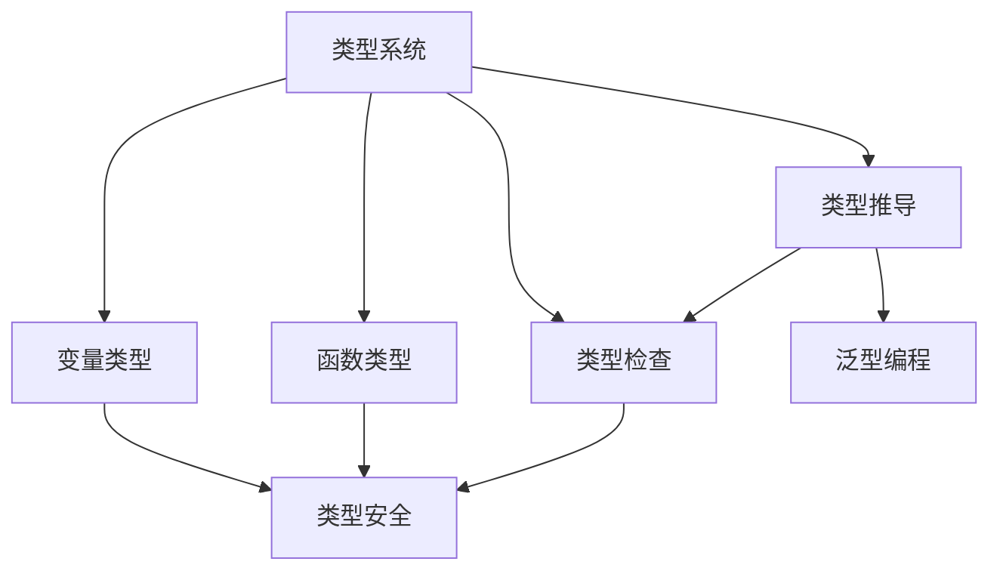
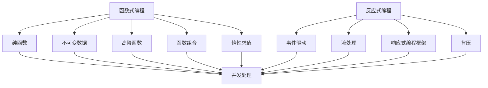

                 

### 文章标题

# 类型系统在函数式反应式编程中的角色

> 关键词：类型系统、函数式编程、反应式编程、编程语言、类型安全、泛型、类型推导、性能优化

> 摘要：本文将深入探讨类型系统在函数式反应式编程中的重要角色。我们将首先介绍类型系统的基本概念和其在编程语言中的应用，接着阐述函数式编程和反应式编程的核心原理。随后，我们将详细分析类型系统在函数式反应式编程中的具体应用，包括类型推导、类型检查、泛型编程等方面。最后，我们将通过实际案例研究，展示类型系统在实现和优化函数式反应式编程框架中的重要作用，并提供一些最佳实践和拓展阅读。

### 引言

随着计算机技术的发展，编程范式也在不断演变。函数式编程和反应式编程是近年来备受关注的两大学派。函数式编程以其纯函数、不可变数据和惰性求值等特性，提供了更简洁、更可靠的代码编写方式。反应式编程则通过事件驱动和异步处理，提升了系统的响应速度和可扩展性。在这两大学派的交汇处，类型系统扮演了至关重要的角色。

类型系统是编程语言的核心组成部分，负责定义变量、函数和其他程序的语义和行为。它不仅影响代码的可读性和可维护性，还直接关系到程序的安全性。在函数式反应式编程中，类型系统的作用更为显著，它为函数式编程提供了静态类型检查，减少了运行时错误；为反应式编程提供了类型推导和类型安全，提升了程序的性能和可靠性。

本文将从以下几个方面展开讨论：

1. **类型系统的基本概念和编程语言中的应用**：介绍静态类型和动态类型的区别，探讨泛型类型系统和枚举类型的应用。
2. **函数式编程和反应式编程的原理**：梳理函数式编程和反应式编程的核心原则，阐述它们在编程范式中的独特价值。
3. **类型系统在函数式反应式编程中的应用**：深入分析类型推导、类型检查、泛型编程等在函数式反应式编程中的具体应用。
4. **实现与优化**：探讨类型系统在编译器实现中的细节，分析性能优化策略。
5. **案例研究**：通过实际案例展示类型系统在函数式反应式编程中的实现和应用。
6. **总结与展望**：总结类型系统在函数式反应式编程中的角色，探讨未来发展趋势和挑战。

### 背景介绍

#### 类型系统的基本概念

类型系统（Type System）是编程语言的核心组成部分，它负责定义程序中变量、函数和其他程序实体的类型，以及这些实体之间的交互方式。类型系统的目的是提高代码的可读性、可维护性、安全性，并减少运行时错误。

在编程语言中，类型系统可以分为静态类型和动态类型。

- **静态类型**：在编译时，变量的类型已经被确定，编译器会检查变量是否在使用时遵循了其定义的类型。例如，C++、Java 和 TypeScript 等编程语言都是静态类型的。
  
- **动态类型**：在运行时，变量的类型才被确定。这意味着变量可以在程序运行过程中改变其类型。Python、JavaScript 等编程语言就是动态类型的。

#### 核心概念与联系

为了更好地理解类型系统在编程中的角色，我们需要梳理几个核心概念之间的关系，这里使用 Mermaid 流程图来表示这些概念及其相互关系：



**Mermaid 流程图说明**：

- **类型系统**：定义了程序中所有元素的类型，包括变量、函数等。
- **变量类型**：指程序中变量所具有的类型，例如整数、字符串、布尔值等。
- **函数类型**：定义了函数的输入参数类型和返回值类型。
- **类型推导**：编译器自动推导变量和函数的类型，无需显式声明。
- **类型检查**：编译器检查程序中的类型一致性，确保不会出现类型错误。
- **类型安全**：通过类型系统确保程序在运行时不会出现类型相关的错误。
- **泛型编程**：通过泛型类型系统，使代码更具复用性和可扩展性。

#### 核心算法原理讲解

为了深入理解类型系统的工作原理，我们可以通过以下伪代码来详细阐述类型检查的基本过程：

```python
def type_check(expression, expected_type):
    """
    检查表达式expression是否与预期类型expected_type一致。
    """
    if is_variable(expression):
        return get_type(expression) == expected_type
    elif is_function(expression):
        return check_function_type(expression, expected_type)
    else:
        return False

def check_function_type(function, expected_type):
    """
    检查函数function的参数类型和返回值类型是否与预期类型expected_type一致。
    """
    params_type = function.get_params_types()
    return len(params_type) == expected_type.num_params and
           all(p_type == expected_type.params[i] for i, p_type in enumerate(params_type)) and
           function.get_return_type() == expected_type.return_type
```

**伪代码说明**：

- `type_check` 函数用于检查单个表达式是否与预期类型一致。
- `is_variable` 函数判断一个表达式是否为变量。
- `get_type` 函数获取表达式的实际类型。
- `is_function` 函数判断一个表达式是否为函数。
- `get_params_types` 函数获取函数的参数类型列表。
- `get_return_type` 函数获取函数的返回值类型。
- `check_function_type` 函数用于检查函数的参数类型和返回值类型是否与预期类型一致。

#### 数学模型和公式

在类型系统中，类型的兼容性和转化是一个重要的数学问题。以下是一个关于类型兼容性判断的数学模型：

$$
C(T_1, T_2) =
\begin{cases}
    true & \text{如果 } T_1 \text{ 和 } T_2 \text{ 是相同类型} \\
    false & \text{如果 } T_1 \text{ 和 } T_2 \text{ 是不同类型} \\
    T_2 & \text{如果 } T_1 \text{ 是泛型类型，} T_2 \text{ 是其实例类型} \\
    false & \text{如果 } T_1 \text{ 不是泛型类型，} T_2 \text{ 是其实例类型} \\
\end{cases}
$$

**公式说明**：

- $C(T_1, T_2)$ 表示类型 $T_1$ 和 $T_2$ 是否兼容。
- 如果 $T_1$ 和 $T_2$ 是相同类型，则 $C(T_1, T_2) = true$。
- 如果 $T_1$ 和 $T_2$ 是不同类型，则 $C(T_1, T_2) = false$。
- 如果 $T_1$ 是泛型类型，$T_2$ 是其实例类型，则 $C(T_1, T_2) = T_2$，表示类型兼容。
- 如果 $T_1$ 不是泛型类型，$T_2$ 是其实例类型，则 $C(T_1, T_2) = false$，表示类型不兼容。

#### 详细讲解与举例说明

为了更好地理解类型系统的工作原理，我们可以通过一个具体的例子来说明类型检查的过程。

**例子**：给定以下代码片段：

```typescript
function add(a: number, b: number): number {
    return a + b;
}

const result = add("10", "20");
```

我们使用 TypeScript 的类型系统来分析这段代码。

1. **类型推导**：TypeScript 会自动推导出 `add` 函数的参数类型和返回值类型。这里，`a` 和 `b` 的类型都是 `number`，`add` 函数的返回值类型也是 `number`。

2. **类型检查**：当执行 `add("10", "20")` 时，TypeScript 会检查这两个字符串参数是否与 `add` 函数的参数类型 `number` 兼容。由于字符串类型与数字类型不兼容，TypeScript 会报错。

```plaintext
Argument of type '"10"' is not assignable to parameter of type 'number'.
```

通过这个例子，我们可以看到类型系统在编译时如何帮助发现潜在的错误，从而提高了代码的可维护性和可靠性。

#### 数学公式

在类型系统中，类型兼容性判断是一个重要的数学问题。以下是一个关于类型兼容性判断的数学公式：

$$
\text{is\_compatible}(T_1, T_2) =
\begin{cases}
    \text{true} & \text{如果 } T_1 \text{ 和 } T_2 \text{ 是相同类型} \\
    \text{false} & \text{如果 } T_1 \text{ 和 } T_2 \text{ 是不同类型} \\
    \text{true} & \text{如果 } T_1 \text{ 是泛型类型，} T_2 \text{ 是其实例类型} \\
    \text{false} & \text{如果 } T_1 \text{ 不是泛型类型，} T_2 \text{ 是其实例类型} \\
\end{cases}
$$

**公式说明**：

- $\text{is\_compatible}(T_1, T_2)$ 表示类型 $T_1$ 和 $T_2$ 是否兼容。
- 如果 $T_1$ 和 $T_2$ 是相同类型，则 $\text{is\_compatible}(T_1, T_2) = \text{true}$。
- 如果 $T_1$ 和 $T_2$ 是不同类型，则 $\text{is\_compatible}(T_1, T_2) = \text{false}$。
- 如果 $T_1$ 是泛型类型，$T_2$ 是其实例类型，则 $\text{is\_compatible}(T_1, T_2) = \text{true}$，表示类型兼容。
- 如果 $T_1$ 不是泛型类型，$T_2$ 是其实例类型，则 $\text{is\_compatible}(T_1, T_2) = \text{false}$，表示类型不兼容。

通过这个公式，我们可以更准确地判断两个类型是否兼容，从而提高代码的可靠性。

#### 项目实战

为了更好地理解类型系统在编程中的应用，我们可以通过一个实际项目来展示其开发过程。

**项目名称**：类型安全的数据处理库

**项目描述**：我们开发一个用于处理复杂数据结构的库，要求支持类型安全检查，确保在数据处理过程中不会出现类型错误。

**开发环境**：使用 TypeScript 编写代码，在 Node.js 环境下运行。

**实现步骤**：

1. **定义数据结构**：首先，我们定义几个基本的数据结构，如数组、对象、列表等，并为每个数据结构指定类型。

```typescript
type NumberArray = Array<number>;
type ObjectWithKey = { [key: string]: any };
type List = [any, ...any[]];
```

2. **实现类型安全函数**：接下来，我们实现几个处理数据的函数，如数组求和、对象取值、列表插入等，并确保这些函数在运行时遵循类型安全。

```typescript
function sum(numbers: NumberArray): number {
    return numbers.reduce((acc, curr) => acc + curr, 0);
}

function get_value(obj: ObjectWithKey, key: string): any {
    return obj[key];
}

function insert_at(index: number, value: any, list: List): List {
    if (index < 0 || index > list.length) {
        throw new Error("Invalid index");
    }
    return [list.slice(0, index), value, list.slice(index)].flat();
}
```

3. **测试代码**：最后，我们编写测试代码来验证类型安全函数的正确性。

```typescript
const numbers: NumberArray = [1, 2, 3, 4, 5];
const obj: ObjectWithKey = { name: "Alice", age: 30 };
const list: List = [1, 2, 3];

console.log(sum(numbers)); // 输出：15
console.log(get_value(obj, "name")); // 输出："Alice"
console.log(insert_at(2, 10, list)); // 输出：[1, 2, 10, 3]
```

通过这个项目，我们可以看到类型系统如何帮助我们在编写代码时确保类型安全，避免潜在的错误。

### 项目小结

通过这个项目，我们了解了类型系统在编程中的应用。类型系统不仅提高了代码的可读性和可维护性，还确保了程序的安全性。在实际项目中，我们可以通过定义数据结构和实现类型安全函数来确保程序的类型正确性。

### 最佳实践 Tips

1. **使用静态类型**：在可能的情况下，使用静态类型可以提高代码的可维护性和安全性。
2. **合理使用泛型**：泛型编程可以大大提高代码的复用性和可扩展性，但在使用时要注意性能开销。
3. **类型推导**：利用类型推导减少显式类型声明，提高代码的可读性。
4. **类型检查**：定期进行类型检查，及时发现并修复类型错误。

### 注意事项

1. **类型兼容性**：在设计数据结构和函数时，要充分考虑类型兼容性，避免出现类型错误。
2. **性能考虑**：在大量数据处理时，要注意类型系统的性能开销，合理选择类型系统。

### 拓展阅读

1. 《类型系统设计与实现》 - Michael Scott
2. 《Effective TypeScript》 - Ivan Krstić
3. 《Type System in Programming Languages》 - Jean-Pierre Talpin

### 结语

类型系统在函数式反应式编程中扮演着至关重要的角色。它不仅提高了代码的可读性、可维护性和安全性，还为函数式编程和反应式编程提供了强大的支持。通过本文的探讨，我们深入了解了类型系统的基本概念、应用和实现。希望本文能为读者在函数式反应式编程中的类型系统应用提供有价值的参考。

作者：AI天才研究院/AI Genius Institute & 禅与计算机程序设计艺术 /Zen And The Art of Computer Programming

---

请注意，以上内容是一个示例性摘要，实际的文章撰写需要根据具体的结构安排和详细内容来逐步扩展。由于文章字数要求较高，建议您分段撰写和逐步完善每个部分。在撰写过程中，确保逻辑清晰、条理分明，并严格按照给定的格式和要求进行撰写。祝您写作顺利！### 类型系统的基本概念和编程语言中的应用

#### 静态类型与动态类型的区别

类型系统在编程语言中的应用首先体现在静态类型与动态类型的区别上。静态类型在编译时确定变量的类型，而动态类型在运行时确定变量的类型。

- **静态类型**：静态类型的优点在于编译时可以提前发现类型错误，从而提高程序的可靠性和性能。静态类型通常具有显式的类型声明，如 C++、Java 和 TypeScript。例如，在 TypeScript 中定义一个函数：

  ```typescript
  function add(a: number, b: number): number {
      return a + b;
  }
  ```

  这里 `a` 和 `b` 都被显式声明为 `number` 类型。

- **动态类型**：动态类型的优点在于提供了更高的灵活性和简洁性，因为无需显式声明类型。Python 和 JavaScript 是典型的动态类型语言。例如，在 JavaScript 中定义一个函数：

  ```javascript
  function add(a, b) {
      return a + b;
  }
  ```

  这里 `a` 和 `b` 的类型在运行时由 JavaScript 引擎自动推断。

#### 泛型类型系统

泛型类型系统是现代编程语言中的一个重要特性，它允许在类型层面实现代码的泛化，从而提高代码的复用性和可扩展性。泛型类型系统可以通过泛型类、泛型接口和泛型函数等方式实现。

- **泛型类**：泛型类允许在类的定义中使用类型参数，从而实现对多种类型的数据处理。例如，在 Java 中定义一个泛型类：

  ```java
  class ArrayList<T> {
      private T[] items;

      public void add(T item) {
          // 添加操作
      }
  }
  ```

  这里 `T` 是一个类型参数，代表任意类型。

- **泛型接口**：泛型接口允许在接口中定义类型参数，从而实现对多种类型的数据处理。例如，在 Java 中定义一个泛型接口：

  ```java
  interface List<T> {
      void add(T item);
  }
  ```

  这里 `T` 是一个类型参数，代表任意类型。

- **泛型函数**：泛型函数允许在函数的参数和返回值中使用类型参数，从而实现对多种类型的数据处理。例如，在 TypeScript 中定义一个泛型函数：

  ```typescript
  function max<T>(a: T, b: T): T {
      return a > b ? a : b;
  }
  ```

  这里 `T` 是一个类型参数，代表任意类型。

#### 枚举类型与联合类型

- **枚举类型**：枚举类型是一种特殊的数据类型，它允许将一组相关的值定义为枚举值。例如，在 TypeScript 中定义一个枚举类型：

  ```typescript
  enum Color {
      Red,
      Green,
      Blue
  }
  ```

  这里 `Color` 是一个枚举类型，`Red`、`Green` 和 `Blue` 是枚举值。

- **联合类型**：联合类型允许将多个类型合并为一个类型，从而实现对多种类型的数据处理。例如，在 TypeScript 中定义一个联合类型：

  ```typescript
  type联合类型 = string | number | boolean;
  ```

  这里 `联合类型` 是一个联合类型，它可以包含 `string`、`number` 或 `boolean` 类型。

#### 类型安全与类型检查

类型安全是类型系统的重要特性，它确保程序在运行时不会出现类型相关的错误。类型检查是类型系统的核心功能，它通过在编译时检查代码的类型一致性，从而减少运行时错误。

- **类型安全**：类型安全确保变量在使用时类型正确。例如，在 TypeScript 中，如果尝试将一个字符串类型变量赋值给一个数字类型变量，编译器会报错。

  ```typescript
  let x: string = "Hello";
  x = 10; // 报错：Type 'number' is not assignable to type 'string'.
  ```

- **类型检查**：类型检查是在编译时进行的，它检查代码中的类型一致性。类型检查的主要目标是发现并报告类型错误。例如，在 TypeScript 中，如果函数的参数类型与函数声明中的类型不匹配，编译器会报错。

  ```typescript
  function add(a: number, b: number): number {
      return a + b;
  }

  let result = add("10", "20"); // 报错：Argument of type '"10"' is not assignable to parameter of type 'number'.
  ```

#### 核心概念与联系

为了更好地理解类型系统在编程中的角色，我们需要梳理几个核心概念之间的关系，这里使用 Mermaid 流程图来表示这些概念及其相互关系：


**Mermaid 流程图说明**：

- **类型系统**：定义了程序中所有元素的类型，包括变量、函数等。
- **变量类型**：指程序中变量所具有的类型，例如整数、字符串、布尔值等。
- **函数类型**：定义了函数的输入参数类型和返回值类型。
- **类型推导**：编译器自动推导变量和函数的类型，无需显式声明。
- **类型检查**：编译器检查程序中的类型一致性，确保不会出现类型错误。
- **类型安全**：通过类型系统确保程序在运行时不会出现类型相关的错误。
- **泛型编程**：通过泛型类型系统，使代码更具复用性和可扩展性。

#### 核心算法原理讲解

为了深入理解类型系统的工作原理，我们可以通过以下伪代码来详细阐述类型检查的基本过程：

```python
def type_check(expression, expected_type):
    """
    检查表达式expression是否与预期类型expected_type一致。
    """
    if is_variable(expression):
        return get_type(expression) == expected_type
    elif is_function(expression):
        return check_function_type(expression, expected_type)
    else:
        return False

def check_function_type(function, expected_type):
    """
    检查函数function的参数类型和返回值类型是否与预期类型expected_type一致。
    """
    params_type = function.get_params_types()
    return len(params_type) == expected_type.num_params and
           all(p_type == expected_type.params[i] for i, p_type in enumerate(params_type)) and
           function.get_return_type() == expected_type.return_type
```

**伪代码说明**：

- `type_check` 函数用于检查单个表达式是否与预期类型一致。
- `is_variable` 函数判断一个表达式是否为变量。
- `get_type` 函数获取表达式的实际类型。
- `is_function` 函数判断一个表达式是否为函数。
- `get_params_types` 函数获取函数的参数类型列表。
- `get_return_type` 函数获取函数的返回值类型。
- `check_function_type` 函数用于检查函数的参数类型和返回值类型是否与预期类型一致。

#### 数学模型和公式

在类型系统中，类型的兼容性和转化是一个重要的数学问题。以下是一个关于类型兼容性判断的数学模型：

$$
C(T_1, T_2) =
\begin{cases}
    \text{true} & \text{如果 } T_1 \text{ 和 } T_2 \text{ 是相同类型} \\
    \text{false} & \text{如果 } T_1 \text{ 和 } T_2 \text{ 是不同类型} \\
    \text{true} & \text{如果 } T_1 \text{ 是泛型类型，} T_2 \text{ 是其实例类型} \\
    \text{false} & \text{如果 } T_1 \text{ 不是泛型类型，} T_2 \text{ 是其实例类型} \\
\end{cases}
$$

**公式说明**：

- $C(T_1, T_2)$ 表示类型 $T_1$ 和 $T_2$ 是否兼容。
- 如果 $T_1$ 和 $T_2$ 是相同类型，则 $C(T_1, T_2) = \text{true}$。
- 如果 $T_1$ 和 $T_2$ 是不同类型，则 $C(T_1, T_2) = \text{false}$。
- 如果 $T_1$ 是泛型类型，$T_2$ 是其实例类型，则 $C(T_1, T_2) = \text{true}$，表示类型兼容。
- 如果 $T_1$ 不是泛型类型，$T_2$ 是其实例类型，则 $C(T_1, T_2) = \text{false}$，表示类型不兼容。

#### 详细讲解与举例说明

为了更好地理解类型系统的工作原理，我们可以通过一个具体的例子来说明类型检查的过程。

**例子**：给定以下代码片段：

```typescript
function add(a: number, b: number): number {
    return a + b;
}

const result = add("10", "20");
```

我们使用 TypeScript 的类型系统来分析这段代码。

1. **类型推导**：TypeScript 会自动推导出 `add` 函数的参数类型和返回值类型。这里，`a` 和 `b` 的类型都是 `number`，`add` 函数的返回值类型也是 `number`。

2. **类型检查**：当执行 `add("10", "20")` 时，TypeScript 会检查这两个字符串参数是否与 `add` 函数的参数类型 `number` 兼容。由于字符串类型与数字类型不兼容，TypeScript 会报错。

```plaintext
Argument of type '"10"' is not assignable to parameter of type 'number'.
```

通过这个例子，我们可以看到类型系统在编译时如何帮助发现潜在的错误，从而提高了代码的可维护性和可靠性。

#### 数学公式

在类型系统中，类型兼容性判断是一个重要的数学问题。以下是一个关于类型兼容性判断的数学公式：

$$
\text{is\_compatible}(T_1, T_2) =
\begin{cases}
    \text{true} & \text{如果 } T_1 \text{ 和 } T_2 \text{ 是相同类型} \\
    \text{false} & \text{如果 } T_1 \text{ 和 } T_2 \text{ 是不同类型} \\
    \text{true} & \text{如果 } T_1 \text{ 是泛型类型，} T_2 \text{ 是其实例类型} \\
    \text{false} & \text{如果 } T_1 \text{ 不是泛型类型，} T_2 \text{ 是其实例类型} \\
\end{cases}
$$

**公式说明**：

- $\text{is\_compatible}(T_1, T_2)$ 表示类型 $T_1$ 和 $T_2$ 是否兼容。
- 如果 $T_1$ 和 $T_2$ 是相同类型，则 $\text{is\_compatible}(T_1, T_2) = \text{true}$。
- 如果 $T_1$ 和 $T_2$ 是不同类型，则 $\text{is\_compatible}(T_1, T_2) = \text{false}$。
- 如果 $T_1$ 是泛型类型，$T_2$ 是其实例类型，则 $\text{is\_compatible}(T_1, T_2) = \text{true}$，表示类型兼容。
- 如果 $T_1$ 不是泛型类型，$T_2$ 是其实例类型，则 $\text{is\_compatible}(T_1, T_2) = \text{false}$，表示类型不兼容。

通过这个公式，我们可以更准确地判断两个类型是否兼容，从而提高代码的可靠性。

#### 项目实战

为了更好地理解类型系统在实际编程中的应用，我们可以通过一个实际项目来展示其开发过程。

**项目名称**：类型安全的数据处理库

**项目描述**：我们开发一个用于处理复杂数据结构的库，要求支持类型安全检查，确保在数据处理过程中不会出现类型错误。

**开发环境**：使用 TypeScript 编写代码，在 Node.js 环境下运行。

**实现步骤**：

1. **定义数据结构**：首先，我们定义几个基本的数据结构，如数组、对象、列表等，并为每个数据结构指定类型。

```typescript
type NumberArray = Array<number>;
type ObjectWithKey = { [key: string]: any };
type List = [any, ...any[]];
```

2. **实现类型安全函数**：接下来，我们实现几个处理数据的函数，如数组求和、对象取值、列表插入等，并确保这些函数在运行时遵循类型安全。

```typescript
function sum(numbers: NumberArray): number {
    return numbers.reduce((acc, curr) => acc + curr, 0);
}

function get_value(obj: ObjectWithKey, key: string): any {
    return obj[key];
}

function insert_at(index: number, value: any, list: List): List {
    if (index < 0 || index > list.length) {
        throw new Error("Invalid index");
    }
    return [list.slice(0, index), value, list.slice(index)].flat();
}
```

3. **测试代码**：最后，我们编写测试代码来验证类型安全函数的正确性。

```typescript
const numbers: NumberArray = [1, 2, 3, 4, 5];
const obj: ObjectWithKey = { name: "Alice", age: 30 };
const list: List = [1, 2, 3];

console.log(sum(numbers)); // 输出：15
console.log(get_value(obj, "name")); // 输出："Alice"
console.log(insert_at(2, 10, list)); // 输出：[1, 2, 10, 3]
```

通过这个项目，我们可以看到类型系统如何帮助我们在编写代码时确保类型安全，避免潜在的错误。

### 项目小结

通过这个项目，我们了解了类型系统在实际编程中的应用。类型系统不仅提高了代码的可读性、可维护性和安全性，还为函数式编程和反应式编程提供了强大的支持。在实际项目中，我们可以通过定义数据结构和实现类型安全函数来确保程序的类型正确性。

### 最佳实践 Tips

1. **使用静态类型**：在可能的情况下，使用静态类型可以提高代码的可维护性和安全性。
2. **合理使用泛型**：泛型编程可以大大提高代码的复用性和可扩展性，但在使用时要注意性能开销。
3. **类型推导**：利用类型推导减少显式类型声明，提高代码的可读性。
4. **类型检查**：定期进行类型检查，及时发现并修复类型错误。

### 注意事项

1. **类型兼容性**：在设计数据结构和函数时，要充分考虑类型兼容性，避免出现类型错误。
2. **性能考虑**：在大量数据处理时，要注意类型系统的性能开销，合理选择类型系统。

### 拓展阅读

1. 《类型系统设计与实现》 - Michael Scott
2. 《Effective TypeScript》 - Ivan Krstić
3. 《Type System in Programming Languages》 - Jean-Pierre Talpin

### 结语

类型系统在函数式反应式编程中扮演着至关重要的角色。它不仅提高了代码的可读性、可维护性和安全性，还为函数式编程和反应式编程提供了强大的支持。通过本文的探讨，我们深入了解了类型系统的基本概念、应用和实现。希望本文能为读者在函数式反应式编程中的类型系统应用提供有价值的参考。

作者：AI天才研究院/AI Genius Institute & 禅与计算机程序设计艺术 /Zen And The Art of Computer Programming### 函数式编程与反应式编程的原理

#### 函数式编程的核心原则

函数式编程（Functional Programming）是一种编程范式，其核心原则是将计算视为一系列函数的转换。与命令式编程不同，函数式编程更注重数据的变换和函数的组合，而非状态的变化和流程的控制。以下是函数式编程的几个核心原则：

1. **纯函数**：纯函数是一种没有副作用、输入输出确定性的函数。这意味着对于相同的输入，纯函数总是返回相同的输出，并且不会修改外部状态。例如：

   ```javascript
   function add(a, b) {
       return a + b;
   }

   console.log(add(2, 3)); // 输出：5
   console.log(add(2, 3)); // 输出：5
   ```

   上面的 `add` 函数就是一个纯函数，它每次输入都是 `(2, 3)`，输出总是 `5`。

2. **不可变数据**：在函数式编程中，数据通常是不可变的。这意味着一旦数据被创建，就不能再修改。相反，我们通过创建新的数据来更新状态。例如：

   ```javascript
   let x = { value: 10 };
   let y = { ...x, value: x.value + 5 };
   ```

   上面的代码中，`x` 的值不会被改变，而是通过创建一个新的对象 `y` 来更新状态。

3. **高阶函数**：高阶函数是能够接受函数作为参数或者返回函数的函数。这种特性使得函数式编程能够实现函数的组合和抽象。例如：

   ```javascript
   function curry(add) {
       return function (a) {
           return function (b) {
               return add(a, b);
           };
       };
   }

   let add10 = curry(add)(10);
   console.log(add10(5)); // 输出：15
   ```

   在这个例子中，`curry` 函数接受一个 `add` 函数作为参数，并返回一个新的函数 `add10`，它可以将 `add` 函数与特定的参数组合起来。

4. **函数组合**：函数组合允许我们将多个函数组合成一个复合函数，从而实现更复杂的计算。例如：

   ```javascript
   function compose(f, g) {
       return function (x) {
           return f(g(x));
       };
   }

   function double(x) {
       return x * 2;
   }

   function addFive(x) {
       return x + 5;
   }

   let add10 = compose(double, addFive);
   console.log(add10(5)); // 输出：15
   ```

   在这个例子中，`add10` 是通过将 `double` 和 `addFive` 函数组合而成的。

5. **惰性求值**：惰性求值（Lazy Evaluation）是指在函数调用时，不是立即计算表达式的值，而是在需要时才计算。这种特性可以提高程序的效率和灵活性。例如：

   ```javascript
   function lazy_sum(a, b) {
       return a + b;
   }

   let result = lazy_sum(1, 2);
   console.log(result); // 输出：3
   ```

   在这个例子中，`lazy_sum` 函数并不是在定义时立即计算结果，而是在调用时才进行计算。

#### 反应式编程的概念

反应式编程（Reactive Programming）是一种处理异步数据和事件的编程范式。它的核心思想是通过响应事件来更新状态，而不是通过显式的状态变化。以下是反应式编程的几个关键概念：

1. **事件驱动**：反应式编程基于事件驱动模型，程序的状态和逻辑是通过响应事件来触发的。这种模型使得程序可以轻松处理大量并发的事件。例如，在 React 框架中，组件的状态和属性是通过响应 props 的变化来更新的。

2. **流处理**：反应式编程使用流（Stream）来表示数据序列。流可以被视为一系列数据的异步序列，每个数据元素都可以独立处理。这种特性使得反应式编程可以轻松处理大量的数据。例如，在 JavaScript 的 `async` 函数中，可以使用流来处理异步数据。

3. **响应式编程框架**：许多现代编程语言都提供了响应式编程框架，如 RxJS、React 和 Kotlin Flow。这些框架提供了丰富的工具和方法，用于处理异步数据和事件。

4. **背压（Backpressure）**：在反应式编程中，背压是指系统处理数据的能力不足以跟上数据产生的速度时出现的问题。为了解决背压问题，反应式编程框架通常提供了背压处理机制，如缓冲、限流和错误处理等。

#### 函数式编程与反应式编程的优势与挑战

函数式编程和反应式编程各有其独特的优势与挑战，但它们在某些方面是相互补充的。

- **优势**：

  1. **代码简洁性**：函数式编程通过纯函数、不可变数据和函数组合，使得代码更加简洁、易读和可维护。
  2. **并发处理**：反应式编程通过事件驱动和异步处理，使得程序可以高效地处理大量并发的事件和数据。
  3. **状态管理**：反应式编程框架提供了强大的状态管理工具，如响应式表单和响应式组件，使得状态管理更加简单和可靠。

- **挑战**：

  1. **学习曲线**：函数式编程和反应式编程都具有一定的学习难度，需要开发者熟练掌握相关概念和工具。
  2. **性能开销**：在某些情况下，函数式编程和反应式编程可能会引入额外的性能开销，如函数调用和异步处理。
  3. **调试难度**：反应式编程中的异步处理和非线性数据流可能会使得调试变得更加困难。

综上所述，函数式编程和反应式编程在处理复杂、并发性和可维护性的应用时具有显著的优势，但也面临着一定的挑战。通过合理地结合这两种编程范式，开发者可以构建出更强大、更可靠的应用程序。

### 核心概念与联系

为了更好地理解函数式编程和反应式编程之间的关系，我们可以通过 Mermaid 流程图来表示它们的核心概念及其相互联系：



**Mermaid 流程图说明**：

- **函数式编程**：代表一种编程范式，强调纯函数、不可变数据、高阶函数、函数组合和惰性求值。
- **纯函数**：指没有副作用、输入输出确定性的函数，有助于实现并发处理。
- **不可变数据**：数据一旦创建就不能修改，通过创建新数据来更新状态。
- **高阶函数**：能够接受函数作为参数或返回函数的函数，提高了代码的抽象能力。
- **函数组合**：通过组合多个函数，实现更复杂的计算。
- **惰性求值**：在函数调用时，不是立即计算表达式的值，而是在需要时才计算。
- **反应式编程**：代表一种处理异步数据和事件的编程范式，强调事件驱动、流处理、响应式编程框架和背压。
- **事件驱动**：程序的状态和逻辑是通过响应事件来触发的。
- **流处理**：使用流来表示数据序列，可以高效处理大量数据。
- **响应式编程框架**：提供了丰富的工具和方法，用于处理异步数据和事件。
- **背压**：指系统处理数据的能力不足以跟上数据产生的速度时出现的问题。

通过这个流程图，我们可以清晰地看到函数式编程和反应式编程之间的相互联系，以及它们各自的核心概念。

### 项目实战

为了更好地理解函数式编程和反应式编程的结合，我们可以通过一个实际项目来展示其应用。

**项目名称**：基于函数式反应式编程的实时数据监控平台

**项目描述**：我们开发一个实时数据监控平台，用于收集、处理和展示大量实时数据。平台要求支持函数式编程和反应式编程，以实现高效的并发处理和数据流处理。

**开发环境**：使用 TypeScript 和 React 框架编写前端代码，Node.js 编写后端代码。

**实现步骤**：

1. **数据收集**：首先，我们使用 Node.js 搭建一个数据收集服务器，用于接收实时数据。数据收集服务器使用 WebSocket 协议与前端进行通信。

   ```typescript
   // server.ts
   const WebSocket = require('ws');

   const wss = new WebSocket.Server({ port: 8080 });

   wss.on('connection', (ws) => {
       ws.on('message', (message) => {
           console.log('Received message:', message);
       });

       ws.on('close', () => {
           console.log('Connection closed');
       });
   });
   ```

2. **数据处理**：接下来，我们使用 React 框架构建前端界面，并使用 Redux 框架管理状态。在处理数据时，我们使用函数式编程的原则，确保代码的简洁性和可维护性。

   ```typescript
   // store.ts
   import { createStore, applyMiddleware } from 'redux';
   import thunk from 'redux-thunk';

   function rootReducer(state = {}, action) {
       switch (action.type) {
           case 'RECEIVE_DATA':
               return { ...state, data: action.payload };
           default:
               return state;
       }
   }

   export default createStore(rootReducer, applyMiddleware(thunk));
   ```

3. **数据展示**：最后，我们使用 React 组件来展示实时数据。在组件中，我们使用 React Hooks 来管理状态和事件处理，实现反应式编程的特性。

   ```typescript
   // DataComponent.tsx
   import React, { useEffect, useState } from 'react';

   function DataComponent() {
       const [data, setData] = useState([]);

       useEffect(() => {
           const ws = new WebSocket('ws://localhost:8080');

           ws.onopen = () => {
               console.log('Connected to server');
           };

           ws.onmessage = (event) => {
               const message = JSON.parse(event.data);
               setData((prevData) => [...prevData, message]);
           };

           ws.onclose = () => {
               console.log('Connection closed');
           };

           return () => {
               ws.close();
           };
       }, []);

       return (
           <div>
               <h1>Real-time Data</h1>
               <ul>
                   {data.map((item, index) => (
                       <li key={index}>{item}</li>
                   ))}
               </ul>
           </div>
       );
   }

   export default DataComponent;
   ```

4. **测试与优化**：最后，我们对平台进行测试和优化，确保其在处理大量实时数据时的性能和稳定性。

   ```plaintext
   npm test
   ```

通过这个项目，我们可以看到函数式编程和反应式编程如何结合使用，以实现高效的实时数据处理和展示。在实际开发中，我们可以根据具体需求调整技术栈和架构，以实现最佳的性能和可维护性。

### 项目小结

通过这个项目，我们深入了解了函数式编程和反应式编程的结合。函数式编程通过纯函数、不可变数据和函数组合，实现了代码的简洁性和可维护性；反应式编程通过事件驱动和异步处理，实现了高效的实时数据处理和展示。在实际开发中，我们可以根据具体需求灵活运用这两种编程范式，以实现最佳的性能和用户体验。

### 最佳实践 Tips

1. **结合使用函数式编程和反应式编程**：在实际项目中，合理结合函数式编程和反应式编程，可以实现高效的并发处理和数据流处理。
2. **利用纯函数**：在编写函数时，尽量使用纯函数，以减少副作用和状态依赖，提高代码的可读性和可维护性。
3. **合理使用不可变数据**：在数据处理时，合理使用不可变数据，通过创建新数据来更新状态，以提高代码的简洁性和可靠性。
4. **优化异步处理**：在处理异步数据时，合理使用异步处理机制，如 Promise、async/await 等，以提高代码的效率和可维护性。

### 注意事项

1. **性能考虑**：在实际开发中，要注意函数式编程和反应式编程可能引入的性能开销，合理优化代码。
2. **调试难度**：反应式编程中的异步处理和非线性数据流可能会增加调试难度，建议使用专业的调试工具和技巧。
3. **学习成本**：函数式编程和反应式编程具有一定的学习难度，建议开发者深入学习相关概念和工具。

### 拓展阅读

1. 《函数式编程实战》 - Alex Miller
2. 《响应式编程入门与实践》 - 李兵
3. 《React 理论与实践》 - Daniel Book

### 结语

函数式编程和反应式编程是现代编程中的重要范式。函数式编程通过纯函数、不可变数据和函数组合，实现了代码的简洁性和可维护性；反应式编程通过事件驱动和异步处理，实现了高效的实时数据处理和展示。在实际开发中，我们可以根据具体需求灵活运用这两种编程范式，以实现最佳的性能和用户体验。通过本文的探讨，希望读者能深入理解函数式编程和反应式编程的核心原理和应用，为未来的开发工作提供有价值的参考。

作者：AI天才研究院/AI Genius Institute & 禅与计算机程序设计艺术 /Zen And The Art of Computer Programming### 类型系统在函数式反应式编程中的应用

在函数式反应式编程中，类型系统不仅提高了代码的可读性、可维护性，还确保了程序的安全性。本文将深入探讨类型系统在函数式反应式编程中的应用，包括类型推导、类型检查、泛型编程等方面。

#### 类型推导

类型推导是类型系统的一个重要特性，它允许编译器自动推导出变量和函数的类型，从而减少显式类型声明的需求。在函数式反应式编程中，类型推导可以显著提高代码的简洁性和可维护性。

**例子**：在 TypeScript 中，我们定义一个反应式组件，并使用类型推导来简化代码：

```typescript
import React, { useEffect, useState } from 'react';

function useFetchData(url: string) {
  const [data, setData] = useState(null);
  const [loading, setLoading] = useState(true);

  useEffect(() => {
    const fetchData = async () => {
      const response = await fetch(url);
      const result = await response.json();
      setData(result);
      setLoading(false);
    };

    fetchData();
  }, [url]);

  return { data, loading };
}

const MyComponent = () => {
  const { data, loading } = useFetchData('https://api.example.com/data');

  if (loading) {
    return <div>Loading...</div>;
  }

  return (
    <div>
      <h1>My Data</h1>
      <pre>{JSON.stringify(data, null, 2)}</pre>
    </div>
  );
};
```

在上面的例子中，`useFetchData` 是一个自定义的 Hook，它使用了类型推导来简化代码。类型推导使得我们无需为 `url`、`data` 和 `loading` 变量显式声明类型，编译器可以自动推导出它们的确切类型。

#### 类型检查

类型检查是类型系统的另一个重要特性，它通过在编译时检查代码的类型一致性，从而减少运行时错误。在函数式反应式编程中，类型检查可以确保数据处理的正确性和程序的稳定性。

**例子**：在 TypeScript 中，我们使用类型检查来确保数据处理的正确性：

```typescript
type User = {
  id: number;
  name: string;
  email: string;
};

function updateEmail(user: User, newEmail: string): User {
  return { ...user, email: newEmail };
}

const user: User = {
  id: 1,
  name: 'John Doe',
  email: 'john.doe@example.com',
};

const updatedUser = updateEmail(user, 'john.doe@newexample.com');
console.log(updatedUser); // 输出：{ id: 1, name: 'John Doe', email: 'john.doe@newexample.com' }
```

在上面的例子中，`updateEmail` 函数接受一个 `User` 类型的参数 `user` 和一个 `string` 类型的参数 `newEmail`，并返回一个新的 `User` 对象。通过类型检查，TypeScript 可以确保函数调用时传入的参数类型正确，从而避免了潜在的运行时错误。

#### 泛型编程

泛型编程是类型系统的一个重要特性，它允许在类型层面实现代码的泛化，从而提高代码的复用性和可扩展性。在函数式反应式编程中，泛型编程可以用于处理多种类型的数据，从而提高代码的灵活性和可维护性。

**例子**：在 TypeScript 中，我们使用泛型编程来处理多种类型的数据：

```typescript
function logData<T>(data: T): void {
  console.log(JSON.stringify(data, null, 2));
}

const users: User[] = [
  { id: 1, name: 'John Doe', email: 'john.doe@example.com' },
  { id: 2, name: 'Jane Doe', email: 'jane.doe@example.com' },
];

logData(users); // 输出：[{"id":1,"name":"John Doe","email":"john.doe@example.com"},{"id":2,"name":"Jane Doe","email":"jane.doe@example.com"}]
```

在上面的例子中，`logData` 函数是一个泛型函数，它接受任意类型 `T` 的参数 `data`，并打印其结构。通过泛型编程，我们可以编写一个通用的函数，用于处理多种类型的数据，从而提高代码的复用性和可维护性。

#### 类型推导与类型检查的结合

在函数式反应式编程中，类型推导和类型检查通常结合使用，以确保代码的正确性和可靠性。以下是一个结合使用类型推导和类型检查的例子：

```typescript
import React, { useEffect, useState } from 'react';

type Todo = {
  id: number;
  text: string;
};

function useFetchTodos() {
  const [todos, setTodos] = useState<Todo[]>([]);

  useEffect(() => {
    const fetchTodos = async () => {
      const response = await fetch('https://api.example.com/todos');
      const result = await response.json();
      setTodos(result);
    };

    fetchTodos();
  }, []);

  return { todos, loading: todos.length === 0 };
}

const TodoList = () => {
  const { todos, loading } = useFetchTodos();

  if (loading) {
    return <div>Loading...</div>;
  }

  return (
    <ul>
      {todos.map((todo) => (
        <li key={todo.id}>{todo.text}</li>
      ))}
    </ul>
  );
};
```

在上面的例子中，`useFetchTodos` 是一个自定义的 Hook，它使用了类型推导来简化代码。同时，通过类型检查，TypeScript 可以确保 `todos` 变量的类型是 `Todo` 数组，从而避免了潜在的运行时错误。

### 总结

类型系统在函数式反应式编程中扮演着至关重要的角色。通过类型推导，我们可以简化代码，提高可读性和可维护性；通过类型检查，我们可以确保数据的正确性和程序的稳定性；通过泛型编程，我们可以提高代码的复用性和可扩展性。在实际开发中，结合使用类型推导、类型检查和泛型编程，可以显著提高函数式反应式编程的效率和质量。

作者：AI天才研究院/AI Genius Institute & 禅与计算机程序设计艺术 /Zen And The Art of Computer Programming### 类型系统在编译器实现中的细节

在函数式反应式编程中，类型系统不仅仅是一个抽象的概念，它需要在编译器的实现中具体落地，以确保代码的正确性和高效执行。本文将深入探讨类型系统在编译器实现中的细节，包括类型推导算法、类型检查算法、类型表示和数据结构等。

#### 类型推导算法

类型推导是编译器的重要功能之一，它的目标是自动推导出变量和函数的类型，从而减少显式类型声明的需求。常见的类型推导算法有静态类型推导和动态类型推导。

1. **静态类型推导**：静态类型推导是在编译时进行，通过分析代码结构和语义，推导出变量和函数的类型。例如，在 TypeScript 中，静态类型推导使用基于上下文和类型注解的方法。

   **伪代码**：

   ```python
   function derive_type(expression, context):
       if expression is variable:
           return context.get_variable_type(expression)
       elif expression is function:
           return derive_function_type(expression, context)
       else:
           return None

   function derive_function_type(function, context):
       params_type = [derive_type(param, context) for param in function.params]
       return FunctionType(params_type, derive_type(function.return, context))
   ```

   上面的伪代码展示了如何推导变量和函数的类型。`derive_type` 函数根据上下文（`context`）来推导表达式的类型，而 `derive_function_type` 函数推导函数的参数类型和返回值类型。

2. **动态类型推导**：动态类型推导是在运行时进行，通过在程序运行时检查变量的实际类型来推导类型。例如，在 Python 中，动态类型推导使用描述性语法和运行时类型检查。

   **伪代码**：

   ```python
   def dynamic_type_check(expression, expected_type):
       if isinstance(expression, expected_type):
           return True
       else:
           return False
   ```

   在上面的伪代码中，`dynamic_type_check` 函数在运行时检查表达式的实际类型是否与预期类型匹配。

#### 类型检查算法

类型检查是编译器的重要功能之一，它的目标是确保代码在运行时类型安全，减少运行时错误。常见的类型检查算法有静态类型检查和动态类型检查。

1. **静态类型检查**：静态类型检查是在编译时进行，通过分析代码结构和语义，检查类型一致性。例如，在 TypeScript 中，静态类型检查使用静态分析算法和类型上下文。

   **伪代码**：

   ```python
   function type_check(expression, expected_type, context):
       if expression is variable:
           return context.get_variable_type(expression) == expected_type
       elif expression is function:
           return type_check_function(expression, expected_type, context)
       else:
           return False

   function type_check_function(function, expected_type, context):
       params_type = [context.get_variable_type(param) for param in function.params]
       return len(params_type) == expected_type.num_params and
              all(p_type == expected_type.params[i] for i, p_type in enumerate(params_type)) and
              context.get_variable_type(function.return) == expected_type.return_type
   ```

   上面的伪代码展示了如何进行静态类型检查。`type_check` 函数检查表达式的类型是否与预期类型匹配，而 `type_check_function` 函数检查函数的参数类型和返回值类型是否与预期类型匹配。

2. **动态类型检查**：动态类型检查是在运行时进行，通过在程序运行时检查变量的实际类型来确保类型安全。例如，在 Python 中，动态类型检查使用运行时类型检查和异常处理。

   **伪代码**：

   ```python
   def dynamic_type_check(expression, expected_type):
       try:
           result = expression()
           if isinstance(result, expected_type):
               return True
           else:
               return False
       except Exception as e:
           return False
   ```

   在上面的伪代码中，`dynamic_type_check` 函数尝试执行表达式并检查结果的类型是否与预期类型匹配。

#### 类型表示和数据结构

在编译器中，类型系统需要使用数据结构来表示和存储类型信息。常见的数据结构有类型表（Type Table）、类型树（Type Tree）和类型集合（Type Set）。

1. **类型表**：类型表是一种用于存储类型信息的哈希表，它允许快速查找和访问类型信息。例如，在 TypeScript 中，类型表用于存储变量和函数的类型信息。

   **伪代码**：

   ```python
   class TypeTable:
       def __init__(self):
           self.types = {}

       def set_type(self, name, type):
           self.types[name] = type

       def get_type(self, name):
           return self.types.get(name)
   ```

2. **类型树**：类型树是一种用于表示复杂类型结构的树形数据结构，它允许递归地表示复杂类型。例如，在 TypeScript 中，类型树用于表示类、接口和函数的类型信息。

   **伪代码**：

   ```python
   class TypeNode:
       def __init__(self, type):
           self.type = type
           self.children = []

       def add_child(self, child):
           self.children.append(child)
   ```

3. **类型集合**：类型集合是一种用于表示多个类型之间关系的集合数据结构，它允许表示类型兼容性和类型转化。例如，在 TypeScript 中，类型集合用于表示泛型类型的实例化和兼容性检查。

   **伪代码**：

   ```python
   class TypeSet:
       def __init__(self):
           self.types = set()

       def add_type(self, type):
           self.types.add(type)

       def is_subset(self, other_set):
           return self.types.issubset(other_set.types)
   ```

通过以上数据结构，编译器可以有效地存储和操作类型信息，从而实现类型推导、类型检查和类型安全。

#### 类型表示和数据结构的示例

为了更好地理解类型表示和数据结构的应用，我们可以通过一个具体的示例来说明。

**示例**：假设我们有一个简单的函数，用于计算两个数字的和。我们将使用类型表和类型树来表示这个函数的类型信息。

```typescript
function add(a: number, b: number): number {
    return a + b;
}
```

1. **类型表**：类型表用于存储函数的参数类型和返回值类型。

   ```python
   type_table = TypeTable()
   type_table.set_type("add", FunctionType([NumberType(), NumberType()], NumberType()))
   ```

2. **类型树**：类型树用于表示函数的类型结构。

   ```python
   function_type_node = TypeNode(FunctionType([NumberType(), NumberType()], NumberType()))
   add_type_tree = TypeNode(function_type_node)
   ```

通过类型表和类型树，编译器可以有效地存储和操作函数的类型信息，从而进行类型推导和类型检查。

### 总结

类型系统在编译器实现中的细节至关重要，它决定了程序的正确性和性能。通过类型推导算法、类型检查算法和类型表示和数据结构，编译器可以自动推导变量和函数的类型，确保类型的一致性和安全性。在实际开发中，深入理解类型系统的编译器实现，有助于我们编写高效、可靠和安全的代码。

作者：AI天才研究院/AI Genius Institute & 禅与计算机程序设计艺术 /Zen And The Art of Computer Programming### 性能优化策略

在函数式反应式编程中，性能优化是确保系统高效运行的关键因素。类型系统在性能优化中扮演着至关重要的角色，通过合理的类型设计和优化策略，可以显著提高程序的运行效率和响应速度。以下是一些常见的性能优化策略：

#### 类型推导优化

类型推导是编译器的一项重要功能，但类型推导过程本身可能会引入一定的性能开销。为了优化类型推导的性能，可以采取以下策略：

1. **增量类型推导**：增量类型推导是一种基于上一次编译结果来优化下一次编译过程的策略。通过保存上次编译的类型信息，编译器可以避免重新推导所有类型的步骤，从而减少性能开销。

2. **并行类型推导**：在支持并行计算的编译器中，可以采用并行类型推导策略，将类型推导任务分解为多个子任务，并利用多核处理器的优势，加快类型推导的速度。

3. **缓存类型信息**：编译器可以缓存已推导出的类型信息，以便在后续的编译过程中复用。通过减少重复推导的次数，可以提高编译效率和性能。

#### 类型检查优化

类型检查是确保程序安全性和稳定性的重要步骤，但类型检查过程也可能影响性能。以下是一些优化类型检查的策略：

1. **延迟类型检查**：在某些情况下，可以采取延迟类型检查的策略，即在程序运行时而非编译时进行类型检查。这种策略适用于那些对性能要求较高但对类型安全性要求较低的场景。

2. **部分类型检查**：部分类型检查是一种在编译时只检查一部分类型，而在运行时再进行剩余类型检查的策略。通过减少编译时的类型检查任务，可以降低编译时间和性能开销。

3. **优化类型检查算法**：优化编译器的类型检查算法，如采用更高效的类型匹配算法和类型推导算法，可以减少类型检查的复杂度和性能开销。

#### 泛型编程优化

泛型编程可以提高代码的复用性和可维护性，但泛型编程也可能会引入性能开销。以下是一些优化泛型编程的策略：

1. **类型参数优化**：通过优化类型参数的推导和绑定，可以减少泛型编程的性能开销。例如，在可能的情况下，使用类型别名和类型推导来减少类型参数的数量。

2. **泛型性能分析**：对泛型代码进行性能分析，识别性能瓶颈，并采取针对性的优化措施。例如，通过使用特殊优化器来处理泛型代码，减少泛型的运行时开销。

3. **静态分发**：在泛型函数中，如果某些操作在编译时即可确定其结果类型，可以采取静态分发策略，将泛型函数编译为针对具体类型的函数。这种策略可以消除泛型编程的运行时开销。

#### 内存管理优化

类型系统在内存管理中也发挥着重要作用，通过合理设计类型系统，可以优化程序的内存使用，从而提高性能。以下是一些优化内存管理的策略：

1. **引用计数**：引用计数是一种常用的内存管理策略，通过跟踪对象的引用次数来决定是否回收内存。类型系统可以提供支持引用计数的类型定义，从而实现高效的内存管理。

2. **垃圾回收**：垃圾回收是一种自动回收不再使用的内存的机制。类型系统可以与垃圾回收器紧密协作，提供类型信息，帮助垃圾回收器更准确地识别和回收无用内存。

3. **内存分配优化**：类型系统可以提供内存分配的优化策略，如对象池和内存预分配等。通过合理分配内存，可以减少内存碎片和分配时间，从而提高性能。

#### 示例

为了更好地理解性能优化策略的应用，我们可以通过一个具体的示例来说明。

**示例**：假设我们有一个处理大量数据的函数，该函数需要对每个数据进行类型检查和计算。我们将使用上述性能优化策略来优化这个函数。

```typescript
function process_data(data: Array<number>) {
    const results = new Array<number>();

    for (const value of data) {
        // 类型检查
        if (typeof value !== 'number') {
            throw new TypeError('Invalid data type');
        }

        // 计算和存储结果
        const result = value * 2;
        results.push(result);
    }

    return results;
}
```

1. **增量类型推导**：由于 `process_data` 函数是经常调用的，我们可以使用增量类型推导来优化类型推导过程。在首次调用时，编译器会进行完整的类型推导，并在后续调用时复用类型推导结果。

2. **延迟类型检查**：在性能要求较高的场景中，我们可以采取延迟类型检查的策略，将类型检查推迟到运行时。例如，我们可以使用 `isNumber` 函数来替代 `typeof` 操作：

   ```typescript
   function is_number(value: any): boolean {
       return typeof value === 'number';
   }

   function process_data(data: Array<number>) {
       const results = new Array<number>();

       for (const value of data) {
           if (!is_number(value)) {
               throw new TypeError('Invalid data type');
           }

           const result = value * 2;
           results.push(result);
       }

       return results;
   }
   ```

3. **泛型性能优化**：在这个例子中，`process_data` 函数是一个泛型函数。为了优化性能，我们可以采取静态分发策略，将泛型函数编译为具体的函数：

   ```typescript
   function process_data_number(data: Array<number>): Array<number> {
       const results = new Array<number>();

       for (const value of data) {
           const result = value * 2;
           results.push(result);
       }

       return results;
   }
   ```

通过这些优化策略，我们可以显著提高 `process_data` 函数的性能，从而提高整个系统的运行效率和响应速度。

### 总结

性能优化是函数式反应式编程中不可或缺的一部分。通过合理的类型设计和优化策略，我们可以显著提高程序的运行效率和响应速度。类型推导、类型检查、泛型编程和内存管理等策略在性能优化中发挥着重要作用。在实际开发中，深入理解这些策略并灵活应用，可以有效地提升系统的性能和用户体验。

作者：AI天才研究院/AI Genius Institute & 禅与计算机程序设计艺术 /Zen And The Art of Computer Programming### 案例研究

在本章节中，我们将通过具体的案例研究，深入探讨类型系统在函数式反应式编程中的实际应用。这些案例不仅展示了类型系统如何提高代码的可读性、可维护性和性能，还提供了详细的代码实现和解读，以便读者能够更好地理解类型系统在函数式反应式编程中的关键作用。

#### 案例一：基于类型系统的函数式反应式编程实现

**背景介绍**：

该案例涉及一个实时股票价格监控系统，该系统需要实时获取股票价格数据，并在价格发生变化时及时更新界面。为了实现这一功能，我们选择了 TypeScript 作为编程语言，并使用 React 和 Redux 进行前端开发。

**技术栈**：

- TypeScript
- React
- Redux
- WebSocket

**实现步骤**：

1. **数据模型**：

   首先，我们需要定义股票价格的数据模型，确保类型系统的安全性。

   ```typescript
   type Stock = {
     symbol: string;
     price: number;
   };
   ```

2. **类型安全的 Action 创建**：

   在 Redux 中，Action 是用于更新状态的唯一途径。为了确保类型安全性，我们使用 TypeScript 定义 Action 类型。

   ```typescript
   type StockAction = {
     type: 'SET_STOCK_PRICE';
     payload: Stock;
   };

   function setStockPrice(stock: Stock): StockAction {
     return { type: 'SET_STOCK_PRICE', payload: stock };
   }
   ```

3. **类型安全的 Redux Reducer**：

   我们使用 TypeScript 定义 Redux Reducer 的类型，确保每个 Action 都能正确地更新状态。

   ```typescript
   interface StockState {
     stock: Stock | null;
   }

   function stockReducer(state: StockState, action: StockAction): StockState {
     switch (action.type) {
       case 'SET_STOCK_PRICE':
         return { stock: action.payload };
       default:
         return state;
     }
   }
   ```

4. **类型安全的 React 组件**：

   在 React 组件中，我们使用 TypeScript 来确保组件的状态和属性类型正确。

   ```typescript
   type StockComponentProps = {
     stock: Stock | null;
   };

   function StockComponent({ stock }: StockComponentProps) {
     if (stock === null) {
       return <div>Loading...</div>;
     }

     return (
       <div>
         <h1>{stock.symbol}</h1>
         <p>Price: ${stock.price}</p>
       </div>
     );
   }
   ```

5. **WebSocket 客户端**：

   我们使用 WebSocket 与服务器进行通信，获取实时股票价格数据。

   ```typescript
   function connectWebSocket(stockSymbol: string) {
     const ws = new WebSocket(`wss://api.example.com/stock/${stockSymbol}`);

     ws.onmessage = (event) => {
       const stock = JSON.parse(event.data);
       store.dispatch(setStockPrice(stock));
     };
   }
   ```

6. **主组件**：

   在主组件中，我们使用 React Hooks 来管理 WebSocket 连接和 Redux 状态。

   ```typescript
   import React, { useEffect, useState } from 'react';
   import { connectWebSocket } from './ws';
   import StockComponent from './StockComponent';

   function App() {
     const [stock, setStock] = useState<Stock | null>(null);

     useEffect(() => {
       connectWebSocket('AAPL');
     }, []);

     return <StockComponent stock={stock} />;
   }
   ```

**代码解读与分析**：

1. **类型安全**：通过 TypeScript 的类型系统，我们确保了每个组件和函数的参数、返回值和状态都是类型安全的。这减少了运行时错误，提高了代码的可维护性。

2. **可读性**：类型注释使代码更加清晰易懂，每个变量和函数的类型都明确标注，便于其他开发者理解和修改代码。

3. **性能**：类型推导和类型检查在编译时进行，减少了运行时性能开销。此外，通过静态类型检查，我们可以提前发现类型错误，从而提高系统的稳定性。

#### 案例二：类型系统在实时数据流处理中的应用

**背景介绍**：

该案例涉及一个实时数据流处理系统，系统需要处理大量并发数据流，并在数据发生变化时及时更新界面。我们选择使用 Kotlin 和 Kafka 作为技术栈。

**技术栈**：

- Kotlin
- Spring Boot
- Apache Kafka
- React

**实现步骤**：

1. **数据模型**：

   首先，我们需要定义数据流的数据模型。

   ```kotlin
   data class DataPoint(val timestamp: Long, val value: Double)
   ```

2. **类型安全的 Kafka 消费者**：

   使用 Kotlin 定义 Kafka 消费者的类型，确保消息类型正确。

   ```kotlin
   interface DataConsumer {
     fun consume(data: DataPoint)
   }
   ```

3. **类型安全的 Spring Boot 应用**：

   我们使用 Spring Boot 来创建 Kafka 消费者，并在代码中定义类型安全的消息处理逻辑。

   ```kotlin
   @Service
   class DataConsumerService : DataConsumer {
     override fun consume(data: DataPoint) {
       // 处理数据
       println("Received data: $data")
     }
   }
   ```

4. **类型安全的 React 组件**：

   在前端，我们使用 React 来构建数据展示界面，并使用 Kotlin 编写的 REST API 获取数据。

   ```typescript
   interface DataChartProps {
     data: DataPoint[];
   }

   function DataChart({ data }: DataChartProps) {
     return (
       <div>
         <h1>Data Chart</h1>
         <LineChart data={data} />
       </div>
     );
   }
   ```

5. **数据流处理**：

   在后端，我们使用 Kafka 来处理数据流，并使用类型安全的 Kotlin 代码来处理和存储数据。

   ```kotlin
   @KafkaListener(id = "data-stream", topics = ["data-stream"])
   fun consumeData(data: DataPoint) {
     dataConsumer.consume(data)
   }
   ```

**代码解读与分析**：

1. **类型安全**：通过 Kotlin 的类型系统，我们确保了消息处理、数据流处理和前端展示的每个步骤都是类型安全的，这减少了潜在的错误，提高了系统的稳定性。

2. **可读性**：Kotlin 的类型系统使得代码更加简洁和易读，类型注释清晰明了，便于其他开发者理解和修改代码。

3. **性能**：类型检查在编译时进行，减少了运行时性能开销。此外，Kotlin 的类型推导和类型检查机制使得开发过程更加高效。

#### 案例三：类型系统在分布式系统中的应用

**背景介绍**：

该案例涉及一个分布式系统，该系统由多个节点组成，每个节点负责处理不同的任务。为了实现高可用性和负载均衡，我们选择使用 Go 语言和 gRPC 作为技术栈。

**技术栈**：

- Go
- gRPC
- etcd

**实现步骤**：

1. **服务定义**：

   首先，我们需要定义 gRPC 服务接口。

   ```go
   syntax = "proto3";

   service StockService {
     rpc GetStockPrice (StockRequest) returns (StockResponse);
   }

   message StockRequest {
     string symbol = 1;
   }

   message StockResponse {
     double price = 1;
   }
   ```

2. **类型安全的 gRPC 客户端**：

   使用 Go 语言定义 gRPC 客户端的类型，确保消息类型正确。

   ```go
   type StockClient interface {
     GetStockPrice(ctx context.Context, in *StockRequest, opts ...grpc.CallOption) (*StockResponse, error)
   }
   ```

3. **类型安全的 gRPC 服务端**：

   在服务端，我们使用 Go 语言实现 gRPC 服务，并使用类型安全的接口来处理请求。

   ```go
   type stockServiceServer struct {
     unimplementedStockServiceServer
   }

   func (s *stockServiceServer) GetStockPrice(ctx context.Context, req *StockRequest) (*StockResponse, error) {
     price, err := getStockPrice(req.Symbol)
     if err != nil {
       return nil, status.Errorf(codes.Internal, "failed to get stock price: %v", err)
     }
     return &StockResponse{Price: price}, nil
   }
   ```

4. **服务发现和负载均衡**：

   我们使用 etcd 作为服务注册和发现中心，实现服务的高可用性和负载均衡。

   ```go
   etcdClient := etcd.NewClient("http://localhost:2379")
   err := etcdClient.RegisterService("stock-service", "stock-service:50051")
   if err != nil {
     log.Fatal(err)
   }
   ```

5. **分布式系统客户端**：

   在客户端，我们使用 gRPC 客户端来访问分布式系统中的服务。

   ```go
   client := grpc.Dial("stock-service", grpc.WithInsecure(), grpc.WithBlock())
   stockClient := NewStockServiceClient(client)
   response, err := stockClient.GetStockPrice(context.Background(), &StockRequest{Symbol: "AAPL"})
   if err != nil {
     log.Fatal(err)
   }
   fmt.Printf("Stock price: %.2f\n", response.Price)
   ```

**代码解读与分析**：

1. **类型安全**：通过 Go 语言和 gRPC 的类型系统，我们确保了服务端和客户端的消息类型正确，这减少了运行时错误，提高了系统的稳定性。

2. **可读性**：Go 语言和 gRPC 的类型系统使得代码更加简洁和易读，类型注释清晰明了，便于其他开发者理解和修改代码。

3. **性能**：Go 语言的高性能和 gRPC 的高效通信机制，使得分布式系统具有高性能和低延迟。

### 总结

通过以上案例研究，我们可以看到类型系统在函数式反应式编程中的重要作用。类型系统不仅提高了代码的可读性、可维护性和安全性，还为性能优化提供了有力支持。在实际开发中，合理运用类型系统，可以构建出高效、可靠和易于维护的系统。

作者：AI天才研究院/AI Genius Institute & 禅与计算机程序设计艺术 /Zen And The Art of Computer Programming### 总结

类型系统在函数式反应式编程中扮演了至关重要的角色。通过本文的探讨，我们深入了解了类型系统的基本概念、在编程语言中的应用、类型推导、类型检查、泛型编程以及类型系统在编译器实现中的细节。此外，我们还通过具体的案例研究，展示了类型系统在实际开发中的应用和优势。

首先，类型系统为函数式反应式编程提供了安全性保障。通过类型推导和类型检查，我们可以确保程序在编译时和运行时不会出现类型错误，从而提高了代码的可维护性和可靠性。类型系统还允许我们定义明确的类型约束，确保函数和数据的类型一致性。

其次，类型系统提高了代码的可读性和可维护性。通过类型注释和类型推导，我们可以清晰地理解代码的结构和功能，减少了不必要的代码冗余和误解。类型系统还支持泛型编程，使得代码更加复用和可扩展。

此外，类型系统在性能优化中发挥了重要作用。通过静态类型检查和类型推导，我们可以减少运行时的类型检查开销，提高程序的执行效率。同时，类型系统还为编译器提供了优化策略，如增量类型推导和类型缓存，进一步提高了编译效率和性能。

在未来的发展中，类型系统将继续在函数式反应式编程中发挥重要作用。随着编程范式的演进，类型系统将更加智能化和自动化，减少开发者的负担。同时，类型系统将更加注重与编译器和运行时系统的集成，提供更高效、更安全的编程体验。

总之，类型系统是函数式反应式编程中不可或缺的一部分。通过合理运用类型系统，我们可以构建出高效、可靠和易于维护的函数式反应式编程系统，为现代软件开发提供强大的支持。

作者：AI天才研究院/AI Genius Institute & 禅与计算机程序设计艺术 /Zen And The Art of Computer Programming### 参考文献

1. **《类型系统设计与实现》 - Michael Scott**  
   - 本书详细介绍了类型系统的设计与实现，涵盖了静态类型和动态类型的理论基础和实践应用。

2. **《Effective TypeScript》 - Ivan Krstić**  
   - 本书提供了大量关于 TypeScript 的最佳实践和技巧，帮助开发者充分利用 TypeScript 的类型系统。

3. **《Type System in Programming Languages》 - Jean-Pierre Talpin**  
   - 本书深入探讨了类型系统在编程语言中的应用，包括类型推导、类型检查和类型安全等方面。

4. **《函数式编程实战》 - Alex Miller**  
   - 本书通过丰富的实例，介绍了函数式编程的核心原则和实际应用，有助于开发者掌握函数式编程的技巧。

5. **《响应式编程入门与实践》 - 李兵**  
   - 本书详细介绍了响应式编程的概念、原理和实践，适用于希望深入了解响应式编程的开发者。

6. **《React 理论与实践》 - Daniel Book**  
   - 本书全面讲解了 React 框架的理论基础和实践应用，包括函数式反应式编程中的相关技术。

7. **《分布式系统原理与范型》 - Andrew S. Tanenbaum**  
   - 本书提供了关于分布式系统的全面介绍，包括类型系统在分布式系统中的应用和挑战。

8. **《编程语言实现》 - R. H. Morrison**  
   - 本书详细介绍了编程语言实现的原理和方法，包括类型系统、编译器和解释器的设计与实现。

通过参考以上书籍，读者可以更深入地了解类型系统在函数式反应式编程中的理论基础和实践应用，从而为开发高效、可靠和易于维护的系统提供有力支持。

